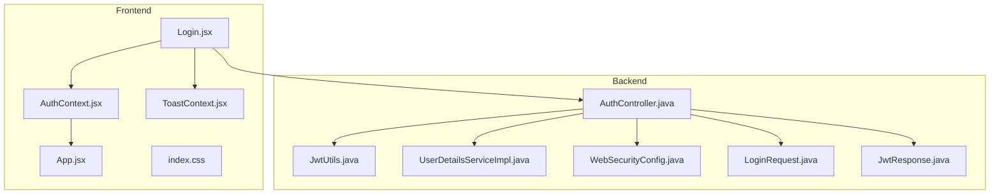
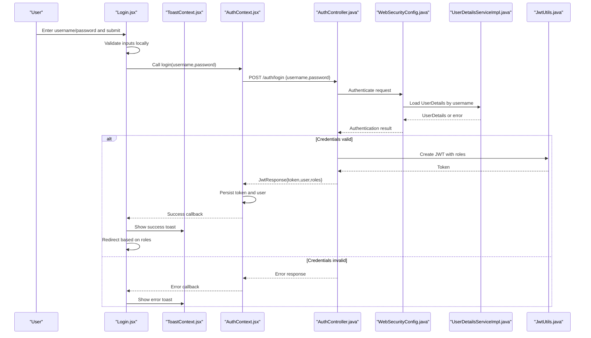
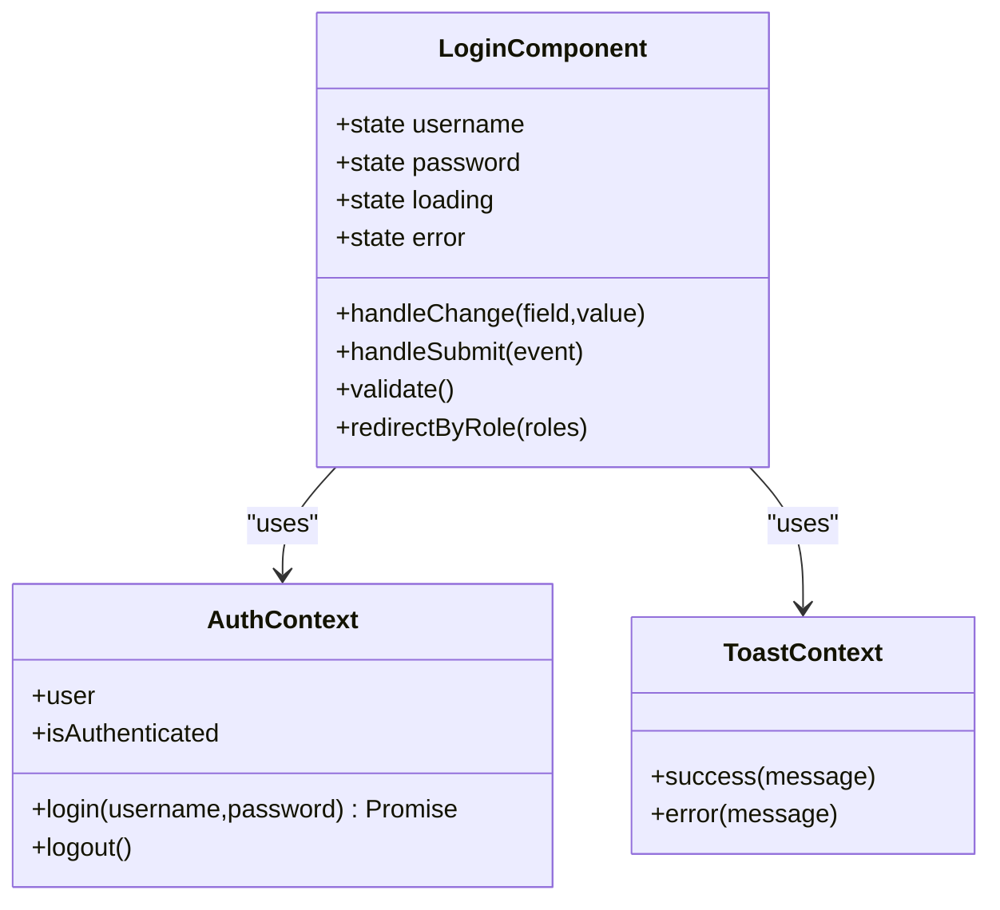
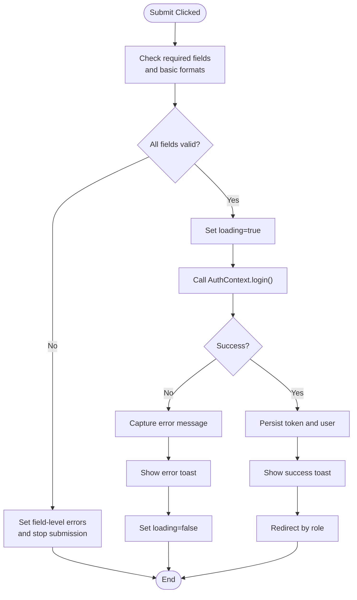
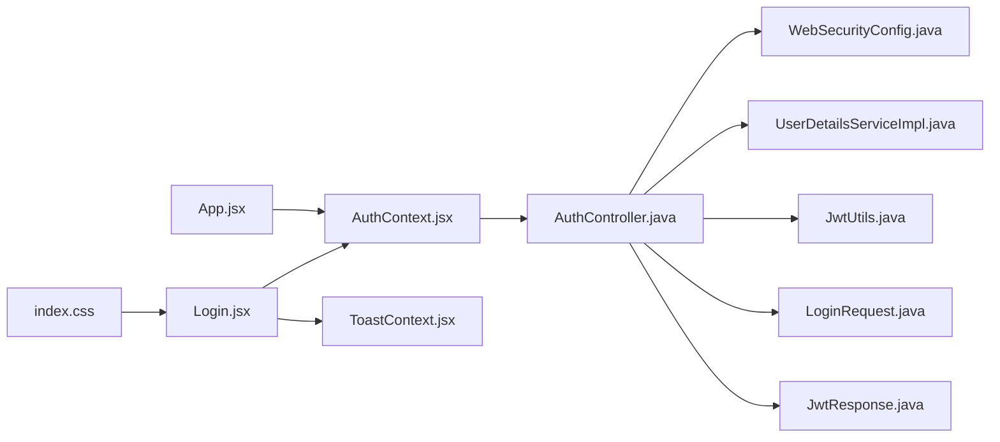

# Login Page

<cite>
**Referenced Files in This Document**
- [Login.jsx](file://frontend/src/pages/Login.jsx)
- [AuthContext.jsx](file://frontend/src/context/AuthContext.jsx)
- [ToastContext.jsx](file://frontend/src/context/ToastContext.jsx)
- [App.jsx](file://frontend/src/App.jsx)
- [index.css](file://frontend/src/index.css)
- [AuthController.java](file://backend/src/main/java/com/ceb/billing/controllers/AuthController.java)
- [JwtUtils.java](file://backend/src/main/java/com/ceb/billing/config/JwtUtils.java)
- [UserDetailsServiceImpl.java](file://backend/src/main/java/com/ceb/billing/config/UserDetailsServiceImpl.java)
- [WebSecurityConfig.java](file://backend/src/main/java/com/ceb/billing/config/WebSecurityConfig.java)
- [LoginRequest.java](file://backend/src/main/java/com/ceb/billing/models/LoginRequest.java)
- [JwtResponse.java](file://backend/src/main/java/com/ceb/billing/models/JwtResponse.java)
</cite>

## Table of Contents
1. [Introduction](#introduction)
2. [Project Structure](#project-structure)
3. [Core Components](#core-components)
4. [Architecture Overview](#architecture-overview)
5. [Detailed Component Analysis](#detailed-component-analysis)
6. [Dependency Analysis](#dependency-analysis)
7. [Performance Considerations](#performance-considerations)
8. [Troubleshooting Guide](#troubleshooting-guide)
9. [Conclusion](#conclusion)

## Introduction
This document explains the Login page component and its end-to-end authentication flow. It covers form validation, error handling, integration with AuthContext, JWT token lifecycle, password encryption on the backend, role-based redirection, user feedback mechanisms, and responsive design considerations. The goal is to help developers understand how the login process works from UI submission through backend verification to client-side state management and navigation.

## Project Structure
The Login feature spans both frontend and backend:
- Frontend: React components and contexts for UI, state, and notifications.
- Backend: Spring Boot controllers, security configuration, JWT utilities, and request/response models.

**Diagram sources**
- [Login.jsx](file://frontend/src/pages/Login.jsx)
- [AuthContext.jsx](file://frontend/src/context/AuthContext.jsx)
- [ToastContext.jsx](file://frontend/src/context/ToastContext.jsx)
- [App.jsx](file://frontend/src/App.jsx)
- [index.css](file://frontend/src/index.css)
- [AuthController.java](file://backend/src/main/java/com/ceb/billing/controllers/AuthController.java)
- [JwtUtils.java](file://backend/src/main/java/com/ceb/billing/config/JwtUtils.java)
- [UserDetailsServiceImpl.java](file://backend/src/main/java/com/ceb/billing/config/UserDetailsServiceImpl.java)
- [WebSecurityConfig.java](file://backend/src/main/java/com/ceb/billing/config/WebSecurityConfig.java)
- [LoginRequest.java](file://backend/src/main/java/com/ceb/billing/models/LoginRequest.java)
- [JwtResponse.java](file://backend/src/main/java/com/ceb/billing/models/JwtResponse.java)

**Section sources**
- [Login.jsx](file://frontend/src/pages/Login.jsx)
- [AuthContext.jsx](file://frontend/src/context/AuthContext.jsx)
- [ToastContext.jsx](file://frontend/src/context/ToastContext.jsx)
- [App.jsx](file://frontend/src/App.jsx)
- [index.css](file://frontend/src/index.css)
- [AuthController.java](file://backend/src/main/java/com/ceb/billing/controllers/AuthController.java)
- [JwtUtils.java](file://backend/src/main/java/com/ceb/billing/config/JwtUtils.java)
- [UserDetailsServiceImpl.java](file://backend/src/main/java/com/ceb/billing/config/UserDetailsServiceImpl.java)
- [WebSecurityConfig.java](file://backend/src/main/java/com/ceb/billing/config/WebSecurityConfig.java)
- [LoginRequest.java](file://backend/src/main/java/com/ceb/billing/models/LoginRequest.java)
- [JwtResponse.java](file://backend/src/main/java/com/ceb/billing/models/JwtResponse.java)

## Core Components
- Login page component: Renders the login form, handles input changes, validates fields, submits credentials, manages loading/error states, and triggers navigation based on roles.
- AuthContext: Provides centralized authentication state (user info, tokens), exposes login/logout actions, persists session data, and guards routes.
- ToastContext: Displays success and error messages to users during login attempts.
- Backend AuthController: Exposes authentication endpoints, validates credentials, issues JWTs, and returns role information.
- Security and JWT utilities: Configure security rules, load user details, and manage token creation/validation.

Key responsibilities:
- Form submission and validation on the client side.
- API calls to the authentication endpoint.
- Storing and using JWT tokens securely.
- Role-based redirection after successful login.
- User feedback via toast notifications.

**Section sources**
- [Login.jsx](file://frontend/src/pages/Login.jsx)
- [AuthContext.jsx](file://frontend/src/context/AuthContext.jsx)
- [ToastContext.jsx](file://frontend/src/context/ToastContext.jsx)
- [AuthController.java](file://backend/src/main/java/com/ceb/billing/controllers/AuthController.java)
- [JwtUtils.java](file://backend/src/main/java/com/ceb/billing/config/JwtUtils.java)
- [UserDetailsServiceImpl.java](file://backend/src/main/java/com/ceb/billing/config/UserDetailsServiceImpl.java)
- [WebSecurityConfig.java](file://backend/src/main/java/com/ceb/billing/config/WebSecurityConfig.java)
- [LoginRequest.java](file://backend/src/main/java/com/ceb/billing/models/LoginRequest.java)
- [JwtResponse.java](file://backend/src/main/java/com/ceb/billing/models/JwtResponse.java)

## Architecture Overview
The login flow integrates React UI with Spring Security and JWT:

**Diagram sources**
- [Login.jsx](file://frontend/src/pages/Login.jsx)
- [AuthContext.jsx](file://frontend/src/context/AuthContext.jsx)
- [ToastContext.jsx](file://frontend/src/context/ToastContext.jsx)
- [AuthController.java](file://backend/src/main/java/com/ceb/billing/controllers/AuthController.java)
- [WebSecurityConfig.java](file://backend/src/main/java/com/ceb/billing/config/WebSecurityConfig.java)
- [UserDetailsServiceImpl.java](file://backend/src/main/java/com/ceb/billing/config/UserDetailsServiceImpl.java)
- [JwtUtils.java](file://backend/src/main/java/com/ceb/billing/config/JwtUtils.java)

## Detailed Component Analysis

### Login Page Component
Responsibilities:
- Render username and password fields with labels and placeholders.
- Handle input changes and maintain local form state.
- Perform client-side validation (required fields, format checks).
- Submit credentials to the authentication endpoint via AuthContext.
- Manage loading and error states; show toasts for feedback.
- Redirect users based on roles returned by the backend.

Form submission pattern:
- On submit, prevent default behavior, validate inputs, set loading state, call the context’s login function, handle success or error, and navigate accordingly.

Validation approach:
- Required checks for username and password.
- Optional constraints such as minimum length or allowed characters can be enforced before sending requests.

Error handling:
- Network errors and server errors are caught and surfaced via toast notifications.
- Clear previous errors when starting a new attempt.

Role-based redirection:
- After successful login, inspect roles from the response and route to appropriate pages (e.g., admin vs regular user).

Responsive design:
- Use CSS classes and media queries to ensure usability across devices.

Code snippet paths:
- [Login.jsx](file://frontend/src/pages/Login.jsx)

**Section sources**
- [Login.jsx](file://frontend/src/pages/Login.jsx)

#### Class Diagram: Login Component Interactions

**Diagram sources**
- [Login.jsx](file://frontend/src/pages/Login.jsx)
- [AuthContext.jsx](file://frontend/src/context/AuthContext.jsx)
- [ToastContext.jsx](file://frontend/src/context/ToastContext.jsx)

### AuthContext Integration
Responsibilities:
- Provide login/logout functions.
- Maintain authenticated user state and token persistence.
- Expose isAuthenticated flag for routing guards.
- Store JWT securely (e.g., httpOnly cookie or secure storage) and attach it to subsequent requests if needed.

State management patterns:
- Centralized state via React Context.
- Actions encapsulated in context provider.
- Persistence layer integrated within context to survive refreshes.

Integration points:
- Login component calls context.login().
- App uses context.isAuthenticated to protect routes.

Code snippet paths:
- [AuthContext.jsx](file://frontend/src/context/AuthContext.jsx)
- [App.jsx](file://frontend/src/App.jsx)

**Section sources**
- [AuthContext.jsx](file://frontend/src/context/AuthContext.jsx)
- [App.jsx](file://frontend/src/App.jsx)

### Backend Authentication Endpoint
Responsibilities:
- Accept login requests with username and password.
- Authenticate against user store via Spring Security.
- Generate JWT containing user identity and roles.
- Return structured response including token and user metadata.

Models:
- LoginRequest defines incoming payload structure.
- JwtResponse defines outgoing payload structure.

Security configuration:
- WebSecurityConfig secures endpoints and configures JWT filter.
- UserDetailsServiceImpl loads user details and password verification.

Password encryption:
- Passwords are stored encrypted on the backend and verified using a configured encoder.

Code snippet paths:
- [AuthController.java](file://backend/src/main/java/com/ceb/billing/controllers/AuthController.java)
- [LoginRequest.java](file://backend/src/main/java/com/ceb/billing/models/LoginRequest.java)
- [JwtResponse.java](file://backend/src/main/java/com/ceb/billing/models/JwtResponse.java)
- [WebSecurityConfig.java](file://backend/src/main/java/com/ceb/billing/config/WebSecurityConfig.java)
- [UserDetailsServiceImpl.java](file://backend/src/main/java/com/ceb/billing/config/UserDetailsServiceImpl.java)
- [JwtUtils.java](file://backend/src/main/java/com/ceb/billing/config/JwtUtils.java)

**Section sources**
- [AuthController.java](file://backend/src/main/java/com/ceb/billing/controllers/AuthController.java)
- [LoginRequest.java](file://backend/src/main/java/com/ceb/billing/models/LoginRequest.java)
- [JwtResponse.java](file://backend/src/main/java/com/ceb/billing/models/JwtResponse.java)
- [WebSecurityConfig.java](file://backend/src/main/java/com/ceb/billing/config/WebSecurityConfig.java)
- [UserDetailsServiceImpl.java](file://backend/src/main/java/com/ceb/billing/config/UserDetailsServiceImpl.java)
- [JwtUtils.java](file://backend/src/main/java/com/ceb/billing/config/JwtUtils.java)

### Flowchart: Client-Side Validation and Submission

[No sources needed since this diagram shows conceptual workflow, not actual code structure]

## Dependency Analysis
The Login feature depends on several modules and services:

**Diagram sources**
- [Login.jsx](file://frontend/src/pages/Login.jsx)
- [AuthContext.jsx](file://frontend/src/context/AuthContext.jsx)
- [ToastContext.jsx](file://frontend/src/context/ToastContext.jsx)
- [AuthController.java](file://backend/src/main/java/com/ceb/billing/controllers/AuthController.java)
- [WebSecurityConfig.java](file://backend/src/main/java/com/ceb/billing/config/WebSecurityConfig.java)
- [UserDetailsServiceImpl.java](file://backend/src/main/java/com/ceb/billing/config/UserDetailsServiceImpl.java)
- [JwtUtils.java](file://backend/src/main/java/com/ceb/billing/config/JwtUtils.java)
- [LoginRequest.java](file://backend/src/main/java/com/ceb/billing/models/LoginRequest.java)
- [JwtResponse.java](file://backend/src/main/java/com/ceb/billing/models/JwtResponse.java)
- [App.jsx](file://frontend/src/App.jsx)
- [index.css](file://frontend/src/index.css)

**Section sources**
- [Login.jsx](file://frontend/src/pages/Login.jsx)
- [AuthContext.jsx](file://frontend/src/context/AuthContext.jsx)
- [ToastContext.jsx](file://frontend/src/context/ToastContext.jsx)
- [AuthController.java](file://backend/src/main/java/com/ceb/billing/controllers/AuthController.java)
- [WebSecurityConfig.java](file://backend/src/main/java/com/ceb/billing/config/WebSecurityConfig.java)
- [UserDetailsServiceImpl.java](file://backend/src/main/java/com/ceb/billing/config/UserDetailsServiceImpl.java)
- [JwtUtils.java](file://backend/src/main/java/com/ceb/billing/config/JwtUtils.java)
- [LoginRequest.java](file://backend/src/main/java/com/ceb/billing/models/LoginRequest.java)
- [JwtResponse.java](file://backend/src/main/java/com/ceb/billing/models/JwtResponse.java)
- [App.jsx](file://frontend/src/App.jsx)
- [index.css](file://frontend/src/index.css)

## Performance Considerations
- Debounce or throttle repeated submissions to avoid redundant network calls.
- Minimize re-renders by memoizing callbacks and derived values where applicable.
- Keep form state lightweight; only store necessary fields.
- Avoid heavy computations in render; move logic to event handlers or effects.
- Ensure efficient CSS usage and avoid layout thrashing for responsive layouts.

[No sources needed since this section provides general guidance]

## Troubleshooting Guide
Common issues and resolutions:
- Invalid credentials: Verify backend password encoding and user existence; check error responses from the authentication endpoint.
- CORS or network errors: Confirm API base URL and CORS settings in WebSecurityConfig.
- Missing or expired JWT: Ensure token persistence and expiration handling; refresh or logout flows should clear stale tokens.
- Role-based redirect not working: Inspect roles in JwtResponse and confirm routing logic in the login component.
- Toast not showing: Verify ToastContext integration and that success/error callbacks are invoked.

Relevant files:
- [Login.jsx](file://frontend/src/pages/Login.jsx)
- [AuthContext.jsx](file://frontend/src/context/AuthContext.jsx)
- [ToastContext.jsx](file://frontend/src/context/ToastContext.jsx)
- [AuthController.java](file://backend/src/main/java/com/ceb/billing/controllers/AuthController.java)
- [WebSecurityConfig.java](file://backend/src/main/java/com/ceb/billing/config/WebSecurityConfig.java)

**Section sources**
- [Login.jsx](file://frontend/src/pages/Login.jsx)
- [AuthContext.jsx](file://frontend/src/context/AuthContext.jsx)
- [ToastContext.jsx](file://frontend/src/context/ToastContext.jsx)
- [AuthController.java](file://backend/src/main/java/com/ceb/billing/controllers/AuthController.java)
- [WebSecurityConfig.java](file://backend/src/main/java/com/ceb/billing/config/WebSecurityConfig.java)

## Conclusion
The Login page integrates a robust client-side form with a secure backend authentication pipeline. It leverages React Context for state management, displays user feedback via toasts, and enforces role-based redirection after successful authentication. The backend uses Spring Security and JWT to issue tokens and protect resources. Following the patterns outlined here will help maintain consistency, security, and usability across the application.

[No sources needed since this section summarizes without analyzing specific files]