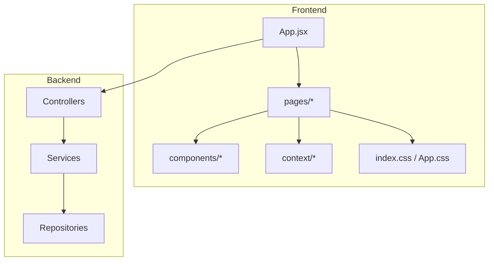
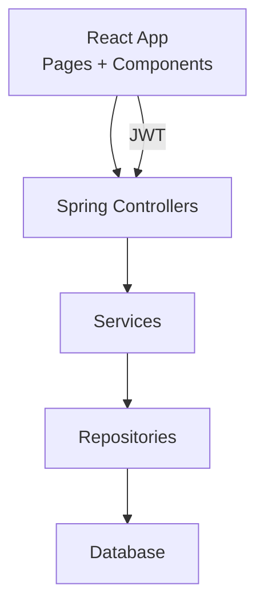
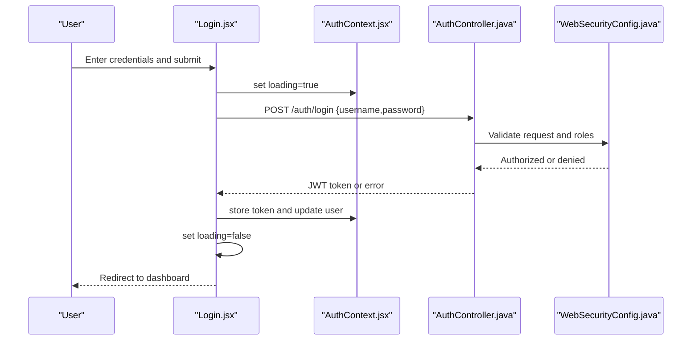
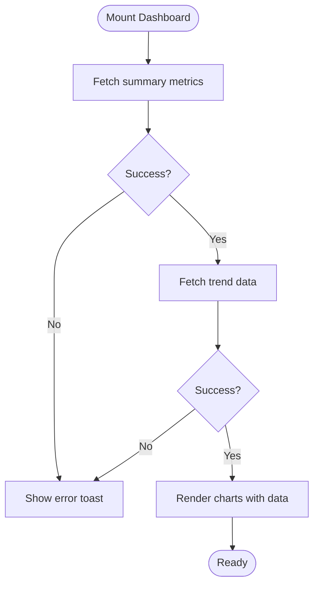
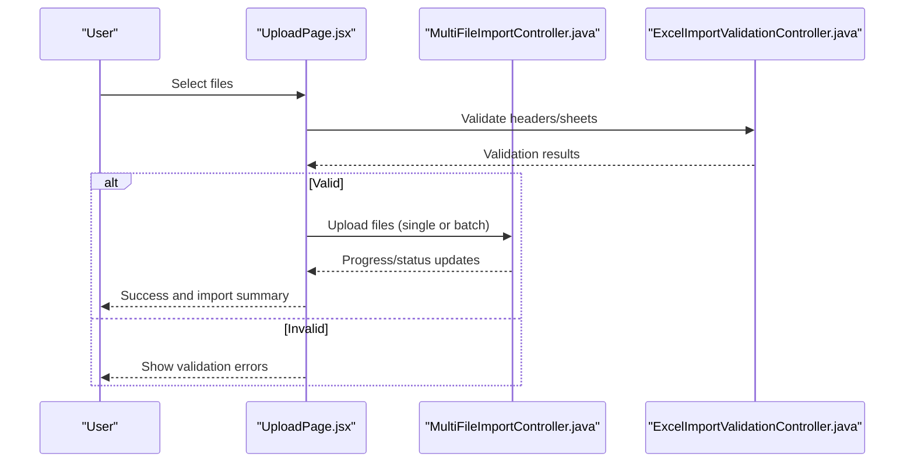
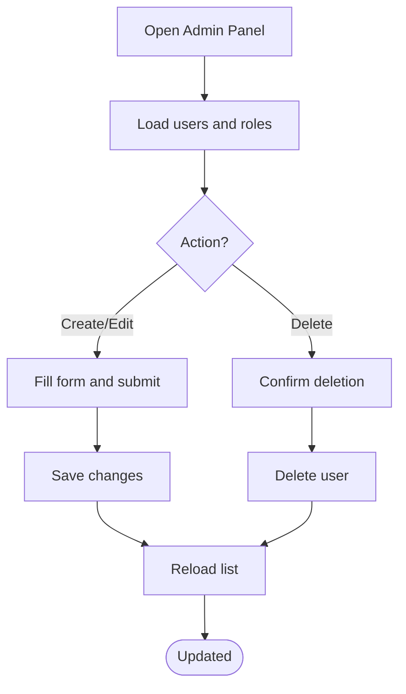
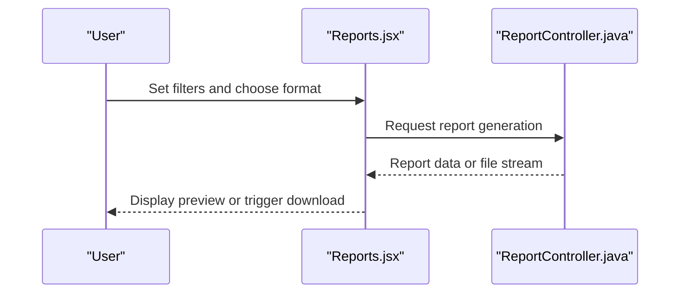
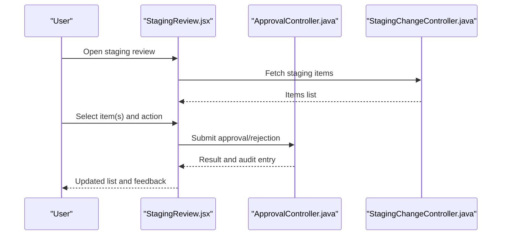
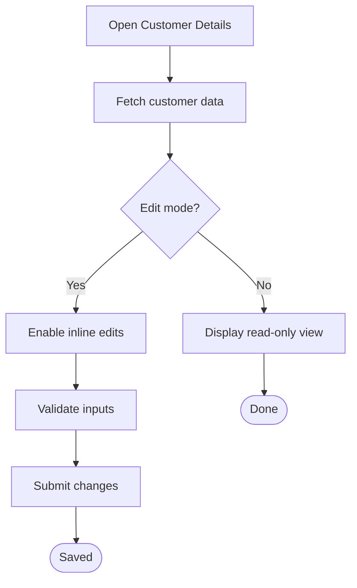
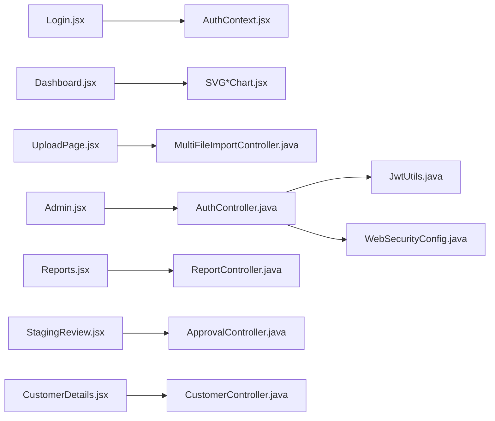

# Pages and Views

<cite>
**Referenced Files in This Document**
- [App.jsx](file://frontend/src/App.jsx)
- [Login.jsx](file://frontend/src/pages/Login.jsx)
- [Dashboard.jsx](file://frontend/src/pages/Dashboard.jsx)
- [UploadPage.jsx](file://frontend/src/pages/UploadPage.jsx)
- [Admin.jsx](file://frontend/src/pages/Admin.jsx)
- [Reports.jsx](file://frontend/src/pages/Reports.jsx)
- [StagingReview.jsx](file://frontend/src/pages/StagingReview.jsx)
- [CustomerDetails.jsx](file://frontend/src/pages/CustomerDetails.jsx)
- [AuthContext.jsx](file://frontend/src/context/AuthContext.jsx)
- [ToastContext.jsx](file://frontend/src/context/ToastContext.jsx)
- [Sidebar.jsx](file://frontend/src/components/Sidebar.jsx)
- [SVGDonutChart.jsx](file://frontend/src/components/charts/SVGDonutChart.jsx)
- [SVGLineChart.jsx](file://frontend/src/components/charts/SVGLineChart.jsx)
- [SVGPredictionChart.jsx](file://frontend/src/components/charts/SVGPredictionChart.jsx)
- [index.css](file://frontend/src/index.css)
- [App.css](file://frontend/src/App.css)
- [AuthController.java](file://backend/src/main/java/com/ceb/billing/controllers/AuthController.java)
- [DashboardController.java](file://backend/src/main/java/com/ceb/billing/controllers/DashboardController.java)
- [MultiFileImportController.java](file://backend/src/main/java/com/ceb/billing/controllers/MultiFileImportController.java)
- [ExcelImportValidationController.java](file://backend/src/main/java/com/ceb/billing/controllers/ExcelImportValidationController.java)
- [ReportController.java](file://backend/src/main/java/com/ceb/billing/controllers/ReportController.java)
- [ApprovalController.java](file://backend/src/main/java/com/ceb/billing/controllers/ApprovalController.java)
- [StagingChangeController.java](file://backend/src/main/java/com/ceb/billing/controllers/StagingChangeController.java)
- [CustomerController.java](file://backend/src/main/java/com/ceb/billing/controllers/CustomerController.java)
- [JwtUtils.java](file://backend/src/main/java/com/ceb/billing/config/JwtUtils.java)
- [WebSecurityConfig.java](file://backend/src/main/java/com/ceb/billing/config/WebSecurityConfig.java)
</cite>

## Table of Contents
1. [Introduction](#introduction)
2. [Project Structure](#project-structure)
3. [Core Components](#core-components)
4. [Architecture Overview](#architecture-overview)
5. [Detailed Component Analysis](#detailed-component-analysis)
6. [Dependency Analysis](#dependency-analysis)
7. [Performance Considerations](#performance-considerations)
8. [Troubleshooting Guide](#troubleshooting-guide)
9. [Conclusion](#conclusion)

## Introduction
This document provides comprehensive documentation for all application pages and views, focusing on user-facing functionality and how each view integrates with backend services. It covers:
- Login page authentication flow
- Dashboard data visualization
- Excel upload interface
- Admin panel functionality
- Reports generation
- Staging review workflow
- Customer details management

For each view, we explain page-specific state management, API integrations, user interaction patterns, and responsive design considerations.

## Project Structure
The frontend is a React application organized by feature-based directories:
- pages: top-level routes for major features (Login, Dashboard, Upload, Admin, Reports, Staging Review, Customer Details)
- components: reusable UI elements including charts and navigation
- context: global state providers for authentication and toast notifications
- assets and styles: CSS files for layout and theming

[No sources needed since this diagram shows conceptual structure]

## Core Components
- Authentication Context: Provides login state, token storage, and protected route guards.
- Toast Context: Centralized notification system for success/error feedback across pages.
- Sidebar: Global navigation component used by authenticated pages.
- Charts: Reusable SVG chart components for dashboard visualizations.

Key responsibilities:
- AuthContext manages JWT lifecycle and exposes auth state to the app.
- ToastContext dispatches messages from any component via a simple API.
- Sidebar renders navigation links and respects current route.
- Chart components accept data props and render responsive SVG visuals.

**Section sources**
- [AuthContext.jsx](file://frontend/src/context/AuthContext.jsx)
- [ToastContext.jsx](file://frontend/src/context/ToastContext.jsx)
- [Sidebar.jsx](file://frontend/src/components/Sidebar.jsx)
- [SVGDonutChart.jsx](file://frontend/src/components/charts/SVGDonutChart.jsx)
- [SVGLineChart.jsx](file://frontend/src/components/charts/SVGLineChart.jsx)
- [SVGPredictionChart.jsx](file://frontend/src/components/charts/SVGPredictionChart.jsx)

## Architecture Overview
High-level client-server interactions:
- The React app calls REST endpoints exposed by Spring controllers.
- Controllers orchestrate business logic through services and repositories.
- Security is enforced via JWT filters and access rules.

**Diagram sources**
- [AuthController.java](file://backend/src/main/java/com/ceb/billing/controllers/AuthController.java)
- [DashboardController.java](file://backend/src/main/java/com/ceb/billing/controllers/DashboardController.java)
- [MultiFileImportController.java](file://backend/src/main/java/com/ceb/billing/controllers/MultiFileImportController.java)
- [ReportController.java](file://backend/src/main/java/com/ceb/billing/controllers/ReportController.java)
- [ApprovalController.java](file://backend/src/main/java/com/ceb/billing/controllers/ApprovalController.java)
- [StagingChangeController.java](file://backend/src/main/java/com/ceb/billing/controllers/StagingChangeController.java)
- [CustomerController.java](file://backend/src/main/java/com/ceb/billing/controllers/CustomerController.java)

## Detailed Component Analysis

### Login Page
Purpose: Authenticate users and establish a session using JWT.

State management:
- Local form state for username/password.
- Loading and error states during authentication.
- Redirects based on successful login.

API integration:
- POST to authentication endpoint to obtain JWT.
- Stores token securely and updates global auth context.

User interactions:
- Submit button triggers login.
- Inline validation and error messages.
- Redirect to dashboard upon success.

Responsive design:
- Centered card layout that adapts to mobile screens.
- Uses base CSS variables and flexbox/grid for alignment.

**Diagram sources**
- [Login.jsx](file://frontend/src/pages/Login.jsx)
- [AuthContext.jsx](file://frontend/src/context/AuthContext.jsx)
- [AuthController.java](file://backend/src/main/java/com/ceb/billing/controllers/AuthController.java)
- [WebSecurityConfig.java](file://backend/src/main/java/com/ceb/billing/config/WebSecurityConfig.java)

**Section sources**
- [Login.jsx](file://frontend/src/pages/Login.jsx)
- [AuthContext.jsx](file://frontend/src/context/AuthContext.jsx)
- [AuthController.java](file://backend/src/main/java/com/ceb/billing/controllers/AuthController.java)
- [WebSecurityConfig.java](file://backend/src/main/java/com/ceb/billing/config/WebSecurityConfig.java)

### Dashboard
Purpose: Provide an overview of key metrics and trends with interactive charts.

State management:
- Fetches summary data and time-series data on mount.
- Manages loading, error, and data states.
- Optional filters (e.g., date range) trigger refetch.

API integration:
- GET endpoints for aggregated metrics and chart datasets.
- Handles pagination or limits if applicable.

User interactions:
- Click-to-expand details, hover tooltips, and legend toggles.
- Refresh button to reload latest data.

Responsive design:
- Grid layout with flexible chart containers.
- SVG charts scale within their containers; labels adjust for small screens.

**Diagram sources**
- [Dashboard.jsx](file://frontend/src/pages/Dashboard.jsx)
- [DashboardController.java](file://backend/src/main/java/com/ceb/billing/controllers/DashboardController.java)
- [SVGDonutChart.jsx](file://frontend/src/components/charts/SVGDonutChart.jsx)
- [SVGLineChart.jsx](file://frontend/src/components/charts/SVGLineChart.jsx)
- [SVGPredictionChart.jsx](file://frontend/src/components/charts/SVGPredictionChart.jsx)

**Section sources**
- [Dashboard.jsx](file://frontend/src/pages/Dashboard.jsx)
- [DashboardController.java](file://backend/src/main/java/com/ceb/billing/controllers/DashboardController.java)
- [SVGDonutChart.jsx](file://frontend/src/components/charts/SVGDonutChart.jsx)
- [SVGLineChart.jsx](file://frontend/src/components/charts/SVGLineChart.jsx)
- [SVGPredictionChart.jsx](file://frontend/src/components/charts/SVGPredictionChart.jsx)

### Upload Interface (Excel)
Purpose: Allow users to upload one or multiple Excel files, preview results, and validate headers/sheets.

State management:
- File selection state and progress tracking.
- Validation errors and warnings surfaced per file.
- Batch processing status for multi-file uploads.

API integration:
- Single/multiple file upload endpoints.
- Validation endpoints for header mapping and sheet configuration.
- Polling or callbacks for long-running imports.

User interactions:
- Drag-and-drop or file picker.
- View validation report and fix issues before committing.
- Cancel or retry failed files.

Responsive design:
- Full-width drop zone with clear instructions.
- Collapsible validation panels for narrow screens.

**Diagram sources**
- [UploadPage.jsx](file://frontend/src/pages/UploadPage.jsx)
- [MultiFileImportController.java](file://backend/src/main/java/com/ceb/billing/controllers/MultiFileImportController.java)
- [ExcelImportValidationController.java](file://backend/src/main/java/com/ceb/billing/controllers/ExcelImportValidationController.java)

**Section sources**
- [UploadPage.jsx](file://frontend/src/pages/UploadPage.jsx)
- [MultiFileImportController.java](file://backend/src/main/java/com/ceb/billing/controllers/MultiFileImportController.java)
- [ExcelImportValidationController.java](file://backend/src/main/java/com/ceb/billing/controllers/ExcelImportValidationController.java)

### Admin Panel
Purpose: Manage users, roles, and system settings.

State management:
- Lists of users and roles fetched on demand.
- Form state for create/update operations.
- Confirmation dialogs for destructive actions.

API integration:
- CRUD endpoints for user management.
- Role assignment and permission checks.

User interactions:
- Search/filter users.
- Create/edit/delete users and assign roles.
- Bulk actions where supported.

Responsive design:
- Data tables with horizontal scroll on small devices.
- Modal dialogs adapt to screen size.

**Diagram sources**
- [Admin.jsx](file://frontend/src/pages/Admin.jsx)
- [AuthController.java](file://backend/src/main/java/com/ceb/billing/controllers/AuthController.java)

**Section sources**
- [Admin.jsx](file://frontend/src/pages/Admin.jsx)
- [AuthController.java](file://backend/src/main/java/com/ceb/billing/controllers/AuthController.java)

### Reports Generation
Purpose: Generate and export reports based on selected criteria.

State management:
- Report parameters (filters, date ranges, formats).
- Export format selection and download handling.
- Loading indicators for long-running generation.

API integration:
- Endpoint to generate report payloads or files.
- Streaming or polling for large exports.

User interactions:
- Parameter form with validation.
- Preview option when available.
- Download generated report.

Responsive design:
- Compact parameter forms on mobile.
- Clear call-to-action buttons for export.

**Diagram sources**
- [Reports.jsx](file://frontend/src/pages/Reports.jsx)
- [ReportController.java](file://backend/src/main/java/com/ceb/billing/controllers/ReportController.java)

**Section sources**
- [Reports.jsx](file://frontend/src/pages/Reports.jsx)
- [ReportController.java](file://backend/src/main/java/com/ceb/billing/controllers/ReportController.java)

### Staging Review Workflow
Purpose: Review staged billing records, approve/reject changes, and audit decisions.

State management:
- Paginated list of staging items.
- Selection state for bulk actions.
- Change logs and approval history.

API integration:
- List staging entries with filters.
- Approve/reject endpoints with reason codes.
- Audit logging endpoints.

User interactions:
- Inspect differences and metadata.
- Approve or reject with comments.
- Navigate between batches.

Responsive design:
- Card-based detail view on mobile.
- Action buttons stacked vertically on small screens.

**Diagram sources**
- [StagingReview.jsx](file://frontend/src/pages/StagingReview.jsx)
- [ApprovalController.java](file://backend/src/main/java/com/ceb/billing/controllers/ApprovalController.java)
- [StagingChangeController.java](file://backend/src/main/java/com/ceb/billing/controllers/StagingChangeController.java)

**Section sources**
- [StagingReview.jsx](file://frontend/src/pages/StagingReview.jsx)
- [ApprovalController.java](file://backend/src/main/java/com/ceb/billing/controllers/ApprovalController.java)
- [StagingChangeController.java](file://backend/src/main/java/com/ceb/billing/controllers/StagingChangeController.java)

### Customer Details Management
Purpose: View and manage customer information and related records.

State management:
- Customer profile state and edit mode.
- Related records (e.g., billing history) loaded on demand.
- Validation for edits.

API integration:
- Get customer details and related entities.
- Update customer fields and save changes.

User interactions:
- Read-only view with edit toggle.
- Inline editing with confirmation.
- Navigation to related records.

Responsive design:
- Two-column layout collapses to single column on mobile.
- Sticky action bar for save/cancel.

**Diagram sources**
- [CustomerDetails.jsx](file://frontend/src/pages/CustomerDetails.jsx)
- [CustomerController.java](file://backend/src/main/java/com/ceb/billing/controllers/CustomerController.java)

**Section sources**
- [CustomerDetails.jsx](file://frontend/src/pages/CustomerDetails.jsx)
- [CustomerController.java](file://backend/src/main/java/com/ceb/billing/controllers/CustomerController.java)

## Dependency Analysis
Frontend dependencies:
- Pages depend on shared contexts (Auth, Toast) and reusable components (Sidebar, Charts).
- Routing is configured at the app level to protect routes based on authentication.

Backend dependencies:
- Controllers depend on services for business logic and repositories for persistence.
- Security configuration enforces JWT-based access control.

**Diagram sources**
- [Login.jsx](file://frontend/src/pages/Login.jsx)
- [AuthContext.jsx](file://frontend/src/context/AuthContext.jsx)
- [Dashboard.jsx](file://frontend/src/pages/Dashboard.jsx)
- [SVGDonutChart.jsx](file://frontend/src/components/charts/SVGDonutChart.jsx)
- [SVGLineChart.jsx](file://frontend/src/components/charts/SVGLineChart.jsx)
- [SVGPredictionChart.jsx](file://frontend/src/components/charts/SVGPredictionChart.jsx)
- [UploadPage.jsx](file://frontend/src/pages/UploadPage.jsx)
- [MultiFileImportController.java](file://backend/src/main/java/com/ceb/billing/controllers/MultiFileImportController.java)
- [Admin.jsx](file://frontend/src/pages/Admin.jsx)
- [AuthController.java](file://backend/src/main/java/com/ceb/billing/controllers/AuthController.java)
- [Reports.jsx](file://frontend/src/pages/Reports.jsx)
- [ReportController.java](file://backend/src/main/java/com/ceb/billing/controllers/ReportController.java)
- [StagingReview.jsx](file://frontend/src/pages/StagingReview.jsx)
- [ApprovalController.java](file://backend/src/main/java/com/ceb/billing/controllers/ApprovalController.java)
- [CustomerDetails.jsx](file://frontend/src/pages/CustomerDetails.jsx)
- [CustomerController.java](file://backend/src/main/java/com/ceb/billing/controllers/CustomerController.java)
- [JwtUtils.java](file://backend/src/main/java/com/ceb/billing/config/JwtUtils.java)
- [WebSecurityConfig.java](file://backend/src/main/java/com/ceb/billing/config/WebSecurityConfig.java)

**Section sources**
- [App.jsx](file://frontend/src/App.jsx)
- [AuthContext.jsx](file://frontend/src/context/AuthContext.jsx)
- [AuthController.java](file://backend/src/main/java/com/ceb/billing/controllers/AuthController.java)
- [WebSecurityConfig.java](file://backend/src/main/java/com/ceb/billing/config/WebSecurityConfig.java)
- [JwtUtils.java](file://backend/src/main/java/com/ceb/billing/config/JwtUtils.java)

## Performance Considerations
- Use memoization and lazy loading for heavy components and routes.
- Debounce search inputs and filter changes.
- Implement pagination and virtualization for large lists.
- Cache static chart configurations and reuse chart instances where possible.
- Stream or chunk large file downloads and show progress indicators.

[No sources needed since this section provides general guidance]

## Troubleshooting Guide
Common issues and resolutions:
- Authentication failures: Verify credentials and ensure JWT is stored correctly; check security config and token expiration.
- Upload validation errors: Review header mappings and sheet configurations; use validation reports to correct issues.
- Dashboard empty data: Check network requests and controller responses; handle loading and error states gracefully.
- Staging approvals not reflected: Confirm audit logs and approval endpoints; refresh the list after actions.
- Customer updates failing: Validate input constraints and server-side rules; display actionable error messages.

Operational tips:
- Use toast notifications for consistent feedback.
- Log client-side errors and include context for debugging.
- Ensure CORS and security headers are properly configured.

**Section sources**
- [ToastContext.jsx](file://frontend/src/context/ToastContext.jsx)
- [AuthController.java](file://backend/src/main/java/com/ceb/billing/controllers/AuthController.java)
- [WebSecurityConfig.java](file://backend/src/main/java/com/ceb/billing/config/WebSecurityConfig.java)

## Conclusion
This documentation outlined the structure and behavior of each application page and view, detailing state management, API integrations, user interactions, and responsive design strategies. By following these guidelines, developers can maintain consistency, improve usability, and ensure robust performance across the application.