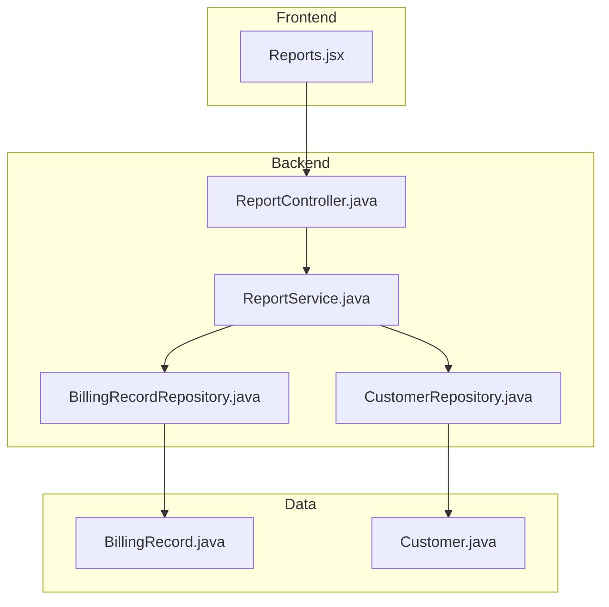
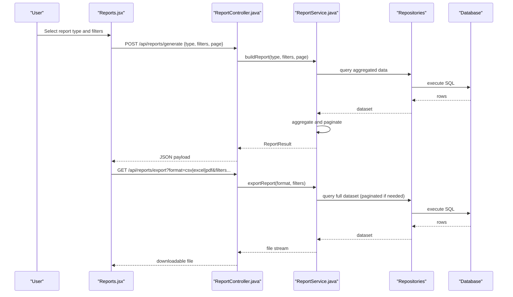
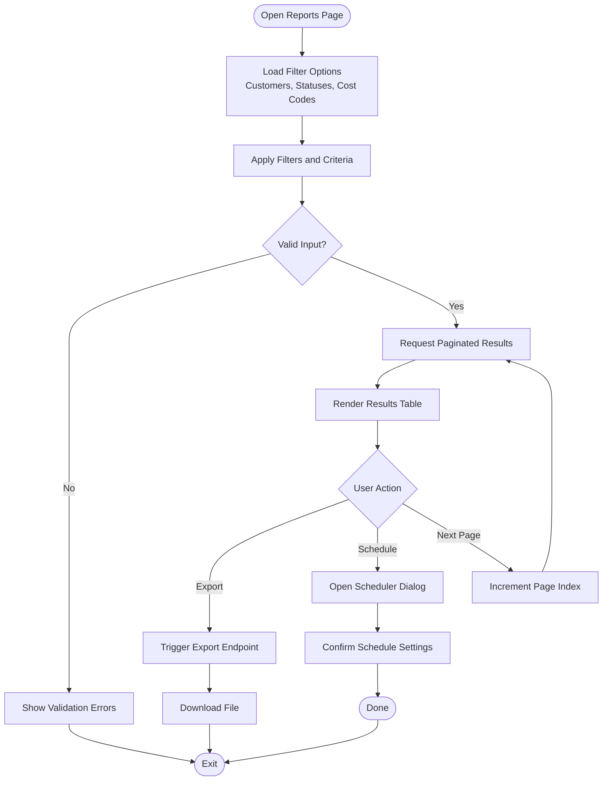
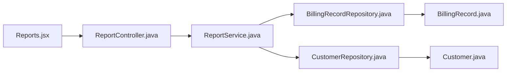

# Reports Page

<cite>
**Referenced Files in This Document**
- [Reports.jsx](file://frontend/src/pages/Reports.jsx)
- [ReportController.java](file://backend/src/main/java/com/ceb/billing/controllers/ReportController.java)
- [ReportService.java](file://backend/src/main/java/com/ceb/billing/services/ReportService.java)
- [BillingRecordRepository.java](file://backend/src/main/java/com/ceb/billing/repositories/BillingRecordRepository.java)
- [CustomerRepository.java](file://backend/src/main/java/com/ceb/billing/repositories/CustomerRepository.java)
- [BillingRecord.java](file://backend/src/main/java/com/ceb/billing/entities/BillingRecord.java)
- [Customer.java](file://backend/src/main/java/com/ceb/billing/entities/Customer.java)
</cite>

## Table of Contents
1. [Introduction](#introduction)
2. [Project Structure](#project-structure)
3. [Core Components](#core-components)
4. [Architecture Overview](#architecture-overview)
5. [Detailed Component Analysis](#detailed-component-analysis)
6. [Dependency Analysis](#dependency-analysis)
7. [Performance Considerations](#performance-considerations)
8. [Troubleshooting Guide](#troubleshooting-guide)
9. [Conclusion](#conclusion)

## Introduction
This document describes the Reports page component and its end-to-end implementation for generating, filtering, exporting, and customizing reports. It explains how users can create custom reports, apply filters and criteria, generate different report formats, and schedule recurring reports. It also covers implementation details such as report templates, data aggregation, pagination for large datasets, and integration with reporting services on both frontend and backend layers.

## Project Structure
The Reports feature spans the frontend React application and the Spring Boot backend:
- Frontend: The Reports page UI is implemented in a React component that renders filters, controls, and results, and communicates with backend APIs.
- Backend: A REST controller exposes endpoints for report generation, filtering, export, and scheduling. A service layer orchestrates data retrieval, aggregation, and formatting. Repositories provide database access to billing and customer entities.

**Diagram sources**
- [Reports.jsx](file://frontend/src/pages/Reports.jsx)
- [ReportController.java](file://backend/src/main/java/com/ceb/billing/controllers/ReportController.java)
- [ReportService.java](file://backend/src/main/java/com/ceb/billing/services/ReportService.java)
- [BillingRecordRepository.java](file://backend/src/main/java/com/ceb/billing/repositories/BillingRecordRepository.java)
- [CustomerRepository.java](file://backend/src/main/java/com/ceb/billing/repositories/CustomerRepository.java)
- [BillingRecord.java](file://backend/src/main/java/com/ceb/billing/entities/BillingRecord.java)
- [Customer.java](file://backend/src/main/java/com/ceb/billing/entities/Customer.java)

**Section sources**
- [Reports.jsx](file://frontend/src/pages/Reports.jsx)
- [ReportController.java](file://backend/src/main/java/com/ceb/billing/controllers/ReportController.java)
- [ReportService.java](file://backend/src/main/java/com/ceb/billing/services/ReportService.java)
- [BillingRecordRepository.java](file://backend/src/main/java/com/ceb/billing/repositories/BillingRecordRepository.java)
- [CustomerRepository.java](file://backend/src/main/java/com/ceb/billing/repositories/CustomerRepository.java)
- [BillingRecord.java](file://backend/src/main/java/com/ceb/billing/entities/BillingRecord.java)
- [Customer.java](file://backend/src/main/java/com/ceb/billing/entities/Customer.java)

## Core Components
- Reports page (frontend): Provides user interface for selecting report types, applying filters, previewing results, exporting, and scheduling recurring reports.
- Report controller (backend): Exposes REST endpoints for listing available reports, generating filtered results, exporting in multiple formats, and managing scheduled jobs.
- Report service (backend): Implements business logic for building queries, aggregating data, applying filters, handling pagination, and producing outputs in various formats.
- Data repositories: Provide typed access to BillingRecord and Customer entities, enabling efficient filtering and aggregation.

Key responsibilities:
- Filtering: Date ranges, customer selection, status, cost codes, and other criteria.
- Aggregation: Summaries by time periods, customers, or categories.
- Export: CSV, Excel, PDF, and JSON outputs.
- Pagination: Efficiently handle large result sets with server-side paging.
- Scheduling: Create recurring jobs to run reports at intervals and deliver via email or store artifacts.

**Section sources**
- [Reports.jsx](file://frontend/src/pages/Reports.jsx)
- [ReportController.java](file://backend/src/main/java/com/ceb/billing/controllers/ReportController.java)
- [ReportService.java](file://backend/src/main/java/com/ceb/billing/services/ReportService.java)
- [BillingRecordRepository.java](file://backend/src/main/java/com/ceb/billing/repositories/BillingRecordRepository.java)
- [CustomerRepository.java](file://backend/src/main/java/com/ceb/billing/repositories/CustomerRepository.java)

## Architecture Overview
The Reports page follows a layered architecture:
- Presentation layer (React) collects user inputs and displays paginated results and exports.
- API layer (Spring MVC) validates requests, delegates to the service layer, and returns responses or file streams.
- Service layer composes repository calls, applies business rules, aggregates data, and formats outputs.
- Persistence layer (JPA repositories) executes optimized queries against the database.

**Diagram sources**
- [Reports.jsx](file://frontend/src/pages/Reports.jsx)
- [ReportController.java](file://backend/src/main/java/com/ceb/billing/controllers/ReportController.java)
- [ReportService.java](file://backend/src/main/java/com/ceb/billing/services/ReportService.java)
- [BillingRecordRepository.java](file://backend/src/main/java/com/ceb/billing/repositories/BillingRecordRepository.java)
- [CustomerRepository.java](file://backend/src/main/java/com/ceb/billing/repositories/CustomerRepository.java)

## Detailed Component Analysis

### Reports Page (Frontend)
Responsibilities:
- Render filter controls (date range, customer, status, cost code).
- Display paginated results with sorting and column visibility options.
- Trigger export actions and manage download feedback.
- Manage scheduling UI for recurring reports (create, edit, delete).

Implementation highlights:
- State management for filters, pagination, and results.
- Debounced search and filter updates to reduce network calls.
- Client-side validation before sending requests.
- Error handling and user feedback via toast notifications.

[No sources needed since this diagram shows conceptual workflow, not actual code structure]

**Section sources**
- [Reports.jsx](file://frontend/src/pages/Reports.jsx)

### Report Controller (Backend)
Responsibilities:
- Define REST endpoints for report generation, export, and scheduling.
- Validate request parameters and enforce authorization.
- Stream exported files and return structured JSON for previews.

Endpoints overview:
- Generate report: Accepts report type, filters, pagination; returns aggregated data.
- Export report: Accepts format and filters; returns file stream.
- Schedule report: Creates or updates recurring job configuration.

Security and validation:
- JWT-based authentication and role checks.
- Parameter validation for date ranges, page size limits, and allowed formats.

**Section sources**
- [ReportController.java](file://backend/src/main/java/com/ceb/billing/controllers/ReportController.java)

### Report Service (Backend)
Responsibilities:
- Build dynamic queries based on filters.
- Aggregate data across billing records and related entities.
- Implement pagination strategies for large datasets.
- Format outputs into CSV, Excel, PDF, and JSON.

Aggregation patterns:
- Group by time buckets (daily, weekly, monthly).
- Summarize totals per customer or category.
- Compute derived metrics (e.g., averages, percentages).

Pagination strategy:
- Server-side pagination using offset/limit or keyset pagination for performance.
- Cursor-based navigation when appropriate.

Export pipeline:
- Stream large datasets to avoid memory spikes.
- Use buffered writers for CSV/Excel.
- Generate PDFs with templated layouts.

**Section sources**
- [ReportService.java](file://backend/src/main/java/com/ceb/billing/services/ReportService.java)

### Data Repositories and Entities
Repositories:
- BillingRecordRepository: Access billing records with filtering and aggregation support.
- CustomerRepository: Retrieve customer lists and metadata for filters and grouping.

Entities:
- BillingRecord: Represents individual billing entries used in report calculations.
- Customer: Represents customer information linked to billing records.

Optimization considerations:
- Indexed columns for frequent filters (dates, customer IDs).
- Custom JPQL/native queries for complex aggregations.
- Batch fetching to minimize N+1 issues.

**Section sources**
- [BillingRecordRepository.java](file://backend/src/main/java/com/ceb/billing/repositories/BillingRecordRepository.java)
- [CustomerRepository.java](file://backend/src/main/java/com/ceb/billing/repositories/CustomerRepository.java)
- [BillingRecord.java](file://backend/src/main/java/com/ceb/billing/entities/BillingRecord.java)
- [Customer.java](file://backend/src/main/java/com/ceb/billing/entities/Customer.java)

### Report Templates and Customization
Template system:
- Define reusable report templates specifying fields, groupings, and summaries.
- Support conditional sections and computed columns.
- Allow users to save personal templates and share within teams.

Customization features:
- Column selection and ordering.
- Conditional formatting and thresholds.
- Saved filter presets for quick access.

Integration points:
- Template definitions stored in configuration or database tables.
- Rendering engine converts templates to output formats.

**Section sources**
- [ReportService.java](file://backend/src/main/java/com/ceb/billing/services/ReportService.java)
- [ReportController.java](file://backend/src/main/java/com/ceb/billing/controllers/ReportController.java)

### Scheduling Recurring Reports
Capabilities:
- Create schedules with frequency (daily, weekly, monthly).
- Configure recipients and delivery methods (email, storage).
- Manage active schedules and view execution history.

Implementation notes:
- Use a task scheduler to trigger report generation.
- Persist schedule configurations and audit logs.
- Handle failures with retries and notifications.

**Section sources**
- [ReportController.java](file://backend/src/main/java/com/ceb/billing/controllers/ReportController.java)
- [ReportService.java](file://backend/src/main/java/com/ceb/billing/services/ReportService.java)

## Dependency Analysis
The Reports feature has clear separation of concerns:
- Frontend depends on backend controllers for all operations.
- Controllers depend on services for business logic.
- Services depend on repositories for data access.
- Repositories depend on entity models and database schema.

**Diagram sources**
- [Reports.jsx](file://frontend/src/pages/Reports.jsx)
- [ReportController.java](file://backend/src/main/java/com/ceb/billing/controllers/ReportController.java)
- [ReportService.java](file://backend/src/main/java/com/ceb/billing/services/ReportService.java)
- [BillingRecordRepository.java](file://backend/src/main/java/com/ceb/billing/repositories/BillingRecordRepository.java)
- [CustomerRepository.java](file://backend/src/main/java/com/ceb/billing/repositories/CustomerRepository.java)
- [BillingRecord.java](file://backend/src/main/java/com/ceb/billing/entities/BillingRecord.java)
- [Customer.java](file://backend/src/main/java/com/ceb/billing/entities/Customer.java)

**Section sources**
- [Reports.jsx](file://frontend/src/pages/Reports.jsx)
- [ReportController.java](file://backend/src/main/java/com/ceb/billing/controllers/ReportController.java)
- [ReportService.java](file://backend/src/main/java/com/ceb/billing/services/ReportService.java)
- [BillingRecordRepository.java](file://backend/src/main/java/com/ceb/billing/repositories/BillingRecordRepository.java)
- [CustomerRepository.java](file://backend/src/main/java/com/ceb/billing/repositories/CustomerRepository.java)
- [BillingRecord.java](file://backend/src/main/java/com/ceb/billing/entities/BillingRecord.java)
- [Customer.java](file://backend/src/main/java/com/ceb/billing/entities/Customer.java)

## Performance Considerations
- Server-side pagination: Prefer keyset pagination for deep pages to avoid expensive OFFSET queries.
- Query optimization: Use indexed columns for filters and joins; leverage native queries for heavy aggregations.
- Streaming exports: Stream large datasets to prevent memory pressure during CSV/Excel/PDF generation.
- Caching: Cache frequently accessed lookup data (customers, cost codes) to reduce repeated queries.
- Rate limiting: Enforce maximum page sizes and throttle export requests to protect resources.

[No sources needed since this section provides general guidance]

## Troubleshooting Guide
Common issues and resolutions:
- Invalid date ranges: Ensure start date precedes end date; validate on both frontend and backend.
- Missing permissions: Verify user roles and JWT tokens; check controller security annotations.
- Large export timeouts: Increase timeout settings or switch to asynchronous export with progress tracking.
- Empty results: Confirm filter values exist in the database; add debug logging for query parameters.
- Pagination anomalies: Check total count accuracy and ensure stable sort keys for consistent pages.

Operational tips:
- Enable detailed logging for report generation flows.
- Monitor database query performance and adjust indexes.
- Review error responses from the controller and service layers.

**Section sources**
- [ReportController.java](file://backend/src/main/java/com/ceb/billing/controllers/ReportController.java)
- [ReportService.java](file://backend/src/main/java/com/ceb/billing/services/ReportService.java)

## Conclusion
The Reports page provides a comprehensive solution for generating, filtering, exporting, and scheduling reports. Its layered architecture ensures maintainability and scalability, while robust filtering, aggregation, and pagination mechanisms support large datasets. With template-driven customization and flexible export options, it meets diverse reporting needs across the application.