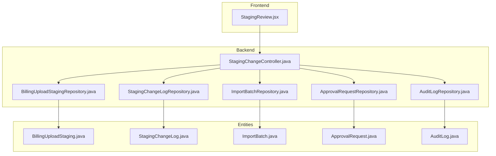
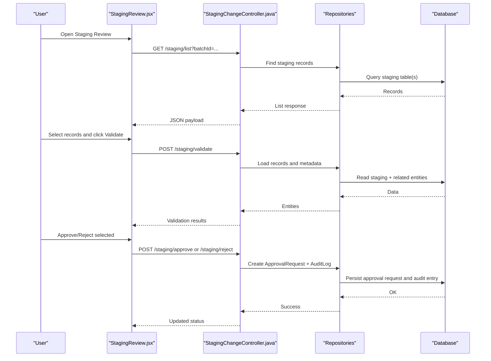
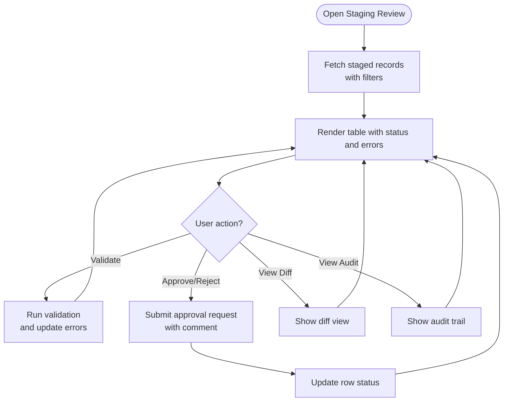
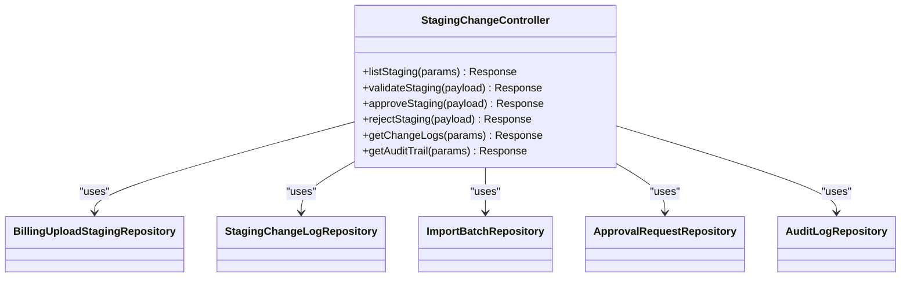
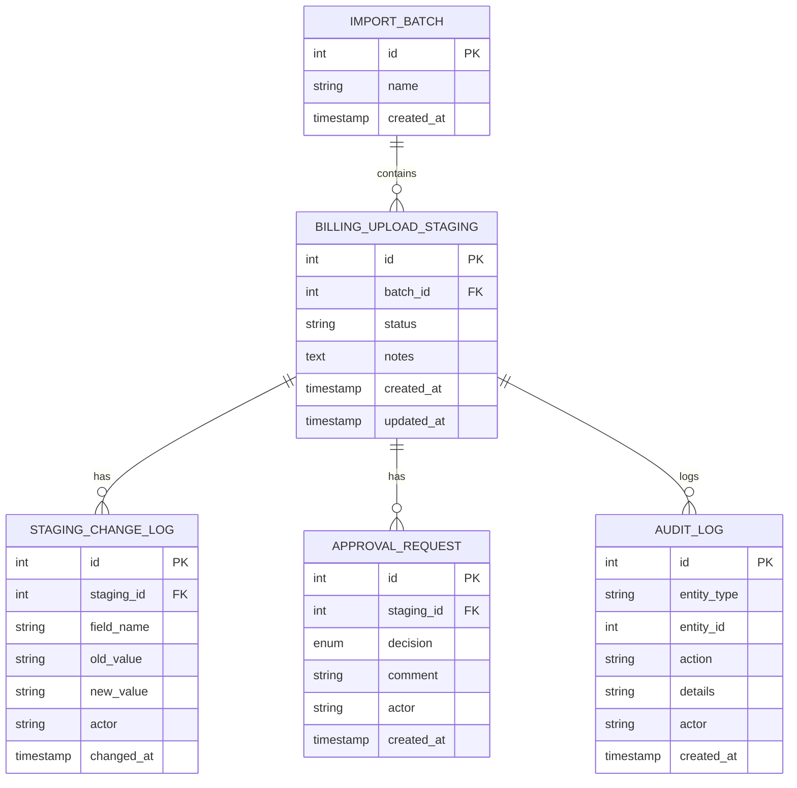
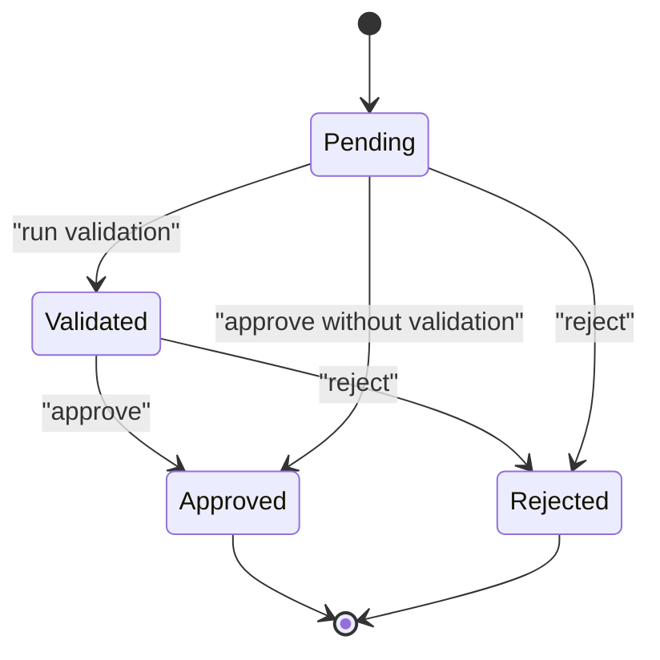
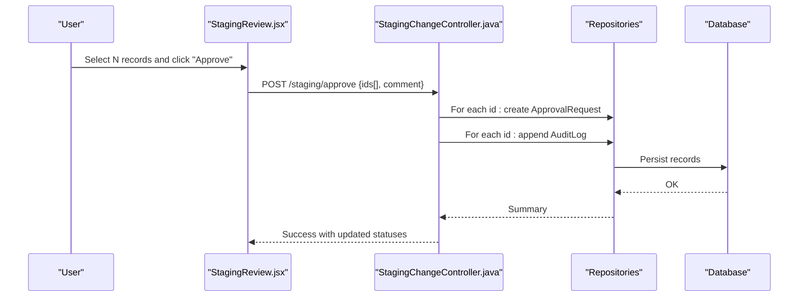
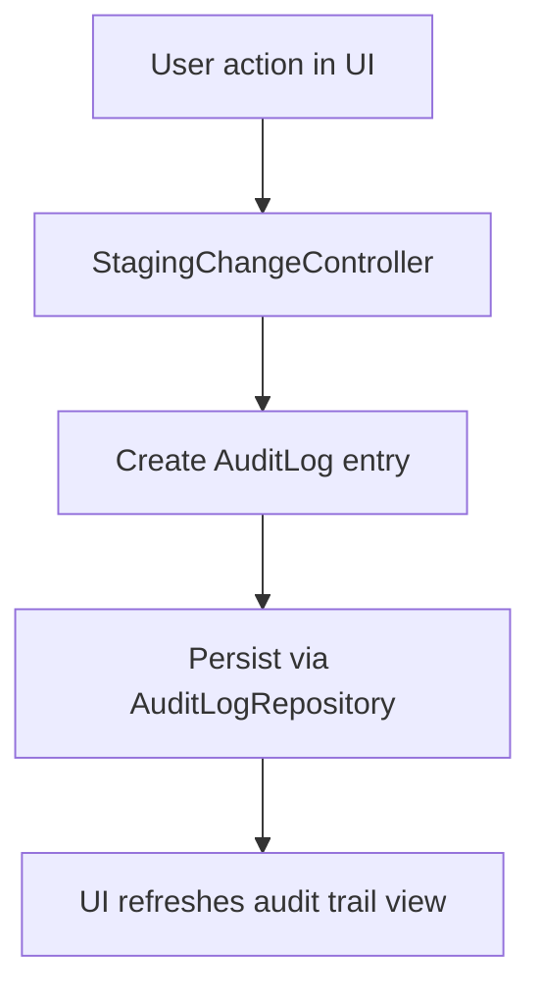
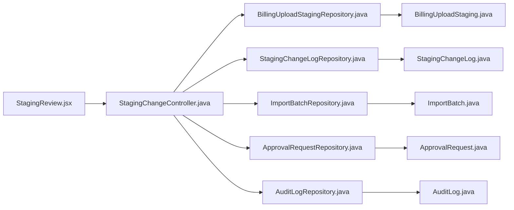

# Staging Review Page

<cite>
**Referenced Files in This Document**
- [StagingReview.jsx](file://frontend/src/pages/StagingReview.jsx)
- [StagingChangeController.java](file://backend/src/main/java/com/ceb/billing/controllers/StagingChangeController.java)
- [BillingUploadStagingRepository.java](file://backend/src/main/java/com/ceb/billing/repositories/BillingUploadStagingRepository.java)
- [StagingChangeLogRepository.java](file://backend/src/main/java/com/ceb/billing/repositories/StagingChangeLogRepository.java)
- [ImportBatchRepository.java](file://backend/src/main/java/com/ceb/billing/repositories/ImportBatchRepository.java)
- [ApprovalRequestRepository.java](file://backend/src/main/java/com/ceb/billing/repositories/ApprovalRequestRepository.java)
- [AuditLogRepository.java](file://backend/src/main/java/com/ceb/billing/repositories/AuditLogRepository.java)
- [BillingUploadStaging.java](file://backend/src/main/java/com/ceb/billing/entities/BillingUploadStaging.java)
- [StagingChangeLog.java](file://backend/src/main/java/com/ceb/billing/entities/StagingChangeLog.java)
- [ImportBatch.java](file://backend/src/main/java/com/ceb/billing/entities/ImportBatch.java)
- [ApprovalRequest.java](file://backend/src/main/java/com/ceb/billing/entities/ApprovalRequest.java)
- [AuditLog.java](file://backend/src/main/java/com/ceb/billing/entities/AuditLog.java)
</cite>

## Table of Contents
1. [Introduction](#introduction)
2. [Project Structure](#project-structure)
3. [Core Components](#core-components)
4. [Architecture Overview](#architecture-overview)
5. [Detailed Component Analysis](#detailed-component-analysis)
6. [Dependency Analysis](#dependency-analysis)
7. [Performance Considerations](#performance-considerations)
8. [Troubleshooting Guide](#troubleshooting-guide)
9. [Conclusion](#conclusion)

## Introduction
This document explains the Staging Review page and its end-to-end workflow for reviewing imported billing data, validating records, approving or rejecting changes, and tracking modification history. It covers batch operations, diff viewing, audit trail integration, and workflow status management across the frontend interface and backend services.

## Project Structure
The Staging Review feature spans both frontend and backend:
- Frontend: A React page that renders the staging review UI, including listing, filtering, validation checks, approval actions, and change history views.
- Backend: REST endpoints to fetch staging records, perform validations, submit approvals/rejections, and record audit events. Data is persisted via JPA repositories and entities.

**Diagram sources**
- [StagingReview.jsx](file://frontend/src/pages/StagingReview.jsx)
- [StagingChangeController.java](file://backend/src/main/java/com/ceb/billing/controllers/StagingChangeController.java)
- [BillingUploadStagingRepository.java](file://backend/src/main/java/com/ceb/billing/repositories/BillingUploadStagingRepository.java)
- [StagingChangeLogRepository.java](file://backend/src/main/java/com/ceb/billing/repositories/StagingChangeLogRepository.java)
- [ImportBatchRepository.java](file://backend/src/main/java/com/ceb/billing/repositories/ImportBatchRepository.java)
- [ApprovalRequestRepository.java](file://backend/src/main/java/com/ceb/billing/repositories/ApprovalRequestRepository.java)
- [AuditLogRepository.java](file://backend/src/main/java/com/ceb/billing/repositories/AuditLogRepository.java)
- [BillingUploadStaging.java](file://backend/src/main/java/com/ceb/billing/entities/BillingUploadStaging.java)
- [StagingChangeLog.java](file://backend/src/main/java/com/ceb/billing/entities/StagingChangeLog.java)
- [ImportBatch.java](file://backend/src/main/java/com/ceb/billing/entities/ImportBatch.java)
- [ApprovalRequest.java](file://backend/src/main/java/com/ceb/billing/entities/ApprovalRequest.java)
- [AuditLog.java](file://backend/src/main/java/com/ceb/billing/entities/AuditLog.java)

**Section sources**
- [StagingReview.jsx](file://frontend/src/pages/StagingReview.jsx)
- [StagingChangeController.java](file://backend/src/main/java/com/ceb/billing/controllers/StagingChangeController.java)

## Core Components
- Staging Review UI (React): Displays staged records, supports filtering by batch/session, shows validation errors, allows per-record or batch approve/reject, and presents diffs and audit trails.
- Staging Change Controller (REST): Provides endpoints to list staging records, run validations, submit approval requests, and retrieve change logs and audit entries.
- Repositories and Entities: Persist and query staging records, change logs, import batches, approval requests, and audit logs.

Key responsibilities:
- Listing and filtering staged records
- Running field-level validations and surfacing errors
- Approving or rejecting changes with optional comments
- Recording change history and audit events
- Supporting batch operations on selected records

**Section sources**
- [StagingReview.jsx](file://frontend/src/pages/StagingReview.jsx)
- [StagingChangeController.java](file://backend/src/main/java/com/ceb/billing/controllers/StagingChangeController.java)
- [BillingUploadStagingRepository.java](file://backend/src/main/java/com/ceb/billing/repositories/BillingUploadStagingRepository.java)
- [StagingChangeLogRepository.java](file://backend/src/main/java/com/ceb/billing/repositories/StagingChangeLogRepository.java)
- [ImportBatchRepository.java](file://backend/src/main/java/com/ceb/billing/repositories/ImportBatchRepository.java)
- [ApprovalRequestRepository.java](file://backend/src/main/java/com/ceb/billing/repositories/ApprovalRequestRepository.java)
- [AuditLogRepository.java](file://backend/src/main/java/com/ceb/billing/repositories/AuditLogRepository.java)

## Architecture Overview
The Staging Review workflow connects the React UI to Spring controllers and JPA repositories. The controller orchestrates business logic, delegates to repositories for persistence, and returns structured responses consumed by the UI.

**Diagram sources**
- [StagingReview.jsx](file://frontend/src/pages/StagingReview.jsx)
- [StagingChangeController.java](file://backend/src/main/java/com/ceb/billing/controllers/StagingChangeController.java)
- [BillingUploadStagingRepository.java](file://backend/src/main/java/com/ceb/billing/repositories/BillingUploadStagingRepository.java)
- [StagingChangeLogRepository.java](file://backend/src/main/java/com/ceb/billing/repositories/StagingChangeLogRepository.java)
- [ImportBatchRepository.java](file://backend/src/main/java/com/ceb/billing/repositories/ImportBatchRepository.java)
- [ApprovalRequestRepository.java](file://backend/src/main/java/com/ceb/billing/repositories/ApprovalRequestRepository.java)
- [AuditLogRepository.java](file://backend/src/main/java/com/ceb/billing/repositories/AuditLogRepository.java)

## Detailed Component Analysis

### Staging Review UI (StagingReview.jsx)
Responsibilities:
- Fetch staged records filtered by batch/session
- Display validation errors and allow re-validation
- Support single and batch approve/reject actions
- Show diff view between original and proposed values
- Render audit trail entries for a selected record or batch
- Manage local state for selection, filters, and loading/error states

User interactions:
- Filter by Import Batch or Session
- Select multiple rows for batch operations
- Click Validate to refresh error state
- Approve/Reject with optional comment
- View Diff and Audit Trail tabs

**Diagram sources**
- [StagingReview.jsx](file://frontend/src/pages/StagingReview.jsx)

**Section sources**
- [StagingReview.jsx](file://frontend/src/pages/StagingReview.jsx)

### Staging Change Controller (StagingChangeController.java)
Endpoints typically include:
- List staged records with pagination/filtering
- Run validation against staged records
- Submit approval or rejection
- Retrieve change logs and audit entries

Responsibilities:
- Parse request parameters (batchId, session, statuses)
- Delegate to repositories for data access
- Build validation result payloads
- Create approval requests and audit log entries
- Return consistent JSON responses

**Diagram sources**
- [StagingChangeController.java](file://backend/src/main/java/com/ceb/billing/controllers/StagingChangeController.java)
- [BillingUploadStagingRepository.java](file://backend/src/main/java/com/ceb/billing/repositories/BillingUploadStagingRepository.java)
- [StagingChangeLogRepository.java](file://backend/src/main/java/com/ceb/billing/repositories/StagingChangeLogRepository.java)
- [ImportBatchRepository.java](file://backend/src/main/java/com/ceb/billing/repositories/ImportBatchRepository.java)
- [ApprovalRequestRepository.java](file://backend/src/main/java/com/ceb/billing/repositories/ApprovalRequestRepository.java)
- [AuditLogRepository.java](file://backend/src/main/java/com/ceb/billing/repositories/AuditLogRepository.java)

**Section sources**
- [StagingChangeController.java](file://backend/src/main/java/com/ceb/billing/controllers/StagingChangeController.java)

### Data Models and Relationships
Core entities involved in staging review:
- BillingUploadStaging: Represents each staged billing record awaiting review
- StagingChangeLog: Tracks field-level changes made during review
- ImportBatch: Groups related imports for filtering and reporting
- ApprovalRequest: Captures approval/rejection decisions and comments
- AuditLog: Immutable record of system actions and transitions

**Diagram sources**
- [BillingUploadStaging.java](file://backend/src/main/java/com/ceb/billing/entities/BillingUploadStaging.java)
- [StagingChangeLog.java](file://backend/src/main/java/com/ceb/billing/entities/StagingChangeLog.java)
- [ImportBatch.java](file://backend/src/main/java/com/ceb/billing/entities/ImportBatch.java)
- [ApprovalRequest.java](file://backend/src/main/java/com/ceb/billing/entities/ApprovalRequest.java)
- [AuditLog.java](file://backend/src/main/java/com/ceb/billing/entities/AuditLog.java)

**Section sources**
- [BillingUploadStaging.java](file://backend/src/main/java/com/ceb/billing/entities/BillingUploadStaging.java)
- [StagingChangeLog.java](file://backend/src/main/java/com/ceb/billing/entities/StagingChangeLog.java)
- [ImportBatch.java](file://backend/src/main/java/com/ceb/billing/entities/ImportBatch.java)
- [ApprovalRequest.java](file://backend/src/main/java/com/ceb/billing/entities/ApprovalRequest.java)
- [AuditLog.java](file://backend/src/main/java/com/ceb/billing/entities/AuditLog.java)

### Workflow Status Management
Typical statuses for staged records:
- Pending: Imported but not yet reviewed
- Validated: Errors surfaced; ready for correction or approval
- Approved: Changes accepted and ready for finalization
- Rejected: Changes declined; requires correction or removal

Transitions are driven by user actions through the UI and recorded in approval requests and audit logs.

[No sources needed since this diagram shows conceptual workflow, not actual code structure]

### Batch Operations and Diff Viewing
- Batch operations: Users can select multiple records and approve or reject them in one action. The controller creates corresponding approval requests and audit entries for each affected record.
- Diff viewing: For each staged record, the UI can present a side-by-side comparison of original versus proposed values, sourced from change logs and current staging fields.

**Diagram sources**
- [StagingReview.jsx](file://frontend/src/pages/StagingReview.jsx)
- [StagingChangeController.java](file://backend/src/main/java/com/ceb/billing/controllers/StagingChangeController.java)
- [ApprovalRequestRepository.java](file://backend/src/main/java/com/ceb/billing/repositories/ApprovalRequestRepository.java)
- [AuditLogRepository.java](file://backend/src/main/java/com/ceb/billing/repositories/AuditLogRepository.java)

**Section sources**
- [StagingReview.jsx](file://frontend/src/pages/StagingReview.jsx)
- [StagingChangeController.java](file://backend/src/main/java/com/ceb/billing/controllers/StagingChangeController.java)

### Audit Trail Integration
Every significant action (validation runs, approvals, rejections, edits) is captured in audit logs. The UI provides an audit trail view per record or per batch, enabling traceability and compliance.

**Diagram sources**
- [StagingChangeController.java](file://backend/src/main/java/com/ceb/billing/controllers/StagingChangeController.java)
- [AuditLogRepository.java](file://backend/src/main/java/com/ceb/billing/repositories/AuditLogRepository.java)
- [AuditLog.java](file://backend/src/main/java/com/ceb/billing/entities/AuditLog.java)

**Section sources**
- [StagingChangeController.java](file://backend/src/main/java/com/ceb/billing/controllers/StagingChangeController.java)
- [AuditLogRepository.java](file://backend/src/main/java/com/ceb/billing/repositories/AuditLogRepository.java)
- [AuditLog.java](file://backend/src/main/java/com/ceb/billing/entities/AuditLog.java)

## Dependency Analysis
The Staging Review feature depends on several repositories and entities to provide listing, validation, approval, and auditing capabilities.

**Diagram sources**
- [StagingReview.jsx](file://frontend/src/pages/StagingReview.jsx)
- [StagingChangeController.java](file://backend/src/main/java/com/ceb/billing/controllers/StagingChangeController.java)
- [BillingUploadStagingRepository.java](file://backend/src/main/java/com/ceb/billing/repositories/BillingUploadStagingRepository.java)
- [StagingChangeLogRepository.java](file://backend/src/main/java/com/ceb/billing/repositories/StagingChangeLogRepository.java)
- [ImportBatchRepository.java](file://backend/src/main/java/com/ceb/billing/repositories/ImportBatchRepository.java)
- [ApprovalRequestRepository.java](file://backend/src/main/java/com/ceb/billing/repositories/ApprovalRequestRepository.java)
- [AuditLogRepository.java](file://backend/src/main/java/com/ceb/billing/repositories/AuditLogRepository.java)
- [BillingUploadStaging.java](file://backend/src/main/java/com/ceb/billing/entities/BillingUploadStaging.java)
- [StagingChangeLog.java](file://backend/src/main/java/com/ceb/billing/entities/StagingChangeLog.java)
- [ImportBatch.java](file://backend/src/main/java/com/ceb/billing/entities/ImportBatch.java)
- [ApprovalRequest.java](file://backend/src/main/java/com/ceb/billing/entities/ApprovalRequest.java)
- [AuditLog.java](file://backend/src/main/java/com/ceb/billing/entities/AuditLog.java)

**Section sources**
- [StagingReview.jsx](file://frontend/src/pages/StagingReview.jsx)
- [StagingChangeController.java](file://backend/src/main/java/com/ceb/billing/controllers/StagingChangeController.java)

## Performance Considerations
- Pagination and server-side filtering: Use batchId, status, and search terms to limit dataset size returned to the UI.
- Lazy load diffs and audit trails: Only fetch detailed views when requested to reduce initial payload.
- Batch operations: Process approvals/rejections in transactions to minimize round-trips and ensure consistency.
- Indexing: Ensure database indexes on foreign keys and frequently filtered columns (e.g., batch_id, status).

[No sources needed since this section provides general guidance]

## Troubleshooting Guide
Common issues and resolutions:
- No records displayed: Verify batchId/session filter and network responses; check controller list endpoint and repository queries.
- Validation errors not updating: Confirm validation endpoint is called and response contains error details; inspect UI state updates.
- Approve/Reject fails: Check required fields (e.g., comment), authorization, and transactional integrity; verify approval request and audit log creation.
- Audit trail missing: Ensure audit entries are created on all relevant actions and that the audit trail endpoint returns entries for the selected entity.

**Section sources**
- [StagingReview.jsx](file://frontend/src/pages/StagingReview.jsx)
- [StagingChangeController.java](file://backend/src/main/java/com/ceb/billing/controllers/StagingChangeController.java)

## Conclusion
The Staging Review page provides a comprehensive interface for reviewing imported billing data, validating records, managing approvals and rejections, and maintaining full auditability. Its architecture cleanly separates UI concerns from backend orchestration and persistence, supporting batch operations, diff viewing, and robust workflow status management.