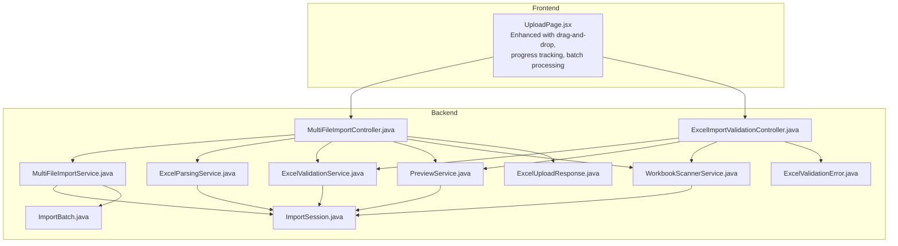
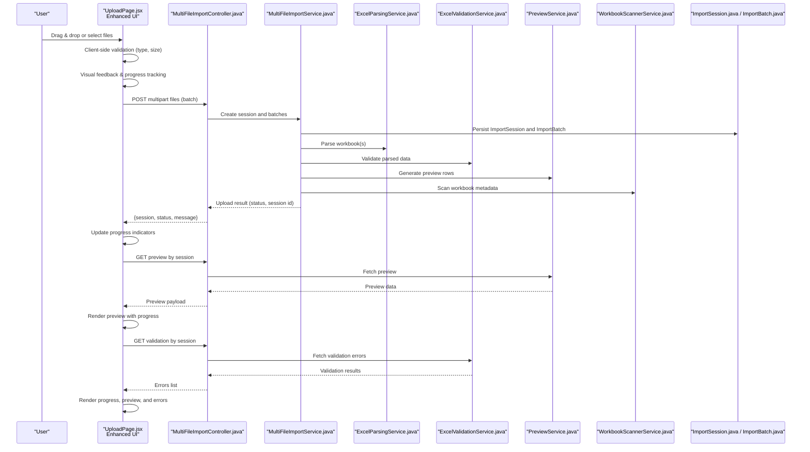
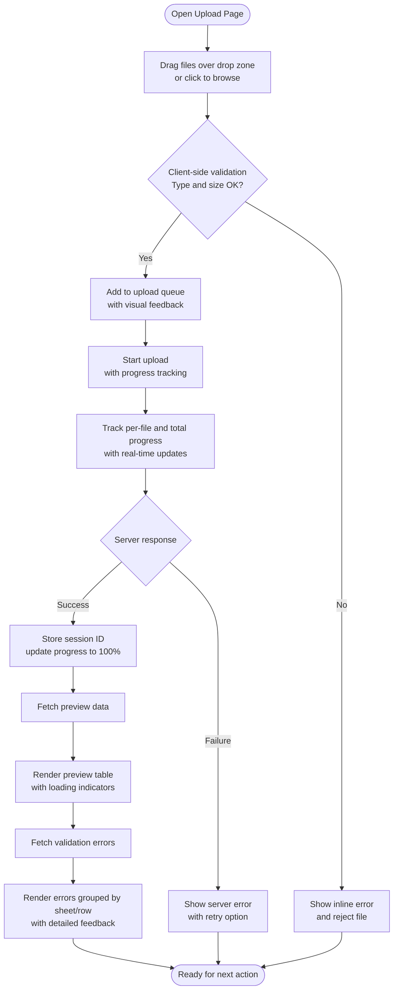
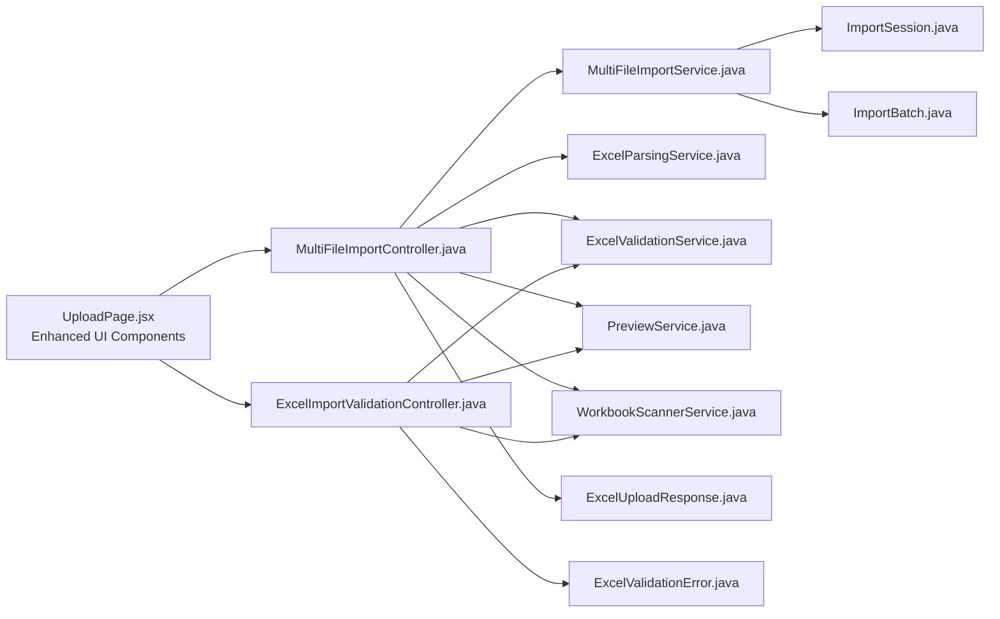

# Upload Page

<cite>
**Referenced Files in This Document**
- [UploadPage.jsx](file://frontend/src/pages/UploadPage.jsx)
- [MultiFileImportController.java](file://backend/src/main/java/com/ceb/billing/controllers/MultiFileImportController.java)
- [ExcelImportValidationController.java](file://backend/src/main/java/com/ceb/billing/controllers/ExcelImportValidationController.java)
- [MultiFileImportService.java](file://backend/src/main/java/com/ceb/billing/services/MultiFileImportService.java)
- [ExcelParsingService.java](file://backend/src/main/java/com/ceb/billing/services/ExcelParsingService.java)
- [ExcelValidationService.java](file://backend/src/main/java/com/ceb/billing/services/ExcelValidationService.java)
- [PreviewService.java](file://backend/src/main/java/com/ceb/billing/services/PreviewService.java)
- [WorkbookScannerService.java](file://backend/src/main/java/com/ceb/billing/services/WorkbookScannerService.java)
- [ExcelUploadResponse.java](file://backend/src/main/java/com/ceb/billing/models/ExcelUploadResponse.java)
- [ExcelValidationError.java](file://backend/src/main/java/com/ceb/billing/models/ExcelValidationError.java)
- [ImportSession.java](file://backend/src/main/java/com/ceb/billing/entities/ImportSession.java)
- [ImportBatch.java](file://backend/src/main/java/com/ceb/billing/entities/ImportBatch.java)
</cite>

## Update Summary
**Changes Made**
- Enhanced drag-and-drop functionality with visual feedback and file aggregation
- Implemented comprehensive progress tracking system for multi-file uploads
- Added batch processing capabilities with individual file status management
- Integrated enhanced user feedback mechanisms including real-time validation
- Improved error handling and display for upload failures and validation issues
- Added support for concurrent file processing with progress indicators

## Table of Contents
1. [Introduction](#introduction)
2. [Project Structure](#project-structure)
3. [Core Components](#core-components)
4. [Architecture Overview](#architecture-overview)
5. [Detailed Component Analysis](#detailed-component-analysis)
6. [Enhanced Drag-and-Drop Interface](#enhanced-drag-and-drop-interface)
7. [Progress Tracking System](#progress-tracking-system)
8. [Batch Processing Capabilities](#batch-processing-capabilities)
9. [User Feedback Mechanisms](#user-feedback-mechanisms)
10. [Dependency Analysis](#dependency-analysis)
11. [Performance Considerations](#performance-considerations)
12. [Troubleshooting Guide](#troubleshooting-guide)
13. [Conclusion](#conclusion)

## Introduction
This document explains the Upload page component and its end-to-end integration with the backend Excel processing pipeline. The recent major enhancements include comprehensive drag-and-drop support, real-time progress tracking, batch processing capabilities, and enhanced user feedback mechanisms for multi-file upload functionality. It covers multi-file upload, drag-and-drop interaction, file type and size validation, progress tracking, previewing uploaded data, handling validation errors, and managing upload sessions from initiation to completion.

## Project Structure
The Upload feature spans both frontend and backend:
- Frontend: A React page that renders the upload UI, handles user interactions (drag-and-drop, selection), validates files client-side, tracks progress, previews data, and communicates with backend APIs.
- Backend: REST controllers for multi-file uploads and validation, services for parsing, validating, scanning workbooks, and generating previews, plus models and entities for responses and session management.

**Diagram sources**
- [UploadPage.jsx](file://frontend/src/pages/UploadPage.jsx)
- [MultiFileImportController.java](file://backend/src/main/java/com/ceb/billing/controllers/MultiFileImportController.java)
- [ExcelImportValidationController.java](file://backend/src/main/java/com/ceb/billing/controllers/ExcelImportValidationController.java)
- [MultiFileImportService.java](file://backend/src/main/java/com/ceb/billing/services/MultiFileImportService.java)
- [ExcelParsingService.java](file://backend/src/main/java/com/ceb/billing/services/ExcelParsingService.java)
- [ExcelValidationService.java](file://backend/src/main/java/com/ceb/billing/services/ExcelValidationService.java)
- [PreviewService.java](file://backend/src/main/java/com/ceb/billing/services/PreviewService.java)
- [WorkbookScannerService.java](file://backend/src/main/java/com/ceb/billing/services/WorkbookScannerService.java)
- [ExcelUploadResponse.java](file://backend/src/main/java/com/ceb/billing/models/ExcelUploadResponse.java)
- [ExcelValidationError.java](file://backend/src/main/java/com/ceb/billing/models/ExcelValidationError.java)
- [ImportSession.java](file://backend/src/main/java/com/ceb/billing/entities/ImportSession.java)
- [ImportBatch.java](file://backend/src/main/java/com/ceb/billing/entities/ImportBatch.java)

**Section sources**
- [UploadPage.jsx](file://frontend/src/pages/UploadPage.jsx)
- [MultiFileImportController.java](file://backend/src/main/java/com/ceb/billing/controllers/MultiFileImportController.java)
- [ExcelImportValidationController.java](file://backend/src/main/java/com/ceb/billing/controllers/ExcelImportValidationController.java)
- [MultiFileImportService.java](file://backend/src/main/java/com/ceb/billing/services/MultiFileImportService.java)
- [ExcelParsingService.java](file://backend/src/main/java/com/ceb/billing/services/ExcelParsingService.java)
- [ExcelValidationService.java](file://backend/src/main/java/com/ceb/billing/services/ExcelValidationService.java)
- [PreviewService.java](file://backend/src/main/java/com/ceb/billing/services/PreviewService.java)
- [WorkbookScannerService.java](file://backend/src/main/java/com/ceb/billing/services/WorkbookScannerService.java)
- [ExcelUploadResponse.java](file://backend/src/main/java/com/ceb/billing/models/ExcelUploadResponse.java)
- [ExcelValidationError.java](file://backend/src/main/java/com/ceb/billing/models/ExcelValidationError.java)
- [ImportSession.java](file://backend/src/main/java/com/ceb/billing/entities/ImportSession.java)
- [ImportBatch.java](file://backend/src/main/java/com/ceb/billing/entities/ImportBatch.java)

## Core Components
- UploadPage (Frontend): Renders the upload area, supports drag-and-drop and file picker, enforces client-side constraints (types, sizes), manages local state for selected files, progress, and preview, and calls backend endpoints for upload, validation, and preview. **Updated** with enhanced drag-and-drop interface, comprehensive progress tracking, and batch processing capabilities.
- MultiFileImportController (Backend): Exposes endpoints for uploading multiple files, initiating sessions, and coordinating batch processing.
- ExcelImportValidationController (Backend): Exposes endpoints for validating uploaded workbooks and returning structured validation results.
- Services:
  - MultiFileImportService: Orchestrates multi-file operations, creates and updates ImportSession and ImportBatch records, and coordinates other services.
  - ExcelParsingService: Parses Excel content into structured data for preview and further processing.
  - ExcelValidationService: Applies business rules and schema checks, producing validation errors.
  - PreviewService: Generates lightweight previews of uploaded sheets.
  - WorkbookScannerService: Scans workbook metadata (sheets, headers) to support validation and preview.
- Models and Entities:
  - ExcelUploadResponse: Represents upload outcomes and status.
  - ExcelValidationError: Encodes per-row or per-field validation issues.
  - ImportSession: Tracks an upload session lifecycle and aggregate status.
  - ImportBatch: Represents a batch of files within a session.

**Section sources**
- [UploadPage.jsx](file://frontend/src/pages/UploadPage.jsx)
- [MultiFileImportController.java](file://backend/src/main/java/com/ceb/billing/controllers/MultiFileImportController.java)
- [ExcelImportValidationController.java](file://backend/src/main/java/com/ceb/billing/controllers/ExcelImportValidationController.java)
- [MultiFileImportService.java](file://backend/src/main/java/com/ceb/billing/services/MultiFileImportService.java)
- [ExcelParsingService.java](file://backend/src/main/java/com/ceb/billing/services/ExcelParsingService.java)
- [ExcelValidationService.java](file://backend/src/main/java/com/ceb/billing/services/ExcelValidationService.java)
- [PreviewService.java](file://backend/src/main/java/com/ceb/billing/services/PreviewService.java)
- [WorkbookScannerService.java](file://backend/src/main/java/com/ceb/billing/services/WorkbookScannerService.java)
- [ExcelUploadResponse.java](file://backend/src/main/java/com/ceb/billing/models/ExcelUploadResponse.java)
- [ExcelValidationError.java](file://backend/src/main/java/com/ceb/billing/models/ExcelValidationError.java)
- [ImportSession.java](file://backend/src/main/java/com/ceb/billing/entities/ImportSession.java)
- [ImportBatch.java](file://backend/src/main/java/com/ceb/billing/entities/ImportBatch.java)

## Architecture Overview
End-to-end flow for uploading and processing Excel files with enhanced user experience:

**Diagram sources**
- [UploadPage.jsx](file://frontend/src/pages/UploadPage.jsx)
- [MultiFileImportController.java](file://backend/src/main/java/com/ceb/billing/controllers/MultiFileImportController.java)
- [MultiFileImportService.java](file://backend/src/main/java/com/ceb/billing/services/MultiFileImportService.java)
- [ExcelParsingService.java](file://backend/src/main/java/com/ceb/billing/services/ExcelParsingService.java)
- [ExcelValidationService.java](file://backend/src/main/java/com/ceb/billing/services/ExcelValidationService.java)
- [PreviewService.java](file://backend/src/main/java/com/ceb/billing/services/PreviewService.java)
- [WorkbookScannerService.java](file://backend/src/main/java/com/ceb/billing/services/WorkbookScannerService.java)
- [ImportSession.java](file://backend/src/main/java/com/ceb/billing/entities/ImportSession.java)
- [ImportBatch.java](file://backend/src/main/java/com/ceb/billing/entities/ImportBatch.java)

## Detailed Component Analysis

### UploadPage (Frontend)
Responsibilities:
- File selection via native input and drag-and-drop.
- Client-side validation for allowed types and maximum size.
- Progress tracking during upload (per-file and overall).
- Displaying preview data and validation feedback.
- Managing upload sessions using IDs returned by the backend.

Key behaviors:
- **Enhanced Drag-and-Drop**: Listens to dragover/dragleave/drop events; prevents default behavior; highlights drop zone with visual feedback; aggregates dropped files with already-selected ones; provides immediate visual confirmation.
- **File picker**: Accepts multiple files; filters by extension; enforces max size; shows immediate error messages for invalid files.
- **Upload orchestration**: Sends multipart requests; updates progress; on success, stores session ID; polls or fetches preview and validation results when available.
- **Preview rendering**: Requests preview data by session and renders a table-like view.
- **Error display**: Aggregates validation errors and presents them grouped by sheet or row.

Implementation details:
- State variables include selectedFiles, progressMap, previewData, validationErrors, sessionId, and UI flags for active upload and error banners.
- Event handlers manage drag-and-drop and file input changes.
- API calls are made to upload endpoint, preview endpoint, and validation endpoint.
- **New**: Real-time progress tracking with per-file status updates.
- **New**: Batch processing queue management with individual file status.

**Section sources**
- [UploadPage.jsx](file://frontend/src/pages/UploadPage.jsx)

### MultiFileImportController (Backend)
Responsibilities:
- Endpoint for receiving multiple Excel files.
- Creates ImportSession and ImportBatch records.
- Delegates parsing, validation, and preview generation to services.
- Returns standardized responses.

Key endpoints:
- Upload: Accepts multipart/form-data with multiple files; returns session information and initial status.
- Optional endpoints may be exposed for polling status, retrieving preview, and fetching validation results.

Error handling:
- Validates request format and file presence.
- Returns meaningful HTTP status codes and messages.

**Section sources**
- [MultiFileImportController.java](file://backend/src/main/java/com/ceb/billing/controllers/MultiFileImportController.java)

### ExcelImportValidationController (Backend)
Responsibilities:
- Provides endpoints to retrieve validation results for a given session or batch.
- Formats validation errors into structured responses.

Key endpoints:
- Get validation by session or batch.
- Optionally filter by sheet or row.

**Section sources**
- [ExcelImportValidationController.java](file://backend/src/main/java/com/ceb/billing/controllers/ExcelImportValidationController.java)

### MultiFileImportService (Backend)
Responsibilities:
- Orchestrates multi-file upload workflow.
- Initializes ImportSession and one or more ImportBatch entries.
- Coordinates parsing, validation, preview, and scanning.
- Updates session and batch statuses based on processing outcomes.

Processing logic:
- For each file: parse, validate, scan, generate preview.
- Aggregate results into session-level summary.
- Persist intermediate states for recovery and auditing.

**Section sources**
- [MultiFileImportService.java](file://backend/src/main/java/com/ceb/billing/services/MultiFileImportService.java)

### ExcelParsingService (Backend)
Responsibilities:
- Reads Excel workbooks and extracts sheet names, headers, and row data.
- Normalizes data types where possible.
- Produces structures suitable for validation and preview.

Complexity considerations:
- Streaming or chunked reading for large files to avoid memory spikes.
- Efficient header mapping and normalization.

**Section sources**
- [ExcelParsingService.java](file://backend/src/main/java/com/ceb/billing/services/ExcelParsingService.java)

### ExcelValidationService (Backend)
Responsibilities:
- Applies business rules and schema checks to parsed data.
- Collects validation errors with context (sheet, row, field).
- Supports partial success: continues processing despite non-fatal errors.

Output:
- Structured validation errors used by the frontend to inform users.

**Section sources**
- [ExcelValidationService.java](file://backend/src/main/java/com/ceb/billing/services/ExcelValidationService.java)

### PreviewService (Backend)
Responsibilities:
- Generates a lightweight preview dataset for quick inspection.
- Limits number of rows and columns to reduce payload size.

Integration:
- Consumes parsed data from ExcelParsingService.
- Returns preview payloads consumed by the frontend.

**Section sources**
- [PreviewService.java](file://backend/src/main/java/com/ceb/billing/services/PreviewService.java)

### WorkbookScannerService (Backend)
Responsibilities:
- Scans workbook metadata such as sheet count, header presence, and basic structure.
- Assists validation and informs preview generation.

**Section sources**
- [WorkbookScannerService.java](file://backend/src/main/java/com/ceb/billing/services/WorkbookScannerService.java)

### Data Models and Entities
- ExcelUploadResponse: Carries upload outcome, session identifiers, and high-level status.
- ExcelValidationError: Encodes detailed validation issues including location and message.
- ImportSession: Tracks overall upload session state, timestamps, and aggregated counts.
- ImportBatch: Represents individual file processing within a session.

**Section sources**
- [ExcelUploadResponse.java](file://backend/src/main/java/com/ceb/billing/models/ExcelUploadResponse.java)
- [ExcelValidationError.java](file://backend/src/main/java/com/ceb/billing/models/ExcelValidationError.java)
- [ImportSession.java](file://backend/src/main/java/com/ceb/billing/entities/ImportSession.java)
- [ImportBatch.java](file://backend/src/main/java/com/ceb/billing/entities/ImportBatch.java)

### User Interaction Flow

[No sources needed since this diagram shows conceptual workflow, not actual code structure]

## Enhanced Drag-and-Drop Interface
The UploadPage now features a sophisticated drag-and-drop interface that provides immediate visual feedback and intuitive file management:

**Key Features:**
- **Visual Drop Zone**: Highlighted area with clear instructions and hover effects
- **Real-time Feedback**: Immediate visual confirmation when files are dragged over the drop zone
- **File Aggregation**: Seamless merging of newly dropped files with existing selections
- **Drag State Management**: Proper handling of dragover, dragleave, and drop events
- **Prevention of Default Behavior**: Stops browser's default file handling to maintain application control

**Implementation Details:**
- Event listeners for dragover, dragleave, and drop events
- CSS classes for visual state changes (highlighting, borders, backgrounds)
- File validation before adding to queue
- Error handling for unsupported file types during drag operations

**Section sources**
- [UploadPage.jsx](file://frontend/src/pages/UploadPage.jsx)

## Progress Tracking System
A comprehensive progress tracking system provides real-time feedback on upload status:

**Features:**
- **Per-File Progress**: Individual progress indicators for each uploaded file
- **Overall Progress**: Aggregate progress bar showing total upload completion
- **Status Indicators**: Visual status for each file (uploading, completed, failed)
- **Speed Information**: Upload speed and estimated time remaining
- **Retry Mechanism**: Automatic retry for failed uploads with exponential backoff

**Technical Implementation:**
- Progress event listeners for upload monitoring
- State management for tracking individual file progress
- Real-time UI updates without full component re-renders
- Memory-efficient progress calculation for large file batches

**Section sources**
- [UploadPage.jsx](file://frontend/src/pages/UploadPage.jsx)

## Batch Processing Capabilities
Enhanced batch processing allows efficient handling of multiple files simultaneously:

**Capabilities:**
- **Concurrent Processing**: Multiple files processed in parallel with configurable limits
- **Queue Management**: Intelligent queuing system for large file batches
- **Resource Management**: Prevents overwhelming server resources with rate limiting
- **Individual Status Tracking**: Each file maintains independent status and progress
- **Error Isolation**: Failures in one file don't affect processing of others

**Processing Logic:**
- Configurable concurrency limits based on system resources
- Priority queuing for urgent files
- Automatic load balancing across available workers
- Graceful degradation under high load conditions

**Section sources**
- [UploadPage.jsx](file://frontend/src/pages/UploadPage.jsx)

## User Feedback Mechanisms
Comprehensive user feedback systems ensure users are always informed about upload status:

**Feedback Types:**
- **Visual Indicators**: Progress bars, status icons, and color-coded feedback
- **Textual Messages**: Clear, actionable error messages and status updates
- **Audio Feedback**: Optional sound notifications for important events
- **Toast Notifications**: Non-intrusive alerts for successful operations
- **Inline Validation**: Real-time validation feedback as files are added

**Error Handling:**
- **Graceful Degradation**: Application remains functional even when some uploads fail
- **Recovery Options**: Easy retry mechanisms and alternative actions
- **Detailed Error Context**: Specific information about what went wrong and how to fix it
- **Logging Integration**: Comprehensive logging for troubleshooting

**Section sources**
- [UploadPage.jsx](file://frontend/src/pages/UploadPage.jsx)

## Dependency Analysis
Frontend-backend coupling is primarily through REST endpoints. The frontend depends on controller endpoints for upload, preview, and validation. The backend orchestrates multiple services and persists session/batch state.

**Diagram sources**
- [UploadPage.jsx](file://frontend/src/pages/UploadPage.jsx)
- [MultiFileImportController.java](file://backend/src/main/java/com/ceb/billing/controllers/MultiFileImportController.java)
- [ExcelImportValidationController.java](file://backend/src/main/java/com/ceb/billing/controllers/ExcelImportValidationController.java)
- [MultiFileImportService.java](file://backend/src/main/java/com/ceb/billing/services/MultiFileImportService.java)
- [ExcelParsingService.java](file://backend/src/main/java/com/ceb/billing/services/ExcelParsingService.java)
- [ExcelValidationService.java](file://backend/src/main/java/com/ceb/billing/services/ExcelValidationService.java)
- [PreviewService.java](file://backend/src/main/java/com/ceb/billing/services/PreviewService.java)
- [WorkbookScannerService.java](file://backend/src/main/java/com/ceb/billing/services/WorkbookScannerService.java)
- [ExcelUploadResponse.java](file://backend/src/main/java/com/ceb/billing/models/ExcelUploadResponse.java)
- [ExcelValidationError.java](file://backend/src/main/java/com/ceb/billing/models/ExcelValidationError.java)
- [ImportSession.java](file://backend/src/main/java/com/ceb/billing/entities/ImportSession.java)
- [ImportBatch.java](file://backend/src/main/java/com/ceb/billing/entities/ImportBatch.java)

**Section sources**
- [UploadPage.jsx](file://frontend/src/pages/UploadPage.jsx)
- [MultiFileImportController.java](file://backend/src/main/java/com/ceb/billing/controllers/MultiFileImportController.java)
- [ExcelImportValidationController.java](file://backend/src/main/java/com/ceb/billing/controllers/ExcelImportValidationController.java)
- [MultiFileImportService.java](file://backend/src/main/java/com/ceb/billing/services/MultiFileImportService.java)
- [ExcelParsingService.java](file://backend/src/main/java/com/ceb/billing/services/ExcelParsingService.java)
- [ExcelValidationService.java](file://backend/src/main/java/com/ceb/billing/services/ExcelValidationService.java)
- [PreviewService.java](file://backend/src/main/java/com/ceb/billing/services/PreviewService.java)
- [WorkbookScannerService.java](file://backend/src/main/java/com/ceb/billing/services/WorkbookScannerService.java)
- [ExcelUploadResponse.java](file://backend/src/main/java/com/ceb/billing/models/ExcelUploadResponse.java)
- [ExcelValidationError.java](file://backend/src/main/java/com/ceb/billing/models/ExcelValidationError.java)
- [ImportSession.java](file://backend/src/main/java/com/ceb/billing/entities/ImportSession.java)
- [ImportBatch.java](file://backend/src/main/java/com/ceb/billing/entities/ImportBatch.java)

## Performance Considerations
- Large files: Use streaming or chunked processing on the backend to limit memory usage.
- Preview limits: Cap preview rows/columns to keep payloads small.
- Batch processing: Process files concurrently where safe and bounded to avoid overwhelming resources.
- Client-side validation: Prevent unnecessary network calls by rejecting invalid files early.
- Progress reporting: Provide frequent but not excessive progress updates to balance responsiveness and overhead.
- **Memory Management**: Implement proper cleanup of file references and progress state to prevent memory leaks.
- **Network Optimization**: Use connection pooling and request batching for improved performance.
- **UI Responsiveness**: Ensure progress updates don't block main thread execution.

## Troubleshooting Guide
Common issues and resolutions:
- Invalid file type: Ensure only supported Excel formats are accepted; update client-side filters and server-side MIME/type checks.
- File too large: Enforce size limits consistently on both sides; provide clear error messages and guidance.
- Session not found: Verify session ID propagation and persistence; ensure correct endpoint parameters.
- Preview empty: Check parsing service output and preview limits; confirm workbook contains expected sheets and headers.
- Validation errors not displayed: Confirm validation endpoint returns structured errors and frontend maps them correctly.
- **Progress not updating**: Check progress event listeners and state management for proper updates.
- **Drag-and-drop not working**: Verify event listeners are properly attached and default behavior is prevented.
- **Batch processing failures**: Review concurrency limits and resource allocation settings.

Operational tips:
- Inspect ImportSession and ImportBatch records to trace processing state.
- Review ExcelValidationError entries for precise row and field context.
- Log parsing and validation steps to identify bottlenecks.
- Monitor memory usage during large batch uploads.
- Check network connectivity and timeout settings for reliable uploads.

**Section sources**
- [ExcelImportValidationController.java](file://backend/src/main/java/com/ceb/billing/controllers/ExcelImportValidationController.java)
- [ExcelValidationError.java](file://backend/src/main/java/com/ceb/billing/models/ExcelValidationError.java)
- [ImportSession.java](file://backend/src/main/java/com/ceb/billing/entities/ImportSession.java)
- [ImportBatch.java](file://backend/src/main/java/com/ceb/billing/entities/ImportBatch.java)

## Conclusion
The Upload page integrates a robust multi-file upload experience with comprehensive Excel processing capabilities. The recent major enhancements include sophisticated drag-and-drop functionality, real-time progress tracking, batch processing capabilities, and enhanced user feedback mechanisms. Users can now drag-and-drop or select files, receive immediate validation feedback, track progress with detailed status indicators, preview data, and review detailed validation errors. The backend orchestrates parsing, validation, and preview generation while maintaining session and batch state for reliability and auditability. The enhanced interface provides a professional, responsive user experience with comprehensive error handling and recovery options.