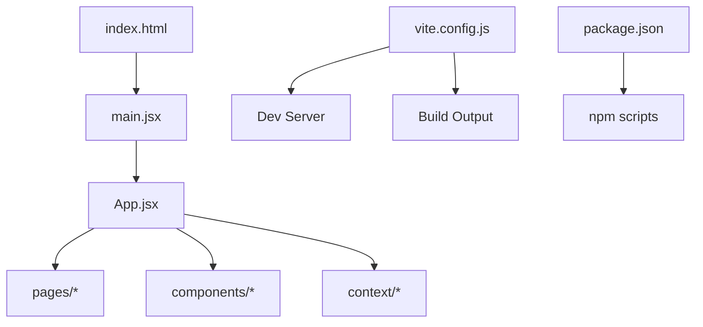
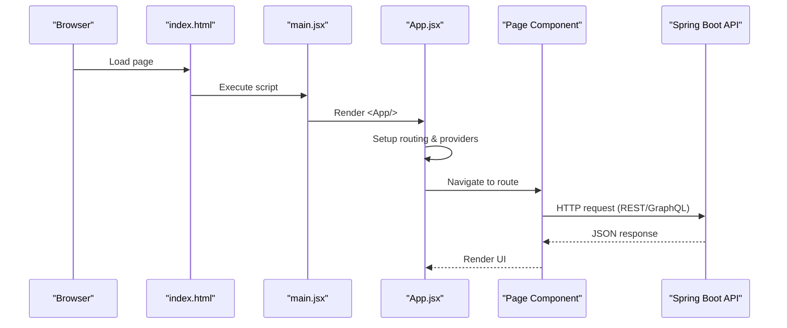
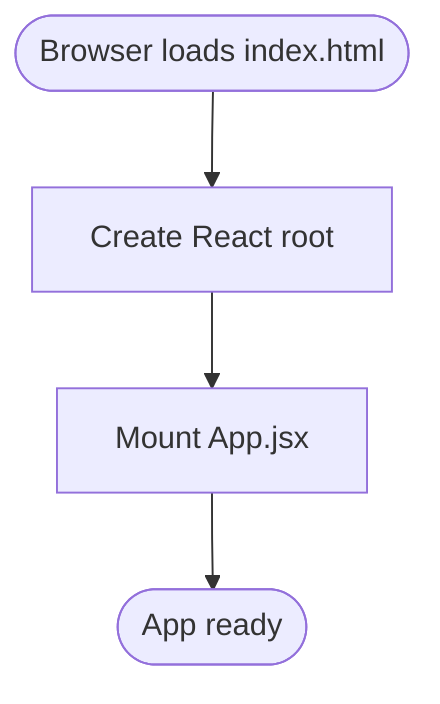
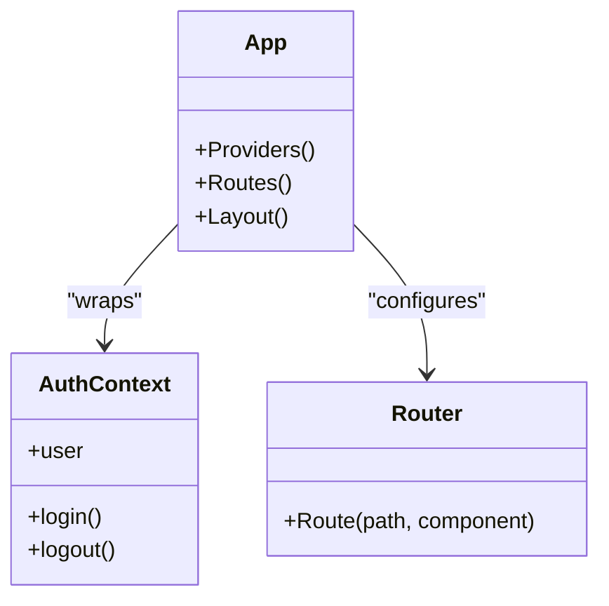
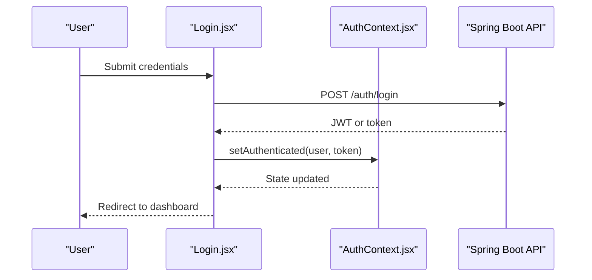
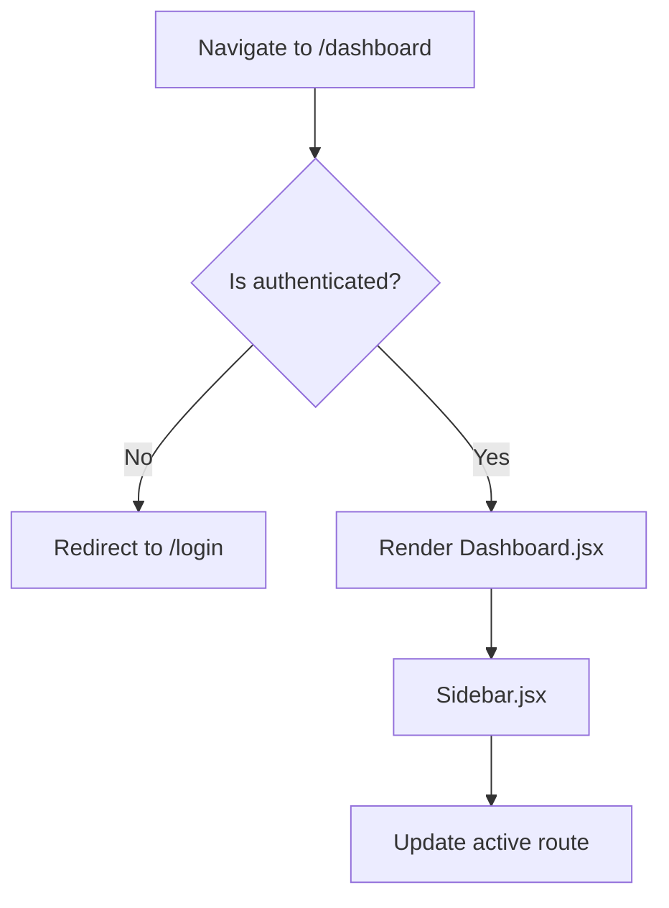
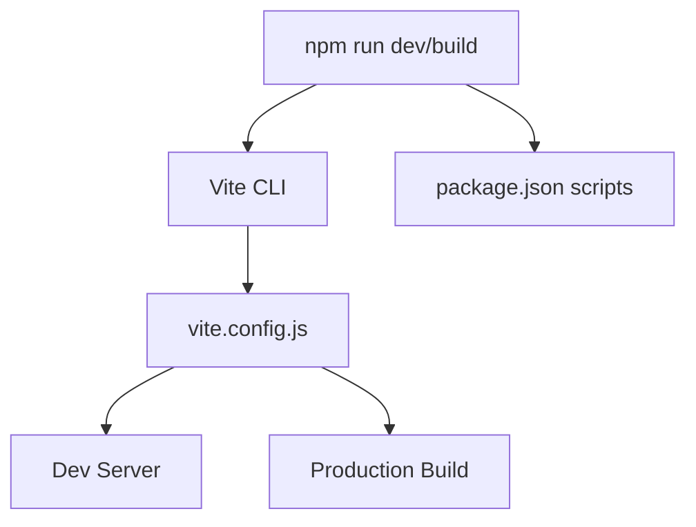
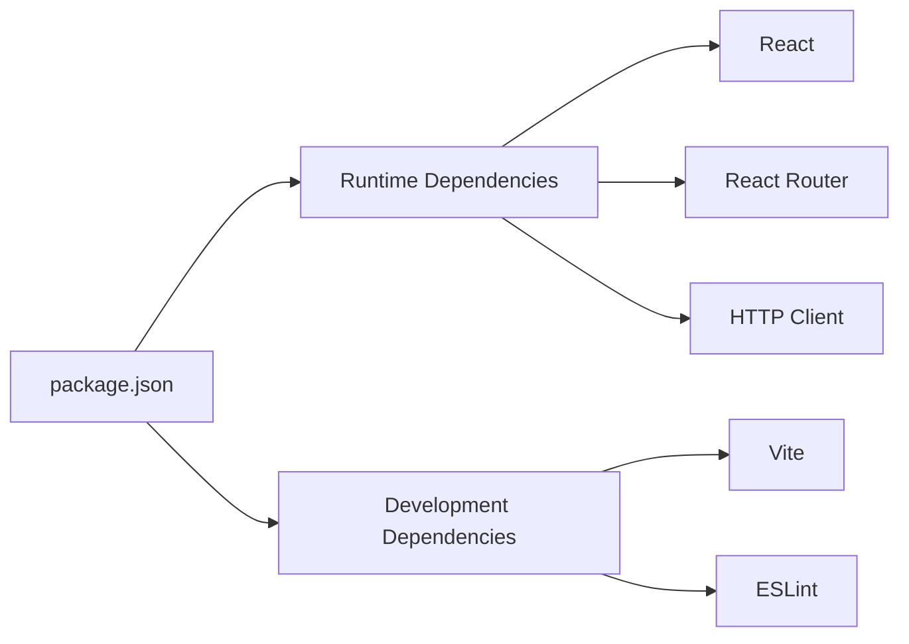

# React Application Architecture

<cite>
**Referenced Files in This Document**
- [frontend/src/main.jsx](file://frontend/src/main.jsx)
- [frontend/src/App.jsx](file://frontend/src/App.jsx)
- [frontend/vite.config.js](file://frontend/vite.config.js)
- [frontend/package.json](file://frontend/package.json)
- [frontend/index.html](file://frontend/index.html)
- [frontend/src/context/AuthContext.jsx](file://frontend/src/context/AuthContext.jsx)
- [frontend/src/pages/Login.jsx](file://frontend/src/pages/Login.jsx)
- [frontend/src/pages/Dashboard.jsx](file://frontend/src/pages/Dashboard.jsx)
- [frontend/src/components/Sidebar.jsx](file://frontend/src/components/Sidebar.jsx)
</cite>

## Table of Contents
1. [Introduction](#introduction)
2. [Project Structure](#project-structure)
3. [Core Components](#core-components)
4. [Architecture Overview](#architecture-overview)
5. [Detailed Component Analysis](#detailed-component-analysis)
6. [Dependency Analysis](#dependency-analysis)
7. [Performance Considerations](#performance-considerations)
8. [Troubleshooting Guide](#troubleshooting-guide)
9. [Conclusion](#conclusion)
10. [Appendices](#appendices)

## Introduction
This document explains the React application architecture, focusing on how the app boots, organizes components and routes, integrates with a Spring Boot backend, and is built using Vite. It also provides guidelines for extending the application while maintaining clear structure and separation of concerns.

## Project Structure
The frontend follows a feature-oriented layout:
- Entry points: index.html and main.jsx
- App shell: App.jsx
- Pages: feature-level views (e.g., Login, Dashboard)
- Shared UI: components (e.g., Sidebar)
- Global state: context providers (e.g., AuthContext)
- Build configuration: vite.config.js and package.json

**Diagram sources**
- [frontend/index.html](file://frontend/index.html)
- [frontend/src/main.jsx](file://frontend/src/main.jsx)
- [frontend/src/App.jsx](file://frontend/src/App.jsx)
- [frontend/vite.config.js](file://frontend/vite.config.js)
- [frontend/package.json](file://frontend/package.json)

**Section sources**
- [frontend/index.html](file://frontend/index.html)
- [frontend/src/main.jsx](file://frontend/src/main.jsx)
- [frontend/src/App.jsx](file://frontend/src/App.jsx)
- [frontend/vite.config.js](file://frontend/vite.config.js)
- [frontend/package.json](file://frontend/package.json)

## Core Components
- Application bootstrap
  - The HTML file defines the root element where React mounts.
  - main.jsx creates the React root and renders the top-level App component.
- App shell
  - App.jsx composes global providers, navigation, and page content.
  - It typically holds routing configuration and shared layout elements.
- Authentication context
  - AuthContext.jsx centralizes user session state and auth actions.
  - Pages like Login.jsx consume this context to perform login flows.
- Feature pages
  - Dashboard.jsx and other pages represent feature screens.
- Shared UI
  - Sidebar.jsx provides common navigation or layout assistance.

**Section sources**
- [frontend/index.html](file://frontend/index.html)
- [frontend/src/main.jsx](file://frontend/src/main.jsx)
- [frontend/src/App.jsx](file://frontend/src/App.jsx)
- [frontend/src/context/AuthContext.jsx](file://frontend/src/context/AuthContext.jsx)
- [frontend/src/pages/Login.jsx](file://frontend/src/pages/Login.jsx)
- [frontend/src/pages/Dashboard.jsx](file://frontend/src/pages/Dashboard.jsx)
- [frontend/src/components/Sidebar.jsx](file://frontend/src/components/Sidebar.jsx)

## Architecture Overview
High-level flow from browser to backend:
- Browser loads index.html and executes main.jsx.
- main.jsx mounts App.jsx into the DOM.
- App.jsx sets up routing and providers (e.g., authentication).
- Pages render based on route and interact with the Spring Boot API via HTTP calls.
- Vite configures dev server and build pipeline.

**Diagram sources**
- [frontend/index.html](file://frontend/index.html)
- [frontend/src/main.jsx](file://frontend/src/main.jsx)
- [frontend/src/App.jsx](file://frontend/src/App.jsx)
- [frontend/src/pages/Dashboard.jsx](file://frontend/src/pages/Dashboard.jsx)

## Detailed Component Analysis

### Bootstrap and Mounting
- index.html provides the root container for React.
- main.jsx initializes the React root and mounts App.jsx.
- This ensures a single entry point and predictable initialization order.

**Diagram sources**
- [frontend/index.html](file://frontend/index.html)
- [frontend/src/main.jsx](file://frontend/src/main.jsx)

**Section sources**
- [frontend/index.html](file://frontend/index.html)
- [frontend/src/main.jsx](file://frontend/src/main.jsx)

### App Shell and Routing
- App.jsx orchestrates providers and routes.
- Typical responsibilities:
  - Wrap application with global contexts (e.g., AuthContext).
  - Configure routes mapping URLs to page components.
  - Provide shared layout (header, sidebar, footer).
- Keep routing declarative and colocate route-specific logic within page components.

**Diagram sources**
- [frontend/src/App.jsx](file://frontend/src/App.jsx)
- [frontend/src/context/AuthContext.jsx](file://frontend/src/context/AuthContext.jsx)

**Section sources**
- [frontend/src/App.jsx](file://frontend/src/App.jsx)
- [frontend/src/context/AuthContext.jsx](file://frontend/src/context/AuthContext.jsx)

### Authentication Flow
- AuthContext maintains session state and exposes actions.
- Login page triggers authentication and updates context.
- Protected routes can guard access by checking context state.

**Diagram sources**
- [frontend/src/pages/Login.jsx](file://frontend/src/pages/Login.jsx)
- [frontend/src/context/AuthContext.jsx](file://frontend/src/context/AuthContext.jsx)

**Section sources**
- [frontend/src/pages/Login.jsx](file://frontend/src/pages/Login.jsx)
- [frontend/src/context/AuthContext.jsx](file://frontend/src/context/AuthContext.jsx)

### Dashboard and Layout Integration
- Dashboard.jsx consumes authentication and displays feature data.
- Sidebar.jsx provides navigation links that integrate with routing.
- Ensure consistent URL patterns and active states.

**Diagram sources**
- [frontend/src/pages/Dashboard.jsx](file://frontend/src/pages/Dashboard.jsx)
- [frontend/src/components/Sidebar.jsx](file://frontend/src/components/Sidebar.jsx)

**Section sources**
- [frontend/src/pages/Dashboard.jsx](file://frontend/src/pages/Dashboard.jsx)
- [frontend/src/components/Sidebar.jsx](file://frontend/src/components/Sidebar.jsx)

### Vite Build Setup
- vite.config.js configures development server, proxy, and build options.
- package.json defines scripts for development, building, and linting.
- Recommended practices:
  - Use environment variables for API base URLs.
  - Enable code splitting and minification for production.
  - Configure proxy during development to avoid CORS issues.

**Diagram sources**
- [frontend/vite.config.js](file://frontend/vite.config.js)
- [frontend/package.json](file://frontend/package.json)

**Section sources**
- [frontend/vite.config.js](file://frontend/vite.config.js)
- [frontend/package.json](file://frontend/package.json)

## Dependency Analysis
Frontend dependencies are declared in package.json. Key categories:
- Runtime: React, React Router, HTTP client (e.g., axios/fetch wrapper), UI libraries.
- Development: Vite, ESLint, testing utilities.
- Organize imports by feature and keep shared utilities in dedicated modules.

**Diagram sources**
- [frontend/package.json](file://frontend/package.json)

**Section sources**
- [frontend/package.json](file://frontend/package.json)

## Performance Considerations
- Code splitting: Lazy-load heavy pages and charts to reduce initial bundle size.
- Memoization: Use memoized selectors and components where appropriate to avoid unnecessary re-renders.
- Data fetching: Implement caching strategies and debounced searches for large datasets.
- Asset optimization: Prefer SVG icons and optimized images; leverage Vite’s asset handling.
- Network efficiency: Batch requests when possible and use pagination for lists.

[No sources needed since this section provides general guidance]

## Troubleshooting Guide
Common issues and resolutions:
- Blank screen after mount
  - Verify root element exists in index.html and main.jsx mounts correctly.
- Routing not working
  - Confirm routes are defined in App.jsx and paths match navigation usage.
- Authentication failures
  - Check token storage, expiration handling, and API endpoints.
- CORS errors in development
  - Ensure vite.config.js proxies API requests or configure backend CORS appropriately.
- Build fails due to missing env variables
  - Define required variables and ensure they are available at runtime.

**Section sources**
- [frontend/index.html](file://frontend/index.html)
- [frontend/src/main.jsx](file://frontend/src/main.jsx)
- [frontend/src/App.jsx](file://frontend/src/App.jsx)
- [frontend/vite.config.js](file://frontend/vite.config.js)

## Conclusion
The React application uses a clear bootstrap process, modular component hierarchy, and centralized routing. Authentication is managed through context, and Vite streamlines development and builds. By following the organization and integration patterns outlined here, you can extend features consistently and maintain a scalable architecture.

[No sources needed since this section summarizes without analyzing specific files]

## Appendices

### Extending the Application
- Add a new page
  - Create a new file under pages/.
  - Register a route in App.jsx.
  - Optionally add navigation entries in Sidebar.jsx.
- Introduce a new context
  - Create a context module under context/.
  - Wrap App.jsx with the provider.
  - Consume context in relevant pages/components.
- Integrate a new API endpoint
  - Centralize HTTP calls in a service module if applicable.
  - Handle errors and loading states consistently across components.
- Maintain code organization
  - Group related components and hooks near their feature pages.
  - Keep shared utilities in dedicated folders.
  - Use consistent naming conventions and folder structures.

[No sources needed since this section provides general guidance]