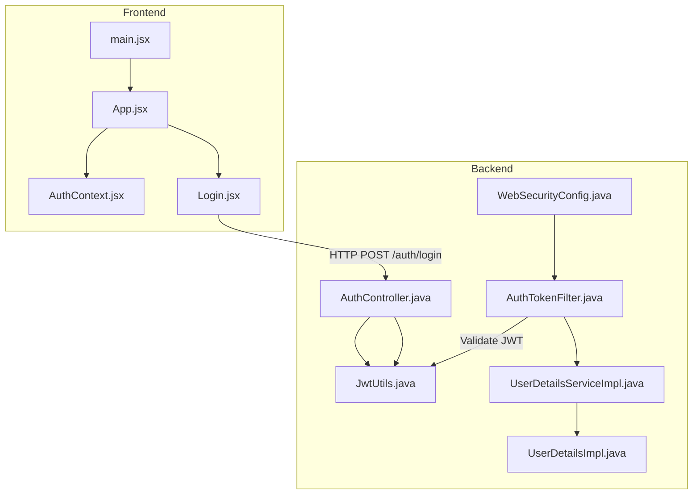
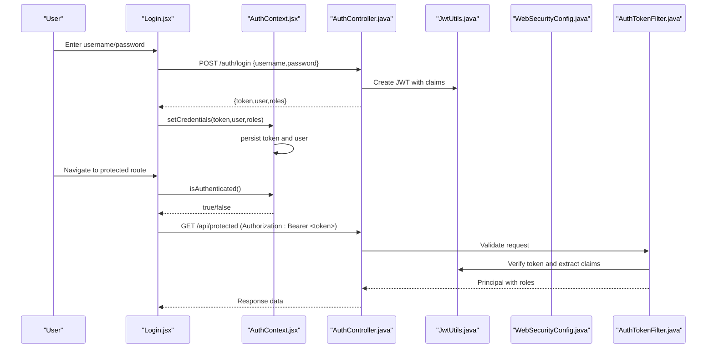
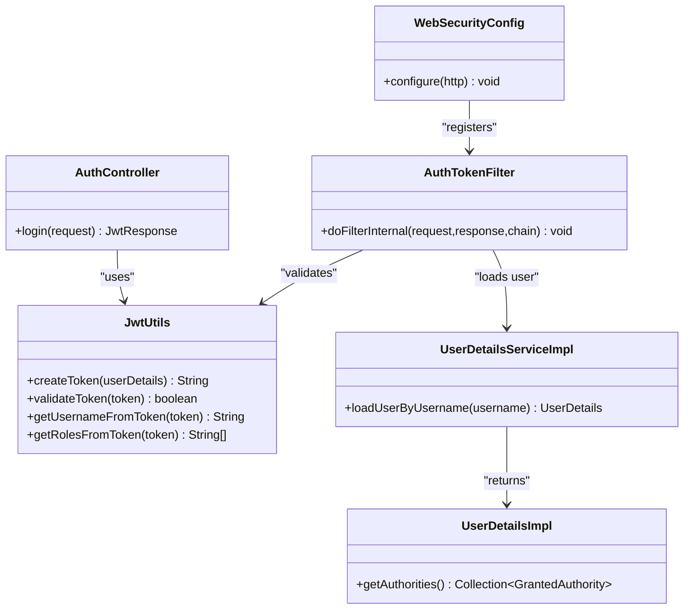
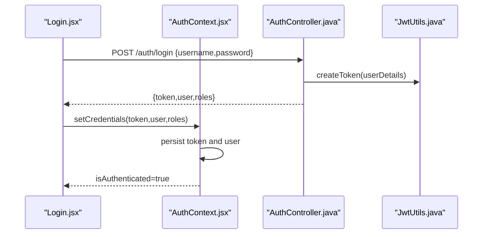
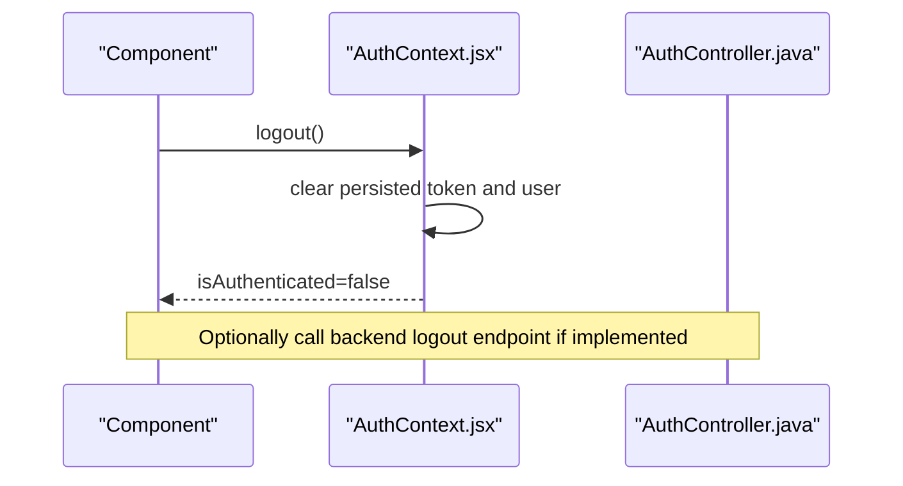
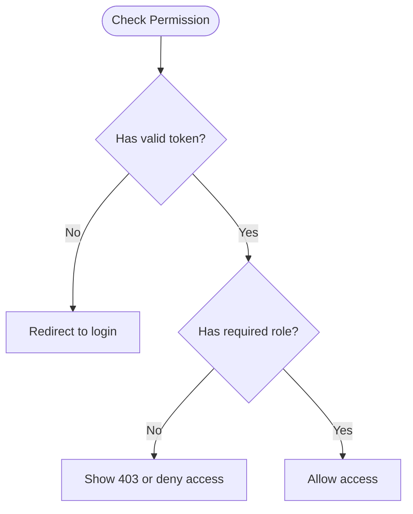
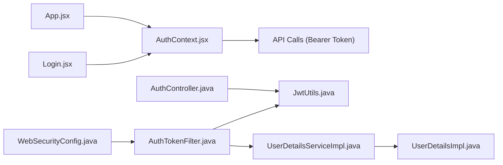

# Authentication Context

<cite>
**Referenced Files in This Document**
- [AuthContext.jsx](file://frontend/src/context/AuthContext.jsx)
- [Login.jsx](file://frontend/src/pages/Login.jsx)
- [App.jsx](file://frontend/src/App.jsx)
- [main.jsx](file://frontend/src/main.jsx)
- [AuthController.java](file://backend/src/main/java/com/ceb/billing/controllers/AuthController.java)
- [JwtUtils.java](file://backend/src/main/java/com/ceb/billing/config/JwtUtils.java)
- [WebSecurityConfig.java](file://backend/src/main/java/com/ceb/billing/config/WebSecurityConfig.java)
- [AuthTokenFilter.java](file://backend/src/main/java/com/ceb/billing/config/AuthTokenFilter.java)
- [UserDetailsServiceImpl.java](file://backend/src/main/java/com/ceb/billing/config/UserDetailsServiceImpl.java)
- [UserDetailsImpl.java](file://backend/src/main/java/com/ceb/billing/config/UserDetailsImpl.java)
- [LoginRequest.java](file://backend/src/main/java/com/ceb/billing/models/LoginRequest.java)
- [JwtResponse.java](file://backend/src/main/java/com/ceb/billing/models/JwtResponse.java)
</cite>

## Table of Contents
1. [Introduction](#introduction)
2. [Project Structure](#project-structure)
3. [Core Components](#core-components)
4. [Architecture Overview](#architecture-overview)
5. [Detailed Component Analysis](#detailed-component-analysis)
6. [Dependency Analysis](#dependency-analysis)
7. [Performance Considerations](#performance-considerations)
8. [Troubleshooting Guide](#troubleshooting-guide)
9. [Conclusion](#conclusion)

## Introduction
This document explains the authentication context implementation across the frontend and backend, focusing on user session management, JWT token handling, role-based access control (RBAC), and authentication state persistence. It provides guidance on using the AuthProvider, accessing user information, checking permissions, implementing protected routes, and integrating with API calls. It also covers login/logout flows, token refresh strategies, error handling for authentication failures, and security best practices.

## Project Structure
The authentication system spans both frontend and backend:
- Frontend: React application with a centralized AuthContext that manages login state, tokens, and user roles.
- Backend: Spring Boot application providing JWT issuance, validation, and authorization via a security filter chain.

**Diagram sources**
- [main.jsx](file://frontend/src/main.jsx)
- [App.jsx](file://frontend/src/App.jsx)
- [AuthContext.jsx](file://frontend/src/context/AuthContext.jsx)
- [Login.jsx](file://frontend/src/pages/Login.jsx)
- [AuthController.java](file://backend/src/main/java/com/ceb/billing/controllers/AuthController.java)
- [JwtUtils.java](file://backend/src/main/java/com/ceb/billing/config/JwtUtils.java)
- [WebSecurityConfig.java](file://backend/src/main/java/com/ceb/billing/config/WebSecurityConfig.java)
- [AuthTokenFilter.java](file://backend/src/main/java/com/ceb/billing/config/AuthTokenFilter.java)
- [UserDetailsServiceImpl.java](file://backend/src/main/java/com/ceb/billing/config/UserDetailsServiceImpl.java)
- [UserDetailsImpl.java](file://backend/src/main/java/com/ceb/billing/config/UserDetailsImpl.java)

**Section sources**
- [AuthContext.jsx](file://frontend/src/context/AuthContext.jsx)
- [Login.jsx](file://frontend/src/pages/Login.jsx)
- [App.jsx](file://frontend/src/App.jsx)
- [main.jsx](file://frontend/src/main.jsx)
- [AuthController.java](file://backend/src/main/java/com/ceb/billing/controllers/AuthController.java)
- [JwtUtils.java](file://backend/src/main/java/com/ceb/billing/config/JwtUtils.java)
- [WebSecurityConfig.java](file://backend/src/main/java/com/ceb/billing/config/WebSecurityConfig.java)
- [AuthTokenFilter.java](file://backend/src/main/java/com/ceb/billing/config/AuthTokenFilter.java)
- [UserDetailsServiceImpl.java](file://backend/src/main/java/com/ceb/billing/config/UserDetailsServiceImpl.java)
- [UserDetailsImpl.java](file://backend/src/main/java/com/ceb/billing/config/UserDetailsImpl.java)

## Core Components
- AuthContext (frontend): Provides login/logout functions, current user and roles, token storage, and an authenticated state used by components and routes.
- Login page (frontend): Submits credentials to the backend and updates the AuthContext upon success.
- App and main entry points (frontend): Wrap the app with AuthProvider and initialize routing based on authentication state.
- AuthController (backend): Exposes endpoints for login and returns JWT responses.
- JwtUtils (backend): Creates and validates JWTs, including expiration and claims.
- WebSecurityConfig and AuthTokenFilter (backend): Configure security rules and validate incoming requests with JWT.
- UserDetails services (backend): Load user details and map them to Spring Security’s principal.

Key responsibilities:
- Session management: Persist tokens and user info; restore on reload.
- Token handling: Store JWT securely; attach to outgoing requests; handle expiry.
- RBAC: Derive roles from token claims; guard routes and UI elements.
- Error handling: Normalize server errors into user-friendly messages.

**Section sources**
- [AuthContext.jsx](file://frontend/src/context/AuthContext.jsx)
- [Login.jsx](file://frontend/src/pages/Login.jsx)
- [App.jsx](file://frontend/src/App.jsx)
- [AuthController.java](file://backend/src/main/java/com/ceb/billing/controllers/AuthController.java)
- [JwtUtils.java](file://backend/src/main/java/com/ceb/billing/config/JwtUtils.java)
- [WebSecurityConfig.java](file://backend/src/main/java/com/ceb/billing/config/WebSecurityConfig.java)
- [AuthTokenFilter.java](file://backend/src/main/java/com/ceb/billing/config/AuthTokenFilter.java)
- [UserDetailsServiceImpl.java](file://backend/src/main/java/com/ceb/billing/config/UserDetailsServiceImpl.java)
- [UserDetailsImpl.java](file://backend/src/main/java/com/ceb/billing/config/UserDetailsImpl.java)

## Architecture Overview
End-to-end authentication flow:
- User submits credentials via the Login page.
- Backend authenticates and issues a JWT containing user identity and roles.
- Frontend stores the token and user profile in persistent storage.
- Protected routes check the presence and validity of the token before rendering.
- Outgoing API calls include the Authorization header with the bearer token.
- Backend validates the token via a filter and enforces authorization rules.

**Diagram sources**
- [Login.jsx](file://frontend/src/pages/Login.jsx)
- [AuthContext.jsx](file://frontend/src/context/AuthContext.jsx)
- [AuthController.java](file://backend/src/main/java/com/ceb/billing/controllers/AuthController.java)
- [JwtUtils.java](file://backend/src/main/java/com/ceb/billing/config/JwtUtils.java)
- [WebSecurityConfig.java](file://backend/src/main/java/com/ceb/billing/config/WebSecurityConfig.java)
- [AuthTokenFilter.java](file://backend/src/main/java/com/ceb/billing/config/AuthTokenFilter.java)

## Detailed Component Analysis

### Frontend AuthContext
Responsibilities:
- Manage authentication state (isAuthenticated, user, roles).
- Provide login/logout methods.
- Persist token and user info across sessions.
- Offer helpers to check permissions and get the current token.

Usage patterns:
- Wrap the application with AuthProvider at the root.
- Consume context in components to read user info and roles.
- Guard routes by checking authentication and roles.
- Attach token to API requests via interceptors or wrappers.

Protected route example pattern:
- If not authenticated, redirect to login.
- If roles are required, verify the user has one of the allowed roles.

Permission checks:
- Use provided helper to test if the user has a specific role.

API integration:
- Include Authorization header with bearer token for protected endpoints.
- Handle 401/403 responses by clearing state and redirecting.

**Section sources**
- [AuthContext.jsx](file://frontend/src/context/AuthContext.jsx)
- [App.jsx](file://frontend/src/App.jsx)
- [main.jsx](file://frontend/src/main.jsx)

### Frontend Login Page
Responsibilities:
- Collect credentials.
- Call backend login endpoint.
- On success, update AuthContext and navigate to dashboard.
- On failure, display error messages.

Flow:
- Submit form -> POST /auth/login -> store token/user -> redirect.

**Section sources**
- [Login.jsx](file://frontend/src/pages/Login.jsx)
- [AuthContext.jsx](file://frontend/src/context/AuthContext.jsx)

### Backend Authentication Controller
Responsibilities:
- Accept login requests.
- Authenticate user against the user service.
- Generate JWT with user identity and roles.
- Return standardized response.

Models:
- LoginRequest: request payload for credentials.
- JwtResponse: response payload with token and user metadata.

**Section sources**
- [AuthController.java](file://backend/src/main/java/com/ceb/billing/controllers/AuthController.java)
- [LoginRequest.java](file://backend/src/main/java/com/ceb/billing/models/LoginRequest.java)
- [JwtResponse.java](file://backend/src/main/java/com/ceb/billing/models/JwtResponse.java)

### Backend JWT Utilities
Responsibilities:
- Build JWT with subject (user ID), issued time, expiration, and custom claims (e.g., roles).
- Validate and parse tokens.
- Extract claims such as username and roles.

Security considerations:
- Use strong secrets and appropriate algorithms.
- Set reasonable expiration times.

**Section sources**
- [JwtUtils.java](file://backend/src/main/java/com/ceb/billing/config/JwtUtils.java)

### Backend Security Configuration and Filter
Responsibilities:
- Define which endpoints are public vs. protected.
- Register a filter to validate JWT on each request.
- Map validated principal to Spring Security context.

Filter behavior:
- Read Authorization header.
- Validate token and populate SecurityContext with user details and roles.

**Section sources**
- [WebSecurityConfig.java](file://backend/src/main/java/com/ceb/billing/config/WebSecurityConfig.java)
- [AuthTokenFilter.java](file://backend/src/main/java/com/ceb/billing/config/AuthTokenFilter.java)

### Backend User Details Services
Responsibilities:
- Load user by username/email.
- Map domain user to Spring Security UserDetails.
- Provide authorities (roles) for authorization decisions.

**Section sources**
- [UserDetailsServiceImpl.java](file://backend/src/main/java/com/ceb/billing/config/UserDetailsServiceImpl.java)
- [UserDetailsImpl.java](file://backend/src/main/java/com/ceb/billing/config/UserDetailsImpl.java)

### Class Relationships (Backend)

**Diagram sources**
- [AuthController.java](file://backend/src/main/java/com/ceb/billing/controllers/AuthController.java)
- [JwtUtils.java](file://backend/src/main/java/com/ceb/billing/config/JwtUtils.java)
- [WebSecurityConfig.java](file://backend/src/main/java/com/ceb/billing/config/WebSecurityConfig.java)
- [AuthTokenFilter.java](file://backend/src/main/java/com/ceb/billing/config/AuthTokenFilter.java)
- [UserDetailsServiceImpl.java](file://backend/src/main/java/com/ceb/billing/config/UserDetailsServiceImpl.java)
- [UserDetailsImpl.java](file://backend/src/main/java/com/ceb/billing/config/UserDetailsImpl.java)

### Login Flow Sequence

**Diagram sources**
- [Login.jsx](file://frontend/src/pages/Login.jsx)
- [AuthContext.jsx](file://frontend/src/context/AuthContext.jsx)
- [AuthController.java](file://backend/src/main/java/com/ceb/billing/controllers/AuthController.java)
- [JwtUtils.java](file://backend/src/main/java/com/ceb/billing/config/JwtUtils.java)

### Logout Flow Sequence

**Diagram sources**
- [AuthContext.jsx](file://frontend/src/context/AuthContext.jsx)
- [AuthController.java](file://backend/src/main/java/com/ceb/billing/controllers/AuthController.java)

### Permission Check Flowchart

[No sources needed since this diagram shows conceptual workflow, not actual code structure]

## Dependency Analysis
Frontend dependencies:
- AuthContext is consumed by pages and layout components.
- Login page depends on AuthContext for state updates.
- App wraps the tree with AuthProvider and configures routes.

Backend dependencies:
- AuthController depends on JwtUtils for token creation/validation.
- WebSecurityConfig registers AuthTokenFilter.
- AuthTokenFilter uses JwtUtils and UserDetailsServiceImpl to build the SecurityContext.

**Diagram sources**
- [App.jsx](file://frontend/src/App.jsx)
- [AuthContext.jsx](file://frontend/src/context/AuthContext.jsx)
- [Login.jsx](file://frontend/src/pages/Login.jsx)
- [AuthController.java](file://backend/src/main/java/com/ceb/billing/controllers/AuthController.java)
- [JwtUtils.java](file://backend/src/main/java/com/ceb/billing/config/JwtUtils.java)
- [WebSecurityConfig.java](file://backend/src/main/java/com/ceb/billing/config/WebSecurityConfig.java)
- [AuthTokenFilter.java](file://backend/src/main/java/com/ceb/billing/config/AuthTokenFilter.java)
- [UserDetailsServiceImpl.java](file://backend/src/main/java/com/ceb/billing/config/UserDetailsServiceImpl.java)
- [UserDetailsImpl.java](file://backend/src/main/java/com/ceb/billing/config/UserDetailsImpl.java)

**Section sources**
- [App.jsx](file://frontend/src/App.jsx)
- [AuthContext.jsx](file://frontend/src/context/AuthContext.jsx)
- [Login.jsx](file://frontend/src/pages/Login.jsx)
- [AuthController.java](file://backend/src/main/java/com/ceb/billing/controllers/AuthController.java)
- [JwtUtils.java](file://backend/src/main/java/com/ceb/billing/config/JwtUtils.java)
- [WebSecurityConfig.java](file://backend/src/main/java/com/ceb/billing/config/WebSecurityConfig.java)
- [AuthTokenFilter.java](file://backend/src/main/java/com/ceb/billing/config/AuthTokenFilter.java)
- [UserDetailsServiceImpl.java](file://backend/src/main/java/com/ceb/billing/config/UserDetailsServiceImpl.java)
- [UserDetailsImpl.java](file://backend/src/main/java/com/ceb/billing/config/UserDetailsImpl.java)

## Performance Considerations
- Avoid unnecessary re-renders by memoizing derived values like isAuthenticated and roles.
- Cache user info locally after successful login to prevent redundant API calls.
- Implement token refresh proactively before expiry to minimize failed requests.
- Debounce permission checks where possible and avoid heavy computations in render paths.
- Keep JWT payloads minimal; store only necessary claims.

[No sources needed since this section provides general guidance]

## Troubleshooting Guide
Common issues and resolutions:
- 401 Unauthorized:
  - Ensure the Authorization header includes a valid bearer token.
  - Clear stale tokens and prompt re-login when expired.
- 403 Forbidden:
  - Verify the user has the required role(s) for the resource.
  - Confirm backend security rules allow the requested path.
- Token not persisted:
  - Check local storage/session storage usage and ensure it survives reloads.
- CORS errors:
  - Confirm backend allows the frontend origin and headers.
- Invalid credentials:
  - Display user-friendly messages and do not log sensitive data.

Operational tips:
- Centralize error normalization in a single place.
- Log correlation IDs for debugging without exposing secrets.
- Add retry logic for transient network errors but not for auth failures.

**Section sources**
- [AuthContext.jsx](file://frontend/src/context/AuthContext.jsx)
- [Login.jsx](file://frontend/src/pages/Login.jsx)
- [WebSecurityConfig.java](file://backend/src/main/java/com/ceb/billing/config/WebSecurityConfig.java)
- [AuthTokenFilter.java](file://backend/src/main/java/com/ceb/billing/config/AuthTokenFilter.java)

## Conclusion
The authentication system combines a React-based AuthContext with a Spring Boot backend that issues and validates JWTs. The frontend persists tokens and user roles, guards routes, and attaches tokens to API calls. The backend validates tokens via a filter and enforces authorization using roles. Following the patterns and best practices outlined here will help maintain secure, robust, and user-friendly authentication flows.