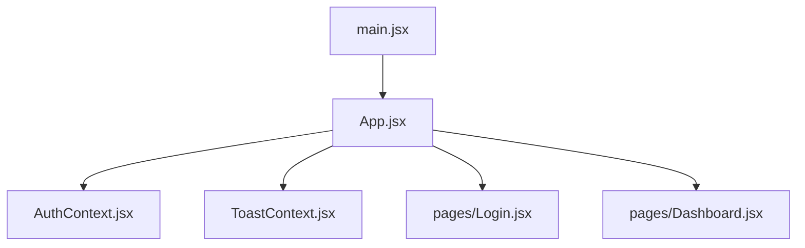
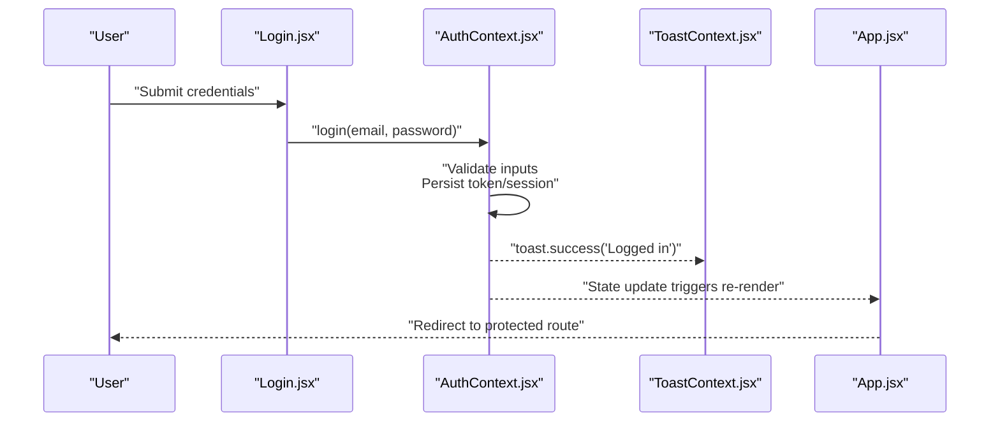
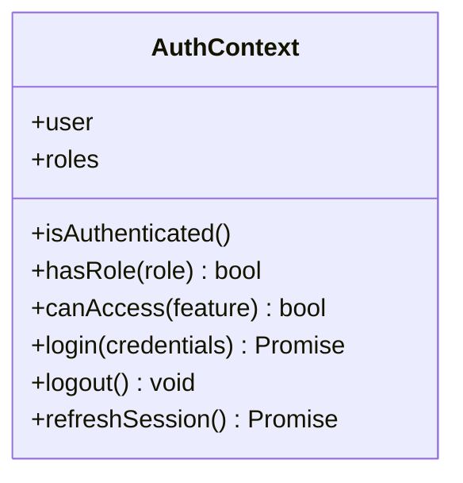
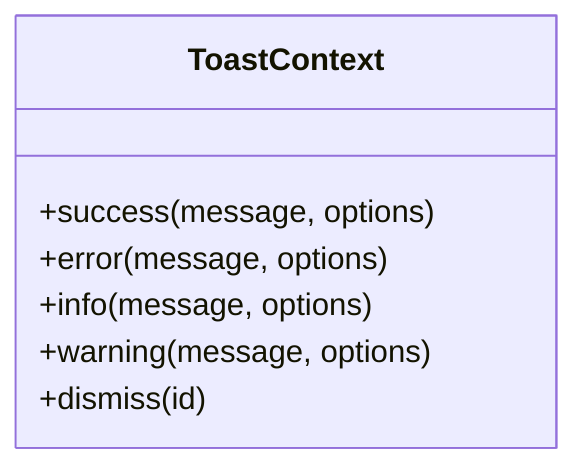
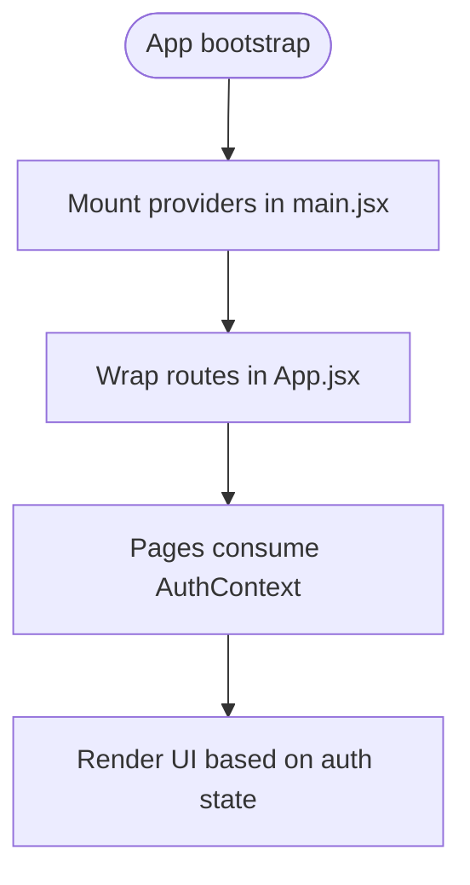
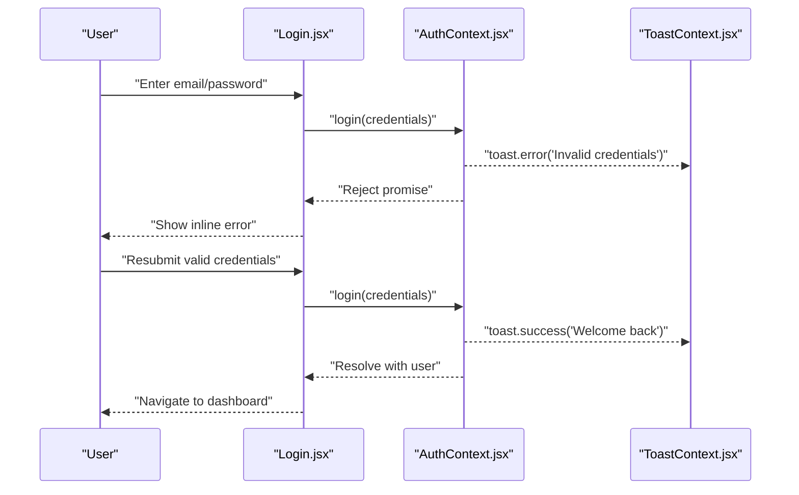
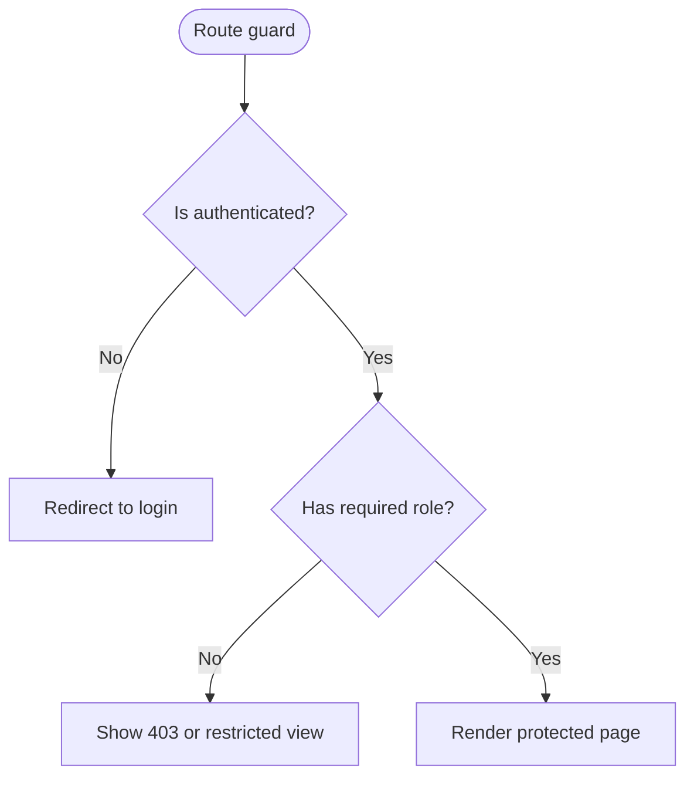
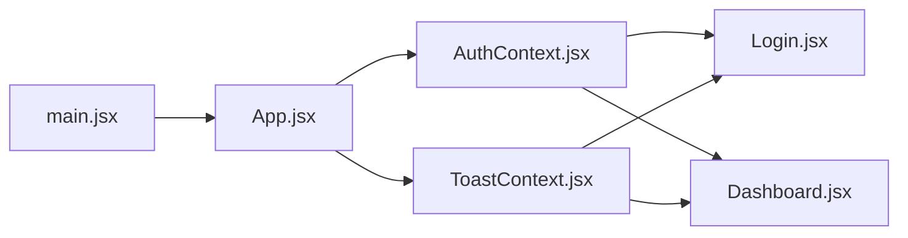

# State Management

<cite>
**Referenced Files in This Document**
- [AuthContext.jsx](file://frontend/src/context/AuthContext.jsx)
- [ToastContext.jsx](file://frontend/src/context/ToastContext.jsx)
- [App.jsx](file://frontend/src/App.jsx)
- [main.jsx](file://frontend/src/main.jsx)
- [Login.jsx](file://frontend/src/pages/Login.jsx)
- [Dashboard.jsx](file://frontend/src/pages/Dashboard.jsx)
</cite>

## Table of Contents
1. [Introduction](#introduction)
2. [Project Structure](#project-structure)
3. [Core Components](#core-components)
4. [Architecture Overview](#architecture-overview)
5. [Detailed Component Analysis](#detailed-component-analysis)
6. [Dependency Analysis](#dependency-analysis)
7. [Performance Considerations](#performance-considerations)
8. [Troubleshooting Guide](#troubleshooting-guide)
9. [Conclusion](#conclusion)

## Introduction
This document explains the React Context-based state management system used for authentication, session handling, token management, role-based access control (RBAC), and toast notifications. It covers how global application state is shared between components, how providers are set up, and best practices to keep the UI consistent and secure.

## Project Structure
The frontend uses a small number of context files to centralize cross-cutting concerns:
- Authentication and RBAC via an auth context
- Toast notifications via a toast context
- Provider wiring at the app root
- Pages consuming contexts for login flows and protected routes

**Diagram sources**
- [main.jsx](file://frontend/src/main.jsx)
- [App.jsx](file://frontend/src/App.jsx)
- [AuthContext.jsx](file://frontend/src/context/AuthContext.jsx)
- [ToastContext.jsx](file://frontend/src/context/ToastContext.jsx)
- [Login.jsx](file://frontend/src/pages/Login.jsx)
- [Dashboard.jsx](file://frontend/src/pages/Dashboard.jsx)

**Section sources**
- [main.jsx](file://frontend/src/main.jsx)
- [App.jsx](file://frontend/src/App.jsx)
- [AuthContext.jsx](file://frontend/src/context/AuthContext.jsx)
- [ToastContext.jsx](file://frontend/src/context/ToastContext.jsx)
- [Login.jsx](file://frontend/src/pages/Login.jsx)
- [Dashboard.jsx](file://frontend/src/pages/Dashboard.jsx)

## Core Components
- AuthContext: Provides user session state, token storage, login/logout actions, and RBAC helpers.
- ToastContext: Provides a centralized notification API for success, info, warning, and error messages.
- App.jsx: Wires providers and defines routing or layout that consumes auth state.
- main.jsx: Bootstraps the React app and mounts the provider tree.
- Login.jsx: Consumes auth context to authenticate users and handle errors.
- Dashboard.jsx: Example of a protected page that checks roles before rendering.

Key responsibilities:
- Centralized state for authenticated user and tokens
- Consistent user feedback via toasts
- Role checks to gate access to features or pages
- Clear separation of concerns between UI and state logic

**Section sources**
- [AuthContext.jsx](file://frontend/src/context/AuthContext.jsx)
- [ToastContext.jsx](file://frontend/src/context/ToastContext.jsx)
- [App.jsx](file://frontend/src/App.jsx)
- [main.jsx](file://frontend/src/main.jsx)
- [Login.jsx](file://frontend/src/pages/Login.jsx)
- [Dashboard.jsx](file://frontend/src/pages/Dashboard.jsx)

## Architecture Overview
The application follows a provider-consumer pattern with React Context:
- Providers wrap the app to expose global state and actions
- Pages and components consume contexts to read state and trigger updates
- Token persistence ensures sessions survive refreshes
- RBAC guards protect sensitive routes and features

**Diagram sources**
- [Login.jsx](file://frontend/src/pages/Login.jsx)
- [AuthContext.jsx](file://frontend/src/context/AuthContext.jsx)
- [ToastContext.jsx](file://frontend/src/context/ToastContext.jsx)
- [App.jsx](file://frontend/src/App.jsx)

## Detailed Component Analysis

### Authentication Context (AuthContext)
Responsibilities:
- Maintain current user profile and roles
- Store and manage JWT or session tokens securely
- Provide login, logout, and refresh utilities
- Expose RBAC helpers (e.g., hasRole, canAccess)
- Persist session across browser refreshes

Typical usage patterns:
- Consume context in protected pages to check roles
- Use login/logout actions from forms or navigation
- Guard UI elements based on roles

Best practices:
- Keep token storage minimal and secure
- Normalize user data shape for predictable comparisons
- Centralize token refresh and expiration handling
- Avoid exposing sensitive data in logs

**Diagram sources**
- [AuthContext.jsx](file://frontend/src/context/AuthContext.jsx)

**Section sources**
- [AuthContext.jsx](file://frontend/src/context/AuthContext.jsx)

### Toast Notification System (ToastContext)
Responsibilities:
- Provide a global API to show success, info, warning, and error toasts
- Manage message queue and display lifecycle
- Allow dismissing toasts programmatically or automatically

Usage patterns:
- Show success after successful mutations
- Display validation or server errors
- Provide non-blocking guidance during long operations

Best practices:
- Keep messages concise and actionable
- Avoid spamming; group related messages when possible
- Ensure accessibility by announcing changes to screen readers

**Diagram sources**
- [ToastContext.jsx](file://frontend/src/context/ToastContext.jsx)

**Section sources**
- [ToastContext.jsx](file://frontend/src/context/ToastContext.jsx)

### Provider Setup and App Wiring
- main.jsx initializes the React app and mounts the provider tree
- App.jsx configures routing and wraps content with providers
- Consumers anywhere in the tree can access auth and toast APIs

**Diagram sources**
- [main.jsx](file://frontend/src/main.jsx)
- [App.jsx](file://frontend/src/App.jsx)

**Section sources**
- [main.jsx](file://frontend/src/main.jsx)
- [App.jsx](file://frontend/src/App.jsx)

### Login Flow and Error Handling
The login flow integrates auth and toast contexts to provide clear feedback:
- Validate inputs locally
- Call login action from auth context
- On success, persist session and redirect
- On failure, show error toast and keep user on login page

**Diagram sources**
- [Login.jsx](file://frontend/src/pages/Login.jsx)
- [AuthContext.jsx](file://frontend/src/context/AuthContext.jsx)
- [ToastContext.jsx](file://frontend/src/context/ToastContext.jsx)

**Section sources**
- [Login.jsx](file://frontend/src/pages/Login.jsx)
- [AuthContext.jsx](file://frontend/src/context/AuthContext.jsx)
- [ToastContext.jsx](file://frontend/src/context/ToastContext.jsx)

### Protected Routes and Role-Based Access Control
Protected pages use RBAC helpers to determine visibility:
- Check if user is authenticated
- Verify required roles or permissions
- Redirect or render fallback UI when access is denied

**Diagram sources**
- [AuthContext.jsx](file://frontend/src/context/AuthContext.jsx)
- [Dashboard.jsx](file://frontend/src/pages/Dashboard.jsx)

**Section sources**
- [AuthContext.jsx](file://frontend/src/context/AuthContext.jsx)
- [Dashboard.jsx](file://frontend/src/pages/Dashboard.jsx)

## Dependency Analysis
Contexts are consumed by multiple pages and components. The following diagram shows key relationships:

**Diagram sources**
- [AuthContext.jsx](file://frontend/src/context/AuthContext.jsx)
- [ToastContext.jsx](file://frontend/src/context/ToastContext.jsx)
- [App.jsx](file://frontend/src/App.jsx)
- [main.jsx](file://frontend/src/main.jsx)
- [Login.jsx](file://frontend/src/pages/Login.jsx)
- [Dashboard.jsx](file://frontend/src/pages/Dashboard.jsx)

**Section sources**
- [AuthContext.jsx](file://frontend/src/context/AuthContext.jsx)
- [ToastContext.jsx](file://frontend/src/context/ToastContext.jsx)
- [App.jsx](file://frontend/src/App.jsx)
- [main.jsx](file://frontend/src/main.jsx)
- [Login.jsx](file://frontend/src/pages/Login.jsx)
- [Dashboard.jsx](file://frontend/src/pages/Dashboard.jsx)

## Performance Considerations
- Memoize context values to avoid unnecessary re-renders
- Split large contexts into focused ones (auth vs. toasts)
- Debounce frequent toast updates and limit concurrent messages
- Prefer lazy loading of protected routes to reduce initial bundle size
- Avoid storing large payloads in context; prefer lightweight identifiers and fetch details on demand

## Troubleshooting Guide
Common issues and resolutions:
- Token not persisted across refreshes
  - Ensure token storage is initialized early and survives reloads
  - Validate storage keys and serialization
- Unauthorized redirects loop
  - Confirm RBAC checks run before rendering protected routes
  - Verify role names match backend claims
- Toasts not appearing
  - Check that ToastProvider wraps the app
  - Ensure toast IDs are unique and not overwritten
- Login succeeds but UI does not update
  - Verify login action returns a resolved promise and updates context state
  - Confirm consumers subscribe to the correct context fields

**Section sources**
- [AuthContext.jsx](file://frontend/src/context/AuthContext.jsx)
- [ToastContext.jsx](file://frontend/src/context/ToastContext.jsx)
- [Login.jsx](file://frontend/src/pages/Login.jsx)
- [Dashboard.jsx](file://frontend/src/pages/Dashboard.jsx)

## Conclusion
The React Context-based approach centralizes authentication, session management, and user feedback, enabling consistent behavior across the application. By separating concerns into focused contexts, implementing robust RBAC checks, and providing clear user feedback through toasts, the system remains maintainable and scalable. Follow the best practices outlined here to ensure security, performance, and a great user experience.