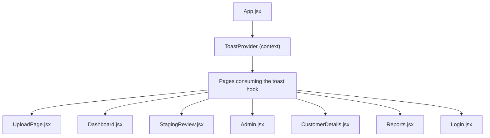
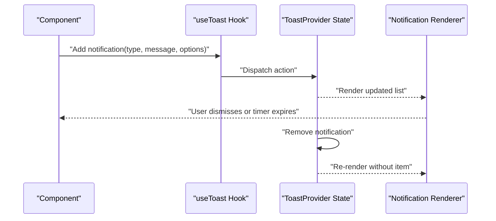
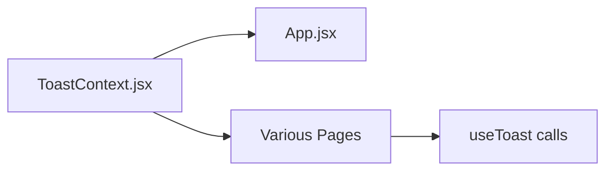

# Toast Notification System

<cite>
**Referenced Files in This Document**
- [ToastContext.jsx](file://frontend/src/context/ToastContext.jsx)
- [App.jsx](file://frontend/src/App.jsx)
- [UploadPage.jsx](file://frontend/src/pages/UploadPage.jsx)
- [Dashboard.jsx](file://frontend/src/pages/Dashboard.jsx)
- [StagingReview.jsx](file://frontend/src/pages/StagingReview.jsx)
- [Admin.jsx](file://frontend/src/pages/Admin.jsx)
- [CustomerDetails.jsx](file://frontend/src/pages/CustomerDetails.jsx)
- [Reports.jsx](file://frontend/src/pages/Reports.jsx)
- [Login.jsx](file://frontend/src/pages/Login.jsx)
</cite>

## Table of Contents
1. [Introduction](#introduction)
2. [Project Structure](#project-structure)
3. [Core Components](#core-components)
4. [Architecture Overview](#architecture-overview)
5. [Detailed Component Analysis](#detailed-component-analysis)
6. [Dependency Analysis](#dependency-analysis)
7. [Performance Considerations](#performance-considerations)
8. [Troubleshooting Guide](#troubleshooting-guide)
9. [Conclusion](#conclusion)

## Introduction
This document explains the toast notification system used across the frontend application. It covers how to create different types of notifications (success, error, warning, info), configure options such as duration and positioning, manage the lifecycle of notifications, set up the provider, integrate with components, and customize styling and accessibility. It also provides practical examples for displaying validation errors, success messages, and system alerts.

## Project Structure
The toast system is implemented using a React context that exposes actions to dispatch notifications and a hook to consume them from anywhere in the component tree. The provider is mounted at the app root so all pages can use it.

**Diagram sources**
- [App.jsx](file://frontend/src/App.jsx)
- [ToastContext.jsx](file://frontend/src/context/ToastContext.jsx)
- [UploadPage.jsx](file://frontend/src/pages/UploadPage.jsx)
- [Dashboard.jsx](file://frontend/src/pages/Dashboard.jsx)
- [StagingReview.jsx](file://frontend/src/pages/StagingReview.jsx)
- [Admin.jsx](file://frontend/src/pages/Admin.jsx)
- [CustomerDetails.jsx](file://frontend/src/pages/CustomerDetails.jsx)
- [Reports.jsx](file://frontend/src/pages/Reports.jsx)
- [Login.jsx](file://frontend/src/pages/Login.jsx)

**Section sources**
- [App.jsx](file://frontend/src/App.jsx)
- [ToastContext.jsx](file://frontend/src/context/ToastContext.jsx)

## Core Components
- ToastProvider: A context provider that manages the global state of active notifications and exposes methods to add, update, or remove them.
- useToast hook: A consumer hook that returns functions to trigger notifications and access current notification data.

Typical responsibilities:
- Maintain an internal list of notifications with unique identifiers.
- Provide helper methods to enqueue notifications with type, message, and optional configuration.
- Render the notification container and individual items.
- Handle auto-dismiss timers and manual dismissal.

Integration points:
- Wrapped around the application root to make the hook available globally.
- Consumed by feature pages and shared components to display feedback.

**Section sources**
- [ToastContext.jsx](file://frontend/src/context/ToastContext.jsx)
- [App.jsx](file://frontend/src/App.jsx)

## Architecture Overview
The architecture follows a unidirectional flow:
- Components call the toast hook to enqueue a notification.
- The provider updates its state and renders the notification UI.
- Each notification has a lifecycle managed by timers and user interactions.

**Diagram sources**
- [ToastContext.jsx](file://frontend/src/context/ToastContext.jsx)

## Detailed Component Analysis

### ToastProvider Setup
- Mount the provider once at the application root so all child components can use the hook.
- Ensure the provider wraps routing and layout components to guarantee availability.

Usage pattern:
- Wrap the top-level component tree with the provider.
- Import the hook in any component that needs to show notifications.

**Section sources**
- [App.jsx](file://frontend/src/App.jsx)

### Creating Notifications
Common notification types:
- Success: Used for completed operations like uploads or approvals.
- Error: Used for failures such as network errors or server-side validation.
- Warning: Used for cautionary states like partial imports or deprecations.
- Info: Used for general informational messages.

Options typically include:
- Duration: Auto-dismiss time in milliseconds.
- Position: Placement on screen (e.g., top-right).
- Dismissible: Whether the user can manually close it.
- Icon or variant: Visual style tied to the type.

Examples by scenario:
- Validation errors: Enqueue an error notification when form fields fail validation.
- Success messages: Show a success notification after saving or uploading.
- System alerts: Display warnings or info for non-blocking system events.

Where these are used:
- Upload flows: Trigger notifications on upload start, progress, success, and failure.
- Data review screens: Use warnings/info for contextual guidance.
- Authentication flows: Show errors for invalid credentials or success on login.

**Section sources**
- [UploadPage.jsx](file://frontend/src/pages/UploadPage.jsx)
- [Dashboard.jsx](file://frontend/src/pages/Dashboard.jsx)
- [StagingReview.jsx](file://frontend/src/pages/StagingReview.jsx)
- [Admin.jsx](file://frontend/src/pages/Admin.jsx)
- [CustomerDetails.jsx](file://frontend/src/pages/CustomerDetails.jsx)
- [Reports.jsx](file://frontend/src/pages/Reports.jsx)
- [Login.jsx](file://frontend/src/pages/Login.jsx)

### Managing Lifecycle
Key lifecycle behaviors:
- Creation: When a notification is added, it receives a unique ID and initial state.
- Visibility: The renderer displays the notification based on position and stacking rules.
- Dismissal: Users can dismiss manually; otherwise, a timer removes it automatically.
- Cleanup: Removed notifications are deleted from state to prevent memory growth.

Best practices:
- Avoid duplicate notifications by checking existing IDs or grouping similar messages.
- Set reasonable durations for critical vs. non-critical messages.
- Prefer explicit dismissal for important actions requiring acknowledgment.

**Section sources**
- [ToastContext.jsx](file://frontend/src/context/ToastContext.jsx)

### Custom Notification Components
To customize appearance or behavior:
- Replace the default renderer with a custom component that consumes the same data shape.
- Support variants mapped to notification types (success, error, warning, info).
- Implement consistent spacing, typography, and iconography.

Accessibility considerations:
- Announce new notifications to assistive technologies.
- Provide keyboard support to focus and dismiss notifications.
- Ensure sufficient color contrast and readable text sizes.

Styling customization:
- Use CSS variables or theme tokens for colors, borders, and shadows.
- Allow overriding position and stacking order via props or theme config.
- Keep animations subtle and respect reduced motion preferences.

**Section sources**
- [ToastContext.jsx](file://frontend/src/context/ToastContext.jsx)

### Integration Patterns
- Page-level usage: Import the hook in page components and call it within event handlers or effects.
- Shared logic: Extract reusable helpers that wrap common patterns (e.g., showing a generic error).
- Conditional rendering: Only render the toast container if there are active notifications.

Example integration points:
- UploadPage: Handles file selection, validation, and upload callbacks to show status.
- Dashboard: Displays summary alerts or quick actions feedback.
- StagingReview: Shows warnings about data quality or pending changes.
- Admin: Confirms administrative actions and reports failures.
- CustomerDetails: Provides feedback for edits and saves.
- Reports: Indicates export or generation progress and completion.
- Login: Communicates authentication outcomes.

**Section sources**
- [UploadPage.jsx](file://frontend/src/pages/UploadPage.jsx)
- [Dashboard.jsx](file://frontend/src/pages/Dashboard.jsx)
- [StagingReview.jsx](file://frontend/src/pages/StagingReview.jsx)
- [Admin.jsx](file://frontend/src/pages/Admin.jsx)
- [CustomerDetails.jsx](file://frontend/src/pages/CustomerDetails.jsx)
- [Reports.jsx](file://frontend/src/pages/Reports.jsx)
- [Login.jsx](file://frontend/src/pages/Login.jsx)

## Dependency Analysis
The toast system has minimal dependencies:
- React context and hooks for state management.
- Optional animation libraries if transitions are used.
- Styling approach (CSS modules, styled-components, or plain CSS) depending on project setup.

Coupling:
- Low coupling between providers and consumers; only the hook interface is required.
- Clear separation between state management and rendering.

Potential circular dependencies:
- None expected, as the provider does not depend on page components.

External integrations:
- Could integrate with global error boundaries or logging services to capture unexpected failures.

**Diagram sources**
- [ToastContext.jsx](file://frontend/src/context/ToastContext.jsx)
- [App.jsx](file://frontend/src/App.jsx)
- [UploadPage.jsx](file://frontend/src/pages/UploadPage.jsx)
- [Dashboard.jsx](file://frontend/src/pages/Dashboard.jsx)
- [StagingReview.jsx](file://frontend/src/pages/StagingReview.jsx)
- [Admin.jsx](file://frontend/src/pages/Admin.jsx)
- [CustomerDetails.jsx](file://frontend/src/pages/CustomerDetails.jsx)
- [Reports.jsx](file://frontend/src/pages/Reports.jsx)
- [Login.jsx](file://frontend/src/pages/Login.jsx)

**Section sources**
- [ToastContext.jsx](file://frontend/src/context/ToastContext.jsx)
- [App.jsx](file://frontend/src/App.jsx)

## Performance Considerations
- Batch updates: Group multiple notifications into a single re-render where possible.
- Debounce rapid triggers: Prevent spamming notifications during frequent events.
- Limit concurrent notifications: Cap the number of visible items to avoid clutter.
- Efficient removal: Remove notifications promptly after dismissal to free resources.
- Animation performance: Use GPU-accelerated transforms and respect reduced motion settings.

[No sources needed since this section provides general guidance]

## Troubleshooting Guide
Common issues and resolutions:
- Notifications not appearing:
  - Verify the provider is mounted at the app root.
  - Ensure the hook is imported and called correctly in the component.
- Duplicate notifications:
  - Check for repeated triggers and deduplicate by message or ID.
- Timers not clearing:
  - Confirm cleanup logic runs on unmount or dismissal.
- Accessibility problems:
  - Add aria-live regions and ensure focus management for keyboard users.
- Styling conflicts:
  - Scope styles to the toast container and avoid global overrides.

**Section sources**
- [ToastContext.jsx](file://frontend/src/context/ToastContext.jsx)
- [App.jsx](file://frontend/src/App.jsx)

## Conclusion
The toast notification system provides a simple, accessible, and customizable way to deliver user feedback throughout the application. By centralizing state in a provider and exposing a clean hook, it enables consistent UX across pages while remaining easy to extend and style. Following the recommended patterns ensures reliable lifecycle management, good performance, and strong accessibility compliance.

[No sources needed since this section summarizes without analyzing specific files]