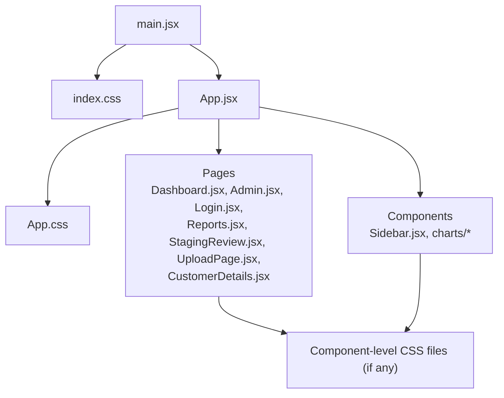
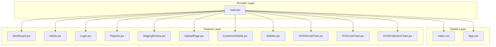
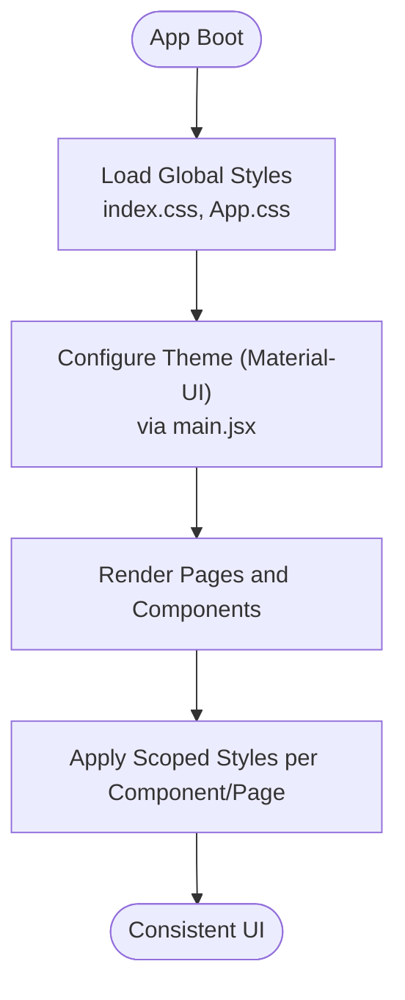
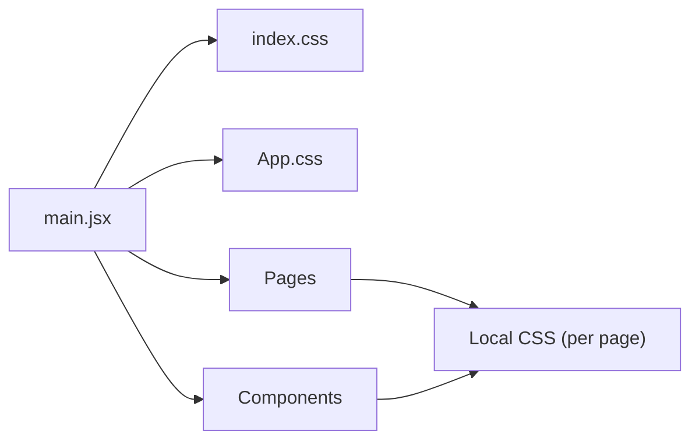

# Styling and Theming

<cite>
**Referenced Files in This Document**
- [App.css](file://frontend/src/App.css)
- [index.css](file://frontend/src/index.css)
- [main.jsx](file://frontend/src/main.jsx)
- [App.jsx](file://frontend/src/App.jsx)
- [Sidebar.jsx](file://frontend/src/components/Sidebar.jsx)
- [SVGDonutChart.jsx](file://frontend/src/components/charts/SVGDonutChart.jsx)
- [SVGLineChart.jsx](file://frontend/src/components/charts/SVGLineChart.jsx)
- [SVGPredictionChart.jsx](file://frontend/src/components/charts/SVGPredictionChart.jsx)
- [Dashboard.jsx](file://frontend/src/pages/Dashboard.jsx)
- [Admin.jsx](file://frontend/src/pages/Admin.jsx)
- [CustomerDetails.jsx](file://frontend/src/pages/CustomerDetails.jsx)
- [Login.jsx](file://frontend/src/pages/Login.jsx)
- [Reports.jsx](file://frontend/src/pages/Reports.jsx)
- [StagingReview.jsx](file://frontend/src/pages/StagingReview.jsx)
- [UploadPage.jsx](file://frontend/src/pages/UploadPage.jsx)
</cite>

## Table of Contents
1. [Introduction](#introduction)
2. [Project Structure](#project-structure)
3. [Core Components](#core-components)
4. [Architecture Overview](#architecture-overview)
5. [Detailed Component Analysis](#detailed-component-analysis)
6. [Dependency Analysis](#dependency-analysis)
7. [Performance Considerations](#performance-considerations)
8. [Troubleshooting Guide](#troubleshooting-guide)
9. [Conclusion](#conclusion)
10. [Appendices](#appendices)

## Introduction
This document explains the styling approach and theming system used across the frontend application. It covers global styles, component-specific styling patterns, responsive design strategies, and how Material-UI is integrated. It also provides guidelines for extending or customizing the visual theme and maintaining consistent styling throughout the application.

## Project Structure
The styling assets are primarily located under the frontend source directory:
- Global styles and base resets live in index.css and App.css.
- The React entry point imports global CSS and sets up providers that may influence theming (for example, Material-UI ThemeProvider).
- Pages and components import their own styles as needed, following a feature-based organization.

**Diagram sources**
- [main.jsx](file://frontend/src/main.jsx)
- [index.css](file://frontend/src/index.css)
- [App.jsx](file://frontend/src/App.jsx)
- [App.css](file://frontend/src/App.css)
- [Dashboard.jsx](file://frontend/src/pages/Dashboard.jsx)
- [Admin.jsx](file://frontend/src/pages/Admin.jsx)
- [Login.jsx](file://frontend/src/pages/Login.jsx)
- [Reports.jsx](file://frontend/src/pages/Reports.jsx)
- [StagingReview.jsx](file://frontend/src/pages/StagingReview.jsx)
- [UploadPage.jsx](file://frontend/src/pages/UploadPage.jsx)
- [CustomerDetails.jsx](file://frontend/src/pages/CustomerDetails.jsx)
- [Sidebar.jsx](file://frontend/src/components/Sidebar.jsx)
- [SVGDonutChart.jsx](file://frontend/src/components/charts/SVGDonutChart.jsx)
- [SVGLineChart.jsx](file://frontend/src/components/charts/SVGLineChart.jsx)
- [SVGPredictionChart.jsx](file://frontend/src/components/charts/SVGPredictionChart.jsx)

**Section sources**
- [main.jsx](file://frontend/src/main.jsx)
- [index.css](file://frontend/src/index.css)
- [App.jsx](file://frontend/src/App.jsx)
- [App.css](file://frontend/src/App.css)

## Core Components
- Global styles:
  - Base typography, color tokens, spacing, and layout resets are centralized in index.css and App.css to ensure consistency across all pages and components.
- Page-level styles:
  - Each page file (for example, Dashboard.jsx, Admin.jsx, Login.jsx, Reports.jsx, StagingReview.jsx, UploadPage.jsx, CustomerDetails.jsx) can import its own CSS module or stylesheet to scope styles to that view.
- Shared components:
  - Sidebar.jsx and chart components (SVGDonutChart.jsx, SVGLineChart.jsx, SVGPredictionChart.jsx) encapsulate their own styling to keep presentation logic close to behavior.

Guidelines:
- Prefer importing styles at the component level when styles are specific to a single component or page.
- Keep shared tokens (colors, fonts, spacing) in global styles to avoid duplication.
- Use CSS classes with clear, descriptive names that reflect purpose rather than implementation details.

**Section sources**
- [index.css](file://frontend/src/index.css)
- [App.css](file://frontend/src/App.css)
- [Sidebar.jsx](file://frontend/src/components/Sidebar.jsx)
- [SVGDonutChart.jsx](file://frontend/src/components/charts/SVGDonutChart.jsx)
- [SVGLineChart.jsx](file://frontend/src/components/charts/SVGLineChart.jsx)
- [SVGPredictionChart.jsx](file://frontend/src/components/charts/SVGPredictionChart.jsx)
- [Dashboard.jsx](file://frontend/src/pages/Dashboard.jsx)
- [Admin.jsx](file://frontend/src/pages/Admin.jsx)
- [Login.jsx](file://frontend/src/pages/Login.jsx)
- [Reports.jsx](file://frontend/src/pages/Reports.jsx)
- [StagingReview.jsx](file://frontend/src/pages/StagingReview.jsx)
- [UploadPage.jsx](file://frontend/src/pages/UploadPage.jsx)
- [CustomerDetails.jsx](file://frontend/src/pages/CustomerDetails.jsx)

## Architecture Overview
The styling architecture follows a layered approach:
- Global layer: index.css and App.css provide base resets, typography, color tokens, and layout utilities.
- Provider layer: main.jsx bootstraps the app and may configure Material-UI ThemeProvider to supply theme values globally.
- Feature layer: pages and components import scoped styles and rely on global tokens for consistency.

**Diagram sources**
- [main.jsx](file://frontend/src/main.jsx)
- [index.css](file://frontend/src/index.css)
- [App.css](file://frontend/src/App.css)
- [Dashboard.jsx](file://frontend/src/pages/Dashboard.jsx)
- [Admin.jsx](file://frontend/src/pages/Admin.jsx)
- [Login.jsx](file://frontend/src/pages/Login.jsx)
- [Reports.jsx](file://frontend/src/pages/Reports.jsx)
- [StagingReview.jsx](file://frontend/src/pages/StagingReview.jsx)
- [UploadPage.jsx](file://frontend/src/pages/UploadPage.jsx)
- [CustomerDetails.jsx](file://frontend/src/pages/CustomerDetails.jsx)
- [Sidebar.jsx](file://frontend/src/components/Sidebar.jsx)
- [SVGDonutChart.jsx](file://frontend/src/components/charts/SVGDonutChart.jsx)
- [SVGLineChart.jsx](file://frontend/src/components/charts/SVGLineChart.jsx)
- [SVGPredictionChart.jsx](file://frontend/src/components/charts/SVGPredictionChart.jsx)

## Detailed Component Analysis

### Global Styles and Theme Entry Points
- index.css: Centralizes base resets, typography defaults, and global variables.
- App.css: Provides application-wide layout rules and reusable utility classes.
- main.jsx: Initializes the React tree and may wrap it with Material-UI ThemeProvider to propagate theme values to all components.

Best practices:
- Define semantic tokens (colors, spacing, radii) in global styles to enable consistent theming.
- Avoid overriding global tokens within components; instead, extend or override via theme configuration.

**Section sources**
- [index.css](file://frontend/src/index.css)
- [App.css](file://frontend/src/App.css)
- [main.jsx](file://frontend/src/main.jsx)

### Layout and Navigation (Sidebar)
- Sidebar.jsx encapsulates navigation UI and related styles.
- Use global tokens for colors and spacing to align with the overall theme.
- Ensure accessibility attributes (aria-labels, roles) are present where applicable.

**Section sources**
- [Sidebar.jsx](file://frontend/src/components/Sidebar.jsx)

### Charts (SVG-based)
- SVGDonutChart.jsx, SVGLineChart.jsx, SVGPredictionChart.jsx implement custom SVG visuals.
- Style these components using CSS classes scoped to each chart to prevent cross-component leakage.
- Leverage theme tokens for stroke/fill colors to support dark/light modes.

**Section sources**
- [SVGDonutChart.jsx](file://frontend/src/components/charts/SVGDonutChart.jsx)
- [SVGLineChart.jsx](file://frontend/src/components/charts/SVGLineChart.jsx)
- [SVGPredictionChart.jsx](file://frontend/src/components/charts/SVGPredictionChart.jsx)

### Pages
- Dashboard.jsx, Admin.jsx, Login.jsx, Reports.jsx, StagingReview.jsx, UploadPage.jsx, CustomerDetails.jsx:
  - Import page-specific styles if needed.
  - Rely on global tokens for consistency.
  - Maintain responsive layouts using media queries or flexible grid systems.

**Section sources**
- [Dashboard.jsx](file://frontend/src/pages/Dashboard.jsx)
- [Admin.jsx](file://frontend/src/pages/Admin.jsx)
- [Login.jsx](file://frontend/src/pages/Login.jsx)
- [Reports.jsx](file://frontend/src/pages/Reports.jsx)
- [StagingReview.jsx](file://frontend/src/pages/StagingReview.jsx)
- [UploadPage.jsx](file://frontend/src/pages/UploadPage.jsx)
- [CustomerDetails.jsx](file://frontend/src/pages/CustomerDetails.jsx)

### Conceptual Overview

[No sources needed since this diagram shows conceptual workflow, not actual code structure]

## Dependency Analysis
- main.jsx depends on global CSS files and may depend on Material-UI ThemeProvider to distribute theme values.
- Pages and components depend on global tokens and may import local styles.
- Chart components depend on CSS classes defined alongside them to style SVG elements.

**Diagram sources**
- [main.jsx](file://frontend/src/main.jsx)
- [index.css](file://frontend/src/index.css)
- [App.css](file://frontend/src/App.css)
- [Dashboard.jsx](file://frontend/src/pages/Dashboard.jsx)
- [Admin.jsx](file://frontend/src/pages/Admin.jsx)
- [Login.jsx](file://frontend/src/pages/Login.jsx)
- [Reports.jsx](file://frontend/src/pages/Reports.jsx)
- [StagingReview.jsx](file://frontend/src/pages/StagingReview.jsx)
- [UploadPage.jsx](file://frontend/src/pages/UploadPage.jsx)
- [CustomerDetails.jsx](file://frontend/src/pages/CustomerDetails.jsx)
- [Sidebar.jsx](file://frontend/src/components/Sidebar.jsx)
- [SVGDonutChart.jsx](file://frontend/src/components/charts/SVGDonutChart.jsx)
- [SVGLineChart.jsx](file://frontend/src/components/charts/SVGLineChart.jsx)
- [SVGPredictionChart.jsx](file://frontend/src/components/charts/SVGPredictionChart.jsx)

**Section sources**
- [main.jsx](file://frontend/src/main.jsx)
- [index.css](file://frontend/src/index.css)
- [App.css](file://frontend/src/App.css)

## Performance Considerations
- Keep global styles minimal and focused on tokens and base resets to reduce cascade overhead.
- Scope styles to components to avoid unnecessary reflows and repaints.
- Prefer CSS variables for frequently changing theme values to minimize recalculation.
- Defer heavy component styles until needed (lazy loading) to improve initial load time.

[No sources needed since this section provides general guidance]

## Troubleshooting Guide
Common issues and resolutions:
- Styles not applying:
  - Verify that the component’s CSS file is imported and class names match exactly.
  - Check for specificity conflicts in global styles.
- Theme overrides not taking effect:
  - Ensure ThemeProvider wraps the root component in main.jsx and that theme values are correctly extended.
- Responsive breakpoints not working:
  - Confirm media queries use consistent breakpoint tokens from global styles.
- Chart colors inconsistent:
  - Use theme tokens for fill/stroke colors in chart components and avoid hard-coded values.

**Section sources**
- [index.css](file://frontend/src/index.css)
- [App.css](file://frontend/src/App.css)
- [main.jsx](file://frontend/src/main.jsx)
- [SVGDonutChart.jsx](file://frontend/src/components/charts/SVGDonutChart.jsx)
- [SVGLineChart.jsx](file://frontend/src/components/charts/SVGLineChart.jsx)
- [SVGPredictionChart.jsx](file://frontend/src/components/charts/SVGPredictionChart.jsx)

## Conclusion
By centralizing global tokens, scoping component styles, and leveraging Material-UI’s theming through ThemeProvider, the application maintains a consistent and extensible visual system. Following the naming conventions and responsive strategies outlined here will help preserve coherence as the codebase grows.

[No sources needed since this section summarizes without analyzing specific files]

## Appendices

### Naming Conventions
- Use descriptive, purpose-driven class names (for example, card-header, chart-container).
- Avoid generic names like container or box unless they represent truly generic layout primitives.
- Keep component-scoped styles isolated to prevent unintended side effects.

### Extending and Customizing the Theme
- Extend theme values in the provider setup in main.jsx to apply changes globally.
- Use semantic tokens (primary, secondary, surface, text) to maintain contrast and accessibility.
- For component-specific overrides, prefer props or wrapper classes rather than global overrides.

### Responsive Design Strategies
- Define breakpoints in global styles and reuse them consistently across components.
- Use flexible grids and relative units (rem, %) to adapt layouts fluidly.
- Test key pages (Dashboard, Reports, UploadPage) on mobile and tablet sizes.

### Material-UI Integration Guidelines
- Wrap the app with ThemeProvider in main.jsx to supply theme values.
- Use MUI components’ built-in theming hooks and props to align with the global theme.
- Override default MUI styles only when necessary, and document the rationale.

**Section sources**
- [main.jsx](file://frontend/src/main.jsx)
- [index.css](file://frontend/src/index.css)
- [App.css](file://frontend/src/App.css)
- [Dashboard.jsx](file://frontend/src/pages/Dashboard.jsx)
- [Reports.jsx](file://frontend/src/pages/Reports.jsx)
- [UploadPage.jsx](file://frontend/src/pages/UploadPage.jsx)