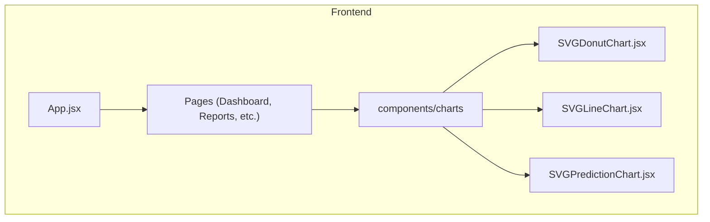
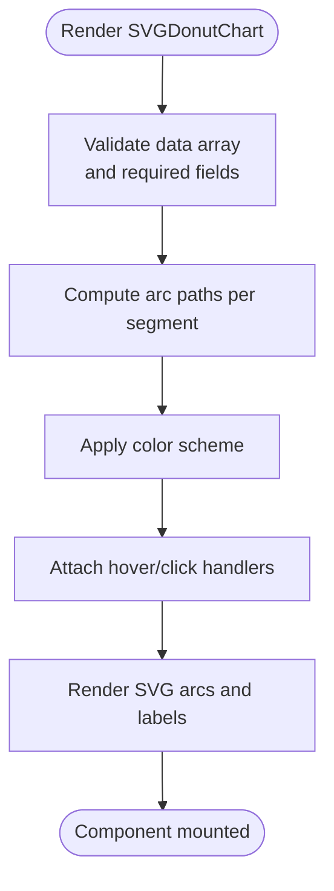
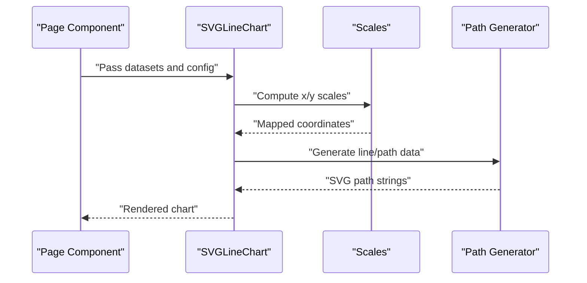
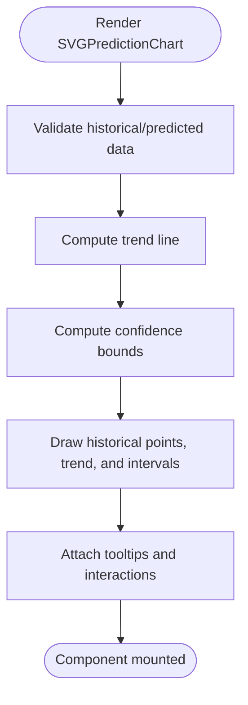
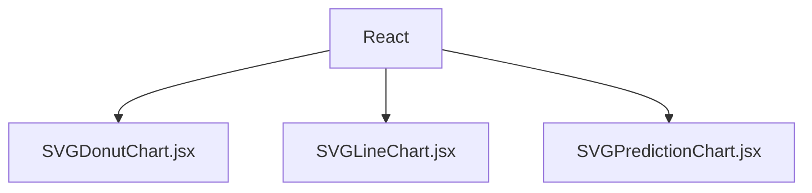

# Chart Components

<cite>
**Referenced Files in This Document**
- [SVGDonutChart.jsx](file://frontend/src/components/charts/SVGDonutChart.jsx)
- [SVGLineChart.jsx](file://frontend/src/components/charts/SVGLineChart.jsx)
- [SVGPredictionChart.jsx](file://frontend/src/components/charts/SVGPredictionChart.jsx)
</cite>

## Table of Contents
1. [Introduction](#introduction)
2. [Project Structure](#project-structure)
3. [Core Components](#core-components)
4. [Architecture Overview](#architecture-overview)
5. [Detailed Component Analysis](#detailed-component-analysis)
6. [Dependency Analysis](#dependency-analysis)
7. [Performance Considerations](#performance-considerations)
8. [Troubleshooting Guide](#troubleshooting-guide)
9. [Conclusion](#conclusion)
10. [Appendices](#appendices)

## Introduction
This document provides comprehensive documentation for the custom SVG chart components library used in the frontend application. It focuses on three core components:
- SVGDonutChart: A donut chart component for categorical data visualization with configurable color schemes and interactivity.
- SVGLineChart: A line chart component for time-series or ordered data, supporting styling and responsive behavior.
- SVGPredictionChart: A forecasting visualization component that renders trend lines and confidence intervals.

The goal is to help developers integrate these components into React applications effectively, understand their props and customization options, and apply best practices for performance and responsiveness.

## Project Structure
The chart components are implemented as standalone React functional components under a dedicated charts directory. They can be imported and used by any page or container component within the frontend application.



[No sources needed since this diagram shows conceptual workflow, not actual code structure]

## Core Components
This section summarizes each component’s purpose, key props, and typical usage patterns. For detailed prop definitions and implementation specifics, refer to the “Detailed Component Analysis” section and the corresponding file sources.

- SVGDonutChart
  - Purpose: Visualize categorical proportions using a donut shape.
  - Key capabilities: Data binding via an array of segments, customizable colors, optional hover interactions, and accessibility attributes.
  - Typical props: data, colors, size, label formatting, tooltip configuration, and event handlers.

- SVGLineChart
  - Purpose: Render one or more series of connected points over a continuous axis.
  - Key capabilities: Multiple series support, line styles (stroke width, dash arrays), markers, gridlines, axes labels, and responsive sizing.
  - Typical props: datasets, xScale/yScale, line styles, point markers, axes configuration, and responsive dimensions.

- SVGPredictionChart
  - Purpose: Display forecasted values with a central trend line and upper/lower confidence bands.
  - Key capabilities: Trend line rendering, confidence interval shading, interactive tooltips, and dynamic updates when predictions change.
  - Typical props: historicalData, predictedData, confidenceInterval, trend styling, and interval styling.

**Section sources**
- [SVGDonutChart.jsx](file://frontend/src/components/charts/SVGDonutChart.jsx)
- [SVGLineChart.jsx](file://frontend/src/components/charts/SVGLineChart.jsx)
- [SVGPredictionChart.jsx](file://frontend/src/components/charts/SVGPredictionChart.jsx)

## Architecture Overview
At a high level, pages consume the chart components by passing structured data and configuration objects. The components render pure SVG elements based on provided props and handle internal state for interactions such as hover and tooltips.

```mermaid
sequenceDiagram
participant Page as "Page Component"
participant Donut as "SVGDonutChart"
participant Line as "SVGLineChart"
participant Pred as "SVGPredictionChart"
Page->>Donut : "Render with data and config"
Page->>Line : "Render with datasets and scales"
Page->>Pred : "Render with historical/predicted data"
Note over Donut,Line,Pred : "Components compute SVG paths and shapes from props"
```

[No sources needed since this diagram shows conceptual workflow, not actual code structure]

## Detailed Component Analysis

### SVGDonutChart
- Responsibilities
  - Convert segment data into arc paths.
  - Apply color schemes and optional gradients.
  - Provide hover states and tooltips.
  - Maintain aspect ratio and responsive sizing.

- Props overview
  - data: Array of segments with value and label fields.
  - colors: Array of colors or a function mapping index/value to color.
  - size: Outer radius or explicit width/height.
  - innerRadius: Controls donut thickness.
  - labelFormat: Function to format display text.
  - tooltip: Boolean or object to enable/disable and configure tooltips.
  - events: Optional callbacks for click/hover.

- Interaction model
  - Hover highlights the active segment and displays a tooltip with formatted label and value.
  - Click can trigger navigation or drill-down actions via event handlers.

- Accessibility
  - Includes aria-labels and roles for screen readers.
  - Keyboard focusable segments with Enter/Space activation.

- Example usage pattern
  - Pass a dataset of categories and values.
  - Configure colors and label formatting.
  - Attach click handler for drill-down if needed.



**Diagram sources**
- [SVGDonutChart.jsx](file://frontend/src/components/charts/SVGDonutChart.jsx)

**Section sources**
- [SVGDonutChart.jsx](file://frontend/src/components/charts/SVGDonutChart.jsx)

### SVGLineChart
- Responsibilities
  - Map data points to SVG coordinates using scales.
  - Draw lines, markers, and optional area fills.
  - Render axes, gridlines, and legends.
  - Support multiple series and responsive resizing.

- Props overview
  - datasets: Array of series with x and y values.
  - xScale/yScale: Scale functions or configuration for domain/range.
  - lineStyle: Stroke width, color, dash array.
  - markerStyle: Point markers visibility and shape.
  - axes: Labels, ticks, and formatting options.
  - responsive: Boolean or dimension overrides.
  - tooltip: Enable/disable and configure tooltips.

- Responsive behavior
  - Recomputes scales on resize.
  - Uses viewBox or percentage-based dimensions to adapt to container size.

- Performance considerations
  - Memoizes scale computations and path generation.
  - Avoids unnecessary re-renders by stabilizing props and memoizing derived data.

- Example usage pattern
  - Provide datasets with consistent x/y keys.
  - Configure scales to match data domains.
  - Customize line and marker styles.
  - Enable tooltips for detailed inspection.



**Diagram sources**
- [SVGLineChart.jsx](file://frontend/src/components/charts/SVGLineChart.jsx)

**Section sources**
- [SVGLineChart.jsx](file://frontend/src/components/charts/SVGLineChart.jsx)

### SVGPredictionChart
- Responsibilities
  - Render historical data points and trend line.
  - Overlay confidence intervals as shaded regions.
  - Provide interactive tooltips for both historical and predicted values.
  - Update dynamically when prediction inputs change.

- Props overview
  - historicalData: Array of past observations with x/y.
  - predictedData: Array of forecasted points with x/y.
  - confidenceInterval: Upper and lower bounds arrays or computed from variance.
  - trendStyle: Styling for the main trend line.
  - intervalStyle: Styling for confidence band fill and borders.
  - tooltip: Configuration for displaying values and uncertainty.

- Visualization logic
  - Computes trend line from historical/predicted data.
  - Draws confidence bands between upper and lower bounds.
  - Highlights intersections or anomalies if configured.

- Example usage pattern
  - Supply historical and predicted datasets aligned on the same x-axis.
  - Provide confidence bounds or let the component compute them.
  - Style trend and interval layers distinctly.
  - Use tooltips to inspect specific forecasts and uncertainties.



**Diagram sources**
- [SVGPredictionChart.jsx](file://frontend/src/components/charts/SVGPredictionChart.jsx)

**Section sources**
- [SVGPredictionChart.jsx](file://frontend/src/components/charts/SVGPredictionChart.jsx)

## Dependency Analysis
Each chart component is self-contained and does not rely on external charting libraries. Dependencies are limited to React primitives and standard DOM APIs for SVG manipulation.



**Diagram sources**
- [SVGDonutChart.jsx](file://frontend/src/components/charts/SVGDonutChart.jsx)
- [SVGLineChart.jsx](file://frontend/src/components/charts/SVGLineChart.jsx)
- [SVGPredictionChart.jsx](file://frontend/src/components/charts/SVGPredictionChart.jsx)

**Section sources**
- [SVGDonutChart.jsx](file://frontend/src/components/charts/SVGDonutChart.jsx)
- [SVGLineChart.jsx](file://frontend/src/components/charts/SVGLineChart.jsx)
- [SVGPredictionChart.jsx](file://frontend/src/components/charts/SVGPredictionChart.jsx)

## Performance Considerations
- Minimize re-renders
  - Stabilize props and avoid creating new objects/functions on every render.
  - Use memoization for expensive computations like path generation and scale calculations.
- Efficient data handling
  - Preprocess datasets to ensure consistent shapes and types.
  - Debounce or throttle user interactions that trigger heavy updates.
- SVG optimization
  - Prefer path-based rendering for large datasets.
  - Limit number of visible points or use sampling for very large series.
- Responsiveness
  - Use viewBox or percentage-based dimensions to avoid layout thrashing.
  - Recalculate scales only when necessary (e.g., on container resize).

[No sources needed since this section provides general guidance]

## Troubleshooting Guide
Common issues and resolutions:
- Empty or malformed data
  - Ensure all required fields exist in datasets and segments.
  - Validate numeric ranges and date formats before rendering.
- Tooltip misalignment
  - Verify coordinate systems and scaling functions.
  - Check container padding and margins affecting positioning.
- Color conflicts
  - Confirm color arrays match the number of segments or series.
  - Provide fallback colors when data changes dynamically.
- Performance drops with large datasets
  - Reduce point density or enable progressive loading.
  - Memoize derived data and stabilize event handlers.

**Section sources**
- [SVGDonutChart.jsx](file://frontend/src/components/charts/SVGDonutChart.jsx)
- [SVGLineChart.jsx](file://frontend/src/components/charts/SVGLineChart.jsx)
- [SVGPredictionChart.jsx](file://frontend/src/components/charts/SVGPredictionChart.jsx)

## Conclusion
The custom SVG chart components provide a lightweight, flexible foundation for data visualization in React applications. By leveraging well-defined props, responsive design, and efficient rendering strategies, teams can build rich dashboards without heavy dependencies. Follow the integration patterns and performance recommendations outlined here to achieve maintainable and scalable visualizations.

[No sources needed since this section summarizes without analyzing specific files]

## Appendices

### Integration Patterns with React Applications
- Import components directly from the charts directory.
- Wrap charts in containers that manage data fetching and state.
- Use context or hooks to share theme and interaction settings across charts.
- Implement lazy loading for pages containing heavy charts.

[No sources needed since this section doesn't analyze specific files]