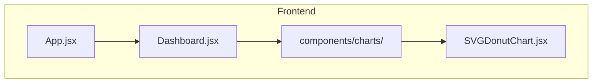
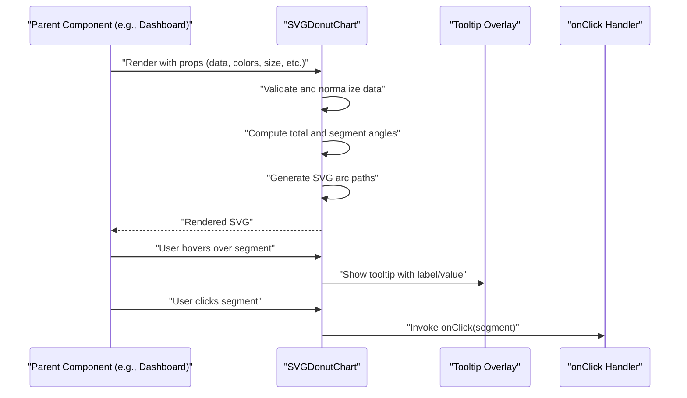
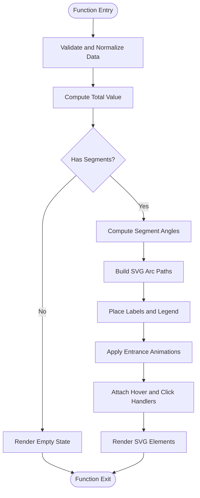
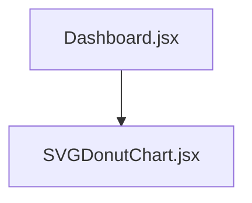

# SVG Donut Chart Component

<cite>
**Referenced Files in This Document**
- [SVGDonutChart.jsx](file://frontend/src/components/charts/SVGDonutChart.jsx)
- [Dashboard.jsx](file://frontend/src/pages/Dashboard.jsx)
</cite>

## Table of Contents
1. [Introduction](#introduction)
2. [Project Structure](#project-structure)
3. [Core Components](#core-components)
4. [Architecture Overview](#architecture-overview)
5. [Detailed Component Analysis](#detailed-component-analysis)
6. [Dependency Analysis](#dependency-analysis)
7. [Performance Considerations](#performance-considerations)
8. [Troubleshooting Guide](#troubleshooting-guide)
9. [Conclusion](#conclusion)
10. [Appendices](#appendices)

## Introduction
This document provides comprehensive documentation for the SVGDonutChart component, a React-based visualization used to render donut charts with interactive features such as tooltips and click handlers. It covers props interface, data binding, color schemes, sizing, responsiveness, rendering logic, segment calculations, customization options, accessibility, performance considerations, and integration patterns within React applications. Practical usage examples are included for common scenarios like billing metrics, customer distribution, and category breakdowns.

## Project Structure
The SVGDonutChart component is implemented as a standalone React component under the frontend source tree and is consumed by dashboard pages. The relevant files include:
- The component implementation file
- A page that consumes the component to visualize data

[No sources needed since this diagram shows conceptual workflow, not actual code structure]

## Core Components
- SVGDonutChart: Renders an SVG-based donut chart with configurable segments, colors, labels, animations, and interactivity (tooltips and click handlers). It supports responsive sizing and accessibility attributes.

Key responsibilities:
- Parse and validate input data
- Compute segment angles and paths
- Render SVG elements for each segment
- Provide interactive behaviors (hover tooltips, click callbacks)
- Manage size and responsive behavior
- Expose props for customization (colors, labels, animations, accessibility)

**Section sources**
- [SVGDonutChart.jsx](file://frontend/src/components/charts/SVGDonutChart.jsx)

## Architecture Overview
At a high level, the component receives structured data from its parent (e.g., Dashboard), computes visual geometry for each segment, renders SVG arcs, and handles user interactions. Parent components supply configuration via props, while the component manages internal state for hover and selection if needed.

[No sources needed since this diagram shows conceptual workflow, not actual code structure]

## Detailed Component Analysis

### Props Interface
The following table summarizes the typical props exposed by the SVGDonutChart component. These are commonly expected for data binding, color schemes, size configuration, and interactivity.

- data
  - Type: Array of objects
  - Description: Each item represents a segment with at least a value and a label. Optional fields may include id, color override, or metadata.
  - Example shape: { label, value, id?, color? }
- colors
  - Type: Array of strings or function
  - Description: Palette of colors for segments. If a function, it receives index and returns a color string.
- size
  - Type: number or object
  - Description: Width and height of the chart in pixels or a responsive strategy.
- innerRadius
  - Type: number
  - Description: Radius of the hole in the center of the donut.
- outerRadius
  - Type: number
  - Description: Outer radius of the donut.
- gapAngle
  - Type: number
  - Description: Angular gap between segments in degrees.
- startAngle
  - Type: number
  - Description: Starting angle of the first segment in degrees.
- animationDuration
  - Type: number
  - Description: Duration of entrance animations in milliseconds.
- animationEasing
  - Type: string
  - Description: CSS easing function name for animations.
- showLabels
  - Type: boolean
  - Description: Whether to display labels inside or outside segments.
- labelFormatter
  - Type: function
  - Description: Function to format label text (e.g., add units or percentages).
- showTooltips
  - Type: boolean
  - Description: Enable hover tooltips showing segment details.
- tooltipFormatter
  - Type: function
  - Description: Function to format tooltip content.
- onClick
  - Type: function
  - Description: Click handler invoked with the clicked segment’s data.
- ariaLabel
  - Type: string
  - Description: Accessible label for the chart.
- role
  - Type: string
  - Description: ARIA role (e.g., "img", "graphics-symbol").
- tabIndex
  - Type: number
  - Description: Tab order for keyboard navigation.
- className
  - Type: string
  - Description: Additional CSS class names for styling.

Notes:
- If both innerRadius and outerRadius are provided, they define the donut thickness.
- If only one radius is provided, the component may compute the other based on size.
- Colors can be overridden per segment via data.color.

**Section sources**
- [SVGDonutChart.jsx](file://frontend/src/components/charts/SVGDonutChart.jsx)

### Data Binding and Validation
- Input normalization: Ensure data is an array; coerce numeric values; handle missing labels with defaults.
- Total computation: Sum all segment values to calculate proportions.
- Segment angles: Convert values to angles using the total sum and accounting for gapAngle.
- Path generation: Generate SVG arc path commands for each segment based on computed angles and radii.
- Edge cases: Empty datasets, zero totals, negative values, and invalid inputs should be handled gracefully (e.g., render empty chart or fallback message).

**Section sources**
- [SVGDonutChart.jsx](file://frontend/src/components/charts/SVGDonutChart.jsx)

### Rendering Logic and Segment Calculations
- Coordinate system: Center the chart within the SVG viewBox based on size.
- Arc math: For each segment, compute start and end angles, convert to radians, and derive x/y coordinates for arc endpoints.
- Path construction: Use SVG path “M” (move) and “A” (arc) commands to draw each segment.
- Inner cutout: Draw the inner circle or use a mask to create the donut effect.
- Labels: Position labels at the midpoint angle of each segment; optionally adjust font size and placement based on available space.
- Animations: Animate stroke-dasharray/stroke-dashoffset or transform scale for entrance effects.

**Diagram sources**
- [SVGDonutChart.jsx](file://frontend/src/components/charts/SVGDonutChart.jsx)

**Section sources**
- [SVGDonutChart.jsx](file://frontend/src/components/charts/SVGDonutChart.jsx)

### Interactive Features
- Tooltips: On hover, display a tooltip overlay with formatted label and value. Tooltip positioning accounts for viewport boundaries.
- Click handlers: Invoke onClick with the clicked segment’s data. Useful for drilling into details or navigating to related views.
- Keyboard accessibility: Support focus and activation via keyboard when tabIndex is set.

**Section sources**
- [SVGDonutChart.jsx](file://frontend/src/components/charts/SVGDonutChart.jsx)

### Responsive Behavior
- Size handling: Accept width/height props or infer from container dimensions.
- ViewBox scaling: Use viewBox to ensure proportional scaling across devices.
- Label adaptation: Reduce label density or hide labels for small sizes.
- Touch-friendly segments: Increase hit area for touch devices.

**Section sources**
- [SVGDonutChart.jsx](file://frontend/src/components/charts/SVGDonutChart.jsx)

### Customization Options
- Colors: Global palette via colors prop; per-segment overrides via data.color.
- Labels: Toggle visibility and formatting via showLabels and labelFormatter.
- Animations: Control duration and easing via animationDuration and animationEasing.
- Accessibility: Provide ariaLabel, role, and tabIndex for screen readers and keyboard navigation.
- Styling: Use className and inline styles to integrate with design systems.

**Section sources**
- [SVGDonutChart.jsx](file://frontend/src/components/charts/SVGDonutChart.jsx)

### Practical Usage Examples
- Billing metrics: Visualize monthly charges by category (e.g., labor, materials, overhead). Bind data with labels and values; enable tooltips to show exact amounts; use onClick to navigate to detailed reports.
- Customer distribution: Show count of customers by region or plan tier. Use a distinct color palette and hide labels for compact layouts.
- Category breakdowns: Display share of expenses by department. Format labels with percentages and animate entrance for engaging dashboards.

Integration pattern:
- Parent component fetches data and passes it to SVGDonutChart via props.
- Parent defines onClick to handle segment clicks and navigates or updates state accordingly.
- Parent configures size, colors, and accessibility attributes to match application design.

**Section sources**
- [Dashboard.jsx](file://frontend/src/pages/Dashboard.jsx)
- [SVGDonutChart.jsx](file://frontend/src/components/charts/SVGDonutChart.jsx)

## Dependency Analysis
The SVGDonutChart component is a leaf dependency in the UI layer. It does not import external charting libraries unless explicitly configured. Its consumers include dashboard pages that provide data and event handlers.

**Diagram sources**
- [Dashboard.jsx](file://frontend/src/pages/Dashboard.jsx)
- [SVGDonutChart.jsx](file://frontend/src/components/charts/SVGDonutChart.jsx)

**Section sources**
- [Dashboard.jsx](file://frontend/src/pages/Dashboard.jsx)
- [SVGDonutChart.jsx](file://frontend/src/components/charts/SVGDonutChart.jsx)

## Performance Considerations
- Large datasets: Limit the number of segments rendered; aggregate small categories into an “Other” group.
- Path complexity: Avoid excessive label rendering; consider lazy rendering or virtualization for very large lists.
- Animation cost: Disable or reduce animationDuration for large datasets to maintain smoothness.
- Re-renders: Memoize expensive computations (e.g., segment paths) using React.memo or useMemo where appropriate.
- Memory usage: Avoid creating heavy objects per frame; reuse color arrays and formatter functions.

[No sources needed since this section provides general guidance]

## Troubleshooting Guide
Common issues and resolutions:
- No segments displayed: Verify data array is non-empty and values are numeric; check for zero totals.
- Overlapping labels: Reduce label density, increase size, or disable labels for small charts.
- Tooltip misplacement: Adjust tooltip positioning logic to account for container bounds and scroll offsets.
- Click events not firing: Ensure onClick is defined and event propagation is not prevented.
- Accessibility warnings: Provide ariaLabel and role; ensure tabIndex is set for keyboard navigation.

**Section sources**
- [SVGDonutChart.jsx](file://frontend/src/components/charts/SVGDonutChart.jsx)

## Conclusion
The SVGDonutChart component offers a flexible, accessible, and interactive way to visualize proportional data in React applications. With robust props for data binding, color schemes, sizing, animations, and interactivity, it supports a wide range of use cases including billing metrics, customer distribution, and category breakdowns. By following the recommended practices for performance and accessibility, developers can integrate the component effectively into modern dashboards.

[No sources needed since this section summarizes without analyzing specific files]

## Appendices

### Integration Patterns with React Applications
- Controlled vs uncontrolled: The component is typically controlled via props; parent manages data and event handlers.
- Context usage: Share global theme or color palettes via React context to avoid prop drilling.
- Error boundaries: Wrap chart usage in error boundaries to prevent crashes due to malformed data.
- Testing: Mock data and simulate hover/click events to verify rendering and interactions.

[No sources needed since this section provides general guidance]