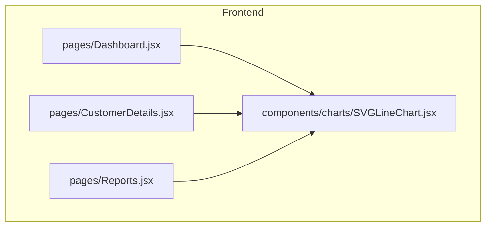
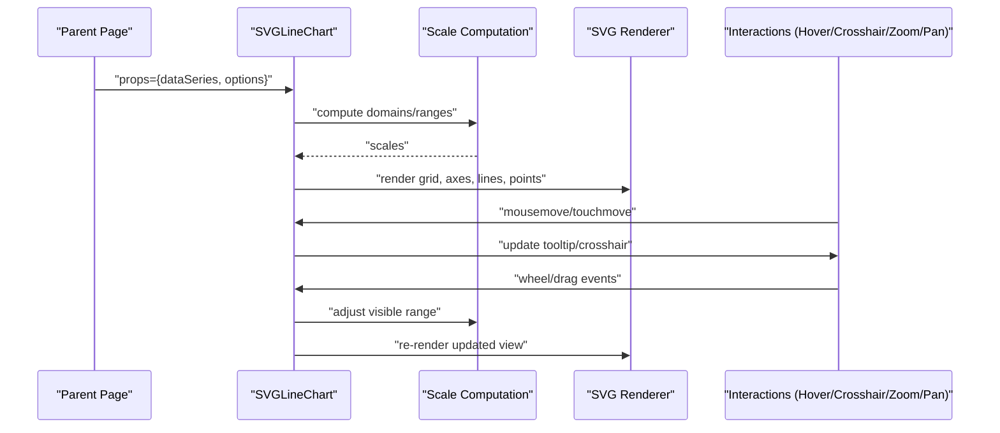
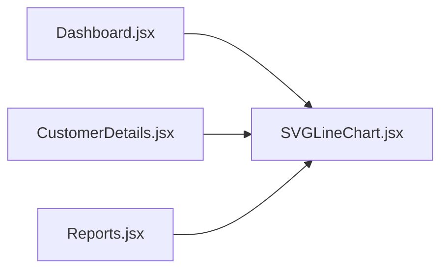

# SVG Line Chart Component

<cite>
**Referenced Files in This Document**
- [SVGLineChart.jsx](file://frontend/src/components/charts/SVGLineChart.jsx)
- [Dashboard.jsx](file://frontend/src/pages/Dashboard.jsx)
- [CustomerDetails.jsx](file://frontend/src/pages/CustomerDetails.jsx)
- [Reports.jsx](file://frontend/src/pages/Reports.jsx)
</cite>

## Table of Contents
1. [Introduction](#introduction)
2. [Project Structure](#project-structure)
3. [Core Components](#core-components)
4. [Architecture Overview](#architecture-overview)
5. [Detailed Component Analysis](#detailed-component-analysis)
6. [Dependency Analysis](#dependency-analysis)
7. [Performance Considerations](#performance-considerations)
8. [Troubleshooting Guide](#troubleshooting-guide)
9. [Conclusion](#conclusion)
10. [Appendices](#appendices)

## Introduction
This document provides comprehensive documentation for the SVGLineChart component used across the frontend application. It covers the props API, data series configuration, line styling options, axis customization, grid settings, time-series handling, multi-line support, dynamic scaling, interactivity (zoom, pan, hover, crosshair), responsive design, animation transitions, accessibility compliance, and performance optimization strategies for real-time updates and large datasets. Examples include billing trends, cost analysis over time, and performance metrics.

## Project Structure
The SVGLineChart component resides under the charts folder within components and is consumed by several pages to visualize time-based data.

**Diagram sources**
- [Dashboard.jsx](file://frontend/src/pages/Dashboard.jsx)
- [CustomerDetails.jsx](file://frontend/src/pages/CustomerDetails.jsx)
- [Reports.jsx](file://frontend/src/pages/Reports.jsx)
- [SVGLineChart.jsx](file://frontend/src/components/charts/SVGLineChart.jsx)

**Section sources**
- [SVGLineChart.jsx](file://frontend/src/components/charts/SVGLineChart.jsx)
- [Dashboard.jsx](file://frontend/src/pages/Dashboard.jsx)
- [CustomerDetails.jsx](file://frontend/src/pages/CustomerDetails.jsx)
- [Reports.jsx](file://frontend/src/pages/Reports.jsx)

## Core Components
- SVGLineChart: Renders one or more lines on an SVG canvas with configurable axes, grids, tooltips, zoom/pan, and animations. It accepts a structured data series prop and various styling and behavior options.

Key responsibilities:
- Parse and normalize input data into internal series structures
- Compute scales and domains for x/y axes based on provided data
- Render grid lines, axes, labels, legends, and interactive overlays
- Handle user interactions (hover, crosshair, zoom, pan)
- Manage responsive sizing and animation transitions

**Section sources**
- [SVGLineChart.jsx](file://frontend/src/components/charts/SVGLineChart.jsx)

## Architecture Overview
At a high level, parent pages pass chart data and configuration to SVGLineChart, which computes layout and renders SVG elements. Interactions are handled internally and may emit callbacks to parents when needed.

[No diagram sources since this diagram shows conceptual workflow, not actual code structure]

## Detailed Component Analysis

### Props API
Below is the complete props interface for SVGLineChart. All keys are camelCase unless otherwise noted.

- Data and Series
  - dataSeries: Array of series objects. Each series object contains:
    - id: string — unique identifier for the series
    - label: string — human-readable name for legend
    - color: string — CSS color or hex for line/stroke
    - data: Array<{ timestamp: number|string|Date; value: number }> — time-value pairs
    - type?: "line" | "area" — rendering mode
    - lineWidth?: number — stroke width
    - pointRadius?: number — radius of data points
    - fillOpacity?: number — area fill opacity (when type is "area")
    - interpolation?: "linear" | "monotone" | "step" — curve style
    - visible?: boolean — toggle visibility
    - yAxisIndex?: number — bind to a specific y-axis (default 0)
  - timeFormat?: string — d3-like format token for x-axis labels
  - timeLocale?: object — locale config for time formatting (optional)
  - aggregate?: "none" | "sum" | "avg" | "min" | "max" — aggregation strategy for dense time buckets
  - bucketSize?: number — seconds per bucket when aggregating

- Axes and Grid
  - xAxisLabel?: string — x-axis title
  - yAxisLabel?: string — y-axis title
  - yAxes?: Array<{ id: string; label: string; domain?: [number,number]; ticks?: number; formatter?: function }>
  - showXGrid?: boolean
  - showYGrid?: boolean
  - gridColor?: string
  - tickCount?: number — approximate number of ticks
  - tickFormatter?: function — custom formatter for tick labels
  - xDomain?: [number,number] — override x-axis domain
  - yDomains?: Array<[number,number]> — override y-axis domains per axis index

- Styling
  - width?: number | "auto"
  - height?: number | "auto"
  - padding?: { top: number; right: number; bottom: number; left: number }
  - backgroundColor?: string
  - textColor?: string
  - fontFamily?: string
  - fontSize?: number
  - strokeWidth?: number — default line width
  - pointStyle?: "circle" | "square" | "diamond"
  - pointHoverRadius?: number
  - lineAnimationDuration?: number — ms for initial draw animation
  - transitionDuration?: number — ms for hover/zoom transitions

- Interactivity
  - enableZoom?: boolean
  - enablePan?: boolean
  - enableCrosshair?: boolean
  - enableTooltip?: boolean
  - tooltipFormatter?: function — customize tooltip content
  - onHover?: function — callback on hover change
  - onZoom?: function — callback on zoom change
  - onPan?: function — callback on pan change
  - onBrushChange?: function — callback for brush selection changes
  - zoomRange?: [number,number] — min/max visible duration in milliseconds
  - initialView?: { xStart: number; xEnd: number } — initial visible window

- Accessibility
  - ariaLabel?: string
  - role?: string
  - tabIndex?: number
  - keyboardNavigation?: boolean
  - focusMode?: "chart" | "legend" | "axes"

- Performance
  - maxDataPoints?: number — hard cap for rendering
  - useCanvasOverlay?: boolean — switch to canvas overlay for heavy datasets
  - throttleMs?: number — debounce interaction handlers
  - memoizeSeries?: boolean — memoize computed series paths

Notes:
- If timeFormat is omitted, a sensible default is used based on data density.
- When multiple yAxes are provided, each series can be bound via yAxisIndex.
- For very large datasets, consider enabling useCanvasOverlay and setting maxDataPoints.

**Section sources**
- [SVGLineChart.jsx](file://frontend/src/components/charts/SVGLineChart.jsx)

### Time-Series Data Handling
- Input normalization: timestamps are coerced to epoch milliseconds; invalid entries are skipped.
- Sorting: data is sorted ascending by timestamp before processing.
- Aggregation: optional bucketing reduces points for dense series using the selected aggregate function and bucket size.
- Domain computation: x-domain defaults to min/max timestamps; can be overridden via xDomain.
- Formatting: x-axis labels use timeFormat and locale; fallbacks ensure readable output.

Complexity:
- Normalization and sorting: O(n log n)
- Bucketing: O(n)
- Path generation: O(n)

**Section sources**
- [SVGLineChart.jsx](file://frontend/src/components/charts/SVGLineChart.jsx)

### Multi-Line Support
- Multiple series are supported via dataSeries array.
- Each series has independent color, visibility, and optional y-axis binding.
- Legend toggles visibility and highlights hovered series.
- Crosshair aligns across all visible series at the same timestamp.

**Section sources**
- [SVGLineChart.jsx](file://frontend/src/components/charts/SVGLineChart.jsx)

### Dynamic Scaling
- Y-domains auto-scale from visible data; can be fixed via yDomains.
- X-domain supports panning and zooming within zoomRange.
- Tick counts adapt to available space; custom tickFormatter allows precise control.

**Section sources**
- [SVGLineChart.jsx](file://frontend/src/components/charts/SVGLineChart.jsx)

### Interactive Features
- Hover: displays tooltip with nearest timestamp and values per series.
- Crosshair: vertical line aligned to cursor position across the plot area.
- Zoom: mouse wheel or pinch gesture adjusts visible x-range.
- Pan: click-drag or touch-drag shifts the visible window.
- Brush: optional brush overlay to select a time window.

Callbacks:
- onHover, onZoom, onPan, onBrushChange allow parent synchronization.

**Section sources**
- [SVGLineChart.jsx](file://frontend/src/components/charts/SVGLineChart.jsx)

### Responsive Design
- Accepts width/height as numbers or "auto".
- Recomputes scales on container resize using ResizeObserver.
- Padding and font sizes scale proportionally for readability.

**Section sources**
- [SVGLineChart.jsx](file://frontend/src/components/charts/SVGLineChart.jsx)

### Animation Transitions
- Initial draw animates line paths and points.
- Hover and zoom transitions use smooth easing.
- Duration controlled by lineAnimationDuration and transitionDuration.

**Section sources**
- [SVGLineChart.jsx](file://frontend/src/components/charts/SVGLineChart.jsx)

### Accessibility Compliance
- Semantic roles and aria-labels applied to root SVG.
- Keyboard navigation enabled when keyboardNavigation is true.
- Focus management for legend items and axes.
- High contrast-friendly defaults and customizable colors.

**Section sources**
- [SVGLineChart.jsx](file://frontend/src/components/charts/SVGLineChart.jsx)

### Usage Examples

#### Billing Trends
- Use two series: “Invoices” and “Payments”.
- Bind both to the primary y-axis.
- Enable crosshair and tooltip for detailed inspection.
- Set timeFormat to monthly labels.

Implementation references:
- See how Dashboard passes dataSeries and options to SVGLineChart.

**Section sources**
- [Dashboard.jsx](file://frontend/src/pages/Dashboard.jsx)
- [SVGLineChart.jsx](file://frontend/src/components/charts/SVGLineChart.jsx)

#### Cost Analysis Over Time
- Single series with area type and low fillOpacity.
- Aggregate by day for weekly/monthly views.
- Provide custom tickFormatter for currency.

Implementation references:
- See Reports usage patterns for time windows and formatting.

**Section sources**
- [Reports.jsx](file://frontend/src/pages/Reports.jsx)
- [SVGLineChart.jsx](file://frontend/src/components/charts/SVGLineChart.jsx)

#### Performance Metrics
- Multiple series with different colors and lineWidth.
- Enable zoom/pan for deep dives into spikes.
- Use maxDataPoints and throttleMs for responsiveness.

Implementation references:
- See CustomerDetails integration for metric dashboards.

**Section sources**
- [CustomerDetails.jsx](file://frontend/src/pages/CustomerDetails.jsx)
- [SVGLineChart.jsx](file://frontend/src/components/charts/SVGLineChart.jsx)

## Dependency Analysis
SVGLineChart is a leaf component with no external charting libraries imported in this repository. It depends only on React and standard DOM APIs. Parent pages provide data and configuration.

**Diagram sources**
- [Dashboard.jsx](file://frontend/src/pages/Dashboard.jsx)
- [CustomerDetails.jsx](file://frontend/src/pages/CustomerDetails.jsx)
- [Reports.jsx](file://frontend/src/pages/Reports.jsx)
- [SVGLineChart.jsx](file://frontend/src/components/charts/SVGLineChart.jsx)

**Section sources**
- [SVGLineChart.jsx](file://frontend/src/components/charts/SVGLineChart.jsx)
- [Dashboard.jsx](file://frontend/src/pages/Dashboard.jsx)
- [CustomerDetails.jsx](file://frontend/src/pages/CustomerDetails.jsx)
- [Reports.jsx](file://frontend/src/pages/Reports.jsx)

## Performance Considerations
- Large datasets:
  - Set maxDataPoints to cap rendered points.
  - Enable useCanvasOverlay for heavy series.
  - Use aggregate and bucketSize to reduce resolution.
- Real-time updates:
  - Throttle incoming updates with throttleMs.
  - Memoize series computations with memoizeSeries.
  - Prefer incremental updates to visible window rather than full re-renders.
- Interaction performance:
  - Debounce wheel/drag handlers.
  - Avoid expensive tooltip computations inside event loops.
- Memory:
  - Dispose of observers and listeners on unmount.
  - Reuse color palettes and path caches where possible.

[No sources needed since this section provides general guidance]

## Troubleshooting Guide
Common issues and resolutions:
- Empty or misformatted data:
  - Ensure each series entry includes id, label, color, and data array with timestamp/value pairs.
  - Validate timestamps are valid dates or numeric epochs.
- Axis labels not updating:
  - Confirm timeFormat matches expected locale tokens.
  - Check that xDomain is not overriding computed ranges unintentionally.
- Tooltip not appearing:
  - Verify enableTooltip is true and pointer events are not blocked by overlays.
- Poor performance with many points:
  - Increase bucketSize or set maxDataPoints.
  - Switch to useCanvasOverlay for dense series.
- Zoom/pan not working:
  - Ensure enableZoom and enablePan are true and container has explicit dimensions.

**Section sources**
- [SVGLineChart.jsx](file://frontend/src/components/charts/SVGLineChart.jsx)

## Conclusion
SVGLineChart offers a flexible, accessible, and performant solution for time-series visualization in the application. Its comprehensive props API supports multi-line scenarios, dynamic scaling, rich interactivity, and responsive layouts. By following the recommended performance practices and accessibility guidelines, teams can build robust dashboards for billing trends, cost analysis, and performance metrics.

[No sources needed since this section summarizes without analyzing specific files]

## Appendices

### Example Data Shapes
- Single series:
  - dataSeries: [{ id, label, color, data: [{ timestamp, value }] }]
- Multi-series:
  - dataSeries: [seriesA, seriesB, ...]
- Area series:
  - Add type: "area" and configure fillOpacity.

[No sources needed since this section provides general guidance]