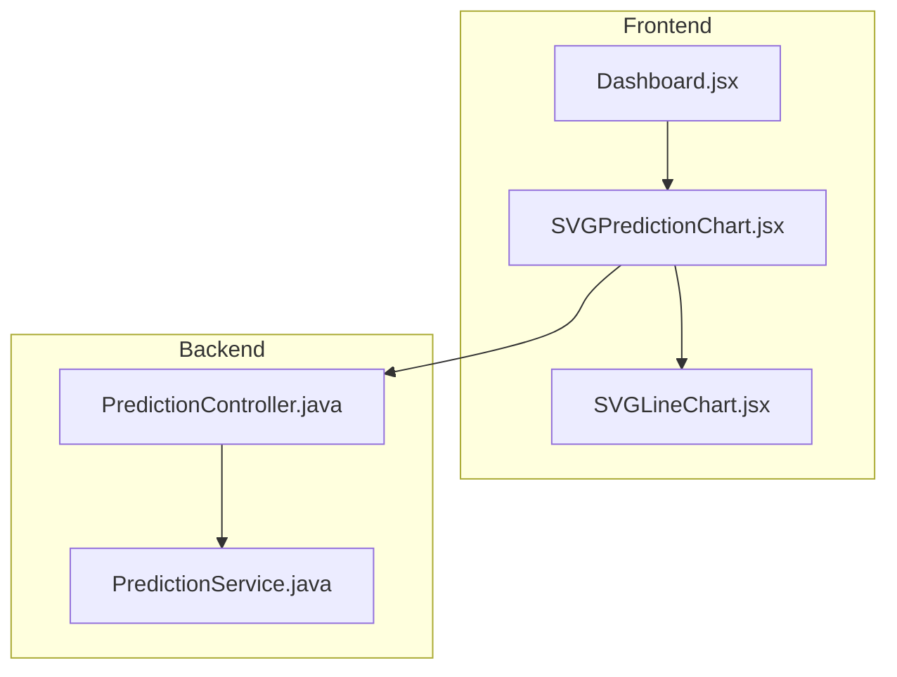
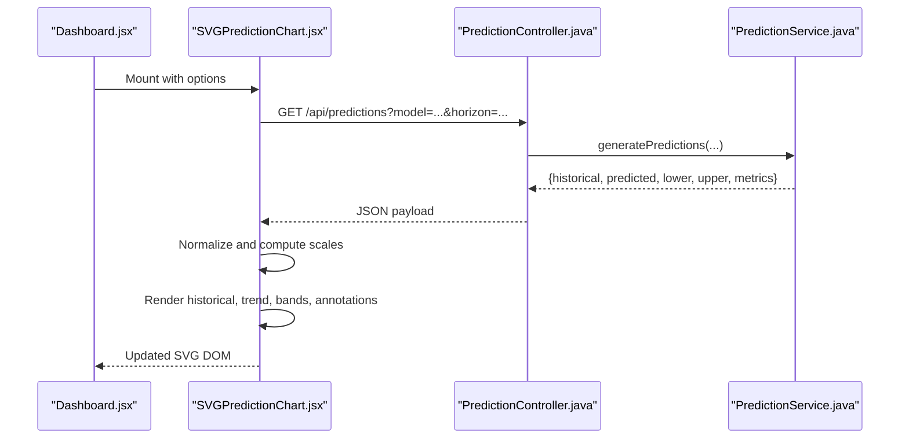
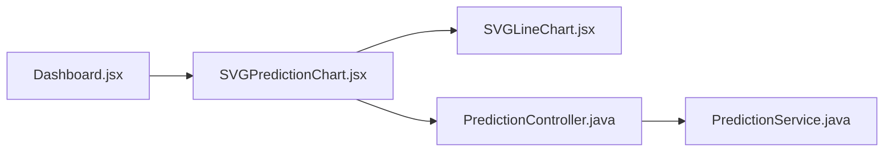

# SVG Prediction Chart Component

<cite>
**Referenced Files in This Document**
- [SVGPredictionChart.jsx](file://frontend/src/components/charts/SVGPredictionChart.jsx)
- [SVGLineChart.jsx](file://frontend/src/components/charts/SVGLineChart.jsx)
- [PredictionController.java](file://backend/src/main/java/com/ceb/billing/controllers/PredictionController.java)
- [PredictionService.java](file://backend/src/main/java/com/ceb/billing/services/PredictionService.java)
- [Dashboard.jsx](file://frontend/src/pages/Dashboard.jsx)
</cite>

## Table of Contents
1. [Introduction](#introduction)
2. [Project Structure](#project-structure)
3. [Core Components](#core-components)
4. [Architecture Overview](#architecture-overview)
5. [Detailed Component Analysis](#detailed-component-analysis)
6. [Dependency Analysis](#dependency-analysis)
7. [Performance Considerations](#performance-considerations)
8. [Troubleshooting Guide](#troubleshooting-guide)
9. [Conclusion](#conclusion)
10. [Appendices](#appendices)

## Introduction
This document provides comprehensive documentation for the SVGPredictionChart component specialized for forecasting visualizations. It explains the prediction data structure, trend line rendering, confidence interval visualization, and forecast accuracy indicators. It also covers integration with backend prediction services, handling real-time updates, and practical examples for billing predictions, demand forecasting, and trend analysis. Finally, it addresses customization of prediction bands, historical data overlay, statistical annotations, performance considerations for complex models, and smooth animations for live data streams.

## Project Structure
The project is a full-stack application:
- Frontend (React + Vite): Contains chart components and pages that consume prediction APIs.
- Backend (Spring Boot): Provides REST endpoints and services for predictions.

**Diagram sources**
- [Dashboard.jsx](file://frontend/src/pages/Dashboard.jsx)
- [SVGPredictionChart.jsx](file://frontend/src/components/charts/SVGPredictionChart.jsx)
- [SVGLineChart.jsx](file://frontend/src/components/charts/SVGLineChart.jsx)
- [PredictionController.java](file://backend/src/main/java/com/ceb/billing/controllers/PredictionController.java)
- [PredictionService.java](file://backend/src/main/java/com/ceb/billing/services/PredictionService.java)

**Section sources**
- [Dashboard.jsx](file://frontend/src/pages/Dashboard.jsx)
- [SVGPredictionChart.jsx](file://frontend/src/components/charts/SVGPredictionChart.jsx)
- [SVGLineChart.jsx](file://frontend/src/components/charts/SVGLineChart.jsx)
- [PredictionController.java](file://backend/src/main/java/com/ceb/billing/controllers/PredictionController.java)
- [PredictionService.java](file://backend/src/main/java/com/ceb/billing/services/PredictionService.java)

## Core Components
- SVGPredictionChart: Renders historical series, predicted trend lines, and confidence intervals using SVG. It supports overlays, annotations, and interactive controls.
- SVGLineChart: Reusable low-level SVG line renderer used by SVGPredictionChart to draw series and bands.
- PredictionController: Exposes REST endpoints for fetching predictions and related metadata.
- PredictionService: Encapsulates business logic for generating or retrieving predictions and metrics.

Key responsibilities:
- Data ingestion and normalization from backend responses.
- Rendering historical points and lines.
- Drawing prediction segments and confidence bands.
- Displaying forecast accuracy indicators (e.g., MAPE, RMSE).
- Managing state for real-time updates and animation.

**Section sources**
- [SVGPredictionChart.jsx](file://frontend/src/components/charts/SVGPredictionChart.jsx)
- [SVGLineChart.jsx](file://frontend/src/components/charts/SVGLineChart.jsx)
- [PredictionController.java](file://backend/src/main/java/com/ceb/billing/controllers/PredictionController.java)
- [PredictionService.java](file://backend/src/main/java/com/ceb/billing/services/PredictionService.java)

## Architecture Overview
The frontend requests predictions from the backend controller, which delegates to the service. The response includes historical data, predicted values, confidence bounds, and optional accuracy metrics. The SVGPredictionChart renders these into an SVG visualization with layered elements for clarity and interactivity.

**Diagram sources**
- [Dashboard.jsx](file://frontend/src/pages/Dashboard.jsx)
- [SVGPredictionChart.jsx](file://frontend/src/components/charts/SVGPredictionChart.jsx)
- [PredictionController.java](file://backend/src/main/java/com/ceb/billing/controllers/PredictionController.java)
- [PredictionService.java](file://backend/src/main/java/com/ceb/billing/services/PredictionService.java)

## Detailed Component Analysis

### Prediction Data Structure
The chart expects a normalized dataset containing:
- Historical series: time-value pairs up to the present.
- Predicted series: future time-value pairs aligned with the same time axis.
- Confidence bounds: lower and upper arrays matching predicted length.
- Accuracy metrics: optional fields such as MAE, RMSE, MAPE, R-squared.
- Metadata: model name, horizon, timestamp, units, and labels.

Normalization steps performed by the chart include:
- Parsing timestamps to numeric indices.
- Aligning historical and predicted series on a common x-axis.
- Validating array lengths and monotonicity.
- Computing domain/range scales for consistent rendering.

Integration tips:
- Ensure consistent time granularity across historical and predicted arrays.
- Provide null-safe handling for missing bounds when confidence intervals are unavailable.
- Include units and labels in metadata for tooltips and legends.

**Section sources**
- [SVGPredictionChart.jsx](file://frontend/src/components/charts/SVGPredictionChart.jsx)
- [PredictionController.java](file://backend/src/main/java/com/ceb/billing/controllers/PredictionController.java)
- [PredictionService.java](file://backend/src/main/java/com/ceb/billing/services/PredictionService.java)

### Trend Line Rendering
The trend line represents the predicted trajectory over the forecast horizon. Implementation highlights:
- Uses SVGLineChart to draw a polyline connecting predicted points.
- Applies smoothing only if explicitly enabled; otherwise, uses linear interpolation.
- Supports dashed styling for the forecast segment to visually separate from historical data.
- Handles dynamic resizing via viewBox updates.

Customization:
- Control stroke width, color, and dash pattern via props.
- Toggle visibility of the trend line independently from bands.
- Enable/disable point markers at each predicted step.

**Section sources**
- [SVGPredictionChart.jsx](file://frontend/src/components/charts/SVGPredictionChart.jsx)
- [SVGLineChart.jsx](file://frontend/src/components/charts/SVGLineChart.jsx)

### Confidence Interval Visualization
Confidence bands illustrate uncertainty around the forecast:
- Lower and upper bounds are rendered as filled polygons between the two curves.
- Opacity and color can be configured per band level (e.g., 80% vs 95%).
- When bounds are missing, the chart gracefully falls back to rendering only the trend line.

Rendering strategy:
- Compute polygon paths from paired lower/upper arrays.
- Clip regions to the chart area to avoid overflow.
- Layer bands behind the trend line for readability.

Accessibility:
- Provide aria-labels describing the confidence level.
- Offer keyboard-accessible toggles for band visibility.

**Section sources**
- [SVGPredictionChart.jsx](file://frontend/src/components/charts/SVGPredictionChart.jsx)
- [SVGLineChart.jsx](file://frontend/src/components/charts/SVGLineChart.jsx)

### Forecast Accuracy Indicators
Accuracy metrics are displayed as summary badges or annotations:
- Common metrics: MAE, RMSE, MAPE, R-squared.
- Optional threshold-based coloring (e.g., green for acceptable error).
- Tooltips provide context about metric definitions and calculation windows.

Placement:
- Top-right corner panel or inline near the legend.
- Collapsible section to reduce clutter.

**Section sources**
- [SVGPredictionChart.jsx](file://frontend/src/components/charts/SVGPredictionChart.jsx)

### Integration with Backend Prediction Services
REST contract overview:
- Endpoint: GET /api/predictions
- Query parameters: model identifier, horizon, aggregation window, filters.
- Response body: structured JSON with historical, predicted, lower, upper, metrics, and metadata.

Error handling:
- HTTP 4xx for invalid parameters.
- HTTP 5xx for server-side failures.
- Empty datasets return minimal payloads with metadata indicating no data available.

Caching and revalidation:
- Use ETag or Last-Modified headers where applicable.
- Implement client-side cache with TTL based on horizon and update frequency.

**Section sources**
- [PredictionController.java](file://backend/src/main/java/com/ceb/billing/controllers/PredictionController.java)
- [PredictionService.java](file://backend/src/main/java/com/ceb/billing/services/PredictionService.java)

### Real-Time Forecast Updates
Strategies for live updates:
- Polling: periodic GET requests with incremental horizons.
- Server-Sent Events (SSE): stream partial updates for new time steps.
- WebSocket: bidirectional control for pausing/resuming and parameter changes.

Implementation guidance:
- Debounce rapid updates to avoid excessive re-renders.
- Transition smoothly by animating new points entering the viewport.
- Maintain a rolling buffer of recent history to keep the chart responsive.

**Section sources**
- [SVGPredictionChart.jsx](file://frontend/src/components/charts/SVGPredictionChart.jsx)
- [PredictionController.java](file://backend/src/main/java/com/ceb/billing/controllers/PredictionController.java)

### Examples

#### Billing Predictions
- Scenario: Forecast monthly billing totals for upcoming quarters.
- Data: Monthly historical revenue, predicted monthly totals, 80%/95% bands.
- Customization: Highlight seasonal spikes, annotate known promotions.
- Accuracy: Track MAPE month-over-month to monitor drift.

#### Demand Forecasting
- Scenario: Predict product demand by week for inventory planning.
- Data: Weekly demand series, predicted weekly demand, widening bands over longer horizons.
- Customization: Overlay capacity thresholds and reorder points.
- Accuracy: Emphasize RMSE for cost-sensitive decisions.

#### Trend Analysis
- Scenario: Analyze long-term trends with short-term noise.
- Data: Daily metrics, smoothed trend line, narrow confidence bands for short horizon.
- Customization: Toggle moving average overlay and annotation of inflection points.
- Accuracy: Report R-squared for trend fit quality.

[No sources needed since this section doesn't analyze specific files]

### Customization Options
- Prediction bands:
  - Configure multiple levels (e.g., 80%, 95%) with distinct colors and opacities.
  - Toggle individual bands on/off.
- Historical data overlay:
  - Show/hide historical series.
  - Adjust marker density and size.
- Statistical annotations:
  - Add mean, median, and percentile markers.
  - Annotate breakpoints or regime changes.
- Styling:
  - Theme-aware colors and typography.
  - Responsive sizing and aspect ratio preservation.

**Section sources**
- [SVGPredictionChart.jsx](file://frontend/src/components/charts/SVGPredictionChart.jsx)

### Performance Considerations
For complex predictive models and large datasets:
- Virtualization: Only render visible points within the current viewport.
- Downsampling: Apply decimation algorithms (e.g., Douglas-Peucker) for dense series.
- Batch updates: Merge multiple incoming data points before re-rendering.
- Memoization: Cache computed scales and path geometries.
- Animation budget: Limit frame rate and use requestAnimationFrame for smooth transitions.

Live data streams:
- Prefer incremental updates rather than full redraws.
- Use CSS transforms for simple animations when possible.
- Debounce user interactions during high-frequency updates.

[No sources needed since this section provides general guidance]

## Dependency Analysis
The following diagram shows how the frontend charts depend on the backend prediction endpoints and internal chart primitives.

**Diagram sources**
- [Dashboard.jsx](file://frontend/src/pages/Dashboard.jsx)
- [SVGPredictionChart.jsx](file://frontend/src/components/charts/SVGPredictionChart.jsx)
- [SVGLineChart.jsx](file://frontend/src/components/charts/SVGLineChart.jsx)
- [PredictionController.java](file://backend/src/main/java/com/ceb/billing/controllers/PredictionController.java)
- [PredictionService.java](file://backend/src/main/java/com/ceb/billing/services/PredictionService.java)

**Section sources**
- [Dashboard.jsx](file://frontend/src/pages/Dashboard.jsx)
- [SVGPredictionChart.jsx](file://frontend/src/components/charts/SVGPredictionChart.jsx)
- [SVGLineChart.jsx](file://frontend/src/components/charts/SVGLineChart.jsx)
- [PredictionController.java](file://backend/src/main/java/com/ceb/billing/controllers/PredictionController.java)
- [PredictionService.java](file://backend/src/main/java/com/ceb/billing/services/PredictionService.java)

## Performance Considerations
- Reduce DOM churn by batching updates and avoiding unnecessary re-renders.
- Use efficient SVG path generation and minimize recalculations.
- Leverage memoized selectors for derived data.
- For very large datasets, consider WebGL-backed alternatives or progressive loading.

[No sources needed since this section provides general guidance]

## Troubleshooting Guide
Common issues and resolutions:
- Mismatched array lengths:
  - Symptom: Missing bands or broken lines.
  - Fix: Validate and pad arrays to match predicted length.
- Timezone misalignment:
  - Symptom: Shifted x-axis labels and misaligned points.
  - Fix: Normalize timestamps to UTC and format consistently.
- Empty or null predictions:
  - Symptom: Blank chart or errors.
  - Fix: Handle empty payloads gracefully and display informative messages.
- High CPU usage during updates:
  - Symptom: Janky animations.
  - Fix: Throttle updates, enable downsampling, and reduce marker counts.

**Section sources**
- [SVGPredictionChart.jsx](file://frontend/src/components/charts/SVGPredictionChart.jsx)
- [PredictionController.java](file://backend/src/main/java/com/ceb/billing/controllers/PredictionController.java)

## Conclusion
The SVGPredictionChart component offers a flexible, performant, and accessible way to visualize forecasts with confidence intervals and accuracy indicators. By integrating cleanly with backend prediction services and supporting real-time updates, it enables robust forecasting dashboards across domains like billing, demand planning, and trend analysis. With thoughtful customization and performance tuning, it scales to complex models and live data streams while maintaining clarity and responsiveness.

## Appendices

### API Reference Summary
- Endpoint: GET /api/predictions
- Parameters: model, horizon, filters
- Response: historical, predicted, lower, upper, metrics, metadata
- Errors: 4xx for bad requests, 5xx for server errors

**Section sources**
- [PredictionController.java](file://backend/src/main/java/com/ceb/billing/controllers/PredictionController.java)
- [PredictionService.java](file://backend/src/main/java/com/ceb/billing/services/PredictionService.java)