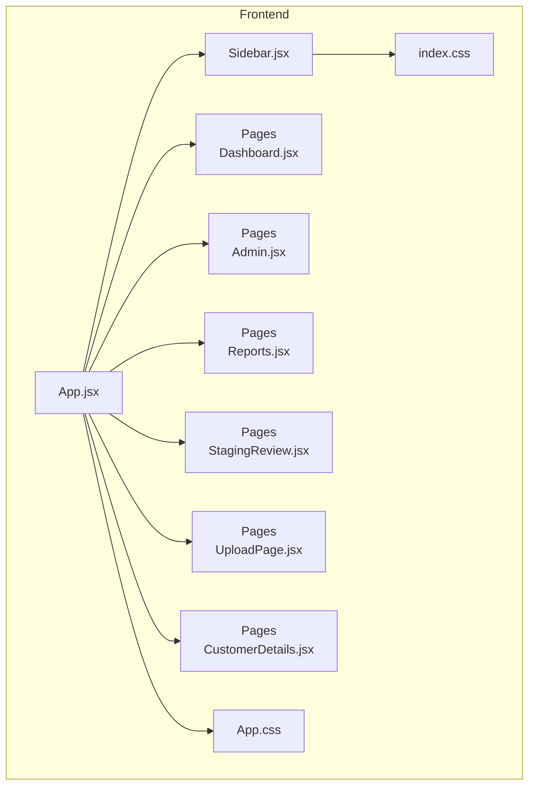
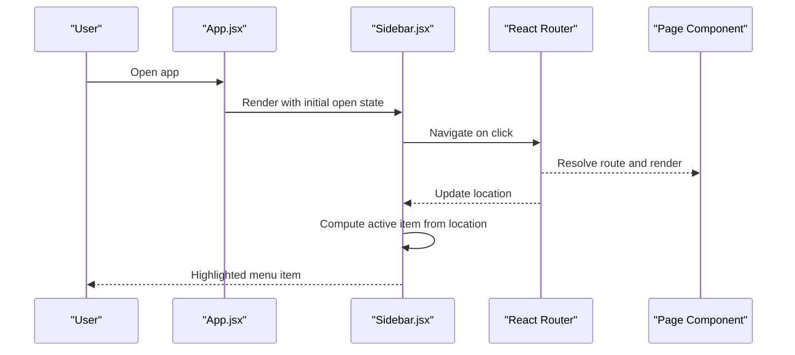
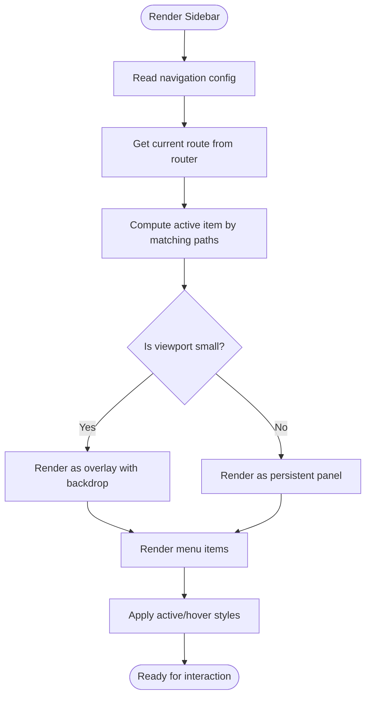
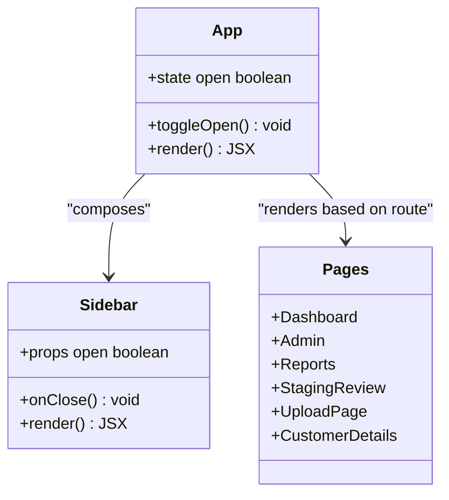
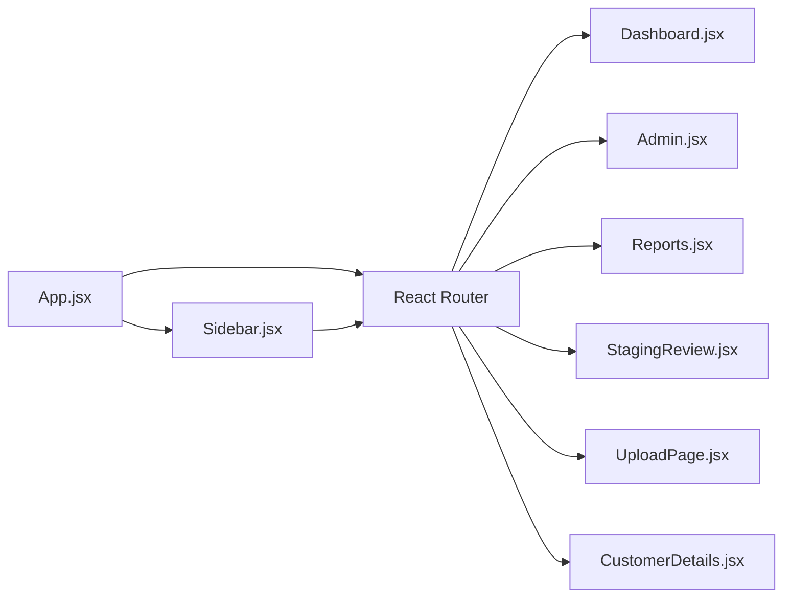

# Layout Components

<cite>
**Referenced Files in This Document**
- [Sidebar.jsx](file://frontend/src/components/Sidebar.jsx)
- [App.jsx](file://frontend/src/App.jsx)
- [Dashboard.jsx](file://frontend/src/pages/Dashboard.jsx)
- [Admin.jsx](file://frontend/src/pages/Admin.jsx)
- [Reports.jsx](file://frontend/src/pages/Reports.jsx)
- [StagingReview.jsx](file://frontend/src/pages/StagingReview.jsx)
- [UploadPage.jsx](file://frontend/src/pages/UploadPage.jsx)
- [CustomerDetails.jsx](file://frontend/src/pages/CustomerDetails.jsx)
- [index.css](file://frontend/src/index.css)
- [App.css](file://frontend/src/App.css)
</cite>

## Table of Contents
1. [Introduction](#introduction)
2. [Project Structure](#project-structure)
3. [Core Components](#core-components)
4. [Architecture Overview](#architecture-overview)
5. [Detailed Component Analysis](#detailed-component-analysis)
6. [Dependency Analysis](#dependency-analysis)
7. [Performance Considerations](#performance-considerations)
8. [Troubleshooting Guide](#troubleshooting-guide)
9. [Conclusion](#conclusion)

## Introduction
This document explains the layout and navigation components with a focus on the Sidebar component. It covers how the sidebar defines navigation structure, configures menu items, responds to different screen sizes, integrates with routing, manages active states, and can be customized for appearance. Practical examples are provided for adding new navigation items, customizing styles, and handling responsive behavior.

## Project Structure
The frontend is organized by feature areas:
- Components: reusable UI elements such as the Sidebar
- Pages: route-level views rendered within the application shell
- Context: global state providers (authentication, toast notifications)
- Styles: shared CSS files for layout and theming

**Diagram sources**
- [App.jsx](file://frontend/src/App.jsx)
- [Sidebar.jsx](file://frontend/src/components/Sidebar.jsx)
- [Dashboard.jsx](file://frontend/src/pages/Dashboard.jsx)
- [Admin.jsx](file://frontend/src/pages/Admin.jsx)
- [Reports.jsx](file://frontend/src/pages/Reports.jsx)
- [StagingReview.jsx](file://frontend/src/pages/StagingReview.jsx)
- [UploadPage.jsx](file://frontend/src/pages/UploadPage.jsx)
- [CustomerDetails.jsx](file://frontend/src/pages/CustomerDetails.jsx)
- [index.css](file://frontend/src/index.css)
- [App.css](file://frontend/src/App.css)

**Section sources**
- [App.jsx](file://frontend/src/App.jsx)
- [Sidebar.jsx](file://frontend/src/components/Sidebar.jsx)
- [index.css](file://frontend/src/index.css)
- [App.css](file://frontend/src/App.css)

## Core Components
- Sidebar: Provides primary navigation, renders menu items, highlights the active route, and adapts to screen size.
- App shell: Wraps the Sidebar and content area, manages layout and responsive toggling.
- Pages: Route targets that render when users select a navigation item.

Key responsibilities:
- Sidebar:
  - Define navigation structure and menu items
  - Manage active state based on current route
  - Toggle visibility on small screens
  - Apply styling and theme hooks via CSS classes
- App shell:
  - Compose Sidebar with main content
  - Control open/close state for mobile
  - Provide consistent layout across routes

**Section sources**
- [Sidebar.jsx](file://frontend/src/components/Sidebar.jsx)
- [App.jsx](file://frontend/src/App.jsx)

## Architecture Overview
The application uses a classic dashboard layout:
- The root App composes the Sidebar and a content area.
- Navigation links inside the Sidebar navigate to page routes.
- Active route detection updates the Sidebar’s highlighted item.
- On narrow viewports, the Sidebar becomes an overlay controlled by a toggle.

**Diagram sources**
- [App.jsx](file://frontend/src/App.jsx)
- [Sidebar.jsx](file://frontend/src/components/Sidebar.jsx)
- [Dashboard.jsx](file://frontend/src/pages/Dashboard.jsx)
- [Admin.jsx](file://frontend/src/pages/Admin.jsx)
- [Reports.jsx](file://frontend/src/pages/Reports.jsx)
- [StagingReview.jsx](file://frontend/src/pages/StagingReview.jsx)
- [UploadPage.jsx](file://frontend/src/pages/UploadPage.jsx)
- [CustomerDetails.jsx](file://frontend/src/pages/CustomerDetails.jsx)

## Detailed Component Analysis

### Sidebar Component
Responsibilities:
- Renders a list of navigation items
- Highlights the currently active route
- Toggles visibility on small screens
- Applies styling through CSS classes and theme variables

Navigation structure:
- Menu items are defined as a configuration array or object containing label, icon reference, and target path.
- Each item maps to a route used by the router.

Active state management:
- The component reads the current route from the router context.
- It compares the current path against each item’s path to determine the active item.
- The active item receives a distinct style class.

Responsive behavior:
- On small screens, the Sidebar is hidden by default and can be opened via a toggle button in the header.
- On larger screens, it remains visible as a persistent panel.
- A backdrop may be shown behind the Sidebar on mobile to close it when tapped outside.

Styling customization:
- Use CSS classes applied conditionally for active, hover, and collapsed states.
- Theme variables (e.g., colors, spacing) can be overridden in the global stylesheet.
- For advanced customization, wrap the Sidebar with a provider or pass props for labels and icons.

Integration with routing:
- Links use the router’s navigation utilities to change routes without full page reloads.
- The active item is computed from the current URL.

Examples:
- Adding a new navigation item:
  - Add a new entry to the navigation configuration with a label and path.
  - Ensure the corresponding page exists and is registered with the router.
- Customizing appearance:
  - Override CSS classes for background, text color, and active indicator.
  - Adjust width and transitions via CSS media queries.
- Handling different screen sizes:
  - Use a breakpoint to switch between inline and overlay modes.
  - Provide a toggle control to open/close the Sidebar on mobile.

**Diagram sources**
- [Sidebar.jsx](file://frontend/src/components/Sidebar.jsx)

**Section sources**
- [Sidebar.jsx](file://frontend/src/components/Sidebar.jsx)
- [index.css](file://frontend/src/index.css)
- [App.css](file://frontend/src/App.css)

### App Shell and Layout Composition
Responsibilities:
- Composes the Sidebar and main content area
- Manages the open/close state for mobile
- Ensures consistent padding and spacing around content

Layout flow:
- The root component renders the Sidebar alongside a content container.
- A header includes a toggle button that controls the Sidebar’s open state on small screens.
- Content area switches based on the active route.

**Diagram sources**
- [App.jsx](file://frontend/src/App.jsx)
- [Sidebar.jsx](file://frontend/src/components/Sidebar.jsx)
- [Dashboard.jsx](file://frontend/src/pages/Dashboard.jsx)
- [Admin.jsx](file://frontend/src/pages/Admin.jsx)
- [Reports.jsx](file://frontend/src/pages/Reports.jsx)
- [StagingReview.jsx](file://frontend/src/pages/StagingReview.jsx)
- [UploadPage.jsx](file://frontend/src/pages/UploadPage.jsx)
- [CustomerDetails.jsx](file://frontend/src/pages/CustomerDetails.jsx)

**Section sources**
- [App.jsx](file://frontend/src/App.jsx)

## Dependency Analysis
- Sidebar depends on:
  - Router context for current location and navigation functions
  - CSS classes for styling and responsive behavior
- App depends on:
  - Sidebar for navigation
  - Router for rendering pages
- Pages depend on:
  - Router for being matched to URLs

**Diagram sources**
- [App.jsx](file://frontend/src/App.jsx)
- [Sidebar.jsx](file://frontend/src/components/Sidebar.jsx)
- [Dashboard.jsx](file://frontend/src/pages/Dashboard.jsx)
- [Admin.jsx](file://frontend/src/pages/Admin.jsx)
- [Reports.jsx](file://frontend/src/pages/Reports.jsx)
- [StagingReview.jsx](file://frontend/src/pages/StagingReview.jsx)
- [UploadPage.jsx](file://frontend/src/pages/UploadPage.jsx)
- [CustomerDetails.jsx](file://frontend/src/pages/CustomerDetails.jsx)

**Section sources**
- [App.jsx](file://frontend/src/App.jsx)
- [Sidebar.jsx](file://frontend/src/components/Sidebar.jsx)

## Performance Considerations
- Keep navigation configuration minimal and static to avoid unnecessary re-renders.
- Memoize computed values like the active item if the list is large.
- Avoid heavy operations in render; defer expensive work to effects or callbacks.
- Use CSS transitions sparingly on mobile to maintain smooth interactions.
- Prefer lazy loading for pages if the number of routes grows significantly.

## Troubleshooting Guide
Common issues and resolutions:
- Active item not highlighting:
  - Verify that the route path matches the navigation item’s path exactly.
  - Ensure the router provides the current location to the Sidebar.
- Sidebar not closing on mobile:
  - Confirm the backdrop click handler closes the overlay.
  - Check that the toggle button updates the open state.
- Styles not applying:
  - Ensure CSS classes are correctly assigned and not overridden by more specific selectors.
  - Validate that global styles are imported at the app root.
- Navigation does not change page:
  - Confirm that the link uses the router’s navigation function rather than a plain anchor tag.
  - Verify that the route is registered and the path matches.

**Section sources**
- [Sidebar.jsx](file://frontend/src/components/Sidebar.jsx)
- [App.jsx](file://frontend/src/App.jsx)
- [index.css](file://frontend/src/index.css)
- [App.css](file://frontend/src/App.css)

## Conclusion
The Sidebar component centralizes navigation, integrates tightly with routing, and adapts to different screen sizes. By configuring menu items declaratively and leveraging CSS for styling, teams can extend and customize the layout efficiently. Proper active-state computation and responsive toggling ensure a consistent user experience across devices.