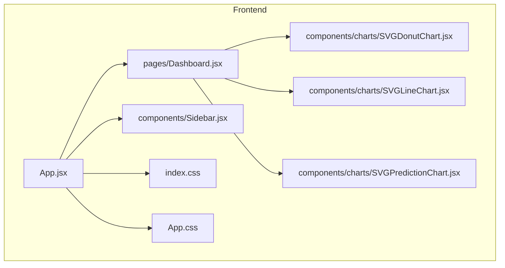
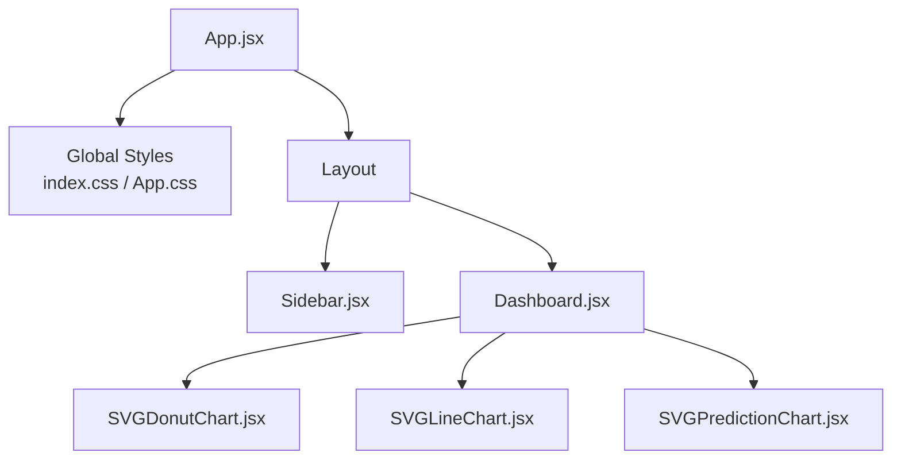
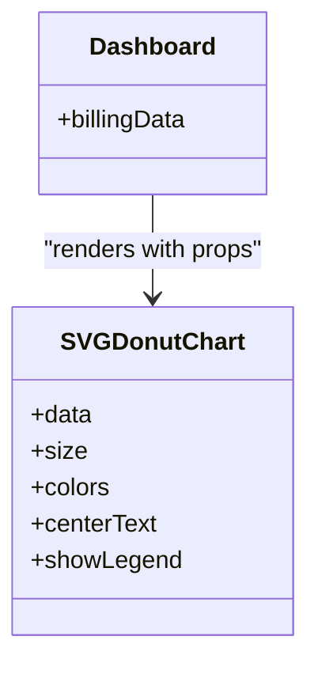
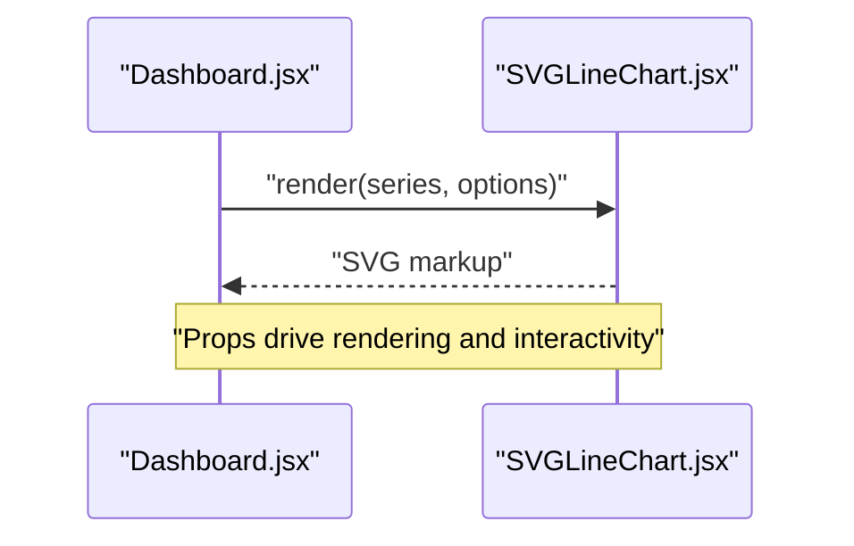
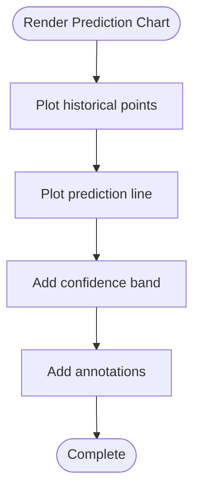
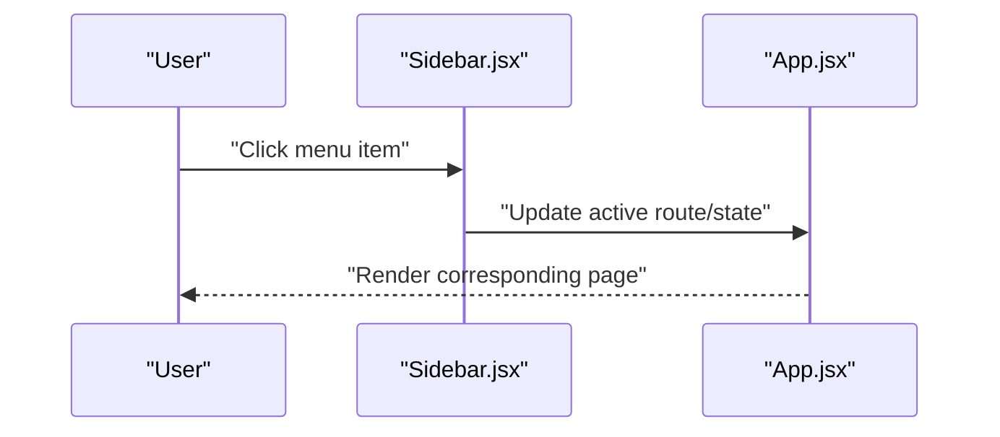
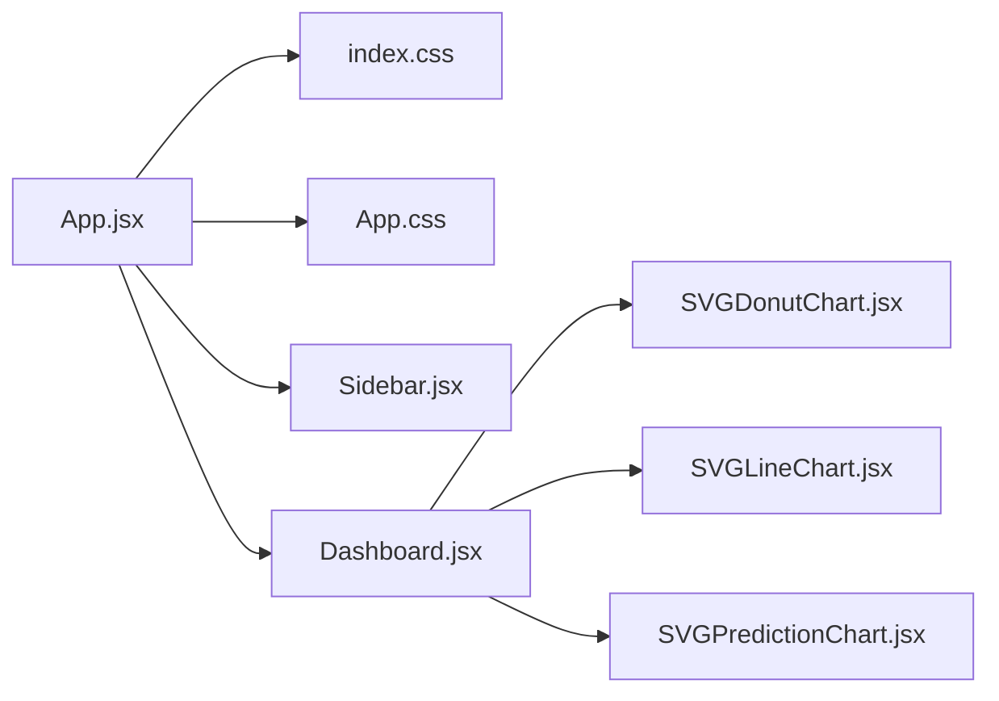

# UI Components Library

<cite>
**Referenced Files in This Document**
- [SVGDonutChart.jsx](file://frontend/src/components/charts/SVGDonutChart.jsx)
- [SVGLineChart.jsx](file://frontend/src/components/charts/SVGLineChart.jsx)
- [SVGPredictionChart.jsx](file://frontend/src/components/charts/SVGPredictionChart.jsx)
- [Sidebar.jsx](file://frontend/src/components/Sidebar.jsx)
- [Dashboard.jsx](file://frontend/src/pages/Dashboard.jsx)
- [App.jsx](file://frontend/src/App.jsx)
- [index.css](file://frontend/src/index.css)
- [App.css](file://frontend/src/App.css)
</cite>

## Table of Contents
1. [Introduction](#introduction)
2. [Project Structure](#project-structure)
3. [Core Components](#core-components)
4. [Architecture Overview](#architecture-overview)
5. [Detailed Component Analysis](#detailed-component-analysis)
6. [Dependency Analysis](#dependency-analysis)
7. [Performance Considerations](#performance-considerations)
8. [Troubleshooting Guide](#troubleshooting-guide)
9. [Conclusion](#conclusion)
10. [Appendices](#appendices)

## Introduction
This document describes the custom UI components library implemented in the frontend, focusing on:
- SVG chart components: Donut, Line, and Prediction charts
- Sidebar navigation component and its customization options
- Component composition patterns, reusable UI elements, and styling approaches
- Guidelines for creating new custom components following established patterns

The goal is to provide both a practical usage guide and architectural insights so that developers can extend and maintain the UI consistently.

## Project Structure
The UI components are organized under the frontend source tree with a clear separation between presentation (components), pages, context providers, and global styles. The charts live in a dedicated folder to emphasize their reusability across pages.

**Diagram sources**
- [App.jsx](file://frontend/src/App.jsx)
- [Dashboard.jsx](file://frontend/src/pages/Dashboard.jsx)
- [Sidebar.jsx](file://frontend/src/components/Sidebar.jsx)
- [SVGDonutChart.jsx](file://frontend/src/components/charts/SVGDonutChart.jsx)
- [SVGLineChart.jsx](file://frontend/src/components/charts/SVGLineChart.jsx)
- [SVGPredictionChart.jsx](file://frontend/src/components/charts/SVGPredictionChart.jsx)
- [index.css](file://frontend/src/index.css)
- [App.css](file://frontend/src/App.css)

**Section sources**
- [App.jsx](file://frontend/src/App.jsx)
- [Dashboard.jsx](file://frontend/src/pages/Dashboard.jsx)
- [Sidebar.jsx](file://frontend/src/components/Sidebar.jsx)
- [SVGDonutChart.jsx](file://frontend/src/components/charts/SVGDonutChart.jsx)
- [SVGLineChart.jsx](file://frontend/src/components/charts/SVGLineChart.jsx)
- [SVGPredictionChart.jsx](file://frontend/src/components/charts/SVGPredictionChart.jsx)
- [index.css](file://frontend/src/index.css)
- [App.css](file://frontend/src/App.css)

## Core Components
This section summarizes the key UI building blocks and how they fit together.

- SVGDonutChart
  - Purpose: Renders a donut chart from an array of segments with values and labels.
  - Typical props: data array (value, label, color), size, colors palette, center text, legend toggle.
  - Styling: Controlled via CSS variables or inline styles; supports responsive sizing.
  - Usage example: See Dashboard page where it receives aggregated billing data.

- SVGLineChart
  - Purpose: Renders a line chart over time or categories.
  - Typical props: series (x-axis values, y-axis values), axes labels, grid lines, tooltip behavior, colors.
  - Styling: Grid and axis styles configurable; supports multiple series.
  - Usage example: Used in Dashboard to visualize trends.

- SVGPredictionChart
  - Purpose: Displays historical data alongside predicted values with confidence bands.
  - Typical props: historical series, prediction series, confidence interval, markers, annotations.
  - Styling: Distinct styles for actual vs predicted regions; annotation overlays.
  - Usage example: Integrated into Dashboard to show forecasted metrics.

- Sidebar
  - Purpose: Provides navigation links and active state management.
  - Customization: Menu items, icons, collapsible behavior, theme-aware colors.
  - Integration: Consumed by App layout and navigates within the app.

**Section sources**
- [SVGDonutChart.jsx](file://frontend/src/components/charts/SVGDonutChart.jsx)
- [SVGLineChart.jsx](file://frontend/src/components/charts/SVGLineChart.jsx)
- [SVGPredictionChart.jsx](file://frontend/src/components/charts/SVGPredictionChart.jsx)
- [Sidebar.jsx](file://frontend/src/components/Sidebar.jsx)
- [Dashboard.jsx](file://frontend/src/pages/Dashboard.jsx)

## Architecture Overview
The UI architecture follows a simple, composable pattern:
- App orchestrates layout and imports global styles.
- Pages compose reusable components (charts and sidebar).
- Charts are pure presentational components receiving data via props.
- Global styles centralize design tokens and shared themes.

**Diagram sources**
- [App.jsx](file://frontend/src/App.jsx)
- [index.css](file://frontend/src/index.css)
- [App.css](file://frontend/src/App.css)
- [Sidebar.jsx](file://frontend/src/components/Sidebar.jsx)
- [Dashboard.jsx](file://frontend/src/pages/Dashboard.jsx)
- [SVGDonutChart.jsx](file://frontend/src/components/charts/SVGDonutChart.jsx)
- [SVGLineChart.jsx](file://frontend/src/components/charts/SVGLineChart.jsx)
- [SVGPredictionChart.jsx](file://frontend/src/components/charts/SVGPredictionChart.jsx)

## Detailed Component Analysis

### SVGDonutChart
- Responsibilities
  - Convert data segments into SVG paths/arc segments.
  - Render optional center text and legend.
  - Handle hover interactions and accessibility attributes.
- Props contract
  - data: Array of { value, label, color }
  - size: Number controlling overall dimensions
  - colors: Optional palette override
  - centerText: String displayed at center
  - showLegend: Boolean to toggle legend visibility
- Styling approach
  - Uses CSS classes for consistent theming.
  - Supports responsive sizing via percentage-based width/height.
- Composition patterns
  - Accepts computed aggregates from parent pages.
  - Can be wrapped with a card container for padding/shadows.
- Example usage
  - Refer to Dashboard page where it receives aggregated billing data.

**Diagram sources**
- [SVGDonutChart.jsx](file://frontend/src/components/charts/SVGDonutChart.jsx)
- [Dashboard.jsx](file://frontend/src/pages/Dashboard.jsx)

**Section sources**
- [SVGDonutChart.jsx](file://frontend/src/components/charts/SVGDonutChart.jsx)
- [Dashboard.jsx](file://frontend/src/pages/Dashboard.jsx)

### SVGLineChart
- Responsibilities
  - Map x/y data points to SVG coordinates.
  - Draw lines, axes, gridlines, and tooltips.
  - Support multiple series with distinct colors.
- Props contract
  - series: Array of { name, values }
  - xAxisLabels: Array of labels
  - yAxisRange: Min/max for scaling
  - showGrid: Boolean
  - showTooltip: Boolean
  - colors: Palette for series
- Styling approach
  - Grid and axis styles controlled via CSS variables.
  - Tooltip positioning handled relative to chart container.
- Composition patterns
  - Often paired with a header and summary stats above the chart.
- Example usage
  - Refer to Dashboard page where it renders trend data.

**Diagram sources**
- [SVGLineChart.jsx](file://frontend/src/components/charts/SVGLineChart.jsx)
- [Dashboard.jsx](file://frontend/src/pages/Dashboard.jsx)

**Section sources**
- [SVGLineChart.jsx](file://frontend/src/components/charts/SVGLineChart.jsx)
- [Dashboard.jsx](file://frontend/src/pages/Dashboard.jsx)

### SVGPredictionChart
- Responsibilities
  - Plot historical data and overlay predictions.
  - Render confidence intervals and annotations.
  - Provide visual distinction between observed and predicted regions.
- Props contract
  - historical: Array of { x, y }
  - prediction: Array of { x, y }
  - confidence: Array of { x, low, high }
  - annotations: Array of { x, label }
  - colors: Historical/predicted band colors
- Styling approach
  - Uses dashed lines for predictions and shaded areas for confidence.
  - Annotations rendered as vertical markers with labels.
- Composition patterns
  - Typically placed below summary cards and next to other charts for comparison.
- Example usage
  - Refer to Dashboard page where it shows forecasted metrics.

**Diagram sources**
- [SVGPredictionChart.jsx](file://frontend/src/components/charts/SVGPredictionChart.jsx)
- [Dashboard.jsx](file://frontend/src/pages/Dashboard.jsx)

**Section sources**
- [SVGPredictionChart.jsx](file://frontend/src/components/charts/SVGPredictionChart.jsx)
- [Dashboard.jsx](file://frontend/src/pages/Dashboard.jsx)

### Sidebar Navigation
- Responsibilities
  - Display navigation menu items.
  - Manage active link highlighting.
  - Support collapsible behavior and theme-aware styling.
- Customization capabilities
  - Menu items configuration (label, route, icon).
  - Collapsible sections and nested routes.
  - Theme overrides via CSS variables.
- Integration
  - Imported by App layout and used to navigate between pages.
- Example usage
  - Refer to App layout where Sidebar is mounted.

**Diagram sources**
- [Sidebar.jsx](file://frontend/src/components/Sidebar.jsx)
- [App.jsx](file://frontend/src/App.jsx)

**Section sources**
- [Sidebar.jsx](file://frontend/src/components/Sidebar.jsx)
- [App.jsx](file://frontend/src/App.jsx)

## Dependency Analysis
The components follow a unidirectional data flow:
- App imports global styles and layout.
- Pages import and compose chart components.
- Charts depend only on props and CSS classes.

**Diagram sources**
- [App.jsx](file://frontend/src/App.jsx)
- [index.css](file://frontend/src/index.css)
- [App.css](file://frontend/src/App.css)
- [Sidebar.jsx](file://frontend/src/components/Sidebar.jsx)
- [Dashboard.jsx](file://frontend/src/pages/Dashboard.jsx)
- [SVGDonutChart.jsx](file://frontend/src/components/charts/SVGDonutChart.jsx)
- [SVGLineChart.jsx](file://frontend/src/components/charts/SVGLineChart.jsx)
- [SVGPredictionChart.jsx](file://frontend/src/components/charts/SVGPredictionChart.jsx)

**Section sources**
- [App.jsx](file://frontend/src/App.jsx)
- [index.css](file://frontend/src/index.css)
- [App.css](file://frontend/src/App.css)
- [Sidebar.jsx](file://frontend/src/components/Sidebar.jsx)
- [Dashboard.jsx](file://frontend/src/pages/Dashboard.jsx)
- [SVGDonutChart.jsx](file://frontend/src/components/charts/SVGDonutChart.jsx)
- [SVGLineChart.jsx](file://frontend/src/components/charts/SVGLineChart.jsx)
- [SVGPredictionChart.jsx](file://frontend/src/components/charts/SVGPredictionChart.jsx)

## Performance Considerations
- Prefer memoization for expensive computations in parent pages before passing data to charts.
- Use stable prop references to avoid unnecessary re-renders of chart components.
- Limit the number of data points for large datasets; consider downsampling or pagination.
- Avoid heavy inline styles; prefer CSS classes and variables for better performance and caching.
- Debounce user interactions like resizing containers to prevent excessive reflows.

[No sources needed since this section provides general guidance]

## Troubleshooting Guide
Common issues and resolutions:
- Empty or malformed chart data
  - Ensure arrays are non-empty and contain required fields.
  - Validate numeric ranges and label counts match expected lengths.
- Incorrect sizing or overflow
  - Verify container dimensions and CSS constraints.
  - Check responsive breakpoints and ensure charts scale properly.
- Missing styles or theme inconsistencies
  - Confirm global styles are imported in App.
  - Inspect CSS variable definitions and overrides.
- Sidebar not updating active state
  - Verify route matching logic and state updates.
  - Ensure navigation handlers are bound correctly.

**Section sources**
- [index.css](file://frontend/src/index.css)
- [App.css](file://frontend/src/App.css)
- [App.jsx](file://frontend/src/App.jsx)
- [Sidebar.jsx](file://frontend/src/components/Sidebar.jsx)
- [Dashboard.jsx](file://frontend/src/pages/Dashboard.jsx)
- [SVGDonutChart.jsx](file://frontend/src/components/charts/SVGDonutChart.jsx)
- [SVGLineChart.jsx](file://frontend/src/components/charts/SVGLineChart.jsx)
- [SVGPredictionChart.jsx](file://frontend/src/components/charts/SVGPredictionChart.jsx)

## Conclusion
The UI components library emphasizes simplicity, composability, and consistent styling. Charts are pure, prop-driven components that integrate seamlessly with pages. The Sidebar offers flexible navigation with theme support. By following the established patterns and guidelines, you can extend the library with new components while maintaining clarity and performance.

[No sources needed since this section summarizes without analyzing specific files]

## Appendices

### Styling Approaches
- Global design tokens via CSS variables in index.css and App.css.
- Component-level classes for isolated styling.
- Responsive design using percentage-based sizes and media queries.

**Section sources**
- [index.css](file://frontend/src/index.css)
- [App.css](file://frontend/src/App.css)

### Creating New Custom Components
Follow these steps to add a new component:
- Create a new file under components with a descriptive name.
- Define a clear props interface and default values.
- Keep the component pure and focused on a single responsibility.
- Use CSS classes and variables for styling; avoid inline styles when possible.
- Compose existing components to reduce duplication.
- Add usage examples in a relevant page or storybook-like demo.
- Test edge cases such as empty data, large datasets, and responsive layouts.

[No sources needed since this section provides general guidance]