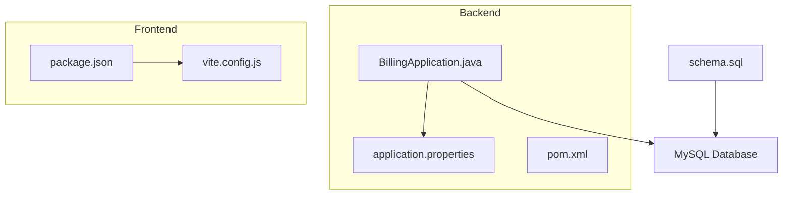
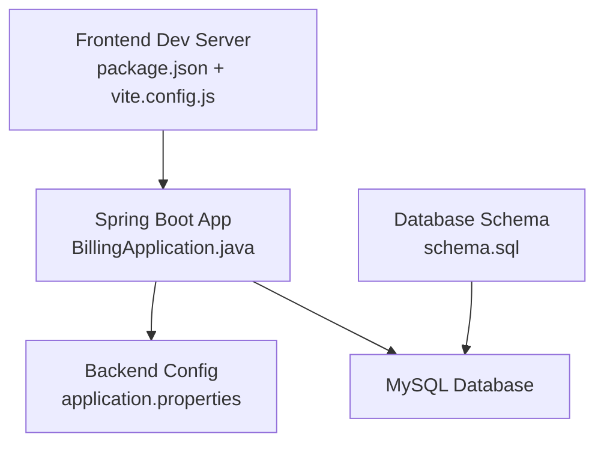

# Getting Started

<cite>
**Referenced Files in This Document**
- [README.md](file://README.md)
- [schema.sql](file://schema.sql)
- [application.properties](file://backend/src/main/resources/application.properties)
- [BillingApplication.java](file://backend/src/main/java/com/ceb/billing/BillingApplication.java)
- [pom.xml](file://backend/pom.xml)
- [package.json](file://frontend/package.json)
- [vite.config.js](file://frontend/vite.config.js)
</cite>

## Table of Contents
1. Introduction
2. Project Structure
3. Prerequisites
4. Installation and Setup
5. Database Initialization
6. Backend Configuration
7. Frontend Development Server
8. First-Time Run
9. Verification Steps
10. Common Setup Issues and Solutions
11. Development Workflow Guidance
12. Architecture Overview
13. Conclusion

## Introduction
This guide helps you set up and run the CEB Billing System locally for development. It covers prerequisites, environment setup, database initialization using schema.sql, backend configuration with application.properties, frontend development server setup, first-time run procedures, verification steps, troubleshooting, and a high-level architecture overview to orient new contributors.

## Project Structure
The repository is organized into two main parts:
- backend: Java/Spring Boot application (Maven-based)
- frontend: React application (Vite-based)

**Diagram sources**
- [BillingApplication.java](file://backend/src/main/java/com/ceb/billing/BillingApplication.java)
- [application.properties](file://backend/src/main/resources/application.properties)
- [pom.xml](file://backend/pom.xml)
- [package.json](file://frontend/package.json)
- [vite.config.js](file://frontend/vite.config.js)
- [schema.sql](file://schema.sql)

**Section sources**
- [README.md](file://README.md)

## Prerequisites
Ensure your local machine meets these requirements before proceeding:
- Java 17 or newer
- Node.js 18 or newer
- MySQL server installed and running
- A terminal or command prompt
- Optional: IDE support for Java/Maven and JavaScript/Vite

[No sources needed since this section provides general guidance]

## Installation and Setup
Follow these steps to prepare your environment:
1. Install Java 17+ and verify installation.
2. Install Node.js 18+ and verify installation.
3. Start MySQL and ensure it is accessible from localhost unless configured otherwise.
4. Clone or open the project directory.

[No sources needed since this section provides general guidance]

## Database Initialization
Initialize the database using the provided schema file:
1. Create a database in MySQL (for example, ceb_billing).
2. Apply schema.sql to create tables and initial structures.
3. Confirm that required tables exist after import.

Notes:
- Ensure the database user has permissions to create objects if needed.
- If you change the database name, update the backend configuration accordingly.

**Section sources**
- [schema.sql](file://schema.sql)

## Backend Configuration
Configure the Spring Boot backend by editing application.properties:
- Set the JDBC URL to point to your MySQL instance and database.
- Provide the correct username and password for database access.
- Optionally adjust other properties as needed for your environment.

After updating application.properties, build and run the backend using Maven. The application will start an embedded web server and connect to the configured database.

**Section sources**
- [application.properties](file://backend/src/main/resources/application.properties)
- [BillingApplication.java](file://backend/src/main/java/com/ceb/billing/BillingApplication.java)
- [pom.xml](file://backend/pom.xml)

## Frontend Development Server
Set up and run the frontend development server:
1. Navigate to the frontend directory.
2. Install dependencies using the package manager referenced in package.json.
3. Start the development server using the script defined in package.json.
4. Open the local development URL shown by the server in your browser.

If the backend runs on a different port than expected, configure the frontend proxy or API base URL via vite.config.js or environment variables as appropriate.

**Section sources**
- [package.json](file://frontend/package.json)
- [vite.config.js](file://frontend/vite.config.js)

## First-Time Run
Complete sequence to run the system for the first time:
1. Initialize the database with schema.sql.
2. Configure application.properties with your database credentials.
3. Build and start the backend.
4. Install frontend dependencies and start the frontend dev server.
5. Access the frontend in your browser and log in using default credentials if seeded.

[No sources needed since this section summarizes previously covered steps]

## Verification Steps
Confirm everything is working:
- Backend health: Check that the backend process started without errors and can reach the database.
- Database contents: Verify key tables were created by schema.sql.
- Frontend connectivity: Ensure the frontend loads and can call backend endpoints.
- Authentication: Log in successfully using the expected default account if present.

[No sources needed since this section provides general guidance]

## Common Setup Issues and Solutions
- Cannot connect to MySQL:
  - Verify host, port, database name, username, and password in application.properties.
  - Ensure MySQL service is running and reachable from localhost.
- Frontend cannot reach backend:
  - Confirm backend is running and listening on the expected port.
  - Adjust frontend proxy settings in vite.config.js or API base URL configuration.
- Missing dependencies:
  - Reinstall backend dependencies with Maven.
  - Reinstall frontend dependencies using the package manager referenced in package.json.
- Port conflicts:
  - Change the backend or frontend ports in their respective configurations.

[No sources needed since this section provides general guidance]

## Development Workflow Guidance
- Backend:
  - Use Maven to build and run.
  - Modify application.properties for local database and feature toggles.
  - Restart the backend after configuration changes.
- Frontend:
  - Use the development server for hot reloading.
  - Update vite.config.js for proxying or environment-specific settings.
- Database:
  - Keep schema.sql updated for structural changes.
  - Back up data before applying migrations in shared environments.

[No sources needed since this section provides general guidance]

## Architecture Overview
High-level view of how components interact during development:
- The frontend runs a development server and proxies API calls to the backend.
- The backend is a Spring Boot application connecting to MySQL.
- The schema defines the database structure used by the backend.

**Diagram sources**
- [package.json](file://frontend/package.json)
- [vite.config.js](file://frontend/vite.config.js)
- [BillingApplication.java](file://backend/src/main/java/com/ceb/billing/BillingApplication.java)
- [application.properties](file://backend/src/main/resources/application.properties)
- [schema.sql](file://schema.sql)

## Conclusion
You should now have a fully functional local development environment for the CEB Billing System. Use the verification steps to confirm connectivity and functionality, and refer to the troubleshooting section if you encounter issues. For ongoing development, follow the workflow guidance to keep backend, frontend, and database in sync.

[No sources needed since this section summarizes without analyzing specific files]