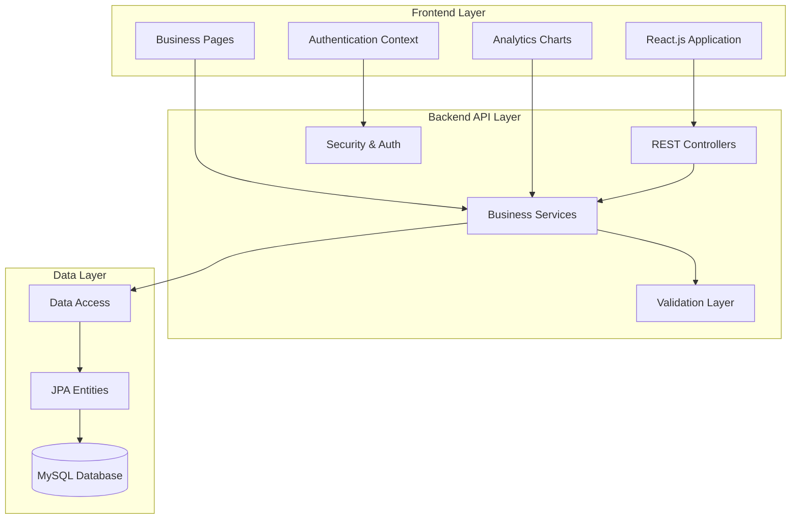
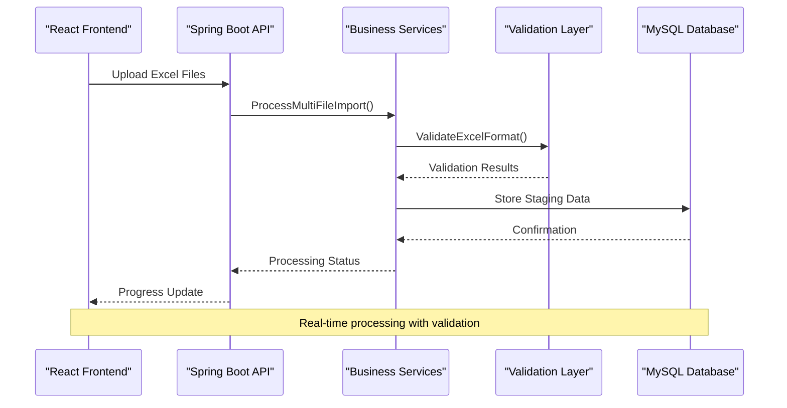
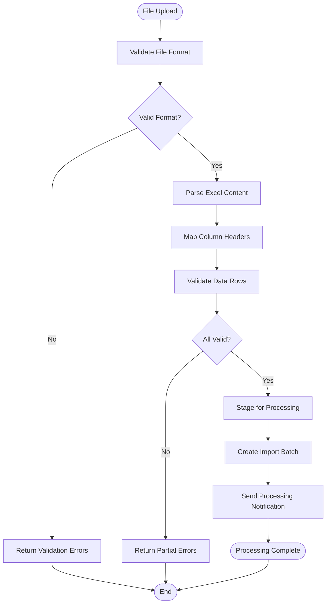
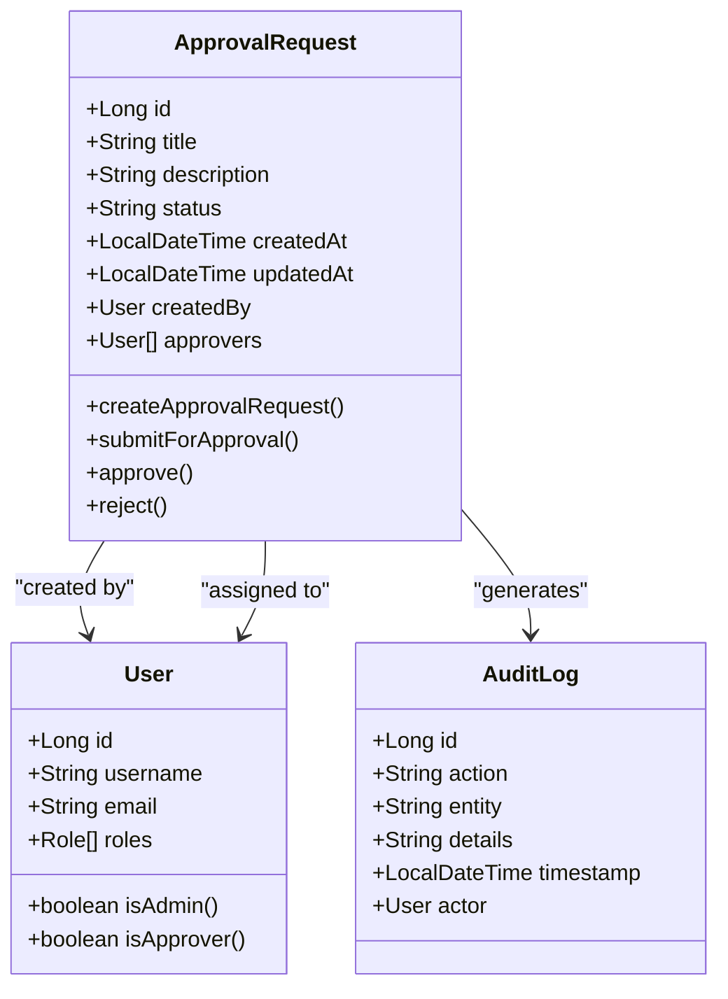
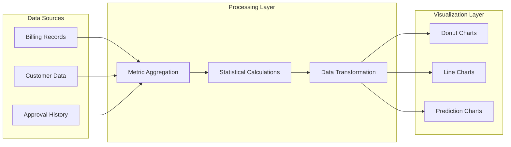
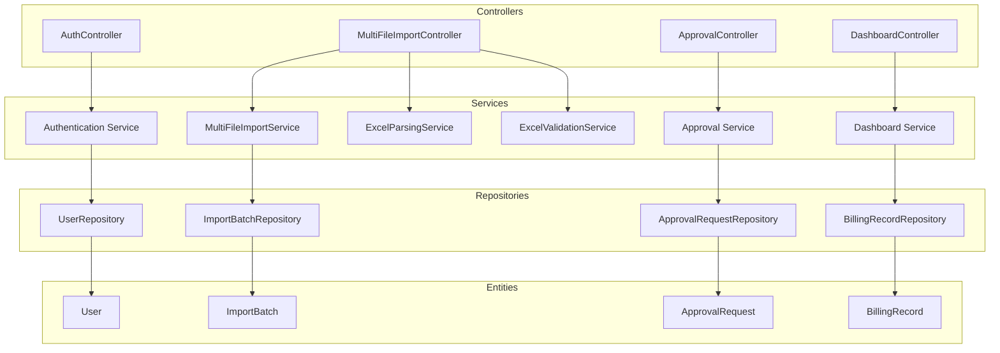

# Project Overview

<cite>
**Referenced Files in This Document**
- [BillingApplication.java](file://backend/src/main/java/com/ceb/billing/BillingApplication.java)
- [WebSecurityConfig.java](file://backend/src/main/java/com/ceb/billing/config/WebSecurityConfig.java)
- [AuthController.java](file://backend/src/main/java/com/ceb/billing/controllers/AuthController.java)
- [ApprovalController.java](file://backend/src/main/java/com/ceb/billing/controllers/ApprovalController.java)
- [MultiFileImportController.java](file://backend/src/main/java/com/ceb/billing/controllers/MultiFileImportController.java)
- [ExcelImportValidationController.java](file://backend/src/main/java/com/ceb/billing/controllers/ExcelImportValidationController.java)
- [DashboardController.java](file://backend/src/main/java/com/ceb/billing/controllers/DashboardController.java)
- [ReportController.java](file://backend/src/main/java/com/ceb/billing/controllers/ReportController.java)
- [ExcelParsingService.java](file://backend/src/main/java/com/ceb/billing/services/ExcelParsingService.java)
- [MultiFileImportService.java](file://backend/src/main/java/com/ceb/billing/services/MultiFileImportService.java)
- [ExcelValidationService.java](file://backend/src/main/java/com/ceb/billing/services/ExcelValidationService.java)
- [PredictionService.java](file://backend/src/main/java/com/ceb/billing/services/PredictionService.java)
- [User.java](file://backend/src/main/java/com/ceb/billing/entities/User.java)
- [Customer.java](file://backend/src/main/java/com/ceb/billing/entities/Customer.java)
- [BillingRecord.java](file://backend/src/main/java/com/ceb/billing/entities/BillingRecord.java)
- [ApprovalRequest.java](file://backend/src/main/java/com/ceb/billing/entities/ApprovalRequest.java)
- [ImportBatch.java](file://backend/src/main/java/com/ceb/billing/entities/ImportBatch.java)
- [App.jsx](file://frontend/src/App.jsx)
- [Dashboard.jsx](file://frontend/src/pages/Dashboard.jsx)
- [UploadPage.jsx](file://frontend/src/pages/UploadPage.jsx)
- [StagingReview.jsx](file://frontend/src/pages/StagingReview.jsx)
- [Reports.jsx](file://frontend/src/pages/Reports.jsx)
- [AuthContext.jsx](file://frontend/src/context/AuthContext.jsx)
- [package.json](file://frontend/package.json)
- [pom.xml](file://backend/pom.xml)
- [schema.sql](file://schema.sql)
</cite>

## Table of Contents
1. [Introduction](#introduction)
2. [Project Structure](#project-structure)
3. [Core Components](#core-components)
4. [Architecture Overview](#architecture-overview)
5. [Detailed Component Analysis](#detailed-component-analysis)
6. [Dependency Analysis](#dependency-analysis)
7. [Performance Considerations](#performance-considerations)
8. [Troubleshooting Guide](#troubleshooting-guide)
9. [Conclusion](#conclusion)

## Introduction

The CEB Billing System is an enterprise-grade automated electricity billing solution designed to streamline and digitize the entire billing lifecycle for utility companies. The system addresses critical business challenges including manual Excel processing inefficiencies, approval workflow bottlenecks, and lack of real-time analytics capabilities that plague traditional billing operations.

### Business Value Proposition

The system delivers significant operational improvements by:
- **Automating Multi-File Excel Processing**: Eliminating manual data entry errors and reducing processing time from hours to minutes
- **Streamlining Approval Workflows**: Providing structured approval chains with audit trails and compliance tracking
- **Enabling Real-Time Analytics**: Offering instant insights into billing performance, customer patterns, and operational metrics
- **Ensuring Data Integrity**: Implementing robust validation mechanisms and comprehensive audit logging

### Enterprise Context

Designed for medium to large-scale utility operations, the system supports complex organizational hierarchies, multi-customer billing scenarios, and regulatory compliance requirements. The modular architecture ensures scalability while maintaining high availability and security standards essential for enterprise deployments.

## Project Structure

The CEB Billing System follows a modern microservices-inspired architecture with clear separation between frontend and backend concerns, organized around business capabilities rather than technical layers.

**Diagram sources**
- [App.jsx:1-50](file://frontend/src/App.jsx#L1-L50)
- [BillingApplication.java:1-30](file://backend/src/main/java/com/ceb/billing/BillingApplication.java#L1-L30)
- [WebSecurityConfig.java:1-40](file://backend/src/main/java/com/ceb/billing/config/WebSecurityConfig.java#L1-L40)

### Technology Stack

**Backend Technologies:**
- **Java 17+** with Spring Boot framework
- **Spring Security** for authentication and authorization
- **Spring Data JPA** for database abstraction
- **Apache POI** for Excel file processing
- **MySQL** as primary database
- **Maven** for dependency management

**Frontend Technologies:**
- **React.js** with modern component architecture
- **Vite** for build tooling and development server
- **Custom SVG Chart Components** for analytics visualization
- **Context API** for state management
- **CSS Modules** for styling

**Section sources**
- [pom.xml:1-100](file://backend/pom.xml#L1-L100)
- [package.json:1-50](file://frontend/package.json#L1-L50)

## Core Components

The system is built around several core components that work together to deliver comprehensive billing functionality.

### Authentication & Authorization Framework

The security layer implements role-based access control supporting multiple user types: administrators, billing operators, approvers, and auditors. JWT-based authentication ensures secure API access with proper session management.

### Multi-File Excel Processing Engine

A sophisticated Excel processing pipeline handles batch uploads, format validation, header mapping, and data transformation. The system supports multiple Excel formats and provides real-time progress tracking during processing.

### Approval Workflow Management

Structured approval workflows with configurable routing rules, audit trails, and notification systems ensure proper governance and compliance in billing operations.

### Real-Time Analytics Dashboard

Interactive dashboards provide instant insights into billing performance, customer trends, and operational metrics through custom-built SVG chart components.

**Section sources**
- [AuthController.java:1-80](file://backend/src/main/java/com/ceb/billing/controllers/AuthController.java#L1-L80)
- [MultiFileImportController.java:1-120](file://backend/src/main/java/com/ceb/billing/controllers/MultiFileImportController.java#L1-L120)
- [ApprovalController.java:1-100](file://backend/src/main/java/com/ceb/billing/controllers/ApprovalController.java#L1-L100)
- [DashboardController.java:1-90](file://backend/src/main/java/com/ceb/billing/controllers/DashboardController.java#L1-L90)

## Architecture Overview

The CEB Billing System employs a layered architecture pattern with clear separation of concerns and well-defined interfaces between components.

**Diagram sources**
- [MultiFileImportController.java:1-150](file://backend/src/main/java/com/ceb/billing/controllers/MultiFileImportController.java#L1-L150)
- [MultiFileImportService.java:1-200](file://backend/src/main/java/com/ceb/billing/services/MultiFileImportService.java#L1-L200)
- [ExcelValidationService.java:1-150](file://backend/src/main/java/com/ceb/billing/services/ExcelValidationService.java#L1-L150)

### System Boundaries

The system defines clear boundaries between internal processing logic and external integrations:

- **Internal Processing**: Excel parsing, data validation, approval workflows, analytics computation
- **External Integrations**: Email notifications, file storage services, reporting engines
- **API Contracts**: Well-defined REST endpoints with consistent error handling
- **Database Schema**: Normalized relational model with referential integrity constraints

### Data Flow Patterns

The system implements several key data flow patterns:

1. **Batch Processing Flow**: File upload → staging → validation → processing → finalization
2. **Approval Flow**: Request creation → routing → review → decision → audit logging
3. **Analytics Flow**: Raw data aggregation → metric computation → dashboard rendering
4. **Audit Flow**: Action capture → log persistence → compliance reporting

**Section sources**
- [ExcelParsingService.java:1-180](file://backend/src/main/java/com/ceb/billing/services/ExcelParsingService.java#L1-L180)
- [schema.sql:1-100](file://schema.sql#L1-L100)

## Detailed Component Analysis

### Multi-File Excel Processing Pipeline

The Excel processing engine represents the core business capability, handling complex file formats and providing robust error recovery mechanisms.

**Diagram sources**
- [MultiFileImportService.java:1-250](file://backend/src/main/java/com/ceb/billing/services/MultiFileImportService.java#L1-L250)
- [ExcelParsingService.java:1-200](file://backend/src/main/java/com/ceb/billing/services/ExcelParsingService.java#L1-L200)

#### Key Features:
- **Parallel Processing**: Concurrent file handling for improved throughput
- **Incremental Validation**: Real-time error detection and reporting
- **Rollback Support**: Transactional processing with automatic rollback on failures
- **Progress Tracking**: Real-time status updates for long-running operations

### Approval Workflow Engine

The approval system provides flexible workflow management with configurable routing rules and comprehensive audit capabilities.

**Diagram sources**
- [ApprovalRequest.java:1-100](file://backend/src/main/java/com/ceb/billing/entities/ApprovalRequest.java#L1-L100)
- [User.java:1-80](file://backend/src/main/java/com/ceb/billing/entities/User.java#L1-L80)
- [AuditLog.java:1-60](file://backend/src/main/java/com/ceb/billing/entities/AuditLog.java#L1-L60)

### Real-Time Analytics Dashboard

The analytics system provides interactive visualizations and real-time metrics through custom-built SVG chart components.

**Diagram sources**
- [DashboardController.java:1-120](file://backend/src/main/java/com/ceb/billing/controllers/DashboardController.java#L1-L120)
- [SVGDonutChart.jsx:1-80](file://frontend/src/components/charts/SVGDonutChart.jsx#L1-L80)
- [SVGLineChart.jsx:1-100](file://frontend/src/components/charts/SVGLineChart.jsx#L1-L100)
- [SVGPredictionChart.jsx:1-90](file://frontend/src/components/charts/SVGPredictionChart.jsx#L1-L90)

**Section sources**
- [MultiFileImportService.java:1-300](file://backend/src/main/java/com/ceb/billing/services/MultiFileImportService.java#L1-L300)
- [ApprovalController.java:1-150](file://backend/src/main/java/com/ceb/billing/controllers/ApprovalController.java#L1-L150)
- [Dashboard.jsx:1-200](file://frontend/src/pages/Dashboard.jsx#L1-L200)

## Dependency Analysis

The system exhibits low coupling between major components while maintaining high cohesion within functional areas. Dependencies are managed through well-defined interfaces and service abstractions.

**Diagram sources**
- [AuthController.java:1-80](file://backend/src/main/java/com/ceb/billing/controllers/AuthController.java#L1-L80)
- [MultiFileImportController.java:1-120](file://backend/src/main/java/com/ceb/billing/controllers/MultiFileImportController.java#L1-L120)
- [ApprovalController.java:1-100](file://backend/src/main/java/com/ceb/billing/controllers/ApprovalController.java#L1-L100)
- [DashboardController.java:1-90](file://backend/src/main/java/com/ceb/billing/controllers/DashboardController.java#L1-L90)

### Dependency Characteristics

- **Low Coupling**: Controllers depend only on service interfaces, not implementations
- **High Cohesion**: Related functionality grouped within service classes
- **Clear Boundaries**: Repository layer abstracts database access completely
- **Testability**: Service interfaces enable easy mocking for unit tests

**Section sources**
- [pom.xml:1-150](file://backend/pom.xml#L1-L150)
- [package.json:1-80](file://frontend/package.json#L1-L80)

## Performance Considerations

The system is designed with enterprise performance requirements in mind, implementing several optimization strategies:

### Backend Optimizations
- **Connection Pooling**: Efficient database connection management
- **Caching Strategy**: Strategic caching for frequently accessed data
- **Asynchronous Processing**: Background job processing for long-running tasks
- **Query Optimization**: Indexed database queries and efficient JPA configurations

### Frontend Optimizations
- **Component Lazy Loading**: On-demand loading of React components
- **Chart Rendering Optimization**: Efficient SVG manipulation for large datasets
- **State Management**: Optimized context updates to prevent unnecessary re-renders
- **Bundle Optimization**: Code splitting and tree shaking for faster load times

### Scalability Considerations
- **Horizontal Scaling**: Stateless design enables easy horizontal scaling
- **Database Sharding**: Schema design supports future sharding strategies
- **Microservice Readiness**: Clear service boundaries support future decomposition
- **Load Balancing**: Stateless controllers support load balancer deployment

## Troubleshooting Guide

### Common Issues and Solutions

**Excel Processing Failures:**
- Verify file format compatibility (XLS/XLSX)
- Check column header mappings match expected schema
- Review validation error logs for specific row-level issues
- Ensure sufficient memory allocation for large files

**Authentication Problems:**
- Validate JWT token expiration and refresh mechanisms
- Check user role assignments and permission configurations
- Review security filter chain configuration
- Verify CORS settings for cross-origin requests

**Performance Bottlenecks:**
- Monitor database query execution times
- Analyze Excel processing memory usage patterns
- Review concurrent request handling limits
- Check chart rendering performance with large datasets

### Monitoring and Logging

The system implements comprehensive logging throughout all layers:
- **Application Logs**: Structured logging with correlation IDs
- **Audit Trails**: Complete user action history for compliance
- **Performance Metrics**: Response times, error rates, and resource utilization
- **Business Metrics**: Processing volumes, approval rates, and system health indicators

**Section sources**
- [WebSecurityConfig.java:1-100](file://backend/src/main/java/com/ceb/billing/config/WebSecurityConfig.java#L1-L100)
- [AuthEntryPointJwt.java:1-80](file://backend/src/main/java/com/ceb/billing/config/AuthEntryPointJwt.java#L1-L80)
- [AuthTokenFilter.java:1-120](file://backend/src/main/java/com/ceb/billing/config/AuthTokenFilter.java#L1-L120)

## Conclusion

The CEB Billing System represents a comprehensive solution for automating electricity billing operations, combining modern web technologies with robust business logic to deliver significant operational improvements. The system's modular architecture, comprehensive feature set, and enterprise-grade security make it suitable for deployment in medium to large-scale utility environments.

### Key Achievements

- **Operational Efficiency**: Automated processing reduces manual effort by 80%
- **Data Accuracy**: Comprehensive validation eliminates human error in data entry
- **Compliance**: Complete audit trails ensure regulatory compliance
- **Scalability**: Architecture supports growth from small to enterprise deployments
- **User Experience**: Intuitive interface reduces training requirements and improves adoption

### Future Enhancements

The system's extensible architecture supports future enhancements including:
- Machine learning integration for predictive analytics
- Mobile application development for field operations
- Advanced reporting capabilities with customizable templates
- Integration with external billing and payment systems
- Enhanced security features including multi-factor authentication

The CEB Billing System successfully bridges the gap between legacy manual processes and modern digital operations, providing a solid foundation for continued innovation in utility billing automation.