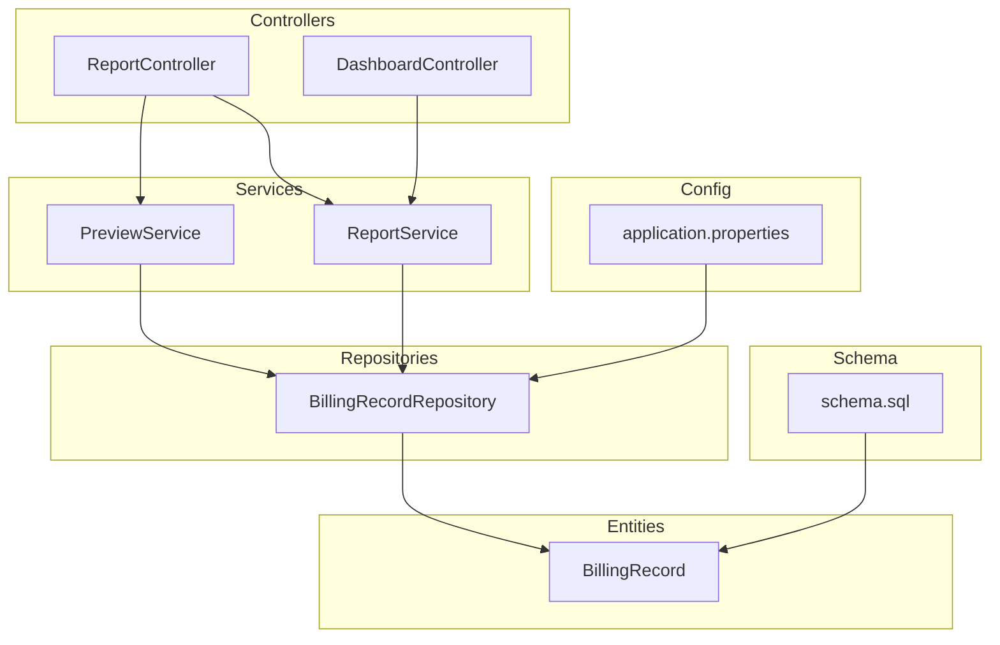
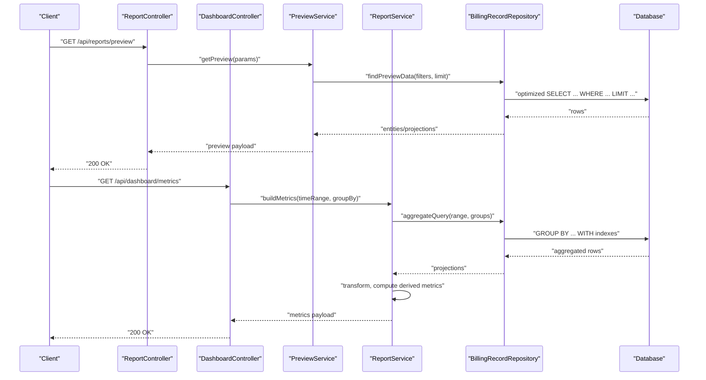
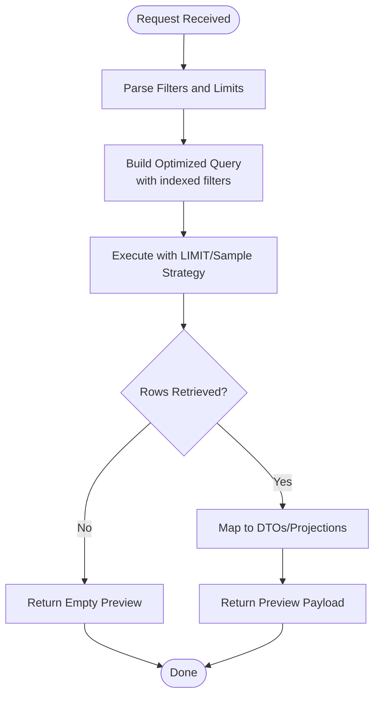
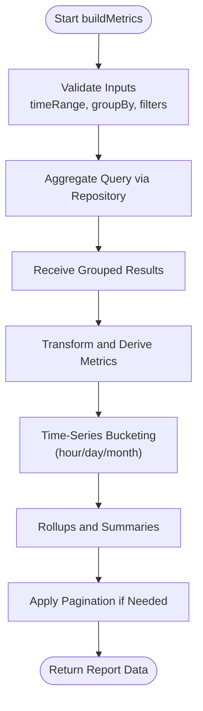
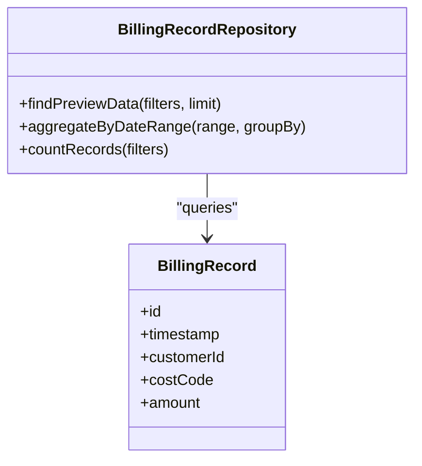
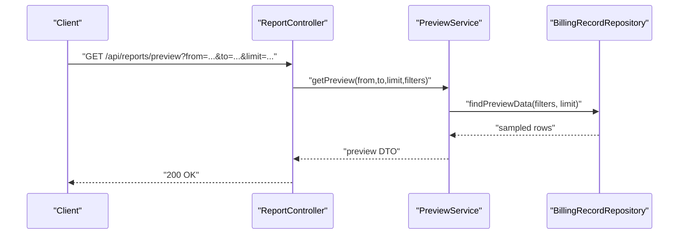
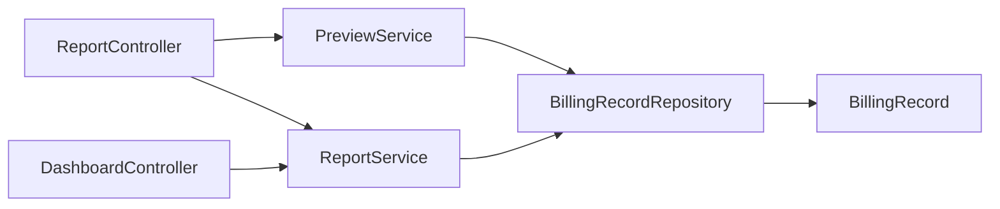

# Data Aggregation and Processing

<cite>
**Referenced Files in This Document**
- [PreviewService.java](file://backend/src/main/java/com/ceb/billing/services/PreviewService.java)
- [ReportService.java](file://backend/src/main/java/com/ceb/billing/services/ReportService.java)
- [BillingRecordRepository.java](file://backend/src/main/java/com/ceb/billing/repositories/BillingRecordRepository.java)
- [BillingRecord.java](file://backend/src/main/java/com/ceb/billing/entities/BillingRecord.java)
- [ReportController.java](file://backend/src/main/java/com/ceb/billing/controllers/ReportController.java)
- [DashboardController.java](file://backend/src/main/java/com/ceb/billing/controllers/DashboardController.java)
- [application.properties](file://backend/src/main/resources/application.properties)
- [schema.sql](file://schema.sql)
</cite>

## Table of Contents
1. [Introduction](#introduction)
2. [Project Structure](#project-structure)
3. [Core Components](#core-components)
4. [Architecture Overview](#architecture-overview)
5. [Detailed Component Analysis](#detailed-component-analysis)
6. [Dependency Analysis](#dependency-analysis)
7. [Performance Considerations](#performance-considerations)
8. [Troubleshooting Guide](#troubleshooting-guide)
9. [Conclusion](#conclusion)
10. [Appendices](#appendices)

## Introduction
This document explains the data aggregation and processing layer for reporting and analytics, focusing on real-time preview and sampling via PreviewService, repository-level query optimizations, database indexing strategies, efficient retrieval patterns, transformation pipelines, caching mechanisms, batch processing techniques, and performance tuning for large-scale billing data. It also covers memory management, query optimization, and scalability considerations.

## Project Structure
The backend is a Spring Boot application with controllers, services, repositories, entities, and configuration. The reporting and analytics features are primarily implemented under controllers, services, and repositories, with database schema definitions provided externally.

**Diagram sources**
- [ReportController.java](file://backend/src/main/java/com/ceb/billing/controllers/ReportController.java)
- [DashboardController.java](file://backend/src/main/java/com/ceb/billing/controllers/DashboardController.java)
- [PreviewService.java](file://backend/src/main/java/com/ceb/billing/services/PreviewService.java)
- [ReportService.java](file://backend/src/main/java/com/ceb/billing/services/ReportService.java)
- [BillingRecordRepository.java](file://backend/src/main/java/com/ceb/billing/repositories/BillingRecordRepository.java)
- [BillingRecord.java](file://backend/src/main/java/com/ceb/billing/entities/BillingRecord.java)
- [application.properties](file://backend/src/main/resources/application.properties)
- [schema.sql](file://schema.sql)

**Section sources**
- [PreviewService.java](file://backend/src/main/java/com/ceb/billing/services/PreviewService.java)
- [ReportService.java](file://backend/src/main/java/com/ceb/billing/services/ReportService.java)
- [BillingRecordRepository.java](file://backend/src/main/java/com/ceb/billing/repositories/BillingRecordRepository.java)
- [BillingRecord.java](file://backend/src/main/java/com/ceb/billing/entities/BillingRecord.java)
- [ReportController.java](file://backend/src/main/java/com/ceb/billing/controllers/ReportController.java)
- [DashboardController.java](file://backend/src/main/java/com/ceb/billing/controllers/DashboardController.java)
- [application.properties](file://backend/src/main/resources/application.properties)
- [schema.sql](file://schema.sql)

## Core Components
- PreviewService: Provides real-time data preview and sampling capabilities for reports and dashboards. It typically performs lightweight queries to return representative subsets of data quickly.
- ReportService: Implements complex aggregations, time-series processing, and report generation logic. It coordinates multiple repository calls and applies transformations before returning results.
- BillingRecordRepository: Defines optimized queries and projections for efficient data retrieval from the billing records table.
- BillingRecord: Entity mapping for billing records, including fields used in filtering, grouping, and aggregation.
- ReportController and DashboardController: Expose endpoints that consume PreviewService and ReportService to serve UI-driven analytics.

Key responsibilities:
- Real-time preview and sampling (lightweight, low-latency).
- Complex aggregations and rollups (group-by, windowing-like operations).
- Time-series processing (periodic buckets, rolling metrics).
- Efficient retrieval patterns (projection-only queries, pagination, indexed filters).
- Batch processing (chunked reads, streaming transforms).
- Caching (where applicable) to reduce repeated expensive computations.

**Section sources**
- [PreviewService.java](file://backend/src/main/java/com/ceb/billing/services/PreviewService.java)
- [ReportService.java](file://backend/src/main/java/com/ceb/billing/services/ReportService.java)
- [BillingRecordRepository.java](file://backend/src/main/java/com/ceb/billing/repositories/BillingRecordRepository.java)
- [BillingRecord.java](file://backend/src/main/java/com/ceb/billing/entities/BillingRecord.java)
- [ReportController.java](file://backend/src/main/java/com/ceb/billing/controllers/ReportController.java)
- [DashboardController.java](file://backend/src/main/java/com/ceb/billing/controllers/DashboardController.java)

## Architecture Overview
The reporting pipeline follows a layered architecture:
- Controllers receive requests and delegate to services.
- Services orchestrate business logic, aggregations, and transformations.
- Repositories perform optimized queries against the database.
- Entities represent domain models.
- Configuration and schema define runtime behavior and storage layout.

**Diagram sources**
- [ReportController.java](file://backend/src/main/java/com/ceb/billing/controllers/ReportController.java)
- [DashboardController.java](file://backend/src/main/java/com/ceb/billing/controllers/DashboardController.java)
- [PreviewService.java](file://backend/src/main/java/com/ceb/billing/services/PreviewService.java)
- [ReportService.java](file://backend/src/main/java/com/ceb/billing/services/ReportService.java)
- [BillingRecordRepository.java](file://backend/src/main/java/com/ceb/billing/repositories/BillingRecordRepository.java)

## Detailed Component Analysis

### PreviewService: Real-Time Preview and Sampling
Purpose:
- Provide fast, representative previews for users interacting with reports and dashboards.
- Implement sampling strategies to avoid full scans while maintaining statistical fidelity.

Typical behaviors:
- Parameterized filters (date range, customer, cost code).
- Limit-based sampling or stratified sampling across key dimensions.
- Projection-only queries to minimize payload size.
- Early termination after reaching sample size.

Optimization patterns:
- Use indexed columns in WHERE clauses (e.g., timestamps, customer IDs).
- Avoid SELECT *; project only required fields.
- Apply LIMIT early to constrain result sets.
- Prefer server-side sampling when possible.

**Diagram sources**
- [PreviewService.java](file://backend/src/main/java/com/ceb/billing/services/PreviewService.java)
- [BillingRecordRepository.java](file://backend/src/main/java/com/ceb/billing/repositories/BillingRecordRepository.java)
- [BillingRecord.java](file://backend/src/main/java/com/ceb/billing/entities/BillingRecord.java)

**Section sources**
- [PreviewService.java](file://backend/src/main/java/com/ceb/billing/services/PreviewService.java)
- [BillingRecordRepository.java](file://backend/src/main/java/com/ceb/billing/repositories/BillingRecordRepository.java)
- [BillingRecord.java](file://backend/src/main/java/com/ceb/billing/entities/BillingRecord.java)

### ReportService: Complex Aggregations and Time-Series Processing
Purpose:
- Compute aggregated metrics for reports and dashboards.
- Process time-series data by bucketing and computing rolling aggregates.
- Orchestrate multi-step transformations and derive higher-level KPIs.

Processing steps:
- Input validation and parameter normalization.
- Repository calls with GROUP BY and date-range filters.
- In-memory post-processing for derived metrics and smoothing.
- Pagination support for large result sets.

**Diagram sources**
- [ReportService.java](file://backend/src/main/java/com/ceb/billing/services/ReportService.java)
- [BillingRecordRepository.java](file://backend/src/main/java/com/ceb/billing/repositories/BillingRecordRepository.java)

**Section sources**
- [ReportService.java](file://backend/src/main/java/com/ceb/billing/services/ReportService.java)
- [BillingRecordRepository.java](file://backend/src/main/java/com/ceb/billing/repositories/BillingRecordRepository.java)

### BillingRecordRepository: Query Optimizations and Projections
Responsibilities:
- Define custom queries for preview and aggregation.
- Use projection interfaces or native SQL to minimize object overhead.
- Leverage indexed columns for filtering and sorting.

Optimization strategies:
- Filter by timestamp ranges using indexed date/time columns.
- Use composite indexes for common filter combinations (e.g., customer + date).
- Prefer COUNT(DISTINCT ...) only when necessary; consider pre-aggregation tables for heavy workloads.
- Use LIMIT and OFFSET carefully; prefer keyset pagination for deep paging.

**Diagram sources**
- [BillingRecordRepository.java](file://backend/src/main/java/com/ceb/billing/repositories/BillingRecordRepository.java)
- [BillingRecord.java](file://backend/src/main/java/com/ceb/billing/entities/BillingRecord.java)

**Section sources**
- [BillingRecordRepository.java](file://backend/src/main/java/com/ceb/billing/repositories/BillingRecordRepository.java)
- [BillingRecord.java](file://backend/src/main/java/com/ceb/billing/entities/BillingRecord.java)

### Controllers: API Surface for Reporting
- ReportController: Exposes endpoints for preview and report generation, delegating to PreviewService and ReportService.
- DashboardController: Serves dashboard metrics, coordinating ReportService for aggregated views.

**Diagram sources**
- [ReportController.java](file://backend/src/main/java/com/ceb/billing/controllers/ReportController.java)
- [PreviewService.java](file://backend/src/main/java/com/ceb/billing/services/PreviewService.java)
- [BillingRecordRepository.java](file://backend/src/main/java/com/ceb/billing/repositories/BillingRecordRepository.java)

**Section sources**
- [ReportController.java](file://backend/src/main/java/com/ceb/billing/controllers/ReportController.java)
- [DashboardController.java](file://backend/src/main/java/com/ceb/billing/controllers/DashboardController.java)

## Dependency Analysis
High-level dependencies among components:

**Diagram sources**
- [ReportController.java](file://backend/src/main/java/com/ceb/billing/controllers/ReportController.java)
- [DashboardController.java](file://backend/src/main/java/com/ceb/billing/controllers/DashboardController.java)
- [PreviewService.java](file://backend/src/main/java/com/ceb/billing/services/PreviewService.java)
- [ReportService.java](file://backend/src/main/java/com/ceb/billing/services/ReportService.java)
- [BillingRecordRepository.java](file://backend/src/main/java/com/ceb/billing/repositories/BillingRecordRepository.java)
- [BillingRecord.java](file://backend/src/main/java/com/ceb/billing/entities/BillingRecord.java)

**Section sources**
- [ReportController.java](file://backend/src/main/java/com/ceb/billing/controllers/ReportController.java)
- [DashboardController.java](file://backend/src/main/java/com/ceb/billing/controllers/DashboardController.java)
- [PreviewService.java](file://backend/src/main/java/com/ceb/billing/services/PreviewService.java)
- [ReportService.java](file://backend/src/main/java/com/ceb/billing/services/ReportService.java)
- [BillingRecordRepository.java](file://backend/src/main/java/com/ceb/billing/repositories/BillingRecordRepository.java)
- [BillingRecord.java](file://backend/src/main/java/com/ceb/billing/entities/BillingRecord.java)

## Performance Considerations
- Database Indexing Strategies:
  - Create indexes on frequently filtered columns such as timestamps, customer IDs, and cost codes.
  - Use composite indexes for common filter combinations (e.g., customer + date range).
  - Ensure covering indexes for projection-only queries where feasible.
- Efficient Retrieval Patterns:
  - Use projection-only queries to reduce memory footprint.
  - Apply LIMIT and OFFSET judiciously; prefer keyset pagination for deep pages.
  - Avoid SELECT *; select only needed fields.
- Memory Management:
  - Stream large result sets instead of loading all into memory.
  - Reuse DTOs and avoid unnecessary object creation in tight loops.
  - Monitor heap usage and tune JVM parameters for high-volume workloads.
- Query Optimization:
  - Push down filters to the database using indexed columns.
  - Minimize DISTINCT and expensive functions in WHERE clauses.
  - Pre-aggregate hot metrics into summary tables for frequent dashboard queries.
- Caching Mechanisms:
  - Cache stable aggregations (e.g., daily totals) with appropriate TTLs.
  - Use cache invalidation strategies tied to data updates.
  - Consider read replicas for heavy analytical queries.
- Batch Processing Techniques:
  - Chunked reads with bounded buffers to prevent OOM.
  - Parallelize independent aggregations where safe.
  - Backpressure-aware pipelines for streaming transformations.
- Scalability Considerations:
  - Horizontal scaling of read replicas for reporting workloads.
  - Partitioning by time ranges for very large tables.
  - Materialized views for complex joins and aggregations.

[No sources needed since this section provides general guidance]

## Troubleshooting Guide
Common issues and resolutions:
- Slow preview queries:
  - Verify indexes exist on filter columns.
  - Reduce LIMIT or refine filters to smaller windows.
  - Check execution plans for full table scans.
- High memory usage:
  - Switch to projection-only queries.
  - Implement chunked/streaming reads.
  - Tune JVM heap settings and GC policies.
- Incorrect aggregations:
  - Validate GROUP BY keys and time bucketing logic.
  - Ensure timezone consistency across inputs and outputs.
- Pagination pitfalls:
  - Replace OFFSET-based pagination with keyset pagination for deep pages.
  - Ensure deterministic ordering for consistent results.

**Section sources**
- [PreviewService.java](file://backend/src/main/java/com/ceb/billing/services/PreviewService.java)
- [ReportService.java](file://backend/src/main/java/com/ceb/billing/services/ReportService.java)
- [BillingRecordRepository.java](file://backend/src/main/java/com/ceb/billing/repositories/BillingRecordRepository.java)
- [application.properties](file://backend/src/main/resources/application.properties)
- [schema.sql](file://schema.sql)

## Conclusion
The reporting and analytics layer leverages PreviewService for fast, sampled previews and ReportService for robust aggregations and time-series processing. Repository-level optimizations, strategic indexing, and efficient retrieval patterns ensure responsive analytics even at scale. By applying batching, streaming, caching, and careful memory management, the system can handle high-volume billing data while maintaining performance and reliability.

[No sources needed since this section summarizes without analyzing specific files]

## Appendices

### Example Scenarios
- Real-time preview:
  - Request preview with date range and customer filter; apply LIMIT and projection-only queries.
- Complex aggregation:
  - Aggregate monthly revenue per customer; transform into normalized metrics; paginate results.
- Time-series processing:
  - Bucket hourly usage; compute rolling averages and peak utilization; return structured series.

[No sources needed since this section provides conceptual examples]