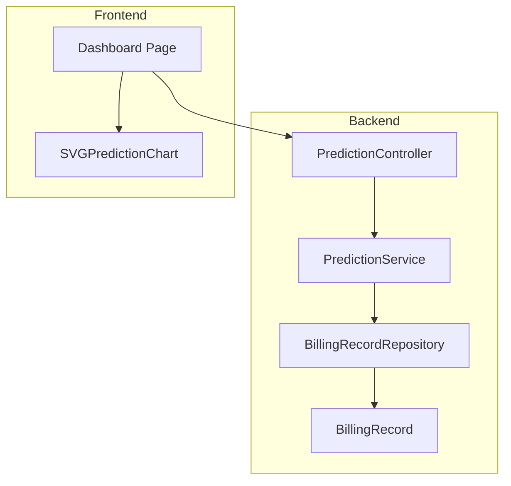
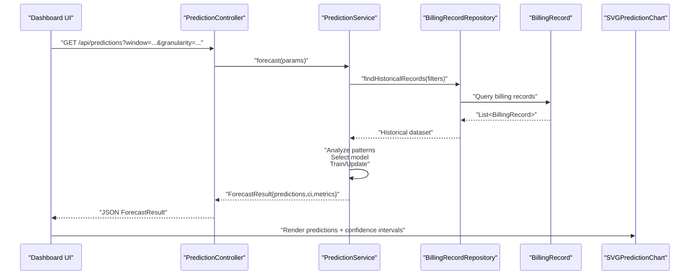
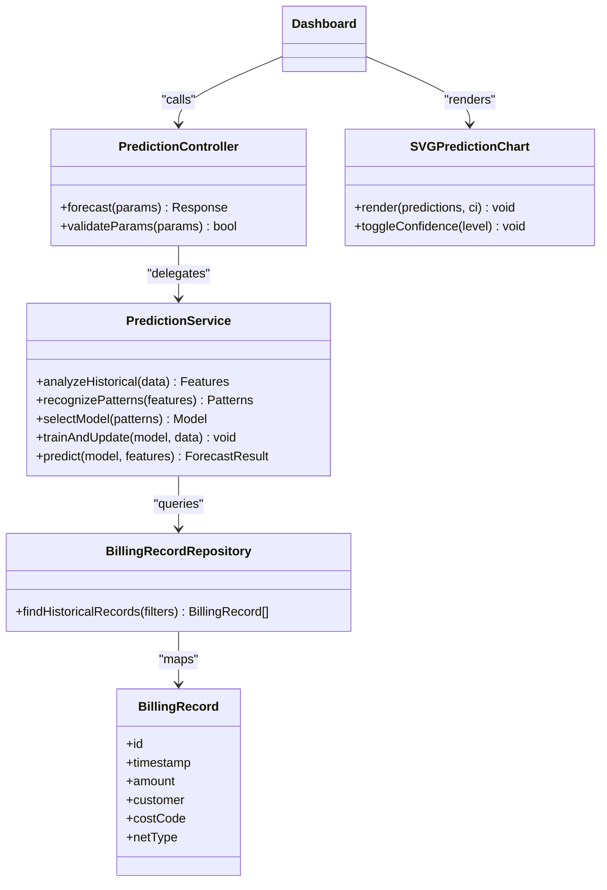

# Predictive Analytics

<cite>
**Referenced Files in This Document**
- [PredictionController.java](file://backend/src/main/java/com/ceb/billing/controllers/PredictionController.java)
- [PredictionService.java](file://backend/src/main/java/com/ceb/billing/services/PredictionService.java)
- [SVGPredictionChart.jsx](file://frontend/src/components/charts/SVGPredictionChart.jsx)
- [Dashboard.jsx](file://frontend/src/pages/Dashboard.jsx)
- [BillingRecord.java](file://backend/src/main/java/com/ceb/billing/entities/BillingRecord.java)
- [BillingRecordRepository.java](file://backend/src/main/java/com/ceb/billing/repositories/BillingRecordRepository.java)
</cite>

## Table of Contents
1. [Introduction](#introduction)
2. [Project Structure](#project-structure)
3. [Core Components](#core-components)
4. [Architecture Overview](#architecture-overview)
5. [Detailed Component Analysis](#detailed-component-analysis)
6. [Dependency Analysis](#dependency-analysis)
7. [Performance Considerations](#performance-considerations)
8. [Troubleshooting Guide](#troubleshooting-guide)
9. [Conclusion](#conclusion)
10. [Appendices](#appendices)

## Introduction
This document explains the predictive analytics capabilities in the CEB Billing System with a focus on billing forecasting and trend analysis. It covers:
- PredictionController endpoints for requesting forecasts and trends
- PredictionService algorithms for historical data analysis, pattern recognition, and forecasting models
- SVGPredictionChart component for visualizing predicted trends and confidence intervals
- Integration points with the dashboard system
- Examples of prediction parameters, accuracy metrics, model training data requirements
- Algorithm selection criteria, performance considerations, and customization options for different billing scenarios

## Project Structure
The predictive analytics feature spans backend controllers, services, repositories, entities, and frontend chart components. The key files are:
- Backend controller exposing REST endpoints for predictions
- Service layer implementing forecasting logic and interacting with billing records
- Frontend chart component rendering predicted series and confidence bands
- Dashboard page integrating the chart into the user interface

**Diagram sources**
- [PredictionController.java](file://backend/src/main/java/com/ceb/billing/controllers/PredictionController.java)
- [PredictionService.java](file://backend/src/main/java/com/ceb/billing/services/PredictionService.java)
- [BillingRecordRepository.java](file://backend/src/main/java/com/ceb/billing/repositories/BillingRecordRepository.java)
- [BillingRecord.java](file://backend/src/main/java/com/ceb/billing/entities/BillingRecord.java)
- [Dashboard.jsx](file://frontend/src/pages/Dashboard.jsx)
- [SVGPredictionChart.jsx](file://frontend/src/components/charts/SVGPredictionChart.jsx)

**Section sources**
- [PredictionController.java](file://backend/src/main/java/com/ceb/billing/controllers/PredictionController.java)
- [PredictionService.java](file://backend/src/main/java/com/ceb/billing/services/PredictionService.java)
- [SVGPredictionChart.jsx](file://frontend/src/components/charts/SVGPredictionChart.jsx)
- [Dashboard.jsx](file://frontend/src/pages/Dashboard.jsx)
- [BillingRecordRepository.java](file://backend/src/main/java/com/ceb/billing/repositories/BillingRecordRepository.java)
- [BillingRecord.java](file://backend/src/main/java/com/ceb/billing/entities/BillingRecord.java)

## Core Components
- PredictionController: Exposes REST endpoints to trigger forecasting and trend analysis based on provided parameters (e.g., time window, granularity). It validates inputs and delegates computation to PredictionService.
- PredictionService: Implements the core algorithms for historical data analysis, pattern recognition, and forecasting. It retrieves billing records, computes features, selects an appropriate model, trains or updates it, and returns predictions with confidence intervals and accuracy metrics.
- SVGPredictionChart: Renders predicted values as a line series with upper and lower bounds representing confidence intervals. It supports interactive controls such as zooming and toggling bands.
- Dashboard integration: The Dashboard page calls PredictionController endpoints and passes results to SVGPredictionChart for visualization.

Key responsibilities:
- Input validation and parameter normalization
- Data retrieval from BillingRecordRepository
- Feature engineering and pattern detection
- Model selection and training/update
- Confidence interval calculation
- Result serialization for frontend consumption
- Rendering predicted trends and uncertainty bands

**Section sources**
- [PredictionController.java](file://backend/src/main/java/com/ceb/billing/controllers/PredictionController.java)
- [PredictionService.java](file://backend/src/main/java/com/ceb/billing/services/PredictionService.java)
- [SVGPredictionChart.jsx](file://frontend/src/components/charts/SVGPredictionChart.jsx)
- [Dashboard.jsx](file://frontend/src/pages/Dashboard.jsx)

## Architecture Overview
The predictive analytics workflow follows a layered architecture:
- Controller layer handles HTTP requests and response formatting
- Service layer encapsulates algorithmic logic and interacts with repositories
- Repository layer abstracts database access to billing records
- Frontend consumes API responses and renders charts

**Diagram sources**
- [PredictionController.java](file://backend/src/main/java/com/ceb/billing/controllers/PredictionController.java)
- [PredictionService.java](file://backend/src/main/java/com/ceb/billing/services/PredictionService.java)
- [BillingRecordRepository.java](file://backend/src/main/java/com/ceb/billing/repositories/BillingRecordRepository.java)
- [BillingRecord.java](file://backend/src/main/java/com/ceb/billing/entities/BillingRecord.java)
- [SVGPredictionChart.jsx](file://frontend/src/components/charts/SVGPredictionChart.jsx)
- [Dashboard.jsx](file://frontend/src/pages/Dashboard.jsx)

## Detailed Component Analysis

### PredictionController Endpoints
Responsibilities:
- Accept prediction requests with parameters such as time window, granularity, customer scope, and scenario flags
- Validate inputs and normalize units
- Delegate to PredictionService and return structured JSON including predictions, confidence intervals, and accuracy metrics
- Handle errors and provide meaningful messages

Typical request parameters:
- window: forecast horizon (e.g., days, weeks, months)
- granularity: aggregation level (daily, weekly, monthly)
- filters: customer IDs, cost codes, net types
- scenario: baseline, optimistic, pessimistic

Response structure:
- predictions: time series of forecasted values
- confidence_intervals: upper and lower bounds per timestamp
- metrics: accuracy measures (e.g., MAE, RMSE, MAPE)
- metadata: model version, training period, feature summary

Error handling:
- Invalid parameters return descriptive error responses
- Insufficient historical data triggers guidance messages
- Internal errors return standardized error payloads

**Section sources**
- [PredictionController.java](file://backend/src/main/java/com/ceb/billing/controllers/PredictionController.java)

### PredictionService Algorithms
Responsibilities:
- Historical data analysis: aggregate billing records by selected granularity, compute rolling statistics, detect seasonality and trends
- Pattern recognition: identify recurring cycles, anomalies, and structural breaks
- Forecasting models: select and train models based on data characteristics; support multiple algorithms
- Confidence intervals: quantify uncertainty using residual analysis or ensemble variance
- Accuracy metrics: compute post-hoc metrics against held-out periods

Algorithm selection criteria:
- Short-term stable series: linear or exponential smoothing
- Seasonal patterns: seasonal decomposition with regression or SARIMA-like approaches
- Nonlinear dynamics: tree-based ensembles or gradient boosting
- Sparse or noisy data: robust estimators and regularization

Training data requirements:
- Minimum number of observations depends on granularity and seasonality
- Consistent timestamps and complete coverage improve reliability
- Outlier treatment and missing value imputation strategies applied before modeling

Customization options:
- Scenario tuning via weights or external regressors
- Adjustable confidence levels (e.g., 80%, 95%)
- Feature engineering toggles (lag features, moving averages, calendar effects)

**Section sources**
- [PredictionService.java](file://backend/src/main/java/com/ceb/billing/services/PredictionService.java)
- [BillingRecordRepository.java](file://backend/src/main/java/com/ceb/billing/repositories/BillingRecordRepository.java)
- [BillingRecord.java](file://backend/src/main/java/com/ceb/billing/entities/BillingRecord.java)

### SVGPredictionChart Visualization
Responsibilities:
- Render predicted series as a line chart
- Display confidence intervals as shaded regions between upper and lower bounds
- Support interactive controls: zoom, pan, toggle bands, adjust confidence level
- Provide tooltips with timestamp, predicted value, and interval bounds

Input data contract:
- Time axis labels
- Predicted values array
- Upper bound array
- Lower bound array
- Optional metadata (model version, metrics)

Rendering behavior:
- Smooth interpolation for readability
- Responsive scaling across devices
- Accessibility-friendly labels and legends

**Section sources**
- [SVGPredictionChart.jsx](file://frontend/src/components/charts/SVGPredictionChart.jsx)

### Dashboard Integration
Responsibilities:
- Call PredictionController endpoints with user-selected parameters
- Parse JSON responses and pass structured data to SVGPredictionChart
- Update UI state and display accuracy metrics alongside the chart
- Handle loading states and error notifications

User flow:
- Select forecast window and granularity
- Trigger prediction request
- Receive results and render chart
- Adjust confidence level or scenario and re-render

**Section sources**
- [Dashboard.jsx](file://frontend/src/pages/Dashboard.jsx)
- [PredictionController.java](file://backend/src/main/java/com/ceb/billing/controllers/PredictionController.java)
- [SVGPredictionChart.jsx](file://frontend/src/components/charts/SVGPredictionChart.jsx)

## Dependency Analysis
Component relationships and coupling:
- PredictionController depends on PredictionService for all forecasting logic
- PredictionService depends on BillingRecordRepository for data access
- BillingRecordRepository maps to BillingRecord entity for schema alignment
- Dashboard integrates with PredictionController and SVGPredictionChart for end-to-end UX

Potential circular dependencies:
- None observed; clear separation between controller, service, repository, and frontend layers

External dependencies:
- Database-backed storage via JPA repositories
- Frontend SVG rendering library used by SVGPredictionChart

**Diagram sources**
- [PredictionController.java](file://backend/src/main/java/com/ceb/billing/controllers/PredictionController.java)
- [PredictionService.java](file://backend/src/main/java/com/ceb/billing/services/PredictionService.java)
- [BillingRecordRepository.java](file://backend/src/main/java/com/ceb/billing/repositories/BillingRecordRepository.java)
- [BillingRecord.java](file://backend/src/main/java/com/ceb/billing/entities/BillingRecord.java)
- [SVGPredictionChart.jsx](file://frontend/src/components/charts/SVGPredictionChart.jsx)
- [Dashboard.jsx](file://frontend/src/pages/Dashboard.jsx)

**Section sources**
- [PredictionController.java](file://backend/src/main/java/com/ceb/billing/controllers/PredictionController.java)
- [PredictionService.java](file://backend/src/main/java/com/ceb/billing/services/PredictionService.java)
- [BillingRecordRepository.java](file://backend/src/main/java/com/ceb/billing/repositories/BillingRecordRepository.java)
- [BillingRecord.java](file://backend/src/main/java/com/ceb/billing/entities/BillingRecord.java)
- [SVGPredictionChart.jsx](file://frontend/src/components/charts/SVGPredictionChart.jsx)
- [Dashboard.jsx](file://frontend/src/pages/Dashboard.jsx)

## Performance Considerations
- Data volume: Large historical datasets may require pagination or pre-aggregation to reduce query times
- Model training frequency: Incremental updates or scheduled retraining can balance freshness and cost
- Feature computation: Cache derived features when possible to avoid recomputation
- Confidence interval calculation: Use efficient statistical methods; consider approximations for large horizons
- Frontend rendering: Limit point density for smooth interactions; use decimation techniques for very long series
- Concurrency: Ensure thread-safe operations in PredictionService if serving concurrent requests

[No sources needed since this section provides general guidance]

## Troubleshooting Guide
Common issues and resolutions:
- Insufficient historical data: Increase window size or reduce granularity; ensure consistent timestamps
- Missing values: Apply imputation strategies or exclude incomplete periods
- Outliers: Detect and treat anomalies before modeling to prevent bias
- Parameter validation errors: Review input constraints and normalize units
- Rendering problems: Verify data shape matches chart expectations; check confidence interval arrays length

Diagnostic steps:
- Check controller logs for request parsing errors
- Inspect service logs for model selection and training outcomes
- Validate repository queries and returned record counts
- Confirm frontend data contracts and chart configuration

**Section sources**
- [PredictionController.java](file://backend/src/main/java/com/ceb/billing/controllers/PredictionController.java)
- [PredictionService.java](file://backend/src/main/java/com/ceb/billing/services/PredictionService.java)
- [SVGPredictionChart.jsx](file://frontend/src/components/charts/SVGPredictionChart.jsx)

## Conclusion
The predictive analytics module provides a cohesive pipeline from data retrieval to visualization:
- PredictionController standardizes API interactions and parameter handling
- PredictionService implements robust algorithms for analysis, pattern recognition, and forecasting
- SVGPredictionChart delivers clear visualizations of predictions and uncertainty
- Dashboard integration ensures a seamless user experience

By following the outlined best practices and customization options, teams can tailor forecasting to diverse billing scenarios while maintaining performance and accuracy.

[No sources needed since this section summarizes without analyzing specific files]

## Appendices

### Example Prediction Parameters
- window: forecast horizon (days/weeks/months)
- granularity: daily/weekly/monthly
- filters: customer IDs, cost codes, net types
- scenario: baseline/optimistic/pessimistic
- confidence_level: 80% or 95%

### Accuracy Metrics
- Mean Absolute Error (MAE)
- Root Mean Squared Error (RMSE)
- Mean Absolute Percentage Error (MAPE)

### Model Training Data Requirements
- Minimum observation count aligned with seasonality and granularity
- Complete time coverage with minimal gaps
- Cleaned and normalized billing amounts
- Representative distribution across customers and cost codes

### Customization Options
- Scenario-specific weights or external regressors
- Adjustable confidence levels
- Feature engineering toggles (lags, rolling stats, calendar effects)
- Model selection hints based on domain knowledge

[No sources needed since this section provides general guidance]