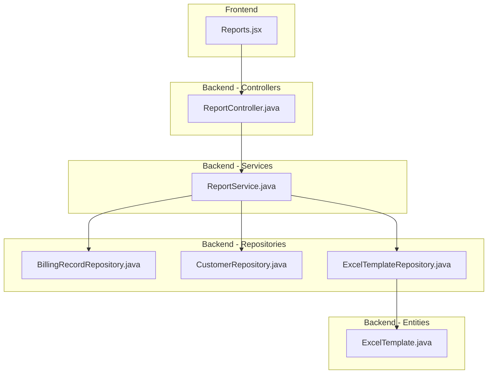
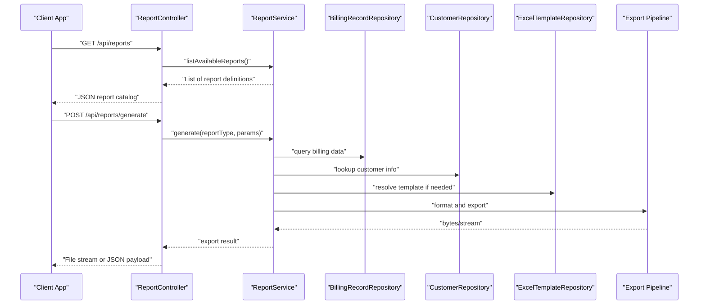
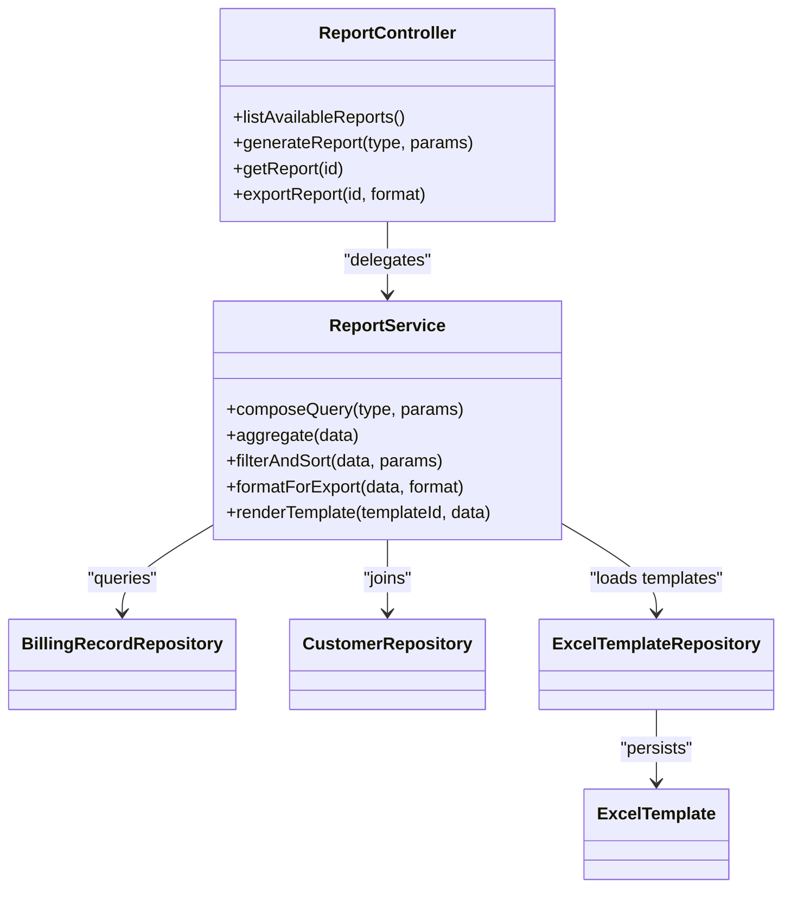
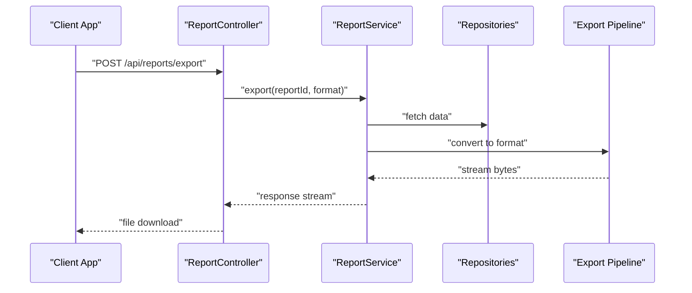

# Report Generation

<cite>
**Referenced Files in This Document**
- [ReportController.java](file://backend/src/main/java/com/ceb/billing/controllers/ReportController.java)
- [ReportService.java](file://backend/src/main/java/com/ceb/billing/services/ReportService.java)
- [BillingRecordRepository.java](file://backend/src/main/java/com/ceb/billing/repositories/BillingRecordRepository.java)
- [CustomerRepository.java](file://backend/src/main/java/com/ceb/billing/repositories/CustomerRepository.java)
- [ExcelTemplate.java](file://backend/src/main/java/com/ceb/billing/entities/ExcelTemplate.java)
- [ExcelTemplateRepository.java](file://backend/src/main/java/com/ceb/billing/repositories/ExcelTemplateRepository.java)
- [Reports.jsx](file://frontend/src/pages/Reports.jsx)
</cite>

## Table of Contents
1. [Introduction](#introduction)
2. [Project Structure](#project-structure)
3. [Core Components](#core-components)
4. [Architecture Overview](#architecture-overview)
5. [Detailed Component Analysis](#detailed-component-analysis)
6. [Dependency Analysis](#dependency-analysis)
7. [Performance Considerations](#performance-considerations)
8. [Troubleshooting Guide](#troubleshooting-guide)
9. [Conclusion](#conclusion)
10. [Appendices](#appendices)

## Introduction
This document explains the report generation system in the CEB Billing System with a focus on:
- The ReportController API endpoints for creating, retrieving, and exporting reports
- The ReportService business logic for data aggregation, filtering, sorting, and formatting
- Supported report types and export formats (PDF, Excel, CSV)
- Template-based report generation using Excel templates
- Examples for custom report creation, parameterized queries, scheduled generation, and performance optimization for large datasets
- Strategies for caching, pagination, and memory management

The goal is to provide both high-level understanding and actionable guidance for developers extending or operating the reporting subsystem.

## Project Structure
The reporting feature spans backend controllers, services, repositories, entities, and a frontend page that consumes the APIs.

**Diagram sources**
- [ReportController.java](file://backend/src/main/java/com/ceb/billing/controllers/ReportController.java)
- [ReportService.java](file://backend/src/main/java/com/ceb/billing/services/ReportService.java)
- [BillingRecordRepository.java](file://backend/src/main/java/com/ceb/billing/repositories/BillingRecordRepository.java)
- [CustomerRepository.java](file://backend/src/main/java/com/ceb/billing/repositories/CustomerRepository.java)
- [ExcelTemplateRepository.java](file://backend/src/main/java/com/ceb/billing/repositories/ExcelTemplateRepository.java)
- [ExcelTemplate.java](file://backend/src/main/java/com/ceb/billing/entities/ExcelTemplate.java)
- [Reports.jsx](file://frontend/src/pages/Reports.jsx)

**Section sources**
- [ReportController.java](file://backend/src/main/java/com/ceb/billing/controllers/ReportController.java)
- [ReportService.java](file://backend/src/main/java/com/ceb/billing/services/ReportService.java)
- [BillingRecordRepository.java](file://backend/src/main/java/com/ceb/billing/repositories/BillingRecordRepository.java)
- [CustomerRepository.java](file://backend/src/main/java/com/ceb/billing/repositories/CustomerRepository.java)
- [ExcelTemplateRepository.java](file://backend/src/main/java/com/ceb/billing/repositories/ExcelTemplateRepository.java)
- [ExcelTemplate.java](file://backend/src/main/java/com/ceb/billing/entities/ExcelTemplate.java)
- [Reports.jsx](file://frontend/src/pages/Reports.jsx)

## Core Components
- ReportController: Exposes REST endpoints for listing available reports, generating reports, retrieving generated reports, and exporting them in various formats. It validates inputs, delegates processing to ReportService, and returns responses or streams for exports.
- ReportService: Implements core business logic including query composition, data aggregation, filtering, sorting, formatting, and orchestration of template-based generation and export pipelines.
- Repositories: Provide data access to billing records, customers, and Excel templates used by ReportService.
- ExcelTemplate entity and repository: Support template-driven report generation where templates define layout and placeholders.
- Frontend Reports page: Provides UI for selecting report types, parameters, and triggering generation/export.

Key responsibilities:
- Input validation and parameter binding at the controller layer
- Business rules and data transformations in the service layer
- Data retrieval via Spring Data JPA repositories
- Export pipeline coordination (PDF, Excel, CSV)
- Template resolution and rendering for Excel-based reports

**Section sources**
- [ReportController.java](file://backend/src/main/java/com/ceb/billing/controllers/ReportController.java)
- [ReportService.java](file://backend/src/main/java/com/ceb/billing/services/ReportService.java)
- [BillingRecordRepository.java](file://backend/src/main/java/com/ceb/billing/repositories/BillingRecordRepository.java)
- [CustomerRepository.java](file://backend/src/main/java/com/ceb/billing/repositories/CustomerRepository.java)
- [ExcelTemplateRepository.java](file://backend/src/main/java/com/ceb/billing/repositories/ExcelTemplateRepository.java)
- [ExcelTemplate.java](file://backend/src/main/java/com/ceb/billing/entities/ExcelTemplate.java)
- [Reports.jsx](file://frontend/src/pages/Reports.jsx)

## Architecture Overview
The reporting architecture follows a layered approach:
- Controller layer handles HTTP requests, parameter parsing, and response serialization
- Service layer encapsulates business logic, query building, aggregation, and export orchestration
- Repository layer abstracts database access
- Entity layer models persistent structures such as Excel templates
- Frontend integrates with controller endpoints to drive user workflows

**Diagram sources**
- [ReportController.java](file://backend/src/main/java/com/ceb/billing/controllers/ReportController.java)
- [ReportService.java](file://backend/src/main/java/com/ceb/billing/services/ReportService.java)
- [BillingRecordRepository.java](file://backend/src/main/java/com/ceb/billing/repositories/BillingRecordRepository.java)
- [CustomerRepository.java](file://backend/src/main/java/com/ceb/billing/repositories/CustomerRepository.java)
- [ExcelTemplateRepository.java](file://backend/src/main/java/com/ceb/billing/repositories/ExcelTemplateRepository.java)

## Detailed Component Analysis

### ReportController Endpoints
Responsibilities:
- Define REST endpoints for report operations
- Validate request parameters and body content
- Delegate to ReportService for execution
- Return structured JSON for metadata and list endpoints
- Stream file exports for PDF, Excel, and CSV responses

Typical endpoint categories:
- List available reports and their parameters
- Generate a report with provided parameters
- Retrieve previously generated report metadata or results
- Export a report in selected format (PDF, Excel, CSV)

Input handling:
- Query parameters for filters (date ranges, customer IDs, cost codes)
- Request body for complex report configurations
- Path variables for report identifiers

Output handling:
- JSON payloads for catalog and status
- Binary streams for exported files with appropriate Content-Type headers

Error handling:
- Validation errors returned as structured responses
- Business exceptions mapped to appropriate HTTP status codes
- Graceful fallbacks when templates are missing or data is incomplete

**Section sources**
- [ReportController.java](file://backend/src/main/java/com/ceb/billing/controllers/ReportController.java)

### ReportService Business Logic
Responsibilities:
- Resolve report type and configuration
- Compose parameterized queries against repositories
- Aggregate and transform data into report-ready structures
- Apply filtering, grouping, and sorting rules
- Format output for different export targets
- Orchestrate template-based generation for Excel reports

Data aggregation:
- Combine billing records with customer details
- Compute summary metrics (totals, averages, counts)
- Group by dimensions (customer, date range, cost code)

Filtering and sorting:
- Date range filters
- Customer and account filters
- Cost code and net type filters
- Sorting by multiple fields with direction control

Formatting:
- Numeric formatting and currency display
- Date localization and timezone handling
- Column mapping and header customization

Template-based generation:
- Load ExcelTemplate from repository
- Populate placeholders with aggregated data
- Render sheets and charts based on template configuration

Export pipeline:
- Convert formatted data to PDF, Excel, or CSV
- Stream large outputs to avoid excessive memory usage
- Attach metadata and audit information to exports

**Section sources**
- [ReportService.java](file://backend/src/main/java/com/ceb/billing/services/ReportService.java)
- [BillingRecordRepository.java](file://backend/src/main/java/com/ceb/billing/repositories/BillingRecordRepository.java)
- [CustomerRepository.java](file://backend/src/main/java/com/ceb/billing/repositories/CustomerRepository.java)
- [ExcelTemplateRepository.java](file://backend/src/main/java/com/ceb/billing/repositories/ExcelTemplateRepository.java)
- [ExcelTemplate.java](file://backend/src/main/java/com/ceb/billing/entities/ExcelTemplate.java)

### Supported Report Types
Common report types include:
- Billing summary by customer
- Monthly billing trends
- Cost code breakdown
- Net type distribution
- Custom ad-hoc reports defined via parameters

Each report type defines:
- Required and optional parameters
- Aggregation rules and groupings
- Default sort order and pagination behavior
- Preferred export formats

**Section sources**
- [ReportService.java](file://backend/src/main/java/com/ceb/billing/services/ReportService.java)

### Export Formats
Supported formats:
- PDF: Paginated, styled documents suitable for printing and sharing
- Excel: Tabular data with optional multi-sheet layouts and formulas
- CSV: Lightweight, delimiter-separated values for downstream processing

Export considerations:
- Streaming for large datasets to reduce memory footprint
- Header and footer metadata inclusion
- Locale-aware number and date formatting

**Section sources**
- [ReportService.java](file://backend/src/main/java/com/ceb/billing/services/ReportService.java)

### Template-Based Report Generation
Templates:
- ExcelTemplate entity stores template metadata and content references
- ExcelTemplateRepository provides lookup and persistence
- Templates define sheet structure, placeholders, and chart bindings

Generation flow:
- Resolve template by report type or explicit ID
- Populate placeholders with aggregated data
- Render dynamic elements (tables, charts)
- Produce final Excel workbook for export

**Section sources**
- [ExcelTemplate.java](file://backend/src/main/java/com/ceb/billing/entities/ExcelTemplate.java)
- [ExcelTemplateRepository.java](file://backend/src/main/java/com/ceb/billing/repositories/ExcelTemplateRepository.java)
- [ReportService.java](file://backend/src/main/java/com/ceb/billing/services/ReportService.java)

### Custom Report Creation
Steps:
- Define a new report type with parameters and aggregation rules
- Implement query composition and data transformation in ReportService
- Add controller endpoints if additional operations are required
- Create an ExcelTemplate for visual presentation (optional)
- Update frontend Reports page to expose the new report

Parameterized queries:
- Use repository methods with typed parameters
- Build dynamic WHERE clauses based on provided filters
- Ensure safe parameter binding to prevent injection

**Section sources**
- [ReportService.java](file://backend/src/main/java/com/ceb/billing/services/ReportService.java)
- [BillingRecordRepository.java](file://backend/src/main/java/com/ceb/billing/repositories/BillingRecordRepository.java)
- [CustomerRepository.java](file://backend/src/main/java/com/ceb/billing/repositories/CustomerRepository.java)
- [ExcelTemplate.java](file://backend/src/main/java/com/ceb/billing/entities/ExcelTemplate.java)
- [Reports.jsx](file://frontend/src/pages/Reports.jsx)

### Scheduled Report Generation
Approach:
- Integrate a scheduler to trigger ReportService.generate periodically
- Persist generated report metadata and storage location
- Notify users or integrate with email/notification systems
- Manage concurrency and retry policies for reliability

Considerations:
- Avoid overlapping executions for the same report parameters
- Archive older exports to manage storage
- Monitor job durations and resource consumption

[No sources needed since this section provides general guidance]

### Performance Optimization for Large Datasets
Strategies:
- Use streaming exports to minimize memory usage
- Apply server-side pagination for preview endpoints
- Optimize queries with selective columns and indexes
- Pre-aggregate frequently accessed metrics in materialized views
- Cache static or slowly changing reference data (e.g., customers)

[No sources needed since this section provides general guidance]

### Report Caching
Caching layers:
- In-memory cache for report catalogs and template metadata
- Result cache keyed by report type and normalized parameters
- TTL-based invalidation for time-sensitive reports

Cache keys:
- Include report type, filter parameters, sort options, and locale settings
- Normalize parameter ordering to ensure consistent keys

Invalidation:
- Invalidate caches on data mutations affecting report sources
- Periodic refresh for long-lived caches

**Section sources**
- [ReportService.java](file://backend/src/main/java/com/ceb/billing/services/ReportService.java)

### Pagination Strategies
Pagination approaches:
- Offset-based pagination for simple lists
- Keyset pagination for efficient deep paging
- Cursor-based pagination for real-time feeds

Implementation tips:
- Limit default page sizes and enforce maximum bounds
- Provide total counts only when feasible; otherwise use presence indicators
- Combine pagination with server-side filtering and sorting

**Section sources**
- [ReportService.java](file://backend/src/main/java/com/ceb/billing/services/ReportService.java)

### Memory Management for Complex Reports
Techniques:
- Stream rows instead of loading entire result sets
- Process data in chunks and flush intermediate results
- Reuse objects and avoid unnecessary copies
- Release resources promptly after export completion

**Section sources**
- [ReportService.java](file://backend/src/main/java/com/ceb/billing/services/ReportService.java)

## Dependency Analysis
The reporting subsystem depends on repositories for data access and may rely on external libraries for PDF and Excel generation. The following diagram highlights key dependencies among components.

**Diagram sources**
- [ReportController.java](file://backend/src/main/java/com/ceb/billing/controllers/ReportController.java)
- [ReportService.java](file://backend/src/main/java/com/ceb/billing/services/ReportService.java)
- [BillingRecordRepository.java](file://backend/src/main/java/com/ceb/billing/repositories/BillingRecordRepository.java)
- [CustomerRepository.java](file://backend/src/main/java/com/ceb/billing/repositories/CustomerRepository.java)
- [ExcelTemplateRepository.java](file://backend/src/main/java/com/ceb/billing/repositories/ExcelTemplateRepository.java)
- [ExcelTemplate.java](file://backend/src/main/java/com/ceb/billing/entities/ExcelTemplate.java)

**Section sources**
- [ReportController.java](file://backend/src/main/java/com/ceb/billing/controllers/ReportController.java)
- [ReportService.java](file://backend/src/main/java/com/ceb/billing/services/ReportService.java)
- [BillingRecordRepository.java](file://backend/src/main/java/com/ceb/billing/repositories/BillingRecordRepository.java)
- [CustomerRepository.java](file://backend/src/main/java/com/ceb/billing/repositories/CustomerRepository.java)
- [ExcelTemplateRepository.java](file://backend/src/main/java/com/ceb/billing/repositories/ExcelTemplateRepository.java)
- [ExcelTemplate.java](file://backend/src/main/java/com/ceb/billing/entities/ExcelTemplate.java)

## Performance Considerations
- Prefer streaming exports for large datasets to avoid out-of-memory errors
- Use targeted column selection and indexed filters to reduce query times
- Cache reference data and report catalogs to minimize repeated lookups
- Implement pagination for preview endpoints and limit default page sizes
- Monitor and tune JVM heap size and GC behavior under heavy export loads
- Consider asynchronous generation for very large reports with progress tracking

[No sources needed since this section provides general guidance]

## Troubleshooting Guide
Common issues and resolutions:
- Missing templates: Ensure ExcelTemplate entries exist for requested report types
- Parameter validation failures: Verify required parameters and value constraints
- Slow queries: Review indexes and query plans; add selective filters
- Memory pressure during export: Switch to streaming mode and chunked processing
- Export format errors: Validate library versions and supported features

Operational checks:
- Inspect logs around ReportService calls for stack traces
- Validate repository method signatures match expected parameters
- Confirm Content-Type headers for exported files

**Section sources**
- [ReportService.java](file://backend/src/main/java/com/ceb/billing/services/ReportService.java)
- [ExcelTemplateRepository.java](file://backend/src/main/java/com/ceb/billing/repositories/ExcelTemplateRepository.java)

## Conclusion
The CEB Billing System’s report generation combines a clear controller-service-repository architecture with flexible template support and multiple export formats. By applying caching, pagination, and streaming strategies, the system can efficiently handle large datasets while providing a responsive user experience. Extensibility is straightforward through new report types, parameterized queries, and template definitions.

[No sources needed since this section summarizes without analyzing specific files]

## Appendices

### Example Workflows

#### Creating a Custom Report
- Define report parameters and aggregation rules in ReportService
- Implement repository queries with typed parameters
- Add controller endpoints if necessary
- Create an ExcelTemplate for visualization
- Update frontend Reports page to expose the new report

**Section sources**
- [ReportService.java](file://backend/src/main/java/com/ceb/billing/services/ReportService.java)
- [BillingRecordRepository.java](file://backend/src/main/java/com/ceb/billing/repositories/BillingRecordRepository.java)
- [ExcelTemplate.java](file://backend/src/main/java/com/ceb/billing/entities/ExcelTemplate.java)
- [Reports.jsx](file://frontend/src/pages/Reports.jsx)

#### Parameterized Queries
- Use repository methods with explicit parameters
- Build dynamic filters safely
- Validate and normalize input before querying

**Section sources**
- [ReportService.java](file://backend/src/main/java/com/ceb/billing/services/ReportService.java)
- [BillingRecordRepository.java](file://backend/src/main/java/com/ceb/billing/repositories/BillingRecordRepository.java)

#### Scheduled Report Generation
- Schedule periodic jobs to generate reports
- Persist metadata and export artifacts
- Handle retries and notifications

[No sources needed since this section provides general guidance]

#### Export Flow Sequence

**Diagram sources**
- [ReportController.java](file://backend/src/main/java/com/ceb/billing/controllers/ReportController.java)
- [ReportService.java](file://backend/src/main/java/com/ceb/billing/services/ReportService.java)