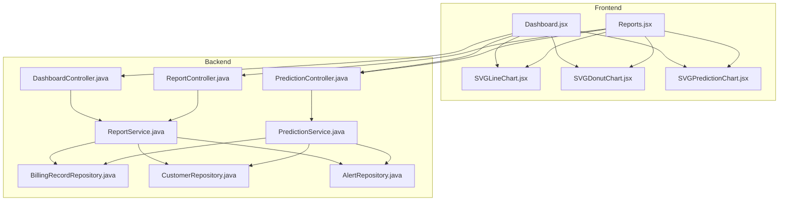
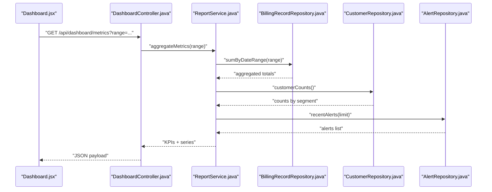
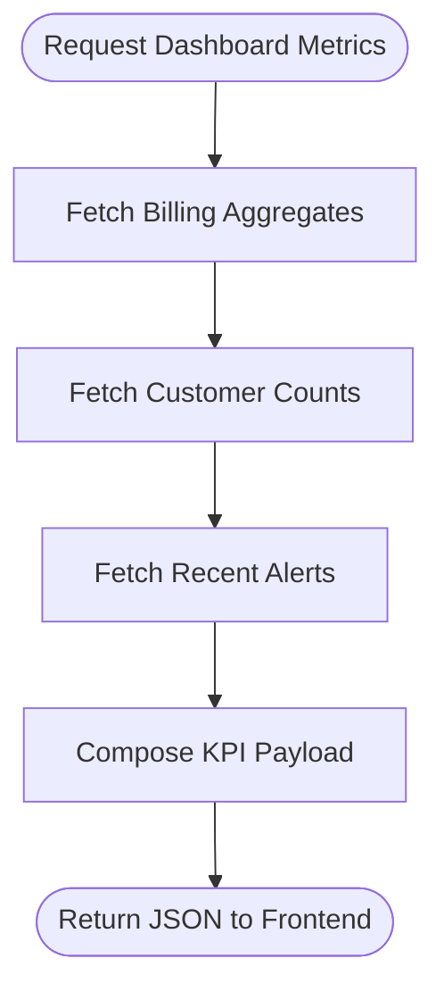
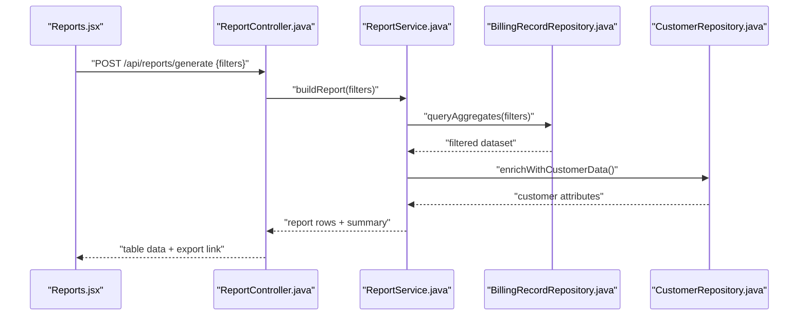
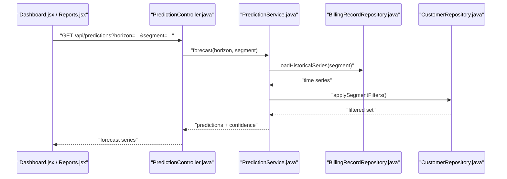
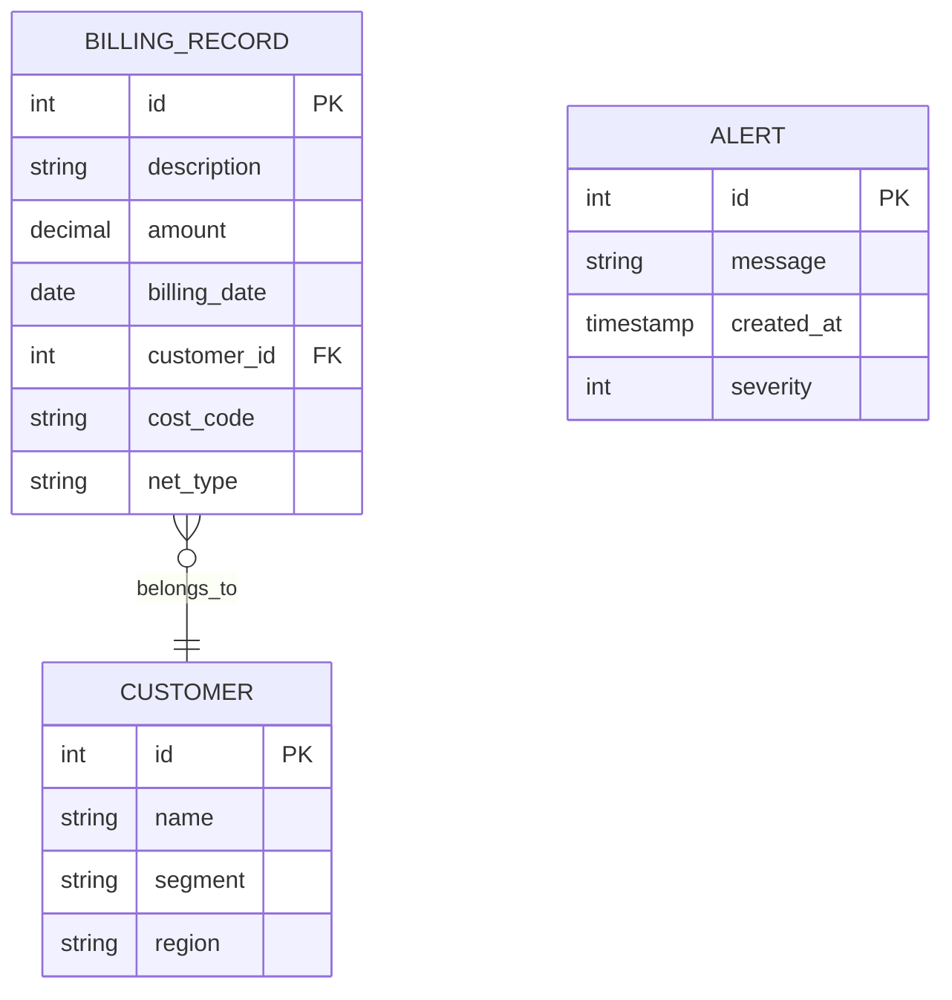
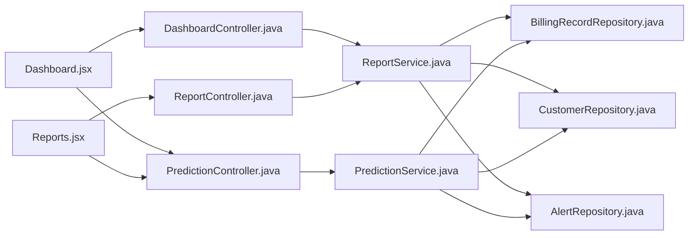

# Reporting and Analytics

<cite>
**Referenced Files in This Document**
- [DashboardController.java](file://backend/src/main/java/com/ceb/billing/controllers/DashboardController.java)
- [ReportController.java](file://backend/src/main/java/com/ceb/billing/controllers/ReportController.java)
- [PredictionController.java](file://backend/src/main/java/com/ceb/billing/controllers/PredictionController.java)
- [ReportService.java](file://backend/src/main/java/com/ceb/billing/services/ReportService.java)
- [PredictionService.java](file://backend/src/main/java/com/ceb/billing/services/PredictionService.java)
- [BillingRecordRepository.java](file://backend/src/main/java/com/ceb/billing/repositories/BillingRecordRepository.java)
- [CustomerRepository.java](file://backend/src/main/java/com/ceb/billing/repositories/CustomerRepository.java)
- [AlertRepository.java](file://backend/src/main/java/com/ceb/billing/repositories/AlertRepository.java)
- [BillingRecord.java](file://backend/src/main/java/com/ceb/billing/entities/BillingRecord.java)
- [Customer.java](file://backend/src/main/java/com/ceb/billing/entities/Customer.java)
- [Alert.java](file://backend/src/main/java/com/ceb/billing/entities/Alert.java)
- [Dashboard.jsx](file://frontend/src/pages/Dashboard.jsx)
- [Reports.jsx](file://frontend/src/pages/Reports.jsx)
- [SVGLineChart.jsx](file://frontend/src/components/charts/SVGLineChart.jsx)
- [SVGDonutChart.jsx](file://frontend/src/components/charts/SVGDonutChart.jsx)
- [SVGPredictionChart.jsx](file://frontend/src/components/charts/SVGPredictionChart.jsx)
</cite>

## Table of Contents
1. [Introduction](#introduction)
2. [Project Structure](#project-structure)
3. [Core Components](#core-components)
4. [Architecture Overview](#architecture-overview)
5. [Detailed Component Analysis](#detailed-component-analysis)
6. [Dependency Analysis](#dependency-analysis)
7. [Performance Considerations](#performance-considerations)
8. [Troubleshooting Guide](#troubleshooting-guide)
9. [Conclusion](#conclusion)
10. [Appendices](#appendices)

## Introduction
This document explains the reporting and analytics capabilities of the CEB Billing System, focusing on:
- Dashboard system with real-time metrics display, interactive charts, and KPI tracking
- Custom report generation, export capabilities, and trend analysis
- Prediction algorithms for billing forecasting
- Data aggregation strategies and performance optimization techniques
- Examples of available reports, chart configurations, and customization options

The backend is a Spring Boot application exposing REST endpoints for dashboard, reporting, and prediction features. The frontend provides React-based dashboards and custom reports pages with SVG-based charts.

## Project Structure
Reporting and analytics span both backend and frontend layers:
- Backend controllers expose APIs for dashboard metrics, report queries, and predictions
- Services implement business logic, data aggregation, and forecasting
- Repositories access billing, customer, and alert data
- Frontend pages render dashboards and reports; chart components visualize data

**Diagram sources**
- [DashboardController.java](file://backend/src/main/java/com/ceb/billing/controllers/DashboardController.java)
- [ReportController.java](file://backend/src/main/java/com/ceb/billing/controllers/ReportController.java)
- [PredictionController.java](file://backend/src/main/java/com/ceb/billing/controllers/PredictionController.java)
- [ReportService.java](file://backend/src/main/java/com/ceb/billing/services/ReportService.java)
- [PredictionService.java](file://backend/src/main/java/com/ceb/billing/services/PredictionService.java)
- [BillingRecordRepository.java](file://backend/src/main/java/com/ceb/billing/repositories/BillingRecordRepository.java)
- [CustomerRepository.java](file://backend/src/main/java/com/ceb/billing/repositories/CustomerRepository.java)
- [AlertRepository.java](file://backend/src/main/java/com/ceb/billing/repositories/AlertRepository.java)
- [Dashboard.jsx](file://frontend/src/pages/Dashboard.jsx)
- [Reports.jsx](file://frontend/src/pages/Reports.jsx)
- [SVGLineChart.jsx](file://frontend/src/components/charts/SVGLineChart.jsx)
- [SVGDonutChart.jsx](file://frontend/src/components/charts/SVGDonutChart.jsx)
- [SVGPredictionChart.jsx](file://frontend/src/components/charts/SVGPredictionChart.jsx)

**Section sources**
- [DashboardController.java](file://backend/src/main/java/com/ceb/billing/controllers/DashboardController.java)
- [ReportController.java](file://backend/src/main/java/com/ceb/billing/controllers/ReportController.java)
- [PredictionController.java](file://backend/src/main/java/com/ceb/billing/controllers/PredictionController.java)
- [ReportService.java](file://backend/src/main/java/com/ceb/billing/services/ReportService.java)
- [PredictionService.java](file://backend/src/main/java/com/ceb/billing/services/PredictionService.java)
- [Dashboard.jsx](file://frontend/src/pages/Dashboard.jsx)
- [Reports.jsx](file://frontend/src/pages/Reports.jsx)
- [SVGLineChart.jsx](file://frontend/src/components/charts/SVGLineChart.jsx)
- [SVGDonutChart.jsx](file://frontend/src/components/charts/SVGDonutChart.jsx)
- [SVGPredictionChart.jsx](file://frontend/src/components/charts/SVGPredictionChart.jsx)

## Core Components
- Dashboard API layer: Provides aggregated KPIs, time-series metrics, and alerts for the dashboard view
- Report API layer: Supports filtering, grouping, and exporting of billing and customer data
- Prediction API layer: Exposes forecasting endpoints using historical billing data
- Services: Implement aggregation, filtering, and forecasting logic
- Repositories: Provide efficient data access to billing records, customers, and alerts
- Frontend pages: Render KPIs, charts, and report tables with interactive controls
- Chart components: Lightweight SVG-based visualizations for line, donut, and prediction series

Key responsibilities:
- Real-time or near-real-time metric updates via periodic polling or refresh actions
- Flexible report filters (date range, customer, cost code, net type)
- Export formats for generated reports
- Forecasting outputs with confidence bands and trend indicators

**Section sources**
- [DashboardController.java](file://backend/src/main/java/com/ceb/billing/controllers/DashboardController.java)
- [ReportController.java](file://backend/src/main/java/com/ceb/billing/controllers/ReportController.java)
- [PredictionController.java](file://backend/src/main/java/com/ceb/billing/controllers/PredictionController.java)
- [ReportService.java](file://backend/src/main/java/com/ceb/billing/services/ReportService.java)
- [PredictionService.java](file://backend/src/main/java/com/ceb/billing/services/PredictionService.java)
- [Dashboard.jsx](file://frontend/src/pages/Dashboard.jsx)
- [Reports.jsx](file://frontend/src/pages/Reports.jsx)

## Architecture Overview
The reporting and analytics architecture follows a layered design:
- Controllers handle HTTP requests and responses
- Services orchestrate data aggregation and forecasting
- Repositories query the database efficiently
- Frontend pages consume APIs and render charts

**Diagram sources**
- [DashboardController.java](file://backend/src/main/java/com/ceb/billing/controllers/DashboardController.java)
- [ReportService.java](file://backend/src/main/java/com/ceb/billing/services/ReportService.java)
- [BillingRecordRepository.java](file://backend/src/main/java/com/ceb/billing/repositories/BillingRecordRepository.java)
- [CustomerRepository.java](file://backend/src/main/java/com/ceb/billing/repositories/CustomerRepository.java)
- [AlertRepository.java](file://backend/src/main/java/com/ceb/billing/repositories/AlertRepository.java)
- [Dashboard.jsx](file://frontend/src/pages/Dashboard.jsx)

## Detailed Component Analysis

### Dashboard Metrics and KPIs
- Purpose: Provide real-time KPIs such as total billed amount, number of invoices, average bill value, and alert counts
- Data flow: Controller aggregates metrics via service, which queries repositories for billing sums, customer counts, and recent alerts
- Visualization: Frontend renders KPI cards and time-series charts

**Diagram sources**
- [DashboardController.java](file://backend/src/main/java/com/ceb/billing/controllers/DashboardController.java)
- [ReportService.java](file://backend/src/main/java/com/ceb/billing/services/ReportService.java)
- [BillingRecordRepository.java](file://backend/src/main/java/com/ceb/billing/repositories/BillingRecordRepository.java)
- [CustomerRepository.java](file://backend/src/main/java/com/ceb/billing/repositories/CustomerRepository.java)
- [AlertRepository.java](file://backend/src/main/java/com/ceb/billing/repositories/AlertRepository.java)

**Section sources**
- [DashboardController.java](file://backend/src/main/java/com/ceb/billing/controllers/DashboardController.java)
- [ReportService.java](file://backend/src/main/java/com/ceb/billing/services/ReportService.java)
- [BillingRecordRepository.java](file://backend/src/main/java/com/ceb/billing/repositories/BillingRecordRepository.java)
- [CustomerRepository.java](file://backend/src/main/java/com/ceb/billing/repositories/CustomerRepository.java)
- [AlertRepository.java](file://backend/src/main/java/com/ceb/billing/repositories/AlertRepository.java)
- [Dashboard.jsx](file://frontend/src/pages/Dashboard.jsx)

### Custom Reports and Trend Analysis
- Purpose: Generate ad-hoc reports with filters (date range, customer, cost code, net type), groupings, and exports
- Features:
  - Filtering and grouping by multiple dimensions
  - Time-series trend lines for revenue and volume
  - Export to CSV/Excel where supported
- Implementation: Report controller accepts filter parameters, delegates to report service, which uses repositories to aggregate and return results

**Diagram sources**
- [ReportController.java](file://backend/src/main/java/com/ceb/billing/controllers/ReportController.java)
- [ReportService.java](file://backend/src/main/java/com/ceb/billing/services/ReportService.java)
- [BillingRecordRepository.java](file://backend/src/main/java/com/ceb/billing/repositories/BillingRecordRepository.java)
- [CustomerRepository.java](file://backend/src/main/java/com/ceb/billing/repositories/CustomerRepository.java)
- [Reports.jsx](file://frontend/src/pages/Reports.jsx)

**Section sources**
- [ReportController.java](file://backend/src/main/java/com/ceb/billing/controllers/ReportController.java)
- [ReportService.java](file://backend/src/main/java/com/ceb/billing/services/ReportService.java)
- [BillingRecordRepository.java](file://backend/src/main/java/com/ceb/billing/repositories/BillingRecordRepository.java)
- [CustomerRepository.java](file://backend/src/main/java/com/ceb/billing/repositories/CustomerRepository.java)
- [Reports.jsx](file://frontend/src/pages/Reports.jsx)

### Prediction Algorithms for Billing Forecasting
- Purpose: Forecast future billing amounts based on historical data
- Inputs: Historical billing records, optional customer segmentation
- Outputs: Predicted values with trend indicators and confidence intervals
- Flow: Prediction controller calls prediction service, which computes forecasts and returns series for visualization

**Diagram sources**
- [PredictionController.java](file://backend/src/main/java/com/ceb/billing/controllers/PredictionController.java)
- [PredictionService.java](file://backend/src/main/java/com/ceb/billing/services/PredictionService.java)
- [BillingRecordRepository.java](file://backend/src/main/java/com/ceb/billing/repositories/BillingRecordRepository.java)
- [CustomerRepository.java](file://backend/src/main/java/com/ceb/billing/repositories/CustomerRepository.java)
- [Dashboard.jsx](file://frontend/src/pages/Dashboard.jsx)
- [Reports.jsx](file://frontend/src/pages/Reports.jsx)

**Section sources**
- [PredictionController.java](file://backend/src/main/java/com/ceb/billing/controllers/PredictionController.java)
- [PredictionService.java](file://backend/src/main/java/com/ceb/billing/services/PredictionService.java)
- [BillingRecordRepository.java](file://backend/src/main/java/com/ceb/billing/repositories/BillingRecordRepository.java)
- [CustomerRepository.java](file://backend/src/main/java/com/ceb/billing/repositories/CustomerRepository.java)
- [Dashboard.jsx](file://frontend/src/pages/Dashboard.jsx)
- [Reports.jsx](file://frontend/src/pages/Reports.jsx)

### Chart Configurations and Customization
- Line Chart: Displays time-series trends; supports dynamic datasets and responsive sizing
- Donut Chart: Visualizes proportions across categories (e.g., by customer segment or cost code)
- Prediction Chart: Overlays forecast series with historical data and confidence bands

Customization options include:
- Color palettes and theme toggles
- Axis labels and formatting
- Tooltip content and precision
- Series visibility toggles
- Responsive layout adjustments

**Section sources**
- [SVGLineChart.jsx](file://frontend/src/components/charts/SVGLineChart.jsx)
- [SVGDonutChart.jsx](file://frontend/src/components/charts/SVGDonutChart.jsx)
- [SVGPredictionChart.jsx](file://frontend/src/components/charts/SVGPredictionChart.jsx)

### Data Models and Relationships
The following entities underpin reporting and analytics:
- BillingRecord: Core transactional data used for aggregations and forecasting
- Customer: Segmentation and enrichment for reports
- Alert: Event-driven signals displayed on the dashboard

**Diagram sources**
- [BillingRecord.java](file://backend/src/main/java/com/ceb/billing/entities/BillingRecord.java)
- [Customer.java](file://backend/src/main/java/com/ceb/billing/entities/Customer.java)
- [Alert.java](file://backend/src/main/java/com/ceb/billing/entities/Alert.java)

**Section sources**
- [BillingRecord.java](file://backend/src/main/java/com/ceb/billing/entities/BillingRecord.java)
- [Customer.java](file://backend/src/main/java/com/ceb/billing/entities/Customer.java)
- [Alert.java](file://backend/src/main/java/com/ceb/billing/entities/Alert.java)

## Dependency Analysis
- Controllers depend on services for business logic
- Services depend on repositories for data access
- Frontend pages depend on controllers via HTTP calls
- Chart components depend on data structures returned by controllers

**Diagram sources**
- [DashboardController.java](file://backend/src/main/java/com/ceb/billing/controllers/DashboardController.java)
- [ReportController.java](file://backend/src/main/java/com/ceb/billing/controllers/ReportController.java)
- [PredictionController.java](file://backend/src/main/java/com/ceb/billing/controllers/PredictionController.java)
- [ReportService.java](file://backend/src/main/java/com/ceb/billing/services/ReportService.java)
- [PredictionService.java](file://backend/src/main/java/com/ceb/billing/services/PredictionService.java)
- [BillingRecordRepository.java](file://backend/src/main/java/com/ceb/billing/repositories/BillingRecordRepository.java)
- [CustomerRepository.java](file://backend/src/main/java/com/ceb/billing/repositories/CustomerRepository.java)
- [AlertRepository.java](file://backend/src/main/java/com/ceb/billing/repositories/AlertRepository.java)
- [Dashboard.jsx](file://frontend/src/pages/Dashboard.jsx)
- [Reports.jsx](file://frontend/src/pages/Reports.jsx)

**Section sources**
- [DashboardController.java](file://backend/src/main/java/com/ceb/billing/controllers/DashboardController.java)
- [ReportController.java](file://backend/src/main/java/com/ceb/billing/controllers/ReportController.java)
- [PredictionController.java](file://backend/src/main/java/com/ceb/billing/controllers/PredictionController.java)
- [ReportService.java](file://backend/src/main/java/com/ceb/billing/services/ReportService.java)
- [PredictionService.java](file://backend/src/main/java/com/ceb/billing/services/PredictionService.java)
- [BillingRecordRepository.java](file://backend/src/main/java/com/ceb/billing/repositories/BillingRecordRepository.java)
- [CustomerRepository.java](file://backend/src/main/java/com/ceb/billing/repositories/CustomerRepository.java)
- [AlertRepository.java](file://backend/src/main/java/com/ceb/billing/repositories/AlertRepository.java)
- [Dashboard.jsx](file://frontend/src/pages/Dashboard.jsx)
- [Reports.jsx](file://frontend/src/pages/Reports.jsx)

## Performance Considerations
- Database indexing: Ensure indexes on frequently filtered columns (billing_date, customer_id, cost_code, net_type)
- Query optimization: Use targeted aggregations and avoid SELECT *; prefer projections
- Pagination and limits: Apply limits to alerts and large result sets
- Caching: Cache frequent KPIs and forecasts for short intervals
- Frontend rendering: Use virtualized lists for large tables; debounce chart re-renders
- Network efficiency: Batch requests where possible; use compression

[No sources needed since this section provides general guidance]

## Troubleshooting Guide
Common issues and resolutions:
- Missing or null metrics: Verify repository methods return expected aggregates; check date range filters
- Slow report generation: Inspect query plans; add indexes; reduce scope with tighter filters
- Forecast anomalies: Validate input series completeness; ensure consistent time granularity
- Chart rendering errors: Confirm data shape matches component expectations; handle empty datasets gracefully

**Section sources**
- [ReportService.java](file://backend/src/main/java/com/ceb/billing/services/ReportService.java)
- [PredictionService.java](file://backend/src/main/java/com/ceb/billing/services/PredictionService.java)
- [BillingRecordRepository.java](file://backend/src/main/java/com/ceb/billing/repositories/BillingRecordRepository.java)
- [CustomerRepository.java](file://backend/src/main/java/com/ceb/billing/repositories/CustomerRepository.java)
- [AlertRepository.java](file://backend/src/main/java/com/ceb/billing/repositories/AlertRepository.java)
- [SVGLineChart.jsx](file://frontend/src/components/charts/SVGLineChart.jsx)
- [SVGDonutChart.jsx](file://frontend/src/components/charts/SVGDonutChart.jsx)
- [SVGPredictionChart.jsx](file://frontend/src/components/charts/SVGPredictionChart.jsx)

## Conclusion
The CEB Billing System’s reporting and analytics provide a robust foundation for monitoring, insight generation, and forecasting. The layered architecture ensures clear separation of concerns, while flexible filters and export capabilities support diverse business needs. With careful attention to performance and data quality, the system delivers actionable insights through intuitive dashboards and customizable reports.

[No sources needed since this section summarizes without analyzing specific files]

## Appendices

### Example Reports
- Monthly Revenue Summary: Total billed amount grouped by month and customer segment
- Top Customers by Volume: Ranked list of customers with invoice counts and amounts
- Cost Code Distribution: Proportional breakdown by cost code using donut visualization
- Alert Trends: Count of alerts over time with severity breakdown

**Section sources**
- [ReportController.java](file://backend/src/main/java/com/ceb/billing/controllers/ReportController.java)
- [ReportService.java](file://backend/src/main/java/com/ceb/billing/services/ReportService.java)
- [Dashboard.jsx](file://frontend/src/pages/Dashboard.jsx)
- [Reports.jsx](file://frontend/src/pages/Reports.jsx)

### Chart Configuration Examples
- Line Chart: Configure x-axis as date, y-axis as amount, series by customer segment
- Donut Chart: Configure slices by cost code, show percentages and tooltips
- Prediction Chart: Overlay historical series with forecast and confidence band

**Section sources**
- [SVGLineChart.jsx](file://frontend/src/components/charts/SVGLineChart.jsx)
- [SVGDonutChart.jsx](file://frontend/src/components/charts/SVGDonutChart.jsx)
- [SVGPredictionChart.jsx](file://frontend/src/components/charts/SVGPredictionChart.jsx)