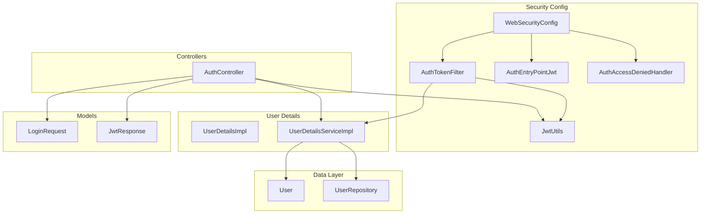
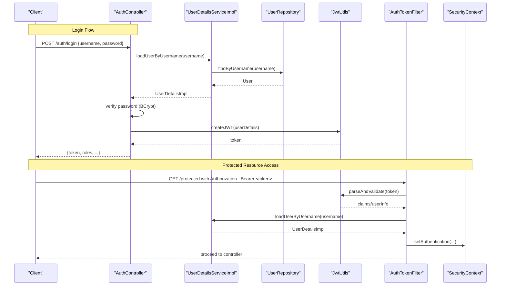
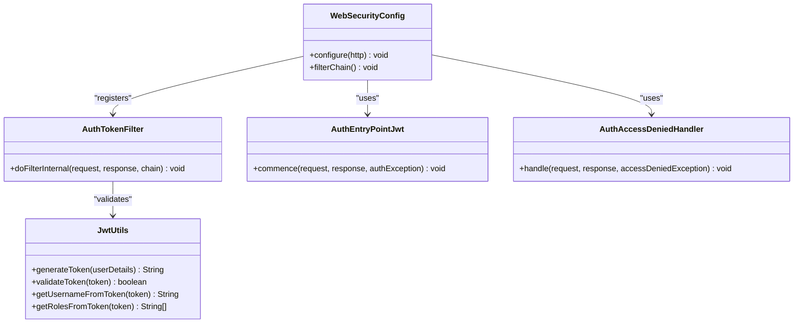
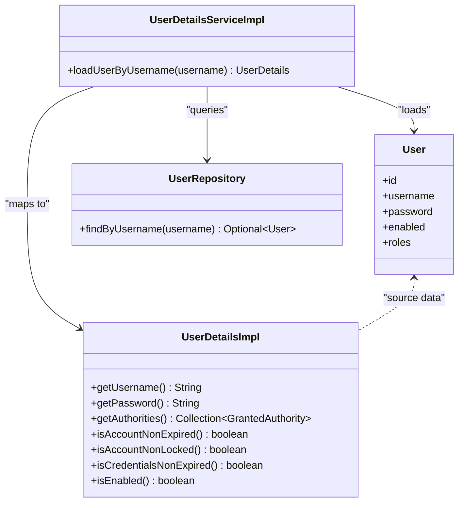
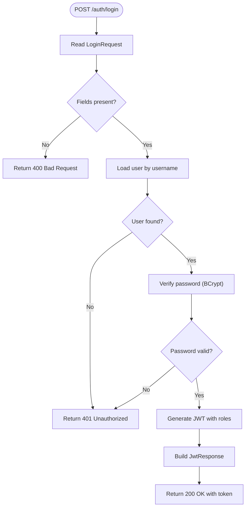
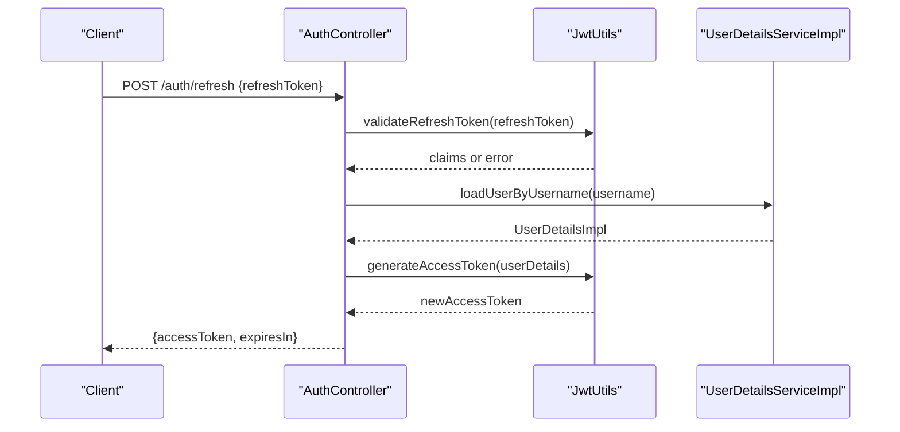
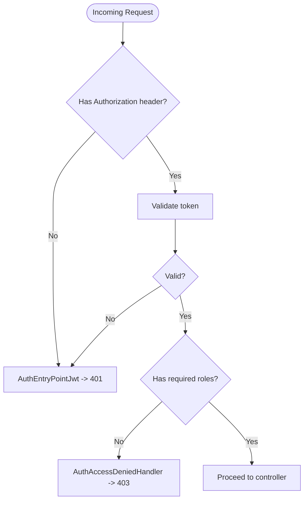
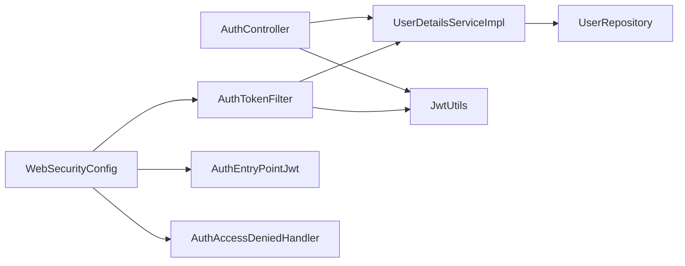

# Authentication System

<cite>
**Referenced Files in This Document**
- [WebSecurityConfig.java](file://backend/src/main/java/com/ceb/billing/config/WebSecurityConfig.java)
- [AuthTokenFilter.java](file://backend/src/main/java/com/ceb/billing/config/AuthTokenFilter.java)
- [JwtUtils.java](file://backend/src/main/java/com/ceb/billing/config/JwtUtils.java)
- [UserDetailsImpl.java](file://backend/src/main/java/com/ceb/billing/config/UserDetailsImpl.java)
- [UserDetailsServiceImpl.java](file://backend/src/main/java/com/ceb/billing/config/UserDetailsServiceImpl.java)
- [AuthEntryPointJwt.java](file://backend/src/main/java/com/ceb/billing/config/AuthEntryPointJwt.java)
- [AuthAccessDeniedHandler.java](file://backend/src/main/java/com/ceb/billing/config/AuthAccessDeniedHandler.java)
- [AuthController.java](file://backend/src/main/java/com/ceb/billing/controllers/AuthController.java)
- [LoginRequest.java](file://backend/src/main/java/com/ceb/billing/models/LoginRequest.java)
- [JwtResponse.java](file://backend/src/main/java/com/ceb/billing/models/JwtResponse.java)
- [User.java](file://backend/src/main/java/com/ceb/billing/entities/User.java)
- [UserRepository.java](file://backend/src/main/java/com/ceb/billing/repositories/UserRepository.java)
</cite>

## Table of Contents
1. [Introduction](#introduction)
2. [Project Structure](#project-structure)
3. [Core Components](#core-components)
4. [Architecture Overview](#architecture-overview)
5. [Detailed Component Analysis](#detailed-component-analysis)
6. [Dependency Analysis](#dependency-analysis)
7. [Performance Considerations](#performance-considerations)
8. [Troubleshooting Guide](#troubleshooting-guide)
9. [Conclusion](#conclusion)
10. [Appendices](#appendices)

## Introduction
This document explains the authentication system of the CEB Billing System with a focus on JWT-based security. It covers token generation and validation, user registration and login flows, password encryption using BCrypt, custom UserDetailsService implementation, UserDetailsImpl structure, role handling, and Spring Security context management. It also provides practical examples for endpoints, token refresh mechanisms, error handling strategies, and security considerations for password storage, session management, and authentication state persistence.

## Project Structure
The authentication subsystem is implemented under the backend module:
- Configuration and filters: WebSecurityConfig, AuthTokenFilter, JwtUtils
- Security entry points and handlers: AuthEntryPointJwt, AuthAccessDeniedHandler
- User details and service: UserDetailsImpl, UserDetailsServiceImpl
- Controllers and models: AuthController, LoginRequest, JwtResponse
- Data layer: User entity and UserRepository

**Diagram sources**
- [WebSecurityConfig.java](file://backend/src/main/java/com/ceb/billing/config/WebSecurityConfig.java)
- [AuthTokenFilter.java](file://backend/src/main/java/com/ceb/billing/config/AuthTokenFilter.java)
- [JwtUtils.java](file://backend/src/main/java/com/ceb/billing/config/JwtUtils.java)
- [UserDetailsImpl.java](file://backend/src/main/java/com/ceb/billing/config/UserDetailsImpl.java)
- [UserDetailsServiceImpl.java](file://backend/src/main/java/com/ceb/billing/config/UserDetailsServiceImpl.java)
- [AuthEntryPointJwt.java](file://backend/src/main/java/com/ceb/billing/config/AuthEntryPointJwt.java)
- [AuthAccessDeniedHandler.java](file://backend/src/main/java/com/ceb/billing/config/AuthAccessDeniedHandler.java)
- [AuthController.java](file://backend/src/main/java/com/ceb/billing/controllers/AuthController.java)
- [LoginRequest.java](file://backend/src/main/java/com/ceb/billing/models/LoginRequest.java)
- [JwtResponse.java](file://backend/src/main/java/com/ceb/billing/models/JwtResponse.java)
- [User.java](file://backend/src/main/java/com/ceb/billing/entities/User.java)
- [UserRepository.java](file://backend/src/main/java/com/ceb/billing/repositories/UserRepository.java)

**Section sources**
- [WebSecurityConfig.java](file://backend/src/main/java/com/ceb/billing/config/WebSecurityConfig.java)
- [AuthTokenFilter.java](file://backend/src/main/java/com/ceb/billing/config/AuthTokenFilter.java)
- [JwtUtils.java](file://backend/src/main/java/com/ceb/billing/config/JwtUtils.java)
- [UserDetailsImpl.java](file://backend/src/main/java/com/ceb/billing/config/UserDetailsImpl.java)
- [UserDetailsServiceImpl.java](file://backend/src/main/java/com/ceb/billing/config/UserDetailsServiceImpl.java)
- [AuthEntryPointJwt.java](file://backend/src/main/java/com/ceb/billing/config/AuthEntryPointJwt.java)
- [AuthAccessDeniedHandler.java](file://backend/src/main/java/com/ceb/billing/config/AuthAccessDeniedHandler.java)
- [AuthController.java](file://backend/src/main/java/com/ceb/billing/controllers/AuthController.java)
- [LoginRequest.java](file://backend/src/main/java/com/ceb/billing/models/LoginRequest.java)
- [JwtResponse.java](file://backend/src/main/java/com/ceb/billing/models/JwtResponse.java)
- [User.java](file://backend/src/main/java/com/ceb/billing/entities/User.java)
- [UserRepository.java](file://backend/src/main/java/com/ceb/billing/repositories/UserRepository.java)

## Core Components
- WebSecurityConfig: Centralizes Spring Security configuration, including request authorization rules, exception handling, and filter registration.
- AuthTokenFilter: Intercepts HTTP requests to extract and validate JWT tokens from headers and populate the SecurityContext.
- JwtUtils: Provides utilities for creating, parsing, and validating JWTs (signing, expiration, claims).
- UserDetailsImpl: Implements Spring’s UserDetails to represent authenticated user information and roles.
- UserDetailsServiceImpl: Loads user-specific data by username and maps domain entities to UserDetailsImpl.
- AuthEntryPointJwt: Handles unauthorized access errors (e.g., missing or invalid token).
- AuthAccessDeniedHandler: Handles forbidden access errors (e.g., insufficient roles).
- AuthController: Exposes login and related endpoints; returns JWT responses.
- LoginRequest and JwtResponse: Request/response DTOs for authentication.
- User and UserRepository: Domain model and repository for persisting users and credentials.

Key responsibilities:
- Token lifecycle: creation, validation, and extraction.
- Password hashing: secure storage via BCrypt.
- Role-based authorization: mapping roles to authorities.
- Context management: populating SecurityContextHolder for downstream use.

**Section sources**
- [WebSecurityConfig.java](file://backend/src/main/java/com/ceb/billing/config/WebSecurityConfig.java)
- [AuthTokenFilter.java](file://backend/src/main/java/com/ceb/billing/config/AuthTokenFilter.java)
- [JwtUtils.java](file://backend/src/main/java/com/ceb/billing/config/JwtUtils.java)
- [UserDetailsImpl.java](file://backend/src/main/java/com/ceb/billing/config/UserDetailsImpl.java)
- [UserDetailsServiceImpl.java](file://backend/src/main/java/com/ceb/billing/config/UserDetailsServiceImpl.java)
- [AuthEntryPointJwt.java](file://backend/src/main/java/com/ceb/billing/config/AuthEntryPointJwt.java)
- [AuthAccessDeniedHandler.java](file://backend/src/main/java/com/ceb/billing/config/AuthAccessDeniedHandler.java)
- [AuthController.java](file://backend/src/main/java/com/ceb/billing/controllers/AuthController.java)
- [LoginRequest.java](file://backend/src/main/java/com/ceb/billing/models/LoginRequest.java)
- [JwtResponse.java](file://backend/src/main/java/com/ceb/billing/models/JwtResponse.java)
- [User.java](file://backend/src/main/java/com/ceb/billing/entities/User.java)
- [UserRepository.java](file://backend/src/main/java/com/ceb/billing/repositories/UserRepository.java)

## Architecture Overview
The authentication flow integrates Spring Security with a stateless JWT strategy:
- Clients send credentials to the login endpoint.
- The controller validates credentials against stored BCrypt hashes.
- On success, a JWT is issued containing user identity and roles.
- Subsequent requests include the JWT in an Authorization header.
- A filter extracts and validates the token, loading user details and setting the SecurityContext.
- Access decisions are enforced based on roles/authorities.

**Diagram sources**
- [AuthController.java](file://backend/src/main/java/com/ceb/billing/controllers/AuthController.java)
- [UserDetailsServiceImpl.java](file://backend/src/main/java/com/ceb/billing/config/UserDetailsServiceImpl.java)
- [UserRepository.java](file://backend/src/main/java/com/ceb/billing/repositories/UserRepository.java)
- [JwtUtils.java](file://backend/src/main/java/com/ceb/billing/config/JwtUtils.java)
- [AuthTokenFilter.java](file://backend/src/main/java/com/ceb/billing/config/AuthTokenFilter.java)

## Detailed Component Analysis

### Security Configuration and Filters
- WebSecurityConfig configures:
  - Which endpoints are public vs protected
  - Exception handlers for unauthorized and forbidden scenarios
  - Registration of the JWT filter
- AuthTokenFilter:
  - Reads Authorization header
  - Validates token format and signature
  - Loads user details and sets SecurityContext
- JwtUtils:
  - Generates tokens with subject (username), roles, and expiration
  - Parses and validates tokens
  - Extracts claims such as username and roles

**Diagram sources**
- [WebSecurityConfig.java](file://backend/src/main/java/com/ceb/billing/config/WebSecurityConfig.java)
- [AuthTokenFilter.java](file://backend/src/main/java/com/ceb/billing/config/AuthTokenFilter.java)
- [JwtUtils.java](file://backend/src/main/java/com/ceb/billing/config/JwtUtils.java)
- [AuthEntryPointJwt.java](file://backend/src/main/java/com/ceb/billing/config/AuthEntryPointJwt.java)
- [AuthAccessDeniedHandler.java](file://backend/src/main/java/com/ceb/billing/config/AuthAccessDeniedHandler.java)

**Section sources**
- [WebSecurityConfig.java](file://backend/src/main/java/com/ceb/billing/config/WebSecurityConfig.java)
- [AuthTokenFilter.java](file://backend/src/main/java/com/ceb/billing/config/AuthTokenFilter.java)
- [JwtUtils.java](file://backend/src/main/java/com/ceb/billing/config/JwtUtils.java)
- [AuthEntryPointJwt.java](file://backend/src/main/java/com/ceb/billing/config/AuthEntryPointJwt.java)
- [AuthAccessDeniedHandler.java](file://backend/src/main/java/com/ceb/billing/config/AuthAccessDeniedHandler.java)

### User Details and Service Implementation
- UserDetailsImpl:
  - Encapsulates username, password, enabled status, and authorities (roles)
  - Implements methods required by Spring Security
- UserDetailsServiceImpl:
  - Loads User from UserRepository by username
  - Maps User to UserDetailsImpl
  - Ensures consistent authority representation for role checks

**Diagram sources**
- [UserDetailsImpl.java](file://backend/src/main/java/com/ceb/billing/config/UserDetailsImpl.java)
- [UserDetailsServiceImpl.java](file://backend/src/main/java/com/ceb/billing/config/UserDetailsServiceImpl.java)
- [User.java](file://backend/src/main/java/com/ceb/billing/entities/User.java)
- [UserRepository.java](file://backend/src/main/java/com/ceb/billing/repositories/UserRepository.java)

**Section sources**
- [UserDetailsImpl.java](file://backend/src/main/java/com/ceb/billing/config/UserDetailsImpl.java)
- [UserDetailsServiceImpl.java](file://backend/src/main/java/com/ceb/billing/config/UserDetailsServiceImpl.java)
- [User.java](file://backend/src/main/java/com/ceb/billing/entities/User.java)
- [UserRepository.java](file://backend/src/main/java/com/ceb/billing/repositories/UserRepository.java)

### Authentication Endpoints and Models
- AuthController exposes:
  - Login endpoint accepting LoginRequest
  - Returns JwtResponse with token and user metadata
- LoginRequest contains:
  - Username and password fields
- JwtResponse contains:
  - Token string and relevant user info (e.g., roles)

**Diagram sources**
- [AuthController.java](file://backend/src/main/java/com/ceb/billing/controllers/AuthController.java)
- [LoginRequest.java](file://backend/src/main/java/com/ceb/billing/models/LoginRequest.java)
- [JwtResponse.java](file://backend/src/main/java/com/ceb/billing/models/JwtResponse.java)
- [UserDetailsServiceImpl.java](file://backend/src/main/java/com/ceb/billing/config/UserDetailsServiceImpl.java)
- [JwtUtils.java](file://backend/src/main/java/com/ceb/billing/config/JwtUtils.java)

**Section sources**
- [AuthController.java](file://backend/src/main/java/com/ceb/billing/controllers/AuthController.java)
- [LoginRequest.java](file://backend/src/main/java/com/ceb/billing/models/LoginRequest.java)
- [JwtResponse.java](file://backend/src/main/java/com/ceb/billing/models/JwtResponse.java)

### Token Refresh Mechanism
A typical refresh pattern:
- Client sends a refresh token (stored securely) to a dedicated endpoint.
- Server validates the refresh token and issues a new access token if valid.
- For stateless JWTs, consider:
  - Using short-lived access tokens and longer-lived refresh tokens
  - Storing refresh tokens server-side with expiry and revocation support
  - Binding refresh tokens to user identity and device/session metadata

[No diagram sources since this is a conceptual refresh flow]

### Error Handling Strategies
- Unauthorized (missing/invalid token): handled by AuthEntryPointJwt returning appropriate HTTP status and message.
- Forbidden (insufficient roles): handled by AuthAccessDeniedHandler returning appropriate HTTP status and message.
- Validation failures: return 400 with descriptive messages.

**Diagram sources**
- [AuthEntryPointJwt.java](file://backend/src/main/java/com/ceb/billing/config/AuthEntryPointJwt.java)
- [AuthAccessDeniedHandler.java](file://backend/src/main/java/com/ceb/billing/config/AuthAccessDeniedHandler.java)
- [AuthTokenFilter.java](file://backend/src/main/java/com/ceb/billing/config/AuthTokenFilter.java)

**Section sources**
- [AuthEntryPointJwt.java](file://backend/src/main/java/com/ceb/billing/config/AuthEntryPointJwt.java)
- [AuthAccessDeniedHandler.java](file://backend/src/main/java/com/ceb/billing/config/AuthAccessDeniedHandler.java)
- [AuthTokenFilter.java](file://backend/src/main/java/com/ceb/billing/config/AuthTokenFilter.java)

## Dependency Analysis
The authentication components have clear separation of concerns:
- Controllers depend on services and JWT utilities for issuing tokens.
- Filters depend on JWT utilities and user details service to authenticate requests.
- User details service depends on repositories to load user data.
- Security configuration wires together filters, entry points, and handlers.

**Diagram sources**
- [AuthController.java](file://backend/src/main/java/com/ceb/billing/controllers/AuthController.java)
- [UserDetailsServiceImpl.java](file://backend/src/main/java/com/ceb/billing/config/UserDetailsServiceImpl.java)
- [JwtUtils.java](file://backend/src/main/java/com/ceb/billing/config/JwtUtils.java)
- [AuthTokenFilter.java](file://backend/src/main/java/com/ceb/billing/config/AuthTokenFilter.java)
- [UserRepository.java](file://backend/src/main/java/com/ceb/billing/repositories/UserRepository.java)
- [WebSecurityConfig.java](file://backend/src/main/java/com/ceb/billing/config/WebSecurityConfig.java)
- [AuthEntryPointJwt.java](file://backend/src/main/java/com/ceb/billing/config/AuthEntryPointJwt.java)
- [AuthAccessDeniedHandler.java](file://backend/src/main/java/com/ceb/billing/config/AuthAccessDeniedHandler.java)

**Section sources**
- [AuthController.java](file://backend/src/main/java/com/ceb/billing/controllers/AuthController.java)
- [UserDetailsServiceImpl.java](file://backend/src/main/java/com/ceb/billing/config/UserDetailsServiceImpl.java)
- [JwtUtils.java](file://backend/src/main/java/com/ceb/billing/config/JwtUtils.java)
- [AuthTokenFilter.java](file://backend/src/main/java/com/ceb/billing/config/AuthTokenFilter.java)
- [UserRepository.java](file://backend/src/main/java/com/ceb/billing/repositories/UserRepository.java)
- [WebSecurityConfig.java](file://backend/src/main/java/com/ceb/billing/config/WebSecurityConfig.java)
- [AuthEntryPointJwt.java](file://backend/src/main/java/com/ceb/billing/config/AuthEntryPointJwt.java)
- [AuthAccessDeniedHandler.java](file://backend/src/main/java/com/ceb/billing/config/AuthAccessDeniedHandler.java)

## Performance Considerations
- Keep JWT payloads minimal to reduce overhead; store only necessary claims (e.g., username and roles).
- Use short-lived access tokens to limit exposure windows.
- Cache user lookups where appropriate to avoid repeated database queries during high traffic.
- Avoid heavy computations in the filter path; delegate expensive operations to services.
- Ensure BCrypt work factor is balanced for security and performance.

[No sources needed since this section provides general guidance]

## Troubleshooting Guide
Common issues and resolutions:
- Missing Authorization header: ensure clients attach Bearer tokens.
- Invalid or expired token: check token signing key, expiration settings, and client clock synchronization.
- Insufficient roles: verify user roles and endpoint authorization rules.
- Password verification failures: confirm BCrypt hash storage and input encoding.

Operational tips:
- Log token parsing results and exceptions at safe levels (no secrets).
- Provide clear error responses for 401 and 403 cases.
- Monitor failed login attempts and implement rate limiting if needed.

**Section sources**
- [AuthEntryPointJwt.java](file://backend/src/main/java/com/ceb/billing/config/AuthEntryPointJwt.java)
- [AuthAccessDeniedHandler.java](file://backend/src/main/java/com/ceb/billing/config/AuthAccessDeniedHandler.java)
- [AuthTokenFilter.java](file://backend/src/main/java/com/ceb/billing/config/AuthTokenFilter.java)
- [JwtUtils.java](file://backend/src/main/java/com/ceb/billing/config/JwtUtils.java)
- [AuthController.java](file://backend/src/main/java/com/ceb/billing/controllers/AuthController.java)

## Conclusion
The CEB Billing System implements a robust, stateless JWT-based authentication mechanism. It leverages Spring Security with a custom filter and user details service, uses BCrypt for secure password storage, and enforces role-based access control. The design separates concerns cleanly across configuration, filtering, user details, and controllers, enabling maintainable and testable authentication flows.

[No sources needed since this section summarizes without analyzing specific files]

## Appendices

### Practical Endpoint Examples
- Login:
  - Method: POST
  - Path: /auth/login
  - Body: LoginRequest (username, password)
  - Response: JwtResponse (token, roles, etc.)
- Refresh (conceptual):
  - Method: POST
  - Path: /auth/refresh
  - Body: refreshToken
  - Response: new accessToken

[No sources needed since this section provides usage examples without analyzing specific files]

### Security Considerations
- Password Storage: Always store BCrypt hashes; never store plaintext passwords.
- Session Management: Stateless JWT approach avoids server-side sessions; manage token lifetimes carefully.
- Authentication State Persistence: Persist only non-sensitive identifiers in tokens; keep sensitive data out of JWT payloads.
- Transport Security: Enforce HTTPS to protect tokens in transit.
- Token Revocation: Implement server-side refresh token storage and revocation lists if long-lived tokens are used.

[No sources needed since this section provides general guidance]