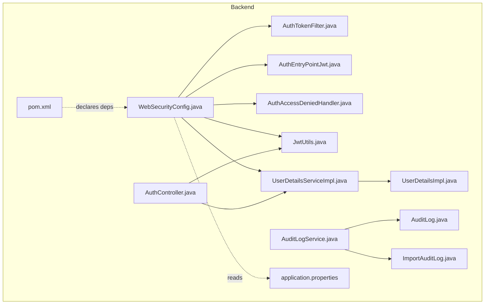
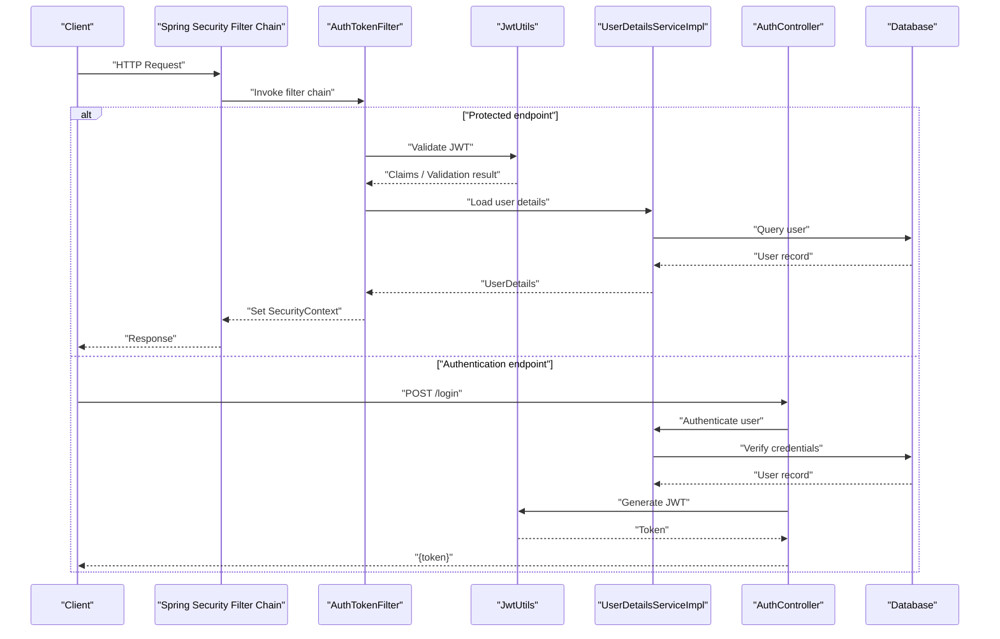
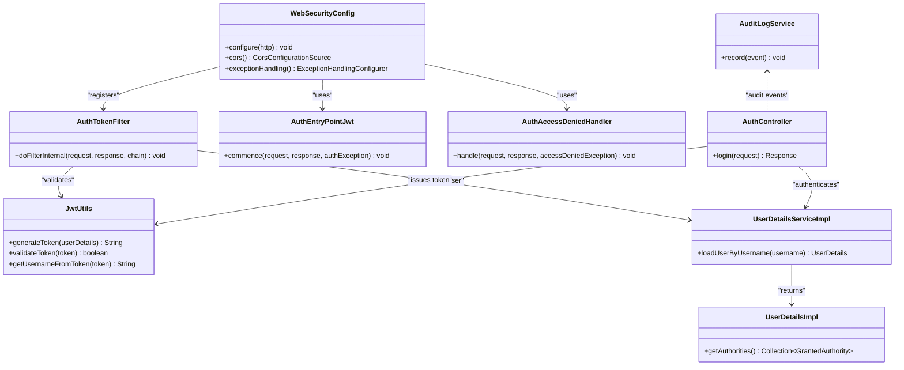

# Security Configuration

<cite>
**Referenced Files in This Document**
- [WebSecurityConfig.java](file://backend/src/main/java/com/ceb/billing/config/WebSecurityConfig.java)
- [AuthTokenFilter.java](file://backend/src/main/java/com/ceb/billing/config/AuthTokenFilter.java)
- [AuthEntryPointJwt.java](file://backend/src/main/java/com/ceb/billing/config/AuthEntryPointJwt.java)
- [AuthAccessDeniedHandler.java](file://backend/src/main/java/com/ceb/billing/config/AuthAccessDeniedHandler.java)
- [JwtUtils.java](file://backend/src/main/java/com/ceb/billing/config/JwtUtils.java)
- [UserDetailsServiceImpl.java](file://backend/src/main/java/com/ceb/billing/config/UserDetailsServiceImpl.java)
- [UserDetailsImpl.java](file://backend/src/main/java/com/ceb/billing/config/UserDetailsImpl.java)
- [application.properties](file://backend/src/main/resources/application.properties)
- [AuditLog.java](file://backend/src/main/java/com/ceb/billing/entities/AuditLog.java)
- [ImportAuditLog.java](file://backend/src/main/java/com/ceb/billing/entities/ImportAuditLog.java)
- [AuditLogService.java](file://backend/src/main/java/com/ceb/billing/services/AuditLogService.java)
- [AuthController.java](file://backend/src/main/java/com/ceb/billing/controllers/AuthController.java)
- [pom.xml](file://backend/pom.xml)
</cite>

## Table of Contents
1. [Introduction](#introduction)
2. [Project Structure](#project-structure)
3. [Core Components](#core-components)
4. [Architecture Overview](#architecture-overview)
5. [Detailed Component Analysis](#detailed-component-analysis)
6. [Dependency Analysis](#dependency-analysis)
7. [Performance Considerations](#performance-considerations)
8. [Troubleshooting Guide](#troubleshooting-guide)
9. [Conclusion](#conclusion)
10. [Appendices](#appendices)

## Introduction
This document provides comprehensive security configuration guidance for the application, focusing on:
- Application-wide security settings and environment-specific configurations
- CORS policy configuration
- Security headers setup
- HTTPS enforcement
- Database security configuration and connection pooling security
- External service authentication settings
- Logging configuration for security events, audit trail setup, and security monitoring integration
- Production security hardening, environment variable management, and best practices across deployment scenarios

The content is derived from the backend Spring Boot application’s security configuration classes, properties, entities, services, and dependencies.

## Project Structure
Security-related components are primarily located under the config package, with supporting controllers, services, and entities handling authentication, authorization, and auditing. The application uses Spring Security, JWT-based authentication, and a relational database via JPA/Hibernate.

**Diagram sources**
- [WebSecurityConfig.java](file://backend/src/main/java/com/ceb/billing/config/WebSecurityConfig.java)
- [AuthTokenFilter.java](file://backend/src/main/java/com/ceb/billing/config/AuthTokenFilter.java)
- [AuthEntryPointJwt.java](file://backend/src/main/java/com/ceb/billing/config/AuthEntryPointJwt.java)
- [AuthAccessDeniedHandler.java](file://backend/src/main/java/com/ceb/billing/config/AuthAccessDeniedHandler.java)
- [JwtUtils.java](file://backend/src/main/java/com/ceb/billing/config/JwtUtils.java)
- [UserDetailsServiceImpl.java](file://backend/src/main/java/com/ceb/billing/config/UserDetailsServiceImpl.java)
- [UserDetailsImpl.java](file://backend/src/main/java/com/ceb/billing/config/UserDetailsImpl.java)
- [AuthController.java](file://backend/src/main/java/com/ceb/billing/controllers/AuthController.java)
- [AuditLogService.java](file://backend/src/main/java/com/ceb/billing/services/AuditLogService.java)
- [AuditLog.java](file://backend/src/main/java/com/ceb/billing/entities/AuditLog.java)
- [ImportAuditLog.java](file://backend/src/main/java/com/ceb/billing/entities/ImportAuditLog.java)
- [application.properties](file://backend/src/main/resources/application.properties)
- [pom.xml](file://backend/pom.xml)

**Section sources**
- [WebSecurityConfig.java](file://backend/src/main/java/com/ceb/billing/config/WebSecurityConfig.java)
- [application.properties](file://backend/src/main/resources/application.properties)
- [pom.xml](file://backend/pom.xml)

## Core Components
- WebSecurityConfig: Centralizes HTTP security rules, CORS, exception handling, and filter registration.
- AuthTokenFilter: Intercepts requests to validate JWT tokens and set authentication context.
- AuthEntryPointJwt: Handles unauthorized access responses (e.g., missing or invalid token).
- AuthAccessDeniedHandler: Handles forbidden access responses (insufficient permissions).
- JwtUtils: Utility for JWT creation, parsing, and validation.
- UserDetailsServiceImpl and UserDetailsImpl: Load user details and map them to Spring Security’s principal.
- AuditLogService and entities: Persist audit events for security-relevant actions.
- application.properties: Holds runtime configuration including security and data source settings.
- pom.xml: Declares Spring Security, JWT libraries, and other relevant dependencies.

Key responsibilities:
- Enforce authentication and authorization policies
- Configure CORS and security headers
- Manage JWT lifecycle and token validation
- Provide consistent error responses for auth failures
- Record security and import audit events

**Section sources**
- [WebSecurityConfig.java](file://backend/src/main/java/com/ceb/billing/config/WebSecurityConfig.java)
- [AuthTokenFilter.java](file://backend/src/main/java/com/ceb/billing/config/AuthTokenFilter.java)
- [AuthEntryPointJwt.java](file://backend/src/main/java/com/ceb/billing/config/AuthEntryPointJwt.java)
- [AuthAccessDeniedHandler.java](file://backend/src/main/java/com/ceb/billing/config/AuthAccessDeniedHandler.java)
- [JwtUtils.java](file://backend/src/main/java/com/ceb/billing/config/JwtUtils.java)
- [UserDetailsServiceImpl.java](file://backend/src/main/java/com/ceb/billing/config/UserDetailsServiceImpl.java)
- [UserDetailsImpl.java](file://backend/src/main/java/com/ceb/billing/config/UserDetailsImpl.java)
- [AuditLogService.java](file://backend/src/main/java/com/ceb/billing/services/AuditLogService.java)
- [AuditLog.java](file://backend/src/main/java/com/ceb/billing/entities/AuditLog.java)
- [ImportAuditLog.java](file://backend/src/main/java/com/ceb/billing/entities/ImportAuditLog.java)
- [application.properties](file://backend/src/main/resources/application.properties)
- [pom.xml](file://backend/pom.xml)

## Architecture Overview
The security architecture follows a standard Spring Security pipeline:
- Requests enter through the servlet container and pass through the Spring Security filter chain.
- AuthTokenFilter validates JWTs and populates the SecurityContext.
- Access decisions are enforced by configured request matchers and role-based rules.
- Unauthorized and forbidden cases are handled by dedicated handlers.
- Authentication endpoints are provided by AuthController using JwtUtils and UserDetailsServiceImpl.
- Security-sensitive operations can be audited via AuditLogService.

**Diagram sources**
- [WebSecurityConfig.java](file://backend/src/main/java/com/ceb/billing/config/WebSecurityConfig.java)
- [AuthTokenFilter.java](file://backend/src/main/java/com/ceb/billing/config/AuthTokenFilter.java)
- [JwtUtils.java](file://backend/src/main/java/com/ceb/billing/config/JwtUtils.java)
- [UserDetailsServiceImpl.java](file://backend/src/main/java/com/ceb/billing/config/UserDetailsServiceImpl.java)
- [AuthController.java](file://backend/src/main/java/com/ceb/billing/controllers/AuthController.java)

## Detailed Component Analysis

### WebSecurityConfig
Responsibilities:
- Configures global HTTP security rules and request matchers
- Registers custom filters (e.g., JWT filter)
- Sets up CORS policy and security headers
- Defines exception handling for unauthorized and forbidden scenarios
- Integrates with authentication provider and user details service

Configuration aspects:
- CORS: origins, methods, allowed headers, credentials
- Headers: CSP, HSTS, X-Frame-Options, Referrer-Policy, etc.
- HTTPS: redirect or enforce secure scheme
- CSRF: typically disabled for stateless JWT APIs
- Session strategy: stateless for JWT flows
- Authorization: role-based access control per path patterns

Best practices:
- Use environment variables for origins and sensitive values
- Restrict CORS to known domains in production
- Enable strict security headers in production
- Ensure HTTPS-only endpoints in production

**Section sources**
- [WebSecurityConfig.java](file://backend/src/main/java/com/ceb/billing/config/WebSecurityConfig.java)

### AuthTokenFilter
Responsibilities:
- Extracts JWT from Authorization header
- Validates token signature and expiration
- Populates SecurityContext with authenticated principal
- Skips filtering for public endpoints

Operational notes:
- Handle malformed or expired tokens gracefully
- Avoid blocking long-running operations during token validation
- Integrate with logging for failed validations

**Section sources**
- [AuthTokenFilter.java](file://backend/src/main/java/com/ceb/billing/config/AuthTokenFilter.java)

### AuthEntryPointJwt and AuthAccessDeniedHandler
Responsibilities:
- AuthEntryPointJwt: Responds with appropriate status and body when authentication fails
- AuthAccessDeniedHandler: Responds when user lacks required roles/permissions

Behavior:
- Return standardized JSON error responses
- Include minimal information to avoid leaking internals
- Log security events for monitoring

**Section sources**
- [AuthEntryPointJwt.java](file://backend/src/main/java/com/ceb/billing/config/AuthEntryPointJwt.java)
- [AuthAccessDeniedHandler.java](file://backend/src/main/java/com/ceb/billing/config/AuthAccessDeniedHandler.java)

### JwtUtils
Responsibilities:
- Generates signed JWTs with claims
- Parses and validates incoming tokens
- Provides helper methods for extracting subject and roles

Security considerations:
- Use strong signing algorithms and keys
- Rotate keys periodically
- Set appropriate token lifetimes and refresh strategies
- Validate issuer and audience if applicable

**Section sources**
- [JwtUtils.java](file://backend/src/main/java/com/ceb/billing/config/JwtUtils.java)

### UserDetailsServiceImpl and UserDetailsImpl
Responsibilities:
- UserDetailsServiceImpl loads user data and maps to Spring Security’s UserDetails
- UserDetailsImpl encapsulates user attributes and authorities

Integration points:
- Connects to repository layer for user lookup
- Ensures password encoding verification
- Exposes roles/permissions for authorization decisions

**Section sources**
- [UserDetailsServiceImpl.java](file://backend/src/main/java/com/ceb/billing/config/UserDetailsServiceImpl.java)
- [UserDetailsImpl.java](file://backend/src/main/java/com/ceb/billing/config/UserDetailsImpl.java)

### AuditLogService and Entities
Responsibilities:
- Persists audit records for security-relevant actions (e.g., login attempts, import operations)
- Entities model structured audit logs for analysis and compliance

Usage:
- Capture actor, action, timestamp, resource, outcome
- Support correlation IDs for tracing
- Separate import audit logs for data ingestion workflows

**Section sources**
- [AuditLogService.java](file://backend/src/main/java/com/ceb/billing/services/AuditLogService.java)
- [AuditLog.java](file://backend/src/main/java/com/ceb/billing/entities/AuditLog.java)
- [ImportAuditLog.java](file://backend/src/main/java/com/ceb/billing/entities/ImportAuditLog.java)

### AuthController
Responsibilities:
- Exposes authentication endpoints (e.g., login)
- Uses JwtUtils to issue tokens upon successful authentication
- Returns standardized responses for success and failure

Flow highlights:
- Accepts credentials
- Authenticates via user details service
- Issues JWT on success
- Records audit events where applicable

**Section sources**
- [AuthController.java](file://backend/src/main/java/com/ceb/billing/controllers/AuthController.java)

### application.properties
Responsibilities:
- Holds runtime configuration for security, data source, and application behavior
- Environment-specific overrides via profiles or externalized configuration

Key areas:
- Security headers and CORS settings
- Data source URL, username, password, SSL/TLS options
- Connection pool parameters and timeouts
- Logging levels for security packages

Best practices:
- Externalize secrets via environment variables or secret managers
- Use profiles for dev/stage/prod differences
- Avoid committing secrets; use templates with placeholders

**Section sources**
- [application.properties](file://backend/src/main/resources/application.properties)

### pom.xml
Responsibilities:
- Declares dependencies for Spring Security, JWT libraries, and related modules
- Ensures compatible versions and security patches

Recommendations:
- Pin critical dependency versions
- Regularly update to address vulnerabilities
- Monitor advisories for declared libraries

**Section sources**
- [pom.xml](file://backend/pom.xml)

## Dependency Analysis
Security-related dependencies include Spring Security, JWT utilities, and data access libraries. The following diagram shows key relationships among core security components.

**Diagram sources**
- [WebSecurityConfig.java](file://backend/src/main/java/com/ceb/billing/config/WebSecurityConfig.java)
- [AuthTokenFilter.java](file://backend/src/main/java/com/ceb/billing/config/AuthTokenFilter.java)
- [AuthEntryPointJwt.java](file://backend/src/main/java/com/ceb/billing/config/AuthEntryPointJwt.java)
- [AuthAccessDeniedHandler.java](file://backend/src/main/java/com/ceb/billing/config/AuthAccessDeniedHandler.java)
- [JwtUtils.java](file://backend/src/main/java/com/ceb/billing/config/JwtUtils.java)
- [UserDetailsServiceImpl.java](file://backend/src/main/java/com/ceb/billing/config/UserDetailsServiceImpl.java)
- [UserDetailsImpl.java](file://backend/src/main/java/com/ceb/billing/config/UserDetailsImpl.java)
- [AuthController.java](file://backend/src/main/java/com/ceb/billing/controllers/AuthController.java)
- [AuditLogService.java](file://backend/src/main/java/com/ceb/billing/services/AuditLogService.java)

**Section sources**
- [WebSecurityConfig.java](file://backend/src/main/java/com/ceb/billing/config/WebSecurityConfig.java)
- [AuthTokenFilter.java](file://backend/src/main/java/com/ceb/billing/config/AuthTokenFilter.java)
- [AuthEntryPointJwt.java](file://backend/src/main/java/com/ceb/billing/config/AuthEntryPointJwt.java)
- [AuthAccessDeniedHandler.java](file://backend/src/main/java/com/ceb/billing/config/AuthAccessDeniedHandler.java)
- [JwtUtils.java](file://backend/src/main/java/com/ceb/billing/config/JwtUtils.java)
- [UserDetailsServiceImpl.java](file://backend/src/main/java/com/ceb/billing/config/UserDetailsServiceImpl.java)
- [UserDetailsImpl.java](file://backend/src/main/java/com/ceb/billing/config/UserDetailsImpl.java)
- [AuthController.java](file://backend/src/main/java/com/ceb/billing/controllers/AuthController.java)
- [AuditLogService.java](file://backend/src/main/java/com/ceb/billing/services/AuditLogService.java)

## Performance Considerations
- Token validation cost: Keep JwtUtils efficient; cache user details where safe and appropriate.
- Connection pooling: Tune pool sizes and timeouts based on workload; ensure secure TLS connections.
- Logging volume: Balance detail with performance; sample high-frequency events in production.
- CORS and headers: Minimal overhead but should be configured precisely to reduce unnecessary checks.

[No sources needed since this section provides general guidance]

## Troubleshooting Guide
Common issues and resolutions:
- 401 Unauthorized: Missing or invalid JWT; verify token presence, algorithm, and expiration.
- 403 Forbidden: Insufficient roles; check authorization rules and user authorities.
- CORS errors: Confirm allowed origins, methods, and headers; ensure credentials policy matches client usage.
- HTTPS issues: Verify redirect rules and certificate validity; confirm upstream proxy configuration.
- Database connectivity: Validate credentials, SSL flags, and connection pool settings.

Operational tips:
- Enable debug logging for security packages temporarily during investigations.
- Correlate audit logs with request IDs for end-to-end tracing.
- Review exception handler outputs to ensure they do not leak sensitive details.

**Section sources**
- [AuthEntryPointJwt.java](file://backend/src/main/java/com/ceb/billing/config/AuthEntryPointJwt.java)
- [AuthAccessDeniedHandler.java](file://backend/src/main/java/com/ceb/billing/config/AuthAccessDeniedHandler.java)
- [application.properties](file://backend/src/main/resources/application.properties)

## Conclusion
The application implements a robust security posture using Spring Security with JWT-based authentication, explicit CORS and header configuration, and comprehensive audit logging. By externalizing sensitive configuration, enforcing HTTPS, and adopting least-privilege access controls, the system aligns with production-grade security requirements. Continuous monitoring, regular dependency updates, and careful configuration management will further strengthen the security posture.

[No sources needed since this section summarizes without analyzing specific files]

## Appendices

### CORS Policy Configuration
- Allowed origins: restrict to known domains in production
- Methods and headers: limit to those required by clients
- Credentials: enable only when necessary and ensure proper cookie handling
- Preflight caching: tune max age appropriately

**Section sources**
- [WebSecurityConfig.java](file://backend/src/main/java/com/ceb/billing/config/WebSecurityConfig.java)

### Security Headers Setup
- Content-Security-Policy: define strict policies for scripts and resources
- Strict-Transport-Security: enforce HTTPS with suitable max-age
- X-Frame-Options: prevent clickjacking
- Referrer-Policy: control referrer information leakage
- Permissions-Policy: restrict browser features

**Section sources**
- [WebSecurityConfig.java](file://backend/src/main/java/com/ceb/billing/config/WebSecurityConfig.java)

### HTTPS Enforcement
- Redirect HTTP to HTTPS at the application level or via reverse proxy
- Ensure upstream proxies terminate TLS securely
- Validate certificates and rotation procedures

**Section sources**
- [WebSecurityConfig.java](file://backend/src/main/java/com/ceb/billing/config/WebSecurityConfig.java)

### Database Security Configuration
- Use environment variables for credentials
- Enable TLS for database connections
- Apply least-privilege database users
- Configure connection pool security and timeouts

**Section sources**
- [application.properties](file://backend/src/main/resources/application.properties)

### External Service Authentication Settings
- Store secrets in environment variables or secret managers
- Use mutual TLS or API keys as appropriate
- Implement retries and circuit breakers with security considerations

**Section sources**
- [application.properties](file://backend/src/main/resources/application.properties)

### Logging and Audit Trail
- Log authentication attempts, authorization failures, and token issues
- Persist audit events via AuditLogService and entities
- Integrate with centralized logging and SIEM solutions

**Section sources**
- [AuditLogService.java](file://backend/src/main/java/com/ceb/billing/services/AuditLogService.java)
- [AuditLog.java](file://backend/src/main/java/com/ceb/billing/entities/AuditLog.java)
- [ImportAuditLog.java](file://backend/src/main/java/com/ceb/billing/entities/ImportAuditLog.java)

### Production Hardening and Best Practices
- Externalize all secrets; never commit sensitive values
- Use profiles for environment-specific settings
- Pin dependency versions and monitor for vulnerabilities
- Enable strict security headers and CORS policies
- Implement rate limiting and input validation at gateway or controller layers

**Section sources**
- [application.properties](file://backend/src/main/resources/application.properties)
- [pom.xml](file://backend/pom.xml)