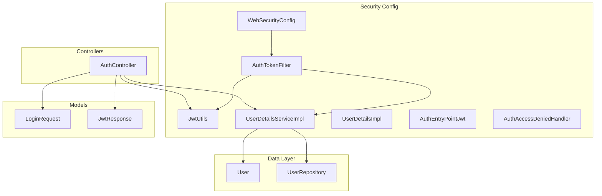
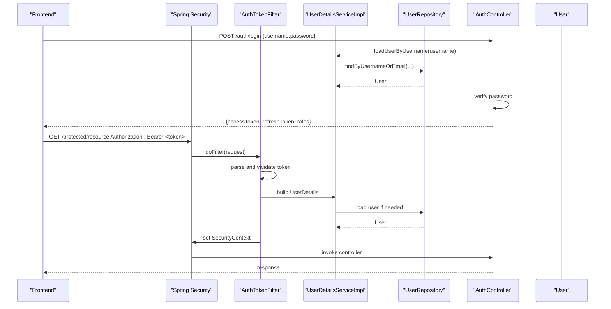
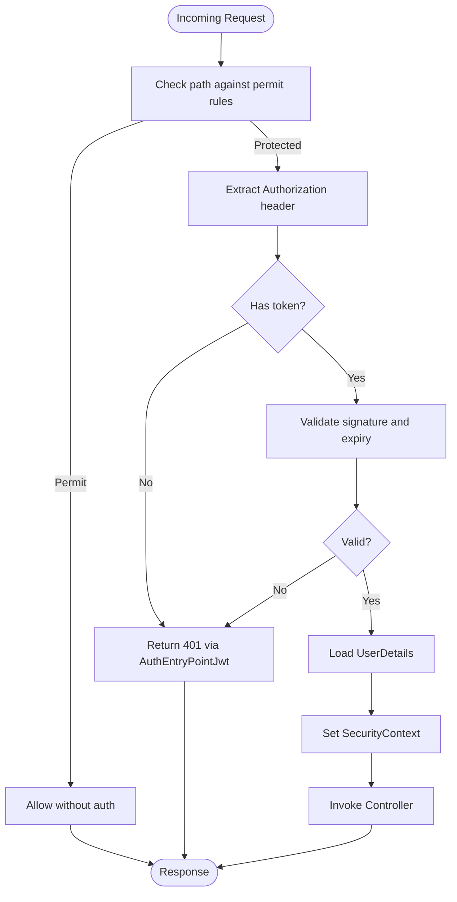
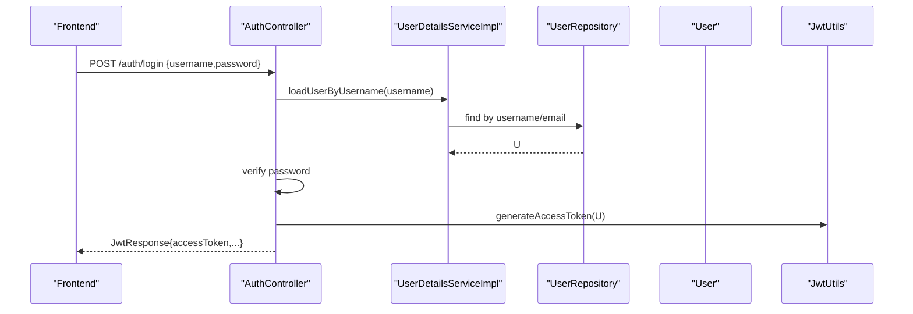
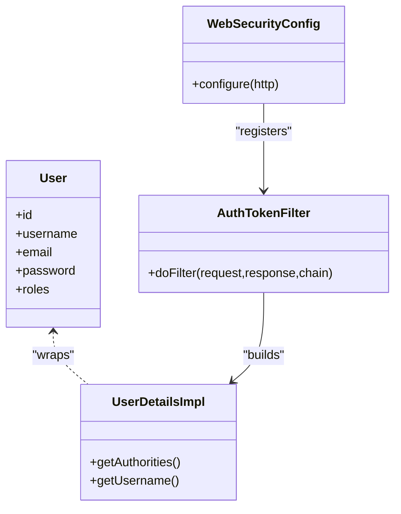
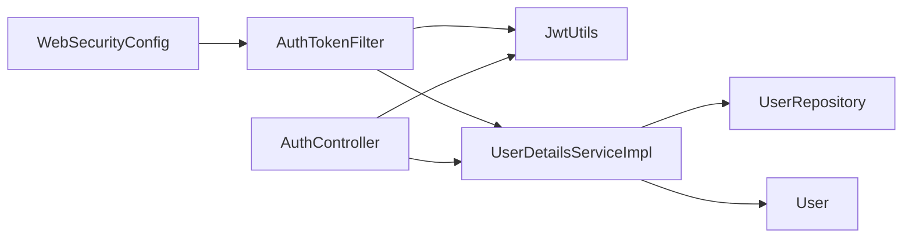

# Security Implementation

<cite>
**Referenced Files in This Document**
- [WebSecurityConfig.java](file://backend/src/main/java/com/ceb/billing/config/WebSecurityConfig.java)
- [JwtUtils.java](file://backend/src/main/java/com/ceb/billing/config/JwtUtils.java)
- [AuthTokenFilter.java](file://backend/src/main/java/com/ceb/billing/config/AuthTokenFilter.java)
- [UserDetailsServiceImpl.java](file://backend/src/main/java/com/ceb/billing/config/UserDetailsServiceImpl.java)
- [UserDetailsImpl.java](file://backend/src/main/java/com/ceb/billing/config/UserDetailsImpl.java)
- [AuthController.java](file://backend/src/main/java/com/ceb/billing/controllers/AuthController.java)
- [LoginRequest.java](file://backend/src/main/java/com/ceb/billing/models/LoginRequest.java)
- [JwtResponse.java](file://backend/src/main/java/com/ceb/billing/models/JwtResponse.java)
- [User.java](file://backend/src/main/java/com/ceb/billing/entities/User.java)
- [UserRepository.java](file://backend/src/main/java/com/ceb/billing/repositories/UserRepository.java)
- [AuthEntryPointJwt.java](file://backend/src/main/java/com/ceb/billing/config/AuthEntryPointJwt.java)
- [AuthAccessDeniedHandler.java](file://backend/src/main/java/com/ceb/billing/config/AuthAccessDeniedHandler.java)
</cite>

## Table of Contents
1. [Introduction](#introduction)
2. [Project Structure](#project-structure)
3. [Core Components](#core-components)
4. [Architecture Overview](#architecture-overview)
5. [Detailed Component Analysis](#detailed-component-analysis)
6. [Dependency Analysis](#dependency-analysis)
7. [Performance Considerations](#performance-considerations)
8. [Troubleshooting Guide](#troubleshooting-guide)
9. [Conclusion](#conclusion)

## Introduction
This document describes the CEB Billing System’s security implementation with a focus on:
- JWT-based authentication
- Password encryption
- Session management
- Role-based access control (RBAC)
- Security filter chain and request interception
- Protected resource access patterns
- User registration and login flows
- Token refresh strategies
- Security headers configuration
- Input validation and CSRF protection
- Security best practices

The backend is a Spring Boot application that uses Spring Security to secure endpoints, validate credentials, issue JWTs, and enforce authorization rules. The frontend handles user interactions and stores tokens client-side for subsequent requests.

## Project Structure
Security-related components are organized under the config, controllers, models, entities, and repositories packages. Key areas include:
- Configuration: WebSecurityConfig, JwtUtils, AuthTokenFilter, UserDetailsServiceImpl, UserDetailsImpl, error handlers
- Controllers: AuthController for login and token issuance
- Models: LoginRequest and JwtResponse for API payloads
- Entities and Repositories: User model and repository for persistence

**Diagram sources**
- [WebSecurityConfig.java](file://backend/src/main/java/com/ceb/billing/config/WebSecurityConfig.java)
- [JwtUtils.java](file://backend/src/main/java/com/ceb/billing/config/JwtUtils.java)
- [AuthTokenFilter.java](file://backend/src/main/java/com/ceb/billing/config/AuthTokenFilter.java)
- [UserDetailsServiceImpl.java](file://backend/src/main/java/com/ceb/billing/config/UserDetailsServiceImpl.java)
- [UserDetailsImpl.java](file://backend/src/main/java/com/ceb/billing/config/UserDetailsImpl.java)
- [AuthController.java](file://backend/src/main/java/com/ceb/billing/controllers/AuthController.java)
- [LoginRequest.java](file://backend/src/main/java/com/ceb/billing/models/LoginRequest.java)
- [JwtResponse.java](file://backend/src/main/java/com/ceb/billing/models/JwtResponse.java)
- [User.java](file://backend/src/main/java/com/ceb/billing/entities/User.java)
- [UserRepository.java](file://backend/src/main/java/com/ceb/billing/repositories/UserRepository.java)

**Section sources**
- [WebSecurityConfig.java](file://backend/src/main/java/com/ceb/billing/config/WebSecurityConfig.java)
- [JwtUtils.java](file://backend/src/main/java/com/ceb/billing/config/JwtUtils.java)
- [AuthTokenFilter.java](file://backend/src/main/java/com/ceb/billing/config/AuthTokenFilter.java)
- [UserDetailsServiceImpl.java](file://backend/src/main/java/com/ceb/billing/config/UserDetailsServiceImpl.java)
- [UserDetailsImpl.java](file://backend/src/main/java/com/ceb/billing/config/UserDetailsImpl.java)
- [AuthController.java](file://backend/src/main/java/com/ceb/billing/controllers/AuthController.java)
- [LoginRequest.java](file://backend/src/main/java/com/ceb/billing/models/LoginRequest.java)
- [JwtResponse.java](file://backend/src/main/java/com/ceb/billing/models/JwtResponse.java)
- [User.java](file://backend/src/main/java/com/ceb/billing/entities/User.java)
- [UserRepository.java](file://backend/src/main/java/com/ceb/billing/repositories/UserRepository.java)

## Core Components
- WebSecurityConfig: Centralizes HTTP security rules, CORS, CSRF, session strategy, and filter chain registration.
- AuthTokenFilter: Intercepts requests, extracts and validates JWT from Authorization header, sets SecurityContext.
- JwtUtils: Utility for creating, parsing, validating, and refreshing JWTs; manages signing key and expiration.
- UserDetailsServiceImpl: Loads user details by username/email and maps domain User to Spring Security UserDetails.
- UserDetailsImpl: Wraps domain User into Spring Security principal with authorities.
- AuthController: Exposes login endpoint, validates input, authenticates user, issues JWT response.
- Error Handlers: AuthEntryPointJwt and AuthAccessDeniedHandler return consistent JSON errors for unauthorized and forbidden cases.

Key responsibilities:
- Authentication flow: Validate credentials, produce JWT, set SecurityContext.
- Authorization: Enforce role-based access via method-level or URL-level rules.
- Request interception: Filter-based JWT validation before controller execution.
- Error handling: Standardized responses for auth failures.

**Section sources**
- [WebSecurityConfig.java](file://backend/src/main/java/com/ceb/billing/config/WebSecurityConfig.java)
- [AuthTokenFilter.java](file://backend/src/main/java/com/ceb/billing/config/AuthTokenFilter.java)
- [JwtUtils.java](file://backend/src/main/java/com/ceb/billing/config/JwtUtils.java)
- [UserDetailsServiceImpl.java](file://backend/src/main/java/com/ceb/billing/config/UserDetailsServiceImpl.java)
- [UserDetailsImpl.java](file://backend/src/main/java/com/ceb/billing/config/UserDetailsImpl.java)
- [AuthController.java](file://backend/src/main/java/com/ceb/billing/controllers/AuthController.java)
- [AuthEntryPointJwt.java](file://backend/src/main/java/com/ceb/billing/config/AuthEntryPointJwt.java)
- [AuthAccessDeniedHandler.java](file://backend/src/main/java/com/ceb/billing/config/AuthAccessDeniedHandler.java)

## Architecture Overview
The security architecture follows a layered approach:
- Client sends credentials to login endpoint.
- Server authenticates and returns JWT.
- Subsequent requests include JWT in Authorization header.
- AuthTokenFilter validates token and populates SecurityContext.
- Controllers execute with authenticated context and RBAC checks.

**Diagram sources**
- [AuthController.java](file://backend/src/main/java/com/ceb/billing/controllers/AuthController.java)
- [AuthTokenFilter.java](file://backend/src/main/java/com/ceb/billing/config/AuthTokenFilter.java)
- [UserDetailsServiceImpl.java](file://backend/src/main/java/com/ceb/billing/config/UserDetailsServiceImpl.java)
- [UserRepository.java](file://backend/src/main/java/com/ceb/billing/repositories/UserRepository.java)
- [User.java](file://backend/src/main/java/com/ceb/billing/entities/User.java)

## Detailed Component Analysis

### Security Filter Chain and Request Interception
- WebSecurityConfig registers the custom AuthTokenFilter in the filter chain.
- It configures:
  - Stateless session strategy suitable for JWT.
  - CSRF disabled for stateless APIs (or configured appropriately).
  - CORS settings for cross-origin requests.
  - Exception handling via AuthEntryPointJwt and AuthAccessDeniedHandler.
  - URL authorization rules and optional method-level security.

**Diagram sources**
- [WebSecurityConfig.java](file://backend/src/main/java/com/ceb/billing/config/WebSecurityConfig.java)
- [AuthTokenFilter.java](file://backend/src/main/java/com/ceb/billing/config/AuthTokenFilter.java)
- [AuthEntryPointJwt.java](file://backend/src/main/java/com/ceb/billing/config/AuthEntryPointJwt.java)

**Section sources**
- [WebSecurityConfig.java](file://backend/src/main/java/com/ceb/billing/config/WebSecurityConfig.java)
- [AuthTokenFilter.java](file://backend/src/main/java/com/ceb/billing/config/AuthTokenFilter.java)
- [AuthEntryPointJwt.java](file://backend/src/main/java/com/ceb/billing/config/AuthEntryPointJwt.java)
- [AuthAccessDeniedHandler.java](file://backend/src/main/java/com/ceb/billing/config/AuthAccessDeniedHandler.java)

### JWT Utilities and Token Lifecycle
- JwtUtils provides:
  - Token creation with subject (user identifier), issued-at, expiration, and claims (roles).
  - Token parsing and validation (signature, expiration, format).
  - Refresh token support (optional long-lived token or sliding window).
  - Signing key management and algorithm selection.

Best practices reflected:
- Use strong symmetric/asymmetric keys.
- Keep short-lived access tokens.
- Store minimal claims in token payload.
- Reject expired or malformed tokens early.

**Section sources**
- [JwtUtils.java](file://backend/src/main/java/com/ceb/billing/config/JwtUtils.java)

### Authentication Flow (Login)
- AuthController exposes a login endpoint accepting LoginRequest.
- Steps:
  - Validate input fields.
  - Authenticate user via Spring Security or custom logic.
  - Generate JWT using JwtUtils.
  - Return JwtResponse containing access token and optional refresh token.

**Diagram sources**
- [AuthController.java](file://backend/src/main/java/com/ceb/billing/controllers/AuthController.java)
- [UserDetailsServiceImpl.java](file://backend/src/main/java/com/ceb/billing/config/UserDetailsServiceImpl.java)
- [UserRepository.java](file://backend/src/main/java/com/ceb/billing/repositories/UserRepository.java)
- [User.java](file://backend/src/main/java/com/ceb/billing/entities/User.java)
- [JwtUtils.java](file://backend/src/main/java/com/ceb/billing/config/JwtUtils.java)
- [LoginRequest.java](file://backend/src/main/java/com/ceb/billing/models/LoginRequest.java)
- [JwtResponse.java](file://backend/src/main/java/com/ceb/billing/models/JwtResponse.java)

**Section sources**
- [AuthController.java](file://backend/src/main/java/com/ceb/billing/controllers/AuthController.java)
- [LoginRequest.java](file://backend/src/main/java/com/ceb/billing/models/LoginRequest.java)
- [JwtResponse.java](file://backend/src/main/java/com/ceb/billing/models/JwtResponse.java)
- [UserDetailsServiceImpl.java](file://backend/src/main/java/com/ceb/billing/config/UserDetailsServiceImpl.java)
- [UserRepository.java](file://backend/src/main/java/com/ceb/billing/repositories/UserRepository.java)
- [User.java](file://backend/src/main/java/com/ceb/billing/entities/User.java)
- [JwtUtils.java](file://backend/src/main/java/com/ceb/billing/config/JwtUtils.java)

### Password Encryption
- Password storage should use a strong, salted hashing algorithm (e.g., BCrypt).
- Ensure passwords are never logged or returned in responses.
- Verify passwords securely during login.

Recommendations:
- Configure a PasswordEncoder bean and reference it in authentication logic.
- Rotate hashing parameters periodically if supported.

**Section sources**
- [UserDetailsServiceImpl.java](file://backend/src/main/java/com/ceb/billing/config/UserDetailsServiceImpl.java)
- [User.java](file://backend/src/main/java/com/ceb/billing/entities/User.java)

### Role-Based Access Control (RBAC)
- Roles are derived from user authorities and included in JWT claims.
- Access control can be enforced via:
  - URL-level rules in WebSecurityConfig (permitAll vs authenticated/hasRole).
  - Method-level annotations (e.g., @PreAuthorize) where enabled.
- Admin-only endpoints should restrict access to users with admin roles.

**Diagram sources**
- [User.java](file://backend/src/main/java/com/ceb/billing/entities/User.java)
- [UserDetailsImpl.java](file://backend/src/main/java/com/ceb/billing/config/UserDetailsImpl.java)
- [AuthTokenFilter.java](file://backend/src/main/java/com/ceb/billing/config/AuthTokenFilter.java)
- [WebSecurityConfig.java](file://backend/src/main/java/com/ceb/billing/config/WebSecurityConfig.java)

**Section sources**
- [UserDetailsImpl.java](file://backend/src/main/java/com/ceb/billing/config/UserDetailsImpl.java)
- [WebSecurityConfig.java](file://backend/src/main/java/com/ceb/billing/config/WebSecurityConfig.java)

### Session Management
- Statelessness: Sessions are disabled for JWT-based APIs.
- No server-side session storage is required for authentication.
- If needed, implement refresh tokens or sliding expiration at the application layer.

**Section sources**
- [WebSecurityConfig.java](file://backend/src/main/java/com/ceb/billing/config/WebSecurityConfig.java)

### Security Headers and CORS
- Configure CORS to allow only trusted origins, methods, and headers.
- Add security headers such as HSTS, X-Content-Type-Options, X-Frame-Options, Content-Security-Policy as appropriate.
- Disable caching for sensitive endpoints.

**Section sources**
- [WebSecurityConfig.java](file://backend/src/main/java/com/ceb/billing/config/WebSecurityConfig.java)

### Input Validation and CSRF Protection
- Validate all inputs at the controller/service layer (e.g., non-empty strings, email format).
- For stateless APIs, CSRF protection can be disabled; otherwise, ensure proper CSRF token handling for browser-based forms.
- Apply consistent error responses for validation failures.

**Section sources**
- [AuthController.java](file://backend/src/main/java/com/ceb/billing/controllers/AuthController.java)
- [WebSecurityConfig.java](file://backend/src/main/java/com/ceb/billing/config/WebSecurityConfig.java)

### Token Refresh Strategy
- Implement a refresh endpoint that accepts a valid refresh token and returns a new access token.
- Strategies:
  - Long-lived refresh tokens stored server-side with expiration and rotation.
  - Sliding expiration for access tokens with silent re-authentication.
- Always invalidate old refresh tokens upon use to prevent replay attacks.

**Section sources**
- [JwtUtils.java](file://backend/src/main/java/com/ceb/billing/config/JwtUtils.java)
- [AuthController.java](file://backend/src/main/java/com/ceb/billing/controllers/AuthController.java)

## Dependency Analysis
Security components interact as follows:
- WebSecurityConfig depends on AuthTokenFilter and error handlers.
- AuthTokenFilter depends on JwtUtils and UserDetailsServiceImpl.
- UserDetailsServiceImpl depends on UserRepository and User entity.
- AuthController depends on JwtUtils and UserDetailsServiceImpl for login.

**Diagram sources**
- [WebSecurityConfig.java](file://backend/src/main/java/com/ceb/billing/config/WebSecurityConfig.java)
- [AuthTokenFilter.java](file://backend/src/main/java/com/ceb/billing/config/AuthTokenFilter.java)
- [JwtUtils.java](file://backend/src/main/java/com/ceb/billing/config/JwtUtils.java)
- [UserDetailsServiceImpl.java](file://backend/src/main/java/com/ceb/billing/config/UserDetailsServiceImpl.java)
- [UserRepository.java](file://backend/src/main/java/com/ceb/billing/repositories/UserRepository.java)
- [User.java](file://backend/src/main/java/com/ceb/billing/entities/User.java)
- [AuthController.java](file://backend/src/main/java/com/ceb/billing/controllers/AuthController.java)

**Section sources**
- [WebSecurityConfig.java](file://backend/src/main/java/com/ceb/billing/config/WebSecurityConfig.java)
- [AuthTokenFilter.java](file://backend/src/main/java/com/ceb/billing/config/AuthTokenFilter.java)
- [JwtUtils.java](file://backend/src/main/java/com/ceb/billing/config/JwtUtils.java)
- [UserDetailsServiceImpl.java](file://backend/src/main/java/com/ceb/billing/config/UserDetailsServiceImpl.java)
- [UserRepository.java](file://backend/src/main/java/com/ceb/billing/repositories/UserRepository.java)
- [User.java](file://backend/src/main/java/com/ceb/billing/entities/User.java)
- [AuthController.java](file://backend/src/main/java/com/ceb/billing/controllers/AuthController.java)

## Performance Considerations
- Keep JWT small: avoid storing large payloads; prefer server-side lookups for sensitive data.
- Use efficient hashing algorithms with appropriate work factors.
- Cache user details judiciously if necessary, respecting invalidation policies.
- Avoid heavy operations in filters; delegate to services when possible.
- Monitor token validation overhead and tune expiration times accordingly.

[No sources needed since this section provides general guidance]

## Troubleshooting Guide
Common issues and resolutions:
- 401 Unauthorized: Missing or invalid Authorization header; check token presence and format.
- 403 Forbidden: Insufficient roles; verify user authorities and endpoint rules.
- Token expired: Implement refresh flow or extend expiration carefully.
- CORS errors: Ensure allowed origins, methods, and headers match client requests.
- Invalid signature: Confirm signing key consistency between token issuer and validator.

Use error handlers:
- AuthEntryPointJwt for unauthenticated access.
- AuthAccessDeniedHandler for insufficient privileges.

**Section sources**
- [AuthEntryPointJwt.java](file://backend/src/main/java/com/ceb/billing/config/AuthEntryPointJwt.java)
- [AuthAccessDeniedHandler.java](file://backend/src/main/java/com/ceb/billing/config/AuthAccessDeniedHandler.java)

## Conclusion
The CEB Billing System implements a robust, stateless security model centered on JWTs, with clear separation of concerns across configuration, filtering, user details loading, and controller endpoints. By enforcing strict input validation, leveraging strong password hashing, and applying RBAC consistently, the system protects sensitive resources while maintaining scalability. Recommended enhancements include formalizing refresh token storage and rotation, adding rate limiting, and integrating centralized logging and monitoring for security events.