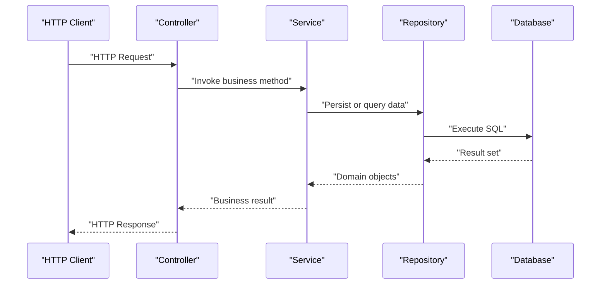
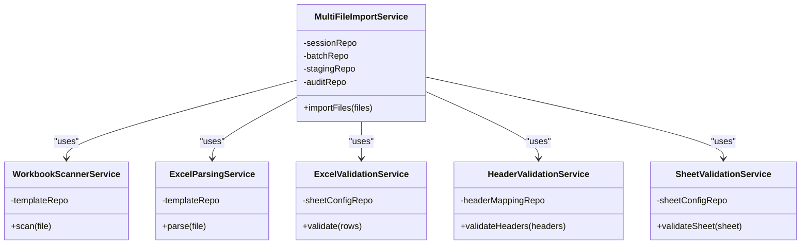
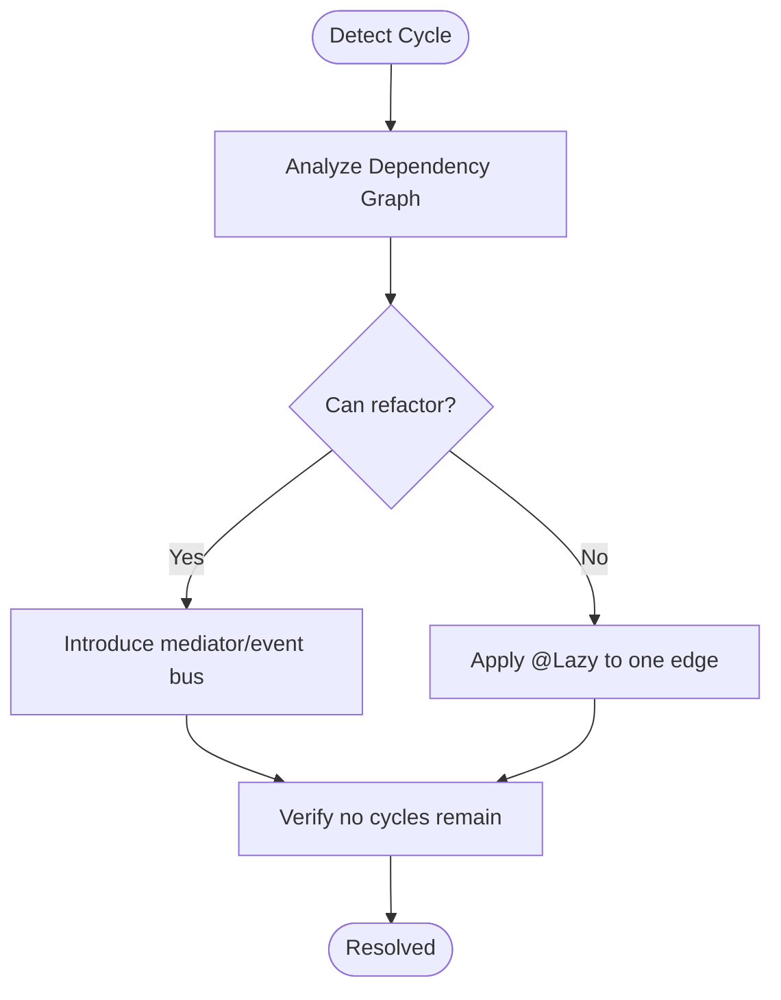
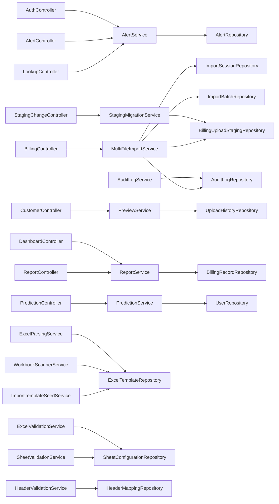

# Dependency Injection Container

<cite>
**Referenced Files in This Document**
- [BillingApplication.java](file://backend/src/main/java/com/ceb/billing/BillingApplication.java)
- [WebSecurityConfig.java](file://backend/src/main/java/com/ceb/billing/config/WebSecurityConfig.java)
- [UserDetailsServiceImpl.java](file://backend/src/main/java/com/ceb/billing/config/UserDetailsServiceImpl.java)
- [DatabaseInitializer.java](file://backend/src/main/java/com/ceb/billing/config/DatabaseInitializer.java)
- [AuthController.java](file://backend/src/main/java/com/ceb/billing/controllers/AuthController.java)
- [AlertService.java](file://backend/src/main/java/com/ceb/billing/services/AlertService.java)
- [AuditLogService.java](file://backend/src/main/java/com/ceb/billing/services/AuditLogService.java)
- [PredictionService.java](file://backend/src/main/java/com/ceb/billing/services/PredictionService.java)
- [ExcelParsingService.java](file://backend/src/main/java/com/ceb/billing/services/ExcelParsingService.java)
- [ExcelValidationService.java](file://backend/src/main/java/com/ceb/billing/services/ExcelValidationService.java)
- [HeaderValidationService.java](file://backend/src/main/java/com/ceb/billing/services/HeaderValidationService.java)
- [SheetValidationService.java](file://backend/src/main/java/com/ceb/billing/services/SheetValidationService.java)
- [WorkbookScannerService.java](file://backend/src/main/java/com/ceb/billing/services/WorkbookScannerService.java)
- [ImportTemplateSeedService.java](file://backend/src/main/java/com/ceb/billing/services/ImportTemplateSeedService.java)
- [StagingMigrationService.java](file://backend/src/main/java/com/ceb/billing/services/StagingMigrationService.java)
- [MultiFileImportService.java](file://backend/src/main/java/com/ceb/billing/services/MultiFileImportService.java)
- [PreviewService.java](file://backend/src/main/java/com/ceb/billing/services/PreviewService.java)
- [ReportService.java](file://backend/src/main/java/com/ceb/billing/services/ReportService.java)
- [AlertController.java](file://backend/src/main/java/com/ceb/billing/controllers/AlertController.java)
- [ApprovalController.java](file://backend/src/main/java/com/ceb/billing/controllers/ApprovalController.java)
- [BillingController.java](file://backend/src/main/java/com/ceb/billing/controllers/BillingController.java)
- [CustomerController.java](file://backend/src/main/java/com/ceb/billing/controllers/CustomerController.java)
- [DashboardController.java](file://backend/src/main/java/com/ceb/billing/controllers/DashboardController.java)
- [LookupController.java](file://backend/src/main/java/com/ceb/billing/controllers/LookupController.java)
- [PredictionController.java](file://backend/src/main/java/com/ceb/billing/controllers/PredictionController.java)
- [ReportController.java](file://backend/src/main/java/com/ceb/billing/controllers/ReportController.java)
- [StagingChangeController.java](file://backend/src/main/java/com/ceb/billing/controllers/StagingChangeController.java)
- [AlertRepository.java](file://backend/src/main/java/com/ceb/billing/repositories/AlertRepository.java)
- [ApprovalRequestRepository.java](file://backend/src/main/java/com/ceb/billing/repositories/ApprovalRequestRepository.java)
- [AuditLogRepository.java](file://backend/src/main/java/com/ceb/billing/repositories/AuditLogRepository.java)
- [BillingRecordRepository.java](file://backend/src/main/java/com/ceb/billing/repositories/BillingRecordRepository.java)
- [BillingUploadStagingRepository.java](file://backend/src/main/java/com/ceb/billing/repositories/BillingUploadStagingRepository.java)
- [CostCodeRepository.java](file://backend/src/main/java/com/ceb/billing/repositories/CostCodeRepository.java)
- [CustomerRepository.java](file://backend/src/main/java/com/ceb/billing/repositories/CustomerRepository.java)
- [ExcelTemplateRepository.java](file://backend/src/main/java/com/ceb/billing/repositories/ExcelTemplateRepository.java)
- [ExpenseCodeRepository.java](file://backend/src/main/java/com/ceb/billing/repositories/ExpenseCodeRepository.java)
- [HeaderMappingRepository.java](file://backend/src/main/java/com/ceb/billing/repositories/HeaderMappingRepository.java)
- [ImportAuditLogRepository.java](file://backend/src/main/java/com/ceb/billing/repositories/ImportAuditLogRepository.java)
- [ImportBatchRepository.java](file://backend/src/main/java/com/ceb/billing/repositories/ImportBatchRepository.java)
- [ImportSessionRepository.java](file://backend/src/main/java/com/ceb/billing/repositories/ImportSessionRepository.java)
- [NetTypeRepository.java](file://backend/src/main/java/com/ceb/billing/repositories/NetTypeRepository.java)
- [SheetConfigurationRepository.java](file://backend/src/main/java/com/ceb/billing/repositories/SheetConfigurationRepository.java)
- [StagingChangeLogRepository.java](file://backend/src/main/java/com/ceb/billing/repositories/StagingChangeLogRepository.java)
- [UploadHistoryRepository.java](file://backend/src/main/java/com/ceb/billing/repositories/UploadHistoryRepository.java)
- [UserRepository.java](file://backend/src/main/java/com/ceb/billing/repositories/UserRepository.java)
- [pom.xml](file://backend/pom.xml)
</cite>

## Table of Contents
1. [Introduction](#introduction)
2. [Project Structure](#project-structure)
3. [Core Components](#core-components)
4. [Architecture Overview](#architecture-overview)
5. [Detailed Component Analysis](#detailed-component-analysis)
6. [Dependency Analysis](#dependency-analysis)
7. [Performance Considerations](#performance-considerations)
8. [Troubleshooting Guide](#troubleshooting-guide)
9. [Conclusion](#conclusion)

## Introduction
This document explains how the Spring IoC container and dependency injection patterns are used in the project to wire controllers, services, repositories, and configuration components. It covers bean lifecycle management, scope definitions, injection strategies (constructor, field, method), configuration classes, component scanning, conditional bean creation, service composition, circular dependency resolution, testing with mocked dependencies, performance considerations, initialization order, and memory management. The goal is to provide both a conceptual overview and practical guidance grounded in the actual codebase structure.

## Project Structure
The backend follows a layered architecture:
- Controllers expose HTTP endpoints and depend on services.
- Services encapsulate business logic and depend on repositories and other services.
- Repositories extend Spring Data interfaces for persistence access.
- Configuration classes define security, data initialization, and application behavior.
- The application entry point enables component scanning and auto-configuration.

```mermaid
graph TB
subgraph "Entry Point"
App["BillingApplication"]
end
subgraph "Controllers"
C1["AuthController"]
C2["AlertController"]
C3["BillingController"]
C4["CustomerController"]
C5["DashboardController"]
C6["LookupController"]
C7["PredictionController"]
C8["ReportController"]
C9["StagingChangeController"]
end
subgraph "Services"
S1["AlertService"]
S2["AuditLogService"]
S3["PredictionService"]
S4["ExcelParsingService"]
S5["ExcelValidationService"]
S6["HeaderValidationService"]
S7["SheetValidationService"]
S8["WorkbookScannerService"]
S9["ImportTemplateSeedService"]
S10["StagingMigrationService"]
S11["MultiFileImportService"]
S12["PreviewService"]
S13["ReportService"]
end
subgraph "Repositories"
R1["AlertRepository"]
R2["ApprovalRequestRepository"]
R3["AuditLogRepository"]
R4["BillingRecordRepository"]
R5["BillingUploadStagingRepository"]
R6["CostCodeRepository"]
R7["CustomerRepository"]
R8["ExcelTemplateRepository"]
R9["ExpenseCodeRepository"]
R10["HeaderMappingRepository"]
R11["ImportAuditLogRepository"]
R12["ImportBatchRepository"]
R13["ImportSessionRepository"]
R14["NetTypeRepository"]
R15["SheetConfigurationRepository"]
R16["StagingChangeLogRepository"]
R17["UploadHistoryRepository"]
R18["UserRepository"]
end
subgraph "Config"
CFG1["WebSecurityConfig"]
CFG2["UserDetailsServiceImpl"]
CFG3["DatabaseInitializer"]
end
App --> C1
App --> C2
App --> C3
App --> C4
App --> C5
App --> C6
App --> C7
App --> C8
App --> C9
C1 --> S1
C2 --> S1
C3 --> S11
C4 --> S12
C5 --> S13
C6 --> S1
C7 --> S3
C8 --> S13
C9 --> S10
S1 --> R1
S2 --> R3
S3 --> R18
S4 --> R8
S5 --> R15
S6 --> R10
S7 --> R15
S8 --> R8
S9 --> R8
S10 --> R5
S11 --> R11
S12 --> R17
S13 --> R4
CFG1 --> CFG2
CFG3 --> R18
```

**Diagram sources**
- [BillingApplication.java](file://backend/src/main/java/com/ceb/billing/BillingApplication.java)
- [WebSecurityConfig.java](file://backend/src/main/java/com/ceb/billing/config/WebSecurityConfig.java)
- [UserDetailsServiceImpl.java](file://backend/src/main/java/com/ceb/billing/config/UserDetailsServiceImpl.java)
- [DatabaseInitializer.java](file://backend/src/main/java/com/ceb/billing/config/DatabaseInitializer.java)
- [AuthController.java](file://backend/src/main/java/com/ceb/billing/controllers/AuthController.java)
- [AlertService.java](file://backend/src/main/java/com/ceb/billing/services/AlertService.java)
- [AuditLogService.java](file://backend/src/main/java/com/ceb/billing/services/AuditLogService.java)
- [PredictionService.java](file://backend/src/main/java/com/ceb/billing/services/PredictionService.java)
- [ExcelParsingService.java](file://backend/src/main/java/com/ceb/billing/services/ExcelParsingService.java)
- [ExcelValidationService.java](file://backend/src/main/java/com/ceb/billing/services/ExcelValidationService.java)
- [HeaderValidationService.java](file://backend/src/main/java/com/ceb/billing/services/HeaderValidationService.java)
- [SheetValidationService.java](file://backend/src/main/java/com/ceb/billing/services/SheetValidationService.java)
- [WorkbookScannerService.java](file://backend/src/main/java/com/ceb/billing/services/WorkbookScannerService.java)
- [ImportTemplateSeedService.java](file://backend/src/main/java/com/ceb/billing/services/ImportTemplateSeedService.java)
- [StagingMigrationService.java](file://backend/src/main/java/com/ceb/billing/services/StagingMigrationService.java)
- [MultiFileImportService.java](file://backend/src/main/java/com/ceb/billing/services/MultiFileImportService.java)
- [PreviewService.java](file://backend/src/main/java/com/ceb/billing/services/PreviewService.java)
- [ReportService.java](file://backend/src/main/java/com/ceb/billing/services/ReportService.java)
- [AlertRepository.java](file://backend/src/main/java/com/ceb/billing/repositories/AlertRepository.java)
- [ApprovalRequestRepository.java](file://backend/src/main/java/com/ceb/billing/repositories/ApprovalRequestRepository.java)
- [AuditLogRepository.java](file://backend/src/main/java/com/ceb/billing/repositories/AuditLogRepository.java)
- [BillingRecordRepository.java](file://backend/src/main/java/com/ceb/billing/repositories/BillingRecordRepository.java)
- [BillingUploadStagingRepository.java](file://backend/src/main/java/com/ceb/billing/repositories/BillingUploadStagingRepository.java)
- [CostCodeRepository.java](file://backend/src/main/java/com/ceb/billing/repositories/CostCodeRepository.java)
- [CustomerRepository.java](file://backend/src/main/java/com/ceb/billing/repositories/CustomerRepository.java)
- [ExcelTemplateRepository.java](file://backend/src/main/java/com/ceb/billing/repositories/ExcelTemplateRepository.java)
- [ExpenseCodeRepository.java](file://backend/src/main/java/com/ceb/billing/repositories/ExpenseCodeRepository.java)
- [HeaderMappingRepository.java](file://backend/src/main/java/com/ceb/billing/repositories/HeaderMappingRepository.java)
- [ImportAuditLogRepository.java](file://backend/src/main/java/com/ceb/billing/repositories/ImportAuditLogRepository.java)
- [ImportBatchRepository.java](file://backend/src/main/java/com/ceb/billing/repositories/ImportBatchRepository.java)
- [ImportSessionRepository.java](file://backend/src/main/java/com/ceb/billing/repositories/ImportSessionRepository.java)
- [NetTypeRepository.java](file://backend/src/main/java/com/ceb/billing/repositories/NetTypeRepository.java)
- [SheetConfigurationRepository.java](file://backend/src/main/java/com/ceb/billing/repositories/SheetConfigurationRepository.java)
- [StagingChangeLogRepository.java](file://backend/src/main/java/com/ceb/billing/repositories/StagingChangeLogRepository.java)
- [UploadHistoryRepository.java](file://backend/src/main/java/com/ceb/billing/repositories/UploadHistoryRepository.java)
- [UserRepository.java](file://backend/src/main/java/com/ceb/billing/repositories/UserRepository.java)

**Section sources**
- [BillingApplication.java](file://backend/src/main/java/com/ceb/billing/BillingApplication.java)
- [pom.xml](file://backend/pom.xml)

## Core Components
- Application entry point: Enables component scanning and bootstraps the Spring context.
- Security configuration: Defines authentication and authorization beans and integrates user details service.
- User details service: Provides user loading for authentication.
- Database initializer: Performs startup tasks such as seeding or migration checks.
- Controllers: Expose REST endpoints and delegate to services.
- Services: Implement business logic and orchestrate repository calls and cross-cutting concerns.
- Repositories: Spring Data JPA interfaces that provide persistence operations.

Key responsibilities:
- Controllers focus on request handling and response formatting.
- Services encapsulate domain logic and coordinate multiple repositories.
- Repositories abstract database interactions via Spring Data JPA.
- Configuration classes centralize non-functional requirements like security and data initialization.

**Section sources**
- [BillingApplication.java](file://backend/src/main/java/com/ceb/billing/BillingApplication.java)
- [WebSecurityConfig.java](file://backend/src/main/java/com/ceb/billing/config/WebSecurityConfig.java)
- [UserDetailsServiceImpl.java](file://backend/src/main/java/com/ceb/billing/config/UserDetailsServiceImpl.java)
- [DatabaseInitializer.java](file://backend/src/main/java/com/ceb/billing/config/DatabaseInitializer.java)

## Architecture Overview
The system uses a layered design with clear separation of concerns. Controllers receive HTTP requests and call services. Services use repositories for persistence and may collaborate with other services. Configuration classes set up security and initialization behaviors. The Spring IoC container manages bean lifecycles and wiring.

[No sources needed since this diagram shows conceptual workflow, not actual code structure]

## Detailed Component Analysis

### Bean Lifecycle Management
Spring manages each bean through well-defined phases:
- Instantiation: The container creates the bean instance.
- Population: Dependencies are injected using constructor, field, or setter injection.
- Initialization: Post-construction callbacks run (e.g., @PostConstruct).
- Usage: The bean participates in application logic.
- Destruction: Cleanup occurs at shutdown (e.g., @PreDestroy).

Practical implications:
- Use constructors for required dependencies to ensure immutability and testability.
- Prefer @PostConstruct for lightweight setup; avoid heavy work there.
- Use @PreDestroy for resource cleanup.
- For long-running tasks, consider @EventListener or scheduled tasks instead of blocking initialization.

**Section sources**
- [WebSecurityConfig.java](file://backend/src/main/java/com/ceb/billing/config/WebSecurityConfig.java)
- [UserDetailsServiceImpl.java](file://backend/src/main/java/com/ceb/billing/config/UserDetailsServiceImpl.java)
- [DatabaseInitializer.java](file://backend/src/main/java/com/ceb/billing/config/DatabaseInitializer.java)

### Scope Definitions
Common scopes:
- singleton: Default; one instance per container.
- prototype: New instance per request.
- request/session/application: Web-scoped variants when applicable.

Guidance:
- Keep stateless services as singletons for performance.
- Avoid storing request-specific state in singleton beans; prefer passing it as parameters.
- Use thread-safe designs for shared mutable state if necessary.

**Section sources**
- [AlertService.java](file://backend/src/main/java/com/ceb/billing/services/AlertService.java)
- [AuditLogService.java](file://backend/src/main/java/com/ceb/billing/services/AuditLogService.java)
- [PredictionService.java](file://backend/src/main/java/com/ceb/billing/services/PredictionService.java)

### Injection Strategies
- Constructor injection: Preferred for required dependencies; improves clarity and testability.
- Field injection: Convenient but less explicit; can hinder testing and refactoring.
- Method injection: Useful for optional dependencies or post-processing.

Recommendations:
- Favor constructor injection for all mandatory collaborators.
- Reserve field injection for legacy code or frameworks requiring it.
- Use setter injection sparingly for optional dependencies.

**Section sources**
- [AuthController.java](file://backend/src/main/java/com/ceb/billing/controllers/AuthController.java)
- [AlertController.java](file://backend/src/main/java/com/ceb/billing/controllers/AlertController.java)
- [BillingController.java](file://backend/src/main/java/com/ceb/billing/controllers/BillingController.java)
- [CustomerController.java](file://backend/src/main/java/com/ceb/billing/controllers/CustomerController.java)
- [DashboardController.java](file://backend/src/main/java/com/ceb/billing/controllers/DashboardController.java)
- [LookupController.java](file://backend/src/main/java/com/ceb/billing/controllers/LookupController.java)
- [PredictionController.java](file://backend/src/main/java/com/ceb/billing/controllers/PredictionController.java)
- [ReportController.java](file://backend/src/main/java/com/ceb/billing/controllers/ReportController.java)
- [StagingChangeController.java](file://backend/src/main/java/com/ceb/billing/controllers/StagingChangeController.java)

### Configuration Classes and Component Scanning
- Application class enables component scanning and auto-configuration.
- Security configuration defines filters, entry points, and user details provider.
- Database initializer performs startup tasks.

Best practices:
- Keep configuration focused and modular.
- Use profiles to separate environment-specific settings.
- Leverage @Conditional annotations for feature toggles and environment-based activation.

**Section sources**
- [BillingApplication.java](file://backend/src/main/java/com/ceb/billing/BillingApplication.java)
- [WebSecurityConfig.java](file://backend/src/main/java/com/ceb/billing/config/WebSecurityConfig.java)
- [UserDetailsServiceImpl.java](file://backend/src/main/java/com/ceb/billing/config/UserDetailsServiceImpl.java)
- [DatabaseInitializer.java](file://backend/src/main/java/com/ceb/billing/config/DatabaseInitializer.java)

### Conditional Bean Creation
Use conditions to activate beans based on environment or features:
- @Profile for environment-based activation.
- @ConditionalOnProperty for property-driven toggles.
- @ConditionalOnMissingBean to allow overrides.

Example scenarios:
- Enable debug-only beans in development.
- Activate alternative implementations for third-party integrations.
- Conditionally configure security policies.

**Section sources**
- [WebSecurityConfig.java](file://backend/src/main/java/com/ceb/billing/config/WebSecurityConfig.java)
- [DatabaseInitializer.java](file://backend/src/main/java/com/ceb/billing/config/DatabaseInitializer.java)

### Service Composition and Collaboration
Services often compose multiple collaborators:
- Excel processing pipeline: parsing, validation, header mapping, sheet validation, workbook scanning.
- Import orchestration: multi-file import coordinating sessions, batches, staging, and audit logs.
- Reporting and preview services aggregating data from multiple repositories.

Design tips:
- Keep services cohesive around a single responsibility.
- Compose complex workflows by delegating to specialized services.
- Avoid tight coupling between services; use interfaces where appropriate.

**Diagram sources**
- [MultiFileImportService.java](file://backend/src/main/java/com/ceb/billing/services/MultiFileImportService.java)
- [WorkbookScannerService.java](file://backend/src/main/java/com/ceb/billing/services/WorkbookScannerService.java)
- [ExcelParsingService.java](file://backend/src/main/java/com/ceb/billing/services/ExcelParsingService.java)
- [ExcelValidationService.java](file://backend/src/main/java/com/ceb/billing/services/ExcelValidationService.java)
- [HeaderValidationService.java](file://backend/src/main/java/com/ceb/billing/services/HeaderValidationService.java)
- [SheetValidationService.java](file://backend/src/main/java/com/ceb/billing/services/SheetValidationService.java)

**Section sources**
- [MultiFileImportService.java](file://backend/src/main/java/com/ceb/billing/services/MultiFileImportService.java)
- [WorkbookScannerService.java](file://backend/src/main/java/com/ceb/billing/services/WorkbookScannerService.java)
- [ExcelParsingService.java](file://backend/src/main/java/com/ceb/billing/services/ExcelParsingService.java)
- [ExcelValidationService.java](file://backend/src/main/java/com/ceb/billing/services/ExcelValidationService.java)
- [HeaderValidationService.java](file://backend/src/main/java/com/ceb/billing/services/HeaderValidationService.java)
- [SheetValidationService.java](file://backend/src/main/java/com/ceb/billing/services/SheetValidationService.java)

### Circular Dependency Resolution
Symptoms:
- Startup failures due to cyclic references among beans.
- Hard-to-trace initialization errors.

Resolution strategies:
- Refactor to break cycles by introducing an intermediary service or event-driven decoupling.
- Use lazy initialization (@Lazy) for specific dependencies when refactoring is not immediately possible.
- Redesign to reduce tight coupling and favor composition over inheritance.

[No sources needed since this diagram shows conceptual workflow, not actual code structure]

### Testing with Mocked Dependencies
Approach:
- Use @ExtendWith(SpringExtension.class) and @MockBean to replace collaborators in tests.
- Prefer constructor injection to simplify test setup and assertions.
- Isolate unit tests by mocking repositories and external services.

Tips:
- Keep tests focused on behavior rather than implementation details.
- Use parameterized tests for varied inputs.
- Validate error paths and edge cases explicitly.

**Section sources**
- [AuthController.java](file://backend/src/main/java/com/ceb/billing/controllers/AuthController.java)
- [AlertService.java](file://backend/src/main/java/com/ceb/billing/services/AlertService.java)
- [PredictionService.java](file://backend/src/main/java/com/ceb/billing/services/PredictionService.java)

## Dependency Analysis
The following diagram highlights key relationships between controllers, services, and repositories.

**Diagram sources**
- [AuthController.java](file://backend/src/main/java/com/ceb/billing/controllers/AuthController.java)
- [AlertController.java](file://backend/src/main/java/com/ceb/billing/controllers/AlertController.java)
- [BillingController.java](file://backend/src/main/java/com/ceb/billing/controllers/BillingController.java)
- [CustomerController.java](file://backend/src/main/java/com/ceb/billing/controllers/CustomerController.java)
- [DashboardController.java](file://backend/src/main/java/com/ceb/billing/controllers/DashboardController.java)
- [LookupController.java](file://backend/src/main/java/com/ceb/billing/controllers/LookupController.java)
- [PredictionController.java](file://backend/src/main/java/com/ceb/billing/controllers/PredictionController.java)
- [ReportController.java](file://backend/src/main/java/com/ceb/billing/controllers/ReportController.java)
- [StagingChangeController.java](file://backend/src/main/java/com/ceb/billing/controllers/StagingChangeController.java)
- [AlertService.java](file://backend/src/main/java/com/ceb/billing/services/AlertService.java)
- [AuditLogService.java](file://backend/src/main/java/com/ceb/billing/services/AuditLogService.java)
- [PredictionService.java](file://backend/src/main/java/com/ceb/billing/services/PredictionService.java)
- [ExcelParsingService.java](file://backend/src/main/java/com/ceb/billing/services/ExcelParsingService.java)
- [ExcelValidationService.java](file://backend/src/main/java/com/ceb/billing/services/ExcelValidationService.java)
- [HeaderValidationService.java](file://backend/src/main/java/com/ceb/billing/services/HeaderValidationService.java)
- [SheetValidationService.java](file://backend/src/main/java/com/ceb/billing/services/SheetValidationService.java)
- [WorkbookScannerService.java](file://backend/src/main/java/com/ceb/billing/services/WorkbookScannerService.java)
- [ImportTemplateSeedService.java](file://backend/src/main/java/com/ceb/billing/services/ImportTemplateSeedService.java)
- [StagingMigrationService.java](file://backend/src/main/java/com/ceb/billing/services/StagingMigrationService.java)
- [MultiFileImportService.java](file://backend/src/main/java/com/ceb/billing/services/MultiFileImportService.java)
- [PreviewService.java](file://backend/src/main/java/com/ceb/billing/services/PreviewService.java)
- [ReportService.java](file://backend/src/main/java/com/ceb/billing/services/ReportService.java)
- [AlertRepository.java](file://backend/src/main/java/com/ceb/billing/repositories/AlertRepository.java)
- [AuditLogRepository.java](file://backend/src/main/java/com/ceb/billing/repositories/AuditLogRepository.java)
- [UserRepository.java](file://backend/src/main/java/com/ceb/billing/repositories/UserRepository.java)
- [ExcelTemplateRepository.java](file://backend/src/main/java/com/ceb/billing/repositories/ExcelTemplateRepository.java)
- [SheetConfigurationRepository.java](file://backend/src/main/java/com/ceb/billing/repositories/SheetConfigurationRepository.java)
- [HeaderMappingRepository.java](file://backend/src/main/java/com/ceb/billing/repositories/HeaderMappingRepository.java)
- [BillingUploadStagingRepository.java](file://backend/src/main/java/com/ceb/billing/repositories/BillingUploadStagingRepository.java)
- [ImportSessionRepository.java](file://backend/src/main/java/com/ceb/billing/repositories/ImportSessionRepository.java)
- [ImportBatchRepository.java](file://backend/src/main/java/com/ceb/billing/repositories/ImportBatchRepository.java)
- [UploadHistoryRepository.java](file://backend/src/main/java/com/ceb/billing/repositories/UploadHistoryRepository.java)
- [BillingRecordRepository.java](file://backend/src/main/java/com/ceb/billing/repositories/BillingRecordRepository.java)

**Section sources**
- [pom.xml](file://backend/pom.xml)

## Performance Considerations
- Bean scope: Prefer singleton for stateless services to minimize object creation overhead.
- Lazy initialization: Use @Lazy for expensive beans or those rarely used to speed up startup.
- Repository efficiency: Ensure proper indexing and pagination to avoid large result sets.
- Transaction boundaries: Keep transactions short and focused to reduce lock contention.
- Memory management: Avoid holding large datasets in memory; stream results where possible.
- Initialization order: Use @DependsOn judiciously; prefer event-driven or listener-based approaches for decoupled startup tasks.

[No sources needed since this section provides general guidance]

## Troubleshooting Guide
Common issues and remedies:
- Circular dependencies: Refactor to remove cycles or apply @Lazy selectively.
- Bean not found: Verify component scanning packages and bean visibility.
- Authentication failures: Check security configuration and user details service wiring.
- Data initialization problems: Inspect initializer logic and database connectivity.

Debugging steps:
- Enable Spring debug logging to inspect bean creation and wiring.
- Use actuator endpoints to list beans and health status.
- Validate repository queries and entity mappings.

**Section sources**
- [WebSecurityConfig.java](file://backend/src/main/java/com/ceb/billing/config/WebSecurityConfig.java)
- [UserDetailsServiceImpl.java](file://backend/src/main/java/com/ceb/billing/config/UserDetailsServiceImpl.java)
- [DatabaseInitializer.java](file://backend/src/main/java/com/ceb/billing/config/DatabaseInitializer.java)

## Conclusion
This project demonstrates a clean separation of concerns with Spring IoC managing bean lifecycles and dependencies. Constructors should be preferred for injection, services should remain stateless and composable, and configuration should be modular and conditional. By following these patterns, the application achieves maintainability, testability, and performance. Addressing circular dependencies early and designing for testability ensures robustness across environments.