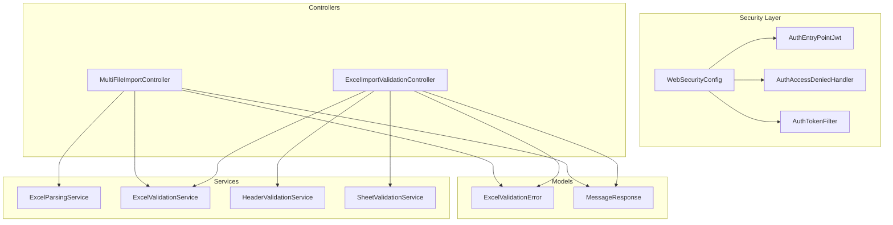
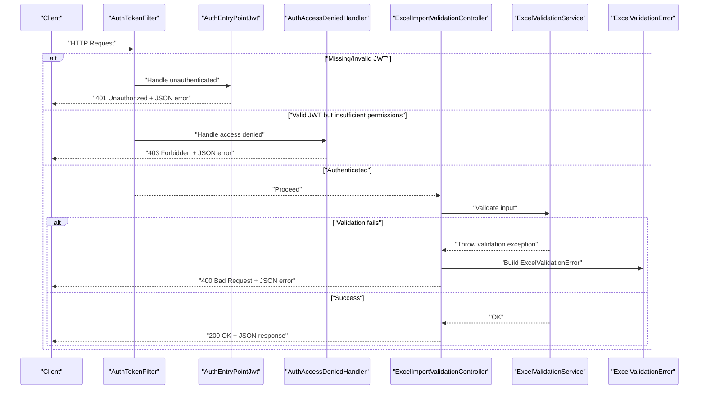
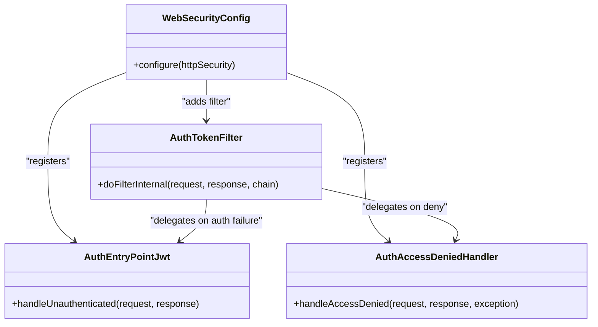
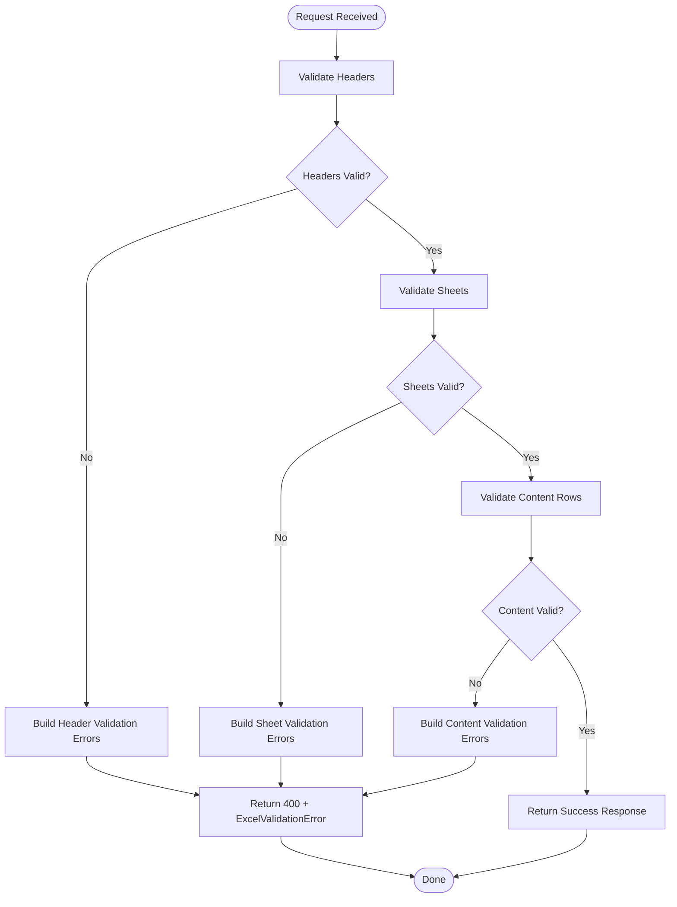
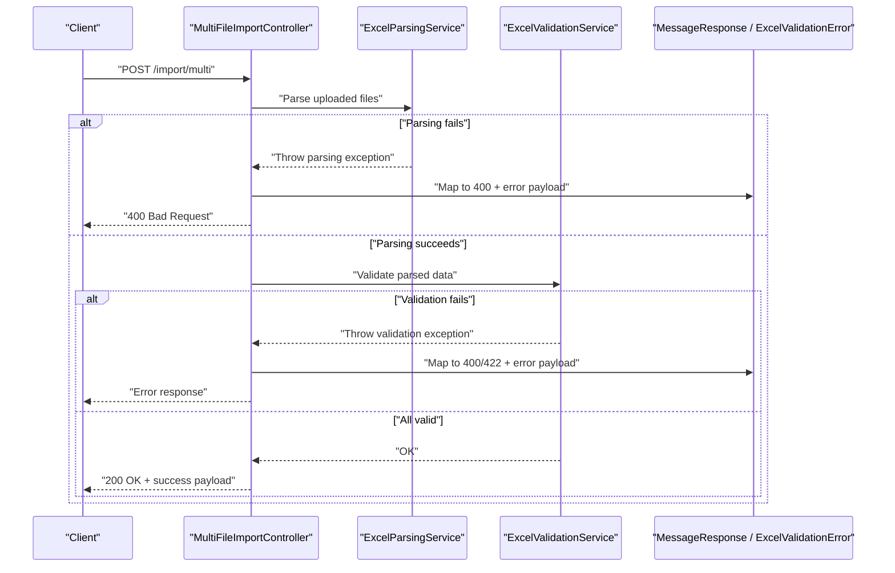
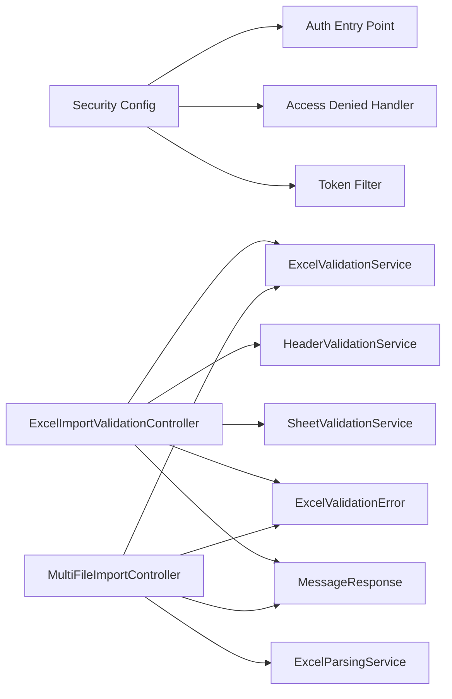

# Error Handling Strategies

<cite>
**Referenced Files in This Document**
- [AuthEntryPointJwt.java](file://backend/src/main/java/com/ceb/billing/config/AuthEntryPointJwt.java)
- [AuthAccessDeniedHandler.java](file://backend/src/main/java/com/ceb/billing/config/AuthAccessDeniedHandler.java)
- [WebSecurityConfig.java](file://backend/src/main/java/com/ceb/billing/config/WebSecurityConfig.java)
- [AuthTokenFilter.java](file://backend/src/main/java/com/ceb/billing/config/AuthTokenFilter.java)
- [ExcelValidationError.java](file://backend/src/main/java/com/ceb/billing/models/ExcelValidationError.java)
- [MessageResponse.java](file://backend/src/main/java/com/ceb/billing/models/MessageResponse.java)
- [ExcelImportValidationController.java](file://backend/src/main/java/com/ceb/billing/controllers/ExcelImportValidationController.java)
- [MultiFileImportController.java](file://backend/src/main/java/com/ceb/billing/controllers/MultiFileImportController.java)
- [ExcelParsingService.java](file://backend/src/main/java/com/ceb/billing/services/ExcelParsingService.java)
- [ExcelValidationService.java](file://backend/src/main/java/com/ceb/billing/services/ExcelValidationService.java)
- [HeaderValidationService.java](file://backend/src/main/java/com/ceb/billing/services/HeaderValidationService.java)
- [SheetValidationService.java](file://backend/src/main/java/com/ceb/billing/services/SheetValidationService.java)
- [application.properties](file://backend/src/main/resources/application.properties)
</cite>

## Table of Contents
1. [Introduction](#introduction)
2. [Project Structure](#project-structure)
3. [Core Components](#core-components)
4. [Architecture Overview](#architecture-overview)
5. [Detailed Component Analysis](#detailed-component-analysis)
6. [Dependency Analysis](#dependency-analysis)
7. [Performance Considerations](#performance-considerations)
8. [Troubleshooting Guide](#troubleshooting-guide)
9. [Conclusion](#conclusion)
10. [Appendices](#appendices)

## Introduction
This document explains the centralized error handling and exception management strategies implemented in the backend. It covers global exception handling, authentication and authorization error responses, validation error formatting, business rule violations, logging, debugging techniques, production monitoring considerations, internationalization (i18n), and API versioning implications for error responses. The goal is to provide a clear, actionable guide for developers to understand how errors are propagated, formatted, and returned to clients consistently across the application.

## Project Structure
The error handling strategy spans configuration, controllers, services, and shared models:
- Security configuration defines entry points and access denied handlers for unauthenticated and unauthorized requests.
- Controllers expose endpoints that return structured error responses for validation failures and business rule violations.
- Services encapsulate domain logic and throw exceptions or return structured results that controllers translate into HTTP responses.
- Shared models define consistent response shapes used by both success and error paths.

**Diagram sources**
- [WebSecurityConfig.java](file://backend/src/main/java/com/ceb/billing/config/WebSecurityConfig.java)
- [AuthEntryPointJwt.java](file://backend/src/main/java/com/ceb/billing/config/AuthEntryPointJwt.java)
- [AuthAccessDeniedHandler.java](file://backend/src/main/java/com/ceb/billing/config/AuthAccessDeniedHandler.java)
- [AuthTokenFilter.java](file://backend/src/main/java/com/ceb/billing/config/AuthTokenFilter.java)
- [ExcelImportValidationController.java](file://backend/src/main/java/com/ceb/billing/controllers/ExcelImportValidationController.java)
- [MultiFileImportController.java](file://backend/src/main/java/com/ceb/billing/controllers/MultiFileImportController.java)
- [ExcelParsingService.java](file://backend/src/main/java/com/ceb/billing/services/ExcelParsingService.java)
- [ExcelValidationService.java](file://backend/src/main/java/com/ceb/billing/services/ExcelValidationService.java)
- [HeaderValidationService.java](file://backend/src/main/java/com/ceb/billing/services/HeaderValidationService.java)
- [SheetValidationService.java](file://backend/src/main/java/com/ceb/billing/services/SheetValidationService.java)
- [ExcelValidationError.java](file://backend/src/main/java/com/ceb/billing/models/ExcelValidationError.java)
- [MessageResponse.java](file://backend/src/main/java/com/ceb/billing/models/MessageResponse.java)

**Section sources**
- [WebSecurityConfig.java](file://backend/src/main/java/com/ceb/billing/config/WebSecurityConfig.java)
- [AuthEntryPointJwt.java](file://backend/src/main/java/com/ceb/billing/config/AuthEntryPointJwt.java)
- [AuthAccessDeniedHandler.java](file://backend/src/main/java/com/ceb/billing/config/AuthAccessDeniedHandler.java)
- [AuthTokenFilter.java](file://backend/src/main/java/com/ceb/billing/config/AuthTokenFilter.java)
- [ExcelImportValidationController.java](file://backend/src/main/java/com/ceb/billing/controllers/ExcelImportValidationController.java)
- [MultiFileImportController.java](file://backend/src/main/java/com/ceb/billing/controllers/MultiFileImportController.java)
- [ExcelParsingService.java](file://backend/src/main/java/com/ceb/billing/services/ExcelParsingService.java)
- [ExcelValidationService.java](file://backend/src/main/java/com/ceb/billing/services/ExcelValidationService.java)
- [HeaderValidationService.java](file://backend/src/main/java/com/ceb/billing/services/HeaderValidationService.java)
- [SheetValidationService.java](file://backend/src/main/java/com/ceb/billing/services/SheetValidationService.java)
- [ExcelValidationError.java](file://backend/src/main/java/com/ceb/billing/models/ExcelValidationError.java)
- [MessageResponse.java](file://backend/src/main/java/com/ceb/billing/models/MessageResponse.java)

## Core Components
- Global security error handling:
  - Unauthenticated requests are handled by an entry point that returns a standardized JSON error with appropriate HTTP status codes.
  - Unauthorized access attempts are handled by an access denied handler that returns a consistent forbidden response.
- Validation error model:
  - A dedicated model represents validation errors with details such as row/column information and messages, enabling rich client-side feedback.
- Message response model:
  - A simple message wrapper is used for general informational or error messages.
- Controllers:
  - Import validation controller orchestrates validation flows and returns structured error responses when inputs fail validation.
  - Multi-file import controller manages batch imports and translates service-level issues into user-friendly responses.
- Services:
  - Parsing and validation services implement business rules and raise exceptions or return structured results consumed by controllers.

Key responsibilities:
- Centralize error shaping at the boundaries (controllers and security layer).
- Keep business logic free of HTTP concerns; use exceptions or result objects to signal failures.
- Provide consistent error payloads for clients to parse and display friendly messages.

**Section sources**
- [AuthEntryPointJwt.java](file://backend/src/main/java/com/ceb/billing/config/AuthEntryPointJwt.java)
- [AuthAccessDeniedHandler.java](file://backend/src/main/java/com/ceb/billing/config/AuthAccessDeniedHandler.java)
- [ExcelValidationError.java](file://backend/src/main/java/com/ceb/billing/models/ExcelValidationError.java)
- [MessageResponse.java](file://backend/src/main/java/com/ceb/billing/models/MessageResponse.java)
- [ExcelImportValidationController.java](file://backend/src/main/java/com/ceb/billing/controllers/ExcelImportValidationController.java)
- [MultiFileImportController.java](file://backend/src/main/java/com/ceb/billing/controllers/MultiFileImportController.java)
- [ExcelParsingService.java](file://backend/src/main/java/com/ceb/billing/services/ExcelParsingService.java)
- [ExcelValidationService.java](file://backend/src/main/java/com/ceb/billing/services/ExcelValidationService.java)
- [HeaderValidationService.java](file://backend/src/main/java/com/ceb/billing/services/HeaderValidationService.java)
- [SheetValidationService.java](file://backend/src/main/java/com/ceb/billing/services/SheetValidationService.java)

## Architecture Overview
The request lifecycle includes security checks, controller dispatch, service execution, and error translation back to the client. Authentication and authorization failures are intercepted early by Spring Security components. Validation and business rule errors are raised within services and translated by controllers into structured responses.

**Diagram sources**
- [AuthTokenFilter.java](file://backend/src/main/java/com/ceb/billing/config/AuthTokenFilter.java)
- [AuthEntryPointJwt.java](file://backend/src/main/java/com/ceb/billing/config/AuthEntryPointJwt.java)
- [AuthAccessDeniedHandler.java](file://backend/src/main/java/com/ceb/billing/config/AuthAccessDeniedHandler.java)
- [ExcelImportValidationController.java](file://backend/src/main/java/com/ceb/billing/controllers/ExcelImportValidationController.java)
- [ExcelValidationService.java](file://backend/src/main/java/com/ceb/billing/services/ExcelValidationService.java)
- [ExcelValidationError.java](file://backend/src/main/java/com/ceb/billing/models/ExcelValidationError.java)

## Detailed Component Analysis

### Authentication and Authorization Error Responses
- Unauthenticated requests:
  - An entry point component intercepts missing or invalid tokens and responds with a 401 Unauthorized status and a JSON body describing the issue.
- Access denied:
  - An access denied handler intercepts insufficient privileges and responds with a 403 Forbidden status and a JSON body indicating lack of permission.
- Token filter:
  - The token filter validates JWT presence and claims before reaching controllers. On failure, it delegates to the entry point or access denied handler accordingly.

**Diagram sources**
- [WebSecurityConfig.java](file://backend/src/main/java/com/ceb/billing/config/WebSecurityConfig.java)
- [AuthEntryPointJwt.java](file://backend/src/main/java/com/ceb/billing/config/AuthEntryPointJwt.java)
- [AuthAccessDeniedHandler.java](file://backend/src/main/java/com/ceb/billing/config/AuthAccessDeniedHandler.java)
- [AuthTokenFilter.java](file://backend/src/main/java/com/ceb/billing/config/AuthTokenFilter.java)

**Section sources**
- [AuthEntryPointJwt.java](file://backend/src/main/java/com/ceb/billing/config/AuthEntryPointJwt.java)
- [AuthAccessDeniedHandler.java](file://backend/src/main/java/com/ceb/billing/config/AuthAccessDeniedHandler.java)
- [AuthTokenFilter.java](file://backend/src/main/java/com/ceb/billing/config/AuthTokenFilter.java)
- [WebSecurityConfig.java](file://backend/src/main/java/com/ceb/billing/config/WebSecurityConfig.java)

### Validation Error Formatting
- Validation error model:
  - A dedicated model captures detailed validation failures including row/column indices and human-readable messages. This enables precise client-side highlighting and localized messaging.
- Controller orchestration:
  - The import validation controller coordinates header, sheet, and content validations. When validation fails, it constructs a response using the validation error model and returns a 400 Bad Request.
- Service contracts:
  - Validation services perform checks and either throw exceptions or return structured results. Controllers translate these into consistent error responses.

**Diagram sources**
- [ExcelImportValidationController.java](file://backend/src/main/java/com/ceb/billing/controllers/ExcelImportValidationController.java)
- [HeaderValidationService.java](file://backend/src/main/java/com/ceb/billing/services/HeaderValidationService.java)
- [SheetValidationService.java](file://backend/src/main/java/com/ceb/billing/services/SheetValidationService.java)
- [ExcelValidationService.java](file://backend/src/main/java/com/ceb/billing/services/ExcelValidationService.java)
- [ExcelValidationError.java](file://backend/src/main/java/com/ceb/billing/models/ExcelValidationError.java)

**Section sources**
- [ExcelImportValidationController.java](file://backend/src/main/java/com/ceb/billing/controllers/ExcelImportValidationController.java)
- [HeaderValidationService.java](file://backend/src/main/java/com/ceb/billing/services/HeaderValidationService.java)
- [SheetValidationService.java](file://backend/src/main/java/com/ceb/billing/services/SheetValidationService.java)
- [ExcelValidationService.java](file://backend/src/main/java/com/ceb/billing/services/ExcelValidationService.java)
- [ExcelValidationError.java](file://backend/src/main/java/com/ceb/billing/models/ExcelValidationError.java)

### Business Rule Violation Handling
- Service-layer violations:
  - Business rules enforced in parsing and validation services should raise specific exceptions or return structured results indicating the violation.
- Controller translation:
  - Controllers catch service-level exceptions and map them to appropriate HTTP statuses (e.g., 400 for bad input, 422 for semantic errors) along with a user-friendly message payload.
- Example flow:
  - Multi-file import controller invokes parsing and validation services. If a file contains incompatible data or violates constraints, the controller builds a response using the message or validation error model and returns a suitable status code.

**Diagram sources**
- [MultiFileImportController.java](file://backend/src/main/java/com/ceb/billing/controllers/MultiFileImportController.java)
- [ExcelParsingService.java](file://backend/src/main/java/com/ceb/billing/services/ExcelParsingService.java)
- [ExcelValidationService.java](file://backend/src/main/java/com/ceb/billing/services/ExcelValidationService.java)
- [MessageResponse.java](file://backend/src/main/java/com/ceb/billing/models/MessageResponse.java)
- [ExcelValidationError.java](file://backend/src/main/java/com/ceb/billing/models/ExcelValidationError.java)

**Section sources**
- [MultiFileImportController.java](file://backend/src/main/java/com/ceb/billing/controllers/MultiFileImportController.java)
- [ExcelParsingService.java](file://backend/src/main/java/com/ceb/billing/services/ExcelParsingService.java)
- [ExcelValidationService.java](file://backend/src/main/java/com/ceb/billing/services/ExcelValidationService.java)
- [MessageResponse.java](file://backend/src/main/java/com/ceb/billing/models/MessageResponse.java)
- [ExcelValidationError.java](file://backend/src/main/java/com/ceb/billing/models/ExcelValidationError.java)

### Logging, Debugging, and Production Monitoring
- Logging strategy:
  - Use structured logging for all error paths, including correlation IDs, request context, and sanitized payloads. Avoid logging sensitive data.
- Debugging techniques:
  - Enable verbose logs during development via configuration properties. Include stack traces only in non-production environments.
- Production monitoring:
  - Aggregate logs centrally and set up alerts for recurring error patterns. Track metrics like error rates, latency, and validation failure hotspots.

Configuration reference:
- Application properties can control logging levels and feature toggles relevant to error visibility.

**Section sources**
- [application.properties](file://backend/src/main/resources/application.properties)

### Internationalization (i18n) of Error Messages
- Strategy:
  - Externalize error messages into resource bundles keyed by locale. Map exception types or validation codes to message keys.
- Implementation guidance:
  - In controllers or a central error translator, resolve messages based on the Accept-Language header or a default fallback.
- Benefits:
  - Consistent, localized user-facing messages without changing business logic.

[No sources needed since this section provides general guidance]

### API Versioning Considerations for Errors
- Backward compatibility:
  - Maintain stable error response schemas across versions. Introduce new fields cautiously and deprecate old ones gradually.
- Version negotiation:
  - Use URL path or header-based versioning. Ensure older clients receive compatible error structures even if new fields are added.
- Migration plan:
  - Document breaking changes in error payloads and provide migration guides for clients.

[No sources needed since this section provides general guidance]

## Dependency Analysis
The following diagram shows how error handling components depend on each other and where they integrate with controllers and services.

**Diagram sources**
- [WebSecurityConfig.java](file://backend/src/main/java/com/ceb/billing/config/WebSecurityConfig.java)
- [AuthEntryPointJwt.java](file://backend/src/main/java/com/ceb/billing/config/AuthEntryPointJwt.java)
- [AuthAccessDeniedHandler.java](file://backend/src/main/java/com/ceb/billing/config/AuthAccessDeniedHandler.java)
- [AuthTokenFilter.java](file://backend/src/main/java/com/ceb/billing/config/AuthTokenFilter.java)
- [ExcelImportValidationController.java](file://backend/src/main/java/com/ceb/billing/controllers/ExcelImportValidationController.java)
- [MultiFileImportController.java](file://backend/src/main/java/com/ceb/billing/controllers/MultiFileImportController.java)
- [ExcelParsingService.java](file://backend/src/main/java/com/ceb/billing/services/ExcelParsingService.java)
- [ExcelValidationService.java](file://backend/src/main/java/com/ceb/billing/services/ExcelValidationService.java)
- [HeaderValidationService.java](file://backend/src/main/java/com/ceb/billing/services/HeaderValidationService.java)
- [SheetValidationService.java](file://backend/src/main/java/com/ceb/billing/services/SheetValidationService.java)
- [ExcelValidationError.java](file://backend/src/main/java/com/ceb/billing/models/ExcelValidationError.java)
- [MessageResponse.java](file://backend/src/main/java/com/ceb/billing/models/MessageResponse.java)

**Section sources**
- [WebSecurityConfig.java](file://backend/src/main/java/com/ceb/billing/config/WebSecurityConfig.java)
- [AuthEntryPointJwt.java](file://backend/src/main/java/com/ceb/billing/config/AuthEntryPointJwt.java)
- [AuthAccessDeniedHandler.java](file://backend/src/main/java/com/ceb/billing/config/AuthAccessDeniedHandler.java)
- [AuthTokenFilter.java](file://backend/src/main/java/com/ceb/billing/config/AuthTokenFilter.java)
- [ExcelImportValidationController.java](file://backend/src/main/java/com/ceb/billing/controllers/ExcelImportValidationController.java)
- [MultiFileImportController.java](file://backend/src/main/java/com/ceb/billing/controllers/MultiFileImportController.java)
- [ExcelParsingService.java](file://backend/src/main/java/com/ceb/billing/services/ExcelParsingService.java)
- [ExcelValidationService.java](file://backend/src/main/java/com/ceb/billing/services/ExcelValidationService.java)
- [HeaderValidationService.java](file://backend/src/main/java/com/ceb/billing/services/HeaderValidationService.java)
- [SheetValidationService.java](file://backend/src/main/java/com/ceb/billing/services/SheetValidationService.java)
- [ExcelValidationError.java](file://backend/src/main/java/com/ceb/billing/models/ExcelValidationError.java)
- [MessageResponse.java](file://backend/src/main/java/com/ceb/billing/models/MessageResponse.java)

## Performance Considerations
- Minimize overhead in error paths:
  - Avoid heavy computations in exception constructors. Defer expensive operations until necessary.
- Batch validation:
  - Collect multiple validation errors in a single pass to reduce round-trips and improve UX.
- Streaming large uploads:
  - For multi-file imports, stream and validate incrementally to prevent memory spikes.
- Caching static validation rules:
  - Cache lookup tables and templates used in validation to reduce repeated I/O.

[No sources needed since this section provides general guidance]

## Troubleshooting Guide
Common issues and resolutions:
- 401 Unauthorized:
  - Verify JWT presence and validity. Check token filter configuration and expiration settings.
- 403 Forbidden:
  - Confirm user roles and endpoint authorization rules. Review access denied handler behavior.
- 400 Bad Request:
  - Inspect validation error payloads for row/column details and messages. Ensure client maps these to UI feedback.
- 422 Unprocessable Entity:
  - Indicates semantic validation failures. Review business rule exceptions and their mapping in controllers.
- Logging gaps:
  - Ensure correlation IDs are propagated through filters and services. Add contextual logs around critical sections.

Operational tips:
- Enable debug logs temporarily for problematic endpoints.
- Use health check endpoints to verify system readiness.
- Monitor error rate dashboards and set up alerts for anomalies.

**Section sources**
- [AuthEntryPointJwt.java](file://backend/src/main/java/com/ceb/billing/config/AuthEntryPointJwt.java)
- [AuthAccessDeniedHandler.java](file://backend/src/main/java/com/ceb/billing/config/AuthAccessDeniedHandler.java)
- [AuthTokenFilter.java](file://backend/src/main/java/com/ceb/billing/config/AuthTokenFilter.java)
- [ExcelImportValidationController.java](file://backend/src/main/java/com/ceb/billing/controllers/ExcelImportValidationController.java)
- [MultiFileImportController.java](file://backend/src/main/java/com/ceb/billing/controllers/MultiFileImportController.java)
- [ExcelValidationError.java](file://backend/src/main/java/com/ceb/billing/models/ExcelValidationError.java)
- [MessageResponse.java](file://backend/src/main/java/com/ceb/billing/models/MessageResponse.java)

## Conclusion
The backend implements a cohesive error handling strategy centered on security interception, structured validation errors, and consistent controller-level translations. By separating concerns between services (business logic) and controllers/security (error shaping), the system ensures predictable, client-friendly responses. Extending i18n, strengthening logging, and planning for API versioning will further enhance reliability and maintainability.

[No sources needed since this section summarizes without analyzing specific files]

## Appendices

### Appendix A: Error Response Schemas
- General message response:
  - Fields include a message string and optional metadata for context.
- Validation error response:
  - Includes a list of validation entries with row/column indices and localized messages.

[No sources needed since this section provides general guidance]

### Appendix B: Configuration References
- Logging levels and feature flags:
  - Adjusted via application properties to support development and production needs.

**Section sources**
- [application.properties](file://backend/src/main/resources/application.properties)