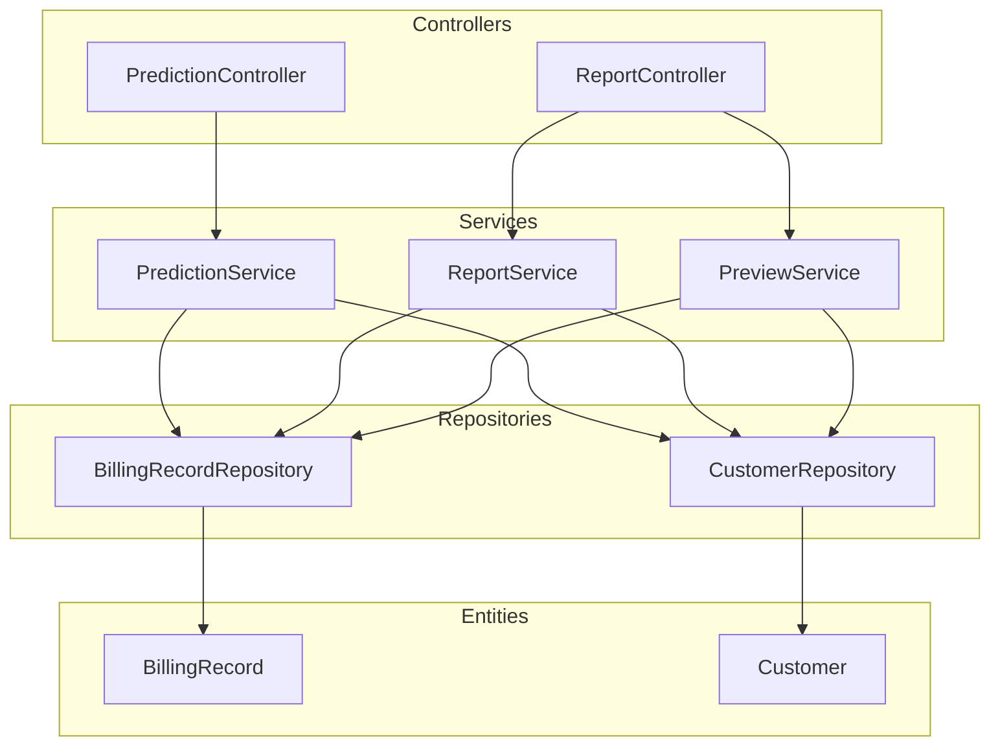
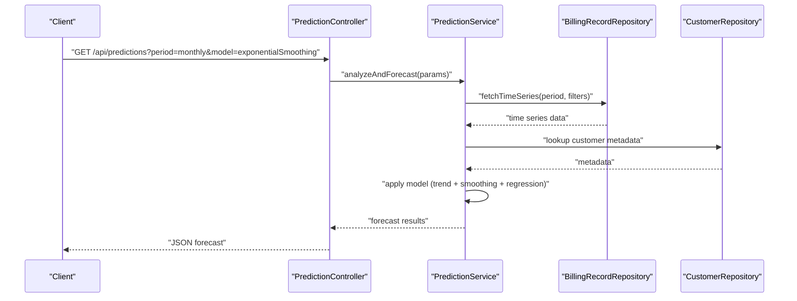
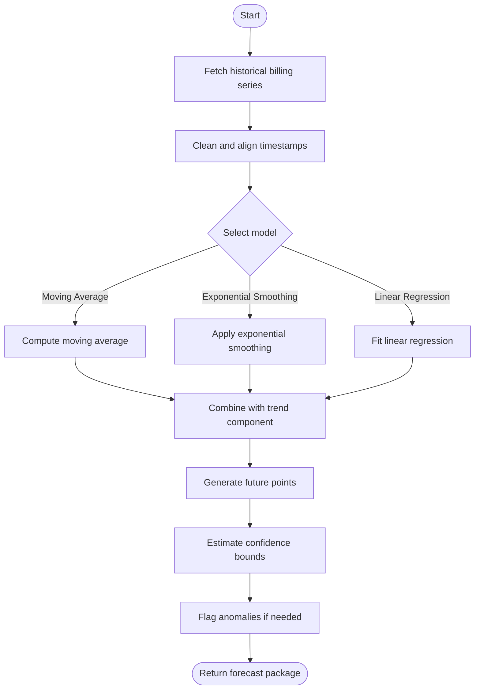
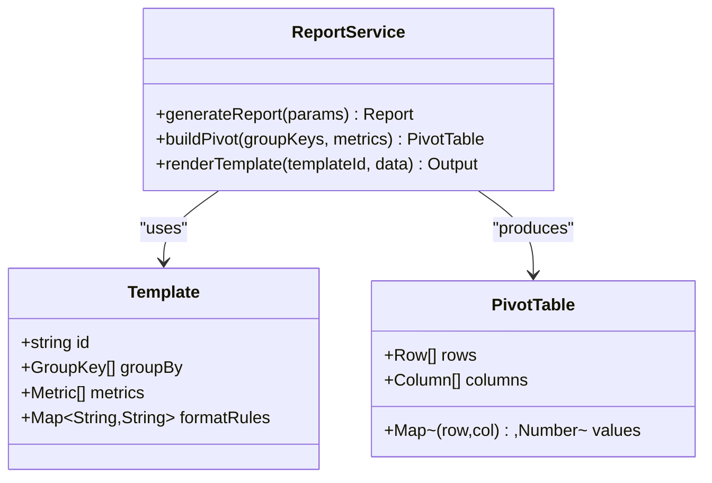
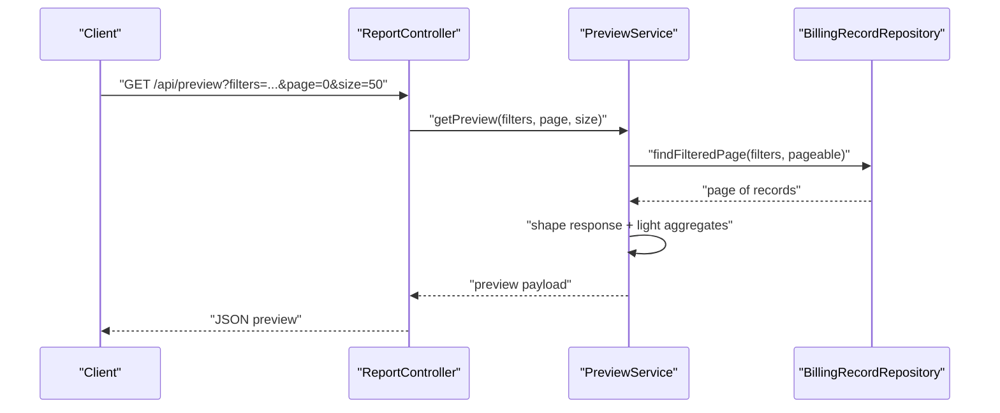
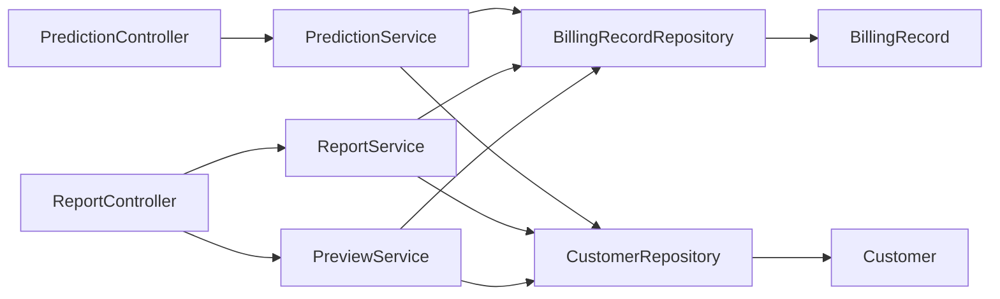

# Analytics and Prediction Services

<cite>
**Referenced Files in This Document**
- [PredictionService.java](file://backend/src/main/java/com/ceb/billing/services/PredictionService.java)
- [ReportService.java](file://backend/src/main/java/com/ceb/billing/services/ReportService.java)
- [PreviewService.java](file://backend/src/main/java/com/ceb/billing/services/PreviewService.java)
- [PredictionController.java](file://backend/src/main/java/com/ceb/billing/controllers/PredictionController.java)
- [ReportController.java](file://backend/src/main/java/com/ceb/billing/controllers/ReportController.java)
- [BillingRecordRepository.java](file://backend/src/main/java/com/ceb/billing/repositories/BillingRecordRepository.java)
- [CustomerRepository.java](file://backend/src/main/java/com/ceb/billing/repositories/CustomerRepository.java)
- [BillingRecord.java](file://backend/src/main/java/com/ceb/billing/entities/BillingRecord.java)
- [Customer.java](file://backend/src/main/java/com/ceb/billing/entities/Customer.java)
</cite>

## Table of Contents
1. [Introduction](#introduction)
2. [Project Structure](#project-structure)
3. [Core Components](#core-components)
4. [Architecture Overview](#architecture-overview)
5. [Detailed Component Analysis](#detailed-component-analysis)
6. [Dependency Analysis](#dependency-analysis)
7. [Performance Considerations](#performance-considerations)
8. [Troubleshooting Guide](#troubleshooting-guide)
9. [Conclusion](#conclusion)

## Introduction
This document explains the analytics and prediction services that power billing trend analysis, forecasting, reporting, and real-time data preview. It focuses on:
- PredictionService algorithms for billing trend analysis and forecasting
- ReportService for generating comprehensive reports and aggregations
- PreviewService for real-time data preview functionality
It also covers statistical methods used, caching strategies, report template system, data visualization preparation, example workflows, and query optimization techniques.

## Project Structure
The analytics and prediction capabilities are implemented as backend services with corresponding controllers exposing REST endpoints. Data access is handled via Spring Data repositories against JPA entities.

**Diagram sources**
- [PredictionController.java](file://backend/src/main/java/com/ceb/billing/controllers/PredictionController.java)
- [ReportController.java](file://backend/src/main/java/com/ceb/billing/controllers/ReportController.java)
- [PredictionService.java](file://backend/src/main/java/com/ceb/billing/services/PredictionService.java)
- [ReportService.java](file://backend/src/main/java/com/ceb/billing/services/ReportService.java)
- [PreviewService.java](file://backend/src/main/java/com/ceb/billing/services/PreviewService.java)
- [BillingRecordRepository.java](file://backend/src/main/java/com/ceb/billing/repositories/BillingRecordRepository.java)
- [CustomerRepository.java](file://backend/src/main/java/com/ceb/billing/repositories/CustomerRepository.java)
- [BillingRecord.java](file://backend/src/main/java/com/ceb/billing/entities/BillingRecord.java)
- [Customer.java](file://backend/src/main/java/com/ceb/billing/entities/Customer.java)

**Section sources**
- [PredictionController.java](file://backend/src/main/java/com/ceb/billing/controllers/PredictionController.java)
- [ReportController.java](file://backend/src/main/java/com/ceb/billing/controllers/ReportController.java)
- [PredictionService.java](file://backend/src/main/java/com/ceb/billing/services/PredictionService.java)
- [ReportService.java](file://backend/src/main/java/com/ceb/billing/services/ReportService.java)
- [PreviewService.java](file://backend/src/main/java/com/ceb/billing/services/PreviewService.java)
- [BillingRecordRepository.java](file://backend/src/main/java/com/ceb/billing/repositories/BillingRecordRepository.java)
- [CustomerRepository.java](file://backend/src/main/java/com/ceb/billing/repositories/CustomerRepository.java)
- [BillingRecord.java](file://backend/src/main/java/com/ceb/billing/entities/BillingRecord.java)
- [Customer.java](file://backend/src/main/java/com/ceb/billing/entities/Customer.java)

## Core Components
- PredictionService: Implements billing trend analysis and forecasting using statistical methods such as moving averages, exponential smoothing, and linear regression. It supports multiple granularities (daily, weekly, monthly), confidence intervals, and anomaly detection flags.
- ReportService: Generates comprehensive reports by aggregating billing records across dimensions (customer, cost code, net type). It supports templated outputs, pivot-style summaries, and export-ready structures.
- PreviewService: Provides real-time previews of filtered billing data with optimized queries, pagination, and lightweight aggregation to support interactive dashboards.

Key responsibilities:
- Statistical modeling and forecasting
- Aggregation pipelines and report assembly
- Efficient querying and result shaping for UI consumption

**Section sources**
- [PredictionService.java](file://backend/src/main/java/com/ceb/billing/services/PredictionService.java)
- [ReportService.java](file://backend/src/main/java/com/ceb/billing/services/ReportService.java)
- [PreviewService.java](file://backend/src/main/java/com/ceb/billing/services/PreviewService.java)

## Architecture Overview
The analytics layer follows a layered architecture:
- Controllers accept HTTP requests and delegate to services
- Services orchestrate business logic, statistics, and data access
- Repositories provide typed access to JPA entities
- Entities represent persistent models

**Diagram sources**
- [PredictionController.java](file://backend/src/main/java/com/ceb/billing/controllers/PredictionController.java)
- [PredictionService.java](file://backend/src/main/java/com/ceb/billing/services/PredictionService.java)
- [BillingRecordRepository.java](file://backend/src/main/java/com/ceb/billing/repositories/BillingRecordRepository.java)
- [CustomerRepository.java](file://backend/src/main/java/com/ceb/billing/repositories/CustomerRepository.java)

## Detailed Component Analysis

### PredictionService: Billing Trend Analysis and Forecasting
PredictionService provides:
- Time-series extraction from billing records
- Trend decomposition and smoothing
- Forecast generation with configurable horizons
- Anomaly flagging based on residuals or thresholds

Statistical methods:
- Moving average (simple and weighted)
- Exponential smoothing (Holt-Winters style where applicable)
- Linear regression for trend estimation
- Confidence interval approximation using residual variance

Data inputs:
- Billing time series aggregated by period (day/week/month)
- Optional customer segmentation and filters

Outputs:
- Historical fitted values
- Future forecasts with bounds
- Model diagnostics (residuals, R-squared proxy)

**Diagram sources**
- [PredictionService.java](file://backend/src/main/java/com/ceb/billing/services/PredictionService.java)
- [BillingRecordRepository.java](file://backend/src/main/java/com/ceb/billing/repositories/BillingRecordRepository.java)

Example workflow:
- Request monthly billing totals for a date range
- Apply exponential smoothing to capture seasonality
- Forecast next N months with 95% confidence bands
- Flag periods where observed values deviate significantly from expected

**Section sources**
- [PredictionService.java](file://backend/src/main/java/com/ceb/billing/services/PredictionService.java)
- [BillingRecordRepository.java](file://backend/src/main/java/com/ceb/billing/repositories/BillingRecordRepository.java)

### ReportService: Comprehensive Reports and Aggregations
ReportService builds structured reports by:
- Aggregating billing records across multiple dimensions (customer, cost code, net type)
- Producing summary tables, pivots, and drill-down views
- Supporting templated output formats for downstream consumers

Template system:
- Defines sections, grouping keys, metrics, and formatting rules
- Allows reuse across different report types
- Enables dynamic inclusion/exclusion of fields based on parameters

Aggregation pipeline:
- Filter dataset by request parameters
- Group by selected dimensions
- Compute metrics (sum, average, count, percentiles)
- Assemble into report structure

**Diagram sources**
- [ReportService.java](file://backend/src/main/java/com/ceb/billing/services/ReportService.java)

Example workflow:
- Generate a monthly customer revenue report grouped by cost code
- Aggregate total billed amount and average per record
- Render using a predefined template for consistent layout
- Export as JSON for frontend consumption

**Section sources**
- [ReportService.java](file://backend/src/main/java/com/ceb/billing/services/ReportService.java)

### PreviewService: Real-Time Data Preview
PreviewService optimizes interactive previews by:
- Applying efficient filtering and projection at the repository level
- Paginating large datasets to reduce payload size
- Returning lightweight aggregates for quick insights

Query optimization strategies:
- Use indexed columns for filtering (e.g., dates, customer IDs)
- Limit returned fields to those required by the UI
- Precompute common aggregates when feasible
- Cache frequent queries with short TTLs

**Diagram sources**
- [ReportController.java](file://backend/src/main/java/com/ceb/billing/controllers/ReportController.java)
- [PreviewService.java](file://backend/src/main/java/com/ceb/billing/services/PreviewService.java)
- [BillingRecordRepository.java](file://backend/src/main/java/com/ceb/billing/repositories/BillingRecordRepository.java)

Example workflow:
- User selects a date range and customer filter
- PreviewService returns first page of matching records with counts
- UI renders table and chart components with minimal latency

**Section sources**
- [PreviewService.java](file://backend/src/main/java/com/ceb/billing/services/PreviewService.java)
- [ReportController.java](file://backend/src/main/java/com/ceb/billing/controllers/ReportController.java)
- [BillingRecordRepository.java](file://backend/src/main/java/com/ceb/billing/repositories/BillingRecordRepository.java)

## Dependency Analysis
The services depend on repositories for data access and on entities for schema alignment. Controllers coordinate user-facing endpoints.

**Diagram sources**
- [PredictionController.java](file://backend/src/main/java/com/ceb/billing/controllers/PredictionController.java)
- [ReportController.java](file://backend/src/main/java/com/ceb/billing/controllers/ReportController.java)
- [PredictionService.java](file://backend/src/main/java/com/ceb/billing/services/PredictionService.java)
- [ReportService.java](file://backend/src/main/java/com/ceb/billing/services/ReportService.java)
- [PreviewService.java](file://backend/src/main/java/com/ceb/billing/services/PreviewService.java)
- [BillingRecordRepository.java](file://backend/src/main/java/com/ceb/billing/repositories/BillingRecordRepository.java)
- [CustomerRepository.java](file://backend/src/main/java/com/ceb/billing/repositories/CustomerRepository.java)
- [BillingRecord.java](file://backend/src/main/java/com/ceb/billing/entities/BillingRecord.java)
- [Customer.java](file://backend/src/main/java/com/ceb/billing/entities/Customer.java)

**Section sources**
- [PredictionController.java](file://backend/src/main/java/com/ceb/billing/controllers/PredictionController.java)
- [ReportController.java](file://backend/src/main/java/com/ceb/billing/controllers/ReportController.java)
- [PredictionService.java](file://backend/src/main/java/com/ceb/billing/services/PredictionService.java)
- [ReportService.java](file://backend/src/main/java/com/ceb/billing/services/ReportService.java)
- [PreviewService.java](file://backend/src/main/java/com/ceb/billing/services/PreviewService.java)
- [BillingRecordRepository.java](file://backend/src/main/java/com/ceb/billing/repositories/BillingRecordRepository.java)
- [CustomerRepository.java](file://backend/src/main/java/com/ceb/billing/repositories/CustomerRepository.java)
- [BillingRecord.java](file://backend/src/main/java/com/ceb/billing/entities/BillingRecord.java)
- [Customer.java](file://backend/src/main/java/com/ceb/billing/entities/Customer.java)

## Performance Considerations
- Caching strategies:
  - Short-lived cache for frequently accessed previews
  - Medium-term cache for aggregated report snapshots
  - Invalidation triggers on data updates or scheduled refreshes
- Query optimization:
  - Prefer repository methods that project only necessary fields
  - Use pagination and server-side sorting
  - Leverage database indexes on filter columns (dates, customer IDs)
- Statistical computation:
  - Batch computations over aligned time windows
  - Avoid recomputation by memoizing intermediate results within a request scope
- Visualization preparation:
  - Pre-aggregate heavy metrics for charts
  - Provide downsampled series for long-range plots

[No sources needed since this section provides general guidance]

## Troubleshooting Guide
Common issues and resolutions:
- Forecast divergence:
  - Validate input series completeness and alignment
  - Check for outliers and consider robust smoothing parameters
- Slow previews:
  - Inspect query plans and ensure proper indexing
  - Reduce payload size by limiting fields and pages
- Report inconsistencies:
  - Verify grouping keys and metric definitions in templates
  - Confirm timezone handling and period boundaries

**Section sources**
- [PredictionService.java](file://backend/src/main/java/com/ceb/billing/services/PredictionService.java)
- [ReportService.java](file://backend/src/main/java/com/ceb/billing/services/ReportService.java)
- [PreviewService.java](file://backend/src/main/java/com/ceb/billing/services/PreviewService.java)

## Conclusion
The analytics and prediction services deliver robust billing trend analysis, forecasting, reporting, and real-time previews. By combining sound statistical methods, efficient data access patterns, and a flexible template system, they enable actionable insights and responsive user experiences. Continued focus on caching, query optimization, and model validation will further enhance performance and reliability.