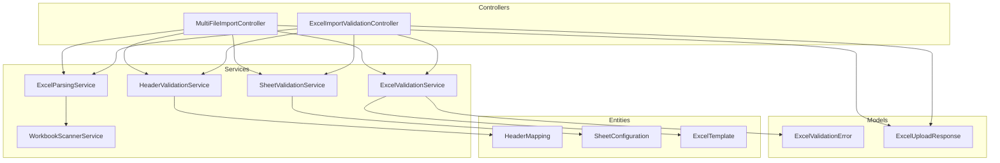
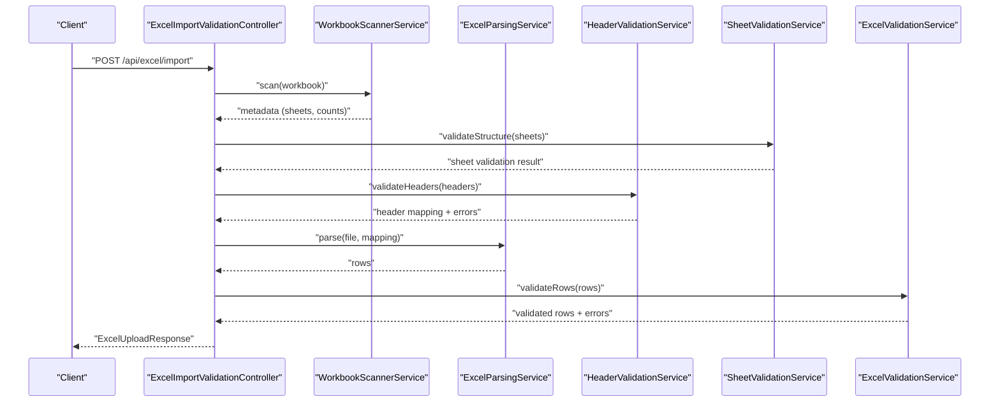
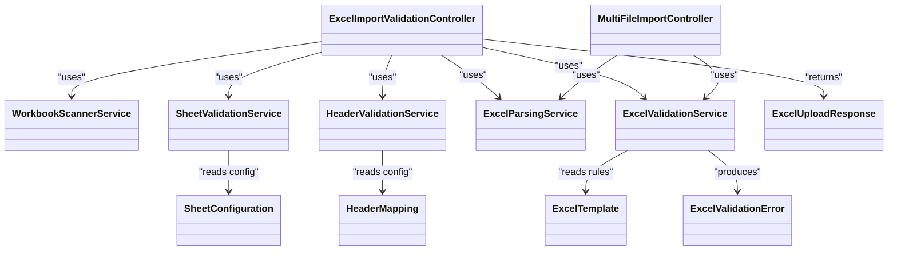

# Excel Processing Services

<cite>
**Referenced Files in This Document**
- [ExcelParsingService.java](file://backend/src/main/java/com/ceb/billing/services/ExcelParsingService.java)
- [ExcelValidationService.java](file://backend/src/main/java/com/ceb/billing/services/ExcelValidationService.java)
- [HeaderValidationService.java](file://backend/src/main/java/com/ceb/billing/services/HeaderValidationService.java)
- [SheetValidationService.java](file://backend/src/main/java/com/ceb/billing/services/SheetValidationService.java)
- [ExcelImportValidationController.java](file://backend/src/main/java/com/ceb/billing/controllers/ExcelImportValidationController.java)
- [MultiFileImportController.java](file://backend/src/main/java/com/ceb/billing/controllers/MultiFileImportController.java)
- [HeaderMapping.java](file://backend/src/main/java/com/ceb/billing/entities/HeaderMapping.java)
- [SheetConfiguration.java](file://backend/src/main/java/com/ceb/billing/entities/SheetConfiguration.java)
- [ExcelTemplate.java](file://backend/src/main/java/com/ceb/billing/entities/ExcelTemplate.java)
- [ExcelValidationError.java](file://backend/src/main/java/com/ceb/billing/models/ExcelValidationError.java)
- [ExcelUploadResponse.java](file://backend/src/main/java/com/ceb/billing/models/ExcelUploadResponse.java)
- [WorkbookScannerService.java](file://backend/src/main/java/com/ceb/billing/services/WorkbookScannerService.java)
</cite>

## Table of Contents
1. [Introduction](#introduction)
2. [Project Structure](#project-structure)
3. [Core Components](#core-components)
4. [Architecture Overview](#architecture-overview)
5. [Detailed Component Analysis](#detailed-component-analysis)
6. [Dependency Analysis](#dependency-analysis)
7. [Performance Considerations](#performance-considerations)
8. [Troubleshooting Guide](#troubleshooting-guide)
9. [Conclusion](#conclusion)

## Introduction
This document explains the Excel processing services that power file upload, parsing, validation, and transformation. It focuses on:
- ExcelParsingService for reading and extracting data from Excel workbooks
- ExcelValidationService for applying business rule validations to extracted rows
- HeaderValidationService for validating column headers against configured mappings
- SheetValidationService for validating sheet presence and structure
It also documents the end-to-end pipeline from file upload to transformed records, error handling strategies, performance optimizations, and memory management techniques for large files.

## Project Structure
The Excel processing features are implemented under the backend module with a clear separation between controllers (entry points), services (processing logic), entities (configuration and persistence models), and models (API contracts).

**Diagram sources**
- [ExcelImportValidationController.java](file://backend/src/main/java/com/ceb/billing/controllers/ExcelImportValidationController.java)
- [MultiFileImportController.java](file://backend/src/main/java/com/ceb/billing/controllers/MultiFileImportController.java)
- [ExcelParsingService.java](file://backend/src/main/java/com/ceb/billing/services/ExcelParsingService.java)
- [ExcelValidationService.java](file://backend/src/main/java/com/ceb/billing/services/ExcelValidationService.java)
- [HeaderValidationService.java](file://backend/src/main/java/com/ceb/billing/services/HeaderValidationService.java)
- [SheetValidationService.java](file://backend/src/main/java/com/ceb/billing/services/SheetValidationService.java)
- [WorkbookScannerService.java](file://backend/src/main/java/com/ceb/billing/services/WorkbookScannerService.java)
- [HeaderMapping.java](file://backend/src/main/java/com/ceb/billing/entities/HeaderMapping.java)
- [SheetConfiguration.java](file://backend/src/main/java/com/ceb/billing/entities/SheetConfiguration.java)
- [ExcelTemplate.java](file://backend/src/main/java/com/ceb/billing/entities/ExcelTemplate.java)
- [ExcelValidationError.java](file://backend/src/main/java/com/ceb/billing/models/ExcelValidationError.java)
- [ExcelUploadResponse.java](file://backend/src/main/java/com/ceb/billing/models/ExcelUploadResponse.java)

**Section sources**
- [ExcelImportValidationController.java](file://backend/src/main/java/com/ceb/billing/controllers/ExcelImportValidationController.java)
- [MultiFileImportController.java](file://backend/src/main/java/com/ceb/billing/controllers/MultiFileImportController.java)
- [ExcelParsingService.java](file://backend/src/main/java/com/ceb/billing/services/ExcelParsingService.java)
- [ExcelValidationService.java](file://backend/src/main/java/com/ceb/billing/services/ExcelValidationService.java)
- [HeaderValidationService.java](file://backend/src/main/java/com/ceb/billing/services/HeaderValidationService.java)
- [SheetValidationService.java](file://backend/src/main/java/com/ceb/billing/services/SheetValidationService.java)
- [WorkbookScannerService.java](file://backend/src/main/java/com/ceb/billing/services/WorkbookScannerService.java)
- [HeaderMapping.java](file://backend/src/main/java/com/ceb/billing/entities/HeaderMapping.java)
- [SheetConfiguration.java](file://backend/src/main/java/com/ceb/billing/entities/SheetConfiguration.java)
- [ExcelTemplate.java](file://backend/src/main/java/com/ceb/billing/entities/ExcelTemplate.java)
- [ExcelValidationError.java](file://backend/src/main/java/com/ceb/billing/models/ExcelValidationError.java)
- [ExcelUploadResponse.java](file://backend/src/main/java/com/ceb/billing/models/ExcelUploadResponse.java)

## Core Components
- ExcelParsingService: Reads uploaded Excel files, iterates sheets and rows, normalizes values, and produces structured row objects ready for validation.
- HeaderValidationService: Validates that required columns exist and are mapped according to configuration; resolves header names to canonical fields.
- SheetValidationService: Ensures expected sheets exist and have correct structural properties (e.g., presence of header rows).
- ExcelValidationService: Applies business rules to each row (type checks, ranges, cross-field constraints), aggregates errors, and returns validated or rejected records.
- WorkbookScannerService: Provides workbook-level metadata such as sheet names and counts to support pre-validation and scanning.

These components collaborate to implement a robust, configurable, and scalable Excel import pipeline.

**Section sources**
- [ExcelParsingService.java](file://backend/src/main/java/com/ceb/billing/services/ExcelParsingService.java)
- [HeaderValidationService.java](file://backend/src/main/java/com/ceb/billing/services/HeaderValidationService.java)
- [SheetValidationService.java](file://backend/src/main/java/com/ceb/billing/services/SheetValidationService.java)
- [ExcelValidationService.java](file://backend/src/main/java/com/ceb/billing/services/ExcelValidationService.java)
- [WorkbookScannerService.java](file://backend/src/main/java/com/ceb/billing/services/WorkbookScannerService.java)

## Architecture Overview
The end-to-end flow starts at the controller layer, which orchestrates parsing, header validation, sheet validation, and business rule validation before returning results to the client.

**Diagram sources**
- [ExcelImportValidationController.java](file://backend/src/main/java/com/ceb/billing/controllers/ExcelImportValidationController.java)
- [WorkbookScannerService.java](file://backend/src/main/java/com/ceb/billing/services/WorkbookScannerService.java)
- [SheetValidationService.java](file://backend/src/main/java/com/ceb/billing/services/SheetValidationService.java)
- [HeaderValidationService.java](file://backend/src/main/java/com/ceb/billing/services/HeaderValidationService.java)
- [ExcelParsingService.java](file://backend/src/main/java/com/ceb/billing/services/ExcelParsingService.java)
- [ExcelValidationService.java](file://backend/src/main/java/com/ceb/billing/services/ExcelValidationService.java)

## Detailed Component Analysis

### ExcelParsingService
Responsibilities:
- Open and iterate over workbook sheets and rows
- Normalize cell values (trimming, type coercion hints)
- Map raw cells into domain row structures using header mappings
- Stream rows to minimize memory pressure when possible

Key behaviors:
- Iteration strategy: prefer streaming where feasible to avoid loading entire sheets into memory
- Null handling: treat empty cells consistently across numeric/date/text types
- Error propagation: surface parse-time issues (e.g., malformed numbers) as per-row errors

Optimization notes:
- Use row-by-row iteration rather than bulk sheet loads
- Avoid creating unnecessary intermediate collections
- Reuse parsers and readers across calls when appropriate

**Section sources**
- [ExcelParsingService.java](file://backend/src/main/java/com/ceb/billing/services/ExcelParsingService.java)

### HeaderValidationService
Responsibilities:
- Validate presence of required columns
- Resolve header names to canonical field names via configuration
- Report missing/mismatched headers with actionable messages

Configuration model:
- HeaderMapping defines the relationship between display headers and canonical fields
- Supports flexible header naming and normalization (case-insensitive, whitespace-tolerant)

Typical workflow:
- Read first row(s) as headers
- Compare against expected set
- Build a mapping used by the parser

**Section sources**
- [HeaderValidationService.java](file://backend/src/main/java/com/ceb/billing/services/HeaderValidationService.java)
- [HeaderMapping.java](file://backend/src/main/java/com/ceb/billing/entities/HeaderMapping.java)

### SheetValidationService
Responsibilities:
- Ensure required sheets exist
- Validate basic sheet structure (e.g., header row presence)
- Provide early feedback before expensive parsing

Integration:
- Uses workbook metadata to quickly validate structure
- Works with SheetConfiguration to enforce sheet-specific requirements

**Section sources**
- [SheetValidationService.java](file://backend/src/main/java/com/ceb/billing/services/SheetValidationService.java)
- [SheetConfiguration.java](file://backend/src/main/java/com/ceb/billing/entities/SheetConfiguration.java)

### ExcelValidationService
Responsibilities:
- Apply business rules to each parsed row
- Enforce data types, value ranges, and cross-field constraints
- Aggregate validation errors and produce a clean result set

Error model:
- ExcelValidationError captures row-level and field-level details
- Results include both valid records and associated errors for reporting

Extensibility:
- Business rules can be added or modified without changing parsing logic
- Rules can reference other fields within the same row

**Section sources**
- [ExcelValidationService.java](file://backend/src/main/java/com/ceb/billing/services/ExcelValidationService.java)
- [ExcelValidationError.java](file://backend/src/main/java/com/ceb/billing/models/ExcelValidationError.java)

### WorkbookScannerService
Responsibilities:
- Provide fast workbook inspection (sheet names, counts)
- Support pre-validation and progress reporting

Usage:
- Called before heavy parsing to fail fast on structural issues
- Used by controllers to present workbook overview to users

**Section sources**
- [WorkbookScannerService.java](file://backend/src/main/java/com/ceb/billing/services/WorkbookScannerService.java)

### Controllers and Endpoints
- ExcelImportValidationController: Orchestrates single-file import, invoking scanner, sheet/header validation, parsing, and business validation. Returns standardized responses.
- MultiFileImportController: Handles batch imports, coordinating multiple workbooks through the same pipeline.

Both controllers use shared services and return consistent response models.

**Section sources**
- [ExcelImportValidationController.java](file://backend/src/main/java/com/ceb/billing/controllers/ExcelImportValidationController.java)
- [MultiFileImportController.java](file://backend/src/main/java/com/ceb/billing/controllers/MultiFileImportController.java)
- [ExcelUploadResponse.java](file://backend/src/main/java/com/ceb/billing/models/ExcelUploadResponse.java)

## Dependency Analysis
High-level dependencies among core components:

**Diagram sources**
- [ExcelImportValidationController.java](file://backend/src/main/java/com/ceb/billing/controllers/ExcelImportValidationController.java)
- [MultiFileImportController.java](file://backend/src/main/java/com/ceb/billing/controllers/MultiFileImportController.java)
- [WorkbookScannerService.java](file://backend/src/main/java/com/ceb/billing/services/WorkbookScannerService.java)
- [SheetValidationService.java](file://backend/src/main/java/com/ceb/billing/services/SheetValidationService.java)
- [HeaderValidationService.java](file://backend/src/main/java/com/ceb/billing/services/HeaderValidationService.java)
- [ExcelParsingService.java](file://backend/src/main/java/com/ceb/billing/services/ExcelParsingService.java)
- [ExcelValidationService.java](file://backend/src/main/java/com/ceb/billing/services/ExcelValidationService.java)
- [HeaderMapping.java](file://backend/src/main/java/com/ceb/billing/entities/HeaderMapping.java)
- [SheetConfiguration.java](file://backend/src/main/java/com/ceb/billing/entities/SheetConfiguration.java)
- [ExcelTemplate.java](file://backend/src/main/java/com/ceb/billing/entities/ExcelTemplate.java)
- [ExcelValidationError.java](file://backend/src/main/java/com/ceb/billing/models/ExcelValidationError.java)
- [ExcelUploadResponse.java](file://backend/src/main/java/com/ceb/billing/models/ExcelUploadResponse.java)

**Section sources**
- [ExcelImportValidationController.java](file://backend/src/main/java/com/ceb/billing/controllers/ExcelImportValidationController.java)
- [MultiFileImportController.java](file://backend/src/main/java/com/ceb/billing/controllers/MultiFileImportController.java)
- [ExcelParsingService.java](file://backend/src/main/java/com/ceb/billing/services/ExcelParsingService.java)
- [ExcelValidationService.java](file://backend/src/main/java/com/ceb/billing/services/ExcelValidationService.java)
- [HeaderValidationService.java](file://backend/src/main/java/com/ceb/billing/services/HeaderValidationService.java)
- [SheetValidationService.java](file://backend/src/main/java/com/ceb/billing/services/SheetValidationService.java)
- [WorkbookScannerService.java](file://backend/src/main/java/com/ceb/billing/services/WorkbookScannerService.java)
- [HeaderMapping.java](file://backend/src/main/java/com/ceb/billing/entities/HeaderMapping.java)
- [SheetConfiguration.java](file://backend/src/main/java/com/ceb/billing/entities/SheetConfiguration.java)
- [ExcelTemplate.java](file://backend/src/main/java/com/ceb/billing/entities/ExcelTemplate.java)
- [ExcelValidationError.java](file://backend/src/main/java/com/ceb/billing/models/ExcelValidationError.java)
- [ExcelUploadResponse.java](file://backend/src/main/java/com/ceb/billing/models/ExcelUploadResponse.java)

## Performance Considerations
- Streaming parsing: Prefer row-by-row iteration to avoid loading entire sheets into memory.
- Early validation: Use sheet and header validation before parsing to fail fast and reduce wasted work.
- Minimize object churn: Reuse temporary buffers and avoid creating excessive intermediate collections.
- Batch processing: For multi-file imports, process files sequentially or with bounded concurrency to control memory usage.
- Type normalization: Perform lightweight normalization during parsing to reduce downstream conversion costs.
- Resource cleanup: Ensure streams and readers are closed promptly to free native resources.

[No sources needed since this section provides general guidance]

## Troubleshooting Guide
Common issues and strategies:
- Missing headers: HeaderValidationService reports exact mismatches; verify HeaderMapping configuration and ensure template headers match expectations.
- Invalid data types: ExcelValidationService flags type errors; normalize input formats or adjust validation rules accordingly.
- Structural problems: SheetValidationService detects missing sheets or malformed structures; confirm SheetConfiguration aligns with actual templates.
- Large file failures: If OutOfMemoryError occurs, switch to streaming parsing and reduce batch sizes.
- Cross-field violations: Review business rules in ExcelValidationService and ExcelTemplate definitions for logical conflicts.

Operational tips:
- Inspect ExcelUploadResponse for aggregated errors and partial successes.
- Log workbook metadata from WorkbookScannerService to understand sheet layout before parsing.
- Use ExcelValidationError details to guide user corrections.

**Section sources**
- [HeaderValidationService.java](file://backend/src/main/java/com/ceb/billing/services/HeaderValidationService.java)
- [SheetValidationService.java](file://backend/src/main/java/com/ceb/billing/services/SheetValidationService.java)
- [ExcelValidationService.java](file://backend/src/main/java/com/ceb/billing/services/ExcelValidationService.java)
- [ExcelUploadResponse.java](file://backend/src/main/java/com/ceb/billing/models/ExcelUploadResponse.java)
- [ExcelValidationError.java](file://backend/src/main/java/com/ceb/billing/models/ExcelValidationError.java)
- [WorkbookScannerService.java](file://backend/src/main/java/com/ceb/billing/services/WorkbookScannerService.java)

## Conclusion
The Excel processing pipeline combines fast structural checks, robust header mapping, efficient parsing, and comprehensive business rule validation. By leveraging streaming techniques, early validation, and clear error models, the system remains responsive and reliable even with large workbooks. Extensible configuration via HeaderMapping, SheetConfiguration, and ExcelTemplate enables adaptability to evolving import requirements while maintaining high data quality.