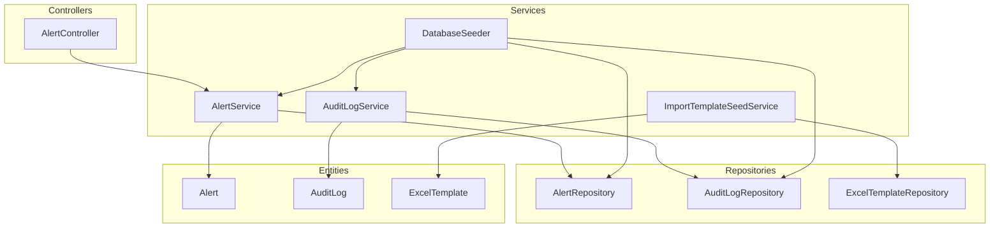
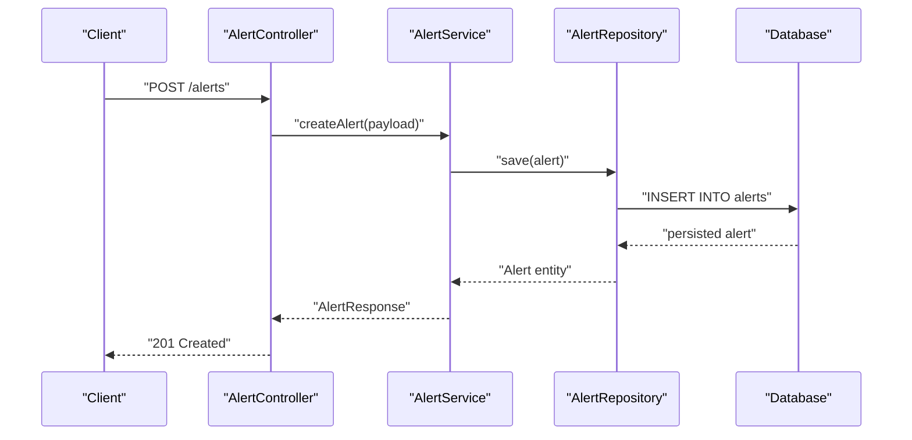
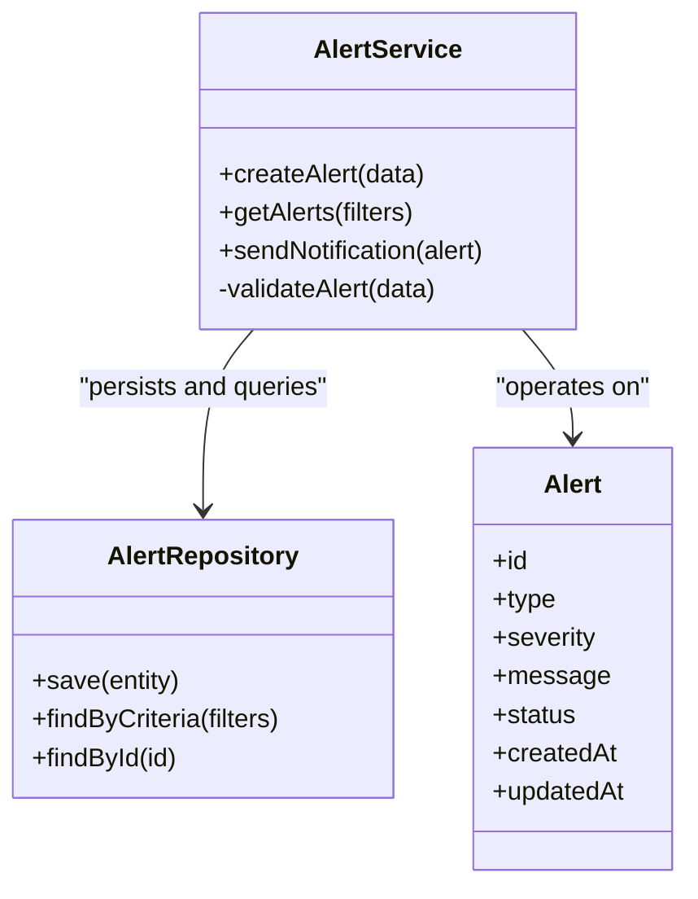
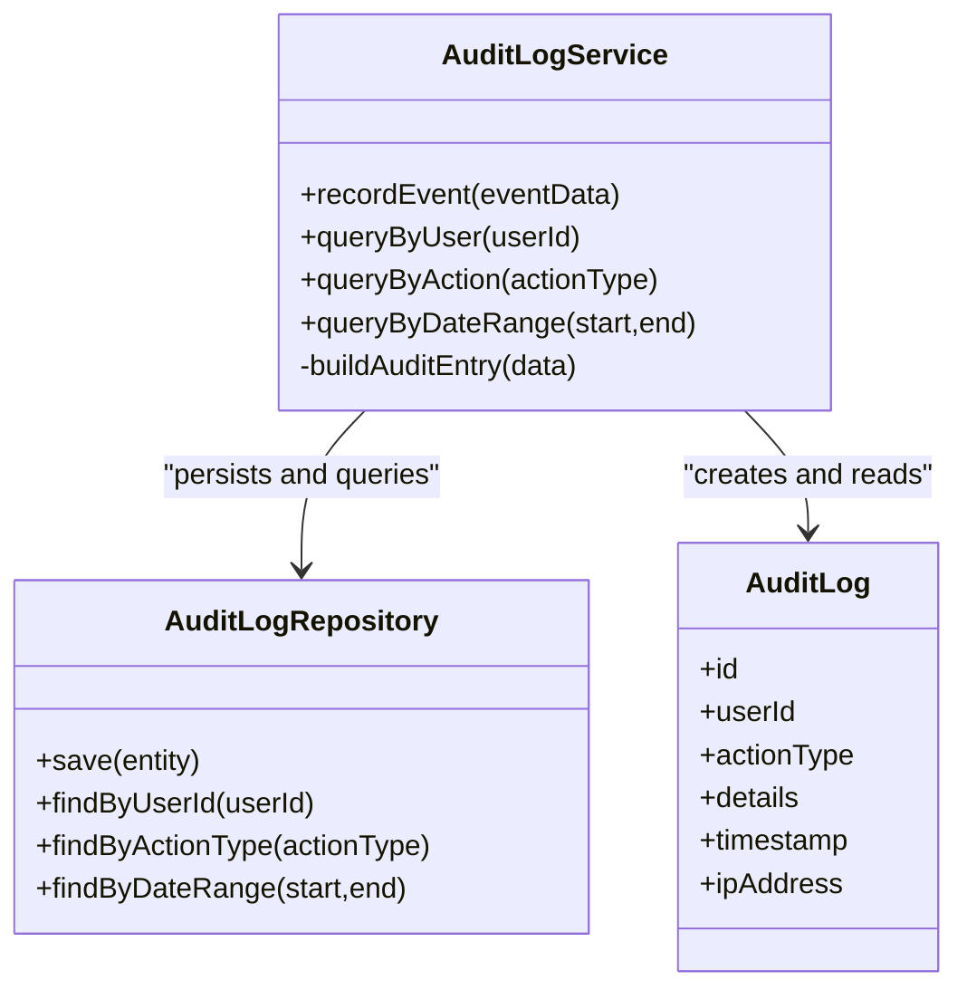
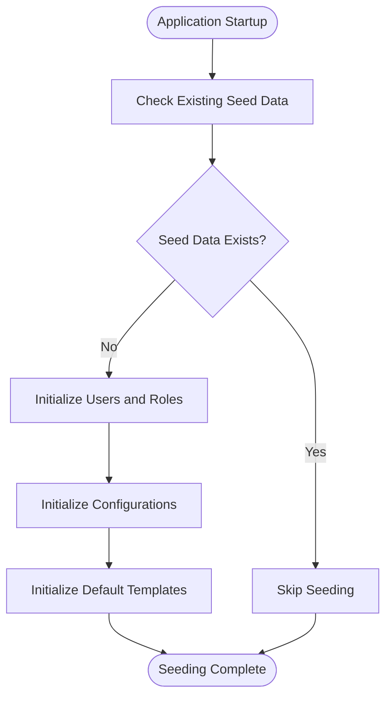
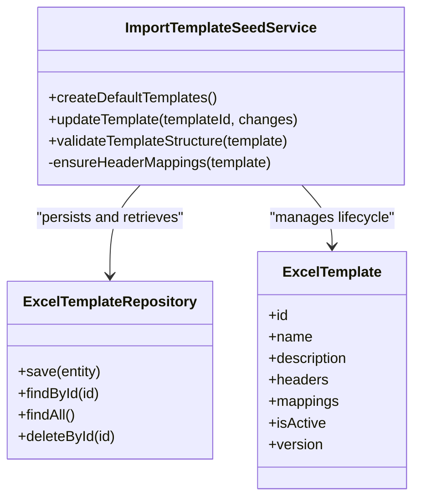
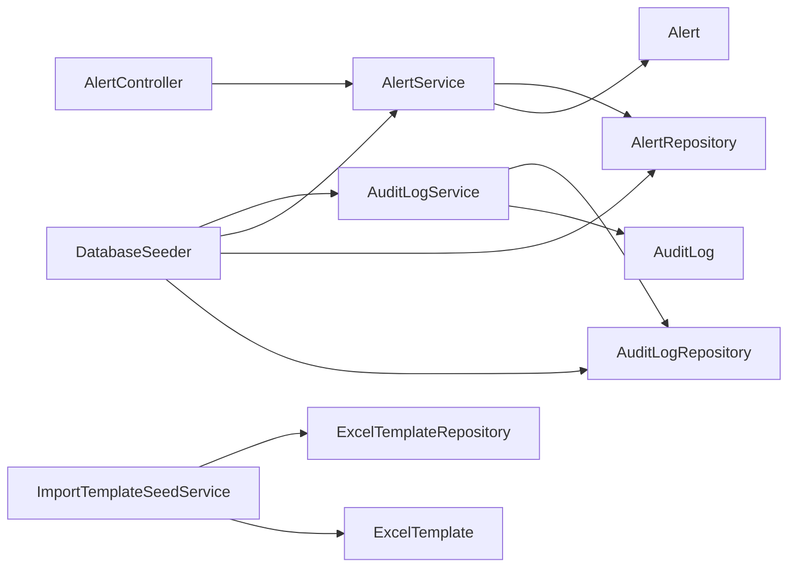

# Workflow and Audit Services

<cite>
**Referenced Files in This Document**
- [AlertService.java](file://backend/src/main/java/com/ceb/billing/services/AlertService.java)
- [AuditLogService.java](file://backend/src/main/java/com/ceb/billing/services/AuditLogService.java)
- [DatabaseSeeder.java](file://backend/src/main/java/com/ceb/billing/services/DatabaseSeeder.java)
- [ImportTemplateSeedService.java](file://backend/src/main/java/com/ceb/billing/services/ImportTemplateSeedService.java)
- [AlertController.java](file://backend/src/main/java/com/ceb/billing/controllers/AlertController.java)
- [Alert.java](file://backend/src/main/java/com/ceb/billing/entities/Alert.java)
- [AuditLog.java](file://backend/src/main/java/com/ceb/billing/entities/AuditLog.java)
- [ExcelTemplate.java](file://backend/src/main/java/com/ceb/billing/entities/ExcelTemplate.java)
- [AlertRepository.java](file://backend/src/main/java/com/ceb/billing/repositories/AlertRepository.java)
- [AuditLogRepository.java](file://backend/src/main/java/com/ceb/billing/repositories/AuditLogRepository.java)
- [ExcelTemplateRepository.java](file://backend/src/main/java/com/ceb/billing/repositories/ExcelTemplateRepository.java)
</cite>

## Table of Contents
1. [Introduction](#introduction)
2. [Project Structure](#project-structure)
3. [Core Components](#core-components)
4. [Architecture Overview](#architecture-overview)
5. [Detailed Component Analysis](#detailed-component-analysis)
6. [Dependency Analysis](#dependency-analysis)
7. [Performance Considerations](#performance-considerations)
8. [Troubleshooting Guide](#troubleshooting-guide)
9. [Conclusion](#conclusion)
10. [Appendices](#appendices)

## Introduction
This document provides comprehensive documentation for the workflow and audit services, focusing on:
- AlertService for system notifications and alerting mechanisms
- AuditLogService for comprehensive activity tracking and compliance logging
- DatabaseSeeder for initial data population
- ImportTemplateSeedService for template management

It also covers audit trail implementation, notification delivery systems, seed data management, and template lifecycle, with practical examples for querying audit logs, configuring alerts, and customizing templates.

## Project Structure
The relevant backend components are organized under com.ceb.billing with clear separation between controllers, services, repositories, entities, and configuration. The workflow and audit services reside in the services package and integrate with their respective repositories and entities.

**Diagram sources**
- [AlertController.java](file://backend/src/main/java/com/ceb/billing/controllers/AlertController.java)
- [AlertService.java](file://backend/src/main/java/com/ceb/billing/services/AlertService.java)
- [AuditLogService.java](file://backend/src/main/java/com/ceb/billing/services/AuditLogService.java)
- [DatabaseSeeder.java](file://backend/src/main/java/com/ceb/billing/services/DatabaseSeeder.java)
- [ImportTemplateSeedService.java](file://backend/src/main/java/com/ceb/billing/services/ImportTemplateSeedService.java)
- [AlertRepository.java](file://backend/src/main/java/com/ceb/billing/repositories/AlertRepository.java)
- [AuditLogRepository.java](file://backend/src/main/java/com/ceb/billing/repositories/AuditLogRepository.java)
- [ExcelTemplateRepository.java](file://backend/src/main/java/com/ceb/billing/repositories/ExcelTemplateRepository.java)
- [Alert.java](file://backend/src/main/java/com/ceb/billing/entities/Alert.java)
- [AuditLog.java](file://backend/src/main/java/com/ceb/billing/entities/AuditLog.java)
- [ExcelTemplate.java](file://backend/src/main/java/com/ceb/billing/entities/ExcelTemplate.java)

**Section sources**
- [AlertController.java](file://backend/src/main/java/com/ceb/billing/controllers/AlertController.java)
- [AlertService.java](file://backend/src/main/java/com/ceb/billing/services/AlertService.java)
- [AuditLogService.java](file://backend/src/main/java/com/ceb/billing/services/AuditLogService.java)
- [DatabaseSeeder.java](file://backend/src/main/java/com/ceb/billing/services/DatabaseSeeder.java)
- [ImportTemplateSeedService.java](file://backend/src/main/java/com/ceb/billing/services/ImportTemplateSeedService.java)
- [AlertRepository.java](file://backend/src/main/java/com/ceb/billing/repositories/AlertRepository.java)
- [AuditLogRepository.java](file://backend/src/main/java/com/ceb/billing/repositories/AuditLogRepository.java)
- [ExcelTemplateRepository.java](file://backend/src/main/java/com/ceb/billing/repositories/ExcelTemplateRepository.java)
- [Alert.java](file://backend/src/main/java/com/ceb/billing/entities/Alert.java)
- [AuditLog.java](file://backend/src/main/java/com/ceb/billing/entities/AuditLog.java)
- [ExcelTemplate.java](file://backend/src/main/java/com/ceb/billing/entities/ExcelTemplate.java)

## Core Components
- AlertService: Encapsulates alert creation, retrieval, filtering, and dispatch logic. It coordinates with AlertRepository to persist alerts and may integrate with external notification channels (e.g., email or messaging).
- AuditLogService: Provides methods to record user actions, system events, and business operations into AuditLog entities. It supports query helpers for compliance reporting and auditing.
- DatabaseSeeder: Initializes essential reference data at startup or on demand, including default users, roles, and baseline configurations. It can orchestrate seeding across multiple services and repositories.
- ImportTemplateSeedService: Manages import Excel templates by creating, updating, and validating template definitions used by import workflows. It integrates with ExcelTemplateRepository and related entities.

Key responsibilities:
- Centralized alerting and notification handling
- Comprehensive audit trail capture and retrieval
- Deterministic seed data provisioning
- Template lifecycle management for imports

**Section sources**
- [AlertService.java](file://backend/src/main/java/com/ceb/billing/services/AlertService.java)
- [AuditLogService.java](file://backend/src/main/java/com/ceb/billing/services/AuditLogService.java)
- [DatabaseSeeder.java](file://backend/src/main/java/com/ceb/billing/services/DatabaseSeeder.java)
- [ImportTemplateSeedService.java](file://backend/src/main/java/com/ceb/billing/services/ImportTemplateSeedService.java)

## Architecture Overview
The workflow and audit services follow a layered architecture:
- Controllers expose REST endpoints that delegate to services
- Services implement business logic and coordinate repository access
- Repositories provide persistence abstractions over entities
- Entities represent domain models persisted in the database

**Diagram sources**
- [AlertController.java](file://backend/src/main/java/com/ceb/billing/controllers/AlertController.java)
- [AlertService.java](file://backend/src/main/java/com/ceb/billing/services/AlertService.java)
- [AlertRepository.java](file://backend/src/main/java/com/ceb/billing/repositories/AlertRepository.java)
- [Alert.java](file://backend/src/main/java/com/ceb/billing/entities/Alert.java)

## Detailed Component Analysis

### AlertService Analysis
Responsibilities:
- Create and manage alerts
- Filter and retrieve alerts based on criteria
- Integrate with notification delivery mechanisms (e.g., email, messaging)
- Coordinate with AlertRepository for persistence

**Diagram sources**
- [AlertService.java](file://backend/src/main/java/com/ceb/billing/services/AlertService.java)
- [AlertRepository.java](file://backend/src/main/java/com/ceb/billing/repositories/AlertRepository.java)
- [Alert.java](file://backend/src/main/java/com/ceb/billing/entities/Alert.java)

Example usage patterns:
- Creating an alert via controller endpoint
- Retrieving alerts with filters such as severity and status
- Sending notifications asynchronously after alert creation

**Section sources**
- [AlertService.java](file://backend/src/main/java/com/ceb/billing/services/AlertService.java)
- [AlertRepository.java](file://backend/src/main/java/com/ceb/billing/repositories/AlertRepository.java)
- [Alert.java](file://backend/src/main/java/com/ceb/billing/entities/Alert.java)

### AuditLogService Analysis
Responsibilities:
- Record audit events for user actions and system processes
- Provide query helpers for compliance reporting
- Ensure consistent audit metadata (user, action, timestamp, details)

**Diagram sources**
- [AuditLogService.java](file://backend/src/main/java/com/ceb/billing/services/AuditLogService.java)
- [AuditLogRepository.java](file://backend/src/main/java/com/ceb/billing/repositories/AuditLogRepository.java)
- [AuditLog.java](file://backend/src/main/java/com/ceb/billing/entities/AuditLog.java)

Audit log query examples:
- Retrieve all events for a specific user
- Filter events by action type
- Query events within a date range for compliance reports

**Section sources**
- [AuditLogService.java](file://backend/src/main/java/com/ceb/billing/services/AuditLogService.java)
- [AuditLogRepository.java](file://backend/src/main/java/com/ceb/billing/repositories/AuditLogRepository.java)
- [AuditLog.java](file://backend/src/main/java/com/ceb/billing/entities/AuditLog.java)

### DatabaseSeeder Analysis
Responsibilities:
- Populate initial reference data (users, roles, configurations)
- Orchestrate seeding across multiple services and repositories
- Ensure idempotent seeding to avoid duplicates

**Diagram sources**
- [DatabaseSeeder.java](file://backend/src/main/java/com/ceb/billing/services/DatabaseSeeder.java)

Seed data management best practices:
- Use unique identifiers to prevent duplicate entries
- Separate concerns by delegating to specialized seed services when needed
- Validate seed data integrity before committing transactions

**Section sources**
- [DatabaseSeeder.java](file://backend/src/main/java/com/ceb/billing/services/DatabaseSeeder.java)

### ImportTemplateSeedService Analysis
Responsibilities:
- Manage import Excel templates (create, update, validate)
- Provide default templates for common import scenarios
- Enforce template structure and header mappings

**Diagram sources**
- [ImportTemplateSeedService.java](file://backend/src/main/java/com/ceb/billing/services/ImportTemplateSeedService.java)
- [ExcelTemplateRepository.java](file://backend/src/main/java/com/ceb/billing/repositories/ExcelTemplateRepository.java)
- [ExcelTemplate.java](file://backend/src/main/java/com/ceb/billing/entities/ExcelTemplate.java)

Template customization workflow:
- Define new template headers and mappings
- Validate template structure against expected schema
- Activate template for use in import workflows

**Section sources**
- [ImportTemplateSeedService.java](file://backend/src/main/java/com/ceb/billing/services/ImportTemplateSeedService.java)
- [ExcelTemplateRepository.java](file://backend/src/main/java/com/ceb/billing/repositories/ExcelTemplateRepository.java)
- [ExcelTemplate.java](file://backend/src/main/java/com/ceb/billing/entities/ExcelTemplate.java)

## Dependency Analysis
The following diagram illustrates key dependencies among workflow and audit services, controllers, repositories, and entities.

**Diagram sources**
- [AlertController.java](file://backend/src/main/java/com/ceb/billing/controllers/AlertController.java)
- [AlertService.java](file://backend/src/main/java/com/ceb/billing/services/AlertService.java)
- [AuditLogService.java](file://backend/src/main/java/com/ceb/billing/services/AuditLogService.java)
- [DatabaseSeeder.java](file://backend/src/main/java/com/ceb/billing/services/DatabaseSeeder.java)
- [ImportTemplateSeedService.java](file://backend/src/main/java/com/ceb/billing/services/ImportTemplateSeedService.java)
- [AlertRepository.java](file://backend/src/main/java/com/ceb/billing/repositories/AlertRepository.java)
- [AuditLogRepository.java](file://backend/src/main/java/com/ceb/billing/repositories/AuditLogRepository.java)
- [ExcelTemplateRepository.java](file://backend/src/main/java/com/ceb/billing/repositories/ExcelTemplateRepository.java)
- [Alert.java](file://backend/src/main/java/com/ceb/billing/entities/Alert.java)
- [AuditLog.java](file://backend/src/main/java/com/ceb/billing/entities/AuditLog.java)
- [ExcelTemplate.java](file://backend/src/main/java/com/ceb/billing/entities/ExcelTemplate.java)

**Section sources**
- [AlertController.java](file://backend/src/main/java/com/ceb/billing/controllers/AlertController.java)
- [AlertService.java](file://backend/src/main/java/com/ceb/billing/services/AlertService.java)
- [AuditLogService.java](file://backend/src/main/java/com/ceb/billing/services/AuditLogService.java)
- [DatabaseSeeder.java](file://backend/src/main/java/com/ceb/billing/services/DatabaseSeeder.java)
- [ImportTemplateSeedService.java](file://backend/src/main/java/com/ceb/billing/services/ImportTemplateSeedService.java)
- [AlertRepository.java](file://backend/src/main/java/com/ceb/billing/repositories/AlertRepository.java)
- [AuditLogRepository.java](file://backend/src/main/java/com/ceb/billing/repositories/AuditLogRepository.java)
- [ExcelTemplateRepository.java](file://backend/src/main/java/com/ceb/billing/repositories/ExcelTemplateRepository.java)
- [Alert.java](file://backend/src/main/java/com/ceb/billing/entities/Alert.java)
- [AuditLog.java](file://backend/src/main/java/com/ceb/billing/entities/AuditLog.java)
- [ExcelTemplate.java](file://backend/src/main/java/com/ceb/billing/entities/ExcelTemplate.java)

## Performance Considerations
- Batch operations: Prefer batch inserts for seed data to reduce database round-trips.
- Indexing: Ensure indexes on frequently queried fields in AuditLog (e.g., userId, timestamp, actionType).
- Pagination: Implement pagination for alert and audit log queries to handle large datasets.
- Asynchronous processing: Offload notification delivery to background jobs to avoid blocking request threads.
- Caching: Cache static template definitions to minimize repeated lookups.

[No sources needed since this section provides general guidance]

## Troubleshooting Guide
Common issues and resolutions:
- Duplicate seed data: Verify idempotency checks in DatabaseSeeder and ensure unique constraints exist in repositories.
- Missing audit entries: Confirm that AuditLogService is invoked consistently across controllers and services.
- Notification failures: Inspect AlertService integration points and retry policies for external channels.
- Template validation errors: Validate ExcelTemplate structures and header mappings before activation.

Operational tips:
- Enable detailed logging for service methods involved in alerting and auditing.
- Monitor repository performance metrics and adjust indexes accordingly.
- Use dedicated test environments to validate seed data and template changes.

**Section sources**
- [DatabaseSeeder.java](file://backend/src/main/java/com/ceb/billing/services/DatabaseSeeder.java)
- [AuditLogService.java](file://backend/src/main/java/com/ceb/billing/services/AuditLogService.java)
- [AlertService.java](file://backend/src/main/java/com/ceb/billing/services/AlertService.java)
- [ImportTemplateSeedService.java](file://backend/src/main/java/com/ceb/billing/services/ImportTemplateSeedService.java)

## Conclusion
The workflow and audit services provide robust capabilities for alerting, auditing, seed data management, and template lifecycle control. By adhering to the recommended patterns and best practices outlined here, teams can maintain high reliability, compliance, and extensibility in their billing application.

[No sources needed since this section summarizes without analyzing specific files]

## Appendices

### Example: Audit Log Queries
- Retrieve events by user ID using AuditLogService.queryByUser(userId)
- Filter by action type using AuditLogService.queryByAction(actionType)
- Range queries using AuditLogService.queryByDateRange(start, end)

**Section sources**
- [AuditLogService.java](file://backend/src/main/java/com/ceb/billing/services/AuditLogService.java)
- [AuditLogRepository.java](file://backend/src/main/java/com/ceb/billing/repositories/AuditLogRepository.java)
- [AuditLog.java](file://backend/src/main/java/com/ceb/billing/entities/AuditLog.java)

### Example: Alert Configuration
- Configure alert severity levels and notification channels through AlertService settings
- Use AlertController endpoints to create and manage alerts programmatically

**Section sources**
- [AlertService.java](file://backend/src/main/java/com/ceb/billing/services/AlertService.java)
- [AlertController.java](file://backend/src/main/java/com/ceb/billing/controllers/AlertController.java)
- [Alert.java](file://backend/src/main/java/com/ceb/billing/entities/Alert.java)

### Example: Template Customization Workflow
- Define new headers and mappings via ImportTemplateSeedService.updateTemplate(templateId, changes)
- Validate structure using ImportTemplateSeedService.validateTemplateStructure(template)
- Activate template for import workflows after successful validation

**Section sources**
- [ImportTemplateSeedService.java](file://backend/src/main/java/com/ceb/billing/services/ImportTemplateSeedService.java)
- [ExcelTemplateRepository.java](file://backend/src/main/java/com/ceb/billing/repositories/ExcelTemplateRepository.java)
- [ExcelTemplate.java](file://backend/src/main/java/com/ceb/billing/entities/ExcelTemplate.java)