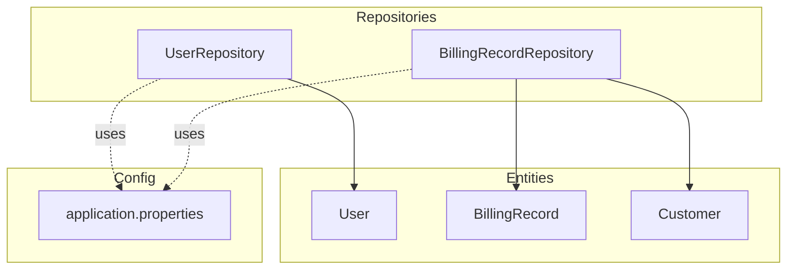
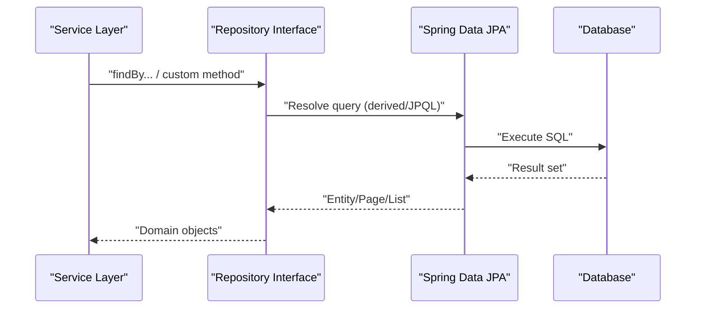
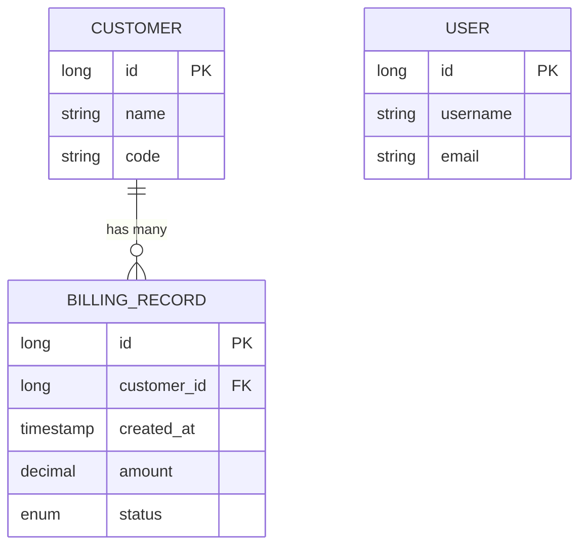
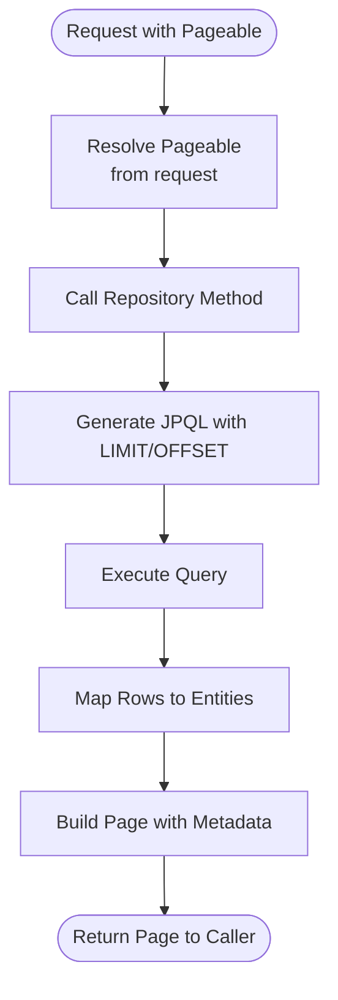
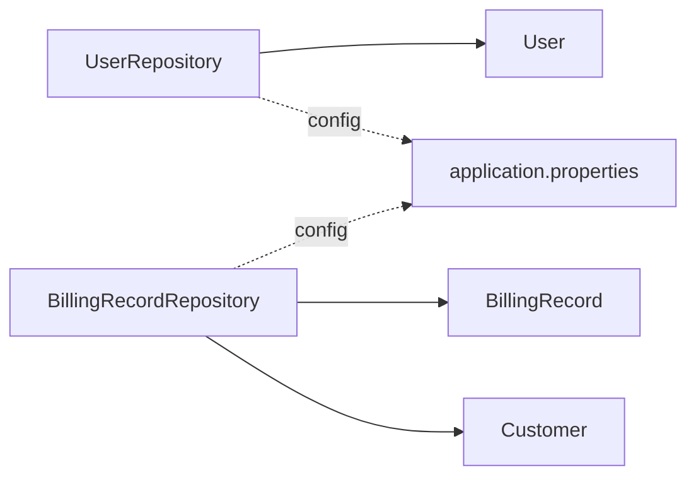

# Data Access Layer (Repositories)

<cite>
**Referenced Files in This Document**
- [UserRepository.java](file://backend/src/main/java/com/ceb/billing/repositories/UserRepository.java)
- [BillingRecordRepository.java](file://backend/src/main/java/com/ceb/billing/repositories/BillingRecordRepository.java)
- [User.java](file://backend/src/main/java/com/ceb/billing/entities/User.java)
- [BillingRecord.java](file://backend/src/main/java/com/ceb/billing/entities/BillingRecord.java)
- [Customer.java](file://backend/src/main/java/com/ceb/billing/entities/Customer.java)
- [application.properties](file://backend/src/main/resources/application.properties)
</cite>

## Table of Contents
1. [Introduction](#introduction)
2. [Project Structure](#project-structure)
3. [Core Components](#core-components)
4. [Architecture Overview](#architecture-overview)
5. [Detailed Component Analysis](#detailed-component-analysis)
6. [Dependency Analysis](#dependency-analysis)
7. [Performance Considerations](#performance-considerations)
8. [Troubleshooting Guide](#troubleshooting-guide)
9. [Conclusion](#conclusion)

## Introduction
This document explains the data access layer implementation with a focus on JPA repository patterns, entity relationships, and database abstraction strategies. It covers custom query methods, pagination, caching strategies, connection pooling, and migration considerations within the repository layer. Concrete examples are provided using UserRepository and BillingRecordRepository to illustrate derived queries, custom JPQL methods, and performance-oriented practices.

## Project Structure
The data access layer resides under repositories and entities packages. Repositories extend Spring Data JPA interfaces to provide CRUD operations and custom queries. Entities define JPA mappings and relationships that drive SQL generation and ORM behavior. Configuration for database connectivity and JPA is centralized in application properties.

**Diagram sources**
- [UserRepository.java](file://backend/src/main/java/com/ceb/billing/repositories/UserRepository.java)
- [BillingRecordRepository.java](file://backend/src/main/java/com/ceb/billing/repositories/BillingRecordRepository.java)
- [User.java](file://backend/src/main/java/com/ceb/billing/entities/User.java)
- [BillingRecord.java](file://backend/src/main/java/com/ceb/billing/entities/BillingRecord.java)
- [Customer.java](file://backend/src/main/java/com/ceb/billing/entities/Customer.java)
- [application.properties](file://backend/src/main/resources/application.properties)

**Section sources**
- [UserRepository.java](file://backend/src/main/java/com/ceb/billing/repositories/UserRepository.java)
- [BillingRecordRepository.java](file://backend/src/main/java/com/ceb/billing/repositories/BillingRecordRepository.java)
- [User.java](file://backend/src/main/java/com/ceb/billing/entities/User.java)
- [BillingRecord.java](file://backend/src/main/java/com/ceb/billing/entities/BillingRecord.java)
- [Customer.java](file://backend/src/main/java/com/ceb/billing/entities/Customer.java)
- [application.properties](file://backend/src/main/resources/application.properties)

## Core Components
- UserRepository: Provides user-related data access including derived queries and custom JPQL methods. It typically extends JpaRepository or CrudRepository to inherit standard operations and adds domain-specific queries.
- BillingRecordRepository: Provides billing record data access with derived and custom JPQL queries, often involving joins with Customer and other related entities. It supports filtering, sorting, and pagination.

Key responsibilities:
- Encapsulate persistence logic behind clean interfaces
- Provide type-safe derived queries based on property names
- Implement complex queries via @Query annotations with JPQL
- Support pagination and sorting through Pageable and Sort parameters
- Maintain consistent transaction boundaries when used by services

**Section sources**
- [UserRepository.java](file://backend/src/main/java/com/ceb/billing/repositories/UserRepository.java)
- [BillingRecordRepository.java](file://backend/src/main/java/com/ceb/billing/repositories/BillingRecordRepository.java)

## Architecture Overview
The repository layer sits between services and the database. Services call repository methods to perform reads/writes. JPA translates repository calls into SQL. Configuration in application.properties controls datasource, JPA dialect, and Hibernate behaviors.

**Diagram sources**
- [UserRepository.java](file://backend/src/main/java/com/ceb/billing/repositories/UserRepository.java)
- [BillingRecordRepository.java](file://backend/src/main/java/com/ceb/billing/repositories/BillingRecordRepository.java)
- [application.properties](file://backend/src/main/resources/application.properties)

## Detailed Component Analysis

### UserRepository
Responsibilities:
- Derived queries for common lookups (e.g., by username, email, active status)
- Custom JPQL for advanced scenarios (e.g., joining roles or audit logs if present)
- Pagination support for listing users with filters and sorting

Typical patterns:
- Extends JpaRepository<User, Long> to gain CRUD and paging capabilities
- Uses method naming conventions for derived queries
- Adds @Query with JPQL for multi-entity joins or aggregations
- Returns Page<User> or List<User> depending on use case

Example usage paths:
- Derived query path: [UserRepository.java](file://backend/src/main/java/com/ceb/billing/repositories/UserRepository.java)
- Custom JPQL path: [UserRepository.java](file://backend/src/main/java/com/ceb/billing/repositories/UserRepository.java)

**Section sources**
- [UserRepository.java](file://backend/src/main/java/com/ceb/billing/repositories/UserRepository.java)
- [User.java](file://backend/src/main/java/com/ceb/billing/entities/User.java)

### BillingRecordRepository
Responsibilities:
- Derived queries for filtering by customer, date ranges, amounts, and statuses
- Custom JPQL for complex joins across BillingRecord and Customer
- Aggregations and projections where needed
- Pagination and sorting for large result sets

Typical patterns:
- Extends JpaRepository<BillingRecord, Long>
- Uses derived queries like findByCustomerIdAndStatusBetween
- Uses @Query with JPQL for multi-table joins and conditional filters
- Supports Pageable for efficient pagination

Example usage paths:
- Derived query path: [BillingRecordRepository.java](file://backend/src/main/java/com/ceb/billing/repositories/BillingRecordRepository.java)
- Custom JPQL path: [BillingRecordRepository.java](file://backend/src/main/java/com/ceb/billing/repositories/BillingRecordRepository.java)

**Section sources**
- [BillingRecordRepository.java](file://backend/src/main/java/com/ceb/billing/repositories/BillingRecordRepository.java)
- [BillingRecord.java](file://backend/src/main/java/com/ceb/billing/entities/BillingRecord.java)
- [Customer.java](file://backend/src/main/java/com/ceb/billing/entities/Customer.java)

### Entity Relationships and Mapping Strategy
Relationships:
- BillingRecord typically references Customer via a foreign key association
- User may be associated with administrative or audit contexts depending on design

Mapping considerations:
- Use appropriate fetch types (LAZY vs EAGER) to avoid N+1 issues
- Define indexes on frequently filtered columns (e.g., customerId, status, dates)
- Keep entity fields aligned with database schema to reduce migration overhead

**Diagram sources**
- [BillingRecord.java](file://backend/src/main/java/com/ceb/billing/entities/BillingRecord.java)
- [Customer.java](file://backend/src/main/java/com/ceb/billing/entities/Customer.java)
- [User.java](file://backend/src/main/java/com/ceb/billing/entities/User.java)

**Section sources**
- [BillingRecord.java](file://backend/src/main/java/com/ceb/billing/entities/BillingRecord.java)
- [Customer.java](file://backend/src/main/java/com/ceb/billing/entities/Customer.java)
- [User.java](file://backend/src/main/java/com/ceb/billing/entities/User.java)

### Custom Query Methods and Derived Queries
Derived queries:
- Built from method names following Spring Data conventions (e.g., findBy..., And, Or, Between, OrderBy)
- Automatically translated to SQL by Hibernate

Custom JPQL:
- Defined with @Query annotation for complex conditions, joins, and aggregations
- Can accept parameters and return Page<T> for pagination

Best practices:
- Prefer derived queries for simple cases
- Use JPQL for multi-entity joins and non-trivial filters
- Avoid SELECT *; project only required fields when possible

Example usage paths:
- Derived query examples: [BillingRecordRepository.java](file://backend/src/main/java/com/ceb/billing/repositories/BillingRecordRepository.java)
- Custom JPQL examples: [BillingRecordRepository.java](file://backend/src/main/java/com/ceb/billing/repositories/BillingRecordRepository.java)

**Section sources**
- [BillingRecordRepository.java](file://backend/src/main/java/com/ceb/billing/repositories/BillingRecordRepository.java)
- [UserRepository.java](file://backend/src/main/java/com/ceb/billing/repositories/UserRepository.java)

### Pagination and Sorting Implementation
Patterns:
- Accept Pageable parameter in repository methods to enable pagination
- Return Page<T> to include total elements and metadata
- Use Sort for ordering results

Flow:

**Diagram sources**
- [BillingRecordRepository.java](file://backend/src/main/java/com/ceb/billing/repositories/BillingRecordRepository.java)
- [UserRepository.java](file://backend/src/main/java/com/ceb/billing/repositories/UserRepository.java)

**Section sources**
- [BillingRecordRepository.java](file://backend/src/main/java/com/ceb/billing/repositories/BillingRecordRepository.java)
- [UserRepository.java](file://backend/src/main/java/com/ceb/billing/repositories/UserRepository.java)

### Performance Optimization Techniques
- Indexing: Add database indexes on filter and join columns (e.g., customerId, status, timestamps)
- Fetch strategy: Use LAZY loading for associations to prevent unnecessary joins
- Projections: Select only necessary fields to reduce payload size
- Batch operations: Use batch inserts/updates for bulk writes
- Query tuning: Analyze generated SQL and optimize JPQL to minimize joins and subqueries
- Connection pooling: Configure HikariCP pool size and timeouts appropriately
- Cache warm-up: Preload reference data when beneficial

[No sources needed since this section provides general guidance]

### Caching Strategies
Options:
- Second-level cache: Enable JPA second-level cache with a provider (e.g., Ehcache, Infinispan)
- Query cache: Cache frequent read-only queries
- Application-level cache: Use Spring Cache (@Cacheable) for expensive computations or reference data

Considerations:
- Ensure cache invalidation aligns with write operations
- Monitor cache hit ratios and adjust TTL policies
- Be cautious with cached entities containing mutable state

[No sources needed since this section provides general guidance]

### Connection Pooling and Database Configuration
Configuration points:
- DataSource URL, driver, credentials
- JPA/Hibernate dialect and show-sql settings
- Connection pool sizing and timeouts
- Schema validation and ddl-auto mode

Reference configuration file:
- [application.properties](file://backend/src/main/resources/application.properties)

**Section sources**
- [application.properties](file://backend/src/main/resources/application.properties)

### Database Migration Considerations
Recommendations:
- Use a migration tool (e.g., Flyway or Liquibase) to manage schema changes
- Align entity mappings with migration scripts to avoid drift
- Version migrations and apply them in CI/CD pipelines
- Test migrations against representative datasets

[No sources needed since this section provides general guidance]

## Dependency Analysis
The repository layer depends on:
- JPA entities for mapping and relationship definitions
- Spring Data JPA for query derivation and execution
- Datasource configuration for connection management

**Diagram sources**
- [UserRepository.java](file://backend/src/main/java/com/ceb/billing/repositories/UserRepository.java)
- [BillingRecordRepository.java](file://backend/src/main/java/com/ceb/billing/repositories/BillingRecordRepository.java)
- [User.java](file://backend/src/main/java/com/ceb/billing/entities/User.java)
- [BillingRecord.java](file://backend/src/main/java/com/ceb/billing/entities/BillingRecord.java)
- [Customer.java](file://backend/src/main/java/com/ceb/billing/entities/Customer.java)
- [application.properties](file://backend/src/main/resources/application.properties)

**Section sources**
- [UserRepository.java](file://backend/src/main/java/com/ceb/billing/repositories/UserRepository.java)
- [BillingRecordRepository.java](file://backend/src/main/java/com/ceb/billing/repositories/BillingRecordRepository.java)
- [User.java](file://backend/src/main/java/com/ceb/billing/entities/User.java)
- [BillingRecord.java](file://backend/src/main/java/com/ceb/billing/entities/BillingRecord.java)
- [Customer.java](file://backend/src/main/java/com/ceb/billing/entities/Customer.java)
- [application.properties](file://backend/src/main/resources/application.properties)

## Performance Considerations
- Prefer indexed columns in WHERE clauses and JOIN conditions
- Use Pageable to limit result sets and avoid memory pressure
- Avoid N+1 selects by optimizing fetch strategies or using JOIN FETCH judiciously
- Profile slow queries and refine JPQL accordingly
- Tune connection pool sizes based on workload characteristics

[No sources needed since this section provides general guidance]

## Troubleshooting Guide
Common issues and remedies:
- N+1 select problems: Review lazy/eager fetch types and consider JOIN FETCH or batch fetching
- Slow queries: Inspect generated SQL, add missing indexes, and simplify JPQL
- Pagination anomalies: Ensure ORDER BY is deterministic for stable page results
- Connection failures: Validate datasource configuration and pool limits
- Stale data: Verify cache invalidation and transaction boundaries

[No sources needed since this section provides general guidance]

## Conclusion
The repository layer leverages Spring Data JPA to abstract database interactions while providing clear extension points for custom queries and pagination. By applying indexing, proper fetch strategies, and thoughtful configuration, the system achieves scalable and maintainable data access. UserRepository and BillingRecordRepository exemplify derived and custom JPQL patterns, supporting robust querying and efficient data retrieval.