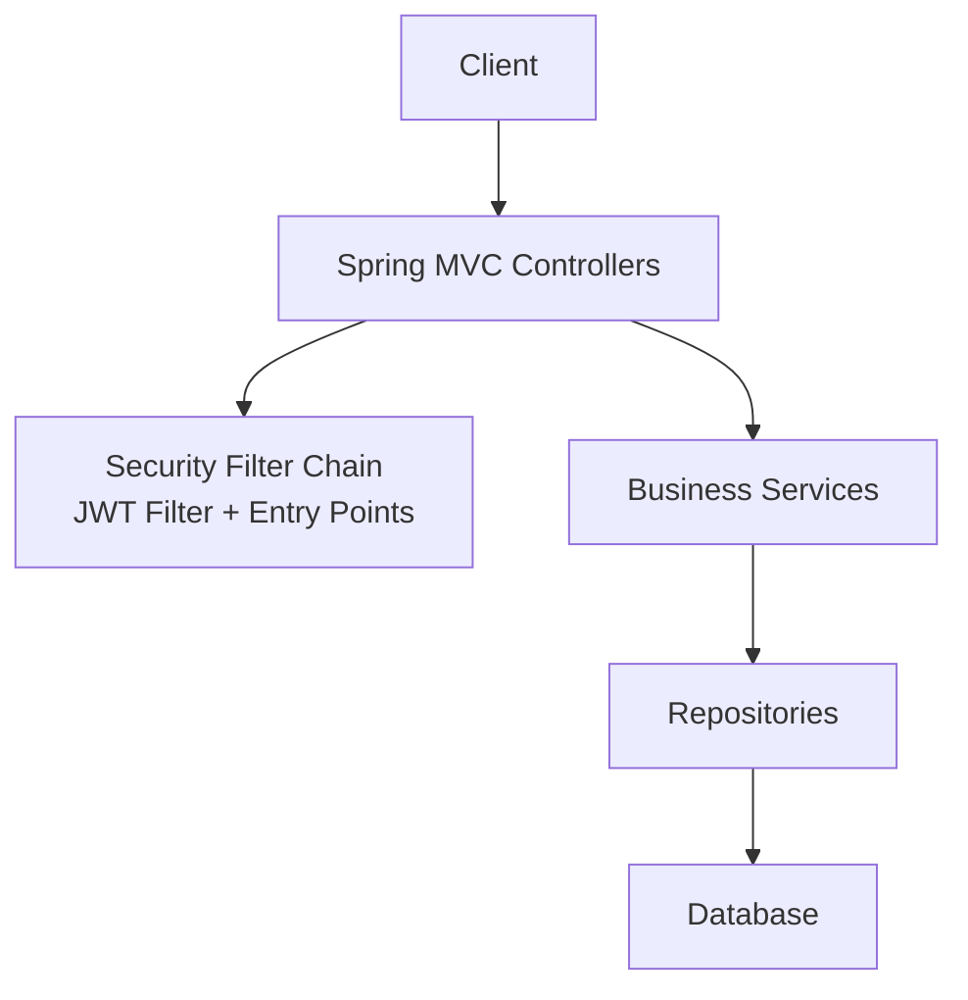
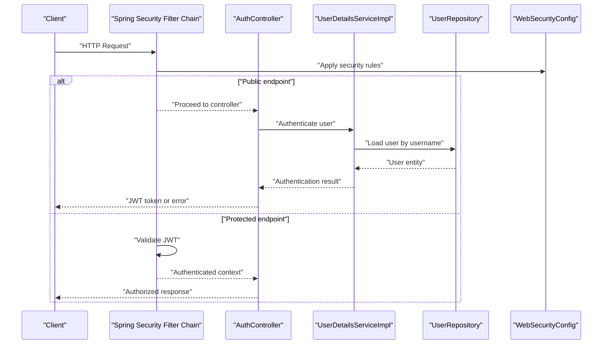
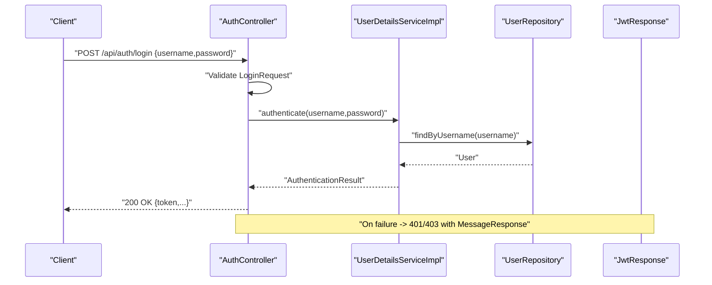
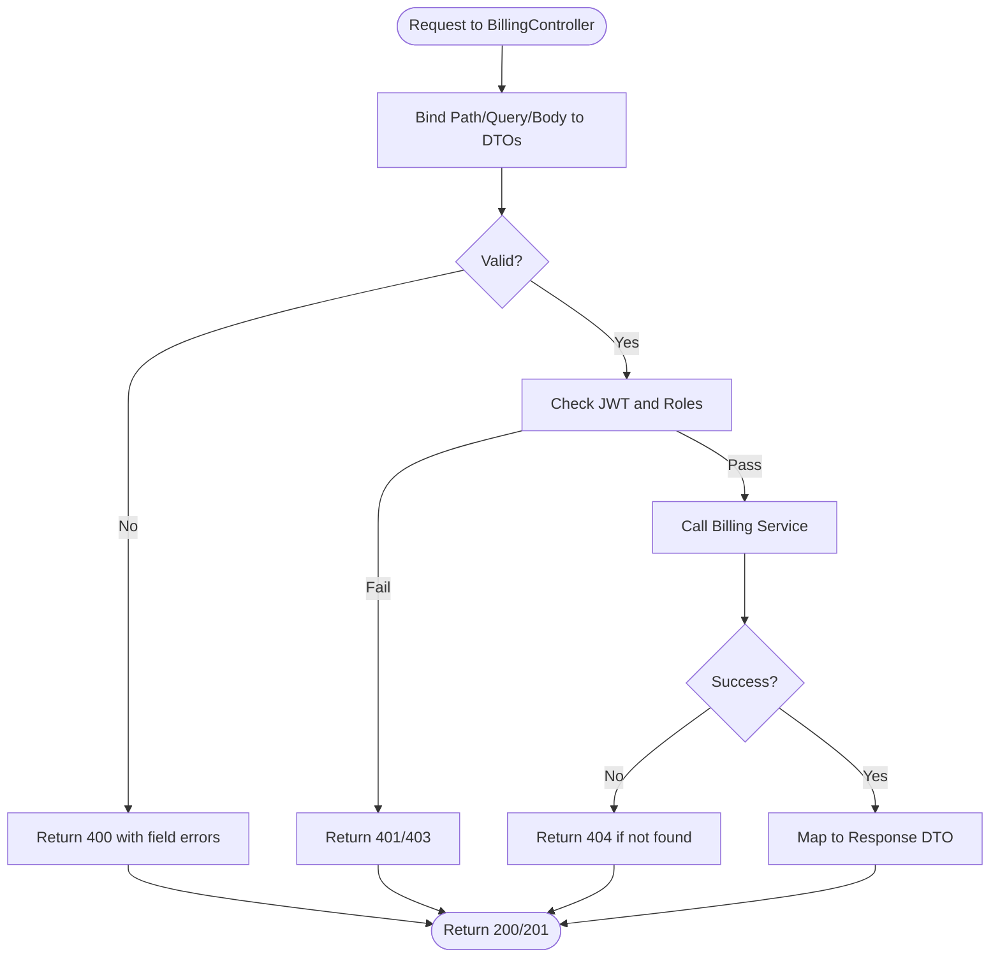
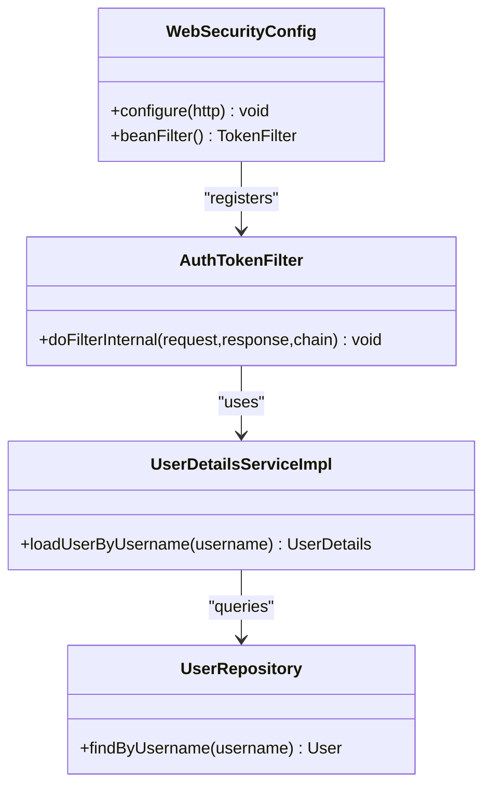
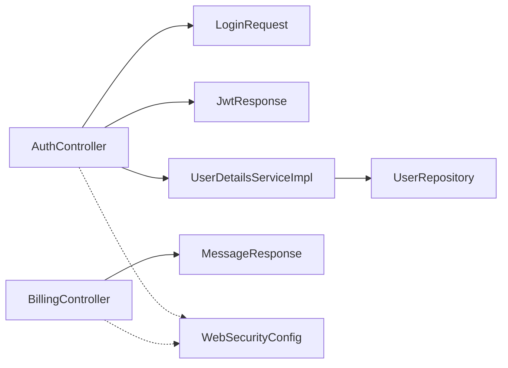

# Presentation Layer (Controllers)

<cite>
**Referenced Files in This Document**
- [AuthController.java](file://backend/src/main/java/com/ceb/billing/controllers/AuthController.java)
- [BillingController.java](file://backend/src/main/java/com/ceb/billing/controllers/BillingController.java)
- [LoginRequest.java](file://backend/src/main/java/com/ceb/billing/models/LoginRequest.java)
- [JwtResponse.java](file://backend/src/main/java/com/ceb/billing/models/JwtResponse.java)
- [MessageResponse.java](file://backend/src/main/java/com/ceb/billing/models/MessageResponse.java)
- [WebSecurityConfig.java](file://backend/src/main/java/com/ceb/billing/config/WebSecurityConfig.java)
- [AuthTokenFilter.java](file://backend/src/main/java/com/ceb/billing/config/AuthTokenFilter.java)
- [UserDetailsServiceImpl.java](file://backend/src/main/java/com/ceb/billing/config/UserDetailsServiceImpl.java)
- [UserRepository.java](file://backend/src/main/java/com/ceb/billing/repositories/UserRepository.java)
</cite>

## Table of Contents
1. [Introduction](#introduction)
2. [Project Structure](#project-structure)
3. [Core Components](#core-components)
4. [Architecture Overview](#architecture-overview)
5. [Detailed Component Analysis](#detailed-component-analysis)
6. [Dependency Analysis](#dependency-analysis)
7. [Performance Considerations](#performance-considerations)
8. [Troubleshooting Guide](#troubleshooting-guide)
9. [Conclusion](#conclusion)

## Introduction
This document explains the presentation layer implementation with a focus on controllers that handle HTTP requests, route them to services, and manage response formatting. It covers RESTful API design patterns, request/response DTOs, validation handling, error responses, and security considerations such as input sanitization, authentication checks, and rate limiting at the controller level. Concrete examples are provided using AuthController and BillingController to illustrate proper responsibilities, parameter binding, and response mapping.

## Project Structure
The backend is organized by layers:
- Controllers under controllers package expose REST endpoints.
- Models under models package define request and response DTOs.
- Config under config package defines security, JWT utilities, filters, and entry points.
- Repositories under repositories package provide data access abstractions.
- Services under services package encapsulate business logic.

[No sources needed since this diagram shows conceptual workflow, not actual code structure]

## Core Components
- Controllers: Handle HTTP verbs, bind parameters, delegate to services, and format responses.
- DTOs: Define structured request payloads and standardized responses.
- Security: Global filter chain validates tokens, enforces authorization, and handles unauthorized access.
- Error Handling: Centralized handlers map exceptions to consistent JSON errors.

Key responsibilities:
- Parameter binding from path/query/body to method arguments.
- Validation via annotations and custom validators.
- Response mapping to DTOs for consistency.
- Delegation to service layer for business logic.
- Security enforcement through Spring Security configuration.

**Section sources**
- [AuthController.java](file://backend/src/main/java/com/ceb/billing/controllers/AuthController.java)
- [BillingController.java](file://backend/src/main/java/com/ceb/billing/controllers/BillingController.java)
- [LoginRequest.java](file://backend/src/main/java/com/ceb/billing/models/LoginRequest.java)
- [JwtResponse.java](file://backend/src/main/java/com/ceb/billing/models/JwtResponse.java)
- [MessageResponse.java](file://backend/src/main/java/com/ceb/billing/models/MessageResponse.java)
- [WebSecurityConfig.java](file://backend/src/main/java/com/ceb/billing/config/WebSecurityConfig.java)
- [AuthTokenFilter.java](file://backend/src/main/java/com/ceb/billing/config/AuthTokenFilter.java)

## Architecture Overview
The controller layer sits behind Spring Security’s filter chain. Authentication and authorization are enforced before reaching controller methods. Controllers validate inputs, call services, and return DTOs.

**Diagram sources**
- [WebSecurityConfig.java](file://backend/src/main/java/com/ceb/billing/config/WebSecurityConfig.java)
- [AuthTokenFilter.java](file://backend/src/main/java/com/ceb/billing/config/AuthTokenFilter.java)
- [UserDetailsServiceImpl.java](file://backend/src/main/java/com/ceb/billing/config/UserDetailsServiceImpl.java)
- [UserRepository.java](file://backend/src/main/java/com/ceb/billing/repositories/UserRepository.java)
- [AuthController.java](file://backend/src/main/java/com/ceb/billing/controllers/AuthController.java)

## Detailed Component Analysis

### AuthController
Responsibilities:
- Expose login endpoint that accepts credentials via a DTO.
- Validate input fields and constraints.
- Authenticate against user details service.
- Return a JWT-based response DTO upon success.
- Map authentication failures to consistent error responses.

RESTful design:
- POST /api/auth/login consumes application/json.
- Request body mapped to LoginRequest DTO.
- Response mapped to JwtResponse DTO.

Validation and sanitization:
- Use Bean Validation annotations on LoginRequest to enforce required fields and formats.
- Avoid raw string concatenation; rely on framework-provided bindings and validators.

Error handling:
- Catch authentication exceptions and return standardized MessageResponse with appropriate status codes.

Security considerations:
- Public endpoint only; protected by explicit permitAll configuration.
- Passwords are never persisted or echoed back; only tokens are issued.

**Diagram sources**
- [AuthController.java](file://backend/src/main/java/com/ceb/billing/controllers/AuthController.java)
- [UserDetailsServiceImpl.java](file://backend/src/main/java/com/ceb/billing/config/UserDetailsServiceImpl.java)
- [UserRepository.java](file://backend/src/main/java/com/ceb/billing/repositories/UserRepository.java)
- [JwtResponse.java](file://backend/src/main/java/com/ceb/billing/models/JwtResponse.java)
- [LoginRequest.java](file://backend/src/main/java/com/ceb/billing/models/LoginRequest.java)

**Section sources**
- [AuthController.java](file://backend/src/main/java/com/ceb/billing/controllers/AuthController.java)
- [LoginRequest.java](file://backend/src/main/java/com/ceb/billing/models/LoginRequest.java)
- [JwtResponse.java](file://backend/src/main/java/com/ceb/billing/models/JwtResponse.java)
- [MessageResponse.java](file://backend/src/main/java/com/ceb/billing/models/MessageResponse.java)
- [WebSecurityConfig.java](file://backend/src/main/java/com/ceb/billing/config/WebSecurityConfig.java)

### BillingController
Responsibilities:
- Expose billing-related endpoints (e.g., list, create, update, delete).
- Bind path variables, query parameters, and request bodies to typed DTOs.
- Delegate operations to billing services.
- Return consistent DTOs for success and error cases.

RESTful design:
- GET /api/billing/{id} returns a single resource.
- GET /api/billing?query=... supports filtering via query parameters.
- POST /api/billing creates a new resource.
- PUT /api/billing/{id} updates an existing resource.
- DELETE /api/billing/{id} removes a resource.

Validation and sanitization:
- Apply Bean Validation on request DTOs for create/update operations.
- Sanitize path and query parameters using framework binding and validation.

Error handling:
- Map not-found scenarios to 404 with MessageResponse.
- Map validation failures to 400 with detailed field errors.
- Map internal errors to 500 with generic messages.

Security considerations:
- Protected endpoints require valid JWT and sufficient roles.
- Enforce ownership checks where applicable (e.g., customer-scoped resources).

**Diagram sources**
- [BillingController.java](file://backend/src/main/java/com/ceb/billing/controllers/BillingController.java)
- [WebSecurityConfig.java](file://backend/src/main/java/com/ceb/billing/config/WebSecurityConfig.java)
- [AuthTokenFilter.java](file://backend/src/main/java/com/ceb/billing/config/AuthTokenFilter.java)

**Section sources**
- [BillingController.java](file://backend/src/main/java/com/ceb/billing/controllers/BillingController.java)
- [MessageResponse.java](file://backend/src/main/java/com/ceb/billing/models/MessageResponse.java)
- [WebSecurityConfig.java](file://backend/src/main/java/com/ceb/billing/config/WebSecurityConfig.java)

### Request and Response DTOs
- LoginRequest: Captures username and password with validation constraints.
- JwtResponse: Encapsulates token and minimal user metadata returned after successful authentication.
- MessageResponse: Standardized error payload used across controllers for consistent client experience.

Best practices:
- Keep DTOs immutable where possible.
- Separate request and response shapes to avoid leaking internal state.
- Use descriptive field names and clear constraints.

**Section sources**
- [LoginRequest.java](file://backend/src/main/java/com/ceb/billing/models/LoginRequest.java)
- [JwtResponse.java](file://backend/src/main/java/com/ceb/billing/models/JwtResponse.java)
- [MessageResponse.java](file://backend/src/main/java/com/ceb/billing/models/MessageResponse.java)

### Security Configuration and Filters
- WebSecurityConfig: Defines permit-all public routes, secures others, and configures JWT strategy.
- AuthTokenFilter: Intercepts requests, extracts and validates JWT, populates SecurityContext.
- UserDetailsServiceImpl: Loads user details and authorities for authentication decisions.

Integration with controllers:
- Controllers rely on @PreAuthorize or role-based rules configured centrally.
- Unauthorized or forbidden requests are handled by entry points returning consistent JSON.

**Diagram sources**
- [WebSecurityConfig.java](file://backend/src/main/java/com/ceb/billing/config/WebSecurityConfig.java)
- [AuthTokenFilter.java](file://backend/src/main/java/com/ceb/billing/config/AuthTokenFilter.java)
- [UserDetailsServiceImpl.java](file://backend/src/main/java/com/ceb/billing/config/UserDetailsServiceImpl.java)
- [UserRepository.java](file://backend/src/main/java/com/ceb/billing/repositories/UserRepository.java)

**Section sources**
- [WebSecurityConfig.java](file://backend/src/main/java/com/ceb/billing/config/WebSecurityConfig.java)
- [AuthTokenFilter.java](file://backend/src/main/java/com/ceb/billing/config/AuthTokenFilter.java)
- [UserDetailsServiceImpl.java](file://backend/src/main/java/com/ceb/billing/config/UserDetailsServiceImpl.java)
- [UserRepository.java](file://backend/src/main/java/com/ceb/billing/repositories/UserRepository.java)

## Dependency Analysis
Controllers depend on:
- DTOs for input/output contracts.
- Services for business logic (not shown here).
- Security configuration for authorization and token processing.
- Repositories indirectly via services.

**Diagram sources**
- [AuthController.java](file://backend/src/main/java/com/ceb/billing/controllers/AuthController.java)
- [BillingController.java](file://backend/src/main/java/com/ceb/billing/controllers/BillingController.java)
- [LoginRequest.java](file://backend/src/main/java/com/ceb/billing/models/LoginRequest.java)
- [JwtResponse.java](file://backend/src/main/java/com/ceb/billing/models/JwtResponse.java)
- [MessageResponse.java](file://backend/src/main/java/com/ceb/billing/models/MessageResponse.java)
- [UserDetailsServiceImpl.java](file://backend/src/main/java/com/ceb/billing/config/UserDetailsServiceImpl.java)
- [UserRepository.java](file://backend/src/main/java/com/ceb/billing/repositories/UserRepository.java)
- [WebSecurityConfig.java](file://backend/src/main/java/com/ceb/billing/config/WebSecurityConfig.java)

**Section sources**
- [AuthController.java](file://backend/src/main/java/com/ceb/billing/controllers/AuthController.java)
- [BillingController.java](file://backend/src/main/java/com/ceb/billing/controllers/BillingController.java)
- [LoginRequest.java](file://backend/src/main/java/com/ceb/billing/models/LoginRequest.java)
- [JwtResponse.java](file://backend/src/main/java/com/ceb/billing/models/JwtResponse.java)
- [MessageResponse.java](file://backend/src/main/java/com/ceb/billing/models/MessageResponse.java)
- [UserDetailsServiceImpl.java](file://backend/src/main/java/com/ceb/billing/config/UserDetailsServiceImpl.java)
- [UserRepository.java](file://backend/src/main/java/com/ceb/billing/repositories/UserRepository.java)
- [WebSecurityConfig.java](file://backend/src/main/java/com/ceb/billing/config/WebSecurityConfig.java)

## Performance Considerations
- Prefer DTOs to minimize serialization overhead and prevent over-fetching.
- Use pagination and filtering on list endpoints to reduce payload sizes.
- Cache read-heavy resources when safe and consistent.
- Avoid heavy computations inside controllers; delegate to services and consider async processing for long-running tasks.
- Ensure database queries are indexed appropriately and use projections where possible.

[No sources needed since this section provides general guidance]

## Troubleshooting Guide
Common issues and resolutions:
- 401 Unauthorized: Missing or invalid JWT; verify token presence and expiration.
- 403 Forbidden: Insufficient roles; check role assignments and endpoint restrictions.
- 400 Bad Request: Validation failures; inspect field-level errors in the response.
- 404 Not Found: Resource does not exist; confirm identifiers and access scope.
- 500 Internal Server Error: Unexpected exceptions; review logs and ensure global exception handler maps errors consistently.

Security checklist:
- Confirm public endpoints are explicitly permitted.
- Validate all inputs using Bean Validation.
- Avoid logging sensitive data (passwords, tokens).
- Implement rate limiting at the gateway or controller level for login and sensitive endpoints.

**Section sources**
- [WebSecurityConfig.java](file://backend/src/main/java/com/ceb/billing/config/WebSecurityConfig.java)
- [AuthTokenFilter.java](file://backend/src/main/java/com/ceb/billing/config/AuthTokenFilter.java)
- [MessageResponse.java](file://backend/src/main/java/com/ceb/billing/models/MessageResponse.java)

## Conclusion
The presentation layer centers on well-structured controllers that bind inputs, enforce validation, delegate to services, and return consistent DTOs. Security is enforced via a centralized filter chain, ensuring robust authentication and authorization. Following the patterns demonstrated by AuthController and BillingController yields maintainable, secure, and predictable APIs.