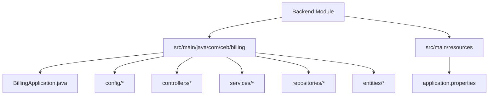
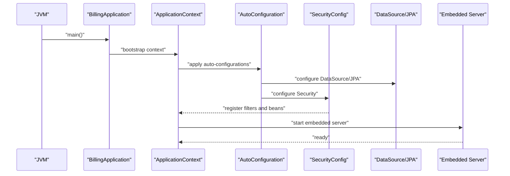
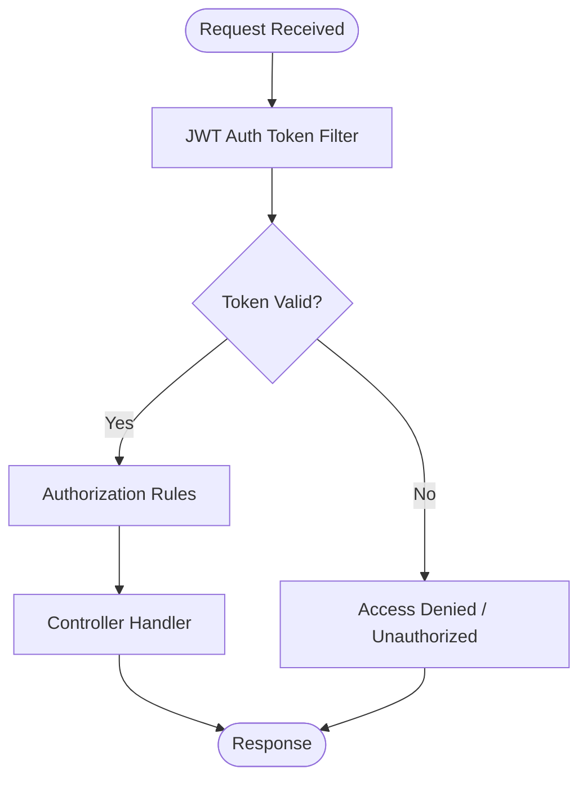
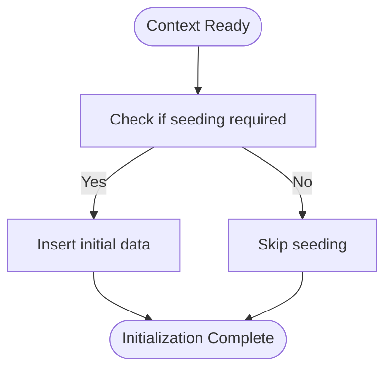
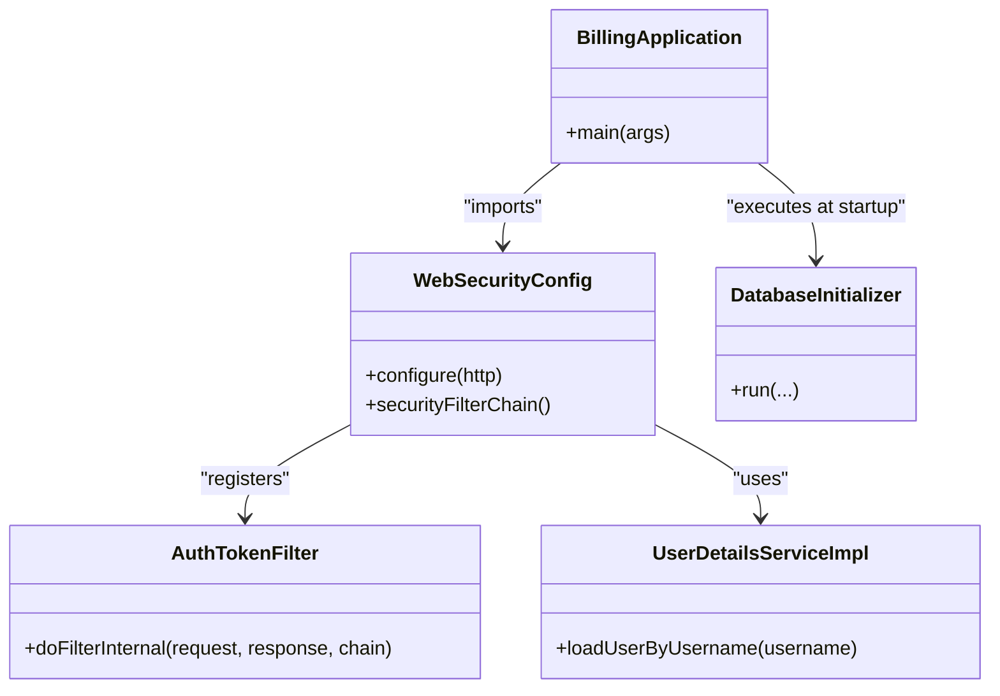

# Spring Boot Application

<cite>
**Referenced Files in This Document**
- [BillingApplication.java](file://backend/src/main/java/com/ceb/billing/BillingApplication.java)
- [pom.xml](file://backend/pom.xml)
- [application.properties](file://backend/src/main/resources/application.properties)
- [WebSecurityConfig.java](file://backend/src/main/java/com/ceb/billing/config/WebSecurityConfig.java)
- [DatabaseInitializer.java](file://backend/src/main/java/com/ceb/billing/config/DatabaseInitializer.java)
- [UserDetailsServiceImpl.java](file://backend/src/main/java/com/ceb/billing/config/UserDetailsServiceImpl.java)
- [AuthTokenFilter.java](file://backend/src/main/java/com/ceb/billing/config/AuthTokenFilter.java)
</cite>

## Table of Contents
1. [Introduction](#introduction)
2. [Project Structure](#project-structure)
3. [Core Components](#core-components)
4. [Architecture Overview](#architecture-overview)
5. [Detailed Component Analysis](#detailed-component-analysis)
6. [Dependency Analysis](#dependency-analysis)
7. [Performance Considerations](#performance-considerations)
8. [Troubleshooting Guide](#troubleshooting-guide)
9. [Conclusion](#conclusion)

## Introduction
This document explains how the Spring Boot application bootstraps and configures itself, including the main application class, auto-configuration mechanisms, dependency injection container setup, Maven build configuration, and application properties. It also provides practical examples for custom configurations, external property sources, lifecycle management, startup optimization, profiling, and monitoring integration.

## Project Structure
The backend module follows a typical Spring Boot layout:
- Main entry point under com.ceb.billing
- Configuration classes under config
- Controllers, services, repositories, entities, models, and utilities organized by feature
- Build configuration in pom.xml
- Runtime configuration in application.properties

[No sources needed since this diagram shows conceptual structure]

## Core Components
- Main application class: Declares the Spring Boot entry point and enables component scanning and auto-configuration.
- Security configuration: Configures security filters, JWT handling, and access rules.
- Database initialization: Seeds or initializes database state at startup.
- User details service: Provides user authentication details to the security framework.
- Token filter: Intercepts requests to validate JWT tokens.

Key responsibilities:
- Bootstrap the Spring ApplicationContext
- Register beans via @Configuration and @ComponentScan
- Apply Spring Boot auto-configuration for web, data, and security
- Load environment-specific settings from application properties

**Section sources**
- [BillingApplication.java](file://backend/src/main/java/com/ceb/billing/BillingApplication.java)
- [WebSecurityConfig.java](file://backend/src/main/java/com/ceb/billing/config/WebSecurityConfig.java)
- [DatabaseInitializer.java](file://backend/src/main/java/com/ceb/billing/config/DatabaseInitializer.java)
- [UserDetailsServiceImpl.java](file://backend/src/main/java/com/ceb/billing/config/UserDetailsServiceImpl.java)
- [AuthTokenFilter.java](file://backend/src/main/java/com/ceb/billing/config/AuthTokenFilter.java)

## Architecture Overview
At runtime, Spring Boot performs the following:
- Starts the embedded web server (Tomcat by default)
- Creates the ApplicationContext
- Applies auto-configuration based on classpath and properties
- Scans components and wires dependencies
- Initializes persistence and security layers
- Exposes REST endpoints through controllers

**Diagram sources**
- [BillingApplication.java](file://backend/src/main/java/com/ceb/billing/BillingApplication.java)
- [WebSecurityConfig.java](file://backend/src/main/java/com/ceb/billing/config/WebSecurityConfig.java)

**Section sources**
- [BillingApplication.java](file://backend/src/main/java/com/ceb/billing/BillingApplication.java)
- [WebSecurityConfig.java](file://backend/src/main/java/com/ceb/billing/config/WebSecurityConfig.java)

## Detailed Component Analysis

### Main Application Class
Responsibilities:
- Entry point annotated to enable auto-configuration and component scanning
- Optional exclusions or additional configuration flags
- Can register listeners or runners for lifecycle tasks

Best practices:
- Keep it minimal; delegate logic to configuration classes and services
- Use profiles to separate environments
- Avoid heavy work in main()

**Section sources**
- [BillingApplication.java](file://backend/src/main/java/com/ceb/billing/BillingApplication.java)

### Auto-Configuration Mechanisms
Spring Boot auto-configures common infrastructure when relevant libraries are present:
- Web MVC and embedded server
- Data JPA and DataSource
- Security with filters and authorization
- Actuator endpoints for health and metrics

How it works:
- Conditional annotations select implementations based on classpath and properties
- Properties override defaults
- Custom @Configuration classes can refine or replace defaults

**Section sources**
- [WebSecurityConfig.java](file://backend/src/main/java/com/ceb/billing/config/WebSecurityConfig.java)
- [application.properties](file://backend/src/main/resources/application.properties)

### Dependency Injection Container Setup
- Component scanning discovers @Service, @Repository, @Controller, and @Configuration classes
- @Autowired injects dependencies into fields, constructors, or methods
- @Bean registers third-party or custom beans
- Profiles control which beans are active per environment

Practical tips:
- Prefer constructor injection for clarity and testability
- Use @Profile to activate environment-specific beans
- Centralize bean definitions in dedicated configuration classes

**Section sources**
- [UserDetailsServiceImpl.java](file://backend/src/main/java/com/ceb/billing/config/UserDetailsServiceImpl.java)
- [AuthTokenFilter.java](file://backend/src/main/java/com/ceb/billing/config/AuthTokenFilter.java)

### Security Configuration
- Defines request authorization rules
- Registers JWT token filter and authentication entry points
- Configures password encoder and user details provider
- Integrates with Spring Security’s filter chain

**Diagram sources**
- [WebSecurityConfig.java](file://backend/src/main/java/com/ceb/billing/config/WebSecurityConfig.java)
- [AuthTokenFilter.java](file://backend/src/main/java/com/ceb/billing/config/AuthTokenFilter.java)

**Section sources**
- [WebSecurityConfig.java](file://backend/src/main/java/com/ceb/billing/config/WebSecurityConfig.java)
- [AuthTokenFilter.java](file://backend/src/main/java/com/ceb/billing/config/AuthTokenFilter.java)

### Database Initialization
- Runs at startup to seed or migrate initial data
- Uses repository or JDBC to insert reference data
- Controlled by conditions to avoid re-seeding in production

**Diagram sources**
- [DatabaseInitializer.java](file://backend/src/main/java/com/ceb/billing/config/DatabaseInitializer.java)

**Section sources**
- [DatabaseInitializer.java](file://backend/src/main/java/com/ceb/billing/config/DatabaseInitializer.java)

### Maven Build Configuration
Focus areas:
- Parent and dependency management
- Java version and compiler settings
- Packaging and executable jar creation
- Plugin configurations for testing, packaging, and optional code quality checks

Typical elements:
- Spring Boot parent for dependency alignment
- Starter dependencies for web, data, security, and actuator
- Executable jar plugin configuration
- Profile-based resource filtering and activation

**Section sources**
- [pom.xml](file://backend/pom.xml)

### Application Properties Configuration
Common categories:
- Server settings (port, context path)
- Database connection (URL, username, password, driver)
- JPA/Hibernate behavior (DDL generation, dialect, show SQL)
- Security settings (JWT secret, token expiration)
- Logging levels and format
- Feature toggles and environment-specific overrides

Externalization strategies:
- Environment variables
- Command-line arguments
- External files via --spring.config.location
- Profile-specific files (e.g., application-dev.properties)

**Section sources**
- [application.properties](file://backend/src/main/resources/application.properties)

### Practical Examples

#### Custom Configuration Class
- Create a @Configuration class to encapsulate domain-specific settings
- Use @Value or @ConfigurationProperties to bind properties
- Provide sensible defaults and validation

Lifecycle hooks:
- Implement CommandLineRunner or ApplicationRunner for startup tasks
- Use @EventListener(ApplicationReadyEvent.class) for post-startup actions

External property sources:
- Use @PropertySource for non-standard locations
- Rely on Spring Boot’s externalized configuration for portability

**Section sources**
- [WebSecurityConfig.java](file://backend/src/main/java/com/ceb/billing/config/WebSecurityConfig.java)
- [DatabaseInitializer.java](file://backend/src/main/java/com/ceb/billing/config/DatabaseInitializer.java)
- [application.properties](file://backend/src/main/resources/application.properties)

## Dependency Analysis
High-level relationships among core components:

**Diagram sources**
- [BillingApplication.java](file://backend/src/main/java/com/ceb/billing/BillingApplication.java)
- [WebSecurityConfig.java](file://backend/src/main/java/com/ceb/billing/config/WebSecurityConfig.java)
- [AuthTokenFilter.java](file://backend/src/main/java/com/ceb/billing/config/AuthTokenFilter.java)
- [UserDetailsServiceImpl.java](file://backend/src/main/java/com/ceb/billing/config/UserDetailsServiceImpl.java)
- [DatabaseInitializer.java](file://backend/src/main/java/com/ceb/billing/config/DatabaseInitializer.java)

**Section sources**
- [BillingApplication.java](file://backend/src/main/java/com/ceb/billing/BillingApplication.java)
- [WebSecurityConfig.java](file://backend/src/main/java/com/ceb/billing/config/WebSecurityConfig.java)
- [AuthTokenFilter.java](file://backend/src/main/java/com/ceb/billing/config/AuthTokenFilter.java)
- [UserDetailsServiceImpl.java](file://backend/src/main/java/com/ceb/billing/config/UserDetailsServiceImpl.java)
- [DatabaseInitializer.java](file://backend/src/main/java/com/ceb/billing/config/DatabaseInitializer.java)

## Performance Considerations
Startup optimization:
- Lazy initialize non-critical beans where appropriate
- Defer heavy initialization to background tasks or scheduled jobs
- Use profiles to exclude dev-only features in production
- Tune JPA and connection pool settings for your workload

Profiling and monitoring:
- Enable Actuator endpoints for health, info, metrics, and logs
- Integrate Micrometer with Prometheus/Grafana or other backends
- Configure logging levels per package for diagnostics
- Use JVM and OS-level profilers during performance tests

[No sources needed since this section provides general guidance]

## Troubleshooting Guide
Common issues and resolutions:
- Startup failures due to missing properties: verify external configuration and profile activation
- Database connectivity problems: check URL, credentials, and network access; review Hibernate DDL settings
- Security misconfigurations: ensure JWT secrets and token lifetimes are correct; verify filter registration order
- Bean conflicts: use @Primary or explicit bean names; leverage profiles to isolate conflicting beans

Useful endpoints and logs:
- Health and info endpoints for status
- Metrics endpoint for runtime indicators
- Logback configuration for structured logs and sampling

**Section sources**
- [application.properties](file://backend/src/main/resources/application.properties)
- [WebSecurityConfig.java](file://backend/src/main/java/com/ceb/billing/config/WebSecurityConfig.java)

## Conclusion
This Spring Boot application leverages auto-configuration, component scanning, and externalized properties to provide a secure, data-driven REST API. The main application class orchestrates bootstrap, while dedicated configuration classes manage security and database initialization. Maven defines reproducible builds and packaging, and application properties centralize environment-specific settings. Adopting the patterns described here will improve maintainability, observability, and performance across environments.