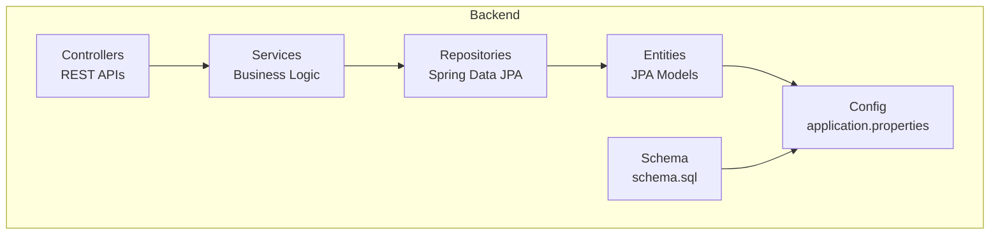
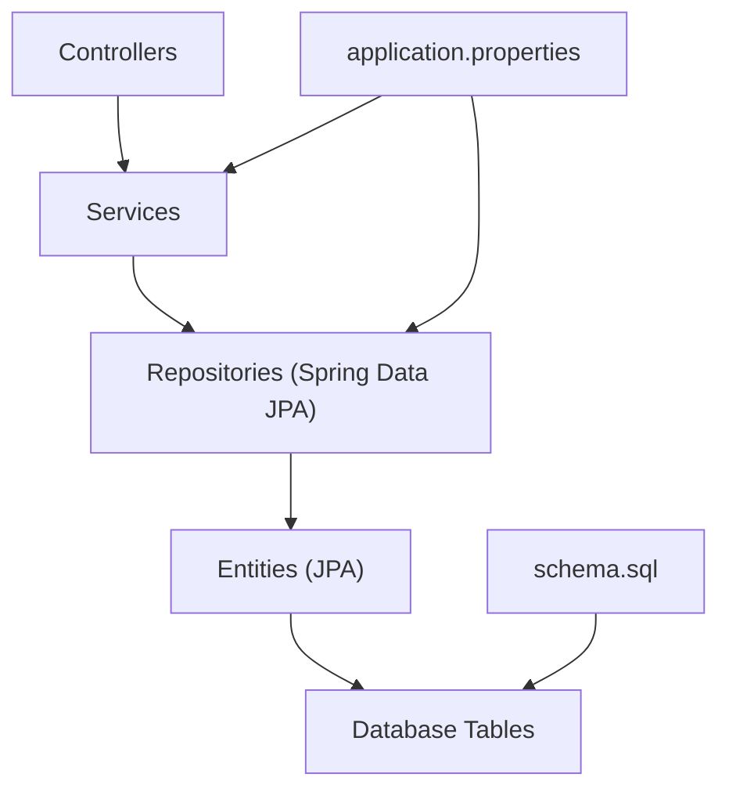
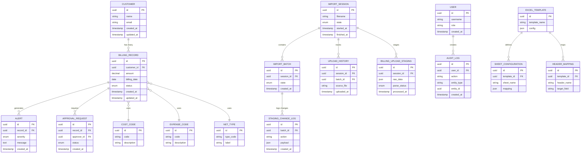
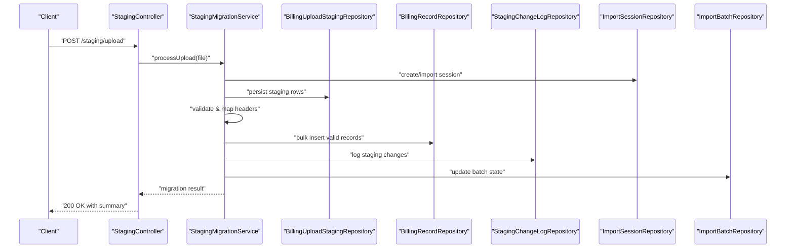
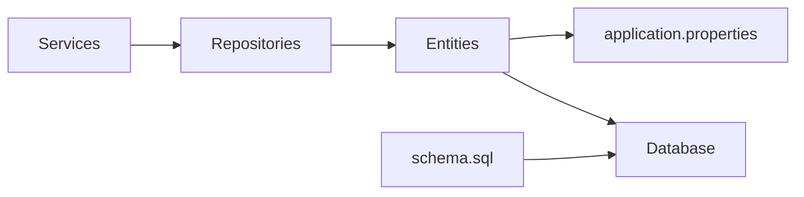

# Data Architecture

<cite>
**Referenced Files in This Document**
- [application.properties](file://backend/src/main/resources/application.properties)
- [schema.sql](file://schema.sql)
- [BillingApplication.java](file://backend/src/main/java/com/ceb/billing/BillingApplication.java)
- [DatabaseInitializer.java](file://backend/src/main/java/com/ceb/billing/config/DatabaseInitializer.java)
- [StagingMigrationService.java](file://backend/src/main/java/com/ceb/billing/services/StagingMigrationService.java)
- [Alert.java](file://backend/src/main/java/com/ceb/billing/entities/Alert.java)
- [ApprovalRequest.java](file://backend/src/main/java/com/ceb/billing/entities/ApprovalRequest.java)
- [AuditLog.java](file://backend/src/main/java/com/ceb/billing/entities/AuditLog.java)
- [BillingRecord.java](file://backend/src/main/java/com/ceb/billing/entities/BillingRecord.java)
- [BillingUploadStaging.java](file://backend/src/main/java/com/ceb/billing/entities/BillingUploadStaging.java)
- [CostCode.java](file://backend/src/main/java/com/ceb/billing/entities/CostCode.java)
- [Customer.java](file://backend/src/main/java/com/ceb/billing/entities/Customer.java)
- [ExcelTemplate.java](file://backend/src/main/java/com/ceb/billing/entities/ExcelTemplate.java)
- [ExpenseCode.java](file://backend/src/main/java/com/ceb/billing/entities/ExpenseCode.java)
- [HeaderMapping.java](file://backend/src/main/java/com/ceb/billing/entities/HeaderMapping.java)
- [ImportAuditLog.java](file://backend/src/main/java/com/ceb/billing/entities/ImportAuditLog.java)
- [ImportBatch.java](file://backend/src/main/java/com/ceb/billing/entities/ImportBatch.java)
- [ImportSession.java](file://backend/src/main/java/com/ceb/billing/entities/ImportSession.java)
- [NetType.java](file://backend/src/main/java/com/ceb/billing/entities/NetType.java)
- [SheetConfiguration.java](file://backend/src/main/java/com/ceb/billing/entities/SheetConfiguration.java)
- [StagingChangeLog.java](file://backend/src/main/java/com/ceb/billing/entities/StagingChangeLog.java)
- [UploadHistory.java](file://backend/src/main/java/com/ceb/billing/entities/UploadHistory.java)
- [User.java](file://backend/src/main/java/com/ceb/billing/entities/User.java)
- [AlertRepository.java](file://backend/src/main/java/com/ceb/billing/repositories/AlertRepository.java)
- [ApprovalRequestRepository.java](file://backend/src/main/java/com/ceb/billing/repositories/ApprovalRequestRepository.java)
- [AuditLogRepository.java](file://backend/src/main/java/com/ceb/billing/repositories/AuditLogRepository.java)
- [BillingRecordRepository.java](file://backend/src/main/java/com/ceb/billing/repositories/BillingRecordRepository.java)
- [BillingUploadStagingRepository.java](file://backend/src/main/java/com/ceb/billing/repositories/BillingUploadStagingRepository.java)
- [CostCodeRepository.java](file://backend/src/main/java/com/ceb/billing/repositories/CostCodeRepository.java)
- [CustomerRepository.java](file://backend/src/main/java/com/ceb/billing/repositories/CustomerRepository.java)
- [ExcelTemplateRepository.java](file://backend/src/main/java/com/ceb/billing/repositories/ExcelTemplateRepository.java)
- [ExpenseCodeRepository.java](file://backend/src/main/java/com/ceb/billing/repositories/ExpenseCodeRepository.java)
- [HeaderMappingRepository.java](file://backend/src/main/java/com/ceb/billing/repositories/HeaderMappingRepository.java)
- [ImportAuditLogRepository.java](file://backend/src/main/java/com/ceb/billing/repositories/ImportAuditLogRepository.java)
- [ImportBatchRepository.java](file://backend/src/main/java/com/ceb/billing/repositories/ImportBatchRepository.java)
- [ImportSessionRepository.java](file://backend/src/main/java/com/ceb/billing/repositories/ImportSessionRepository.java)
- [NetTypeRepository.java](file://backend/src/main/java/com/ceb/billing/repositories/NetTypeRepository.java)
- [SheetConfigurationRepository.java](file://backend/src/main/java/com/ceb/billing/repositories/SheetConfigurationRepository.java)
- [StagingChangeLogRepository.java](file://backend/src/main/java/com/ceb/billing/repositories/StagingChangeLogRepository.java)
- [UploadHistoryRepository.java](file://backend/src/main/java/com/ceb/billing/repositories/UploadHistoryRepository.java)
- [UserRepository.java](file://backend/src/main/java/com/ceb/billing/repositories/UserRepository.java)
</cite>

## Table of Contents
1. [Introduction](#introduction)
2. [Project Structure](#project-structure)
3. [Core Components](#core-components)
4. [Architecture Overview](#architecture-overview)
5. [Detailed Component Analysis](#detailed-component-analysis)
6. [Dependency Analysis](#dependency-analysis)
7. [Performance Considerations](#performance-considerations)
8. [Troubleshooting Guide](#troubleshooting-guide)
9. [Conclusion](#conclusion)
10. [Appendices](#appendices)

## Introduction
This document describes the data layer architecture for the billing application, focusing on JPA entity relationships, database schema design principles, and data access patterns. It explains the repository pattern implementation, query optimization strategies, transaction management, staging-to-production migration flows, backup procedures, performance tuning approaches, caching mechanisms, connection pooling, and indexing strategies. The goal is to provide a comprehensive guide for developers and DBAs to understand, maintain, and optimize the system’s data persistence layer.

## Project Structure
The backend organizes data-related code into clear layers:
- Entities: JPA domain models representing tables and relationships
- Repositories: Spring Data JPA interfaces implementing the repository pattern
- Services: Business logic orchestrating data operations, including staging migrations
- Configuration: Application properties and database initialization utilities
- Schema: SQL schema definition for initial setup or tooling

**Diagram sources**
- [BillingApplication.java](file://backend/src/main/java/com/ceb/billing/BillingApplication.java)
- [application.properties](file://backend/src/main/resources/application.properties)
- [schema.sql](file://schema.sql)

**Section sources**
- [BillingApplication.java](file://backend/src/main/java/com/ceb/billing/BillingApplication.java)
- [application.properties](file://backend/src/main/resources/application.properties)
- [schema.sql](file://schema.sql)

## Core Components
- Entities define the persistent domain with JPA annotations and relationships (e.g., one-to-many, many-to-one). Examples include BillingRecord, Customer, CostCode, ExpenseCode, NetType, User, ImportSession, ImportBatch, UploadHistory, StagingChangeLog, AuditLog, Alert, ApprovalRequest, ExcelTemplate, SheetConfiguration, HeaderMapping, and staging entities like BillingUploadStaging.
- Repositories extend Spring Data JPA interfaces to provide CRUD and custom queries without boilerplate. Each entity has a corresponding repository (e.g., BillingRecordRepository, CustomerRepository, BillingUploadStagingRepository).
- Services implement business workflows such as staging import, validation, and migration to production tables. Notable service: StagingMigrationService.
- Configuration includes application properties for datasource, JPA/Hibernate settings, and optional cache/pooling parameters. DatabaseInitializer seeds reference data if needed.

Key responsibilities:
- Entities: model structure, constraints, and relationships
- Repositories: query exposure and optimization hooks
- Services: orchestration, transactions, and staging-to-production flow
- Config: runtime behavior for DB connectivity and JPA

**Section sources**
- [Alert.java](file://backend/src/main/java/com/ceb/billing/entities/Alert.java)
- [ApprovalRequest.java](file://backend/src/main/java/com/ceb/billing/entities/ApprovalRequest.java)
- [AuditLog.java](file://backend/src/main/java/com/ceb/billing/entities/AuditLog.java)
- [BillingRecord.java](file://backend/src/main/java/com/ceb/billing/entities/BillingRecord.java)
- [BillingUploadStaging.java](file://backend/src/main/java/com/ceb/billing/entities/BillingUploadStaging.java)
- [CostCode.java](file://backend/src/main/java/com/ceb/billing/entities/CostCode.java)
- [Customer.java](file://backend/src/main/java/com/ceb/billing/entities/Customer.java)
- [ExcelTemplate.java](file://backend/src/main/java/com/ceb/billing/entities/ExcelTemplate.java)
- [ExpenseCode.java](file://backend/src/main/java/com/ceb/billing/entities/ExpenseCode.java)
- [HeaderMapping.java](file://backend/src/main/java/com/ceb/billing/entities/HeaderMapping.java)
- [ImportAuditLog.java](file://backend/src/main/java/com/ceb/billing/entities/ImportAuditLog.java)
- [ImportBatch.java](file://backend/src/main/java/com/ceb/billing/entities/ImportBatch.java)
- [ImportSession.java](file://backend/src/main/java/com/ceb/billing/entities/ImportSession.java)
- [NetType.java](file://backend/src/main/java/com/ceb/billing/entities/NetType.java)
- [SheetConfiguration.java](file://backend/src/main/java/com/ceb/billing/entities/SheetConfiguration.java)
- [StagingChangeLog.java](file://backend/src/main/java/com/ceb/billing/entities/StagingChangeLog.java)
- [UploadHistory.java](file://backend/src/main/java/com/ceb/billing/entities/UploadHistory.java)
- [User.java](file://backend/src/main/java/com/ceb/billing/entities/User.java)
- [AlertRepository.java](file://backend/src/main/java/com/ceb/billing/repositories/AlertRepository.java)
- [ApprovalRequestRepository.java](file://backend/src/main/java/com/ceb/billing/repositories/ApprovalRequestRepository.java)
- [AuditLogRepository.java](file://backend/src/main/java/com/ceb/billing/repositories/AuditLogRepository.java)
- [BillingRecordRepository.java](file://backend/src/main/java/com/ceb/billing/repositories/BillingRecordRepository.java)
- [BillingUploadStagingRepository.java](file://backend/src/main/java/com/ceb/billing/repositories/BillingUploadStagingRepository.java)
- [CostCodeRepository.java](file://backend/src/main/java/com/ceb/billing/repositories/CostCodeRepository.java)
- [CustomerRepository.java](file://backend/src/main/java/com/ceb/billing/repositories/CustomerRepository.java)
- [ExcelTemplateRepository.java](file://backend/src/main/java/com/ceb/billing/repositories/ExcelTemplateRepository.java)
- [ExpenseCodeRepository.java](file://backend/src/main/java/com/ceb/billing/repositories/ExpenseCodeRepository.java)
- [HeaderMappingRepository.java](file://backend/src/main/java/com/ceb/billing/repositories/HeaderMappingRepository.java)
- [ImportAuditLogRepository.java](file://backend/src/main/java/com/ceb/billing/repositories/ImportAuditLogRepository.java)
- [ImportBatchRepository.java](file://backend/src/main/java/com/ceb/billing/repositories/ImportBatchRepository.java)
- [ImportSessionRepository.java](file://backend/src/main/java/com/ceb/billing/repositories/ImportSessionRepository.java)
- [NetTypeRepository.java](file://backend/src/main/java/com/ceb/billing/repositories/NetTypeRepository.java)
- [SheetConfigurationRepository.java](file://backend/src/main/java/com/ceb/billing/repositories/SheetConfigurationRepository.java)
- [StagingChangeLogRepository.java](file://backend/src/main/java/com/ceb/billing/repositories/StagingChangeLogRepository.java)
- [UploadHistoryRepository.java](file://backend/src/main/java/com/ceb/billing/repositories/UploadHistoryRepository.java)
- [UserRepository.java](file://backend/src/main/java/com/ceb/billing/repositories/UserRepository.java)
- [StagingMigrationService.java](file://backend/src/main/java/com/ceb/billing/services/StagingMigrationService.java)
- [DatabaseInitializer.java](file://backend/src/main/java/com/ceb/billing/config/DatabaseInitializer.java)
- [application.properties](file://backend/src/main/resources/application.properties)

## Architecture Overview
The data layer follows a layered architecture:
- Controllers expose REST endpoints that delegate to services
- Services coordinate business logic and call repositories
- Repositories use Spring Data JPA to interact with entities
- Entities map to database tables via JPA annotations
- Configuration defines datasource, JPA/Hibernate behavior, and optional caches/pools
- Schema provides baseline table definitions

**Diagram sources**
- [BillingApplication.java](file://backend/src/main/java/com/ceb/billing/BillingApplication.java)
- [application.properties](file://backend/src/main/resources/application.properties)
- [schema.sql](file://schema.sql)

## Detailed Component Analysis

### Entity Relationship Model
The core domain includes customers, billing records, cost and expense codes, net types, users, imports, staging, audit, alerts, approvals, templates, and sheet/header mappings. Relationships typically follow:
- One customer to many billing records
- Many billing records per import session/batch
- Staging records mapped to production billing records
- Audit logs and change logs tied to sessions and batches
- Alerts and approval requests associated with records or sessions
- Reference data (cost codes, expense codes, net types) linked to billing records

**Diagram sources**
- [BillingRecord.java](file://backend/src/main/java/com/ceb/billing/entities/BillingRecord.java)
- [Customer.java](file://backend/src/main/java/com/ceb/billing/entities/Customer.java)
- [ImportSession.java](file://backend/src/main/java/com/ceb/billing/entities/ImportSession.java)
- [ImportBatch.java](file://backend/src/main/java/com/ceb/billing/entities/ImportBatch.java)
- [UploadHistory.java](file://backend/src/main/java/com/ceb/billing/entities/UploadHistory.java)
- [StagingChangeLog.java](file://backend/src/main/java/com/ceb/billing/entities/StagingChangeLog.java)
- [AuditLog.java](file://backend/src/main/java/com/ceb/billing/entities/AuditLog.java)
- [Alert.java](file://backend/src/main/java/com/ceb/billing/entities/Alert.java)
- [ApprovalRequest.java](file://backend/src/main/java/com/ceb/billing/entities/ApprovalRequest.java)
- [CostCode.java](file://backend/src/main/java/com/ceb/billing/entities/CostCode.java)
- [ExpenseCode.java](file://backend/src/main/java/com/ceb/billing/entities/ExpenseCode.java)
- [NetType.java](file://backend/src/main/java/com/ceb/billing/entities/NetType.java)
- [User.java](file://backend/src/main/java/com/ceb/billing/entities/User.java)
- [ExcelTemplate.java](file://backend/src/main/java/com/ceb/billing/entities/ExcelTemplate.java)
- [SheetConfiguration.java](file://backend/src/main/java/com/ceb/billing/entities/SheetConfiguration.java)
- [HeaderMapping.java](file://backend/src/main/java/com/ceb/billing/entities/HeaderMapping.java)
- [BillingUploadStaging.java](file://backend/src/main/java/com/ceb/billing/entities/BillingUploadStaging.java)

### Repository Pattern Implementation
Each entity has a dedicated repository interface extending Spring Data JPA’s base interfaces. This enables:
- Standard CRUD operations out-of-the-box
- Derived query methods based on property names
- Custom JPQL/Native queries where necessary
- Pagination and sorting support

Examples of repository roles:
- BillingRecordRepository: read/write billing records, bulk operations
- BillingUploadStagingRepository: staging reads/writes for import pipelines
- ImportSessionRepository/ImportBatchRepository: lifecycle tracking
- AuditLogRepository/StagingChangeLogRepository: append-only logging
- Reference repositories (CostCodeRepository, ExpenseCodeRepository, NetTypeRepository): lookup and seeding

Optimization tips:
- Use @Query with indexed columns for frequent filters
- Prefer projections for read-heavy endpoints
- Batch writes using saveAll and flush periodically

**Section sources**
- [BillingRecordRepository.java](file://backend/src/main/java/com/ceb/billing/repositories/BillingRecordRepository.java)
- [BillingUploadStagingRepository.java](file://backend/src/main/java/com/ceb/billing/repositories/BillingUploadStagingRepository.java)
- [ImportSessionRepository.java](file://backend/src/main/java/com/ceb/billing/repositories/ImportSessionRepository.java)
- [ImportBatchRepository.java](file://backend/src/main/java/com/ceb/billing/repositories/ImportBatchRepository.java)
- [AuditLogRepository.java](file://backend/src/main/java/com/ceb/billing/repositories/AuditLogRepository.java)
- [StagingChangeLogRepository.java](file://backend/src/main/java/com/ceb/billing/repositories/StagingChangeLogRepository.java)
- [CostCodeRepository.java](file://backend/src/main/java/com/ceb/billing/repositories/CostCodeRepository.java)
- [ExpenseCodeRepository.java](file://backend/src/main/java/com/ceb/billing/repositories/ExpenseCodeRepository.java)
- [NetTypeRepository.java](file://backend/src/main/java/com/ceb/billing/repositories/NetTypeRepository.java)

### Staging-to-Production Migration Flow
The staging pipeline stages raw uploads, validates, maps headers, and migrates validated rows into production tables. The process is orchestrated by services and tracked via audit/change logs.

**Diagram sources**
- [StagingMigrationService.java](file://backend/src/main/java/com/ceb/billing/services/StagingMigrationService.java)
- [BillingUploadStagingRepository.java](file://backend/src/main/java/com/ceb/billing/repositories/BillingUploadStagingRepository.java)
- [BillingRecordRepository.java](file://backend/src/main/java/com/ceb/billing/repositories/BillingRecordRepository.java)
- [StagingChangeLogRepository.java](file://backend/src/main/java/com/ceb/billing/repositories/StagingChangeLogRepository.java)
- [ImportSessionRepository.java](file://backend/src/main/java/com/ceb/billing/repositories/ImportSessionRepository.java)
- [ImportBatchRepository.java](file://backend/src/main/java/com/ceb/billing/repositories/ImportBatchRepository.java)

### Transaction Management
- Use declarative transactions at service boundaries to ensure consistency across staging writes, validations, and production inserts.
- Employ rollback semantics for failed validations or partial failures.
- For large batches, consider chunked processing with periodic commits to avoid long-running transactions and excessive lock times.

Best practices:
- Annotate service methods with transactional boundaries
- Avoid unnecessary nested transactions
- Keep unit-of-work scope minimal around I/O

**Section sources**
- [StagingMigrationService.java](file://backend/src/main/java/com/ceb/billing/services/StagingMigrationService.java)

### Query Optimization Strategies
- Index frequently filtered columns (e.g., customer_id, billing_date, status).
- Use derived queries or @Query with selective fields to reduce payload size.
- Leverage pagination for list endpoints.
- Prefer JOIN FETCH only when necessary; otherwise, use separate queries to avoid N+1 issues.
- Monitor slow queries via Hibernate statistics and database profiling.

**Section sources**
- [BillingRecordRepository.java](file://backend/src/main/java/com/ceb/billing/repositories/BillingRecordRepository.java)
- [BillingUploadStagingRepository.java](file://backend/src/main/java/com/ceb/billing/repositories/BillingUploadStagingRepository.java)

### Data Migration Strategies
- Maintain a canonical schema definition in schema.sql for baseline setup.
- Use versioned migrations for evolving schemas (e.g., Flyway/Liquibase) to manage incremental changes safely.
- Apply migrations before application startup; validate schema compatibility.
- Back up databases prior to applying migrations.

**Section sources**
- [schema.sql](file://schema.sql)

### Backup Procedures
- Schedule regular full backups and incremental WAL-based backups for point-in-time recovery.
- Test restore procedures regularly.
- Encrypt backups at rest and in transit.
- Retain backups according to compliance requirements.

[No sources needed since this section provides general guidance]

### Performance Tuning Approaches
- Connection pooling: tune pool size, idle timeouts, and validation queries.
- JPA/Hibernate: enable second-level cache for reference data, configure batch sizes, and disable unnecessary SQL logging in production.
- Database: analyze and update indexes, run VACUUM/ANALYZE equivalents, and monitor execution plans.
- Application: use projections, limit result sets, and cache hot lookups.

**Section sources**
- [application.properties](file://backend/src/main/resources/application.properties)

### Caching Mechanisms
- Cache reference data (cost codes, expense codes, net types) using Spring Cache or a second-level cache provider.
- Configure cache TTLs and eviction policies appropriate for data volatility.
- Invalidate caches after write operations or scheduled refreshes.

**Section sources**
- [application.properties](file://backend/src/main/resources/application.properties)

### Connection Pooling
- Configure pool size based on CPU cores and expected concurrency.
- Set connection timeout, idle timeout, and max lifetime to prevent leaks.
- Enable health checks and monitoring for pool utilization.

**Section sources**
- [application.properties](file://backend/src/main/resources/application.properties)

### Database Indexing Strategies
- Add composite indexes for common filter combinations (e.g., customer_id + billing_date).
- Covering indexes for frequent projection queries.
- Unique indexes for integrity constraints (e.g., unique codes).
- Periodically review index usage and drop unused indexes.

**Section sources**
- [schema.sql](file://schema.sql)

## Dependency Analysis
The data layer dependencies are straightforward:
- Services depend on repositories
- Repositories depend on entities
- Entities depend on configuration (via JPA/Hibernate)
- Schema drives table structures used by entities

**Diagram sources**
- [BillingApplication.java](file://backend/src/main/java/com/ceb/billing/BillingApplication.java)
- [application.properties](file://backend/src/main/resources/application.properties)
- [schema.sql](file://schema.sql)

**Section sources**
- [BillingApplication.java](file://backend/src/main/java/com/ceb/billing/BillingApplication.java)
- [application.properties](file://backend/src/main/resources/application.properties)
- [schema.sql](file://schema.sql)

## Performance Considerations
- Use batch inserts for staging migrations to reduce round trips.
- Avoid loading entire tables into memory; stream results where possible.
- Tune Hibernate batch size and JDBC fetch size for large datasets.
- Monitor and optimize slow queries; add targeted indexes.
- Cache stable reference data and invalidate appropriately.

[No sources needed since this section provides general guidance]

## Troubleshooting Guide
Common issues and resolutions:
- Connection failures: verify datasource URL, credentials, and pool settings in application.properties.
- Deadlocks during bulk migrations: reduce batch size, order writes consistently, and minimize concurrent writers.
- Slow queries: check execution plans, add missing indexes, and refine queries.
- Memory pressure: paginate results, use projections, and avoid fetching large graphs eagerly.
- Schema mismatches: align entities with schema.sql and apply migrations carefully.

Operational checks:
- Validate database connectivity and pool metrics
- Review Hibernate SQL logs temporarily for problematic queries
- Inspect staging logs and change logs for anomalies

**Section sources**
- [application.properties](file://backend/src/main/resources/application.properties)
- [StagingMigrationService.java](file://backend/src/main/java/com/ceb/billing/services/StagingMigrationService.java)

## Conclusion
The data layer employs a clean, layered architecture with JPA entities, Spring Data repositories, and service-driven workflows. Staging-to-production migrations are orchestrated with robust auditing and change logging. Performance is addressed through indexing, batching, caching, and connection pooling. Maintaining a strong schema baseline and disciplined migration practices ensures reliability and scalability.

[No sources needed since this section summarizes without analyzing specific files]

## Appendices

### Configuration Checklist
- DataSource URL, driver class, credentials
- JPA/Hibernate dialect and ddl-auto strategy
- Connection pool parameters (size, timeouts, validation)
- Cache provider and default TTLs
- Logging levels for SQL and performance metrics

**Section sources**
- [application.properties](file://backend/src/main/resources/application.properties)

### Initialization and Seeding
- DatabaseInitializer can seed reference data if required
- Ensure idempotent seeding to avoid duplicates on restarts

**Section sources**
- [DatabaseInitializer.java](file://backend/src/main/java/com/ceb/billing/config/DatabaseInitializer.java)