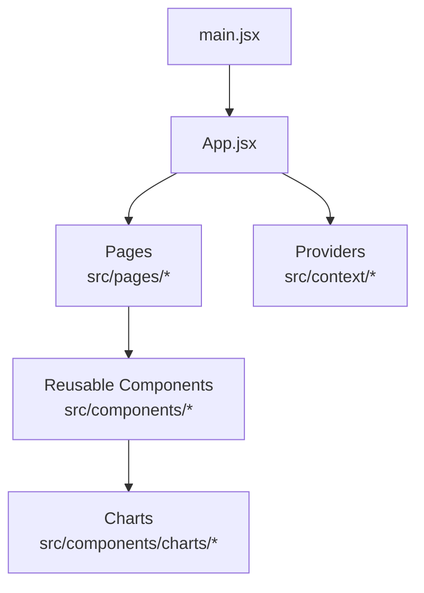
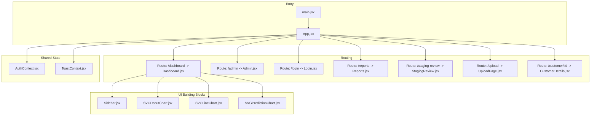
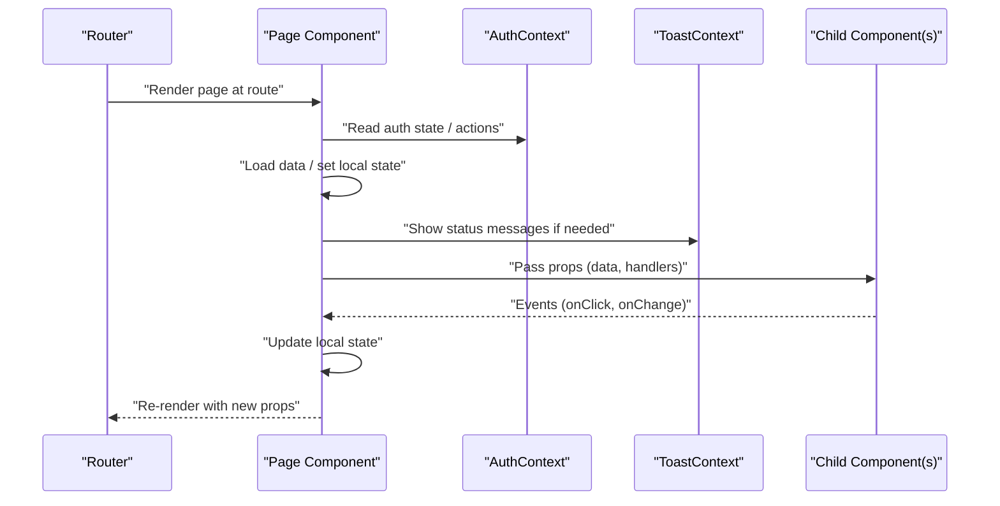
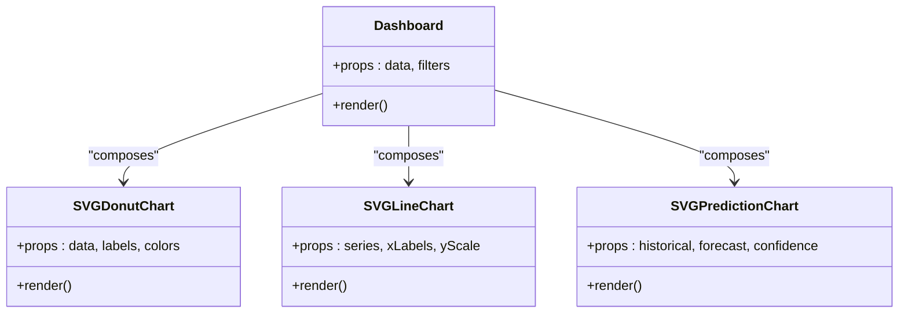
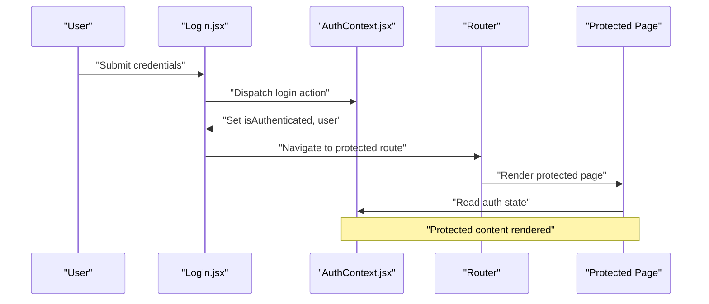
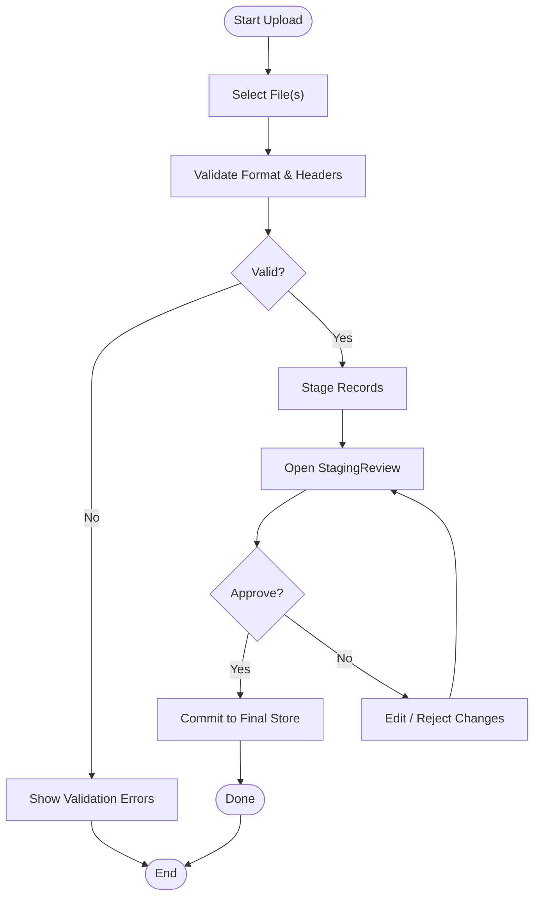
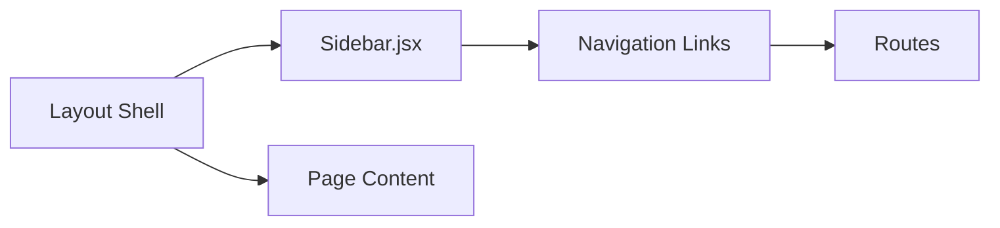
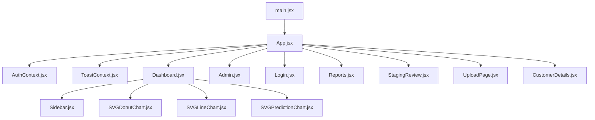

# Component Hierarchy and Organization

<cite>
**Referenced Files in This Document**
- [App.jsx](file://frontend/src/App.jsx)
- [main.jsx](file://frontend/src/main.jsx)
- [Dashboard.jsx](file://frontend/src/pages/Dashboard.jsx)
- [Admin.jsx](file://frontend/src/pages/Admin.jsx)
- [CustomerDetails.jsx](file://frontend/src/pages/CustomerDetails.jsx)
- [Login.jsx](file://frontend/src/pages/Login.jsx)
- [Reports.jsx](file://frontend/src/pages/Reports.jsx)
- [StagingReview.jsx](file://frontend/src/pages/StagingReview.jsx)
- [UploadPage.jsx](file://frontend/src/pages/UploadPage.jsx)
- [Sidebar.jsx](file://frontend/src/components/Sidebar.jsx)
- [SVGDonutChart.jsx](file://frontend/src/components/charts/SVGDonutChart.jsx)
- [SVGLineChart.jsx](file://frontend/src/components/charts/SVGLineChart.jsx)
- [SVGPredictionChart.jsx](file://frontend/src/components/charts/SVGPredictionChart.jsx)
- [AuthContext.jsx](file://frontend/src/context/AuthContext.jsx)
- [ToastContext.jsx](file://frontend/src/context/ToastContext.jsx)
</cite>

## Table of Contents
1. [Introduction](#introduction)
2. [Project Structure](#project-structure)
3. [Core Components](#core-components)
4. [Architecture Overview](#architecture-overview)
5. [Detailed Component Analysis](#detailed-component-analysis)
6. [Dependency Analysis](#dependency-analysis)
7. [Performance Considerations](#performance-considerations)
8. [Troubleshooting Guide](#troubleshooting-guide)
9. [Conclusion](#conclusion)

## Introduction
This document explains the React frontend component hierarchy and organization. It focuses on how pages, components, and utilities are separated, how composition patterns establish parent-child relationships, and how shared state is managed via context. The goal is to provide a clear mental model for navigating the codebase and maintaining clean boundaries between responsibilities.

## Project Structure
The React application follows a feature-oriented layout with clear separation:
- src/pages: Top-level route views that orchestrate data and compose UI from reusable components.
- src/components: Reusable UI building blocks (charts, layout helpers).
- src/context: Global state providers (authentication, toast notifications).
- Entry points: main.jsx bootstraps the app; App.jsx wires routing and providers.

**Diagram sources**
- [main.jsx](file://frontend/src/main.jsx)
- [App.jsx](file://frontend/src/App.jsx)
- [Dashboard.jsx](file://frontend/src/pages/Dashboard.jsx)
- [Sidebar.jsx](file://frontend/src/components/Sidebar.jsx)
- [SVGDonutChart.jsx](file://frontend/src/components/charts/SVGDonutChart.jsx)

**Section sources**
- [main.jsx](file://frontend/src/main.jsx)
- [App.jsx](file://frontend/src/App.jsx)

## Core Components
- Pages
  - Dashboard: Orchestrates dashboard data and composes charts and panels.
  - Admin: Manages administrative tasks and user-related operations.
  - CustomerDetails: Displays detailed information about a selected customer.
  - Login: Handles authentication entry flow.
  - Reports: Renders report views and filters.
  - StagingReview: Reviews staged data before final import.
  - UploadPage: Guides file uploads and shows progress/validation feedback.
- Shared Components
  - Sidebar: Navigation shell used by authenticated layouts.
  - Charts: SVG-based chart primitives (donut, line, prediction) consumed by pages like Dashboard.
- Context Providers
  - AuthContext: Provides authentication state and actions across the app.
  - ToastContext: Provides global notification capabilities.

Key responsibilities:
- Pages own route-scoped state and coordinate child components.
- Components focus on presentation and small interactions.
- Context encapsulates cross-cutting concerns (auth, notifications).

**Section sources**
- [Dashboard.jsx](file://frontend/src/pages/Dashboard.jsx)
- [Admin.jsx](file://frontend/src/pages/Admin.jsx)
- [CustomerDetails.jsx](file://frontend/src/pages/CustomerDetails.jsx)
- [Login.jsx](file://frontend/src/pages/Login.jsx)
- [Reports.jsx](file://frontend/src/pages/Reports.jsx)
- [StagingReview.jsx](file://frontend/src/pages/StagingReview.jsx)
- [UploadPage.jsx](file://frontend/src/pages/UploadPage.jsx)
- [Sidebar.jsx](file://frontend/src/components/Sidebar.jsx)
- [SVGDonutChart.jsx](file://frontend/src/components/charts/SVGDonutChart.jsx)
- [SVGLineChart.jsx](file://frontend/src/components/charts/SVGLineChart.jsx)
- [SVGPredictionChart.jsx](file://frontend/src/components/charts/SVGPredictionChart.jsx)
- [AuthContext.jsx](file://frontend/src/context/AuthContext.jsx)
- [ToastContext.jsx](file://frontend/src/context/ToastContext.jsx)

## Architecture Overview
High-level runtime architecture:
- main.jsx renders the root provider tree.
- App.jsx configures routing and wraps routes with providers (e.g., auth, toast).
- Pages render based on current route and compose reusable components.
- Contexts supply shared state and actions globally.

**Diagram sources**
- [main.jsx](file://frontend/src/main.jsx)
- [App.jsx](file://frontend/src/App.jsx)
- [Dashboard.jsx](file://frontend/src/pages/Dashboard.jsx)
- [Admin.jsx](file://frontend/src/pages/Admin.jsx)
- [Login.jsx](file://frontend/src/pages/Login.jsx)
- [Reports.jsx](file://frontend/src/pages/Reports.jsx)
- [StagingReview.jsx](file://frontend/src/pages/StagingReview.jsx)
- [UploadPage.jsx](file://frontend/src/pages/UploadPage.jsx)
- [CustomerDetails.jsx](file://frontend/src/pages/CustomerDetails.jsx)
- [Sidebar.jsx](file://frontend/src/components/Sidebar.jsx)
- [SVGDonutChart.jsx](file://frontend/src/components/charts/SVGDonutChart.jsx)
- [SVGLineChart.jsx](file://frontend/src/components/charts/SVGLineChart.jsx)
- [SVGPredictionChart.jsx](file://frontend/src/components/charts/SVGPredictionChart.jsx)
- [AuthContext.jsx](file://frontend/src/context/AuthContext.jsx)
- [ToastContext.jsx](file://frontend/src/context/ToastContext.jsx)

## Detailed Component Analysis

### Page Orchestration Pattern
Pages act as containers: they fetch or derive data, manage local UI state, and delegate rendering to presentational components. They consume contexts for auth and notifications.

**Diagram sources**
- [Dashboard.jsx](file://frontend/src/pages/Dashboard.jsx)
- [AuthContext.jsx](file://frontend/src/context/AuthContext.jsx)
- [ToastContext.jsx](file://frontend/src/context/ToastContext.jsx)
- [Sidebar.jsx](file://frontend/src/components/Sidebar.jsx)

**Section sources**
- [Dashboard.jsx](file://frontend/src/pages/Dashboard.jsx)
- [AuthContext.jsx](file://frontend/src/context/AuthContext.jsx)
- [ToastContext.jsx](file://frontend/src/context/ToastContext.jsx)

### Chart Composition Pattern
Charts are reusable presentational components receiving typed data and configuration via props. Pages compose multiple charts to build dashboards.

**Diagram sources**
- [Dashboard.jsx](file://frontend/src/pages/Dashboard.jsx)
- [SVGDonutChart.jsx](file://frontend/src/components/charts/SVGDonutChart.jsx)
- [SVGLineChart.jsx](file://frontend/src/components/charts/SVGLineChart.jsx)
- [SVGPredictionChart.jsx](file://frontend/src/components/charts/SVGPredictionChart.jsx)

**Section sources**
- [Dashboard.jsx](file://frontend/src/pages/Dashboard.jsx)
- [SVGDonutChart.jsx](file://frontend/src/components/charts/SVGDonutChart.jsx)
- [SVGLineChart.jsx](file://frontend/src/components/charts/SVGLineChart.jsx)
- [SVGPredictionChart.jsx](file://frontend/src/components/charts/SVGPredictionChart.jsx)

### Authentication Flow
Authentication state and actions are provided through context. Pages and components read/write this state to control navigation and behavior.

**Diagram sources**
- [Login.jsx](file://frontend/src/pages/Login.jsx)
- [AuthContext.jsx](file://frontend/src/context/AuthContext.jsx)

**Section sources**
- [Login.jsx](file://frontend/src/pages/Login.jsx)
- [AuthContext.jsx](file://frontend/src/context/AuthContext.jsx)

### Upload and Review Workflow
UploadPage manages file selection, validation, and submission. StagingReview allows inspection and approval of staged records before committing.

**Diagram sources**
- [UploadPage.jsx](file://frontend/src/pages/UploadPage.jsx)
- [StagingReview.jsx](file://frontend/src/pages/StagingReview.jsx)

**Section sources**
- [UploadPage.jsx](file://frontend/src/pages/UploadPage.jsx)
- [StagingReview.jsx](file://frontend/src/pages/StagingReview.jsx)

### Layout and Navigation
Sidebar provides navigation links and active state. Pages wrap their content within a layout that includes the sidebar when appropriate.

**Diagram sources**
- [Sidebar.jsx](file://frontend/src/components/Sidebar.jsx)
- [Dashboard.jsx](file://frontend/src/pages/Dashboard.jsx)
- [Admin.jsx](file://frontend/src/pages/Admin.jsx)

**Section sources**
- [Sidebar.jsx](file://frontend/src/components/Sidebar.jsx)
- [Dashboard.jsx](file://frontend/src/pages/Dashboard.jsx)
- [Admin.jsx](file://frontend/src/pages/Admin.jsx)

## Dependency Analysis
- Entry and wiring
  - main.jsx initializes the React tree.
  - App.jsx sets up routing and providers.
- Provider dependencies
  - AuthContext supplies authentication state/actions.
  - ToastContext supplies notification functions.
- Page-to-component composition
  - Pages depend on reusable components (e.g., charts, sidebar).
- Cross-cutting concerns
  - Notifications and auth are accessed via context rather than prop drilling.

**Diagram sources**
- [main.jsx](file://frontend/src/main.jsx)
- [App.jsx](file://frontend/src/App.jsx)
- [Dashboard.jsx](file://frontend/src/pages/Dashboard.jsx)
- [Admin.jsx](file://frontend/src/pages/Admin.jsx)
- [Login.jsx](file://frontend/src/pages/Login.jsx)
- [Reports.jsx](file://frontend/src/pages/Reports.jsx)
- [StagingReview.jsx](file://frontend/src/pages/StagingReview.jsx)
- [UploadPage.jsx](file://frontend/src/pages/UploadPage.jsx)
- [CustomerDetails.jsx](file://frontend/src/pages/CustomerDetails.jsx)
- [Sidebar.jsx](file://frontend/src/components/Sidebar.jsx)
- [SVGDonutChart.jsx](file://frontend/src/components/charts/SVGDonutChart.jsx)
- [SVGLineChart.jsx](file://frontend/src/components/charts/SVGLineChart.jsx)
- [SVGPredictionChart.jsx](file://frontend/src/components/charts/SVGPredictionChart.jsx)
- [AuthContext.jsx](file://frontend/src/context/AuthContext.jsx)
- [ToastContext.jsx](file://frontend/src/context/ToastContext.jsx)

**Section sources**
- [main.jsx](file://frontend/src/main.jsx)
- [App.jsx](file://frontend/src/App.jsx)
- [Dashboard.jsx](file://frontend/src/pages/Dashboard.jsx)
- [AuthContext.jsx](file://frontend/src/context/AuthContext.jsx)
- [ToastContext.jsx](file://frontend/src/context/ToastContext.jsx)

## Performance Considerations
- Memoization: Wrap expensive chart components with memoization to avoid unnecessary re-renders when props have not changed.
- Data locality: Keep heavy data transformations inside pages; pass derived, lightweight props to presentational components.
- Lazy loading: Consider lazy-loading heavy pages (e.g., reports, staging review) to reduce initial bundle size.
- Event coalescing: Debounce input-heavy events (search/filter) in pages to limit re-renders.
- Context usage: Consume only necessary fields from context to prevent broad re-renders.

[No sources needed since this section provides general guidance]

## Troubleshooting Guide
Common issues and resolutions:
- Missing context values: Ensure providers are mounted above the consuming component tree. Verify that hooks are called within the correct provider scope.
- Unhandled errors in uploads: Surface validation errors via toast notifications and keep error state close to the upload page.
- Stale auth state: Refresh or revalidate auth state on protected routes; guard navigation using auth context.
- Chart rendering anomalies: Normalize data shapes before passing to chart components; ensure required props are present.

**Section sources**
- [AuthContext.jsx](file://frontend/src/context/AuthContext.jsx)
- [ToastContext.jsx](file://frontend/src/context/ToastContext.jsx)
- [UploadPage.jsx](file://frontend/src/pages/UploadPage.jsx)
- [StagingReview.jsx](file://frontend/src/pages/StagingReview.jsx)
- [Dashboard.jsx](file://frontend/src/pages/Dashboard.jsx)

## Conclusion
The application separates concerns cleanly: pages orchestrate data and composition, components encapsulate presentation, and contexts centralize cross-cutting state. This structure supports scalability, testability, and maintainability. Follow the composition patterns outlined here to keep boundaries clear and reuse effectively.