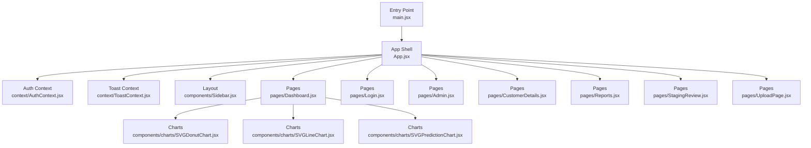
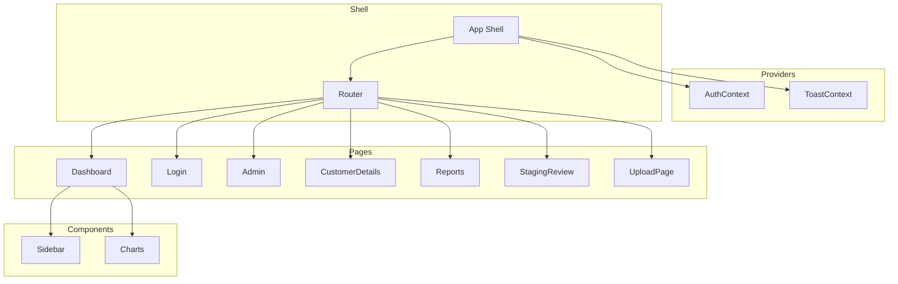
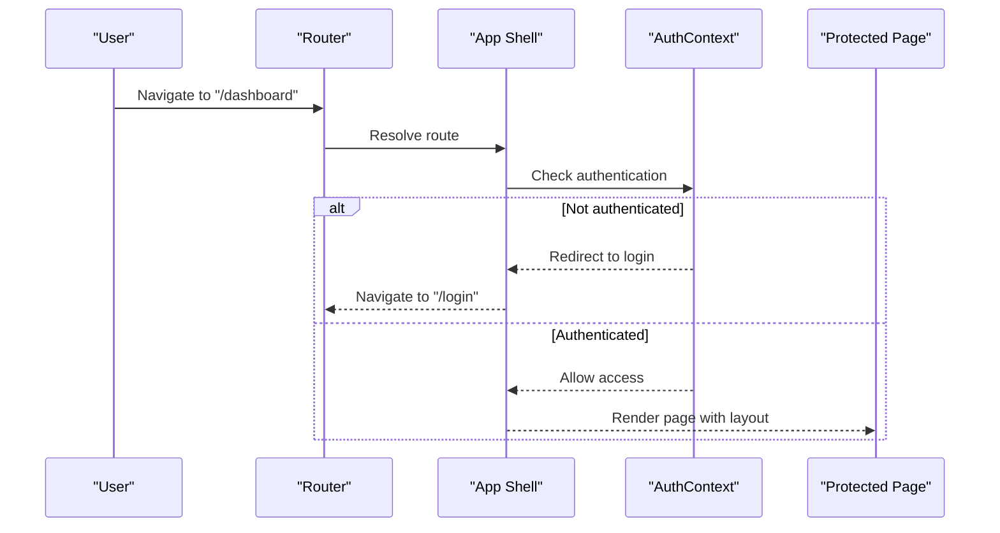
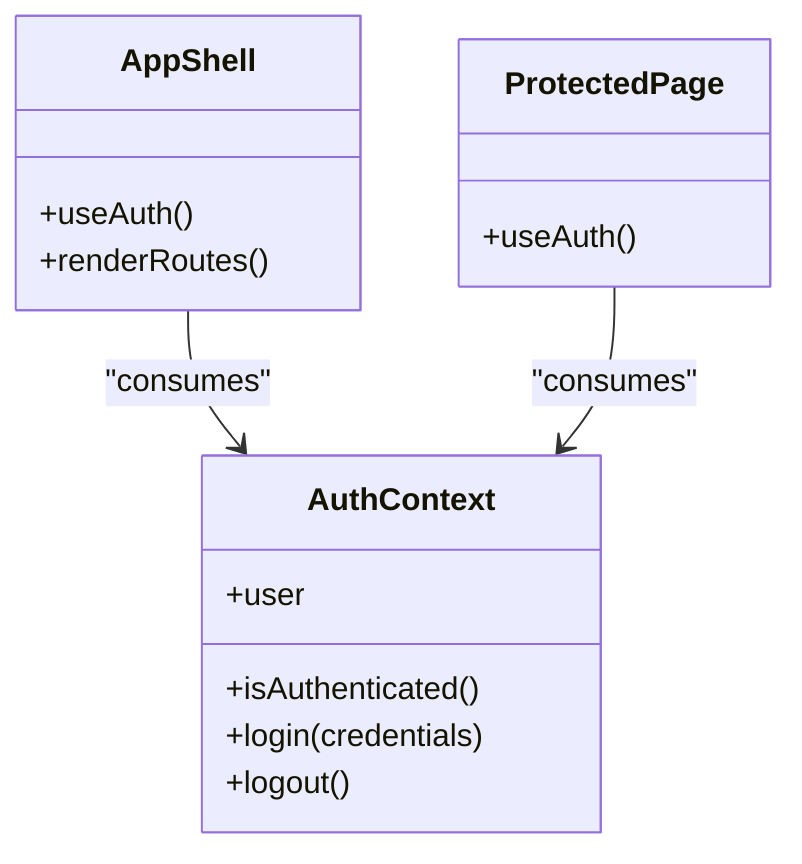
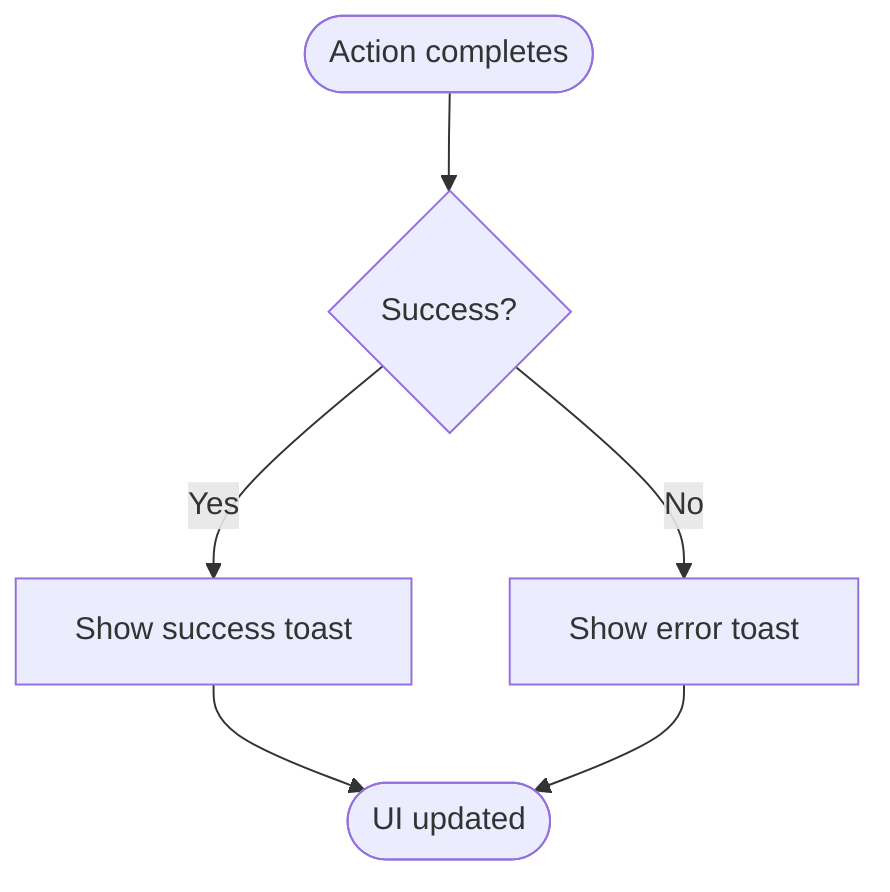
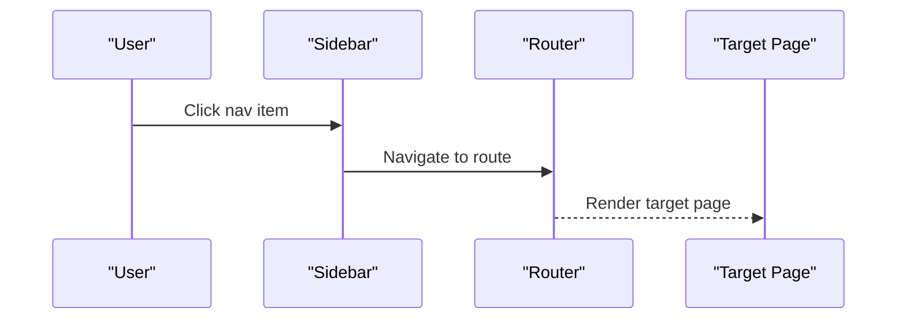
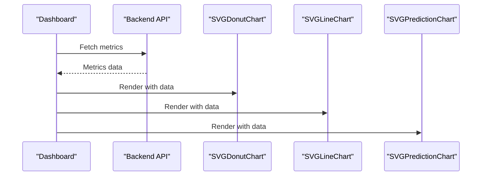
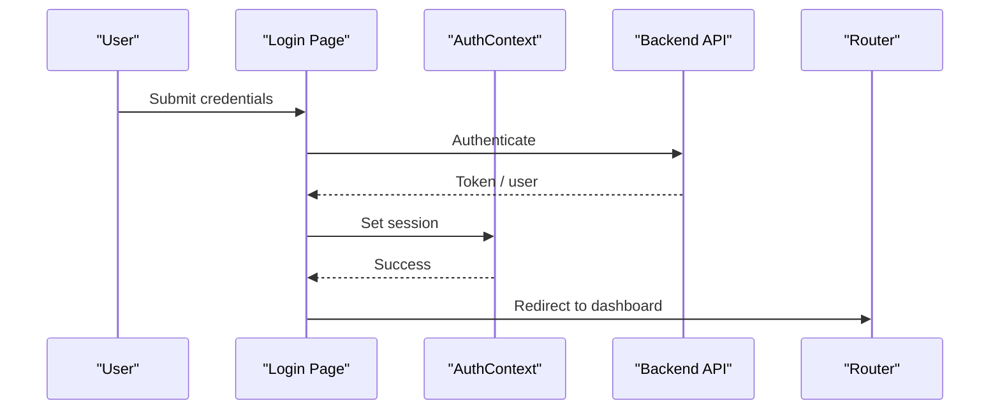
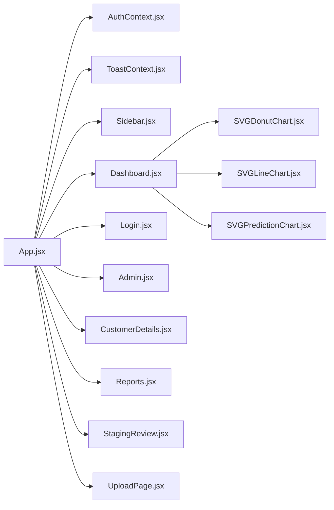

# Frontend Architecture

<cite>
**Referenced Files in This Document**
- [main.jsx](file://frontend/src/main.jsx)
- [App.jsx](file://frontend/src/App.jsx)
- [index.css](file://frontend/src/index.css)
- [App.css](file://frontend/src/App.css)
- [AuthContext.jsx](file://frontend/src/context/AuthContext.jsx)
- [ToastContext.jsx](file://frontend/src/context/ToastContext.jsx)
- [Dashboard.jsx](file://frontend/src/pages/Dashboard.jsx)
- [Login.jsx](file://frontend/src/pages/Login.jsx)
- [Admin.jsx](file://frontend/src/pages/Admin.jsx)
- [CustomerDetails.jsx](file://frontend/src/pages/CustomerDetails.jsx)
- [Reports.jsx](file://frontend/src/pages/Reports.jsx)
- [StagingReview.jsx](file://frontend/src/pages/StagingReview.jsx)
- [UploadPage.jsx](file://frontend/src/pages/UploadPage.jsx)
- [Sidebar.jsx](file://frontend/src/components/Sidebar.jsx)
- [SVGDonutChart.jsx](file://frontend/src/components/charts/SVGDonutChart.jsx)
- [SVGLineChart.jsx](file://frontend/src/components/charts/SVGLineChart.jsx)
- [SVGPredictionChart.jsx](file://frontend/src/components/charts/SVGPredictionChart.jsx)
- [vite.config.js](file://frontend/vite.config.js)
- [package.json](file://frontend/package.json)
</cite>

## Table of Contents
1. [Introduction](#introduction)
2. [Project Structure](#project-structure)
3. [Core Components](#core-components)
4. [Architecture Overview](#architecture-overview)
5. [Detailed Component Analysis](#detailed-component-analysis)
6. [Dependency Analysis](#dependency-analysis)
7. [Performance Considerations](#performance-considerations)
8. [Troubleshooting Guide](#troubleshooting-guide)
9. [Conclusion](#conclusion)

## Introduction
This document describes the React.js frontend architecture with a focus on component-based design, separation of concerns across pages, components, and context providers, state management using Context API, routing structure, composition strategies, data flow, styling, asset management, build configuration, responsive design, accessibility, and performance optimization including code splitting and lazy loading.

## Project Structure
The frontend is organized by feature areas:
- Entry point and app shell
- Pages for top-level routes
- Shared components (layout, charts)
- Global contexts for authentication and toast notifications
- Styling via CSS modules or global stylesheets
- Build configuration via Vite

**Diagram sources**
- [main.jsx:1-200](file://frontend/src/main.jsx#L1-L200)
- [App.jsx:1-200](file://frontend/src/App.jsx#L1-L200)
- [AuthContext.jsx:1-200](file://frontend/src/context/AuthContext.jsx#L1-L200)
- [ToastContext.jsx:1-200](file://frontend/src/context/ToastContext.jsx#L1-L200)
- [Sidebar.jsx:1-200](file://frontend/src/components/Sidebar.jsx#L1-L200)
- [Dashboard.jsx:1-200](file://frontend/src/pages/Dashboard.jsx#L1-L200)
- [Login.jsx:1-200](file://frontend/src/pages/Login.jsx#L1-L200)
- [Admin.jsx:1-200](file://frontend/src/pages/Admin.jsx#L1-L200)
- [CustomerDetails.jsx:1-200](file://frontend/src/pages/CustomerDetails.jsx#L1-L200)
- [Reports.jsx:1-200](file://frontend/src/pages/Reports.jsx#L1-L200)
- [StagingReview.jsx:1-200](file://frontend/src/pages/StagingReview.jsx#L1-L200)
- [UploadPage.jsx:1-200](file://frontend/src/pages/UploadPage.jsx#L1-L200)
- [SVGDonutChart.jsx:1-200](file://frontend/src/components/charts/SVGDonutChart.jsx#L1-L200)
- [SVGLineChart.jsx:1-200](file://frontend/src/components/charts/SVGLineChart.jsx#L1-L200)
- [SVGPredictionChart.jsx:1-200](file://frontend/src/components/charts/SVGPredictionChart.jsx#L1-L200)

**Section sources**
- [main.jsx:1-200](file://frontend/src/main.jsx#L1-L200)
- [App.jsx:1-200](file://frontend/src/App.jsx#L1-L200)
- [package.json:1-200](file://frontend/package.json#L1-L200)
- [vite.config.js:1-200](file://frontend/vite.config.js#L1-L200)

## Core Components
- App Shell: Initializes global providers (auth, toast), sets up routing, and renders layout and page content.
- Layout: Sidebar provides navigation and consistent UI chrome across authenticated views.
- Charts: Reusable chart components encapsulate SVG rendering logic and accept data props.
- Contexts: AuthContext manages user session and permissions; ToastContext provides global notification dispatching.

Key responsibilities:
- Separation of concerns: Pages own route-specific state and orchestration; components own presentation; contexts own cross-cutting state.
- Composition: Pages compose layout and reusable components to assemble complex screens.

**Section sources**
- [App.jsx:1-200](file://frontend/src/App.jsx#L1-L200)
- [Sidebar.jsx:1-200](file://frontend/src/components/Sidebar.jsx#L1-L200)
- [SVGDonutChart.jsx:1-200](file://frontend/src/components/charts/SVGDonutChart.jsx#L1-L200)
- [SVGLineChart.jsx:1-200](file://frontend/src/components/charts/SVGLineChart.jsx#L1-L200)
- [SVGPredictionChart.jsx:1-200](file://frontend/src/components/charts/SVGPredictionChart.jsx#L1-L200)
- [AuthContext.jsx:1-200](file://frontend/src/context/AuthContext.jsx#L1-L200)
- [ToastContext.jsx:1-200](file://frontend/src/context/ToastContext.jsx#L1-L200)

## Architecture Overview
High-level runtime architecture:
- The entry point mounts the root component.
- The app shell wraps the application with providers and defines routes.
- Pages consume contexts and render layouts and features.
- Data flows from user interactions through handlers into contexts or local state, then triggers API calls and updates UI.

**Diagram sources**
- [main.jsx:1-200](file://frontend/src/main.jsx#L1-L200)
- [App.jsx:1-200](file://frontend/src/App.jsx#L1-L200)
- [AuthContext.jsx:1-200](file://frontend/src/context/AuthContext.jsx#L1-L200)
- [ToastContext.jsx:1-200](file://frontend/src/context/ToastContext.jsx#L1-L200)
- [Sidebar.jsx:1-200](file://frontend/src/components/Sidebar.jsx#L1-L200)
- [Dashboard.jsx:1-200](file://frontend/src/pages/Dashboard.jsx#L1-L200)
- [Login.jsx:1-200](file://frontend/src/pages/Login.jsx#L1-L200)
- [Admin.jsx:1-200](file://frontend/src/pages/Admin.jsx#L1-L200)
- [CustomerDetails.jsx:1-200](file://frontend/src/pages/CustomerDetails.jsx#L1-L200)
- [Reports.jsx:1-200](file://frontend/src/pages/Reports.jsx#L1-L200)
- [StagingReview.jsx:1-200](file://frontend/src/pages/StagingReview.jsx#L1-L200)
- [UploadPage.jsx:1-200](file://frontend/src/pages/UploadPage.jsx#L1-L200)

## Detailed Component Analysis

### App Shell and Routing
- Responsibilities:
  - Initialize global providers (authentication, toast).
  - Configure routes for public and protected pages.
  - Render shared layout (e.g., sidebar) around protected routes.
- Routing strategy:
  - Public routes include login.
  - Protected routes require authentication and render layout with navigation.
- Composition:
  - Uses layout components to wrap page content consistently.

**Diagram sources**
- [App.jsx:1-200](file://frontend/src/App.jsx#L1-L200)
- [AuthContext.jsx:1-200](file://frontend/src/context/AuthContext.jsx#L1-L200)
- [Dashboard.jsx:1-200](file://frontend/src/pages/Dashboard.jsx#L1-L200)
- [Login.jsx:1-200](file://frontend/src/pages/Login.jsx#L1-L200)

**Section sources**
- [App.jsx:1-200](file://frontend/src/App.jsx#L1-L200)

### Authentication Context
- Responsibilities:
  - Maintain user session state and metadata.
  - Provide login/logout actions.
  - Guard routes based on authentication status.
- Integration:
  - Consumed by the app shell to protect routes and by pages to display user info.

**Diagram sources**
- [AuthContext.jsx:1-200](file://frontend/src/context/AuthContext.jsx#L1-L200)
- [App.jsx:1-200](file://frontend/src/App.jsx#L1-L200)
- [Dashboard.jsx:1-200](file://frontend/src/pages/Dashboard.jsx#L1-L200)

**Section sources**
- [AuthContext.jsx:1-200](file://frontend/src/context/AuthContext.jsx#L1-L200)

### Toast Notifications Context
- Responsibilities:
  - Centralized message queue for success/error/info notifications.
  - Exposes show/hide helpers consumed by pages and services.
- Usage pattern:
  - Pages call toast actions after API responses to inform users.

**Diagram sources**
- [ToastContext.jsx:1-200](file://frontend/src/context/ToastContext.jsx#L1-L200)

**Section sources**
- [ToastContext.jsx:1-200](file://frontend/src/context/ToastContext.jsx#L1-L200)

### Layout and Navigation (Sidebar)
- Responsibilities:
  - Provide persistent navigation links.
  - Reflect current route and active state.
  - Compose with protected pages to form the main shell.

**Diagram sources**
- [Sidebar.jsx:1-200](file://frontend/src/components/Sidebar.jsx#L1-L200)
- [App.jsx:1-200](file://frontend/src/App.jsx#L1-L200)

**Section sources**
- [Sidebar.jsx:1-200](file://frontend/src/components/Sidebar.jsx#L1-L200)

### Dashboard and Charts
- Responsibilities:
  - Aggregate metrics and present them via chart components.
  - Fetch data and pass it down to chart components as props.
- Chart components:
  - Encapsulate SVG rendering and accept structured data.
  - Remain stateless where possible to improve testability and reusability.

**Diagram sources**
- [Dashboard.jsx:1-200](file://frontend/src/pages/Dashboard.jsx#L1-L200)
- [SVGDonutChart.jsx:1-200](file://frontend/src/components/charts/SVGDonutChart.jsx#L1-L200)
- [SVGLineChart.jsx:1-200](file://frontend/src/components/charts/SVGLineChart.jsx#L1-L200)
- [SVGPredictionChart.jsx:1-200](file://frontend/src/components/charts/SVGPredictionChart.jsx#L1-L200)

**Section sources**
- [Dashboard.jsx:1-200](file://frontend/src/pages/Dashboard.jsx#L1-L200)
- [SVGDonutChart.jsx:1-200](file://frontend/src/components/charts/SVGDonutChart.jsx#L1-L200)
- [SVGLineChart.jsx:1-200](file://frontend/src/components/charts/SVGLineChart.jsx#L1-L200)
- [SVGPredictionChart.jsx:1-200](file://frontend/src/components/charts/SVGPredictionChart.jsx#L1-L200)

### Login Flow
- Responsibilities:
  - Collect credentials and submit to backend.
  - On success, update auth context and redirect to protected area.
  - On failure, show toast errors.

**Diagram sources**
- [Login.jsx:1-200](file://frontend/src/pages/Login.jsx#L1-L200)
- [AuthContext.jsx:1-200](file://frontend/src/context/AuthContext.jsx#L1-L200)

**Section sources**
- [Login.jsx:1-200](file://frontend/src/pages/Login.jsx#L1-L200)
- [AuthContext.jsx:1-200](file://frontend/src/context/AuthContext.jsx#L1-L200)

### Admin, Customer Details, Reports, Staging Review, Upload
- Responsibilities:
  - Feature-specific pages that orchestrate data fetching, validation, and user feedback.
  - Use shared components and contexts for consistent UX.
- Common patterns:
  - Local state for form inputs and loading flags.
  - Toast notifications for user feedback.
  - Conditional rendering based on auth and data availability.

**Section sources**
- [Admin.jsx:1-200](file://frontend/src/pages/Admin.jsx#L1-L200)
- [CustomerDetails.jsx:1-200](file://frontend/src/pages/CustomerDetails.jsx#L1-L200)
- [Reports.jsx:1-200](file://frontend/src/pages/Reports.jsx#L1-L200)
- [StagingReview.jsx:1-200](file://frontend/src/pages/StagingReview.jsx#L1-L200)
- [UploadPage.jsx:1-200](file://frontend/src/pages/UploadPage.jsx#L1-L200)

## Dependency Analysis
- Provider dependencies:
  - App Shell depends on Auth and Toast contexts.
- Page dependencies:
  - Pages depend on contexts and shared components.
- Component dependencies:
  - Charts are leaf nodes with minimal dependencies.

**Diagram sources**
- [App.jsx:1-200](file://frontend/src/App.jsx#L1-L200)
- [AuthContext.jsx:1-200](file://frontend/src/context/AuthContext.jsx#L1-L200)
- [ToastContext.jsx:1-200](file://frontend/src/context/ToastContext.jsx#L1-L200)
- [Sidebar.jsx:1-200](file://frontend/src/components/Sidebar.jsx#L1-L200)
- [Dashboard.jsx:1-200](file://frontend/src/pages/Dashboard.jsx#L1-L200)
- [Login.jsx:1-200](file://frontend/src/pages/Login.jsx#L1-L200)
- [Admin.jsx:1-200](file://frontend/src/pages/Admin.jsx#L1-L200)
- [CustomerDetails.jsx:1-200](file://frontend/src/pages/CustomerDetails.jsx#L1-L200)
- [Reports.jsx:1-200](file://frontend/src/pages/Reports.jsx#L1-L200)
- [StagingReview.jsx:1-200](file://frontend/src/pages/StagingReview.jsx#L1-L200)
- [UploadPage.jsx:1-200](file://frontend/src/pages/UploadPage.jsx#L1-L200)
- [SVGDonutChart.jsx:1-200](file://frontend/src/components/charts/SVGDonutChart.jsx#L1-L200)
- [SVGLineChart.jsx:1-200](file://frontend/src/components/charts/SVGLineChart.jsx#L1-L200)
- [SVGPredictionChart.jsx:1-200](file://frontend/src/components/charts/SVGPredictionChart.jsx#L1-L200)

**Section sources**
- [App.jsx:1-200](file://frontend/src/App.jsx#L1-L200)

## Performance Considerations
- Code splitting and lazy loading:
  - Use dynamic imports for heavy pages (e.g., charts-heavy dashboards) to reduce initial bundle size.
  - Lazy-load route components and preload on hover when appropriate.
- Memoization:
  - Memoize expensive computations and memoize components receiving stable props to avoid unnecessary re-renders.
- Data fetching:
  - Implement caching and deduplication for repeated requests.
  - Use pagination and virtualization for large lists.
- Asset optimization:
  - Optimize images and icons; prefer SVG where feasible.
  - Leverage browser caching via immutable filenames.
- Build configuration:
  - Tune Vite settings for production builds (minification, tree-shaking, chunking).
  - Enable source maps only for development.

[No sources needed since this section provides general guidance]

## Troubleshooting Guide
- Authentication issues:
  - Verify token storage and expiration handling in auth context.
  - Ensure protected routes redirect correctly when unauthenticated.
- Toast not showing:
  - Confirm toast provider is mounted and actions are dispatched from the correct scope.
- Routing problems:
  - Validate route definitions and guards; ensure nested routes resolve to expected components.
- Chart rendering issues:
  - Inspect data shape passed to chart components; validate required fields and types.
- Build errors:
  - Check Vite config for incorrect paths or missing plugins; review package scripts.

**Section sources**
- [AuthContext.jsx:1-200](file://frontend/src/context/AuthContext.jsx#L1-L200)
- [ToastContext.jsx:1-200](file://frontend/src/context/ToastContext.jsx#L1-L200)
- [App.jsx:1-200](file://frontend/src/App.jsx#L1-L200)
- [vite.config.js:1-200](file://frontend/vite.config.js#L1-L200)

## Conclusion
The frontend follows a clear component-based architecture with strong separation between pages, shared components, and global contexts. State is managed via Context API for cross-cutting concerns, while pages coordinate data flow and user interactions. The build system uses Vite for efficient development and production builds. Adopting code splitting, memoization, and optimized assets will further improve performance and maintainability.