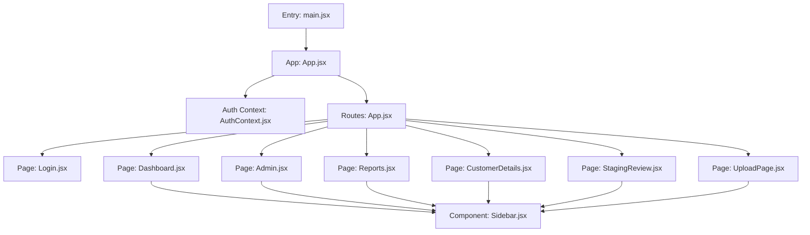
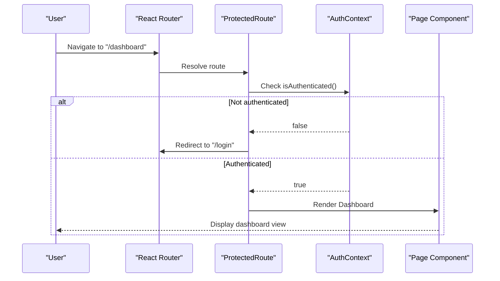
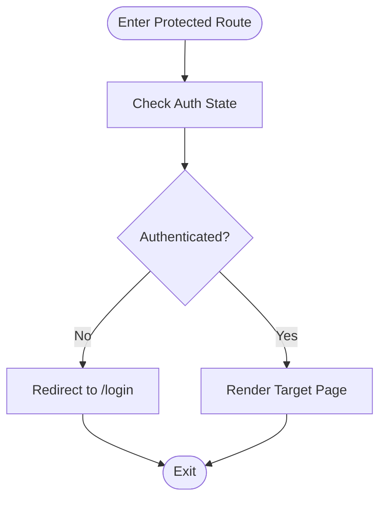
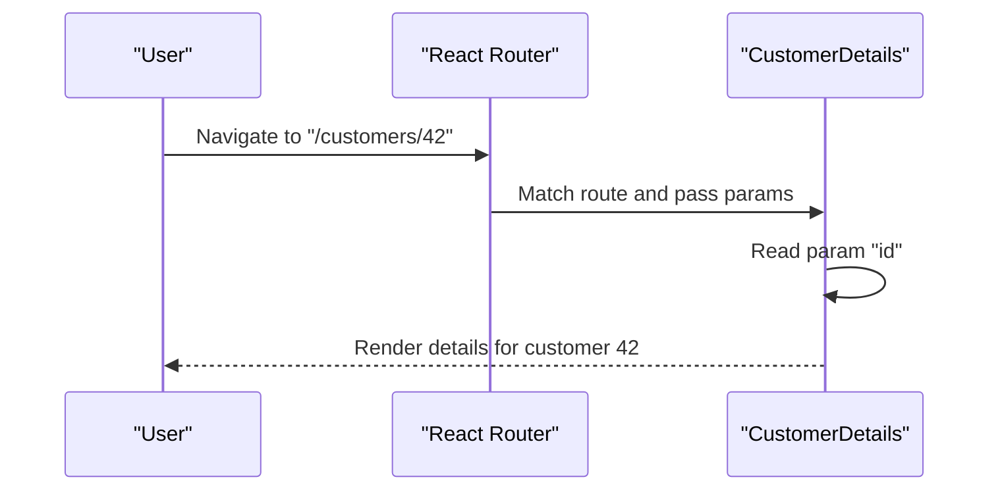
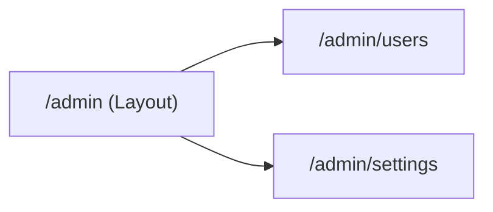
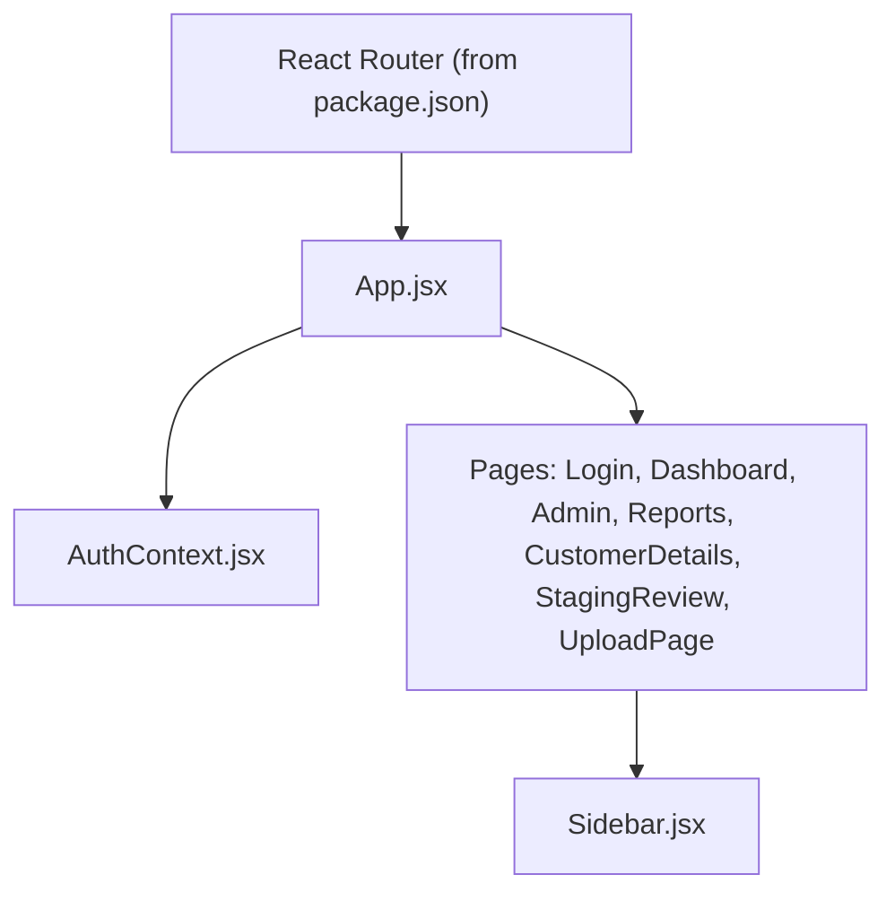

# Routing and Navigation Structure

<cite>
**Referenced Files in This Document**
- [App.jsx](file://frontend/src/App.jsx)
- [main.jsx](file://frontend/src/main.jsx)
- [AuthContext.jsx](file://frontend/src/context/AuthContext.jsx)
- [Login.jsx](file://frontend/src/pages/Login.jsx)
- [Dashboard.jsx](file://frontend/src/pages/Dashboard.jsx)
- [Admin.jsx](file://frontend/src/pages/Admin.jsx)
- [Reports.jsx](file://frontend/src/pages/Reports.jsx)
- [CustomerDetails.jsx](file://frontend/src/pages/CustomerDetails.jsx)
- [StagingReview.jsx](file://frontend/src/pages/StagingReview.jsx)
- [UploadPage.jsx](file://frontend/src/pages/UploadPage.jsx)
- [Sidebar.jsx](file://frontend/src/components/Sidebar.jsx)
- [package.json](file://frontend/package.json)
</cite>

## Table of Contents
1. [Introduction](#introduction)
2. [Project Structure](#project-structure)
3. [Core Components](#core-components)
4. [Architecture Overview](#architecture-overview)
5. [Detailed Component Analysis](#detailed-component-analysis)
6. [Dependency Analysis](#dependency-analysis)
7. [Performance Considerations](#performance-considerations)
8. [Troubleshooting Guide](#troubleshooting-guide)
9. [Conclusion](#conclusion)

## Introduction
This document explains the React Router implementation and navigation structure for the frontend application. It covers route definitions, protected routes with authentication guards, dynamic routing patterns, navigation flows between key sections (login, dashboard, admin panels, reporting), programmatic navigation, route parameters handling, nested routing, route-based code splitting, lazy loading strategies, and navigation state preservation across route changes.

## Project Structure
The frontend is a Vite + React application. The entry point initializes the app and renders the root component. Route configuration and navigation logic are defined within the main application component and related context files. Pages represent top-level views such as Login, Dashboard, Admin, Reports, Customer Details, Staging Review, and Upload. A shared Sidebar provides navigation links across authenticated sections.

**Diagram sources**
- [main.jsx](file://frontend/src/main.jsx)
- [App.jsx](file://frontend/src/App.jsx)
- [AuthContext.jsx](file://frontend/src/context/AuthContext.jsx)
- [Login.jsx](file://frontend/src/pages/Login.jsx)
- [Dashboard.jsx](file://frontend/src/pages/Dashboard.jsx)
- [Admin.jsx](file://frontend/src/pages/Admin.jsx)
- [Reports.jsx](file://frontend/src/pages/Reports.jsx)
- [CustomerDetails.jsx](file://frontend/src/pages/CustomerDetails.jsx)
- [StagingReview.jsx](file://frontend/src/pages/StagingReview.jsx)
- [UploadPage.jsx](file://frontend/src/pages/UploadPage.jsx)
- [Sidebar.jsx](file://frontend/src/components/Sidebar.jsx)

**Section sources**
- [main.jsx](file://frontend/src/main.jsx)
- [App.jsx](file://frontend/src/App.jsx)
- [package.json](file://frontend/package.json)

## Core Components
- Application entrypoint: Initializes the React app and mounts the root component.
- Root application component: Defines routes, applies authentication guards, and composes page components.
- Authentication context: Provides user session state and login/logout actions used by guards and UI.
- Page components: Represent distinct features (Login, Dashboard, Admin, Reports, etc.).
- Shared navigation: Sidebar component offers consistent navigation across authenticated pages.

Key responsibilities:
- Centralized route configuration and layout composition.
- Guarding protected routes based on authentication state.
- Providing reusable navigation via the sidebar.
- Managing global auth state to influence routing behavior.

**Section sources**
- [main.jsx](file://frontend/src/main.jsx)
- [App.jsx](file://frontend/src/App.jsx)
- [AuthContext.jsx](file://frontend/src/context/AuthContext.jsx)
- [Sidebar.jsx](file://frontend/src/components/Sidebar.jsx)

## Architecture Overview
The routing architecture centers around a single router instance that maps URL paths to page components. Protected routes check authentication status before rendering content. The sidebar uses the same router APIs to navigate between sections without full page reloads.

**Diagram sources**
- [App.jsx](file://frontend/src/App.jsx)
- [AuthContext.jsx](file://frontend/src/context/AuthContext.jsx)
- [Dashboard.jsx](file://frontend/src/pages/Dashboard.jsx)
- [Login.jsx](file://frontend/src/pages/Login.jsx)

## Detailed Component Analysis

### Route Definitions and Layout
- Top-level routes include public and protected sections.
- Public routes: Login.
- Protected routes: Dashboard, Admin, Reports, Customer Details, Staging Review, Upload.
- Layout composition: Protected routes typically render a layout that includes the Sidebar and a content area where specific page components are mounted.

Navigation flow highlights:
- From Login, successful authentication redirects to Dashboard.
- From Dashboard, Sidebar links navigate to Admin, Reports, Customer Details, Staging Review, and Upload.
- Protected routes enforce authentication checks before rendering.

**Section sources**
- [App.jsx](file://frontend/src/App.jsx)
- [Sidebar.jsx](file://frontend/src/components/Sidebar.jsx)

### Authentication Guards and Protected Routes
- Guards evaluate authentication state from the global context.
- If not authenticated, guards redirect to the login page.
- If authenticated, guards render the requested protected route.

**Diagram sources**
- [App.jsx](file://frontend/src/App.jsx)
- [AuthContext.jsx](file://frontend/src/context/AuthContext.jsx)

**Section sources**
- [AuthContext.jsx](file://frontend/src/context/AuthContext.jsx)
- [App.jsx](file://frontend/src/App.jsx)

### Dynamic Routing Patterns
- Customer details use a dynamic segment to load data for a specific customer.
- Example pattern: /customers/:id resolves to the CustomerDetails page, which reads the id parameter and fetches relevant data.

**Diagram sources**
- [CustomerDetails.jsx](file://frontend/src/pages/CustomerDetails.jsx)

**Section sources**
- [CustomerDetails.jsx](file://frontend/src/pages/CustomerDetails.jsx)

### Programmatic Navigation
- After login, the application navigates to the dashboard using programmatic navigation APIs provided by the router.
- Within pages, users can trigger navigation to other sections (e.g., from reports to admin) without manual clicks.

Typical usage points:
- Login success handler redirects to the dashboard.
- Sidebar items may programmatically navigate when needed.

**Section sources**
- [Login.jsx](file://frontend/src/pages/Login.jsx)
- [Sidebar.jsx](file://frontend/src/components/Sidebar.jsx)

### Nested Routing
- Certain sections (for example, Admin or Reports) may contain sub-routes to organize functionality under a common layout.
- Nested routes allow sharing a parent layout while swapping child views.

Example structure concept:
- Parent route: /admin
- Child routes: /admin/users, /admin/settings

[No sources needed since this diagram shows conceptual nested routing]

**Section sources**
- [Admin.jsx](file://frontend/src/pages/Admin.jsx)

### Route-Based Code Splitting and Lazy Loading
- To improve initial load performance, heavy page components can be loaded lazily using dynamic imports.
- Each protected page can be wrapped in a lazy loader so it is fetched only when the route is visited.

Implementation strategy:
- Define routes with lazy-loaded components for Dashboard, Admin, Reports, CustomerDetails, StagingReview, and UploadPage.
- Provide a fallback UI while components load.

**Section sources**
- [App.jsx](file://frontend/src/App.jsx)

### Navigation State Preservation
- When navigating between routes, preserve scroll position and form inputs by leveraging the router’s history stack and browser behavior.
- For complex forms, consider persisting draft state in local storage or context to survive route transitions.

Practical tips:
- Avoid unnecessary re-renders by memoizing expensive computations in page components.
- Use search parameters for shareable deep links without storing large state in memory.

**Section sources**
- [App.jsx](file://frontend/src/App.jsx)

## Dependency Analysis
The routing layer depends on the React Router library and the authentication context. Pages depend on the router APIs for navigation and parameter access. The sidebar depends on the router for declarative navigation.

**Diagram sources**
- [package.json](file://frontend/package.json)
- [App.jsx](file://frontend/src/App.jsx)
- [AuthContext.jsx](file://frontend/src/context/AuthContext.jsx)
- [Sidebar.jsx](file://frontend/src/components/Sidebar.jsx)
- [Login.jsx](file://frontend/src/pages/Login.jsx)
- [Dashboard.jsx](file://frontend/src/pages/Dashboard.jsx)
- [Admin.jsx](file://frontend/src/pages/Admin.jsx)
- [Reports.jsx](file://frontend/src/pages/Reports.jsx)
- [CustomerDetails.jsx](file://frontend/src/pages/CustomerDetails.jsx)
- [StagingReview.jsx](file://frontend/src/pages/StagingReview.jsx)
- [UploadPage.jsx](file://frontend/src/pages/UploadPage.jsx)

**Section sources**
- [package.json](file://frontend/package.json)
- [App.jsx](file://frontend/src/App.jsx)

## Performance Considerations
- Prefer lazy loading for large page components to reduce bundle size and initial load time.
- Keep guard logic lightweight; avoid heavy computations inside route resolution.
- Memoize expensive computations in page components and avoid unnecessary re-renders.
- Use search parameters for simple query-like state to enable deep linking and caching.
- Consider prefetching critical resources for frequently visited routes.

[No sources needed since this section provides general guidance]

## Troubleshooting Guide
Common issues and resolutions:
- Redirect loops: Ensure guards do not redirect unauthenticated users back to the same protected route; always redirect to login.
- Missing route parameters: Validate required params in dynamic routes and handle missing values gracefully.
- Unauthorized access: Verify that all protected routes are guarded and that authentication state updates correctly after login.
- Navigation not working: Confirm that navigation calls target valid routes and that the router is properly configured at the app root.

**Section sources**
- [App.jsx](file://frontend/src/App.jsx)
- [AuthContext.jsx](file://frontend/src/context/AuthContext.jsx)

## Conclusion
The application uses a centralized routing setup with clear separation between public and protected routes. Authentication guards ensure secure access to sensitive sections. Dynamic segments support data-driven views like customer details. Programmatic navigation enables smooth user flows, while lazy loading and code splitting optimize performance. Following the recommended practices will help maintain a scalable and responsive navigation experience.