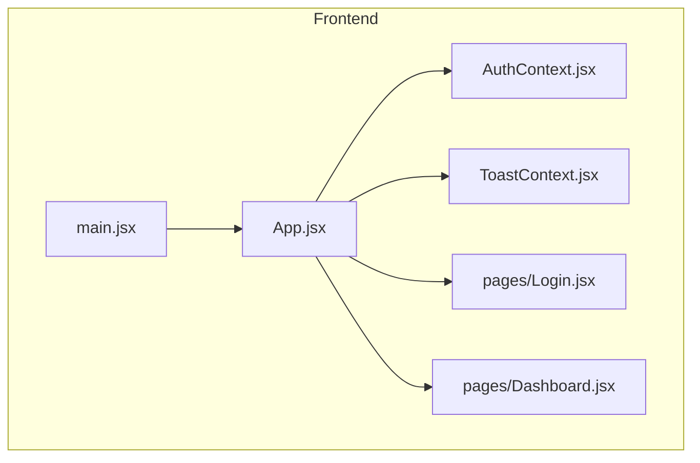
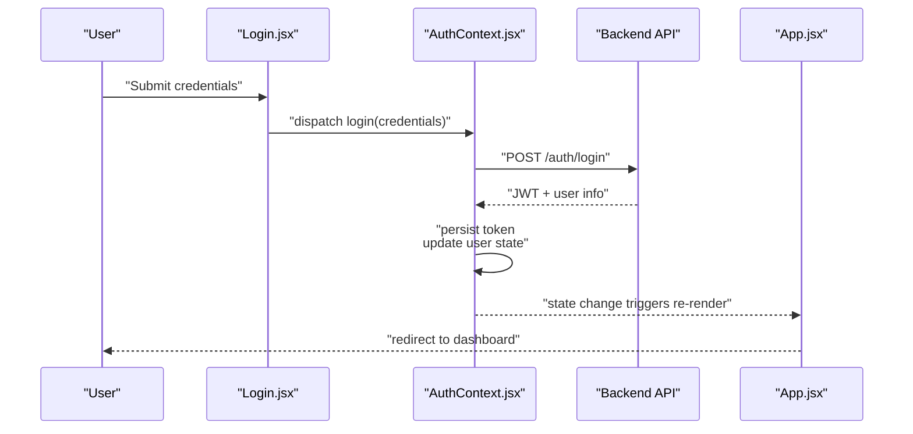
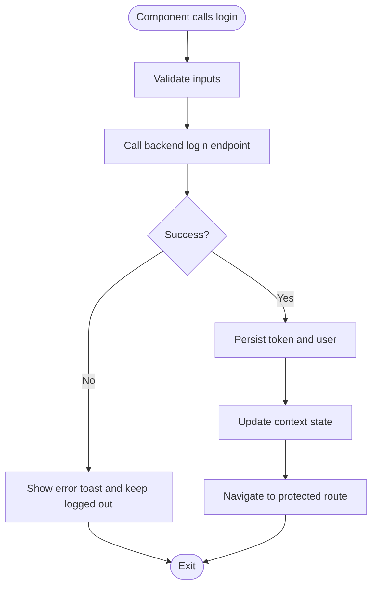
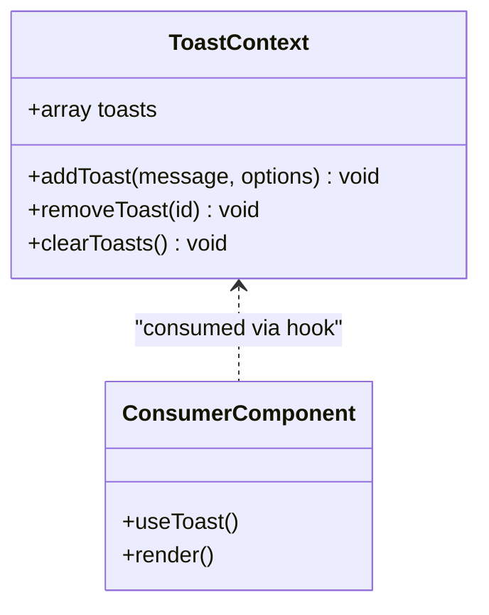
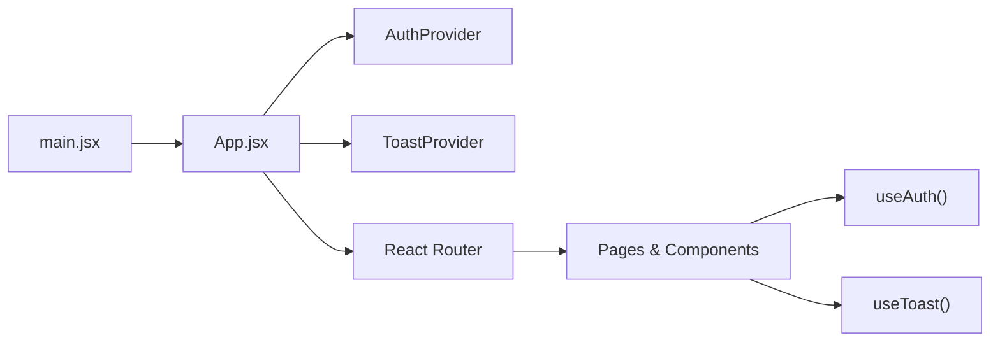
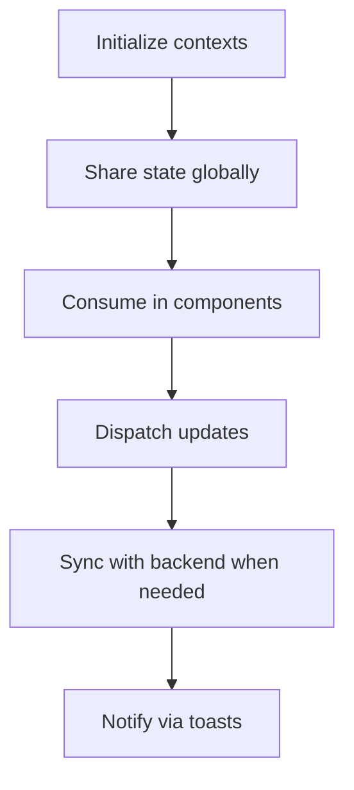
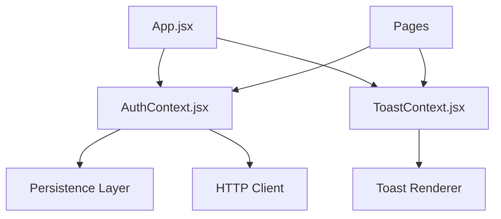

# State Management with Context API

<cite>
**Referenced Files in This Document**
- [AuthContext.jsx](file://frontend/src/context/AuthContext.jsx)
- [ToastContext.jsx](file://frontend/src/context/ToastContext.jsx)
- [App.jsx](file://frontend/src/App.jsx)
- [Login.jsx](file://frontend/src/pages/Login.jsx)
- [Dashboard.jsx](file://frontend/src/pages/Dashboard.jsx)
- [main.jsx](file://frontend/src/main.jsx)
</cite>

## Table of Contents
1. [Introduction](#introduction)
2. [Project Structure](#project-structure)
3. [Core Components](#core-components)
4. [Architecture Overview](#architecture-overview)
5. [Detailed Component Analysis](#detailed-component-analysis)
6. [Dependency Analysis](#dependency-analysis)
7. [Performance Considerations](#performance-considerations)
8. [Troubleshooting Guide](#troubleshooting-guide)
9. [Conclusion](#conclusion)

## Introduction
This document explains the state management architecture implemented with React Context API in the frontend application. It focuses on global state patterns for authentication, toast notifications, and application-wide data sharing. You will learn how context providers are structured, how state updates propagate to consumers, and how to integrate components that consume these contexts. The guide also covers performance optimization techniques such as memoization, synchronization with backend APIs, error handling strategies, and debugging approaches for complex state flows.

## Project Structure
The frontend organizes global state into dedicated context modules under a single directory. Providers wrap the application at the root level so that any component can access shared state without prop drilling. Pages and feature components consume contexts via hooks to read values and dispatch updates.

**Diagram sources**
- [main.jsx:1-200](file://frontend/src/main.jsx#L1-L200)
- [App.jsx:1-200](file://frontend/src/App.jsx#L1-L200)
- [AuthContext.jsx:1-200](file://frontend/src/context/AuthContext.jsx#L1-L200)
- [ToastContext.jsx:1-200](file://frontend/src/context/ToastContext.jsx#L1-L200)
- [Login.jsx:1-200](file://frontend/src/pages/Login.jsx#L1-L200)
- [Dashboard.jsx:1-200](file://frontend/src/pages/Dashboard.jsx#L1-L200)

**Section sources**
- [main.jsx:1-200](file://frontend/src/main.jsx#L1-L200)
- [App.jsx:1-200](file://frontend/src/App.jsx#L1-L200)

## Core Components
- Authentication context: Provides user identity, login/logout actions, and token persistence across sessions. Consumers can guard routes and personalize UI based on auth state.
- Toast notification context: Offers a centralized queue for success, warning, and error messages. Components trigger toasts without managing local UI state.
- Application-wide data sharing: Additional contexts can be added following the same pattern to share configuration, theme, or feature flags globally.

Key responsibilities:
- Create contexts with default values.
- Implement provider functions that manage state and expose update methods.
- Wrap the app tree with providers to make state available everywhere.
- Consume contexts in pages and components using hooks.

**Section sources**
- [AuthContext.jsx:1-200](file://frontend/src/context/AuthContext.jsx#L1-L200)
- [ToastContext.jsx:1-200](file://frontend/src/context/ToastContext.jsx#L1-L200)
- [App.jsx:1-200](file://frontend/src/App.jsx#L1-L200)

## Architecture Overview
The application uses a provider-consumer model:
- Providers encapsulate state and logic.
- Consumers subscribe only to the parts they need.
- Root-level providers ensure availability throughout the component tree.

**Diagram sources**
- [Login.jsx:1-200](file://frontend/src/pages/Login.jsx#L1-L200)
- [AuthContext.jsx:1-200](file://frontend/src/context/AuthContext.jsx#L1-L200)
- [App.jsx:1-200](file://frontend/src/App.jsx#L1-L200)

## Detailed Component Analysis

### Authentication Context
Responsibilities:
- Maintain current user and authentication status.
- Persist tokens to storage for session continuity.
- Provide login, logout, and refresh helpers.
- Expose an API surface for consumers to read and update auth state.

Provider implementation highlights:
- Initialize state from persistent storage on mount.
- Normalize user object and token format.
- Centralize error mapping and side effects (e.g., clearing storage).
- Memoize context value to avoid unnecessary re-renders.

Consumer integration examples:
- Login page invokes login action and handles success/failure.
- Protected routes check auth state before rendering.
- Header or profile components display user info and logout button.

**Diagram sources**
- [AuthContext.jsx:1-200](file://frontend/src/context/AuthContext.jsx#L1-L200)
- [Login.jsx:1-200](file://frontend/src/pages/Login.jsx#L1-L200)

**Section sources**
- [AuthContext.jsx:1-200](file://frontend/src/context/AuthContext.jsx#L1-L200)
- [Login.jsx:1-200](file://frontend/src/pages/Login.jsx#L1-L200)

### Toast Notification Context
Responsibilities:
- Manage a list of notifications with unique IDs.
- Provide add/remove/update helpers.
- Auto-dismiss after configurable durations.
- Render toasts via a portal or fixed container.

Provider implementation highlights:
- Use stable function references for add/remove to prevent consumer churn.
- Debounce rapid dismissals if needed.
- Keep toast payloads minimal and typed by kind (success, error, warning, info).

Consumer integration examples:
- After successful form submission, show a success toast.
- On API errors, show an error toast with actionable details.
- Global error boundary can push toasts for unexpected failures.

**Diagram sources**
- [ToastContext.jsx:1-200](file://frontend/src/context/ToastContext.jsx#L1-L200)

**Section sources**
- [ToastContext.jsx:1-200](file://frontend/src/context/ToastContext.jsx#L1-L200)

### App Provider Composition
Responsibilities:
- Compose multiple providers around the application root.
- Ensure initialization order (e.g., auth before routing).
- Provide fallbacks for missing providers during development.

Integration points:
- main.jsx bootstraps the app and mounts the root.
- App.jsx wraps the router and layout with providers.
- Pages consume contexts directly where needed.

**Diagram sources**
- [main.jsx:1-200](file://frontend/src/main.jsx#L1-L200)
- [App.jsx:1-200](file://frontend/src/App.jsx#L1-L200)

**Section sources**
- [App.jsx:1-200](file://frontend/src/App.jsx#L1-L200)
- [main.jsx:1-200](file://frontend/src/main.jsx#L1-L200)

### Conceptual Overview
Beyond auth and toasts, you can extend this pattern to share:
- Feature flags and experiment toggles.
- Theme preferences and locale settings.
- Search filters and pagination state for cross-page consistency.

[No sources needed since this diagram shows conceptual workflow, not actual code structure]

## Dependency Analysis
Contexts depend on:
- React primitives (useState, useEffect, useMemo, useCallback).
- Optional persistence layer (localStorage/sessionStorage).
- HTTP client for API calls.
- Routing utilities for navigation after auth changes.

Consumers depend on:
- Context hooks for reading and updating state.
- UI libraries for rendering toasts and layouts.

**Diagram sources**
- [AuthContext.jsx:1-200](file://frontend/src/context/AuthContext.jsx#L1-L200)
- [ToastContext.jsx:1-200](file://frontend/src/context/ToastContext.jsx#L1-L200)
- [App.jsx:1-200](file://frontend/src/App.jsx#L1-L200)

**Section sources**
- [AuthContext.jsx:1-200](file://frontend/src/context/AuthContext.jsx#L1-L200)
- [ToastContext.jsx:1-200](file://frontend/src/context/ToastContext.jsx#L1-L200)
- [App.jsx:1-200](file://frontend/src/App.jsx#L1-L200)

## Performance Considerations
- Memoize context values: Wrap the value object with useMemo to prevent unnecessary re-renders when only unrelated fields change.
- Stable callbacks: Use useCallback for dispatch functions exposed by contexts to keep consumer references stable.
- Split contexts: Separate concerns (auth vs. toasts vs. features) to limit the scope of re-renders.
- Lazy initialization: Initialize heavy state or fetch initial data lazily to avoid blocking render.
- Avoid large objects: Prefer normalized structures and selectors to minimize diffing overhead.
- Batch updates: Group related state changes to reduce render cycles.

[No sources needed since this section provides general guidance]

## Troubleshooting Guide
Common issues and strategies:
- Missing provider: Ensure all consumers are wrapped by their respective providers; log a clear error if a context is accessed outside its provider.
- Stale closures: When using callbacks inside effects, include correct dependencies and prefer functional updates.
- Token expiration: Implement token refresh flows and handle 401 responses centrally; redirect to login and clear persisted state.
- Toast overflow: Limit concurrent toasts and implement auto-dismiss with priority queuing.
- Debugging state: Add logging around state transitions and API calls; use browser devtools to inspect context values and network requests.
- Error boundaries: Catch rendering errors and push user-friendly toasts while preserving app stability.

**Section sources**
- [AuthContext.jsx:1-200](file://frontend/src/context/AuthContext.jsx#L1-L200)
- [ToastContext.jsx:1-200](file://frontend/src/context/ToastContext.jsx#L1-L200)
- [App.jsx:1-200](file://frontend/src/App.jsx#L1-L200)

## Conclusion
The Context API provides a simple yet powerful mechanism for global state management in this application. By organizing contexts around clear responsibilities—authentication, notifications, and shared data—you achieve predictable state flows, easy testing, and scalable growth. Applying memoization, stable callbacks, and robust error handling ensures a responsive and maintainable user experience. Extend the pattern consistently as new domains emerge, and keep providers focused and small to preserve performance.