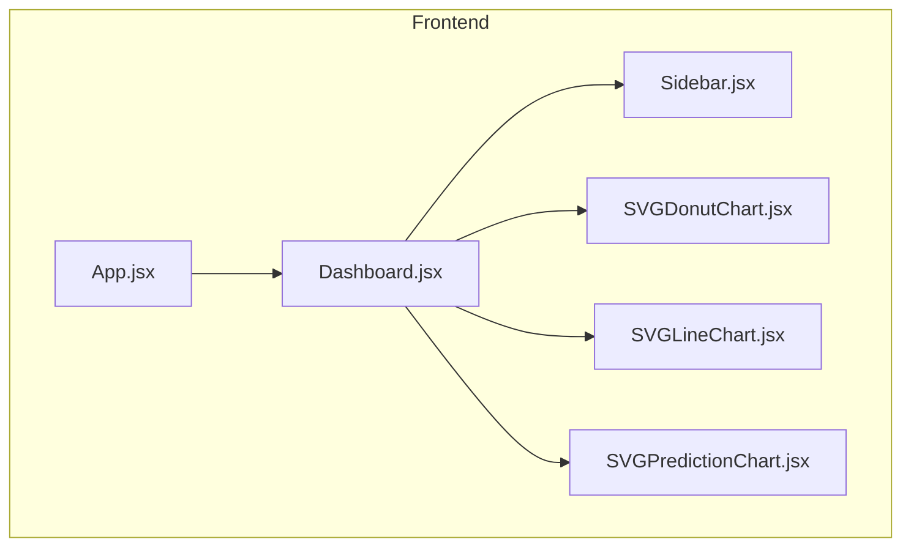
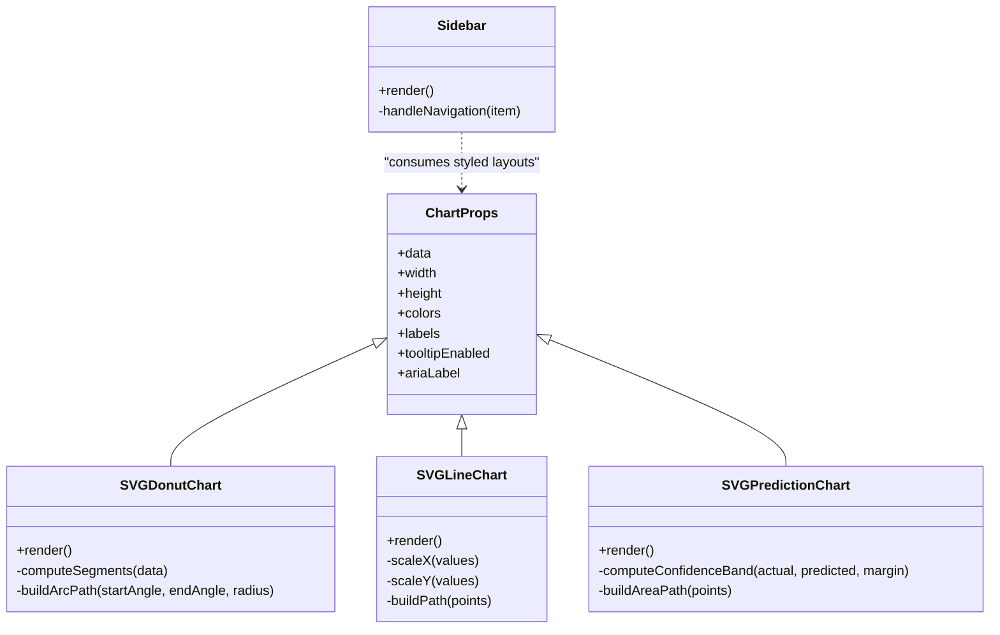
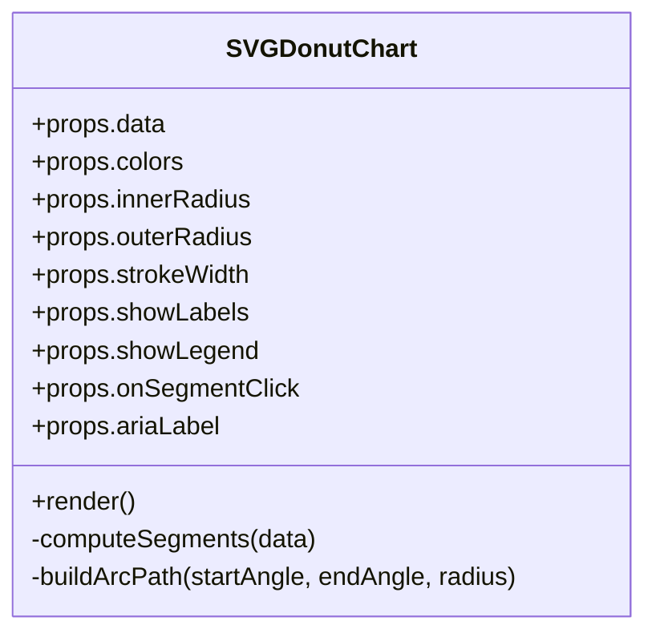
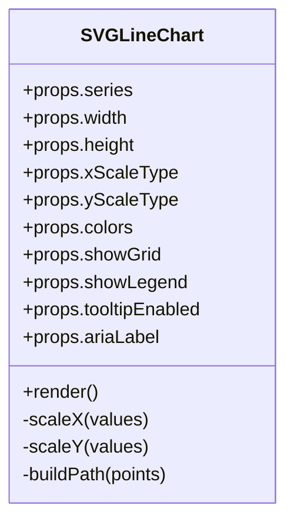
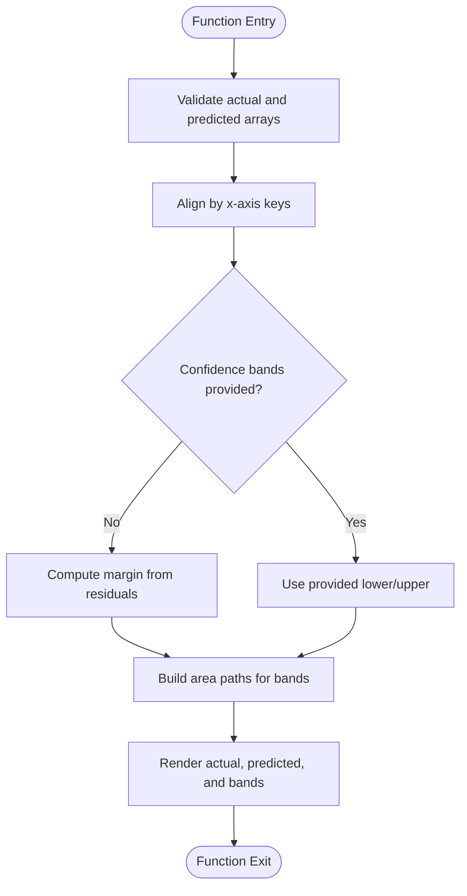
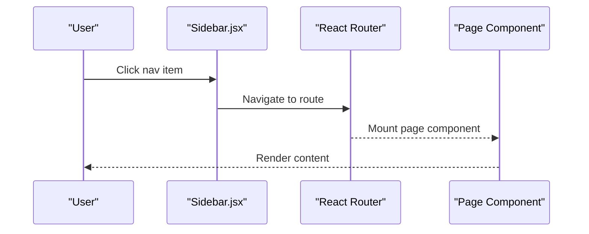
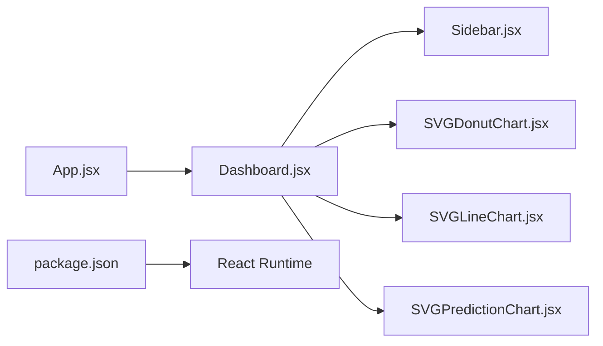

# UI Component Library and Charts

<cite>
**Referenced Files in This Document**
- [SVGDonutChart.jsx](file://frontend/src/components/charts/SVGDonutChart.jsx)
- [SVGLineChart.jsx](file://frontend/src/components/charts/SVGLineChart.jsx)
- [SVGPredictionChart.jsx](file://frontend/src/components/charts/SVGPredictionChart.jsx)
- [Sidebar.jsx](file://frontend/src/components/Sidebar.jsx)
- [Dashboard.jsx](file://frontend/src/pages/Dashboard.jsx)
- [App.jsx](file://frontend/src/App.jsx)
- [package.json](file://frontend/package.json)
</cite>

## Table of Contents
1. [Introduction](#introduction)
2. [Project Structure](#project-structure)
3. [Core Components](#core-components)
4. [Architecture Overview](#architecture-overview)
5. [Detailed Component Analysis](#detailed-component-analysis)
6. [Dependency Analysis](#dependency-analysis)
7. [Performance Considerations](#performance-considerations)
8. [Troubleshooting Guide](#troubleshooting-guide)
9. [Conclusion](#conclusion)
10. [Appendices](#appendices)

## Introduction
This document provides comprehensive documentation for the custom UI component library with a focus on SVG-based chart components and layout elements. It explains the implementation approach, props interfaces, customization options, styling strategies, data binding patterns, responsive behavior, accessibility considerations, cross-browser compatibility, and performance optimization techniques for large datasets. The sidebar component’s role in navigation and layout management is also covered.

## Project Structure
The frontend application organizes reusable UI pieces under src/components, including charts and layout elements. Pages consume these components to render dashboards and other views. The entry point wires routing and global context providers.

**Diagram sources**
- [App.jsx](file://frontend/src/App.jsx)
- [Dashboard.jsx](file://frontend/src/pages/Dashboard.jsx)
- [Sidebar.jsx](file://frontend/src/components/Sidebar.jsx)
- [SVGDonutChart.jsx](file://frontend/src/components/charts/SVGDonutChart.jsx)
- [SVGLineChart.jsx](file://frontend/src/components/charts/SVGLineChart.jsx)
- [SVGPredictionChart.jsx](file://frontend/src/components/charts/SVGPredictionChart.jsx)

**Section sources**
- [App.jsx](file://frontend/src/App.jsx)
- [Dashboard.jsx](file://frontend/src/pages/Dashboard.jsx)
- [Sidebar.jsx](file://frontend/src/components/Sidebar.jsx)
- [SVGDonutChart.jsx](file://frontend/src/components/charts/SVGDonutChart.jsx)
- [SVGLineChart.jsx](file://frontend/src/components/charts/SVGLineChart.jsx)
- [SVGPredictionChart.jsx](file://frontend/src/components/charts/SVGPredictionChart.jsx)

## Core Components
This section summarizes the purpose and responsibilities of each core component:
- SVG-based donut chart: Renders proportional segments using SVG paths or arcs; supports labels, colors, and interactivity.
- SVG-based line chart: Plots time-series or categorical series with axes, grid lines, tooltips, and legends.
- SVG-based prediction chart: Visualizes predicted values alongside actuals, including confidence bands or error ranges.
- Sidebar: Provides navigation links and layout scaffolding for page content.

These components are designed to be composable, themeable via CSS variables or inline styles, and accessible through ARIA attributes and keyboard support.

[No sources needed since this section provides general guidance]

## Architecture Overview
The chart components follow a consistent pattern:
- Data-driven rendering: Props define datasets, scales, and visual encodings.
- Responsive sizing: Dimensions adapt to container size via percentage-based SVG or resize observers.
- Styling abstraction: Colors, fonts, and spacing are configurable via props or CSS variables.
- Accessibility: Semantic roles, labels, and focus management are provided where applicable.

**Diagram sources**
- [SVGDonutChart.jsx](file://frontend/src/components/charts/SVGDonutChart.jsx)
- [SVGLineChart.jsx](file://frontend/src/components/charts/SVGLineChart.jsx)
- [SVGPredictionChart.jsx](file://frontend/src/components/charts/SVGPredictionChart.jsx)
- [Sidebar.jsx](file://frontend/src/components/Sidebar.jsx)

## Detailed Component Analysis

### SVG Donut Chart
Responsibilities:
- Accepts an array of segments with value and label fields.
- Computes angles and arc paths based on total sum.
- Supports hover states, click handlers, and tooltip toggles.
- Exposes props for colors, inner radius, outer radius, stroke width, and aria labeling.

Props interface (representative):
- data: Array<{ label: string, value: number }>
- colors: string[]
- innerRadius: number
- outerRadius: number
- strokeWidth: number
- showLabels: boolean
- showLegend: boolean
- onSegmentClick: (segment) => void
- ariaLabel: string

Styling approaches:
- Use CSS variables for theme tokens (e.g., --chart-color-1).
- Inline style overrides for dynamic radii and strokes.
- Media queries for responsive font sizes and legend placement.

Data binding patterns:
- Normalize input data to ensure non-negative values and handle missing labels.
- Compute cumulative sums for angle calculations.
- Memoize computed segments to avoid recalculations on re-renders.

Accessibility:
- Provide role="img" and aria-label describing the chart.
- Add tabindex and keyboard interaction for segment selection when interactive.
- Ensure sufficient color contrast and provide text alternatives.

Responsive behavior:
- Render SVG with viewBox and percentage dimensions.
- Optionally use ResizeObserver to adjust radii and font sizes.

Cross-browser compatibility:
- Use standard SVG path commands for arcs.
- Avoid vendor-specific features; test in modern browsers.

Performance considerations:
- For large datasets, aggregate small segments into an “Other” category.
- Debounce hover events and limit tooltip updates.

Usage example (conceptual):
- Bind an array of {label, value} pairs from state or API response.
- Pass theme colors and enable labels/legend as needed.

**Section sources**
- [SVGDonutChart.jsx](file://frontend/src/components/charts/SVGDonutChart.jsx)

#### Class Diagram

**Diagram sources**
- [SVGDonutChart.jsx](file://frontend/src/components/charts/SVGDonutChart.jsx)

### SVG Line Chart
Responsibilities:
- Plots one or multiple series over X and Y axes.
- Scales data to pixel coordinates.
- Renders grid lines, axis ticks, legends, and tooltips.
- Supports zooming or panning via props if implemented.

Props interface (representative):
- series: Array<{ name: string, data: Array<{ x: number|string, y: number }> }>
- width: number|string
- height: number|string
- xScaleType: "linear" | "time" | "ordinal"
- yScaleType: "linear"
- colors: string[]
- showGrid: boolean
- showLegend: boolean
- tooltipEnabled: boolean
- ariaLabel: string

Styling approaches:
- Define tick spacing and grid opacity via props or CSS variables.
- Use stroke-width and marker props for points.

Data binding patterns:
- Validate series structure and sort by x-axis.
- Compute domain and range for scales.
- Build path strings efficiently using memoization.

Accessibility:
- Provide descriptive aria-label per series.
- Offer keyboard-accessible legend toggles to filter series.

Responsive behavior:
- Use viewBox and percentage width/height.
- Recalculate scales on container resize.

Cross-browser compatibility:
- Rely on SVG path and transform APIs.
- Test time formatting across locales.

Performance considerations:
- Downsample dense series for rendering.
- Use requestAnimationFrame for animations.
- Limit tooltip computations to visible regions.

Usage example (conceptual):
- Bind series arrays from API responses.
- Toggle visibility via legend interactions.

**Section sources**
- [SVGLineChart.jsx](file://frontend/src/components/charts/SVGLineChart.jsx)

#### Class Diagram

**Diagram sources**
- [SVGLineChart.jsx](file://frontend/src/components/charts/SVGLineChart.jsx)

### SVG Prediction Chart
Responsibilities:
- Displays actual vs. predicted values.
- Optionally renders confidence intervals or error bands.
- Highlights deviations and thresholds.

Props interface (representative):
- actual: Array<{ x: number|string, y: number }>
- predicted: Array<{ x: number|string, y: number }>
- confidenceBands?: Array<{ x: number|string, lower: number, upper: number }>
- thresholds?: Array<{ value: number, label: string }>
- colors: object
- showLegend: boolean
- tooltipEnabled: boolean
- ariaLabel: string

Styling approaches:
- Differentiate actual and predicted with distinct stroke styles.
- Use semi-transparent fills for confidence bands.

Data binding patterns:
- Align actual and predicted by x-axis keys.
- Compute band margins dynamically if not provided.

Accessibility:
- Label bands and thresholds clearly.
- Provide keyboard controls to toggle overlays.

Responsive behavior:
- Scale axes proportionally to container size.

Cross-browser compatibility:
- Use standard SVG area and path elements.

Performance considerations:
- Aggregate predictions into bins for large datasets.
- Cache computed areas and paths.

Usage example (conceptual):
- Bind historical actuals and forecasted predictions.
- Show/hide confidence bands based on user preference.

**Section sources**
- [SVGPredictionChart.jsx](file://frontend/src/components/charts/SVGPredictionChart.jsx)

#### Flowchart: Confidence Band Computation

**Diagram sources**
- [SVGPredictionChart.jsx](file://frontend/src/components/charts/SVGPredictionChart.jsx)

### Sidebar Component
Responsibilities:
- Renders navigation items and active state indicators.
- Manages collapsed/expanded states and keyboard navigation.
- Integrates with routing to navigate between pages.

Props interface (representative):
- items: Array<{ label: string, route: string, icon?: ReactNode }>
- collapsed: boolean
- onToggle: () => void
- activeRoute: string
- ariaLabel: string

Styling approaches:
- Use CSS variables for background, text, and accent colors.
- Transition animations for collapse/expand.

Accessibility:
- Provide role="navigation" and aria-label.
- Ensure focus order and keyboard shortcuts.

Responsive behavior:
- Collapse by default on small screens; expand on larger viewports.

Integration points:
- Consumed by Dashboard to frame main content.

**Section sources**
- [Sidebar.jsx](file://frontend/src/components/Sidebar.jsx)
- [Dashboard.jsx](file://frontend/src/pages/Dashboard.jsx)

#### Sequence Diagram: Navigation Flow

**Diagram sources**
- [Sidebar.jsx](file://frontend/src/components/Sidebar.jsx)
- [Dashboard.jsx](file://frontend/src/pages/Dashboard.jsx)

## Dependency Analysis
The chart components depend only on React and native SVG APIs. They do not rely on external charting libraries, minimizing bundle size and improving control over rendering.

**Diagram sources**
- [App.jsx](file://frontend/src/App.jsx)
- [Dashboard.jsx](file://frontend/src/pages/Dashboard.jsx)
- [Sidebar.jsx](file://frontend/src/components/Sidebar.jsx)
- [SVGDonutChart.jsx](file://frontend/src/components/charts/SVGDonutChart.jsx)
- [SVGLineChart.jsx](file://frontend/src/components/charts/SVGLineChart.jsx)
- [SVGPredictionChart.jsx](file://frontend/src/components/charts/SVGPredictionChart.jsx)
- [package.json](file://frontend/package.json)

**Section sources**
- [package.json](file://frontend/package.json)

## Performance Considerations
- Data normalization: Preprocess datasets to remove nulls, duplicates, and invalid values before rendering.
- Aggregation: Group small categories into “Other” for donut charts; bin time-series for line charts.
- Memoization: Cache computed segments, scales, and paths to reduce re-renders.
- Virtualization: For extremely large datasets, consider virtualizing visible portions or sampling.
- Event throttling: Throttle hover and resize events to prevent jank.
- Rendering strategy: Prefer SVG path generation over many DOM nodes; reuse elements where possible.
- Animation: Use CSS transitions instead of JS animation loops for better performance.

[No sources needed since this section provides general guidance]

## Troubleshooting Guide
Common issues and resolutions:
- Empty or malformed data: Validate inputs and provide fallbacks; log warnings for missing fields.
- Overlapping labels: Adjust font size, rotate labels, or hide less important ones at smaller sizes.
- Tooltip flicker: Stabilize pointer positions and debounce updates.
- Color contrast failures: Enforce minimum contrast ratios and offer high-contrast themes.
- Cross-browser inconsistencies: Test SVG path rendering and time formatting; add polyfills if necessary.
- Memory leaks: Clean up event listeners and observers on unmount.

[No sources needed since this section provides general guidance]

## Conclusion
The custom UI component library delivers lightweight, accessible, and customizable SVG-based charts and a flexible sidebar layout. By adhering to consistent props interfaces, responsive design practices, and performance optimizations, the components scale well across devices and datasets while maintaining usability and accessibility standards.

[No sources needed since this section summarizes without analyzing specific files]

## Appendices

### Appendix A: Props Reference Summary
- SVGDonutChart
  - data, colors, innerRadius, outerRadius, strokeWidth, showLabels, showLegend, onSegmentClick, ariaLabel
- SVGLineChart
  - series, width, height, xScaleType, yScaleType, colors, showGrid, showLegend, tooltipEnabled, ariaLabel
- SVGPredictionChart
  - actual, predicted, confidenceBands, thresholds, colors, showLegend, tooltipEnabled, ariaLabel
- Sidebar
  - items, collapsed, onToggle, activeRoute, ariaLabel

[No sources needed since this section aggregates previously analyzed information]