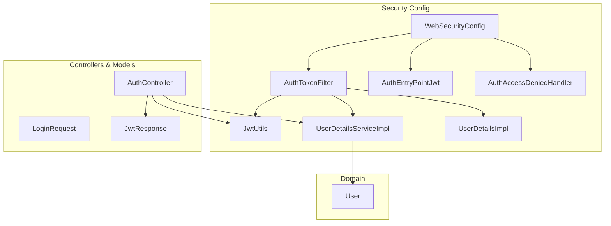
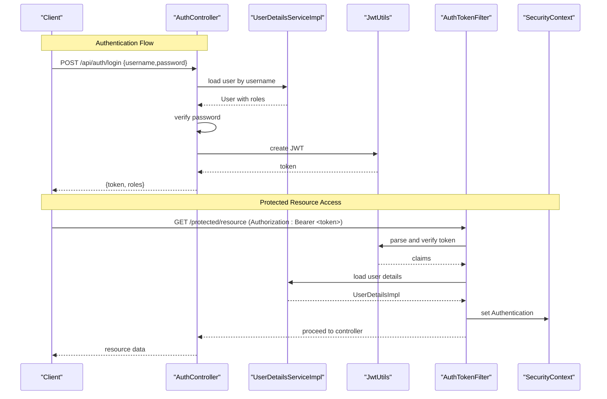
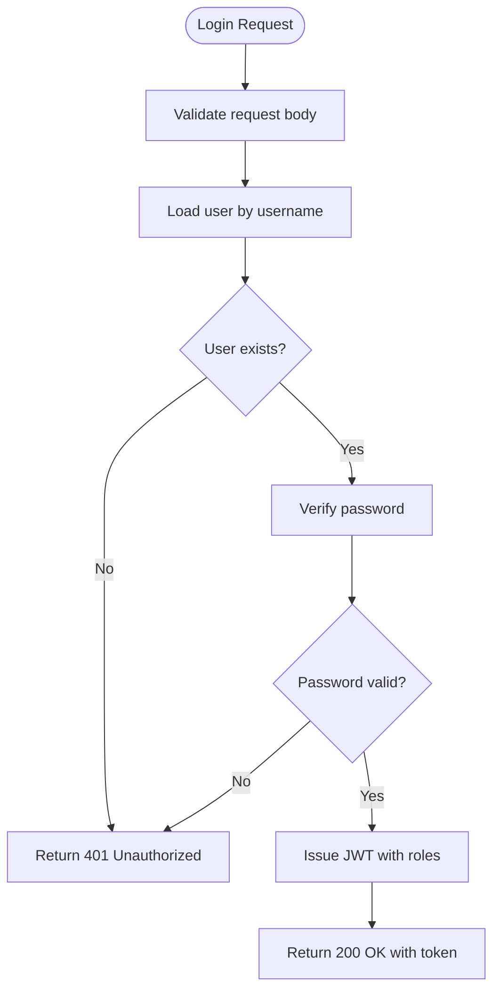
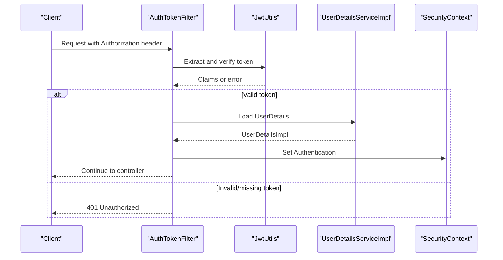
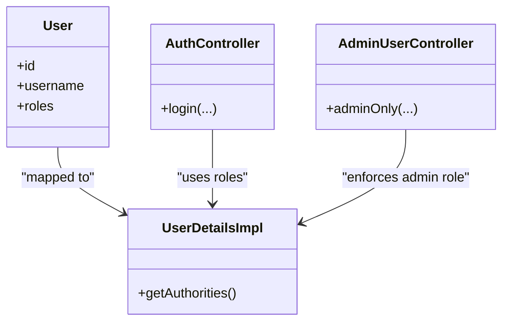
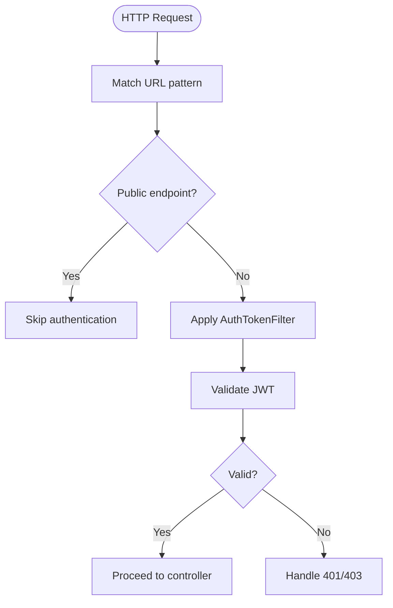
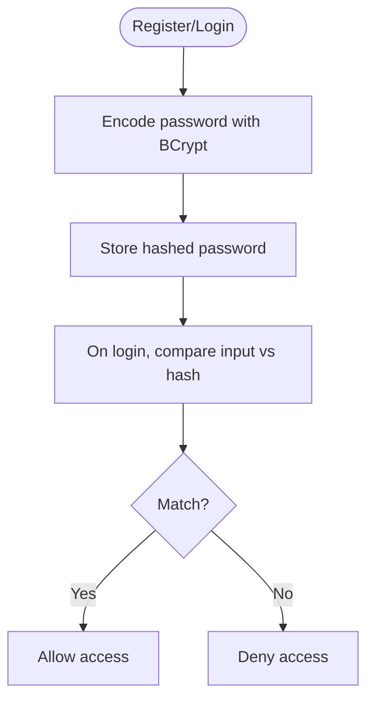
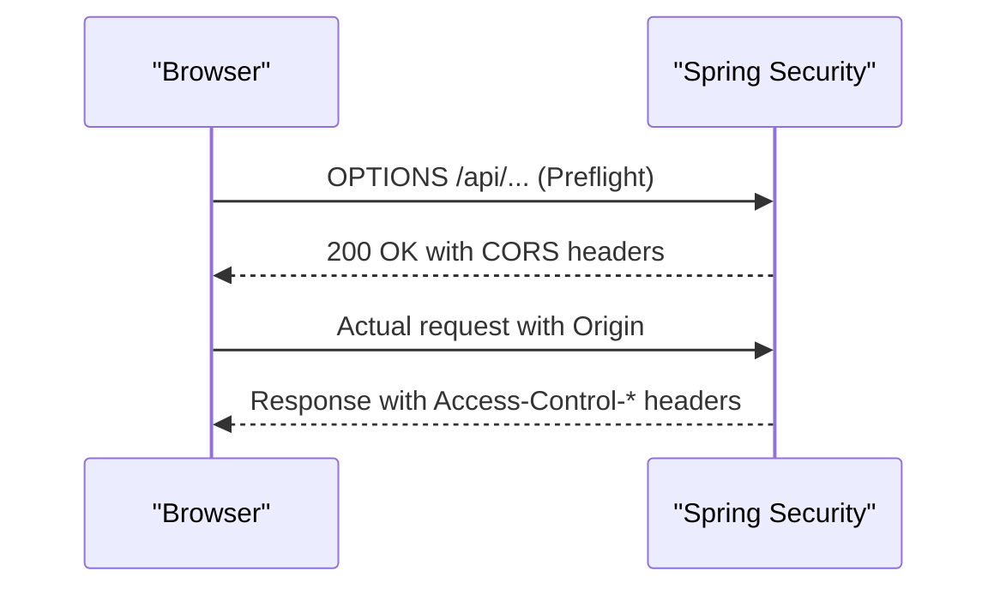
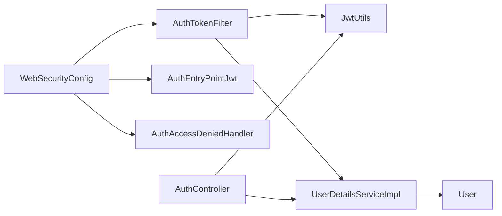

# Security Architecture

<cite>
**Referenced Files in This Document**
- [WebSecurityConfig.java](file://backend/src/main/java/com/ceb/billing/config/WebSecurityConfig.java)
- [AuthTokenFilter.java](file://backend/src/main/java/com/ceb/billing/config/AuthTokenFilter.java)
- [JwtUtils.java](file://backend/src/main/java/com/ceb/billing/config/JwtUtils.java)
- [UserDetailsServiceImpl.java](file://backend/src/main/java/com/ceb/billing/config/UserDetailsServiceImpl.java)
- [UserDetailsImpl.java](file://backend/src/main/java/com/ceb/billing/config/UserDetailsImpl.java)
- [AuthEntryPointJwt.java](file://backend/src/main/java/com/ceb/billing/config/AuthEntryPointJwt.java)
- [AuthAccessDeniedHandler.java](file://backend/src/main/java/com/ceb/billing/config/AuthAccessDeniedHandler.java)
- [AuthController.java](file://backend/src/main/java/com/ceb/billing/controllers/AuthController.java)
- [LoginRequest.java](file://backend/src/main/java/com/ceb/billing/models/LoginRequest.java)
- [JwtResponse.java](file://backend/src/main/java/com/ceb/billing/models/JwtResponse.java)
- [User.java](file://backend/src/main/java/com/ceb/billing/entities/User.java)
- [application.properties](file://backend/src/main/resources/application.properties)
</cite>

## Table of Contents
1. [Introduction](#introduction)
2. [Project Structure](#project-structure)
3. [Core Components](#core-components)
4. [Architecture Overview](#architecture-overview)
5. [Detailed Component Analysis](#detailed-component-analysis)
6. [Dependency Analysis](#dependency-analysis)
7. [Performance Considerations](#performance-considerations)
8. [Troubleshooting Guide](#troubleshooting-guide)
9. [Conclusion](#conclusion)

## Introduction
This document describes the security architecture of the billing application, focusing on JWT-based authentication, role-based authorization, and request protection. It explains how login flows produce tokens, how those tokens are validated across requests, and how protected resources are accessed. It also covers password encryption strategies, input validation, SQL injection prevention, XSS protection, CSRF mitigation, security headers, CORS configuration, and audit logging for security events.

## Project Structure
The security implementation is primarily located under the backend package:
- Configuration and filters: WebSecurityConfig, AuthTokenFilter, JwtUtils, UserDetailsServiceImpl, UserDetailsImpl, AuthEntryPointJwt, AuthAccessDeniedHandler
- Controllers and models: AuthController, LoginRequest, JwtResponse
- Entities: User
- Application properties: application.properties

**Diagram sources**
- [WebSecurityConfig.java](file://backend/src/main/java/com/ceb/billing/config/WebSecurityConfig.java)
- [AuthTokenFilter.java](file://backend/src/main/java/com/ceb/billing/config/AuthTokenFilter.java)
- [JwtUtils.java](file://backend/src/main/java/com/ceb/billing/config/JwtUtils.java)
- [UserDetailsServiceImpl.java](file://backend/src/main/java/com/ceb/billing/config/UserDetailsServiceImpl.java)
- [UserDetailsImpl.java](file://backend/src/main/java/com/ceb/billing/config/UserDetailsImpl.java)
- [AuthEntryPointJwt.java](file://backend/src/main/java/com/ceb/billing/config/AuthEntryPointJwt.java)
- [AuthAccessDeniedHandler.java](file://backend/src/main/java/com/ceb/billing/config/AuthAccessDeniedHandler.java)
- [AuthController.java](file://backend/src/main/java/com/ceb/billing/controllers/AuthController.java)
- [LoginRequest.java](file://backend/src/main/java/com/ceb/billing/models/LoginRequest.java)
- [JwtResponse.java](file://backend/src/main/java/com/ceb/billing/models/JwtResponse.java)
- [User.java](file://backend/src/main/java/com/ceb/billing/entities/User.java)

**Section sources**
- [WebSecurityConfig.java](file://backend/src/main/java/com/ceb/billing/config/WebSecurityConfig.java)
- [AuthTokenFilter.java](file://backend/src/main/java/com/ceb/billing/config/AuthTokenFilter.java)
- [JwtUtils.java](file://backend/src/main/java/com/ceb/billing/config/JwtUtils.java)
- [UserDetailsServiceImpl.java](file://backend/src/main/java/com/ceb/billing/config/UserDetailsServiceImpl.java)
- [UserDetailsImpl.java](file://backend/src/main/java/com/ceb/billing/config/UserDetailsImpl.java)
- [AuthEntryPointJwt.java](file://backend/src/main/java/com/ceb/billing/config/AuthEntryPointJwt.java)
- [AuthAccessDeniedHandler.java](file://backend/src/main/java/com/ceb/billing/config/AuthAccessDeniedHandler.java)
- [AuthController.java](file://backend/src/main/java/com/ceb/billing/controllers/AuthController.java)
- [LoginRequest.java](file://backend/src/main/java/com/ceb/billing/models/LoginRequest.java)
- [JwtResponse.java](file://backend/src/main/java/com/ceb/billing/models/JwtResponse.java)
- [User.java](file://backend/src/main/java/com/ceb/billing/entities/User.java)
- [application.properties](file://backend/src/main/resources/application.properties)

## Core Components
- WebSecurityConfig: Defines the Spring Security filter chain, HTTP method restrictions, path allowlists, exception handling, and CORS settings.
- AuthTokenFilter: Intercepts each request to extract and validate the JWT from the Authorization header and populate the SecurityContext.
- JwtUtils: Provides token creation, parsing, and verification utilities (e.g., signing key, expiration).
- UserDetailsServiceImpl: Loads user details by username and maps roles/authorities for authorization decisions.
- UserDetailsImpl: Represents the authenticated principal with authorities used by Spring Security.
- AuthEntryPointJwt: Handles unauthenticated access attempts with a consistent JSON error response.
- AuthAccessDeniedHandler: Handles insufficient privileges with a consistent JSON error response.
- AuthController: Exposes login endpoint that validates credentials and issues a JWT.
- LoginRequest/JwtResponse: Request/response DTOs for authentication.
- User: Domain entity representing users and their roles.

Key responsibilities:
- Authentication flow: Credentials -> validation -> JWT issuance.
- Authorization flow: JWT extraction -> claims parsing -> SecurityContext population -> @PreAuthorize checks.
- Error handling: Unauthenticated/unauthorized responses standardized via entry point and access denied handler.

**Section sources**
- [WebSecurityConfig.java](file://backend/src/main/java/com/ceb/billing/config/WebSecurityConfig.java)
- [AuthTokenFilter.java](file://backend/src/main/java/com/ceb/billing/config/AuthTokenFilter.java)
- [JwtUtils.java](file://backend/src/main/java/com/ceb/billing/config/JwtUtils.java)
- [UserDetailsServiceImpl.java](file://backend/src/main/java/com/ceb/billing/config/UserDetailsServiceImpl.java)
- [UserDetailsImpl.java](file://backend/src/main/java/com/ceb/billing/config/UserDetailsImpl.java)
- [AuthEntryPointJwt.java](file://backend/src/main/java/com/ceb/billing/config/AuthEntryPointJwt.java)
- [AuthAccessDeniedHandler.java](file://backend/src/main/java/com/ceb/billing/config/AuthAccessDeniedHandler.java)
- [AuthController.java](file://backend/src/main/java/com/ceb/billing/controllers/AuthController.java)
- [LoginRequest.java](file://backend/src/main/java/com/ceb/billing/models/LoginRequest.java)
- [JwtResponse.java](file://backend/src/main/java/com/ceb/billing/models/JwtResponse.java)
- [User.java](file://backend/src/main/java/com/ceb/billing/entities/User.java)

## Architecture Overview
The system uses stateless JWT authentication. Clients send credentials to the login endpoint; upon success, they receive a signed token. Subsequent requests include the token in the Authorization header. The security filter chain validates the token and populates the SecurityContext before controller methods execute. Role-based authorization is enforced at the controller or method level using annotations.

**Diagram sources**
- [AuthController.java](file://backend/src/main/java/com/ceb/billing/controllers/AuthController.java)
- [UserDetailsServiceImpl.java](file://backend/src/main/java/com/ceb/billing/config/UserDetailsServiceImpl.java)
- [JwtUtils.java](file://backend/src/main/java/com/ceb/billing/config/JwtUtils.java)
- [AuthTokenFilter.java](file://backend/src/main/java/com/ceb/billing/config/AuthTokenFilter.java)

## Detailed Component Analysis

### JWT-Based Authentication Flow
- Login endpoint accepts credentials, verifies them against stored user data, and returns a JWT.
- Token includes user identity and roles/authorities.
- Clients store the token and attach it to subsequent requests.

**Diagram sources**
- [AuthController.java](file://backend/src/main/java/com/ceb/billing/controllers/AuthController.java)
- [UserDetailsServiceImpl.java](file://backend/src/main/java/com/ceb/billing/config/UserDetailsServiceImpl.java)
- [JwtUtils.java](file://backend/src/main/java/com/ceb/billing/config/JwtUtils.java)
- [LoginRequest.java](file://backend/src/main/java/com/ceb/billing/models/LoginRequest.java)
- [JwtResponse.java](file://backend/src/main/java/com/ceb/billing/models/JwtResponse.java)

**Section sources**
- [AuthController.java](file://backend/src/main/java/com/ceb/billing/controllers/AuthController.java)
- [LoginRequest.java](file://backend/src/main/java/com/ceb/billing/models/LoginRequest.java)
- [JwtResponse.java](file://backend/src/main/java/com/ceb/billing/models/JwtResponse.java)
- [UserDetailsServiceImpl.java](file://backend/src/main/java/com/ceb/billing/config/UserDetailsServiceImpl.java)
- [JwtUtils.java](file://backend/src/main/java/com/ceb/billing/config/JwtUtils.java)

### Token Validation and Security Context Population
- Each incoming request passes through AuthTokenFilter.
- The filter extracts the bearer token, validates its signature and expiration, loads user details, and sets the SecurityContext.
- If invalid or missing, the request is rejected early.

**Diagram sources**
- [AuthTokenFilter.java](file://backend/src/main/java/com/ceb/billing/config/AuthTokenFilter.java)
- [JwtUtils.java](file://backend/src/main/java/com/ceb/billing/config/JwtUtils.java)
- [UserDetailsServiceImpl.java](file://backend/src/main/java/com/ceb/billing/config/UserDetailsServiceImpl.java)

**Section sources**
- [AuthTokenFilter.java](file://backend/src/main/java/com/ceb/billing/config/AuthTokenFilter.java)
- [JwtUtils.java](file://backend/src/main/java/com/ceb/billing/config/JwtUtils.java)
- [UserDetailsServiceImpl.java](file://backend/src/main/java/com/ceb/billing/config/UserDetailsServiceImpl.java)

### Role-Based Authorization Patterns
- Roles/authorities are derived from user entities and attached to the principal.
- Endpoints can be restricted using annotations such as @PreAuthorize based on roles.
- Admin-only endpoints should enforce higher privileges.

**Diagram sources**
- [User.java](file://backend/src/main/java/com/ceb/billing/entities/User.java)
- [UserDetailsImpl.java](file://backend/src/main/java/com/ceb/billing/config/UserDetailsImpl.java)
- [AuthController.java](file://backend/src/main/java/com/ceb/billing/controllers/AuthController.java)

**Section sources**
- [User.java](file://backend/src/main/java/com/ceb/billing/entities/User.java)
- [UserDetailsImpl.java](file://backend/src/main/java/com/ceb/billing/config/UserDetailsImpl.java)
- [AuthController.java](file://backend/src/main/java/com/ceb/billing/controllers/AuthController.java)

### Security Filter Chain Configuration
- WebSecurityConfig defines:
  - Path allowlists (e.g., public endpoints like login).
  - Method restrictions (e.g., only allowed HTTP verbs).
  - Exception handlers for unauthenticated and unauthorized cases.
  - CORS policy for cross-origin requests.
  - Statelessness (no server-side sessions).

**Diagram sources**
- [WebSecurityConfig.java](file://backend/src/main/java/com/ceb/billing/config/WebSecurityConfig.java)
- [AuthTokenFilter.java](file://backend/src/main/java/com/ceb/billing/config/AuthTokenFilter.java)

**Section sources**
- [WebSecurityConfig.java](file://backend/src/main/java/com/ceb/billing/config/WebSecurityConfig.java)
- [AuthEntryPointJwt.java](file://backend/src/main/java/com/ceb/billing/config/AuthEntryPointJwt.java)
- [AuthAccessDeniedHandler.java](file://backend/src/main/java/com/ceb/billing/config/AuthAccessDeniedHandler.java)

### Password Encryption Strategy
- Passwords are verified using a configured encoder (e.g., BCryptPasswordEncoder).
- New passwords must be encoded before storage.
- Verification compares plaintext input against stored hashes.

**Diagram sources**
- [UserDetailsServiceImpl.java](file://backend/src/main/java/com/ceb/billing/config/UserDetailsServiceImpl.java)
- [application.properties](file://backend/src/main/resources/application.properties)

**Section sources**
- [UserDetailsServiceImpl.java](file://backend/src/main/java/com/ceb/billing/config/UserDetailsServiceImpl.java)
- [application.properties](file://backend/src/main/resources/application.properties)

### Cross-Origin Request Handling (CORS)
- CORS is configured in WebSecurityConfig to allow specific origins, methods, and headers.
- Preflight requests are handled automatically by Spring Security when configured correctly.
- Ensure credentials mode is aligned with client behavior.

**Diagram sources**
- [WebSecurityConfig.java](file://backend/src/main/java/com/ceb/billing/config/WebSecurityConfig.java)

**Section sources**
- [WebSecurityConfig.java](file://backend/src/main/java/com/ceb/billing/config/WebSecurityConfig.java)

### Input Validation, SQL Injection Prevention, XSS Protection, CSRF Mitigation
- Input validation: Use DTO constraints and service-level checks to reject malformed inputs early.
- SQL injection prevention: Prefer parameterized queries via JPA repositories; avoid string concatenation in queries.
- XSS protection: Sanitize outputs and avoid rendering raw user input in HTML contexts.
- CSRF mitigation: Stateless JWT authentication typically disables session-based CSRF; ensure stateless design and do not rely on cookies for auth.

[No sources needed since this section provides general guidance]

### Security Headers
- Configure standard security headers (e.g., HSTS, X-Content-Type-Options, X-Frame-Options, Content-Security-Policy) via WebSecurityConfig or a dedicated filter.
- Align header policies with application needs and browser compatibility.

[No sources needed since this section provides general guidance]

### Audit Logging for Security Events
- Log authentication successes/failures, authorization denials, and token errors.
- Include contextual information (user, IP, timestamp) without sensitive payloads.
- Centralize logging for compliance and incident response.

[No sources needed since this section provides general guidance]

## Dependency Analysis
The following diagram shows core dependencies among security components.

**Diagram sources**
- [WebSecurityConfig.java](file://backend/src/main/java/com/ceb/billing/config/WebSecurityConfig.java)
- [AuthTokenFilter.java](file://backend/src/main/java/com/ceb/billing/config/AuthTokenFilter.java)
- [JwtUtils.java](file://backend/src/main/java/com/ceb/billing/config/JwtUtils.java)
- [UserDetailsServiceImpl.java](file://backend/src/main/java/com/ceb/billing/config/UserDetailsServiceImpl.java)
- [AuthEntryPointJwt.java](file://backend/src/main/java/com/ceb/billing/config/AuthEntryPointJwt.java)
- [AuthAccessDeniedHandler.java](file://backend/src/main/java/com/ceb/billing/config/AuthAccessDeniedHandler.java)
- [AuthController.java](file://backend/src/main/java/com/ceb/billing/controllers/AuthController.java)
- [User.java](file://backend/src/main/java/com/ceb/billing/entities/User.java)

**Section sources**
- [WebSecurityConfig.java](file://backend/src/main/java/com/ceb/billing/config/WebSecurityConfig.java)
- [AuthTokenFilter.java](file://backend/src/main/java/com/ceb/billing/config/AuthTokenFilter.java)
- [JwtUtils.java](file://backend/src/main/java/com/ceb/billing/config/JwtUtils.java)
- [UserDetailsServiceImpl.java](file://backend/src/main/java/com/ceb/billing/config/UserDetailsServiceImpl.java)
- [AuthEntryPointJwt.java](file://backend/src/main/java/com/ceb/billing/config/AuthEntryPointJwt.java)
- [AuthAccessDeniedHandler.java](file://backend/src/main/java/com/ceb/billing/config/AuthAccessDeniedHandler.java)
- [AuthController.java](file://backend/src/main/java/com/ceb/billing/controllers/AuthController.java)
- [User.java](file://backend/src/main/java/com/ceb/billing/entities/User.java)

## Performance Considerations
- Keep JWT payload minimal to reduce overhead.
- Cache user details if necessary, but ensure consistency with role changes.
- Avoid heavy operations in the filter chain; delegate to services where appropriate.
- Tune token expiration to balance security and usability.

[No sources needed since this section provides general guidance]

## Troubleshooting Guide
Common issues and resolutions:
- 401 Unauthorized: Missing or invalid Authorization header; check token presence and format.
- 403 Forbidden: Insufficient roles; verify user authorities and endpoint restrictions.
- CORS failures: Ensure allowed origins/methods/headers match client requests.
- Password mismatches: Confirm encoding strategy and stored hash integrity.

**Section sources**
- [AuthEntryPointJwt.java](file://backend/src/main/java/com/ceb/billing/config/AuthEntryPointJwt.java)
- [AuthAccessDeniedHandler.java](file://backend/src/main/java/com/ceb/billing/config/AuthAccessDeniedHandler.java)
- [WebSecurityConfig.java](file://backend/src/main/java/com/ceb/billing/config/WebSecurityConfig.java)

## Conclusion
The application implements a robust, stateless JWT-based security framework with clear separation of concerns: configuration, filtering, token management, user details loading, and error handling. Role-based authorization is enforced via Spring Security annotations, while CORS and error responses are standardized. Following the recommended practices for input validation, SQL injection prevention, XSS protection, and CSRF mitigation ensures a strong security posture.