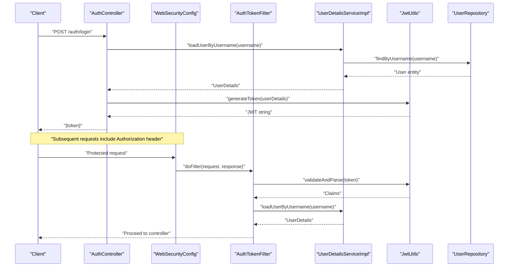
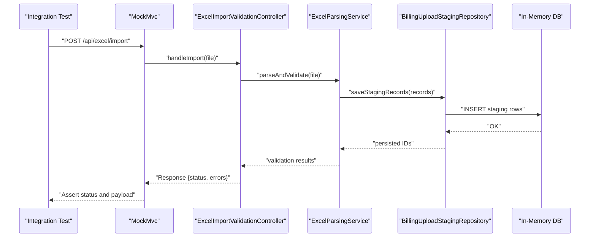
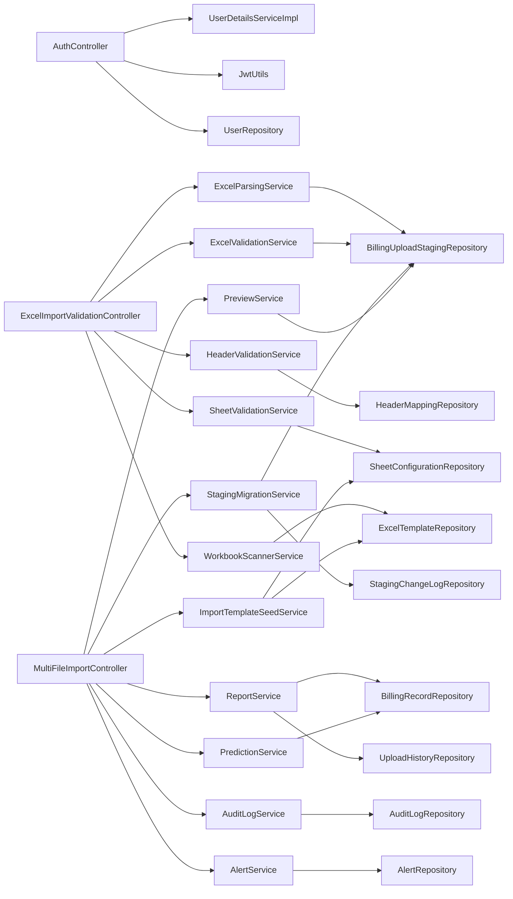

# Testing Strategy

<cite>
**Referenced Files in This Document**
- [pom.xml](file://backend/pom.xml)
- [application.properties](file://backend/src/main/resources/application.properties)
- [BillingApplication.java](file://backend/src/main/java/com/ceb/billing/BillingApplication.java)
- [AuthController.java](file://backend/src/main/java/com/ceb/billing/controllers/AuthController.java)
- [ApprovalController.java](file://backend/src/main/java/com/ceb/billing/controllers/ApprovalController.java)
- [ExcelImportValidationController.java](file://backend/src/main/java/com/ceb/billing/controllers/ExcelImportValidationController.java)
- [MultiFileImportController.java](file://backend/src/main/java/com/ceb/billing/controllers/MultiFileImportController.java)
- [WebSecurityConfig.java](file://backend/src/main/java/com/ceb/billing/config/WebSecurityConfig.java)
- [AuthTokenFilter.java](file://backend/src/main/java/com/ceb/billing/config/AuthTokenFilter.java)
- [UserDetailsServiceImpl.java](file://backend/src/main/java/com/ceb/billing/config/UserDetailsServiceImpl.java)
- [JwtUtils.java](file://backend/src/main/java/com/ceb/billing/config/JwtUtils.java)
- [DatabaseSeeder.java](file://backend/src/main/java/com/ceb/billing/services/DatabaseSeeder.java)
- [ExcelParsingService.java](file://backend/src/main/java/com/ceb/billing/services/ExcelParsingService.java)
- [ExcelValidationService.java](file://backend/src/main/java/com/ceb/billing/services/ExcelValidationService.java)
- [HeaderValidationService.java](file://backend/src/main/java/com/ceb/billing/services/HeaderValidationService.java)
- [SheetValidationService.java](file://backend/src/main/java/com/ceb/billing/services/SheetValidationService.java)
- [WorkbookScannerService.java](file://backend/src/main/java/com/ceb/billing/services/WorkbookScannerService.java)
- [StagingMigrationService.java](file://backend/src/main/java/com/ceb/billing/services/StagingMigrationService.java)
- [PreviewService.java](file://backend/src/main/java/com/ceb/billing/services/PreviewService.java)
- [ReportService.java](file://backend/src/main/java/com/ceb/billing/services/ReportService.java)
- [PredictionService.java](file://backend/src/main/java/com/ceb/billing/services/PredictionService.java)
- [AuditLogService.java](file://backend/src/main/java/com/ceb/billing/services/AuditLogService.java)
- [AlertService.java](file://backend/src/main/java/com/ceb/billing/services/AlertService.java)
- [ImportTemplateSeedService.java](file://backend/src/main/java/com/ceb/billing/services/ImportTemplateSeedService.java)
- [UserRepository.java](file://backend/src/main/java/com/ceb/billing/repositories/UserRepository.java)
- [ApprovalRequestRepository.java](file://backend/src/main/java/com/ceb/billing/repositories/ApprovalRequestRepository.java)
- [BillingRecordRepository.java](file://backend/src/main/java/com/ceb/billing/repositories/BillingRecordRepository.java)
- [BillingUploadStagingRepository.java](file://backend/src/main/java/com/ceb/billing/repositories/BillingUploadStagingRepository.java)
- [CustomerRepository.java](file://backend/src/main/java/com/ceb/billing/repositories/CustomerRepository.java)
- [CostCodeRepository.java](file://backend/src/main/java/com/ceb/billing/repositories/CostCodeRepository.java)
- [ExpenseCodeRepository.java](file://backend/src/main/java/com/ceb/billing/repositories/ExpenseCodeRepository.java)
- [NetTypeRepository.java](file://backend/src/main/java/com/ceb/billing/repositories/NetTypeRepository.java)
- [UploadHistoryRepository.java](file://backend/src/main/java/com/ceb/billing/repositories/UploadHistoryRepository.java)
- [ImportBatchRepository.java](file://backend/src/main/java/com/ceb/billing/repositories/ImportBatchRepository.java)
- [ImportSessionRepository.java](file://backend/src/main/java/com/ceb/billing/repositories/ImportSessionRepository.java)
- [ImportAuditLogRepository.java](file://backend/src/main/java/com/ceb/billing/repositories/ImportAuditLogRepository.java)
- [StagingChangeLogRepository.java](file://backend/src/main/java/com/ceb/billing/repositories/StagingChangeLogRepository.java)
- [HeaderMappingRepository.java](file://backend/src/main/java/com/ceb/billing/repositories/HeaderMappingRepository.java)
- [ExcelTemplateRepository.java](file://backend/src/main/java/com/ceb/billing/repositories/ExcelTemplateRepository.java)
- [SheetConfigurationRepository.java](file://backend/src/main/java/com/ceb/billing/repositories/SheetConfigurationRepository.java)
- [AlertRepository.java](file://backend/src/main/java/com/ceb/billing/repositories/AlertRepository.java)
- [AuditLogRepository.java](file://backend/src/main/java/com/ceb/billing/repositories/AuditLogRepository.java)
- [User.java](file://backend/src/main/java/com/ceb/billing/entities/User.java)
- [ApprovalRequest.java](file://backend/src/main/java/com/ceb/billing/entities/ApprovalRequest.java)
- [BillingRecord.java](file://backend/src/main/java/com/ceb/billing/entities/BillingRecord.java)
- [BillingUploadStaging.java](file://backend/src/main/java/com/ceb/billing/entities/BillingUploadStaging.java)
- [Customer.java](file://backend/src/main/java/com/ceb/billing/entities/Customer.java)
- [CostCode.java](file://backend/src/main/java/com/ceb/billing/entities/CostCode.java)
- [ExpenseCode.java](file://backend/src/main/java/com/ceb/billing/entities/ExpenseCode.java)
- [NetType.java](file://backend/src/main/java/com/ceb/billing/entities/NetType.java)
- [UploadHistory.java](file://backend/src/main/java/com/ceb/billing/entities/UploadHistory.java)
- [ImportBatch.java](file://backend/src/main/java/com/ceb/billing/entities/ImportBatch.java)
- [ImportSession.java](file://backend/src/main/java/com/ceb/billing/entities/ImportSession.java)
- [ImportAuditLog.java](file://backend/src/main/java/com/ceb/billing/entities/ImportAuditLog.java)
- [StagingChangeLog.java](file://backend/src/main/java/com/ceb/billing/entities/StagingChangeLog.java)
- [HeaderMapping.java](file://backend/src/main/java/com/ceb/billing/entities/HeaderMapping.java)
- [ExcelTemplate.java](file://backend/src/main/java/com/ceb/billing/entities/ExcelTemplate.java)
- [SheetConfiguration.java](file://backend/src/main/java/com/ceb/billing/entities/SheetConfiguration.java)
- [Alert.java](file://backend/src/main/java/com/ceb/billing/entities/Alert.java)
- [AuditLog.java](file://backend/src/main/java/com/ceb/billing/entities/AuditLog.java)
- [InspectXls.java](file://backend/src/test/java/com/ceb/billing/InspectXls.java)
- [QueryDbDirect.java](file://backend/src/test/java/com/ceb/billing/QueryDbDirect.java)
</cite>

## Table of Contents
1. [Introduction](#introduction)
2. [Project Structure](#project-structure)
3. [Core Components](#core-components)
4. [Architecture Overview](#architecture-overview)
5. [Detailed Component Analysis](#detailed-component-analysis)
6. [Dependency Analysis](#dependency-analysis)
7. [Performance Considerations](#performance-considerations)
8. [Troubleshooting Guide](#troubleshooting-guide)
9. [Conclusion](#conclusion)
10. [Appendices](#appendices)

## Introduction
This document defines the testing strategy for the CEB Billing System, covering unit tests for service layers and utilities, integration tests for API endpoints and database interactions, and end-to-end tests for complete user workflows. It also documents test data management, mocking strategies for external dependencies, continuous integration setup, performance and security testing guidelines, and debugging techniques for complex scenarios such as Excel processing and approval workflows.

The backend is a Spring Boot application with controllers, services, repositories, entities, and configuration classes. The existing test directory contains utility scripts for inspection and direct database queries, which can be extended into formal tests.

## Project Structure
The project follows a layered architecture:
- Controllers expose REST endpoints for authentication, approvals, billing, customers, dashboards, reports, and Excel import/validation.
- Services encapsulate business logic including Excel parsing/validation, staging migration, previews, reporting, predictions, audit logging, alerts, and template seeding.
- Repositories provide data access via Spring Data JPA interfaces.
- Entities model domain objects.
- Configuration includes security (JWT), token filtering, and user details service.
- Test utilities exist under src/test/java for ad-hoc inspection and DB querying.

```mermaid
graph TB
subgraph "Controllers"
AC["AuthController"]
APC["ApprovalController"]
EIVC["ExcelImportValidationController"]
MFIC["MultiFileImportController"]
end
subgraph "Services"
EPS["ExcelParsingService"]
EVS["ExcelValidationService"]
HVS["HeaderValidationService"]
SVS["SheetValidationService"]
WSS["WorkbookScannerService"]
SMS["StagingMigrationService"]
PRV["PreviewService"]
RPT["ReportService"]
PRED["PredictionService"]
AUD["AuditLogService"]
ALR["AlertService"]
ITS["ImportTemplateSeedService"]
end
subgraph "Repositories"
UR["UserRepository"]
ARR["ApprovalRequestRepository"]
BRR["BillingRecordRepository"]
BUSR["BillingUploadStagingRepository"]
CUR["CustomerRepository"]
CCR["CostCodeRepository"]
ECR["ExpenseCodeRepository"]
NTR["NetTypeRepository"]
UHR["UploadHistoryRepository"]
IBR["ImportBatchRepository"]
ISR["ImportSessionRepository"]
IALR["ImportAuditLogRepository"]
SCLR["StagingChangeLogRepository"]
HMR["HeaderMappingRepository"]
ETR["ExcelTemplateRepository"]
SCR["SheetConfigurationRepository"]
ARL["AlertRepository"]
AULR["AuditLogRepository"]
end
subgraph "Entities"
U["User"]
AR["ApprovalRequest"]
BR["BillingRecord"]
BUS["BillingUploadStaging"]
CU["Customer"]
CC["CostCode"]
EC["ExpenseCode"]
NT["NetType"]
UH["UploadHistory"]
IB["ImportBatch"]
IS["ImportSession"]
IAL["ImportAuditLog"]
SCL["StagingChangeLog"]
HM["HeaderMapping"]
ET["ExcelTemplate"]
SC["SheetConfiguration"]
AL["Alert"]
AU["AuditLog"]
end
AC --> EPS
AC --> EVS
APC --> ARR
EIVC --> EPS
EIVC --> EVS
EIVC --> HVS
EIVC --> SVS
EIVC --> WSS
MFIC --> SMS
MFIC --> PRV
MFIC --> RPT
MFIC --> PRED
MFIC --> AUD
MFIC --> ALR
MFIC --> ITS
EPS --> BUSR
EVS --> BUSR
HVS --> HMR
SVS --> SCR
WSS --> ETR
SMS --> BUSR
SMS --> SCLR
PRV --> BUSR
RPT --> BR
RPT --> UH
PRED --> BR
AUD --> AULR
ALR --> ARL
ITS --> ETR
ITS --> SCR
UR --> U
ARR --> AR
BRR --> BR
BUSR --> BUS
CUR --> CU
CCR --> CC
ECR --> EC
NTR --> NT
UHR --> UH
IBR --> IB
ISR --> IS
IALR --> IAL
SCLR --> SCL
HMR --> HM
ETR --> ET
SCR --> SC
ARL --> AL
AULR --> AU
```

**Diagram sources**
- [AuthController.java](file://backend/src/main/java/com/ceb/billing/controllers/AuthController.java)
- [ApprovalController.java](file://backend/src/main/java/com/ceb/billing/controllers/ApprovalController.java)
- [ExcelImportValidationController.java](file://backend/src/main/java/com/ceb/billing/controllers/ExcelImportValidationController.java)
- [MultiFileImportController.java](file://backend/src/main/java/com/ceb/billing/controllers/MultiFileImportController.java)
- [ExcelParsingService.java](file://backend/src/main/java/com/ceb/billing/services/ExcelParsingService.java)
- [ExcelValidationService.java](file://backend/src/main/java/com/ceb/billing/services/ExcelValidationService.java)
- [HeaderValidationService.java](file://backend/src/main/java/com/ceb/billing/services/HeaderValidationService.java)
- [SheetValidationService.java](file://backend/src/main/java/com/ceb/billing/services/SheetValidationService.java)
- [WorkbookScannerService.java](file://backend/src/main/java/com/ceb/billing/services/WorkbookScannerService.java)
- [StagingMigrationService.java](file://backend/src/main/java/com/ceb/billing/services/StagingMigrationService.java)
- [PreviewService.java](file://backend/src/main/java/com/ceb/billing/services/PreviewService.java)
- [ReportService.java](file://backend/src/main/java/com/ceb/billing/services/ReportService.java)
- [PredictionService.java](file://backend/src/main/java/com/ceb/billing/services/PredictionService.java)
- [AuditLogService.java](file://backend/src/main/java/com/ceb/billing/services/AuditLogService.java)
- [AlertService.java](file://backend/src/main/java/com/ceb/billing/services/AlertService.java)
- [ImportTemplateSeedService.java](file://backend/src/main/java/com/ceb/billing/services/ImportTemplateSeedService.java)
- [UserRepository.java](file://backend/src/main/java/com/ceb/billing/repositories/UserRepository.java)
- [ApprovalRequestRepository.java](file://backend/src/main/java/com/ceb/billing/repositories/ApprovalRequestRepository.java)
- [BillingRecordRepository.java](file://backend/src/main/java/com/ceb/billing/repositories/BillingRecordRepository.java)
- [BillingUploadStagingRepository.java](file://backend/src/main/java/com/ceb/billing/repositories/BillingUploadStagingRepository.java)
- [CustomerRepository.java](file://backend/src/main/java/com/ceb/billing/repositories/CustomerRepository.java)
- [CostCodeRepository.java](file://backend/src/main/java/com/ceb/billing/repositories/CostCodeRepository.java)
- [ExpenseCodeRepository.java](file://backend/src/main/java/com/ceb/billing/repositories/ExpenseCodeRepository.java)
- [NetTypeRepository.java](file://backend/src/main/java/com/ceb/billing/repositories/NetTypeRepository.java)
- [UploadHistoryRepository.java](file://backend/src/main/java/com/ceb/billing/repositories/UploadHistoryRepository.java)
- [ImportBatchRepository.java](file://backend/src/main/java/com/ceb/billing/repositories/ImportBatchRepository.java)
- [ImportSessionRepository.java](file://backend/src/main/java/com/ceb/billing/repositories/ImportSessionRepository.java)
- [ImportAuditLogRepository.java](file://backend/src/main/java/com/ceb/billing/repositories/ImportAuditLogRepository.java)
- [StagingChangeLogRepository.java](file://backend/src/main/java/com/ceb/billing/repositories/StagingChangeLogRepository.java)
- [HeaderMappingRepository.java](file://backend/src/main/java/com/ceb/billing/repositories/HeaderMappingRepository.java)
- [ExcelTemplateRepository.java](file://backend/src/main/java/com/ceb/billing/repositories/ExcelTemplateRepository.java)
- [SheetConfigurationRepository.java](file://backend/src/main/java/com/ceb/billing/repositories/SheetConfigurationRepository.java)
- [AlertRepository.java](file://backend/src/main/java/com/ceb/billing/repositories/AlertRepository.java)
- [AuditLogRepository.java](file://backend/src/main/java/com/ceb/billing/repositories/AuditLogRepository.java)
- [User.java](file://backend/src/main/java/com/ceb/billing/entities/User.java)
- [ApprovalRequest.java](file://backend/src/main/java/com/ceb/billing/entities/ApprovalRequest.java)
- [BillingRecord.java](file://backend/src/main/java/com/ceb/billing/entities/BillingRecord.java)
- [BillingUploadStaging.java](file://backend/src/main/java/com/ceb/billing/entities/BillingUploadStaging.java)
- [Customer.java](file://backend/src/main/java/com/ceb/billing/entities/Customer.java)
- [CostCode.java](file://backend/src/main/java/com/ceb/billing/entities/CostCode.java)
- [ExpenseCode.java](file://backend/src/main/java/com/ceb/billing/entities/ExpenseCode.java)
- [NetType.java](file://backend/src/main/java/com/ceb/billing/entities/NetType.java)
- [UploadHistory.java](file://backend/src/main/java/com/ceb/billing/entities/UploadHistory.java)
- [ImportBatch.java](file://backend/src/main/java/com/ceb/billing/entities/ImportBatch.java)
- [ImportSession.java](file://backend/src/main/java/com/ceb/billing/entities/ImportSession.java)
- [ImportAuditLog.java](file://backend/src/main/java/com/ceb/billing/entities/ImportAuditLog.java)
- [StagingChangeLog.java](file://backend/src/main/java/com/ceb/billing/entities/StagingChangeLog.java)
- [HeaderMapping.java](file://backend/src/main/java/com/ceb/billing/entities/HeaderMapping.java)
- [ExcelTemplate.java](file://backend/src/main/java/com/ceb/billing/entities/ExcelTemplate.java)
- [SheetConfiguration.java](file://backend/src/main/java/com/ceb/billing/entities/SheetConfiguration.java)
- [Alert.java](file://backend/src/main/java/com/ceb/billing/entities/Alert.java)
- [AuditLog.java](file://backend/src/main/java/com/ceb/billing/entities/AuditLog.java)

**Section sources**
- [BillingApplication.java](file://backend/src/main/java/com/ceb/billing/BillingApplication.java)
- [application.properties](file://backend/src/main/resources/application.properties)

## Core Components
This section outlines the primary components that require testing coverage across unit, integration, and end-to-end levels.

- Authentication and Security
  - JWT-based authentication flow using filters and user details service.
  - Endpoints for login and protected resource access.
  - Security configuration and entry point handlers.

- Approval Workflow
  - Controllers and services managing approval requests and state transitions.
  - Repository-backed persistence of approval records.

- Excel Import and Validation
  - Controllers for single/multi-file imports and validation.
  - Services for parsing, header validation, sheet validation, workbook scanning, staging migration, preview, and auditing.
  - Templates and configurations stored via repositories.

- Reporting and Predictions
  - Services aggregating billing records and upload history for reports.
  - Prediction service interacting with billing data.

- Audit and Alerts
  - Audit logging and alerting services backed by repositories.

- Database Seeding and Utilities
  - Seeder for initial data.
  - Utility scripts for inspection and direct DB queries.

**Section sources**
- [WebSecurityConfig.java](file://backend/src/main/java/com/ceb/billing/config/WebSecurityConfig.java)
- [AuthTokenFilter.java](file://backend/src/main/java/com/ceb/billing/config/AuthTokenFilter.java)
- [UserDetailsServiceImpl.java](file://backend/src/main/java/com/ceb/billing/config/UserDetailsServiceImpl.java)
- [JwtUtils.java](file://backend/src/main/java/com/ceb/billing/config/JwtUtils.java)
- [AuthController.java](file://backend/src/main/java/com/ceb/billing/controllers/AuthController.java)
- [ApprovalController.java](file://backend/src/main/java/com/ceb/billing/controllers/ApprovalController.java)
- [ExcelImportValidationController.java](file://backend/src/main/java/com/ceb/billing/controllers/ExcelImportValidationController.java)
- [MultiFileImportController.java](file://backend/src/main/java/com/ceb/billing/controllers/MultiFileImportController.java)
- [ExcelParsingService.java](file://backend/src/main/java/com/ceb/billing/services/ExcelParsingService.java)
- [ExcelValidationService.java](file://backend/src/main/java/com/ceb/billing/services/ExcelValidationService.java)
- [HeaderValidationService.java](file://backend/src/main/java/com/ceb/billing/services/HeaderValidationService.java)
- [SheetValidationService.java](file://backend/src/main/java/com/ceb/billing/services/SheetValidationService.java)
- [WorkbookScannerService.java](file://backend/src/main/java/com/ceb/billing/services/WorkbookScannerService.java)
- [StagingMigrationService.java](file://backend/src/main/java/com/ceb/billing/services/StagingMigrationService.java)
- [PreviewService.java](file://backend/src/main/java/com/ceb/billing/services/PreviewService.java)
- [ReportService.java](file://backend/src/main/java/com/ceb/billing/services/ReportService.java)
- [PredictionService.java](file://backend/src/main/java/com/ceb/billing/services/PredictionService.java)
- [AuditLogService.java](file://backend/src/main/java/com/ceb/billing/services/AuditLogService.java)
- [AlertService.java](file://backend/src/main/java/com/ceb/billing/services/AlertService.java)
- [ImportTemplateSeedService.java](file://backend/src/main/java/com/ceb/billing/services/ImportTemplateSeedService.java)
- [DatabaseSeeder.java](file://backend/src/main/java/com/ceb/billing/services/DatabaseSeeder.java)
- [InspectXls.java](file://backend/src/test/java/com/ceb/billing/InspectXls.java)
- [QueryDbDirect.java](file://backend/src/test/java/com/ceb/billing/QueryDbDirect.java)

## Architecture Overview
The system uses a layered approach with clear separation between presentation (controllers), business logic (services), and data access (repositories). Security is enforced at the controller layer via JWT filters and user details service.

**Diagram sources**
- [AuthController.java](file://backend/src/main/java/com/ceb/billing/controllers/AuthController.java)
- [WebSecurityConfig.java](file://backend/src/main/java/com/ceb/billing/config/WebSecurityConfig.java)
- [AuthTokenFilter.java](file://backend/src/main/java/com/ceb/billing/config/AuthTokenFilter.java)
- [UserDetailsServiceImpl.java](file://backend/src/main/java/com/ceb/billing/config/UserDetailsServiceImpl.java)
- [JwtUtils.java](file://backend/src/main/java/com/ceb/billing/config/JwtUtils.java)
- [UserRepository.java](file://backend/src/main/java/com/ceb/billing/repositories/UserRepository.java)

## Detailed Component Analysis

### Unit Testing Strategy for Service Layers and Utilities
- Scope
  - Validate core business logic in services without starting the full application context.
  - Focus on deterministic behavior, input/output transformations, and error handling paths.
- Recommended Approach
  - Use a unit testing framework (e.g., JUnit) with a mocking library (e.g., Mockito) to isolate services from repositories and external systems.
  - For services that depend on other services, mock collaborators and assert method calls and return values.
- Key Areas
  - Excel parsing and validation services: validate row/column mapping, header checks, sheet constraints, and error aggregation.
  - Staging migration service: verify transformation rules and batch operations.
  - Preview and report services: ensure correct aggregation and formatting.
  - Audit and alert services: confirm log entries and alert creation conditions.
- Example Patterns
  - Arrange: create mock repositories and services; inject into service under test.
  - Act: invoke service methods with representative inputs.
  - Assert: verify outputs, repository interactions, and exception cases.

**Section sources**
- [ExcelParsingService.java](file://backend/src/main/java/com/ceb/billing/services/ExcelParsingService.java)
- [ExcelValidationService.java](file://backend/src/main/java/com/ceb/billing/services/ExcelValidationService.java)
- [HeaderValidationService.java](file://backend/src/main/java/com/ceb/billing/services/HeaderValidationService.java)
- [SheetValidationService.java](file://backend/src/main/java/com/ceb/billing/services/SheetValidationService.java)
- [WorkbookScannerService.java](file://backend/src/main/java/com/ceb/billing/services/WorkbookScannerService.java)
- [StagingMigrationService.java](file://backend/src/main/java/com/ceb/billing/services/StagingMigrationService.java)
- [PreviewService.java](file://backend/src/main/java/com/ceb/billing/services/PreviewService.java)
- [ReportService.java](file://backend/src/main/java/com/ceb/billing/services/ReportService.java)
- [PredictionService.java](file://backend/src/main/java/com/ceb/billing/services/PredictionService.java)
- [AuditLogService.java](file://backend/src/main/java/com/ceb/billing/services/AuditLogService.java)
- [AlertService.java](file://backend/src/main/java/com/ceb/billing/services/AlertService.java)
- [ImportTemplateSeedService.java](file://backend/src/main/java/com/ceb/billing/services/ImportTemplateSeedService.java)

### Integration Testing Strategy for API Endpoints and Database Interactions
- Scope
  - Validate controller endpoints with real or embedded database and repository implementations.
  - Ensure transactional boundaries, data consistency, and security middleware behavior.
- Recommended Approach
  - Use an integration testing framework (e.g., Spring Boot Test) to start a minimal application context.
  - Configure an in-memory database or testcontainers for realistic SQL execution.
  - Seed test data before each test and clean up after.
- Key Areas
  - Authentication endpoint: login flow and token issuance.
  - Protected endpoints: verify authorization via JWT filter and user details service.
  - Excel import endpoints: file upload, validation, staging writes, and preview retrieval.
  - Approval workflow endpoints: create, update, and query approval requests.
- Example Patterns
  - @SpringBootTest with WebMvcTest or MockMvc for HTTP-level assertions.
  - @DataJpaTest for repository-focused integration tests.
  - @Transactional test methods with rollback to maintain isolation.

**Diagram sources**
- [ExcelImportValidationController.java](file://backend/src/main/java/com/ceb/billing/controllers/ExcelImportValidationController.java)
- [ExcelParsingService.java](file://backend/src/main/java/com/ceb/billing/services/ExcelParsingService.java)
- [BillingUploadStagingRepository.java](file://backend/src/main/java/com/ceb/billing/repositories/BillingUploadStagingRepository.java)

**Section sources**
- [application.properties](file://backend/src/main/resources/application.properties)
- [ExcelImportValidationController.java](file://backend/src/main/java/com/ceb/billing/controllers/ExcelImportValidationController.java)
- [MultiFileImportController.java](file://backend/src/main/java/com/ceb/billing/controllers/MultiFileImportController.java)
- [AuthController.java](file://backend/src/main/java/com/ceb/billing/controllers/AuthController.java)
- [ApprovalController.java](file://backend/src/main/java/com/ceb/billing/controllers/ApprovalController.java)
- [BillingUploadStagingRepository.java](file://backend/src/main/java/com/ceb/billing/repositories/BillingUploadStagingRepository.java)

### End-to-End Testing for Complete User Workflows
- Scope
  - Simulate real user journeys across multiple endpoints and states.
  - Cover authentication, file uploads, validation feedback, staging review, approvals, and reporting.
- Recommended Approach
  - Use a browser automation tool (e.g., Selenium or Playwright) for frontend flows if applicable.
  - Alternatively, orchestrate HTTP client tests that exercise the full stack, including security and database.
- Key Journeys
  - Login and navigate to upload page; submit Excel; view validation errors; fix and re-upload.
  - Review staging changes; approve or reject; observe audit logs and alerts.
  - Generate reports and verify predictions based on uploaded data.
- Example Patterns
  - Setup: seed templates, users, and sample workbooks.
  - Execute: perform multi-step actions and capture responses.
  - Verify: assert UI elements, persisted data, and side effects (audit/alerts).

[No sources needed since this section provides general guidance]

### Test Data Management
- Strategies
  - Use JSON fixtures or CSV files for small datasets.
  - Use SQL scripts or JPA repositories to seed structured data.
  - Leverage DatabaseSeeder for consistent baseline data.
- Lifecycle
  - Create data before tests; reset or roll back after tests.
  - Use unique identifiers per test run to avoid collisions.
- Excel Workbooks
  - Maintain a suite of valid and invalid Excel templates and sheets to cover edge cases.
  - Store workbooks in resources and reference them in tests.

**Section sources**
- [DatabaseSeeder.java](file://backend/src/main/java/com/ceb/billing/services/DatabaseSeeder.java)
- [ImportTemplateSeedService.java](file://backend/src/main/java/com/ceb/billing/services/ImportTemplateSeedService.java)
- [ExcelTemplateRepository.java](file://backend/src/main/java/com/ceb/billing/repositories/ExcelTemplateRepository.java)
- [SheetConfigurationRepository.java](file://backend/src/main/java/com/ceb/billing/repositories/SheetConfigurationRepository.java)

### Mocking Strategies for External Dependencies
- Approaches
  - Mock repositories to isolate service logic and control data returns.
  - Mock external APIs or file systems where applicable.
  - Stub time-dependent behavior for predictable outcomes.
- Best Practices
  - Keep mocks minimal and focused on behavior relevant to the test.
  - Verify interaction counts and argument matchers for robustness.
  - Avoid over-mocking; prefer integration tests for critical paths.

**Section sources**
- [ExcelParsingService.java](file://backend/src/main/java/com/ceb/billing/services/ExcelParsingService.java)
- [ExcelValidationService.java](file://backend/src/main/java/com/ceb/billing/services/ExcelValidationService.java)
- [StagingMigrationService.java](file://backend/src/main/java/com/ceb/billing/services/StagingMigrationService.java)
- [PreviewService.java](file://backend/src/main/java/com/ceb/billing/services/PreviewService.java)
- [ReportService.java](file://backend/src/main/java/com/ceb/billing/services/ReportService.java)
- [PredictionService.java](file://backend/src/main/java/com/ceb/billing/services/PredictionService.java)
- [AuditLogService.java](file://backend/src/main/java/com/ceb/billing/services/AuditLogService.java)
- [AlertService.java](file://backend/src/main/java/com/ceb/billing/services/AlertService.java)

### Continuous Integration Setup
- Pipeline Stages
  - Build: compile and package the application.
  - Unit Tests: execute fast, isolated tests.
  - Integration Tests: run against embedded or containerized databases.
  - Security Scans: static analysis and dependency vulnerability checks.
  - Artifact Publishing: publish build artifacts upon success.
- Configuration
  - Define environment variables for test profiles and database connections.
  - Cache dependencies to speed up builds.
  - Parallelize independent test suites.

**Section sources**
- [pom.xml](file://backend/pom.xml)

### Performance Testing Guidelines
- Objectives
  - Measure throughput and latency for Excel uploads, validations, and report generation.
  - Identify bottlenecks in parsing, validation, and database writes.
- Tools and Techniques
  - Use load testing tools (e.g., JMeter or Gatling) to simulate concurrent uploads.
  - Profile CPU and memory usage during large workbook processing.
  - Monitor database query performance and connection pool utilization.
- Metrics
  - Response times for key endpoints.
  - Error rates under load.
  - Resource consumption trends.

[No sources needed since this section provides general guidance]

### Security Testing Procedures
- Objectives
  - Validate authentication and authorization controls.
  - Ensure JWT handling is secure and tokens are validated correctly.
- Procedures
  - Test login endpoint with valid and invalid credentials.
  - Attempt unauthorized access to protected endpoints.
  - Inspect token claims and expiration handling.
  - Verify CORS and CSRF protections if applicable.
- Tools
  - OWASP ZAP for dynamic security scanning.
  - Manual penetration testing for critical flows.

**Section sources**
- [WebSecurityConfig.java](file://backend/src/main/java/com/ceb/billing/config/WebSecurityConfig.java)
- [AuthTokenFilter.java](file://backend/src/main/java/com/ceb/billing/config/AuthTokenFilter.java)
- [UserDetailsServiceImpl.java](file://backend/src/main/java/com/ceb/billing/config/UserDetailsServiceImpl.java)
- [JwtUtils.java](file://backend/src/main/java/com/ceb/billing/config/JwtUtils.java)
- [AuthController.java](file://backend/src/main/java/com/ceb/billing/controllers/AuthController.java)

### Debugging Techniques for Complex Scenarios
- Excel Processing
  - Use inspection utilities to analyze workbook structure and headers.
  - Log intermediate parsing steps and validation failures.
  - Isolate problematic sheets or rows using targeted tests.
- Approval Workflows
  - Trace state transitions and audit logs.
  - Verify permissions and role-based access.
  - Reproduce issues with minimal datasets.
- Database Interactions
  - Use direct query utilities to inspect persisted data.
  - Enable SQL logging and examine generated statements.
  - Validate transaction boundaries and rollback behavior.

**Section sources**
- [InspectXls.java](file://backend/src/test/java/com/ceb/billing/InspectXls.java)
- [QueryDbDirect.java](file://backend/src/test/java/com/ceb/billing/QueryDbDirect.java)
- [ExcelParsingService.java](file://backend/src/main/java/com/ceb/billing/services/ExcelParsingService.java)
- [ExcelValidationService.java](file://backend/src/main/java/com/ceb/billing/services/ExcelValidationService.java)
- [ApprovalController.java](file://backend/src/main/java/com/ceb/billing/controllers/ApprovalController.java)
- [AuditLogService.java](file://backend/src/main/java/com/ceb/billing/services/AuditLogService.java)

## Dependency Analysis
This diagram highlights key dependencies among controllers, services, and repositories involved in testing-critical flows.

**Diagram sources**
- [AuthController.java](file://backend/src/main/java/com/ceb/billing/controllers/AuthController.java)
- [ExcelImportValidationController.java](file://backend/src/main/java/com/ceb/billing/controllers/ExcelImportValidationController.java)
- [MultiFileImportController.java](file://backend/src/main/java/com/ceb/billing/controllers/MultiFileImportController.java)
- [UserDetailsServiceImpl.java](file://backend/src/main/java/com/ceb/billing/config/UserDetailsServiceImpl.java)
- [JwtUtils.java](file://backend/src/main/java/com/ceb/billing/config/JwtUtils.java)
- [UserRepository.java](file://backend/src/main/java/com/ceb/billing/repositories/UserRepository.java)
- [ExcelParsingService.java](file://backend/src/main/java/com/ceb/billing/services/ExcelParsingService.java)
- [ExcelValidationService.java](file://backend/src/main/java/com/ceb/billing/services/ExcelValidationService.java)
- [HeaderValidationService.java](file://backend/src/main/java/com/ceb/billing/services/HeaderValidationService.java)
- [SheetValidationService.java](file://backend/src/main/java/com/ceb/billing/services/SheetValidationService.java)
- [WorkbookScannerService.java](file://backend/src/main/java/com/ceb/billing/services/WorkbookScannerService.java)
- [StagingMigrationService.java](file://backend/src/main/java/com/ceb/billing/services/StagingMigrationService.java)
- [PreviewService.java](file://backend/src/main/java/com/ceb/billing/services/PreviewService.java)
- [ReportService.java](file://backend/src/main/java/com/ceb/billing/services/ReportService.java)
- [PredictionService.java](file://backend/src/main/java/com/ceb/billing/services/PredictionService.java)
- [AuditLogService.java](file://backend/src/main/java/com/ceb/billing/services/AuditLogService.java)
- [AlertService.java](file://backend/src/main/java/com/ceb/billing/services/AlertService.java)
- [ImportTemplateSeedService.java](file://backend/src/main/java/com/ceb/billing/services/ImportTemplateSeedService.java)
- [BillingUploadStagingRepository.java](file://backend/src/main/java/com/ceb/billing/repositories/BillingUploadStagingRepository.java)
- [HeaderMappingRepository.java](file://backend/src/main/java/com/ceb/billing/repositories/HeaderMappingRepository.java)
- [SheetConfigurationRepository.java](file://backend/src/main/java/com/ceb/billing/repositories/SheetConfigurationRepository.java)
- [ExcelTemplateRepository.java](file://backend/src/main/java/com/ceb/billing/repositories/ExcelTemplateRepository.java)
- [StagingChangeLogRepository.java](file://backend/src/main/java/com/ceb/billing/repositories/StagingChangeLogRepository.java)
- [BillingRecordRepository.java](file://backend/src/main/java/com/ceb/billing/repositories/BillingRecordRepository.java)
- [UploadHistoryRepository.java](file://backend/src/main/java/com/ceb/billing/repositories/UploadHistoryRepository.java)
- [AuditLogRepository.java](file://backend/src/main/java/com/ceb/billing/repositories/AuditLogRepository.java)
- [AlertRepository.java](file://backend/src/main/java/com/ceb/billing/repositories/AlertRepository.java)

**Section sources**
- [pom.xml](file://backend/pom.xml)

## Performance Considerations
- Optimize Excel parsing by streaming large files and avoiding unnecessary object allocations.
- Batch database writes for staging migrations to reduce round trips.
- Index frequently queried columns in repositories to improve lookup performance.
- Monitor memory usage during workbook scanning and adjust JVM settings accordingly.

[No sources needed since this section provides general guidance]

## Troubleshooting Guide
- Common Issues
  - Authentication failures due to misconfigured JWT secrets or expired tokens.
  - Excel validation errors caused by mismatched headers or sheet configurations.
  - Approval workflow deadlocks from inconsistent state updates.
- Debugging Steps
  - Inspect logs around token validation and user loading.
  - Validate Excel templates and mappings using inspection utilities.
  - Query staging tables directly to verify persisted data integrity.
- Recovery Actions
  - Reset test data using seeders.
  - Re-run failed tests with increased logging verbosity.
  - Isolate failing components and reproduce with minimal inputs.

**Section sources**
- [WebSecurityConfig.java](file://backend/src/main/java/com/ceb/billing/config/WebSecurityConfig.java)
- [AuthTokenFilter.java](file://backend/src/main/java/com/ceb/billing/config/AuthTokenFilter.java)
- [JwtUtils.java](file://backend/src/main/java/com/ceb/billing/config/JwtUtils.java)
- [ExcelImportValidationController.java](file://backend/src/main/java/com/ceb/billing/controllers/ExcelImportValidationController.java)
- [ExcelValidationService.java](file://backend/src/main/java/com/ceb/billing/services/ExcelValidationService.java)
- [ApprovalController.java](file://backend/src/main/java/com/ceb/billing/controllers/ApprovalController.java)
- [InspectXls.java](file://backend/src/test/java/com/ceb/billing/InspectXls.java)
- [QueryDbDirect.java](file://backend/src/test/java/com/ceb/billing/QueryDbDirect.java)

## Conclusion
A comprehensive testing strategy for the CEB Billing System should combine unit, integration, and end-to-end tests, supported by robust test data management and effective mocking. Continuous integration ensures quality gates, while performance and security testing safeguard reliability and safety. Focused debugging techniques help resolve complex scenarios like Excel processing and approval workflows efficiently.

[No sources needed since this section summarizes without analyzing specific files]

## Appendices
- Appendix A: Test Profiles and Environment Variables
  - Define separate profiles for unit, integration, and e2e tests.
  - Configure database URLs, credentials, and feature flags per profile.
- Appendix B: Sample Test Suites
  - Unit tests for services under com.ceb.billing.services.
  - Integration tests for controllers under com.ceb.billing.controllers.
  - E2E tests orchestrating full user journeys.

[No sources needed since this section provides general guidance]