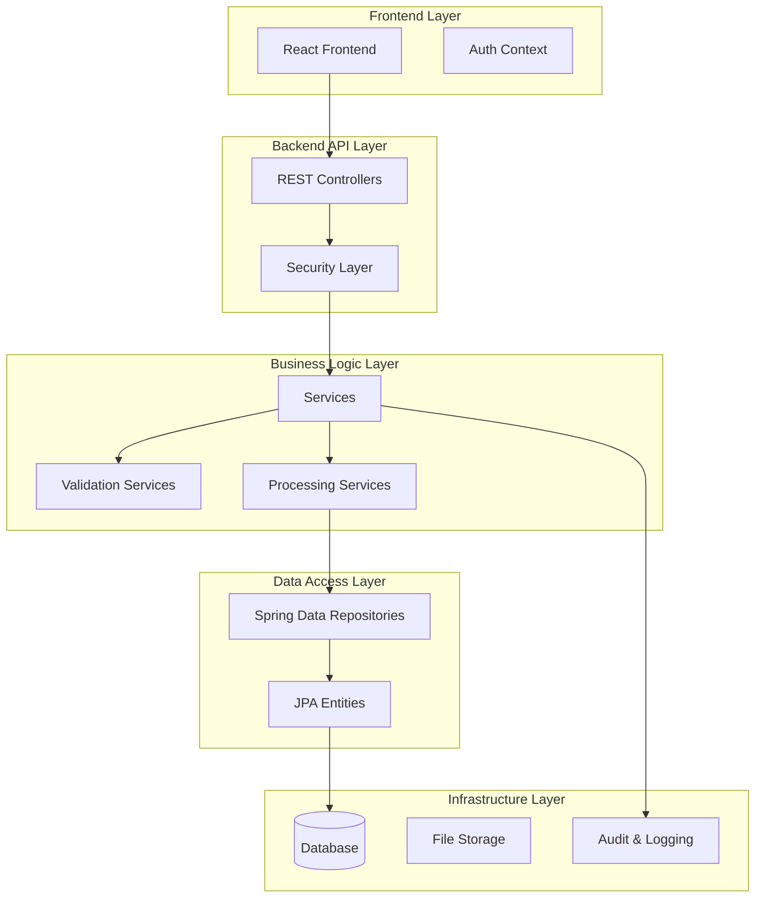

# Troubleshooting and FAQ

<cite>
**Referenced Files in This Document**
- [BillingApplication.java](file://backend/src/main/java/com/ceb/billing/BillingApplication.java)
- [application.properties](file://backend/src/main/resources/application.properties)
- [schema.sql](file://schema.sql)
- [pom.xml](file://backend/pom.xml)
- [WebSecurityConfig.java](file://backend/src/main/java/com/ceb/billing/config/WebSecurityConfig.java)
- [DatabaseInitializer.java](file://backend/src/main/java/com/ceb/billing/config/DatabaseInitializer.java)
- [ExcelImportValidationController.java](file://backend/src/main/java/com/ceb/billing/controllers/ExcelImportValidationController.java)
- [MultiFileImportController.java](file://backend/src/main/java/com/ceb/billing/controllers/MultiFileImportController.java)
- [ExcelParsingService.java](file://backend/src/main/java/com/ceb/billing/services/ExcelParsingService.java)
- [ExcelValidationService.java](file://backend/src/main/java/com/ceb/billing/services/ExcelValidationService.java)
- [HeaderValidationService.java](file://backend/src/main/java/com/ceb/billing/services/HeaderValidationService.java)
- [SheetValidationService.java](file://backend/src/main/java/com/ceb/billing/services/SheetValidationService.java)
- [WorkbookScannerService.java](file://backend/src/main/java/com/ceb/billing/services/WorkbookScannerService.java)
- [AlertController.java](file://backend/src/main/java/com/ceb/billing/controllers/AlertController.java)
- [AuditLogService.java](file://backend/src/main/java/com/ceb/billing/services/AuditLogService.java)
- [ImportBatch.java](file://backend/src/main/java/com/ceb/billing/entities/ImportBatch.java)
- [ImportSession.java](file://backend/src/main/java/com/ceb/billing/entities/ImportSession.java)
- [StagingChangeLog.java](file://backend/src/main/java/com/ceb/billing/entities/StagingChangeLog.java)
</cite>

## Table of Contents
1. [Introduction](#introduction)
2. [System Overview](#system-overview)
3. [Installation and Configuration Issues](#installation-and-configuration-issues)
4. [Database Connection Problems](#database-connection-problems)
5. [Excel Import Errors](#excel-import-errors)
6. [Performance Bottlenecks](#performance-bottlenecks)
7. [Debugging Techniques](#debugging-techniques)
8. [Log Analysis Procedures](#log-analysis-procedures)
9. [Diagnostic Tools Usage](#diagnostic-tools-usage)
10. [Frequently Asked Questions](#frequently-asked-questions)
11. [System Monitoring and Alerting](#system-monitoring-and-alerting)
12. [Proactive Issue Detection](#proactive-issue-detection)
13. [Conclusion](#conclusion)

## Introduction

This troubleshooting guide provides comprehensive support for the CEB Billing System, addressing common installation issues, configuration problems, database connectivity challenges, Excel import errors, and performance optimization strategies. The system is built using Spring Boot with Java, featuring Excel file processing capabilities, user authentication, and comprehensive audit logging.

The CEB Billing System handles billing data management through Excel file imports, validation processes, and automated workflows. This document serves as both a quick reference for common issues and an in-depth guide for complex troubleshooting scenarios.

## System Overview

The CEB Billing System follows a layered architecture with clear separation of concerns:

**Diagram sources**
- [BillingApplication.java](file://backend/src/main/java/com/ceb/billing/BillingApplication.java)
- [WebSecurityConfig.java](file://backend/src/main/java/com/ceb/billing/config/WebSecurityConfig.java)

## Installation and Configuration Issues

### Common Installation Problems

#### Java Environment Issues
- **Java Version Compatibility**: Ensure Java 17 or higher is installed
- **Maven Configuration**: Verify Maven wrapper is properly configured
- **Port Conflicts**: Check if port 8080 is available or configure alternative ports

#### Application Startup Failures
- **Missing Dependencies**: Validate all required JAR files are present
- **Configuration File Issues**: Ensure `application.properties` exists and is properly formatted
- **Database Schema**: Run initial schema setup before first startup

#### Configuration File Problems
- **Property Syntax**: Check for proper key-value formatting
- **Environment Variables**: Verify environment-specific configurations
- **File Permissions**: Ensure application has read access to configuration files

**Section sources**
- [BillingApplication.java](file://backend/src/main/java/com/ceb/billing/BillingApplication.java)
- [application.properties](file://backend/src/main/resources/application.properties)

## Database Connection Problems

### Connection Configuration Issues

#### JDBC Connection String Problems
- **URL Format**: Verify correct JDBC URL format for your database type
- **Authentication**: Check username and password credentials
- **Network Connectivity**: Ensure database server is reachable from application host

#### Database Schema Initialization
- **Schema Migration**: Run `schema.sql` script before application startup
- **Table Existence**: Verify all required tables are created
- **Foreign Key Constraints**: Check referential integrity constraints

#### Connection Pool Configuration
- **Pool Size**: Adjust maximum connections based on expected load
- **Timeout Settings**: Configure appropriate connection timeouts
- **Connection Validation**: Enable connection testing and validation

### Database Error Resolution

#### Connection Timeout Errors
- Increase connection timeout values in configuration
- Check network latency between application and database servers
- Monitor database server resource utilization

#### Authentication Failures
- Verify database user permissions and privileges
- Check password expiration policies
- Validate SSL/TLS certificate configurations if enabled

**Section sources**
- [DatabaseInitializer.java](file://backend/src/main/java/com/ceb/billing/config/DatabaseInitializer.java)
- [schema.sql](file://schema.sql)

## Excel Import Errors

### File Upload Issues

#### File Format Problems
- **Unsupported Formats**: Ensure files are in .xlsx or .xls format
- **File Corruption**: Validate Excel file integrity before upload
- **Size Limits**: Check maximum file size restrictions in configuration

#### Header Mapping Errors
- **Column Headers**: Verify column headers match expected template
- **Header Order**: Check if header order affects processing
- **Special Characters**: Handle special characters in header names

#### Data Validation Failures
- **Data Types**: Ensure data types match expected formats
- **Required Fields**: Verify all mandatory fields are populated
- **Range Validation**: Check numeric ranges and date formats

### Import Processing Errors

#### Memory Issues During Import
- **Large Files**: Implement chunked processing for large Excel files
- **Memory Allocation**: Adjust JVM heap size for large imports
- **Garbage Collection**: Monitor GC activity during bulk operations

#### Performance Bottlenecks
- **Database Writes**: Use batch processing for database inserts
- **Transaction Management**: Optimize transaction boundaries
- **Index Optimization**: Ensure proper database indexing for import operations

**Section sources**
- [ExcelImportValidationController.java](file://backend/src/main/java/com/ceb/billing/controllers/ExcelImportValidationController.java)
- [MultiFileImportController.java](file://backend/src/main/java/com/ceb/billing/controllers/MultiFileImportController.java)
- [ExcelParsingService.java](file://backend/src/main/java/com/ceb/billing/services/ExcelParsingService.java)
- [ExcelValidationService.java](file://backend/src/main/java/com/ceb/billing/services/ExcelValidationService.java)
- [HeaderValidationService.java](file://backend/src/main/java/com/ceb/billing/services/HeaderValidationService.java)
- [SheetValidationService.java](file://backend/src/main/java/com/ceb/billing/services/SheetValidationService.java)
- [WorkbookScannerService.java](file://backend/src/main/java/com/ceb/billing/services/WorkbookScannerService.java)

## Performance Bottlenecks

### Application Performance Issues

#### Memory Management
- **Heap Space**: Monitor JVM heap usage and adjust `-Xmx` parameters
- **Object Leaks**: Identify and fix memory leaks in long-running processes
- **Cache Configuration**: Optimize cache sizes and eviction policies

#### Database Performance
- **Query Optimization**: Analyze slow queries and add appropriate indexes
- **Connection Pool**: Tune connection pool settings for optimal throughput
- **Transaction Boundaries**: Minimize transaction scope to reduce lock contention

#### File Processing Optimization
- **Streaming Processing**: Process large files using streaming APIs
- **Parallel Processing**: Implement parallel processing where safe
- **Resource Cleanup**: Ensure proper cleanup of temporary files and resources

### Monitoring Performance Metrics

#### Key Performance Indicators (KPIs)
- Response time percentiles (P50, P95, P99)
- Throughput measurements (requests per second)
- Error rates and failure patterns
- Resource utilization (CPU, memory, disk I/O)

#### Profiling Tools
- **JProfiler**: For detailed JVM profiling
- **VisualVM**: For runtime monitoring and analysis
- **Micrometer**: For application metrics collection

**Section sources**
- [AuditLogService.java](file://backend/src/main/java/com/ceb/billing/services/AuditLogService.java)
- [ImportBatch.java](file://backend/src/main/java/com/ceb/billing/entities/ImportBatch.java)
- [ImportSession.java](file://backend/src/main/java/com/ceb/billing/entities/ImportSession.java)

## Debugging Techniques

### Application-Level Debugging

#### Logging Configuration
- **Log Levels**: Configure appropriate log levels for different environments
- **Structured Logging**: Use structured logging formats for better analysis
- **Correlation IDs**: Implement request correlation for distributed tracing

#### Exception Handling
- **Custom Exceptions**: Create domain-specific exception classes
- **Error Context**: Include relevant context in error messages
- **Stack Trace Analysis**: Properly capture and analyze stack traces

#### Breakpoint Debugging
- **IDE Configuration**: Set up remote debugging for production-like environments
- **Conditional Breakpoints**: Use conditional breakpoints for specific scenarios
- **Variable Inspection**: Inspect object states at critical points

### Database Debugging

#### Query Analysis
- **Slow Query Log**: Enable and analyze slow query logs
- **Execution Plans**: Review query execution plans for optimization opportunities
- **Lock Contention**: Monitor for deadlocks and lock waits

#### Connection Monitoring
- **Active Connections**: Track active database connections
- **Connection Leaks**: Identify connections not being properly closed
- **Pool Exhaustion**: Monitor connection pool utilization

**Section sources**
- [StagingChangeLog.java](file://backend/src/main/java/com/ceb/billing/entities/StagingChangeLog.java)
- [AlertController.java](file://backend/src/main/java/com/ceb/billing/controllers/AlertController.java)

## Log Analysis Procedures

### Log Structure and Organization

#### Log Categories
- **Application Logs**: Core business logic and workflow events
- **Security Logs**: Authentication and authorization events
- **Audit Logs**: Data modification tracking and compliance records
- **Performance Logs**: System performance and resource utilization metrics

#### Log Level Strategy
- **ERROR**: Critical failures requiring immediate attention
- **WARN**: Potential issues that may impact functionality
- **INFO**: Normal operational events and state changes
- **DEBUG**: Detailed diagnostic information for troubleshooting
- **TRACE**: Fine-grained debugging information

### Log Analysis Tools

#### Centralized Logging
- **ELK Stack**: Elasticsearch, Logstash, Kibana for log aggregation and visualization
- **Splunk**: Enterprise log management and analysis platform
- **Cloud Logging**: Cloud-native logging solutions (AWS CloudWatch, Azure Monitor)

#### Log Pattern Recognition
- **Error Patterns**: Identify recurring error patterns and root causes
- **Performance Trends**: Detect performance degradation over time
- **Security Events**: Monitor for suspicious activities and security threats

**Section sources**
- [AuditLogService.java](file://backend/src/main/java/com/ceb/billing/services/AuditLogService.java)
- [AlertController.java](file://backend/src/main/java/com/ceb/billing/controllers/AlertController.java)

## Diagnostic Tools Usage

### Built-in Diagnostic Endpoints

#### Health Checks
- **Application Health**: Monitor overall application status
- **Database Connectivity**: Verify database connection health
- **External Service Status**: Check dependencies and external service availability

#### Metrics Collection
- **JVM Metrics**: Memory usage, garbage collection statistics
- **HTTP Metrics**: Request counts, response times, error rates
- **Custom Metrics**: Business-specific performance indicators

### External Diagnostic Tools

#### Network Diagnostics
- **Telnet/Netcat**: Test network connectivity to external services
- **Wireshark**: Network packet analysis for protocol-level issues
- **curl**: HTTP endpoint testing and debugging

#### System Diagnostics
- **Process Monitoring**: Monitor application process health and resource usage
- **Disk I/O**: Analyze disk performance and storage utilization
- **Network Performance**: Measure network latency and bandwidth utilization

**Section sources**
- [AlertController.java](file://backend/src/main/java/com/ceb/billing/controllers/AlertController.java)

## Frequently Asked Questions

### Installation and Setup

**Q: What are the minimum system requirements?**
A: Java 17+, 4GB RAM minimum (8GB recommended), 10GB disk space, and a supported database (MySQL 8.0+, PostgreSQL 12+).

**Q: How do I configure the database connection?**
A: Update the database properties in `application.properties` with your connection details, including URL, username, password, and driver class.

**Q: Why does the application fail to start on port 8080?**
A: Another process may be using port 8080. Change the port in configuration or stop the conflicting process.

### Database Issues

**Q: How do I initialize the database schema?**
A: Execute the `schema.sql` script against your database before starting the application for the first time.

**Q: What should I do if I get connection timeout errors?**
A: Check network connectivity, verify database server availability, and increase connection timeout values in configuration.

**Q: How can I monitor database performance?**
A: Enable slow query logging, use database-specific monitoring tools, and track connection pool metrics.

### Excel Import Problems

**Q: Why is my Excel file not being processed?**
A: Verify the file format (.xlsx/.xls), check file size limits, and ensure the file is not corrupted or password-protected.

**Q: How do I handle Excel files with multiple sheets?**
A: The system supports multi-sheet processing. Configure sheet mappings and validate each sheet independently.

**Q: What validation rules are applied to imported data?**
A: Data type validation, required field checks, range validation, and custom business rule validation are automatically applied.

### Performance Issues

**Q: How can I improve import performance for large files?**
A: Enable chunked processing, optimize database indexes, increase JVM heap size, and consider parallel processing for independent operations.

**Q: What are the memory limitations for Excel processing?**
A: Default heap size is configurable via JVM parameters. For large files, allocate sufficient memory and implement streaming processing.

**Q: How do I identify performance bottlenecks?**
A: Use profiling tools, enable detailed logging, monitor system resources, and analyze database query performance.

### Security and Authentication

**Q: How do I configure user authentication?**
A: Set up JWT authentication by configuring security properties and creating user accounts through the admin interface.

**Q: What happens if authentication fails?**
A: The system returns appropriate error codes and logs security events for audit purposes.

**Q: How can I enable two-factor authentication?**
A: Integrate with external authentication providers or implement TOTP-based 2FA through custom security configuration.

**Section sources**
- [WebSecurityConfig.java](file://backend/src/main/java/com/ceb/billing/config/WebSecurityConfig.java)
- [ExcelImportValidationController.java](file://backend/src/main/java/com/ceb/billing/controllers/ExcelImportValidationController.java)

## System Monitoring and Alerting

### Monitoring Architecture

#### Metrics Collection Strategy
- **Application Metrics**: Collect JVM, HTTP, and business metrics using Micrometer
- **Infrastructure Metrics**: Monitor system resources, database performance, and network connectivity
- **Business Metrics**: Track import success rates, processing times, and data quality scores

#### Alerting Rules
- **Critical Alerts**: Application down, database connection failures, security breaches
- **Warning Alerts**: High memory usage, slow response times, failed imports
- **Informational Alerts**: Scheduled maintenance, backup completion, user activity spikes

### Monitoring Tools Integration

#### Prometheus and Grafana
- **Metrics Export**: Configure Prometheus endpoints for metric scraping
- **Dashboard Creation**: Build custom dashboards for system health visualization
- **Alert Rules**: Define alerting conditions and notification channels

#### APM Integration
- **Distributed Tracing**: Implement request tracing across microservices
- **Performance Profiling**: Continuous performance monitoring and bottleneck identification
- **Error Tracking**: Centralized error collection and analysis

**Section sources**
- [AlertController.java](file://backend/src/main/java/com/ceb/billing/controllers/AlertController.java)
- [AuditLogService.java](file://backend/src/main/java/com/ceb/billing/services/AuditLogService.java)

## Proactive Issue Detection

### Automated Health Checks

#### Application Health Monitoring
- **Liveness Probes**: Kubernetes-style health checks for container orchestration
- **Readiness Probes**: Determine when application is ready to serve traffic
- **Dependency Health**: Monitor external service availability and response times

#### Predictive Analytics
- **Trend Analysis**: Identify performance degradation trends before they become critical
- **Capacity Planning**: Predict resource requirements based on usage patterns
- **Anomaly Detection**: Automatically detect unusual system behavior patterns

### Maintenance Automation

#### Scheduled Tasks
- **Database Maintenance**: Automated index rebuilding, statistics updates, and cleanup tasks
- **Log Rotation**: Automatic log file rotation and archival
- **Backup Verification**: Automated backup integrity checks and restoration testing

#### Self-Healing Mechanisms
- **Automatic Restart**: Restart failed components based on health check results
- **Circuit Breakers**: Prevent cascading failures by isolating problematic dependencies
- **Graceful Degradation**: Maintain core functionality during partial system failures

**Section sources**
- [DatabaseInitializer.java](file://backend/src/main/java/com/ceb/billing/config/DatabaseInitializer.java)
- [ImportBatch.java](file://backend/src/main/java/com/ceb/billing/entities/ImportBatch.java)
- [ImportSession.java](file://backend/src/main/java/com/ceb/billing/entities/ImportSession.java)

## Conclusion

This troubleshooting guide provides comprehensive coverage of common issues and their resolutions in the CEB Billing System. By following the diagnostic procedures, utilizing the recommended tools, and implementing proactive monitoring strategies, operators can maintain system reliability and quickly resolve issues when they occur.

Key recommendations include:
- Establish comprehensive logging and monitoring from deployment
- Implement automated health checks and alerting
- Regular performance tuning and capacity planning
- Comprehensive testing of import processes and data validation
- Documentation of known issues and resolution procedures

For additional support, consult the system documentation, review application logs, and utilize the diagnostic endpoints provided by the application.